cola Report for GDS4282
==================

**Date**: 2019-12-25 21:25:43 CET, **cola version**: 1.3.2

----------------------------------------------------------------

<style type='text/css'>

body, td, th {
   font-family: Arial,Helvetica,sans-serif;
   background-color: white;
   font-size: 13px;
  max-width: 800px;
  margin: auto;
  margin-left:210px;
  padding: 0px 10px 0px 10px;
  border-left: 1px solid #EEEEEE;
  line-height: 150%;
}

tt, code, pre {
   font-family: 'DejaVu Sans Mono', 'Droid Sans Mono', 'Lucida Console', Consolas, Monaco, 

monospace;
}

h1 {
   font-size:2.2em;
}

h2 {
   font-size:1.8em;
}

h3 {
   font-size:1.4em;
}

h4 {
   font-size:1.0em;
}

h5 {
   font-size:0.9em;
}

h6 {
   font-size:0.8em;
}

a {
  text-decoration: none;
  color: #0366d6;
}

a:hover {
  text-decoration: underline;
}

a:visited {
   color: #0366d6;
}

pre, img {
  max-width: 100%;
}
pre {
  overflow-x: auto;
}
pre code {
   display: block; padding: 0.5em;
}

code {
  font-size: 92%;
  border: 1px solid #ccc;
}

code[class] {
  background-color: #F8F8F8;
}

table, td, th {
  border: 1px solid #ccc;
}

blockquote {
   color:#666666;
   margin:0;
   padding-left: 1em;
   border-left: 0.5em #EEE solid;
}

hr {
   height: 0px;
   border-bottom: none;
   border-top-width: thin;
   border-top-style: dotted;
   border-top-color: #999999;
}

@media print {
   * {
      background: transparent !important;
      color: black !important;
      filter:none !important;
      -ms-filter: none !important;
   }

   body {
      font-size:12pt;
      max-width:100%;
   }

   a, a:visited {
      text-decoration: underline;
   }

   hr {
      visibility: hidden;
      page-break-before: always;
   }

   pre, blockquote {
      padding-right: 1em;
      page-break-inside: avoid;
   }

   tr, img {
      page-break-inside: avoid;
   }

   img {
      max-width: 100% !important;
   }

   @page :left {
      margin: 15mm 20mm 15mm 10mm;
   }

   @page :right {
      margin: 15mm 10mm 15mm 20mm;
   }

   p, h2, h3 {
      orphans: 3; widows: 3;
   }

   h2, h3 {
      page-break-after: avoid;
   }
}
</style>


## Summary


All available functions which can be applied to this `res_list` object:


```r
res_list
```

```
#> A 'ConsensusPartitionList' object with 24 methods.
#>   On a matrix with 51941 rows and 76 columns.
#>   Top rows are extracted by 'SD, CV, MAD, ATC' methods.
#>   Subgroups are detected by 'hclust, kmeans, skmeans, pam, mclust, NMF' method.
#>   Number of partitions are tried for k = 2, 3, 4, 5, 6.
#>   Performed in total 30000 partitions by row resampling.
#> 
#> Following methods can be applied to this 'ConsensusPartitionList' object:
#>  [1] "cola_report"           "collect_classes"       "collect_plots"         "collect_stats"        
#>  [5] "colnames"              "functional_enrichment" "get_anno_col"          "get_anno"             
#>  [9] "get_classes"           "get_matrix"            "get_membership"        "get_stats"            
#> [13] "is_best_k"             "is_stable_k"           "ncol"                  "nrow"                 
#> [17] "rownames"              "show"                  "suggest_best_k"        "test_to_known_factors"
#> [21] "top_rows_heatmap"      "top_rows_overlap"     
#> 
#> You can get result for a single method by, e.g. object["SD", "hclust"] or object["SD:hclust"]
#> or a subset of methods by object[c("SD", "CV")], c("hclust", "kmeans")]
```

The call of `run_all_consensus_partition_methods()` was:


```
#> run_all_consensus_partition_methods(data = mat, mc.cores = 4, anno = anno)
```

Dimension of the input matrix:


```r
mat = get_matrix(res_list)
dim(mat)
```

```
#> [1] 51941    76
```

### Density distribution

The density distribution for each sample is visualized as in one column in the
following heatmap. The clustering is based on the distance which is the
Kolmogorov-Smirnov statistic between two distributions.


```r
library(ComplexHeatmap)
densityHeatmap(mat, top_annotation = HeatmapAnnotation(df = get_anno(res_list), 
    col = get_anno_col(res_list)), ylab = "value", cluster_columns = TRUE, show_column_names = FALSE,
    mc.cores = 4)
```


### Suggest the best k


Folowing table shows the best `k` (number of partitions) for each combination
of top-value methods and partition methods. Clicking on the method name in
the table goes to the section for a single combination of methods.

[The cola vignette](http://bioconductor.org/packages/devel/bioc/vignettes/cola/inst/doc/cola.html#toc_13)
explains the definition of the metrics used for determining the best
number of partitions.


```r
suggest_best_k(res_list)
```


|                            | The best k| 1-PAC| Mean silhouette| Concordance|   |Optional k |
|:---------------------------|----------:|-----:|---------------:|-----------:|:--|:----------|
|[SD:skmeans](#SD-skmeans)   |          4| 1.000|           0.980|       0.989|** |2,3        |
|[CV:skmeans](#CV-skmeans)   |          4| 1.000|           0.977|       0.984|** |2,3        |
|[MAD:skmeans](#MAD-skmeans) |          3| 1.000|           0.945|       0.980|** |           |
|[ATC:kmeans](#ATC-kmeans)   |          2| 1.000|           0.989|       0.995|** |           |
|[ATC:skmeans](#ATC-skmeans) |          4| 1.000|           0.967|       0.978|** |2          |
|[ATC:pam](#ATC-pam)         |          6| 1.000|           0.965|       0.986|** |2,3,5      |
|[ATC:NMF](#ATC-NMF)         |          2| 1.000|           0.986|       0.994|** |           |
|[MAD:mclust](#MAD-mclust)   |          5| 0.979|           0.958|       0.977|** |2,3        |
|[MAD:NMF](#MAD-NMF)         |          4| 0.963|           0.918|       0.968|** |2,3        |
|[SD:pam](#SD-pam)           |          6| 0.959|           0.925|       0.954|** |3,4,5      |
|[SD:mclust](#SD-mclust)     |          5| 0.956|           0.875|       0.946|** |2,3        |
|[CV:NMF](#CV-NMF)           |          5| 0.956|           0.908|       0.950|** |3,4        |
|[CV:pam](#CV-pam)           |          6| 0.955|           0.945|       0.965|** |2,3,4,5    |
|[CV:mclust](#CV-mclust)     |          5| 0.955|           0.903|       0.957|** |2,3        |
|[SD:NMF](#SD-NMF)           |          5| 0.940|           0.898|       0.946|*  |3,4        |
|[ATC:hclust](#ATC-hclust)   |          2| 0.918|           0.941|       0.975|*  |           |
|[MAD:pam](#MAD-pam)         |          6| 0.908|           0.844|       0.919|*  |2,3,4,5    |
|[CV:hclust](#CV-hclust)     |          6| 0.893|           0.816|       0.908|   |           |
|[SD:hclust](#SD-hclust)     |          6| 0.848|           0.790|       0.904|   |           |
|[MAD:hclust](#MAD-hclust)   |          5| 0.848|           0.778|       0.891|   |           |
|[MAD:kmeans](#MAD-kmeans)   |          3| 0.728|           0.952|       0.916|   |           |
|[CV:kmeans](#CV-kmeans)     |          3| 0.727|           0.963|       0.923|   |           |
|[ATC:mclust](#ATC-mclust)   |          2| 0.647|           0.838|       0.904|   |           |
|[SD:kmeans](#SD-kmeans)     |          2| 0.581|           0.857|       0.892|   |           |

\*\*: 1-PAC > 0.95, \*: 1-PAC > 0.9


### CDF of consensus matrices

Cumulative distribution function curves of consensus matrix for all methods.


```r
collect_plots(res_list, fun = plot_ecdf)
```


### Consensus heatmap

Consensus heatmaps for all methods. ([What is a consensus heatmap?](http://bioconductor.org/packages/devel/bioc/vignettes/cola/inst/doc/cola.html#toc_9))


<style type='text/css'>


.ui-helper-hidden {
	display: none;
}
.ui-helper-hidden-accessible {
	border: 0;
	clip: rect(0 0 0 0);
	height: 1px;
	margin: -1px;
	overflow: hidden;
	padding: 0;
	position: absolute;
	width: 1px;
}
.ui-helper-reset {
	margin: 0;
	padding: 0;
	border: 0;
	outline: 0;
	line-height: 1.3;
	text-decoration: none;
	font-size: 100%;
	list-style: none;
}
.ui-helper-clearfix:before,
.ui-helper-clearfix:after {
	content: "";
	display: table;
	border-collapse: collapse;
}
.ui-helper-clearfix:after {
	clear: both;
}
.ui-helper-zfix {
	width: 100%;
	height: 100%;
	top: 0;
	left: 0;
	position: absolute;
	opacity: 0;
	filter:Alpha(Opacity=0); 
}

.ui-front {
	z-index: 100;
}


.ui-state-disabled {
	cursor: default !important;
	pointer-events: none;
}


.ui-icon {
	display: inline-block;
	vertical-align: middle;
	margin-top: -.25em;
	position: relative;
	text-indent: -99999px;
	overflow: hidden;
	background-repeat: no-repeat;
}

.ui-widget-icon-block {
	left: 50%;
	margin-left: -8px;
	display: block;
}


.ui-widget-overlay {
	position: fixed;
	top: 0;
	left: 0;
	width: 100%;
	height: 100%;
}
.ui-accordion .ui-accordion-header {
	display: block;
	cursor: pointer;
	position: relative;
	margin: 2px 0 0 0;
	padding: .5em .5em .5em .7em;
	font-size: 100%;
}
.ui-accordion .ui-accordion-content {
	padding: 1em 2.2em;
	border-top: 0;
	overflow: auto;
}
.ui-autocomplete {
	position: absolute;
	top: 0;
	left: 0;
	cursor: default;
}
.ui-menu {
	list-style: none;
	padding: 0;
	margin: 0;
	display: block;
	outline: 0;
}
.ui-menu .ui-menu {
	position: absolute;
}
.ui-menu .ui-menu-item {
	margin: 0;
	cursor: pointer;
	
	list-style-image: url("data:image/gif;base64,R0lGODlhAQABAIAAAAAAAP///yH5BAEAAAAALAAAAAABAAEAAAIBRAA7");
}
.ui-menu .ui-menu-item-wrapper {
	position: relative;
	padding: 3px 1em 3px .4em;
}
.ui-menu .ui-menu-divider {
	margin: 5px 0;
	height: 0;
	font-size: 0;
	line-height: 0;
	border-width: 1px 0 0 0;
}
.ui-menu .ui-state-focus,
.ui-menu .ui-state-active {
	margin: -1px;
}


.ui-menu-icons {
	position: relative;
}
.ui-menu-icons .ui-menu-item-wrapper {
	padding-left: 2em;
}


.ui-menu .ui-icon {
	position: absolute;
	top: 0;
	bottom: 0;
	left: .2em;
	margin: auto 0;
}


.ui-menu .ui-menu-icon {
	left: auto;
	right: 0;
}
.ui-button {
	padding: .4em 1em;
	display: inline-block;
	position: relative;
	line-height: normal;
	margin-right: .1em;
	cursor: pointer;
	vertical-align: middle;
	text-align: center;
	-webkit-user-select: none;
	-moz-user-select: none;
	-ms-user-select: none;
	user-select: none;

	
	overflow: visible;
}

.ui-button,
.ui-button:link,
.ui-button:visited,
.ui-button:hover,
.ui-button:active {
	text-decoration: none;
}


.ui-button-icon-only {
	width: 2em;
	box-sizing: border-box;
	text-indent: -9999px;
	white-space: nowrap;
}


input.ui-button.ui-button-icon-only {
	text-indent: 0;
}


.ui-button-icon-only .ui-icon {
	position: absolute;
	top: 50%;
	left: 50%;
	margin-top: -8px;
	margin-left: -8px;
}

.ui-button.ui-icon-notext .ui-icon {
	padding: 0;
	width: 2.1em;
	height: 2.1em;
	text-indent: -9999px;
	white-space: nowrap;

}

input.ui-button.ui-icon-notext .ui-icon {
	width: auto;
	height: auto;
	text-indent: 0;
	white-space: normal;
	padding: .4em 1em;
}


input.ui-button::-moz-focus-inner,
button.ui-button::-moz-focus-inner {
	border: 0;
	padding: 0;
}
.ui-controlgroup {
	vertical-align: middle;
	display: inline-block;
}
.ui-controlgroup > .ui-controlgroup-item {
	float: left;
	margin-left: 0;
	margin-right: 0;
}
.ui-controlgroup > .ui-controlgroup-item:focus,
.ui-controlgroup > .ui-controlgroup-item.ui-visual-focus {
	z-index: 9999;
}
.ui-controlgroup-vertical > .ui-controlgroup-item {
	display: block;
	float: none;
	width: 100%;
	margin-top: 0;
	margin-bottom: 0;
	text-align: left;
}
.ui-controlgroup-vertical .ui-controlgroup-item {
	box-sizing: border-box;
}
.ui-controlgroup .ui-controlgroup-label {
	padding: .4em 1em;
}
.ui-controlgroup .ui-controlgroup-label span {
	font-size: 80%;
}
.ui-controlgroup-horizontal .ui-controlgroup-label + .ui-controlgroup-item {
	border-left: none;
}
.ui-controlgroup-vertical .ui-controlgroup-label + .ui-controlgroup-item {
	border-top: none;
}
.ui-controlgroup-horizontal .ui-controlgroup-label.ui-widget-content {
	border-right: none;
}
.ui-controlgroup-vertical .ui-controlgroup-label.ui-widget-content {
	border-bottom: none;
}


.ui-controlgroup-vertical .ui-spinner-input {

	
	width: 75%;
	width: calc( 100% - 2.4em );
}
.ui-controlgroup-vertical .ui-spinner .ui-spinner-up {
	border-top-style: solid;
}

.ui-checkboxradio-label .ui-icon-background {
	box-shadow: inset 1px 1px 1px #ccc;
	border-radius: .12em;
	border: none;
}
.ui-checkboxradio-radio-label .ui-icon-background {
	width: 16px;
	height: 16px;
	border-radius: 1em;
	overflow: visible;
	border: none;
}
.ui-checkboxradio-radio-label.ui-checkboxradio-checked .ui-icon,
.ui-checkboxradio-radio-label.ui-checkboxradio-checked:hover .ui-icon {
	background-image: none;
	width: 8px;
	height: 8px;
	border-width: 4px;
	border-style: solid;
}
.ui-checkboxradio-disabled {
	pointer-events: none;
}
.ui-datepicker {
	width: 17em;
	padding: .2em .2em 0;
	display: none;
}
.ui-datepicker .ui-datepicker-header {
	position: relative;
	padding: .2em 0;
}
.ui-datepicker .ui-datepicker-prev,
.ui-datepicker .ui-datepicker-next {
	position: absolute;
	top: 2px;
	width: 1.8em;
	height: 1.8em;
}
.ui-datepicker .ui-datepicker-prev-hover,
.ui-datepicker .ui-datepicker-next-hover {
	top: 1px;
}
.ui-datepicker .ui-datepicker-prev {
	left: 2px;
}
.ui-datepicker .ui-datepicker-next {
	right: 2px;
}
.ui-datepicker .ui-datepicker-prev-hover {
	left: 1px;
}
.ui-datepicker .ui-datepicker-next-hover {
	right: 1px;
}
.ui-datepicker .ui-datepicker-prev span,
.ui-datepicker .ui-datepicker-next span {
	display: block;
	position: absolute;
	left: 50%;
	margin-left: -8px;
	top: 50%;
	margin-top: -8px;
}
.ui-datepicker .ui-datepicker-title {
	margin: 0 2.3em;
	line-height: 1.8em;
	text-align: center;
}
.ui-datepicker .ui-datepicker-title select {
	font-size: 1em;
	margin: 1px 0;
}
.ui-datepicker select.ui-datepicker-month,
.ui-datepicker select.ui-datepicker-year {
	width: 45%;
}
.ui-datepicker table {
	width: 100%;
	font-size: .9em;
	border-collapse: collapse;
	margin: 0 0 .4em;
}
.ui-datepicker th {
	padding: .7em .3em;
	text-align: center;
	font-weight: bold;
	border: 0;
}
.ui-datepicker td {
	border: 0;
	padding: 1px;
}
.ui-datepicker td span,
.ui-datepicker td a {
	display: block;
	padding: .2em;
	text-align: right;
	text-decoration: none;
}
.ui-datepicker .ui-datepicker-buttonpane {
	background-image: none;
	margin: .7em 0 0 0;
	padding: 0 .2em;
	border-left: 0;
	border-right: 0;
	border-bottom: 0;
}
.ui-datepicker .ui-datepicker-buttonpane button {
	float: right;
	margin: .5em .2em .4em;
	cursor: pointer;
	padding: .2em .6em .3em .6em;
	width: auto;
	overflow: visible;
}
.ui-datepicker .ui-datepicker-buttonpane button.ui-datepicker-current {
	float: left;
}


.ui-datepicker.ui-datepicker-multi {
	width: auto;
}
.ui-datepicker-multi .ui-datepicker-group {
	float: left;
}
.ui-datepicker-multi .ui-datepicker-group table {
	width: 95%;
	margin: 0 auto .4em;
}
.ui-datepicker-multi-2 .ui-datepicker-group {
	width: 50%;
}
.ui-datepicker-multi-3 .ui-datepicker-group {
	width: 33.3%;
}
.ui-datepicker-multi-4 .ui-datepicker-group {
	width: 25%;
}
.ui-datepicker-multi .ui-datepicker-group-last .ui-datepicker-header,
.ui-datepicker-multi .ui-datepicker-group-middle .ui-datepicker-header {
	border-left-width: 0;
}
.ui-datepicker-multi .ui-datepicker-buttonpane {
	clear: left;
}
.ui-datepicker-row-break {
	clear: both;
	width: 100%;
	font-size: 0;
}


.ui-datepicker-rtl {
	direction: rtl;
}
.ui-datepicker-rtl .ui-datepicker-prev {
	right: 2px;
	left: auto;
}
.ui-datepicker-rtl .ui-datepicker-next {
	left: 2px;
	right: auto;
}
.ui-datepicker-rtl .ui-datepicker-prev:hover {
	right: 1px;
	left: auto;
}
.ui-datepicker-rtl .ui-datepicker-next:hover {
	left: 1px;
	right: auto;
}
.ui-datepicker-rtl .ui-datepicker-buttonpane {
	clear: right;
}
.ui-datepicker-rtl .ui-datepicker-buttonpane button {
	float: left;
}
.ui-datepicker-rtl .ui-datepicker-buttonpane button.ui-datepicker-current,
.ui-datepicker-rtl .ui-datepicker-group {
	float: right;
}
.ui-datepicker-rtl .ui-datepicker-group-last .ui-datepicker-header,
.ui-datepicker-rtl .ui-datepicker-group-middle .ui-datepicker-header {
	border-right-width: 0;
	border-left-width: 1px;
}


.ui-datepicker .ui-icon {
	display: block;
	text-indent: -99999px;
	overflow: hidden;
	background-repeat: no-repeat;
	left: .5em;
	top: .3em;
}
.ui-dialog {
	position: absolute;
	top: 0;
	left: 0;
	padding: .2em;
	outline: 0;
}
.ui-dialog .ui-dialog-titlebar {
	padding: .4em 1em;
	position: relative;
}
.ui-dialog .ui-dialog-title {
	float: left;
	margin: .1em 0;
	white-space: nowrap;
	width: 90%;
	overflow: hidden;
	text-overflow: ellipsis;
}
.ui-dialog .ui-dialog-titlebar-close {
	position: absolute;
	right: .3em;
	top: 50%;
	width: 20px;
	margin: -10px 0 0 0;
	padding: 1px;
	height: 20px;
}
.ui-dialog .ui-dialog-content {
	position: relative;
	border: 0;
	padding: .5em 1em;
	background: none;
	overflow: auto;
}
.ui-dialog .ui-dialog-buttonpane {
	text-align: left;
	border-width: 1px 0 0 0;
	background-image: none;
	margin-top: .5em;
	padding: .3em 1em .5em .4em;
}
.ui-dialog .ui-dialog-buttonpane .ui-dialog-buttonset {
	float: right;
}
.ui-dialog .ui-dialog-buttonpane button {
	margin: .5em .4em .5em 0;
	cursor: pointer;
}
.ui-dialog .ui-resizable-n {
	height: 2px;
	top: 0;
}
.ui-dialog .ui-resizable-e {
	width: 2px;
	right: 0;
}
.ui-dialog .ui-resizable-s {
	height: 2px;
	bottom: 0;
}
.ui-dialog .ui-resizable-w {
	width: 2px;
	left: 0;
}
.ui-dialog .ui-resizable-se,
.ui-dialog .ui-resizable-sw,
.ui-dialog .ui-resizable-ne,
.ui-dialog .ui-resizable-nw {
	width: 7px;
	height: 7px;
}
.ui-dialog .ui-resizable-se {
	right: 0;
	bottom: 0;
}
.ui-dialog .ui-resizable-sw {
	left: 0;
	bottom: 0;
}
.ui-dialog .ui-resizable-ne {
	right: 0;
	top: 0;
}
.ui-dialog .ui-resizable-nw {
	left: 0;
	top: 0;
}
.ui-draggable .ui-dialog-titlebar {
	cursor: move;
}
.ui-draggable-handle {
	-ms-touch-action: none;
	touch-action: none;
}
.ui-resizable {
	position: relative;
}
.ui-resizable-handle {
	position: absolute;
	font-size: 0.1px;
	display: block;
	-ms-touch-action: none;
	touch-action: none;
}
.ui-resizable-disabled .ui-resizable-handle,
.ui-resizable-autohide .ui-resizable-handle {
	display: none;
}
.ui-resizable-n {
	cursor: n-resize;
	height: 7px;
	width: 100%;
	top: -5px;
	left: 0;
}
.ui-resizable-s {
	cursor: s-resize;
	height: 7px;
	width: 100%;
	bottom: -5px;
	left: 0;
}
.ui-resizable-e {
	cursor: e-resize;
	width: 7px;
	right: -5px;
	top: 0;
	height: 100%;
}
.ui-resizable-w {
	cursor: w-resize;
	width: 7px;
	left: -5px;
	top: 0;
	height: 100%;
}
.ui-resizable-se {
	cursor: se-resize;
	width: 12px;
	height: 12px;
	right: 1px;
	bottom: 1px;
}
.ui-resizable-sw {
	cursor: sw-resize;
	width: 9px;
	height: 9px;
	left: -5px;
	bottom: -5px;
}
.ui-resizable-nw {
	cursor: nw-resize;
	width: 9px;
	height: 9px;
	left: -5px;
	top: -5px;
}
.ui-resizable-ne {
	cursor: ne-resize;
	width: 9px;
	height: 9px;
	right: -5px;
	top: -5px;
}
.ui-progressbar {
	height: 2em;
	text-align: left;
	overflow: hidden;
}
.ui-progressbar .ui-progressbar-value {
	margin: -1px;
	height: 100%;
}
.ui-progressbar .ui-progressbar-overlay {
	background: url("data:image/gif;base64,R0lGODlhKAAoAIABAAAAAP///yH/C05FVFNDQVBFMi4wAwEAAAAh+QQJAQABACwAAAAAKAAoAAACkYwNqXrdC52DS06a7MFZI+4FHBCKoDeWKXqymPqGqxvJrXZbMx7Ttc+w9XgU2FB3lOyQRWET2IFGiU9m1frDVpxZZc6bfHwv4c1YXP6k1Vdy292Fb6UkuvFtXpvWSzA+HycXJHUXiGYIiMg2R6W459gnWGfHNdjIqDWVqemH2ekpObkpOlppWUqZiqr6edqqWQAAIfkECQEAAQAsAAAAACgAKAAAApSMgZnGfaqcg1E2uuzDmmHUBR8Qil95hiPKqWn3aqtLsS18y7G1SzNeowWBENtQd+T1JktP05nzPTdJZlR6vUxNWWjV+vUWhWNkWFwxl9VpZRedYcflIOLafaa28XdsH/ynlcc1uPVDZxQIR0K25+cICCmoqCe5mGhZOfeYSUh5yJcJyrkZWWpaR8doJ2o4NYq62lAAACH5BAkBAAEALAAAAAAoACgAAAKVDI4Yy22ZnINRNqosw0Bv7i1gyHUkFj7oSaWlu3ovC8GxNso5fluz3qLVhBVeT/Lz7ZTHyxL5dDalQWPVOsQWtRnuwXaFTj9jVVh8pma9JjZ4zYSj5ZOyma7uuolffh+IR5aW97cHuBUXKGKXlKjn+DiHWMcYJah4N0lYCMlJOXipGRr5qdgoSTrqWSq6WFl2ypoaUAAAIfkECQEAAQAsAAAAACgAKAAAApaEb6HLgd/iO7FNWtcFWe+ufODGjRfoiJ2akShbueb0wtI50zm02pbvwfWEMWBQ1zKGlLIhskiEPm9R6vRXxV4ZzWT2yHOGpWMyorblKlNp8HmHEb/lCXjcW7bmtXP8Xt229OVWR1fod2eWqNfHuMjXCPkIGNileOiImVmCOEmoSfn3yXlJWmoHGhqp6ilYuWYpmTqKUgAAIfkECQEAAQAsAAAAACgAKAAAApiEH6kb58biQ3FNWtMFWW3eNVcojuFGfqnZqSebuS06w5V80/X02pKe8zFwP6EFWOT1lDFk8rGERh1TTNOocQ61Hm4Xm2VexUHpzjymViHrFbiELsefVrn6XKfnt2Q9G/+Xdie499XHd2g4h7ioOGhXGJboGAnXSBnoBwKYyfioubZJ2Hn0RuRZaflZOil56Zp6iioKSXpUAAAh+QQJAQABACwAAAAAKAAoAAACkoQRqRvnxuI7kU1a1UU5bd5tnSeOZXhmn5lWK3qNTWvRdQxP8qvaC+/yaYQzXO7BMvaUEmJRd3TsiMAgswmNYrSgZdYrTX6tSHGZO73ezuAw2uxuQ+BbeZfMxsexY35+/Qe4J1inV0g4x3WHuMhIl2jXOKT2Q+VU5fgoSUI52VfZyfkJGkha6jmY+aaYdirq+lQAACH5BAkBAAEALAAAAAAoACgAAAKWBIKpYe0L3YNKToqswUlvznigd4wiR4KhZrKt9Upqip61i9E3vMvxRdHlbEFiEXfk9YARYxOZZD6VQ2pUunBmtRXo1Lf8hMVVcNl8JafV38aM2/Fu5V16Bn63r6xt97j09+MXSFi4BniGFae3hzbH9+hYBzkpuUh5aZmHuanZOZgIuvbGiNeomCnaxxap2upaCZsq+1kAACH5BAkBAAEALAAAAAAoACgAAAKXjI8By5zf4kOxTVrXNVlv1X0d8IGZGKLnNpYtm8Lr9cqVeuOSvfOW79D9aDHizNhDJidFZhNydEahOaDH6nomtJjp1tutKoNWkvA6JqfRVLHU/QUfau9l2x7G54d1fl995xcIGAdXqMfBNadoYrhH+Mg2KBlpVpbluCiXmMnZ2Sh4GBqJ+ckIOqqJ6LmKSllZmsoq6wpQAAAh+QQJAQABACwAAAAAKAAoAAAClYx/oLvoxuJDkU1a1YUZbJ59nSd2ZXhWqbRa2/gF8Gu2DY3iqs7yrq+xBYEkYvFSM8aSSObE+ZgRl1BHFZNr7pRCavZ5BW2142hY3AN/zWtsmf12p9XxxFl2lpLn1rseztfXZjdIWIf2s5dItwjYKBgo9yg5pHgzJXTEeGlZuenpyPmpGQoKOWkYmSpaSnqKileI2FAAACH5BAkBAAEALAAAAAAoACgAAAKVjB+gu+jG4kORTVrVhRlsnn2dJ3ZleFaptFrb+CXmO9OozeL5VfP99HvAWhpiUdcwkpBH3825AwYdU8xTqlLGhtCosArKMpvfa1mMRae9VvWZfeB2XfPkeLmm18lUcBj+p5dnN8jXZ3YIGEhYuOUn45aoCDkp16hl5IjYJvjWKcnoGQpqyPlpOhr3aElaqrq56Bq7VAAAOw==");
	height: 100%;
	filter: alpha(opacity=25); 
	opacity: 0.25;
}
.ui-progressbar-indeterminate .ui-progressbar-value {
	background-image: none;
}
.ui-selectable {
	-ms-touch-action: none;
	touch-action: none;
}
.ui-selectable-helper {
	position: absolute;
	z-index: 100;
	border: 1px dotted black;
}
.ui-selectmenu-menu {
	padding: 0;
	margin: 0;
	position: absolute;
	top: 0;
	left: 0;
	display: none;
}
.ui-selectmenu-menu .ui-menu {
	overflow: auto;
	overflow-x: hidden;
	padding-bottom: 1px;
}
.ui-selectmenu-menu .ui-menu .ui-selectmenu-optgroup {
	font-size: 1em;
	font-weight: bold;
	line-height: 1.5;
	padding: 2px 0.4em;
	margin: 0.5em 0 0 0;
	height: auto;
	border: 0;
}
.ui-selectmenu-open {
	display: block;
}
.ui-selectmenu-text {
	display: block;
	margin-right: 20px;
	overflow: hidden;
	text-overflow: ellipsis;
}
.ui-selectmenu-button.ui-button {
	text-align: left;
	white-space: nowrap;
	width: 14em;
}
.ui-selectmenu-icon.ui-icon {
	float: right;
	margin-top: 0;
}
.ui-slider {
	position: relative;
	text-align: left;
}
.ui-slider .ui-slider-handle {
	position: absolute;
	z-index: 2;
	width: 1.2em;
	height: 1.2em;
	cursor: default;
	-ms-touch-action: none;
	touch-action: none;
}
.ui-slider .ui-slider-range {
	position: absolute;
	z-index: 1;
	font-size: .7em;
	display: block;
	border: 0;
	background-position: 0 0;
}


.ui-slider.ui-state-disabled .ui-slider-handle,
.ui-slider.ui-state-disabled .ui-slider-range {
	filter: inherit;
}

.ui-slider-horizontal {
	height: .8em;
}
.ui-slider-horizontal .ui-slider-handle {
	top: -.3em;
	margin-left: -.6em;
}
.ui-slider-horizontal .ui-slider-range {
	top: 0;
	height: 100%;
}
.ui-slider-horizontal .ui-slider-range-min {
	left: 0;
}
.ui-slider-horizontal .ui-slider-range-max {
	right: 0;
}

.ui-slider-vertical {
	width: .8em;
	height: 100px;
}
.ui-slider-vertical .ui-slider-handle {
	left: -.3em;
	margin-left: 0;
	margin-bottom: -.6em;
}
.ui-slider-vertical .ui-slider-range {
	left: 0;
	width: 100%;
}
.ui-slider-vertical .ui-slider-range-min {
	bottom: 0;
}
.ui-slider-vertical .ui-slider-range-max {
	top: 0;
}
.ui-sortable-handle {
	-ms-touch-action: none;
	touch-action: none;
}
.ui-spinner {
	position: relative;
	display: inline-block;
	overflow: hidden;
	padding: 0;
	vertical-align: middle;
}
.ui-spinner-input {
	border: none;
	background: none;
	color: inherit;
	padding: .222em 0;
	margin: .2em 0;
	vertical-align: middle;
	margin-left: .4em;
	margin-right: 2em;
}
.ui-spinner-button {
	width: 1.6em;
	height: 50%;
	font-size: .5em;
	padding: 0;
	margin: 0;
	text-align: center;
	position: absolute;
	cursor: default;
	display: block;
	overflow: hidden;
	right: 0;
}

.ui-spinner a.ui-spinner-button {
	border-top-style: none;
	border-bottom-style: none;
	border-right-style: none;
}
.ui-spinner-up {
	top: 0;
}
.ui-spinner-down {
	bottom: 0;
}
.ui-tabs {
	position: relative;
	padding: .2em;
}
.ui-tabs .ui-tabs-nav {
	margin: 0;
	padding: .2em .2em 0;
}
.ui-tabs .ui-tabs-nav li {
	list-style: none;
	float: left;
	position: relative;
	top: 0;
	margin: 1px .2em 0 0;
	border-bottom-width: 0;
	padding: 0;
	white-space: nowrap;
}
.ui-tabs .ui-tabs-nav .ui-tabs-anchor {
	float: left;
	padding: .5em 1em;
	text-decoration: none;
}
.ui-tabs .ui-tabs-nav li.ui-tabs-active {
	margin-bottom: -1px;
	padding-bottom: 1px;
}
.ui-tabs .ui-tabs-nav li.ui-tabs-active .ui-tabs-anchor,
.ui-tabs .ui-tabs-nav li.ui-state-disabled .ui-tabs-anchor,
.ui-tabs .ui-tabs-nav li.ui-tabs-loading .ui-tabs-anchor {
	cursor: text;
}
.ui-tabs-collapsible .ui-tabs-nav li.ui-tabs-active .ui-tabs-anchor {
	cursor: pointer;
}
.ui-tabs .ui-tabs-panel {
	display: block;
	border-width: 0;
	padding: 1em 1.4em;
	background: none;
}
.ui-tooltip {
	padding: 8px;
	position: absolute;
	z-index: 9999;
	max-width: 300px;
}
body .ui-tooltip {
	border-width: 2px;
}

.ui-widget {
	font-family: Arial,Helvetica,sans-serif;
	font-size: 1em;
}
.ui-widget .ui-widget {
	font-size: 1em;
}
.ui-widget input,
.ui-widget select,
.ui-widget textarea,
.ui-widget button {
	font-family: Arial,Helvetica,sans-serif;
	font-size: 1em;
}
.ui-widget.ui-widget-content {
	border: 1px solid #c5c5c5;
}
.ui-widget-content {
	border: 1px solid #dddddd;
	background: #ffffff;
	color: #333333;
}
.ui-widget-content a {
	color: #333333;
}
.ui-widget-header {
	border: 1px solid #dddddd;
	background: #e9e9e9;
	color: #333333;
	font-weight: bold;
}
.ui-widget-header a {
	color: #333333;
}


.ui-state-default,
.ui-widget-content .ui-state-default,
.ui-widget-header .ui-state-default,
.ui-button,


html .ui-button.ui-state-disabled:hover,
html .ui-button.ui-state-disabled:active {
	border: 1px solid #c5c5c5;
	background: #f6f6f6;
	font-weight: normal;
	color: #454545;
}
.ui-state-default a,
.ui-state-default a:link,
.ui-state-default a:visited,
a.ui-button,
a:link.ui-button,
a:visited.ui-button,
.ui-button {
	color: #454545;
	text-decoration: none;
}
.ui-state-hover,
.ui-widget-content .ui-state-hover,
.ui-widget-header .ui-state-hover,
.ui-state-focus,
.ui-widget-content .ui-state-focus,
.ui-widget-header .ui-state-focus,
.ui-button:hover,
.ui-button:focus {
	border: 1px solid #cccccc;
	background: #ededed;
	font-weight: normal;
	color: #2b2b2b;
}
.ui-state-hover a,
.ui-state-hover a:hover,
.ui-state-hover a:link,
.ui-state-hover a:visited,
.ui-state-focus a,
.ui-state-focus a:hover,
.ui-state-focus a:link,
.ui-state-focus a:visited,
a.ui-button:hover,
a.ui-button:focus {
	color: #2b2b2b;
	text-decoration: none;
}

.ui-visual-focus {
	box-shadow: 0 0 3px 1px rgb(94, 158, 214);
}
.ui-state-active,
.ui-widget-content .ui-state-active,
.ui-widget-header .ui-state-active,
a.ui-button:active,
.ui-button:active,
.ui-button.ui-state-active:hover {
	border: 1px solid #003eff;
	background: #007fff;
	font-weight: normal;
	color: #ffffff;
}
.ui-icon-background,
.ui-state-active .ui-icon-background {
	border: #003eff;
	background-color: #ffffff;
}
.ui-state-active a,
.ui-state-active a:link,
.ui-state-active a:visited {
	color: #ffffff;
	text-decoration: none;
}


.ui-state-highlight,
.ui-widget-content .ui-state-highlight,
.ui-widget-header .ui-state-highlight {
	border: 1px solid #dad55e;
	background: #fffa90;
	color: #777620;
}
.ui-state-checked {
	border: 1px solid #dad55e;
	background: #fffa90;
}
.ui-state-highlight a,
.ui-widget-content .ui-state-highlight a,
.ui-widget-header .ui-state-highlight a {
	color: #777620;
}
.ui-state-error,
.ui-widget-content .ui-state-error,
.ui-widget-header .ui-state-error {
	border: 1px solid #f1a899;
	background: #fddfdf;
	color: #5f3f3f;
}
.ui-state-error a,
.ui-widget-content .ui-state-error a,
.ui-widget-header .ui-state-error a {
	color: #5f3f3f;
}
.ui-state-error-text,
.ui-widget-content .ui-state-error-text,
.ui-widget-header .ui-state-error-text {
	color: #5f3f3f;
}
.ui-priority-primary,
.ui-widget-content .ui-priority-primary,
.ui-widget-header .ui-priority-primary {
	font-weight: bold;
}
.ui-priority-secondary,
.ui-widget-content .ui-priority-secondary,
.ui-widget-header .ui-priority-secondary {
	opacity: .7;
	filter:Alpha(Opacity=70); 
	font-weight: normal;
}
.ui-state-disabled,
.ui-widget-content .ui-state-disabled,
.ui-widget-header .ui-state-disabled {
	opacity: .35;
	filter:Alpha(Opacity=35); 
	background-image: none;
}
.ui-state-disabled .ui-icon {
	filter:Alpha(Opacity=35); 
}


.ui-icon {
	width: 16px;
	height: 16px;
}
.ui-icon,
.ui-widget-content .ui-icon {
	background-image: url("images/ui-icons_444444_256x240.png");
}
.ui-widget-header .ui-icon {
	background-image: url("images/ui-icons_444444_256x240.png");
}
.ui-state-hover .ui-icon,
.ui-state-focus .ui-icon,
.ui-button:hover .ui-icon,
.ui-button:focus .ui-icon {
	background-image: url("images/ui-icons_555555_256x240.png");
}
.ui-state-active .ui-icon,
.ui-button:active .ui-icon {
	background-image: url("images/ui-icons_ffffff_256x240.png");
}
.ui-state-highlight .ui-icon,
.ui-button .ui-state-highlight.ui-icon {
	background-image: url("images/ui-icons_777620_256x240.png");
}
.ui-state-error .ui-icon,
.ui-state-error-text .ui-icon {
	background-image: url("images/ui-icons_cc0000_256x240.png");
}
.ui-button .ui-icon {
	background-image: url("images/ui-icons_777777_256x240.png");
}


.ui-icon-blank { background-position: 16px 16px; }
.ui-icon-caret-1-n { background-position: 0 0; }
.ui-icon-caret-1-ne { background-position: -16px 0; }
.ui-icon-caret-1-e { background-position: -32px 0; }
.ui-icon-caret-1-se { background-position: -48px 0; }
.ui-icon-caret-1-s { background-position: -65px 0; }
.ui-icon-caret-1-sw { background-position: -80px 0; }
.ui-icon-caret-1-w { background-position: -96px 0; }
.ui-icon-caret-1-nw { background-position: -112px 0; }
.ui-icon-caret-2-n-s { background-position: -128px 0; }
.ui-icon-caret-2-e-w { background-position: -144px 0; }
.ui-icon-triangle-1-n { background-position: 0 -16px; }
.ui-icon-triangle-1-ne { background-position: -16px -16px; }
.ui-icon-triangle-1-e { background-position: -32px -16px; }
.ui-icon-triangle-1-se { background-position: -48px -16px; }
.ui-icon-triangle-1-s { background-position: -65px -16px; }
.ui-icon-triangle-1-sw { background-position: -80px -16px; }
.ui-icon-triangle-1-w { background-position: -96px -16px; }
.ui-icon-triangle-1-nw { background-position: -112px -16px; }
.ui-icon-triangle-2-n-s { background-position: -128px -16px; }
.ui-icon-triangle-2-e-w { background-position: -144px -16px; }
.ui-icon-arrow-1-n { background-position: 0 -32px; }
.ui-icon-arrow-1-ne { background-position: -16px -32px; }
.ui-icon-arrow-1-e { background-position: -32px -32px; }
.ui-icon-arrow-1-se { background-position: -48px -32px; }
.ui-icon-arrow-1-s { background-position: -65px -32px; }
.ui-icon-arrow-1-sw { background-position: -80px -32px; }
.ui-icon-arrow-1-w { background-position: -96px -32px; }
.ui-icon-arrow-1-nw { background-position: -112px -32px; }
.ui-icon-arrow-2-n-s { background-position: -128px -32px; }
.ui-icon-arrow-2-ne-sw { background-position: -144px -32px; }
.ui-icon-arrow-2-e-w { background-position: -160px -32px; }
.ui-icon-arrow-2-se-nw { background-position: -176px -32px; }
.ui-icon-arrowstop-1-n { background-position: -192px -32px; }
.ui-icon-arrowstop-1-e { background-position: -208px -32px; }
.ui-icon-arrowstop-1-s { background-position: -224px -32px; }
.ui-icon-arrowstop-1-w { background-position: -240px -32px; }
.ui-icon-arrowthick-1-n { background-position: 1px -48px; }
.ui-icon-arrowthick-1-ne { background-position: -16px -48px; }
.ui-icon-arrowthick-1-e { background-position: -32px -48px; }
.ui-icon-arrowthick-1-se { background-position: -48px -48px; }
.ui-icon-arrowthick-1-s { background-position: -64px -48px; }
.ui-icon-arrowthick-1-sw { background-position: -80px -48px; }
.ui-icon-arrowthick-1-w { background-position: -96px -48px; }
.ui-icon-arrowthick-1-nw { background-position: -112px -48px; }
.ui-icon-arrowthick-2-n-s { background-position: -128px -48px; }
.ui-icon-arrowthick-2-ne-sw { background-position: -144px -48px; }
.ui-icon-arrowthick-2-e-w { background-position: -160px -48px; }
.ui-icon-arrowthick-2-se-nw { background-position: -176px -48px; }
.ui-icon-arrowthickstop-1-n { background-position: -192px -48px; }
.ui-icon-arrowthickstop-1-e { background-position: -208px -48px; }
.ui-icon-arrowthickstop-1-s { background-position: -224px -48px; }
.ui-icon-arrowthickstop-1-w { background-position: -240px -48px; }
.ui-icon-arrowreturnthick-1-w { background-position: 0 -64px; }
.ui-icon-arrowreturnthick-1-n { background-position: -16px -64px; }
.ui-icon-arrowreturnthick-1-e { background-position: -32px -64px; }
.ui-icon-arrowreturnthick-1-s { background-position: -48px -64px; }
.ui-icon-arrowreturn-1-w { background-position: -64px -64px; }
.ui-icon-arrowreturn-1-n { background-position: -80px -64px; }
.ui-icon-arrowreturn-1-e { background-position: -96px -64px; }
.ui-icon-arrowreturn-1-s { background-position: -112px -64px; }
.ui-icon-arrowrefresh-1-w { background-position: -128px -64px; }
.ui-icon-arrowrefresh-1-n { background-position: -144px -64px; }
.ui-icon-arrowrefresh-1-e { background-position: -160px -64px; }
.ui-icon-arrowrefresh-1-s { background-position: -176px -64px; }
.ui-icon-arrow-4 { background-position: 0 -80px; }
.ui-icon-arrow-4-diag { background-position: -16px -80px; }
.ui-icon-extlink { background-position: -32px -80px; }
.ui-icon-newwin { background-position: -48px -80px; }
.ui-icon-refresh { background-position: -64px -80px; }
.ui-icon-shuffle { background-position: -80px -80px; }
.ui-icon-transfer-e-w { background-position: -96px -80px; }
.ui-icon-transferthick-e-w { background-position: -112px -80px; }
.ui-icon-folder-collapsed { background-position: 0 -96px; }
.ui-icon-folder-open { background-position: -16px -96px; }
.ui-icon-document { background-position: -32px -96px; }
.ui-icon-document-b { background-position: -48px -96px; }
.ui-icon-note { background-position: -64px -96px; }
.ui-icon-mail-closed { background-position: -80px -96px; }
.ui-icon-mail-open { background-position: -96px -96px; }
.ui-icon-suitcase { background-position: -112px -96px; }
.ui-icon-comment { background-position: -128px -96px; }
.ui-icon-person { background-position: -144px -96px; }
.ui-icon-print { background-position: -160px -96px; }
.ui-icon-trash { background-position: -176px -96px; }
.ui-icon-locked { background-position: -192px -96px; }
.ui-icon-unlocked { background-position: -208px -96px; }
.ui-icon-bookmark { background-position: -224px -96px; }
.ui-icon-tag { background-position: -240px -96px; }
.ui-icon-home { background-position: 0 -112px; }
.ui-icon-flag { background-position: -16px -112px; }
.ui-icon-calendar { background-position: -32px -112px; }
.ui-icon-cart { background-position: -48px -112px; }
.ui-icon-pencil { background-position: -64px -112px; }
.ui-icon-clock { background-position: -80px -112px; }
.ui-icon-disk { background-position: -96px -112px; }
.ui-icon-calculator { background-position: -112px -112px; }
.ui-icon-zoomin { background-position: -128px -112px; }
.ui-icon-zoomout { background-position: -144px -112px; }
.ui-icon-search { background-position: -160px -112px; }
.ui-icon-wrench { background-position: -176px -112px; }
.ui-icon-gear { background-position: -192px -112px; }
.ui-icon-heart { background-position: -208px -112px; }
.ui-icon-star { background-position: -224px -112px; }
.ui-icon-link { background-position: -240px -112px; }
.ui-icon-cancel { background-position: 0 -128px; }
.ui-icon-plus { background-position: -16px -128px; }
.ui-icon-plusthick { background-position: -32px -128px; }
.ui-icon-minus { background-position: -48px -128px; }
.ui-icon-minusthick { background-position: -64px -128px; }
.ui-icon-close { background-position: -80px -128px; }
.ui-icon-closethick { background-position: -96px -128px; }
.ui-icon-key { background-position: -112px -128px; }
.ui-icon-lightbulb { background-position: -128px -128px; }
.ui-icon-scissors { background-position: -144px -128px; }
.ui-icon-clipboard { background-position: -160px -128px; }
.ui-icon-copy { background-position: -176px -128px; }
.ui-icon-contact { background-position: -192px -128px; }
.ui-icon-image { background-position: -208px -128px; }
.ui-icon-video { background-position: -224px -128px; }
.ui-icon-script { background-position: -240px -128px; }
.ui-icon-alert { background-position: 0 -144px; }
.ui-icon-info { background-position: -16px -144px; }
.ui-icon-notice { background-position: -32px -144px; }
.ui-icon-help { background-position: -48px -144px; }
.ui-icon-check { background-position: -64px -144px; }
.ui-icon-bullet { background-position: -80px -144px; }
.ui-icon-radio-on { background-position: -96px -144px; }
.ui-icon-radio-off { background-position: -112px -144px; }
.ui-icon-pin-w { background-position: -128px -144px; }
.ui-icon-pin-s { background-position: -144px -144px; }
.ui-icon-play { background-position: 0 -160px; }
.ui-icon-pause { background-position: -16px -160px; }
.ui-icon-seek-next { background-position: -32px -160px; }
.ui-icon-seek-prev { background-position: -48px -160px; }
.ui-icon-seek-end { background-position: -64px -160px; }
.ui-icon-seek-start { background-position: -80px -160px; }

.ui-icon-seek-first { background-position: -80px -160px; }
.ui-icon-stop { background-position: -96px -160px; }
.ui-icon-eject { background-position: -112px -160px; }
.ui-icon-volume-off { background-position: -128px -160px; }
.ui-icon-volume-on { background-position: -144px -160px; }
.ui-icon-power { background-position: 0 -176px; }
.ui-icon-signal-diag { background-position: -16px -176px; }
.ui-icon-signal { background-position: -32px -176px; }
.ui-icon-battery-0 { background-position: -48px -176px; }
.ui-icon-battery-1 { background-position: -64px -176px; }
.ui-icon-battery-2 { background-position: -80px -176px; }
.ui-icon-battery-3 { background-position: -96px -176px; }
.ui-icon-circle-plus { background-position: 0 -192px; }
.ui-icon-circle-minus { background-position: -16px -192px; }
.ui-icon-circle-close { background-position: -32px -192px; }
.ui-icon-circle-triangle-e { background-position: -48px -192px; }
.ui-icon-circle-triangle-s { background-position: -64px -192px; }
.ui-icon-circle-triangle-w { background-position: -80px -192px; }
.ui-icon-circle-triangle-n { background-position: -96px -192px; }
.ui-icon-circle-arrow-e { background-position: -112px -192px; }
.ui-icon-circle-arrow-s { background-position: -128px -192px; }
.ui-icon-circle-arrow-w { background-position: -144px -192px; }
.ui-icon-circle-arrow-n { background-position: -160px -192px; }
.ui-icon-circle-zoomin { background-position: -176px -192px; }
.ui-icon-circle-zoomout { background-position: -192px -192px; }
.ui-icon-circle-check { background-position: -208px -192px; }
.ui-icon-circlesmall-plus { background-position: 0 -208px; }
.ui-icon-circlesmall-minus { background-position: -16px -208px; }
.ui-icon-circlesmall-close { background-position: -32px -208px; }
.ui-icon-squaresmall-plus { background-position: -48px -208px; }
.ui-icon-squaresmall-minus { background-position: -64px -208px; }
.ui-icon-squaresmall-close { background-position: -80px -208px; }
.ui-icon-grip-dotted-vertical { background-position: 0 -224px; }
.ui-icon-grip-dotted-horizontal { background-position: -16px -224px; }
.ui-icon-grip-solid-vertical { background-position: -32px -224px; }
.ui-icon-grip-solid-horizontal { background-position: -48px -224px; }
.ui-icon-gripsmall-diagonal-se { background-position: -64px -224px; }
.ui-icon-grip-diagonal-se { background-position: -80px -224px; }


.ui-corner-all,
.ui-corner-top,
.ui-corner-left,
.ui-corner-tl {
	border-top-left-radius: 3px;
}
.ui-corner-all,
.ui-corner-top,
.ui-corner-right,
.ui-corner-tr {
	border-top-right-radius: 3px;
}
.ui-corner-all,
.ui-corner-bottom,
.ui-corner-left,
.ui-corner-bl {
	border-bottom-left-radius: 3px;
}
.ui-corner-all,
.ui-corner-bottom,
.ui-corner-right,
.ui-corner-br {
	border-bottom-right-radius: 3px;
}


.ui-widget-overlay {
	background: #aaaaaa;
	opacity: .3;
	filter: Alpha(Opacity=30); 
}
.ui-widget-shadow {
	-webkit-box-shadow: 0px 0px 5px #666666;
	box-shadow: 0px 0px 5px #666666;
} 
</style>
<script src='js/jquery-1.12.4.js'></script>
<script src='js/jquery-ui.js'></script>

<script>
$( function() {
	$( '#tabs-collect-consensus-heatmap' ).tabs();
} );
</script>
<div id='tabs-collect-consensus-heatmap'>
<ul>
<li><a href='#tab-collect-consensus-heatmap-1'>k = 2</a></li>
<li><a href='#tab-collect-consensus-heatmap-2'>k = 3</a></li>
<li><a href='#tab-collect-consensus-heatmap-3'>k = 4</a></li>
<li><a href='#tab-collect-consensus-heatmap-4'>k = 5</a></li>
<li><a href='#tab-collect-consensus-heatmap-5'>k = 6</a></li>
</ul>
<div id='tab-collect-consensus-heatmap-1'>
<pre><code class="r">collect_plots(res_list, k = 2, fun = consensus_heatmap, mc.cores = 4)
</code></pre>

<p></p>

</div>
<div id='tab-collect-consensus-heatmap-2'>
<pre><code class="r">collect_plots(res_list, k = 3, fun = consensus_heatmap, mc.cores = 4)
</code></pre>

<p></p>

</div>
<div id='tab-collect-consensus-heatmap-3'>
<pre><code class="r">collect_plots(res_list, k = 4, fun = consensus_heatmap, mc.cores = 4)
</code></pre>

<p></p>

</div>
<div id='tab-collect-consensus-heatmap-4'>
<pre><code class="r">collect_plots(res_list, k = 5, fun = consensus_heatmap, mc.cores = 4)
</code></pre>

<p></p>

</div>
<div id='tab-collect-consensus-heatmap-5'>
<pre><code class="r">collect_plots(res_list, k = 6, fun = consensus_heatmap, mc.cores = 4)
</code></pre>

<p>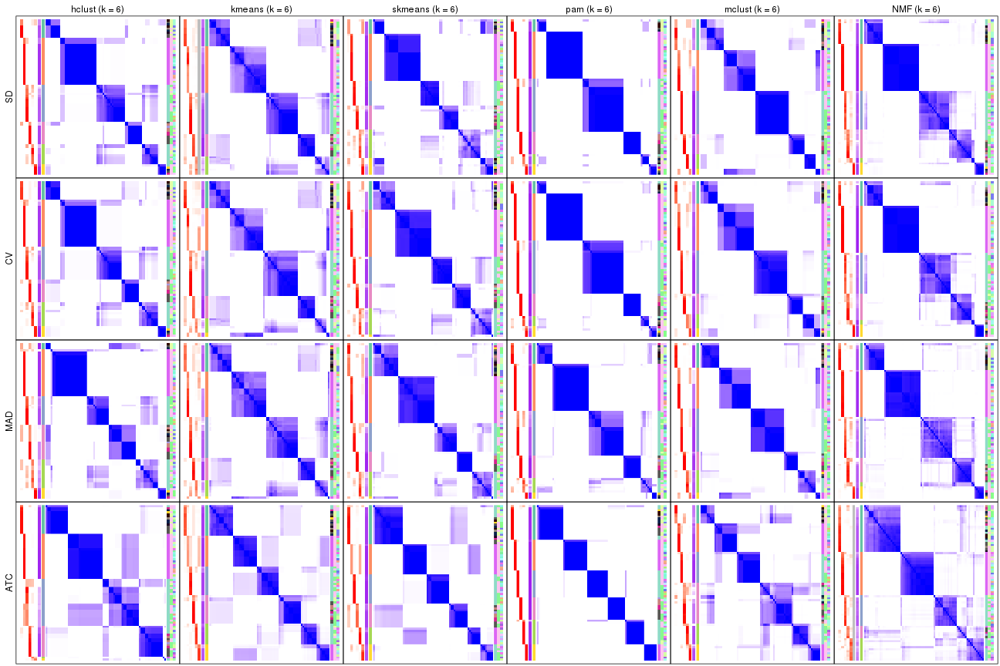</p>

</div>
</div>


### Membership heatmap

Membership heatmaps for all methods. ([What is a membership heatmap?](http://bioconductor.org/packages/devel/bioc/vignettes/cola/inst/doc/cola.html#toc_12))


<script>
$( function() {
	$( '#tabs-collect-membership-heatmap' ).tabs();
} );
</script>
<div id='tabs-collect-membership-heatmap'>
<ul>
<li><a href='#tab-collect-membership-heatmap-1'>k = 2</a></li>
<li><a href='#tab-collect-membership-heatmap-2'>k = 3</a></li>
<li><a href='#tab-collect-membership-heatmap-3'>k = 4</a></li>
<li><a href='#tab-collect-membership-heatmap-4'>k = 5</a></li>
<li><a href='#tab-collect-membership-heatmap-5'>k = 6</a></li>
</ul>
<div id='tab-collect-membership-heatmap-1'>
<pre><code class="r">collect_plots(res_list, k = 2, fun = membership_heatmap, mc.cores = 4)
</code></pre>

<p></p>

</div>
<div id='tab-collect-membership-heatmap-2'>
<pre><code class="r">collect_plots(res_list, k = 3, fun = membership_heatmap, mc.cores = 4)
</code></pre>

<p></p>

</div>
<div id='tab-collect-membership-heatmap-3'>
<pre><code class="r">collect_plots(res_list, k = 4, fun = membership_heatmap, mc.cores = 4)
</code></pre>

<p></p>

</div>
<div id='tab-collect-membership-heatmap-4'>
<pre><code class="r">collect_plots(res_list, k = 5, fun = membership_heatmap, mc.cores = 4)
</code></pre>

<p></p>

</div>
<div id='tab-collect-membership-heatmap-5'>
<pre><code class="r">collect_plots(res_list, k = 6, fun = membership_heatmap, mc.cores = 4)
</code></pre>

<p></p>

</div>
</div>


### Signature heatmap

Signature heatmaps for all methods. ([What is a signature heatmap?](http://bioconductor.org/packages/devel/bioc/vignettes/cola/inst/doc/cola.html#toc_22))


Note in following heatmaps, rows are scaled.


<script>
$( function() {
	$( '#tabs-collect-get-signatures' ).tabs();
} );
</script>
<div id='tabs-collect-get-signatures'>
<ul>
<li><a href='#tab-collect-get-signatures-1'>k = 2</a></li>
<li><a href='#tab-collect-get-signatures-2'>k = 3</a></li>
<li><a href='#tab-collect-get-signatures-3'>k = 4</a></li>
<li><a href='#tab-collect-get-signatures-4'>k = 5</a></li>
<li><a href='#tab-collect-get-signatures-5'>k = 6</a></li>
</ul>
<div id='tab-collect-get-signatures-1'>
<pre><code class="r">collect_plots(res_list, k = 2, fun = get_signatures, mc.cores = 4)
</code></pre>

<p></p>

</div>
<div id='tab-collect-get-signatures-2'>
<pre><code class="r">collect_plots(res_list, k = 3, fun = get_signatures, mc.cores = 4)
</code></pre>

<p></p>

</div>
<div id='tab-collect-get-signatures-3'>
<pre><code class="r">collect_plots(res_list, k = 4, fun = get_signatures, mc.cores = 4)
</code></pre>

<p></p>

</div>
<div id='tab-collect-get-signatures-4'>
<pre><code class="r">collect_plots(res_list, k = 5, fun = get_signatures, mc.cores = 4)
</code></pre>

<p></p>

</div>
<div id='tab-collect-get-signatures-5'>
<pre><code class="r">collect_plots(res_list, k = 6, fun = get_signatures, mc.cores = 4)
</code></pre>

<p></p>

</div>
</div>


### Statistics table

The statistics used for measuring the stability of consensus partitioning.
([How are they
defined?](http://bioconductor.org/packages/devel/bioc/vignettes/cola/inst/doc/cola.html#toc_13))


<script>
$( function() {
	$( '#tabs-get-stats-from-consensus-partition-list' ).tabs();
} );
</script>
<div id='tabs-get-stats-from-consensus-partition-list'>
<ul>
<li><a href='#tab-get-stats-from-consensus-partition-list-1'>k = 2</a></li>
<li><a href='#tab-get-stats-from-consensus-partition-list-2'>k = 3</a></li>
<li><a href='#tab-get-stats-from-consensus-partition-list-3'>k = 4</a></li>
<li><a href='#tab-get-stats-from-consensus-partition-list-4'>k = 5</a></li>
<li><a href='#tab-get-stats-from-consensus-partition-list-5'>k = 6</a></li>
</ul>
<div id='tab-get-stats-from-consensus-partition-list-1'>
<pre><code class="r">get_stats(res_list, k = 2)
</code></pre>

<pre><code>#&gt;             k 1-PAC mean_silhouette concordance area_increased  Rand Jaccard
#&gt; SD:NMF      2 0.728           0.896       0.943          0.487 0.494   0.494
#&gt; CV:NMF      2 0.728           0.849       0.928          0.480 0.495   0.495
#&gt; MAD:NMF     2 0.944           0.926       0.971          0.496 0.502   0.502
#&gt; ATC:NMF     2 1.000           0.986       0.994          0.506 0.495   0.495
#&gt; SD:skmeans  2 0.999           0.981       0.991          0.503 0.496   0.496
#&gt; CV:skmeans  2 1.000           0.993       0.996          0.504 0.496   0.496
#&gt; MAD:skmeans 2 0.872           0.956       0.979          0.499 0.502   0.502
#&gt; ATC:skmeans 2 1.000           0.981       0.993          0.500 0.499   0.499
#&gt; SD:mclust   2 1.000           1.000       1.000          0.428 0.572   0.572
#&gt; CV:mclust   2 1.000           1.000       1.000          0.428 0.572   0.572
#&gt; MAD:mclust  2 1.000           1.000       1.000          0.428 0.572   0.572
#&gt; ATC:mclust  2 0.647           0.838       0.904          0.470 0.494   0.494
#&gt; SD:kmeans   2 0.581           0.857       0.892          0.460 0.528   0.528
#&gt; CV:kmeans   2 0.581           0.864       0.860          0.459 0.528   0.528
#&gt; MAD:kmeans  2 0.581           0.853       0.899          0.465 0.522   0.522
#&gt; ATC:kmeans  2 1.000           0.989       0.995          0.489 0.511   0.511
#&gt; SD:pam      2 0.572           0.931       0.949          0.440 0.572   0.572
#&gt; CV:pam      2 1.000           0.974       0.979          0.433 0.572   0.572
#&gt; MAD:pam     2 1.000           0.991       0.996          0.485 0.516   0.516
#&gt; ATC:pam     2 0.920           0.963       0.984          0.479 0.522   0.522
#&gt; SD:hclust   2 0.500           0.673       0.856          0.462 0.499   0.499
#&gt; CV:hclust   2 0.541           0.713       0.885          0.464 0.499   0.499
#&gt; MAD:hclust  2 0.534           0.771       0.900          0.475 0.494   0.494
#&gt; ATC:hclust  2 0.918           0.941       0.975          0.484 0.522   0.522
</code></pre>

</div>
<div id='tab-get-stats-from-consensus-partition-list-2'>
<pre><code class="r">get_stats(res_list, k = 3)
</code></pre>

<pre><code>#&gt;             k 1-PAC mean_silhouette concordance area_increased  Rand Jaccard
#&gt; SD:NMF      3 1.000           0.984       0.993          0.385 0.705   0.470
#&gt; CV:NMF      3 1.000           0.991       0.996          0.405 0.704   0.469
#&gt; MAD:NMF     3 1.000           0.960       0.985          0.359 0.716   0.490
#&gt; ATC:NMF     3 0.762           0.789       0.893          0.271 0.821   0.649
#&gt; SD:skmeans  3 1.000           0.958       0.985          0.338 0.742   0.522
#&gt; CV:skmeans  3 1.000           0.964       0.986          0.336 0.728   0.504
#&gt; MAD:skmeans 3 1.000           0.945       0.980          0.349 0.740   0.522
#&gt; ATC:skmeans 3 0.782           0.917       0.917          0.296 0.828   0.661
#&gt; SD:mclust   3 1.000           0.984       0.994          0.577 0.721   0.525
#&gt; CV:mclust   3 1.000           0.984       0.994          0.577 0.720   0.524
#&gt; MAD:mclust  3 1.000           0.984       0.994          0.576 0.721   0.525
#&gt; ATC:mclust  3 0.561           0.492       0.755          0.357 0.720   0.503
#&gt; SD:kmeans   3 0.654           0.923       0.866          0.386 0.762   0.565
#&gt; CV:kmeans   3 0.727           0.963       0.923          0.423 0.762   0.565
#&gt; MAD:kmeans  3 0.728           0.952       0.916          0.404 0.754   0.550
#&gt; ATC:kmeans  3 0.660           0.736       0.868          0.332 0.828   0.670
#&gt; SD:pam      3 1.000           0.993       0.997          0.533 0.754   0.571
#&gt; CV:pam      3 1.000           0.985       0.992          0.556 0.754   0.571
#&gt; MAD:pam     3 1.000           0.991       0.996          0.390 0.779   0.584
#&gt; ATC:pam     3 1.000           0.952       0.978          0.381 0.788   0.606
#&gt; SD:hclust   3 0.546           0.827       0.814          0.375 0.696   0.462
#&gt; CV:hclust   3 0.615           0.813       0.851          0.386 0.696   0.462
#&gt; MAD:hclust  3 0.663           0.658       0.837          0.344 0.814   0.639
#&gt; ATC:hclust  3 0.772           0.764       0.885          0.259 0.915   0.837
</code></pre>

</div>
<div id='tab-get-stats-from-consensus-partition-list-3'>
<pre><code class="r">get_stats(res_list, k = 4)
</code></pre>

<pre><code>#&gt;             k 1-PAC mean_silhouette concordance area_increased  Rand Jaccard
#&gt; SD:NMF      4 0.964           0.947       0.978         0.1055 0.890   0.681
#&gt; CV:NMF      4 1.000           0.949       0.979         0.1036 0.890   0.681
#&gt; MAD:NMF     4 0.963           0.918       0.968         0.1020 0.883   0.664
#&gt; ATC:NMF     4 0.794           0.787       0.888         0.1504 0.807   0.510
#&gt; SD:skmeans  4 1.000           0.980       0.989         0.1056 0.908   0.727
#&gt; CV:skmeans  4 1.000           0.977       0.984         0.1061 0.897   0.698
#&gt; MAD:skmeans 4 0.862           0.929       0.932         0.1072 0.897   0.698
#&gt; ATC:skmeans 4 1.000           0.967       0.978         0.0971 0.933   0.806
#&gt; SD:mclust   4 0.897           0.797       0.896         0.0862 0.939   0.814
#&gt; CV:mclust   4 0.886           0.892       0.936         0.0757 0.938   0.813
#&gt; MAD:mclust  4 0.870           0.856       0.913         0.0790 0.939   0.814
#&gt; ATC:mclust  4 0.723           0.755       0.869         0.1662 0.773   0.451
#&gt; SD:kmeans   4 0.829           0.864       0.840         0.1325 0.914   0.745
#&gt; CV:kmeans   4 0.811           0.718       0.819         0.1090 0.936   0.807
#&gt; MAD:kmeans  4 0.827           0.831       0.801         0.1083 0.964   0.896
#&gt; ATC:kmeans  4 0.687           0.411       0.669         0.1184 0.876   0.688
#&gt; SD:pam      4 1.000           0.986       0.995         0.0953 0.934   0.799
#&gt; CV:pam      4 1.000           0.969       0.989         0.0928 0.920   0.762
#&gt; MAD:pam     4 1.000           0.988       0.995         0.0964 0.934   0.799
#&gt; ATC:pam     4 0.743           0.733       0.792         0.1289 0.794   0.483
#&gt; SD:hclust   4 0.684           0.814       0.895         0.1129 0.952   0.854
#&gt; CV:hclust   4 0.713           0.805       0.873         0.0778 0.965   0.893
#&gt; MAD:hclust  4 0.702           0.762       0.845         0.0947 0.793   0.501
#&gt; ATC:hclust  4 0.785           0.755       0.875         0.0274 0.974   0.942
</code></pre>

</div>
<div id='tab-get-stats-from-consensus-partition-list-4'>
<pre><code class="r">get_stats(res_list, k = 5)
</code></pre>

<pre><code>#&gt;             k 1-PAC mean_silhouette concordance area_increased  Rand Jaccard
#&gt; SD:NMF      5 0.940           0.898       0.946         0.0425 0.921   0.716
#&gt; CV:NMF      5 0.956           0.908       0.950         0.0434 0.921   0.716
#&gt; MAD:NMF     5 0.889           0.866       0.916         0.0474 0.907   0.675
#&gt; ATC:NMF     5 0.796           0.686       0.828         0.0508 0.954   0.824
#&gt; SD:skmeans  5 0.883           0.845       0.916         0.0608 0.931   0.737
#&gt; CV:skmeans  5 0.893           0.839       0.918         0.0593 0.938   0.761
#&gt; MAD:skmeans 5 0.899           0.826       0.912         0.0604 0.931   0.737
#&gt; ATC:skmeans 5 0.878           0.924       0.875         0.0774 0.924   0.735
#&gt; SD:mclust   5 0.956           0.875       0.946         0.0621 0.907   0.686
#&gt; CV:mclust   5 0.955           0.903       0.957         0.0729 0.915   0.707
#&gt; MAD:mclust  5 0.979           0.958       0.977         0.0706 0.914   0.701
#&gt; ATC:mclust  5 0.781           0.735       0.854         0.0519 0.927   0.723
#&gt; SD:kmeans   5 0.796           0.768       0.814         0.0662 0.976   0.908
#&gt; CV:kmeans   5 0.793           0.804       0.820         0.0610 0.940   0.797
#&gt; MAD:kmeans  5 0.771           0.733       0.796         0.0648 0.909   0.723
#&gt; ATC:kmeans  5 0.694           0.808       0.798         0.0704 0.818   0.469
#&gt; SD:pam      5 1.000           0.992       0.998         0.0288 0.979   0.919
#&gt; CV:pam      5 1.000           0.990       0.997         0.0312 0.968   0.881
#&gt; MAD:pam     5 0.993           0.969       0.984         0.0281 0.982   0.930
#&gt; ATC:pam     5 0.950           0.916       0.961         0.0796 0.850   0.493
#&gt; SD:hclust   5 0.727           0.766       0.841         0.0768 0.914   0.709
#&gt; CV:hclust   5 0.743           0.784       0.846         0.0869 0.933   0.769
#&gt; MAD:hclust  5 0.848           0.778       0.891         0.0920 0.953   0.829
#&gt; ATC:hclust  5 0.737           0.797       0.897         0.1074 0.820   0.597
</code></pre>

</div>
<div id='tab-get-stats-from-consensus-partition-list-5'>
<pre><code class="r">get_stats(res_list, k = 6)
</code></pre>

<pre><code>#&gt;             k 1-PAC mean_silhouette concordance area_increased  Rand Jaccard
#&gt; SD:NMF      6 0.876           0.809       0.892         0.0294 0.970   0.871
#&gt; CV:NMF      6 0.894           0.811       0.887         0.0307 0.981   0.918
#&gt; MAD:NMF     6 0.872           0.773       0.885         0.0283 0.980   0.913
#&gt; ATC:NMF     6 0.784           0.717       0.824         0.0261 0.967   0.863
#&gt; SD:skmeans  6 0.879           0.750       0.837         0.0301 0.964   0.828
#&gt; CV:skmeans  6 0.888           0.710       0.865         0.0293 0.971   0.866
#&gt; MAD:skmeans 6 0.884           0.713       0.873         0.0306 0.978   0.898
#&gt; ATC:skmeans 6 0.863           0.901       0.863         0.0422 0.949   0.763
#&gt; SD:mclust   6 0.873           0.688       0.855         0.0380 0.979   0.905
#&gt; CV:mclust   6 0.883           0.852       0.874         0.0345 0.985   0.931
#&gt; MAD:mclust  6 0.863           0.769       0.887         0.0420 0.972   0.873
#&gt; ATC:mclust  6 0.809           0.712       0.874         0.0496 0.910   0.619
#&gt; SD:kmeans   6 0.754           0.732       0.786         0.0430 0.959   0.834
#&gt; CV:kmeans   6 0.733           0.438       0.752         0.0425 0.940   0.772
#&gt; MAD:kmeans  6 0.735           0.540       0.794         0.0405 0.937   0.754
#&gt; ATC:kmeans  6 0.755           0.858       0.835         0.0451 0.957   0.788
#&gt; SD:pam      6 0.959           0.925       0.954         0.0185 0.977   0.907
#&gt; CV:pam      6 0.955           0.945       0.965         0.0146 0.977   0.907
#&gt; MAD:pam     6 0.908           0.844       0.919         0.0484 0.960   0.839
#&gt; ATC:pam     6 1.000           0.965       0.986         0.0375 0.935   0.693
#&gt; SD:hclust   6 0.848           0.790       0.904         0.0548 0.965   0.848
#&gt; CV:hclust   6 0.893           0.816       0.908         0.0708 0.965   0.845
#&gt; MAD:hclust  6 0.846           0.683       0.838         0.0434 0.921   0.696
#&gt; ATC:hclust  6 0.815           0.716       0.881         0.0937 0.865   0.587
</code></pre>

</div>
</div>

Following heatmap plots the partition for each combination of methods and the
lightness correspond to the silhouette scores for samples in each method. On
top the consensus subgroup is inferred from all methods by taking the mean
silhouette scores as weight.


<script>
$( function() {
	$( '#tabs-collect-stats-from-consensus-partition-list' ).tabs();
} );
</script>
<div id='tabs-collect-stats-from-consensus-partition-list'>
<ul>
<li><a href='#tab-collect-stats-from-consensus-partition-list-1'>k = 2</a></li>
<li><a href='#tab-collect-stats-from-consensus-partition-list-2'>k = 3</a></li>
<li><a href='#tab-collect-stats-from-consensus-partition-list-3'>k = 4</a></li>
<li><a href='#tab-collect-stats-from-consensus-partition-list-4'>k = 5</a></li>
<li><a href='#tab-collect-stats-from-consensus-partition-list-5'>k = 6</a></li>
</ul>
<div id='tab-collect-stats-from-consensus-partition-list-1'>
<pre><code class="r">collect_stats(res_list, k = 2)
</code></pre>

<p></p>

</div>
<div id='tab-collect-stats-from-consensus-partition-list-2'>
<pre><code class="r">collect_stats(res_list, k = 3)
</code></pre>

<p>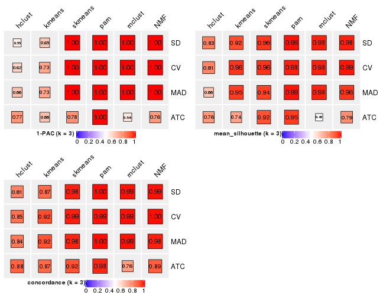</p>

</div>
<div id='tab-collect-stats-from-consensus-partition-list-3'>
<pre><code class="r">collect_stats(res_list, k = 4)
</code></pre>

<p></p>

</div>
<div id='tab-collect-stats-from-consensus-partition-list-4'>
<pre><code class="r">collect_stats(res_list, k = 5)
</code></pre>

<p></p>

</div>
<div id='tab-collect-stats-from-consensus-partition-list-5'>
<pre><code class="r">collect_stats(res_list, k = 6)
</code></pre>

<p></p>

</div>
</div>

### Partition from all methods


Collect partitions from all methods:


<script>
$( function() {
	$( '#tabs-collect-classes-from-consensus-partition-list' ).tabs();
} );
</script>
<div id='tabs-collect-classes-from-consensus-partition-list'>
<ul>
<li><a href='#tab-collect-classes-from-consensus-partition-list-1'>k = 2</a></li>
<li><a href='#tab-collect-classes-from-consensus-partition-list-2'>k = 3</a></li>
<li><a href='#tab-collect-classes-from-consensus-partition-list-3'>k = 4</a></li>
<li><a href='#tab-collect-classes-from-consensus-partition-list-4'>k = 5</a></li>
<li><a href='#tab-collect-classes-from-consensus-partition-list-5'>k = 6</a></li>
</ul>
<div id='tab-collect-classes-from-consensus-partition-list-1'>
<pre><code class="r">collect_classes(res_list, k = 2)
</code></pre>

<p></p>

</div>
<div id='tab-collect-classes-from-consensus-partition-list-2'>
<pre><code class="r">collect_classes(res_list, k = 3)
</code></pre>

<p></p>

</div>
<div id='tab-collect-classes-from-consensus-partition-list-3'>
<pre><code class="r">collect_classes(res_list, k = 4)
</code></pre>

<p></p>

</div>
<div id='tab-collect-classes-from-consensus-partition-list-4'>
<pre><code class="r">collect_classes(res_list, k = 5)
</code></pre>

<p></p>

</div>
<div id='tab-collect-classes-from-consensus-partition-list-5'>
<pre><code class="r">collect_classes(res_list, k = 6)
</code></pre>

<p></p>

</div>
</div>


### Top rows overlap


Overlap of top rows from different top-row methods:


<script>
$( function() {
	$( '#tabs-top-rows-overlap-by-euler' ).tabs();
} );
</script>
<div id='tabs-top-rows-overlap-by-euler'>
<ul>
<li><a href='#tab-top-rows-overlap-by-euler-1'>top_n = 1000</a></li>
<li><a href='#tab-top-rows-overlap-by-euler-2'>top_n = 2000</a></li>
<li><a href='#tab-top-rows-overlap-by-euler-3'>top_n = 3000</a></li>
<li><a href='#tab-top-rows-overlap-by-euler-4'>top_n = 4000</a></li>
<li><a href='#tab-top-rows-overlap-by-euler-5'>top_n = 5000</a></li>
</ul>
<div id='tab-top-rows-overlap-by-euler-1'>
<pre><code class="r">top_rows_overlap(res_list, top_n = 1000, method = &quot;euler&quot;)
</code></pre>

<p></p>

</div>
<div id='tab-top-rows-overlap-by-euler-2'>
<pre><code class="r">top_rows_overlap(res_list, top_n = 2000, method = &quot;euler&quot;)
</code></pre>

<p></p>

</div>
<div id='tab-top-rows-overlap-by-euler-3'>
<pre><code class="r">top_rows_overlap(res_list, top_n = 3000, method = &quot;euler&quot;)
</code></pre>

<p></p>

</div>
<div id='tab-top-rows-overlap-by-euler-4'>
<pre><code class="r">top_rows_overlap(res_list, top_n = 4000, method = &quot;euler&quot;)
</code></pre>

<p></p>

</div>
<div id='tab-top-rows-overlap-by-euler-5'>
<pre><code class="r">top_rows_overlap(res_list, top_n = 5000, method = &quot;euler&quot;)
</code></pre>

<p></p>

</div>
</div>

Also visualize the correspondance of rankings between different top-row methods:


<script>
$( function() {
	$( '#tabs-top-rows-overlap-by-correspondance' ).tabs();
} );
</script>
<div id='tabs-top-rows-overlap-by-correspondance'>
<ul>
<li><a href='#tab-top-rows-overlap-by-correspondance-1'>top_n = 1000</a></li>
<li><a href='#tab-top-rows-overlap-by-correspondance-2'>top_n = 2000</a></li>
<li><a href='#tab-top-rows-overlap-by-correspondance-3'>top_n = 3000</a></li>
<li><a href='#tab-top-rows-overlap-by-correspondance-4'>top_n = 4000</a></li>
<li><a href='#tab-top-rows-overlap-by-correspondance-5'>top_n = 5000</a></li>
</ul>
<div id='tab-top-rows-overlap-by-correspondance-1'>
<pre><code class="r">top_rows_overlap(res_list, top_n = 1000, method = &quot;correspondance&quot;)
</code></pre>

<p></p>

</div>
<div id='tab-top-rows-overlap-by-correspondance-2'>
<pre><code class="r">top_rows_overlap(res_list, top_n = 2000, method = &quot;correspondance&quot;)
</code></pre>

<p></p>

</div>
<div id='tab-top-rows-overlap-by-correspondance-3'>
<pre><code class="r">top_rows_overlap(res_list, top_n = 3000, method = &quot;correspondance&quot;)
</code></pre>

<p></p>

</div>
<div id='tab-top-rows-overlap-by-correspondance-4'>
<pre><code class="r">top_rows_overlap(res_list, top_n = 4000, method = &quot;correspondance&quot;)
</code></pre>

<p></p>

</div>
<div id='tab-top-rows-overlap-by-correspondance-5'>
<pre><code class="r">top_rows_overlap(res_list, top_n = 5000, method = &quot;correspondance&quot;)
</code></pre>

<p>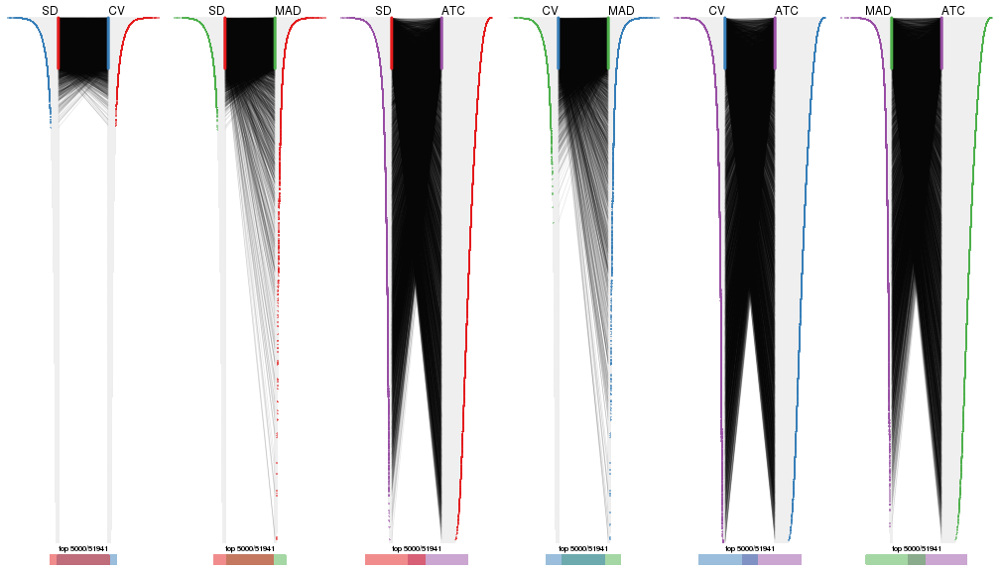</p>

</div>
</div>


Heatmaps of the top rows:


<script>
$( function() {
	$( '#tabs-top-rows-heatmap' ).tabs();
} );
</script>
<div id='tabs-top-rows-heatmap'>
<ul>
<li><a href='#tab-top-rows-heatmap-1'>top_n = 1000</a></li>
<li><a href='#tab-top-rows-heatmap-2'>top_n = 2000</a></li>
<li><a href='#tab-top-rows-heatmap-3'>top_n = 3000</a></li>
<li><a href='#tab-top-rows-heatmap-4'>top_n = 4000</a></li>
<li><a href='#tab-top-rows-heatmap-5'>top_n = 5000</a></li>
</ul>
<div id='tab-top-rows-heatmap-1'>
<pre><code class="r">top_rows_heatmap(res_list, top_n = 1000)
</code></pre>

<p></p>

</div>
<div id='tab-top-rows-heatmap-2'>
<pre><code class="r">top_rows_heatmap(res_list, top_n = 2000)
</code></pre>

<p></p>

</div>
<div id='tab-top-rows-heatmap-3'>
<pre><code class="r">top_rows_heatmap(res_list, top_n = 3000)
</code></pre>

<p></p>

</div>
<div id='tab-top-rows-heatmap-4'>
<pre><code class="r">top_rows_heatmap(res_list, top_n = 4000)
</code></pre>

<p></p>

</div>
<div id='tab-top-rows-heatmap-5'>
<pre><code class="r">top_rows_heatmap(res_list, top_n = 5000)
</code></pre>

<p></p>

</div>
</div>


### Test to known annotations


Test correlation between subgroups and known annotations. If the known
annotation is numeric, one-way ANOVA test is applied, and if the known
annotation is discrete, chi-squared contingency table test is applied.


<script>
$( function() {
	$( '#tabs-test-to-known-factors-from-consensus-partition-list' ).tabs();
} );
</script>
<div id='tabs-test-to-known-factors-from-consensus-partition-list'>
<ul>
<li><a href='#tab-test-to-known-factors-from-consensus-partition-list-1'>k = 2</a></li>
<li><a href='#tab-test-to-known-factors-from-consensus-partition-list-2'>k = 3</a></li>
<li><a href='#tab-test-to-known-factors-from-consensus-partition-list-3'>k = 4</a></li>
<li><a href='#tab-test-to-known-factors-from-consensus-partition-list-4'>k = 5</a></li>
<li><a href='#tab-test-to-known-factors-from-consensus-partition-list-5'>k = 6</a></li>
</ul>
<div id='tab-test-to-known-factors-from-consensus-partition-list-1'>
<pre><code class="r">test_to_known_factors(res_list, k = 2)
</code></pre>

<pre><code>#&gt;              n tissue(p) genotype/variation(p) individual(p) k
#&gt; SD:NMF      75  9.06e-07              7.59e-04       0.05134 2
#&gt; CV:NMF      71  5.52e-07              3.65e-04       0.07133 2
#&gt; MAD:NMF     73  2.16e-07              4.52e-03       0.05241 2
#&gt; ATC:NMF     76  6.80e-07              5.88e-04       0.02667 2
#&gt; SD:skmeans  76  4.99e-07              1.61e-03       0.08034 2
#&gt; CV:skmeans  76  4.99e-07              1.61e-03       0.08034 2
#&gt; MAD:skmeans 76  1.95e-07              1.24e-03       0.03728 2
#&gt; ATC:skmeans 75  2.44e-07              6.76e-04       0.01807 2
#&gt; SD:mclust   76  3.04e-12              1.17e-05       0.99018 2
#&gt; CV:mclust   76  3.04e-12              1.17e-05       0.99018 2
#&gt; MAD:mclust  76  3.04e-12              1.17e-05       0.99018 2
#&gt; ATC:mclust  75  9.46e-07              2.26e-04       0.00555 2
#&gt; SD:kmeans   76  2.17e-09              6.67e-03       0.08617 2
#&gt; CV:kmeans   76  2.17e-09              6.67e-03       0.08617 2
#&gt; MAD:kmeans  75  3.12e-09              6.64e-03       0.06583 2
#&gt; ATC:kmeans  76  4.83e-08              9.05e-03       0.01639 2
#&gt; SD:pam      76  3.04e-12              1.17e-05       0.99018 2
#&gt; CV:pam      76  3.04e-12              1.17e-05       0.99018 2
#&gt; MAD:pam     76  1.98e-08              5.13e-03       0.07094 2
#&gt; ATC:pam     75  3.12e-09              7.87e-03       0.05269 2
#&gt; SD:hclust   60  3.62e-09              4.36e-05       0.33194 2
#&gt; CV:hclust   60  3.62e-09              4.36e-05       0.33194 2
#&gt; MAD:hclust  67  5.18e-08              4.00e-03       0.05106 2
#&gt; ATC:hclust  76  7.07e-09              1.08e-02       0.03990 2
</code></pre>

</div>
<div id='tab-test-to-known-factors-from-consensus-partition-list-2'>
<pre><code class="r">test_to_known_factors(res_list, k = 3)
</code></pre>

<pre><code>#&gt;              n tissue(p) genotype/variation(p) individual(p) k
#&gt; SD:NMF      76  2.85e-20              4.94e-05        0.9774 3
#&gt; CV:NMF      76  2.85e-20              4.94e-05        0.9774 3
#&gt; MAD:NMF     75  8.78e-20              1.03e-04        0.9544 3
#&gt; ATC:NMF     69  2.81e-11              2.74e-05        0.2811 3
#&gt; SD:skmeans  74  1.34e-18              5.42e-06        0.9028 3
#&gt; CV:skmeans  74  1.34e-18              5.42e-06        0.9460 3
#&gt; MAD:skmeans 73  4.09e-19              1.27e-05        0.9240 3
#&gt; ATC:skmeans 76  3.46e-15              4.51e-06        0.6508 3
#&gt; SD:mclust   75  7.59e-20              1.17e-05        0.9573 3
#&gt; CV:mclust   75  7.59e-20              1.17e-05        0.9573 3
#&gt; MAD:mclust  75  7.59e-20              9.30e-06        0.9375 3
#&gt; ATC:mclust  38  3.80e-05              7.26e-04        0.0730 3
#&gt; SD:kmeans   76  2.85e-20              4.94e-05        0.9774 3
#&gt; CV:kmeans   76  2.85e-20              4.94e-05        0.9774 3
#&gt; MAD:kmeans  76  2.85e-20              4.94e-05        0.9774 3
#&gt; ATC:kmeans  72  3.14e-09              4.42e-05        0.0659 3
#&gt; SD:pam      76  1.53e-18              5.88e-06        0.8922 3
#&gt; CV:pam      76  1.53e-18              5.88e-06        0.8922 3
#&gt; MAD:pam     76  1.53e-18              5.88e-06        0.8922 3
#&gt; ATC:pam     74  5.34e-09              2.94e-04        0.0275 3
#&gt; SD:hclust   76  3.01e-21              5.75e-05        0.9916 3
#&gt; CV:hclust   75  7.29e-21              3.97e-05        0.9850 3
#&gt; MAD:hclust  56  2.05e-13              5.07e-04        0.7699 3
#&gt; ATC:hclust  66  1.14e-06              1.17e-03        0.0758 3
</code></pre>

</div>
<div id='tab-test-to-known-factors-from-consensus-partition-list-3'>
<pre><code class="r">test_to_known_factors(res_list, k = 4)
</code></pre>

<pre><code>#&gt;              n tissue(p) genotype/variation(p) individual(p) k
#&gt; SD:NMF      75  2.38e-19              2.57e-09       0.35834 4
#&gt; CV:NMF      75  2.38e-19              2.57e-09       0.35834 4
#&gt; MAD:NMF     72  1.27e-18              1.47e-09       0.43483 4
#&gt; ATC:NMF     69  5.57e-12              1.44e-07       0.07401 4
#&gt; SD:skmeans  76  2.32e-19              1.01e-09       0.19775 4
#&gt; CV:skmeans  75  1.27e-19              7.10e-10       0.23558 4
#&gt; MAD:skmeans 76  2.32e-19              1.01e-09       0.19775 4
#&gt; ATC:skmeans 75  4.45e-13              8.70e-06       0.64634 4
#&gt; SD:mclust   70  3.18e-21              5.89e-06       0.05217 4
#&gt; CV:mclust   75  7.56e-19              1.95e-06       0.33661 4
#&gt; MAD:mclust  74  1.89e-18              1.21e-06       0.30257 4
#&gt; ATC:mclust  64  3.06e-13              1.80e-03       0.63962 4
#&gt; SD:kmeans   74  3.63e-22              8.85e-09       0.40324 4
#&gt; CV:kmeans   59  1.29e-20              2.34e-05       0.99777 4
#&gt; MAD:kmeans  74  1.68e-19              2.77e-05       0.93779 4
#&gt; ATC:kmeans  43  2.49e-07              1.70e-02       0.62474 4
#&gt; SD:pam      75  1.05e-21              2.27e-09       0.35473 4
#&gt; CV:pam      75  1.05e-21              2.27e-09       0.35473 4
#&gt; MAD:pam     76  2.37e-21              6.19e-10       0.30079 4
#&gt; ATC:pam     71  1.14e-09              4.02e-07       0.00123 4
#&gt; SD:hclust   73  2.26e-20              7.84e-05       0.48736 4
#&gt; CV:hclust   75  8.41e-21              7.24e-06       0.38164 4
#&gt; MAD:hclust  63  7.21e-16              5.29e-06       0.08542 4
#&gt; ATC:hclust  66  1.14e-06              1.17e-03       0.07584 4
</code></pre>

</div>
<div id='tab-test-to-known-factors-from-consensus-partition-list-4'>
<pre><code class="r">test_to_known_factors(res_list, k = 5)
</code></pre>

<pre><code>#&gt;              n tissue(p) genotype/variation(p) individual(p) k
#&gt; SD:NMF      73  1.10e-15              1.63e-10       0.00382 5
#&gt; CV:NMF      74  3.99e-16              2.12e-10       0.00344 5
#&gt; MAD:NMF     73  2.39e-16              1.68e-10       0.00524 5
#&gt; ATC:NMF     64  4.15e-12              6.46e-06       0.05676 5
#&gt; SD:skmeans  72  1.53e-16              5.37e-08       0.30822 5
#&gt; CV:skmeans  72  1.53e-16              2.67e-08       0.43016 5
#&gt; MAD:skmeans 70  1.75e-15              6.17e-09       0.50003 5
#&gt; ATC:skmeans 75  1.44e-15              8.32e-09       0.13567 5
#&gt; SD:mclust   69  3.53e-21              6.70e-12       0.67679 5
#&gt; CV:mclust   70  2.94e-20              4.72e-11       0.67366 5
#&gt; MAD:mclust  76  2.61e-18              6.72e-11       0.21672 5
#&gt; ATC:mclust  66  6.83e-11              2.24e-04       0.38834 5
#&gt; SD:kmeans   71  4.64e-23              3.14e-09       0.37776 5
#&gt; CV:kmeans   72  2.68e-22              1.67e-09       0.44843 5
#&gt; MAD:kmeans  69  2.29e-18              8.80e-11       0.77692 5
#&gt; ATC:kmeans  73  4.38e-16              3.16e-07       0.30648 5
#&gt; SD:pam      76  1.33e-21              7.96e-12       0.01272 5
#&gt; CV:pam      76  1.33e-21              7.96e-12       0.01272 5
#&gt; MAD:pam     76  1.78e-21              4.53e-11       0.03977 5
#&gt; ATC:pam     74  3.66e-13              5.00e-08       0.11876 5
#&gt; SD:hclust   66  3.13e-14              1.39e-05       0.40926 5
#&gt; CV:hclust   71  8.82e-16              4.97e-06       0.37955 5
#&gt; MAD:hclust  69  4.90e-15              8.72e-06       0.34407 5
#&gt; ATC:hclust  67  1.87e-08              1.50e-06       0.14910 5
</code></pre>

</div>
<div id='tab-test-to-known-factors-from-consensus-partition-list-5'>
<pre><code class="r">test_to_known_factors(res_list, k = 6)
</code></pre>

<pre><code>#&gt;              n tissue(p) genotype/variation(p) individual(p) k
#&gt; SD:NMF      70  8.36e-15              7.54e-12       0.00195 6
#&gt; CV:NMF      71  2.05e-15              6.30e-11       0.00141 6
#&gt; MAD:NMF     70  6.20e-15              7.01e-11       0.00572 6
#&gt; ATC:NMF     64  1.02e-12              4.42e-07       0.14454 6
#&gt; SD:skmeans  65  7.63e-17              9.59e-09       0.02696 6
#&gt; CV:skmeans  61  3.24e-16              1.74e-10       0.54070 6
#&gt; MAD:skmeans 62  1.16e-16              2.11e-10       0.40770 6
#&gt; ATC:skmeans 75  8.81e-13              5.80e-08       0.17147 6
#&gt; SD:mclust   63  5.19e-13              3.51e-07       0.59266 6
#&gt; CV:mclust   73  2.08e-21              4.96e-12       0.31037 6
#&gt; MAD:mclust  67  2.82e-12              1.34e-08       0.22034 6
#&gt; ATC:mclust  64  5.59e-14              8.52e-06       0.24640 6
#&gt; SD:kmeans   65  7.31e-17              4.69e-08       0.70071 6
#&gt; CV:kmeans   44  1.51e-08              7.26e-04       0.22722 6
#&gt; MAD:kmeans  55  9.35e-13              1.28e-06       0.29751 6
#&gt; ATC:kmeans  71  1.95e-14              2.53e-07       0.25106 6
#&gt; SD:pam      74  1.82e-26              7.00e-12       0.02659 6
#&gt; CV:pam      75  2.04e-24              1.54e-12       0.00838 6
#&gt; MAD:pam     70  3.68e-20              1.67e-08       0.10086 6
#&gt; ATC:pam     74  8.94e-15              7.17e-08       0.27272 6
#&gt; SD:hclust   69  4.18e-18              1.04e-10       0.14865 6
#&gt; CV:hclust   70  9.51e-19              6.55e-10       0.12403 6
#&gt; MAD:hclust  60  1.39e-16              4.82e-13       0.22968 6
#&gt; ATC:hclust  51  1.84e-08              3.77e-07       0.39669 6
</code></pre>

</div>
</div>


 
## Results for each method


---------------------------------------------------


### SD:hclust


The object with results only for a single top-value method and a single partition method 
can be extracted as:

```r
res = res_list["SD", "hclust"]
# you can also extract it by
# res = res_list["SD:hclust"]
```

A summary of `res` and all the functions that can be applied to it:

```r
res
```

```
#> A 'ConsensusPartition' object with k = 2, 3, 4, 5, 6.
#>   On a matrix with 51941 rows and 76 columns.
#>   Top rows (1000, 2000, 3000, 4000, 5000) are extracted by 'SD' method.
#>   Subgroups are detected by 'hclust' method.
#>   Performed in total 1250 partitions by row resampling.
#>   Best k for subgroups seems to be 6.
#> 
#> Following methods can be applied to this 'ConsensusPartition' object:
#>  [1] "cola_report"             "collect_classes"         "collect_plots"          
#>  [4] "collect_stats"           "colnames"                "compare_signatures"     
#>  [7] "consensus_heatmap"       "dimension_reduction"     "functional_enrichment"  
#> [10] "get_anno_col"            "get_anno"                "get_classes"            
#> [13] "get_consensus"           "get_matrix"              "get_membership"         
#> [16] "get_param"               "get_signatures"          "get_stats"              
#> [19] "is_best_k"               "is_stable_k"             "membership_heatmap"     
#> [22] "ncol"                    "nrow"                    "plot_ecdf"              
#> [25] "rownames"                "select_partition_number" "show"                   
#> [28] "suggest_best_k"          "test_to_known_factors"
```

`collect_plots()` function collects all the plots made from `res` for all `k` (number of partitions)
into one single page to provide an easy and fast comparison between different `k`.

```r
collect_plots(res)
```


The plots are:

- The first row: a plot of the ECDF (empirical cumulative distribution
  function) curves of the consensus matrix for each `k` and the heatmap of
  predicted classes for each `k`.
- The second row: heatmaps of the consensus matrix for each `k`.
- The third row: heatmaps of the membership matrix for each `k`.
- The fouth row: heatmaps of the signatures for each `k`.

All the plots in panels can be made by individual functions and they are
plotted later in this section.

`select_partition_number()` produces several plots showing different
statistics for choosing "optimized" `k`. There are following statistics:

- ECDF curves of the consensus matrix for each `k`;
- 1-PAC. [The PAC
  score](https://en.wikipedia.org/wiki/Consensus_clustering#Over-interpretation_potential_of_consensus_clustering)
  measures the proportion of the ambiguous subgrouping.
- Mean silhouette score.
- Concordance. The mean probability of fiting the consensus class ids in all
  partitions.
- Area increased. Denote $A_k$ as the area under the ECDF curve for current
  `k`, the area increased is defined as $A_k - A_{k-1}$.
- Rand index. The percent of pairs of samples that are both in a same cluster
  or both are not in a same cluster in the partition of k and k-1.
- Jaccard index. The ratio of pairs of samples are both in a same cluster in
  the partition of k and k-1 and the pairs of samples are both in a same
  cluster in the partition k or k-1.

The detailed explanations of these statistics can be found in [the _cola_
vignette](http://bioconductor.org/packages/devel/bioc/vignettes/cola/inst/doc/cola.html#toc_13).

Generally speaking, lower PAC score, higher mean silhouette score or higher
concordance corresponds to better partition. Rand index and Jaccard index
measure how similar the current partition is compared to partition with `k-1`.
If they are too similar, we won't accept `k` is better than `k-1`.

```r
select_partition_number(res)
```


The numeric values for all these statistics can be obtained by `get_stats()`.

```r
get_stats(res)
```

```
#>   k 1-PAC mean_silhouette concordance area_increased  Rand Jaccard
#> 2 2 0.500           0.673       0.856         0.4615 0.499   0.499
#> 3 3 0.546           0.827       0.814         0.3753 0.696   0.462
#> 4 4 0.684           0.814       0.895         0.1129 0.952   0.854
#> 5 5 0.727           0.766       0.841         0.0768 0.914   0.709
#> 6 6 0.848           0.790       0.904         0.0548 0.965   0.848
```

`suggest_best_k()` suggests the best $k$ based on these statistics. The rules are as follows:

- All $k$ with Jaccard index larger than 0.95 are removed because increasing
  $k$ does not provide enough extra information. If all $k$ are removed, it is
  marked as no subgroup is detected.
- For all $k$ with 1-PAC score larger than 0.9, the maximal $k$ is taken as
  the best $k$, and other $k$ are marked as optional $k$.
- If it does not fit the second rule. The $k$ with the maximal vote of the
  highest 1-PAC score, highest mean silhouette, and highest concordance is
  taken as the best $k$.

```r
suggest_best_k(res)
```

```
#> [1] 6
```


Following shows the table of the partitions (You need to click the **show/hide
code output** link to see it). The membership matrix (columns with name `p*`)
is inferred by
[`clue::cl_consensus()`](https://www.rdocumentation.org/link/cl_consensus?package=clue)
function with the `SE` method. Basically the value in the membership matrix
represents the probability to belong to a certain group. The finall class
label for an item is determined with the group with highest probability it
belongs to.

In `get_classes()` function, the entropy is calculated from the membership
matrix and the silhouette score is calculated from the consensus matrix.


<script>
$( function() {
	$( '#tabs-SD-hclust-get-classes' ).tabs();
} );
</script>
<div id='tabs-SD-hclust-get-classes'>
<ul>
<li><a href='#tab-SD-hclust-get-classes-1'>k = 2</a></li>
<li><a href='#tab-SD-hclust-get-classes-2'>k = 3</a></li>
<li><a href='#tab-SD-hclust-get-classes-3'>k = 4</a></li>
<li><a href='#tab-SD-hclust-get-classes-4'>k = 5</a></li>
<li><a href='#tab-SD-hclust-get-classes-5'>k = 6</a></li>
</ul>

<div id='tab-SD-hclust-get-classes-1'>
<p><a id='tab-SD-hclust-get-classes-1-a' style='color:#0366d6' href='#'>show/hide code output</a></p>
<pre><code class="r">cbind(get_classes(res, k = 2), get_membership(res, k = 2))
</code></pre>

<pre><code>#&gt;           class entropy silhouette    p1    p2
#&gt; GSM905004     1   0.949     0.4202 0.632 0.368
#&gt; GSM905024     1   0.416     0.7944 0.916 0.084
#&gt; GSM905038     1   0.871     0.5905 0.708 0.292
#&gt; GSM905043     1   0.416     0.7944 0.916 0.084
#&gt; GSM904986     2   0.983     0.3179 0.424 0.576
#&gt; GSM904991     1   0.861     0.6038 0.716 0.284
#&gt; GSM904994     2   0.983     0.3179 0.424 0.576
#&gt; GSM904996     2   0.983     0.3179 0.424 0.576
#&gt; GSM905007     1   0.861     0.6038 0.716 0.284
#&gt; GSM905012     2   0.983     0.3179 0.424 0.576
#&gt; GSM905022     1   0.998     0.0593 0.528 0.472
#&gt; GSM905026     2   0.993     0.2287 0.452 0.548
#&gt; GSM905027     1   0.990     0.1923 0.560 0.440
#&gt; GSM905031     2   0.983     0.3179 0.424 0.576
#&gt; GSM905036     1   0.866     0.5975 0.712 0.288
#&gt; GSM905041     1   0.855     0.6093 0.720 0.280
#&gt; GSM905044     2   0.991     0.2573 0.444 0.556
#&gt; GSM904989     2   0.990     0.2701 0.440 0.560
#&gt; GSM904999     1   0.985     0.2363 0.572 0.428
#&gt; GSM905002     2   0.990     0.2705 0.440 0.560
#&gt; GSM905009     2   0.983     0.3179 0.424 0.576
#&gt; GSM905014     1   0.861     0.6038 0.716 0.284
#&gt; GSM905017     1   0.985     0.2363 0.572 0.428
#&gt; GSM905020     2   0.983     0.3179 0.424 0.576
#&gt; GSM905023     1   0.866     0.5975 0.712 0.288
#&gt; GSM905029     1   0.866     0.5975 0.712 0.288
#&gt; GSM905032     1   0.855     0.6093 0.720 0.280
#&gt; GSM905034     1   0.416     0.7944 0.916 0.084
#&gt; GSM905040     1   0.000     0.8281 1.000 0.000
#&gt; GSM904985     2   0.000     0.8011 0.000 1.000
#&gt; GSM904988     2   0.000     0.8011 0.000 1.000
#&gt; GSM904990     2   0.000     0.8011 0.000 1.000
#&gt; GSM904992     2   0.000     0.8011 0.000 1.000
#&gt; GSM904995     2   0.000     0.8011 0.000 1.000
#&gt; GSM904998     2   0.000     0.8011 0.000 1.000
#&gt; GSM905000     2   0.000     0.8011 0.000 1.000
#&gt; GSM905003     2   0.000     0.8011 0.000 1.000
#&gt; GSM905006     2   0.000     0.8011 0.000 1.000
#&gt; GSM905008     2   0.000     0.8011 0.000 1.000
#&gt; GSM905011     2   0.000     0.8011 0.000 1.000
#&gt; GSM905013     2   0.000     0.8011 0.000 1.000
#&gt; GSM905016     2   0.000     0.8011 0.000 1.000
#&gt; GSM905018     2   0.000     0.8011 0.000 1.000
#&gt; GSM905021     2   0.388     0.7638 0.076 0.924
#&gt; GSM905025     2   0.000     0.8011 0.000 1.000
#&gt; GSM905028     2   0.000     0.8011 0.000 1.000
#&gt; GSM905030     2   0.000     0.8011 0.000 1.000
#&gt; GSM905033     2   0.388     0.7638 0.076 0.924
#&gt; GSM905035     2   0.000     0.8011 0.000 1.000
#&gt; GSM905037     2   0.000     0.8011 0.000 1.000
#&gt; GSM905039     2   0.000     0.8011 0.000 1.000
#&gt; GSM905042     2   0.388     0.7638 0.076 0.924
#&gt; GSM905046     1   0.000     0.8281 1.000 0.000
#&gt; GSM905065     1   0.000     0.8281 1.000 0.000
#&gt; GSM905049     1   0.204     0.8229 0.968 0.032
#&gt; GSM905050     1   0.204     0.8229 0.968 0.032
#&gt; GSM905064     1   0.204     0.8229 0.968 0.032
#&gt; GSM905045     1   0.204     0.8229 0.968 0.032
#&gt; GSM905051     1   0.204     0.8229 0.968 0.032
#&gt; GSM905055     1   0.000     0.8281 1.000 0.000
#&gt; GSM905058     1   0.000     0.8281 1.000 0.000
#&gt; GSM905053     1   0.204     0.8229 0.968 0.032
#&gt; GSM905061     1   0.204     0.8229 0.968 0.032
#&gt; GSM905063     1   0.000     0.8281 1.000 0.000
#&gt; GSM905054     1   0.204     0.8229 0.968 0.032
#&gt; GSM905062     1   0.204     0.8229 0.968 0.032
#&gt; GSM905052     1   0.204     0.8229 0.968 0.032
#&gt; GSM905059     1   0.000     0.8281 1.000 0.000
#&gt; GSM905047     1   0.000     0.8281 1.000 0.000
#&gt; GSM905066     1   0.000     0.8281 1.000 0.000
#&gt; GSM905056     1   0.000     0.8281 1.000 0.000
#&gt; GSM905060     1   0.000     0.8281 1.000 0.000
#&gt; GSM905048     1   0.000     0.8281 1.000 0.000
#&gt; GSM905067     1   0.000     0.8281 1.000 0.000
#&gt; GSM905057     1   0.000     0.8281 1.000 0.000
#&gt; GSM905068     1   0.204     0.8229 0.968 0.032
</code></pre>

<script>
$('#tab-SD-hclust-get-classes-1-a').parent().next().next().hide();
$('#tab-SD-hclust-get-classes-1-a').click(function(){
  $('#tab-SD-hclust-get-classes-1-a').parent().next().next().toggle();
  return(false);
});
</script>
</div>

<div id='tab-SD-hclust-get-classes-2'>
<p><a id='tab-SD-hclust-get-classes-2-a' style='color:#0366d6' href='#'>show/hide code output</a></p>
<pre><code class="r">cbind(get_classes(res, k = 3), get_membership(res, k = 3))
</code></pre>

<pre><code>#&gt;           class entropy silhouette    p1    p2    p3
#&gt; GSM905004     3   0.871      0.575 0.156 0.264 0.580
#&gt; GSM905024     3   0.327      0.547 0.116 0.000 0.884
#&gt; GSM905038     3   0.553      0.756 0.036 0.172 0.792
#&gt; GSM905043     3   0.327      0.547 0.116 0.000 0.884
#&gt; GSM904986     3   0.627      0.663 0.000 0.456 0.544
#&gt; GSM904991     3   0.552      0.754 0.040 0.164 0.796
#&gt; GSM904994     3   0.627      0.663 0.000 0.456 0.544
#&gt; GSM904996     3   0.627      0.663 0.000 0.456 0.544
#&gt; GSM905007     3   0.552      0.754 0.040 0.164 0.796
#&gt; GSM905012     3   0.627      0.663 0.000 0.456 0.544
#&gt; GSM905022     3   0.590      0.729 0.000 0.352 0.648
#&gt; GSM905026     3   0.621      0.689 0.000 0.428 0.572
#&gt; GSM905027     3   0.571      0.740 0.000 0.320 0.680
#&gt; GSM905031     3   0.627      0.663 0.000 0.456 0.544
#&gt; GSM905036     3   0.547      0.756 0.036 0.168 0.796
#&gt; GSM905041     3   0.547      0.752 0.040 0.160 0.800
#&gt; GSM905044     3   0.623      0.684 0.000 0.436 0.564
#&gt; GSM904989     3   0.624      0.680 0.000 0.440 0.560
#&gt; GSM904999     3   0.562      0.742 0.000 0.308 0.692
#&gt; GSM905002     3   0.624      0.680 0.000 0.440 0.560
#&gt; GSM905009     3   0.627      0.663 0.000 0.456 0.544
#&gt; GSM905014     3   0.552      0.754 0.040 0.164 0.796
#&gt; GSM905017     3   0.562      0.742 0.000 0.308 0.692
#&gt; GSM905020     3   0.627      0.663 0.000 0.456 0.544
#&gt; GSM905023     3   0.547      0.756 0.036 0.168 0.796
#&gt; GSM905029     3   0.547      0.756 0.036 0.168 0.796
#&gt; GSM905032     3   0.547      0.752 0.040 0.160 0.800
#&gt; GSM905034     3   0.334      0.545 0.120 0.000 0.880
#&gt; GSM905040     1   0.525      0.737 0.736 0.000 0.264
#&gt; GSM904985     2   0.000      0.974 0.000 1.000 0.000
#&gt; GSM904988     2   0.000      0.974 0.000 1.000 0.000
#&gt; GSM904990     2   0.000      0.974 0.000 1.000 0.000
#&gt; GSM904992     2   0.000      0.974 0.000 1.000 0.000
#&gt; GSM904995     2   0.000      0.974 0.000 1.000 0.000
#&gt; GSM904998     2   0.000      0.974 0.000 1.000 0.000
#&gt; GSM905000     2   0.000      0.974 0.000 1.000 0.000
#&gt; GSM905003     2   0.000      0.974 0.000 1.000 0.000
#&gt; GSM905006     2   0.000      0.974 0.000 1.000 0.000
#&gt; GSM905008     2   0.000      0.974 0.000 1.000 0.000
#&gt; GSM905011     2   0.000      0.974 0.000 1.000 0.000
#&gt; GSM905013     2   0.000      0.974 0.000 1.000 0.000
#&gt; GSM905016     2   0.000      0.974 0.000 1.000 0.000
#&gt; GSM905018     2   0.000      0.974 0.000 1.000 0.000
#&gt; GSM905021     2   0.334      0.793 0.000 0.880 0.120
#&gt; GSM905025     2   0.000      0.974 0.000 1.000 0.000
#&gt; GSM905028     2   0.000      0.974 0.000 1.000 0.000
#&gt; GSM905030     2   0.000      0.974 0.000 1.000 0.000
#&gt; GSM905033     2   0.334      0.793 0.000 0.880 0.120
#&gt; GSM905035     2   0.000      0.974 0.000 1.000 0.000
#&gt; GSM905037     2   0.000      0.974 0.000 1.000 0.000
#&gt; GSM905039     2   0.000      0.974 0.000 1.000 0.000
#&gt; GSM905042     2   0.334      0.793 0.000 0.880 0.120
#&gt; GSM905046     1   0.226      0.891 0.932 0.000 0.068
#&gt; GSM905065     1   0.341      0.836 0.876 0.000 0.124
#&gt; GSM905049     1   0.506      0.888 0.820 0.032 0.148
#&gt; GSM905050     1   0.506      0.888 0.820 0.032 0.148
#&gt; GSM905064     1   0.506      0.888 0.820 0.032 0.148
#&gt; GSM905045     1   0.506      0.888 0.820 0.032 0.148
#&gt; GSM905051     1   0.493      0.888 0.828 0.032 0.140
#&gt; GSM905055     1   0.406      0.818 0.836 0.000 0.164
#&gt; GSM905058     1   0.226      0.891 0.932 0.000 0.068
#&gt; GSM905053     1   0.506      0.888 0.820 0.032 0.148
#&gt; GSM905061     1   0.506      0.888 0.820 0.032 0.148
#&gt; GSM905063     1   0.406      0.818 0.836 0.000 0.164
#&gt; GSM905054     1   0.506      0.888 0.820 0.032 0.148
#&gt; GSM905062     1   0.506      0.888 0.820 0.032 0.148
#&gt; GSM905052     1   0.493      0.888 0.828 0.032 0.140
#&gt; GSM905059     1   0.226      0.891 0.932 0.000 0.068
#&gt; GSM905047     1   0.226      0.891 0.932 0.000 0.068
#&gt; GSM905066     1   0.341      0.836 0.876 0.000 0.124
#&gt; GSM905056     1   0.406      0.818 0.836 0.000 0.164
#&gt; GSM905060     1   0.226      0.891 0.932 0.000 0.068
#&gt; GSM905048     1   0.226      0.891 0.932 0.000 0.068
#&gt; GSM905067     1   0.341      0.836 0.876 0.000 0.124
#&gt; GSM905057     1   0.406      0.818 0.836 0.000 0.164
#&gt; GSM905068     1   0.506      0.888 0.820 0.032 0.148
</code></pre>

<script>
$('#tab-SD-hclust-get-classes-2-a').parent().next().next().hide();
$('#tab-SD-hclust-get-classes-2-a').click(function(){
  $('#tab-SD-hclust-get-classes-2-a').parent().next().next().toggle();
  return(false);
});
</script>
</div>

<div id='tab-SD-hclust-get-classes-3'>
<p><a id='tab-SD-hclust-get-classes-3-a' style='color:#0366d6' href='#'>show/hide code output</a></p>
<pre><code class="r">cbind(get_classes(res, k = 4), get_membership(res, k = 4))
</code></pre>

<pre><code>#&gt;           class entropy silhouette    p1    p2    p3    p4
#&gt; GSM905004     3  0.7299      0.510 0.000 0.184 0.520 0.296
#&gt; GSM905024     3  0.3649      0.575 0.204 0.000 0.796 0.000
#&gt; GSM905038     3  0.0336      0.768 0.000 0.008 0.992 0.000
#&gt; GSM905043     3  0.3649      0.575 0.204 0.000 0.796 0.000
#&gt; GSM904986     3  0.4406      0.751 0.000 0.300 0.700 0.000
#&gt; GSM904991     3  0.0000      0.764 0.000 0.000 1.000 0.000
#&gt; GSM904994     3  0.4406      0.751 0.000 0.300 0.700 0.000
#&gt; GSM904996     3  0.4406      0.751 0.000 0.300 0.700 0.000
#&gt; GSM905007     3  0.0000      0.764 0.000 0.000 1.000 0.000
#&gt; GSM905012     3  0.4406      0.751 0.000 0.300 0.700 0.000
#&gt; GSM905022     3  0.3486      0.800 0.000 0.188 0.812 0.000
#&gt; GSM905026     3  0.4164      0.773 0.000 0.264 0.736 0.000
#&gt; GSM905027     3  0.3123      0.801 0.000 0.156 0.844 0.000
#&gt; GSM905031     3  0.4406      0.751 0.000 0.300 0.700 0.000
#&gt; GSM905036     3  0.0188      0.766 0.000 0.004 0.996 0.000
#&gt; GSM905041     3  0.0188      0.762 0.004 0.000 0.996 0.000
#&gt; GSM905044     3  0.4222      0.769 0.000 0.272 0.728 0.000
#&gt; GSM904989     3  0.4304      0.763 0.000 0.284 0.716 0.000
#&gt; GSM904999     3  0.3157      0.800 0.004 0.144 0.852 0.000
#&gt; GSM905002     3  0.4304      0.763 0.000 0.284 0.716 0.000
#&gt; GSM905009     3  0.4406      0.751 0.000 0.300 0.700 0.000
#&gt; GSM905014     3  0.0000      0.764 0.000 0.000 1.000 0.000
#&gt; GSM905017     3  0.3157      0.800 0.004 0.144 0.852 0.000
#&gt; GSM905020     3  0.4406      0.751 0.000 0.300 0.700 0.000
#&gt; GSM905023     3  0.0188      0.766 0.000 0.004 0.996 0.000
#&gt; GSM905029     3  0.0188      0.766 0.000 0.004 0.996 0.000
#&gt; GSM905032     3  0.0336      0.760 0.008 0.000 0.992 0.000
#&gt; GSM905034     3  0.3688      0.572 0.208 0.000 0.792 0.000
#&gt; GSM905040     1  0.2281      0.681 0.904 0.000 0.096 0.000
#&gt; GSM904985     2  0.0000      0.977 0.000 1.000 0.000 0.000
#&gt; GSM904988     2  0.0000      0.977 0.000 1.000 0.000 0.000
#&gt; GSM904990     2  0.0000      0.977 0.000 1.000 0.000 0.000
#&gt; GSM904992     2  0.0000      0.977 0.000 1.000 0.000 0.000
#&gt; GSM904995     2  0.0000      0.977 0.000 1.000 0.000 0.000
#&gt; GSM904998     2  0.0000      0.977 0.000 1.000 0.000 0.000
#&gt; GSM905000     2  0.0000      0.977 0.000 1.000 0.000 0.000
#&gt; GSM905003     2  0.0000      0.977 0.000 1.000 0.000 0.000
#&gt; GSM905006     2  0.0000      0.977 0.000 1.000 0.000 0.000
#&gt; GSM905008     2  0.0000      0.977 0.000 1.000 0.000 0.000
#&gt; GSM905011     2  0.0000      0.977 0.000 1.000 0.000 0.000
#&gt; GSM905013     2  0.0000      0.977 0.000 1.000 0.000 0.000
#&gt; GSM905016     2  0.0000      0.977 0.000 1.000 0.000 0.000
#&gt; GSM905018     2  0.0000      0.977 0.000 1.000 0.000 0.000
#&gt; GSM905021     2  0.2814      0.821 0.000 0.868 0.132 0.000
#&gt; GSM905025     2  0.0000      0.977 0.000 1.000 0.000 0.000
#&gt; GSM905028     2  0.0000      0.977 0.000 1.000 0.000 0.000
#&gt; GSM905030     2  0.0000      0.977 0.000 1.000 0.000 0.000
#&gt; GSM905033     2  0.2814      0.821 0.000 0.868 0.132 0.000
#&gt; GSM905035     2  0.0000      0.977 0.000 1.000 0.000 0.000
#&gt; GSM905037     2  0.0000      0.977 0.000 1.000 0.000 0.000
#&gt; GSM905039     2  0.0000      0.977 0.000 1.000 0.000 0.000
#&gt; GSM905042     2  0.2814      0.821 0.000 0.868 0.132 0.000
#&gt; GSM905046     4  0.3356      0.806 0.176 0.000 0.000 0.824
#&gt; GSM905065     1  0.4977      0.257 0.540 0.000 0.000 0.460
#&gt; GSM905049     4  0.0188      0.902 0.000 0.000 0.004 0.996
#&gt; GSM905050     4  0.0188      0.902 0.000 0.000 0.004 0.996
#&gt; GSM905064     4  0.0188      0.902 0.000 0.000 0.004 0.996
#&gt; GSM905045     4  0.0188      0.902 0.000 0.000 0.004 0.996
#&gt; GSM905051     4  0.0707      0.897 0.020 0.000 0.000 0.980
#&gt; GSM905055     1  0.0188      0.745 0.996 0.000 0.000 0.004
#&gt; GSM905058     4  0.3356      0.806 0.176 0.000 0.000 0.824
#&gt; GSM905053     4  0.0188      0.902 0.000 0.000 0.004 0.996
#&gt; GSM905061     4  0.0188      0.902 0.000 0.000 0.004 0.996
#&gt; GSM905063     1  0.0188      0.745 0.996 0.000 0.000 0.004
#&gt; GSM905054     4  0.0188      0.902 0.000 0.000 0.004 0.996
#&gt; GSM905062     4  0.0188      0.902 0.000 0.000 0.004 0.996
#&gt; GSM905052     4  0.0707      0.897 0.020 0.000 0.000 0.980
#&gt; GSM905059     4  0.3356      0.806 0.176 0.000 0.000 0.824
#&gt; GSM905047     4  0.3356      0.806 0.176 0.000 0.000 0.824
#&gt; GSM905066     1  0.4977      0.257 0.540 0.000 0.000 0.460
#&gt; GSM905056     1  0.0188      0.745 0.996 0.000 0.000 0.004
#&gt; GSM905060     4  0.3356      0.806 0.176 0.000 0.000 0.824
#&gt; GSM905048     4  0.3356      0.806 0.176 0.000 0.000 0.824
#&gt; GSM905067     1  0.4977      0.257 0.540 0.000 0.000 0.460
#&gt; GSM905057     1  0.0188      0.745 0.996 0.000 0.000 0.004
#&gt; GSM905068     4  0.0188      0.902 0.000 0.000 0.004 0.996
</code></pre>

<script>
$('#tab-SD-hclust-get-classes-3-a').parent().next().next().hide();
$('#tab-SD-hclust-get-classes-3-a').click(function(){
  $('#tab-SD-hclust-get-classes-3-a').parent().next().next().toggle();
  return(false);
});
</script>
</div>

<div id='tab-SD-hclust-get-classes-4'>
<p><a id='tab-SD-hclust-get-classes-4-a' style='color:#0366d6' href='#'>show/hide code output</a></p>
<pre><code class="r">cbind(get_classes(res, k = 5), get_membership(res, k = 5))
</code></pre>

<pre><code>#&gt;           class entropy silhouette    p1    p2    p3    p4    p5
#&gt; GSM905004     3   0.561     0.4245 0.000 0.104 0.600 0.296 0.000
#&gt; GSM905024     5   0.143     0.6724 0.004 0.000 0.052 0.000 0.944
#&gt; GSM905038     3   0.366     0.4224 0.000 0.000 0.724 0.000 0.276
#&gt; GSM905043     5   0.143     0.6724 0.004 0.000 0.052 0.000 0.944
#&gt; GSM904986     3   0.277     0.7960 0.000 0.164 0.836 0.000 0.000
#&gt; GSM904991     5   0.380     0.7563 0.000 0.000 0.300 0.000 0.700
#&gt; GSM904994     3   0.277     0.7960 0.000 0.164 0.836 0.000 0.000
#&gt; GSM904996     3   0.277     0.7960 0.000 0.164 0.836 0.000 0.000
#&gt; GSM905007     5   0.380     0.7563 0.000 0.000 0.300 0.000 0.700
#&gt; GSM905012     3   0.277     0.7960 0.000 0.164 0.836 0.000 0.000
#&gt; GSM905022     3   0.339     0.6936 0.000 0.060 0.840 0.000 0.100
#&gt; GSM905026     3   0.287     0.7825 0.000 0.128 0.856 0.000 0.016
#&gt; GSM905027     3   0.450     0.5543 0.000 0.060 0.732 0.000 0.208
#&gt; GSM905031     3   0.277     0.7960 0.000 0.164 0.836 0.000 0.000
#&gt; GSM905036     3   0.423    -0.0695 0.000 0.000 0.576 0.000 0.424
#&gt; GSM905041     5   0.391     0.7586 0.004 0.000 0.292 0.000 0.704
#&gt; GSM905044     3   0.275     0.7882 0.000 0.136 0.856 0.000 0.008
#&gt; GSM904989     3   0.336     0.7900 0.000 0.164 0.816 0.000 0.020
#&gt; GSM904999     5   0.542     0.4232 0.000 0.060 0.416 0.000 0.524
#&gt; GSM905002     3   0.276     0.7935 0.000 0.148 0.848 0.000 0.004
#&gt; GSM905009     3   0.277     0.7960 0.000 0.164 0.836 0.000 0.000
#&gt; GSM905014     5   0.380     0.7563 0.000 0.000 0.300 0.000 0.700
#&gt; GSM905017     5   0.542     0.4232 0.000 0.060 0.416 0.000 0.524
#&gt; GSM905020     3   0.277     0.7960 0.000 0.164 0.836 0.000 0.000
#&gt; GSM905023     3   0.413     0.1207 0.000 0.000 0.620 0.000 0.380
#&gt; GSM905029     3   0.371     0.4060 0.000 0.000 0.716 0.000 0.284
#&gt; GSM905032     5   0.364     0.7603 0.004 0.000 0.248 0.000 0.748
#&gt; GSM905034     5   0.150     0.6696 0.004 0.000 0.056 0.000 0.940
#&gt; GSM905040     1   0.247     0.8543 0.864 0.000 0.000 0.000 0.136
#&gt; GSM904985     2   0.000     0.9651 0.000 1.000 0.000 0.000 0.000
#&gt; GSM904988     2   0.000     0.9651 0.000 1.000 0.000 0.000 0.000
#&gt; GSM904990     2   0.000     0.9651 0.000 1.000 0.000 0.000 0.000
#&gt; GSM904992     2   0.000     0.9651 0.000 1.000 0.000 0.000 0.000
#&gt; GSM904995     2   0.000     0.9651 0.000 1.000 0.000 0.000 0.000
#&gt; GSM904998     2   0.000     0.9651 0.000 1.000 0.000 0.000 0.000
#&gt; GSM905000     2   0.000     0.9651 0.000 1.000 0.000 0.000 0.000
#&gt; GSM905003     2   0.000     0.9651 0.000 1.000 0.000 0.000 0.000
#&gt; GSM905006     2   0.000     0.9651 0.000 1.000 0.000 0.000 0.000
#&gt; GSM905008     2   0.000     0.9651 0.000 1.000 0.000 0.000 0.000
#&gt; GSM905011     2   0.000     0.9651 0.000 1.000 0.000 0.000 0.000
#&gt; GSM905013     2   0.000     0.9651 0.000 1.000 0.000 0.000 0.000
#&gt; GSM905016     2   0.000     0.9651 0.000 1.000 0.000 0.000 0.000
#&gt; GSM905018     2   0.000     0.9651 0.000 1.000 0.000 0.000 0.000
#&gt; GSM905021     2   0.324     0.7034 0.000 0.784 0.216 0.000 0.000
#&gt; GSM905025     2   0.000     0.9651 0.000 1.000 0.000 0.000 0.000
#&gt; GSM905028     2   0.000     0.9651 0.000 1.000 0.000 0.000 0.000
#&gt; GSM905030     2   0.000     0.9651 0.000 1.000 0.000 0.000 0.000
#&gt; GSM905033     2   0.321     0.7099 0.000 0.788 0.212 0.000 0.000
#&gt; GSM905035     2   0.000     0.9651 0.000 1.000 0.000 0.000 0.000
#&gt; GSM905037     2   0.000     0.9651 0.000 1.000 0.000 0.000 0.000
#&gt; GSM905039     2   0.000     0.9651 0.000 1.000 0.000 0.000 0.000
#&gt; GSM905042     2   0.321     0.7099 0.000 0.788 0.212 0.000 0.000
#&gt; GSM905046     4   0.566     0.7477 0.052 0.000 0.144 0.704 0.100
#&gt; GSM905065     4   0.825     0.2766 0.300 0.000 0.132 0.352 0.216
#&gt; GSM905049     4   0.000     0.8056 0.000 0.000 0.000 1.000 0.000
#&gt; GSM905050     4   0.000     0.8056 0.000 0.000 0.000 1.000 0.000
#&gt; GSM905064     4   0.000     0.8056 0.000 0.000 0.000 1.000 0.000
#&gt; GSM905045     4   0.000     0.8056 0.000 0.000 0.000 1.000 0.000
#&gt; GSM905051     4   0.162     0.8020 0.020 0.000 0.020 0.948 0.012
#&gt; GSM905055     1   0.000     0.9671 1.000 0.000 0.000 0.000 0.000
#&gt; GSM905058     4   0.566     0.7477 0.052 0.000 0.144 0.704 0.100
#&gt; GSM905053     4   0.000     0.8056 0.000 0.000 0.000 1.000 0.000
#&gt; GSM905061     4   0.000     0.8056 0.000 0.000 0.000 1.000 0.000
#&gt; GSM905063     1   0.000     0.9671 1.000 0.000 0.000 0.000 0.000
#&gt; GSM905054     4   0.000     0.8056 0.000 0.000 0.000 1.000 0.000
#&gt; GSM905062     4   0.000     0.8056 0.000 0.000 0.000 1.000 0.000
#&gt; GSM905052     4   0.162     0.8020 0.020 0.000 0.020 0.948 0.012
#&gt; GSM905059     4   0.566     0.7477 0.052 0.000 0.144 0.704 0.100
#&gt; GSM905047     4   0.566     0.7477 0.052 0.000 0.144 0.704 0.100
#&gt; GSM905066     4   0.825     0.2766 0.300 0.000 0.132 0.352 0.216
#&gt; GSM905056     1   0.000     0.9671 1.000 0.000 0.000 0.000 0.000
#&gt; GSM905060     4   0.566     0.7477 0.052 0.000 0.144 0.704 0.100
#&gt; GSM905048     4   0.566     0.7477 0.052 0.000 0.144 0.704 0.100
#&gt; GSM905067     4   0.825     0.2766 0.300 0.000 0.132 0.352 0.216
#&gt; GSM905057     1   0.000     0.9671 1.000 0.000 0.000 0.000 0.000
#&gt; GSM905068     4   0.000     0.8056 0.000 0.000 0.000 1.000 0.000
</code></pre>

<script>
$('#tab-SD-hclust-get-classes-4-a').parent().next().next().hide();
$('#tab-SD-hclust-get-classes-4-a').click(function(){
  $('#tab-SD-hclust-get-classes-4-a').parent().next().next().toggle();
  return(false);
});
</script>
</div>

<div id='tab-SD-hclust-get-classes-5'>
<p><a id='tab-SD-hclust-get-classes-5-a' style='color:#0366d6' href='#'>show/hide code output</a></p>
<pre><code class="r">cbind(get_classes(res, k = 6), get_membership(res, k = 6))
</code></pre>

<pre><code>#&gt;           class entropy silhouette    p1    p2    p3    p4    p5    p6
#&gt; GSM905004     3  0.3634      0.462 0.000 0.008 0.696 0.296 0.000 0.000
#&gt; GSM905024     5  0.0000      0.662 0.000 0.000 0.000 0.000 1.000 0.000
#&gt; GSM905038     3  0.3351      0.517 0.000 0.000 0.712 0.000 0.288 0.000
#&gt; GSM905043     5  0.0000      0.662 0.000 0.000 0.000 0.000 1.000 0.000
#&gt; GSM904986     3  0.0260      0.821 0.000 0.008 0.992 0.000 0.000 0.000
#&gt; GSM904991     5  0.3126      0.756 0.000 0.000 0.248 0.000 0.752 0.000
#&gt; GSM904994     3  0.0260      0.821 0.000 0.008 0.992 0.000 0.000 0.000
#&gt; GSM904996     3  0.0260      0.821 0.000 0.008 0.992 0.000 0.000 0.000
#&gt; GSM905007     5  0.3126      0.756 0.000 0.000 0.248 0.000 0.752 0.000
#&gt; GSM905012     3  0.0260      0.821 0.000 0.008 0.992 0.000 0.000 0.000
#&gt; GSM905022     3  0.1957      0.747 0.000 0.000 0.888 0.000 0.112 0.000
#&gt; GSM905026     3  0.0713      0.811 0.000 0.000 0.972 0.000 0.028 0.000
#&gt; GSM905027     3  0.2941      0.609 0.000 0.000 0.780 0.000 0.220 0.000
#&gt; GSM905031     3  0.0260      0.821 0.000 0.008 0.992 0.000 0.000 0.000
#&gt; GSM905036     3  0.3823      0.070 0.000 0.000 0.564 0.000 0.436 0.000
#&gt; GSM905041     5  0.3076      0.758 0.000 0.000 0.240 0.000 0.760 0.000
#&gt; GSM905044     3  0.0547      0.815 0.000 0.000 0.980 0.000 0.020 0.000
#&gt; GSM904989     3  0.0806      0.817 0.000 0.008 0.972 0.000 0.020 0.000
#&gt; GSM904999     5  0.3854      0.347 0.000 0.000 0.464 0.000 0.536 0.000
#&gt; GSM905002     3  0.0717      0.819 0.000 0.008 0.976 0.000 0.016 0.000
#&gt; GSM905009     3  0.0260      0.821 0.000 0.008 0.992 0.000 0.000 0.000
#&gt; GSM905014     5  0.3126      0.756 0.000 0.000 0.248 0.000 0.752 0.000
#&gt; GSM905017     5  0.3854      0.347 0.000 0.000 0.464 0.000 0.536 0.000
#&gt; GSM905020     3  0.0260      0.821 0.000 0.008 0.992 0.000 0.000 0.000
#&gt; GSM905023     3  0.3737      0.242 0.000 0.000 0.608 0.000 0.392 0.000
#&gt; GSM905029     3  0.3390      0.502 0.000 0.000 0.704 0.000 0.296 0.000
#&gt; GSM905032     5  0.2762      0.760 0.000 0.000 0.196 0.000 0.804 0.000
#&gt; GSM905034     5  0.0146      0.659 0.004 0.000 0.000 0.000 0.996 0.000
#&gt; GSM905040     6  0.2219      0.842 0.000 0.000 0.000 0.000 0.136 0.864
#&gt; GSM904985     2  0.0000      0.956 0.000 1.000 0.000 0.000 0.000 0.000
#&gt; GSM904988     2  0.0000      0.956 0.000 1.000 0.000 0.000 0.000 0.000
#&gt; GSM904990     2  0.0000      0.956 0.000 1.000 0.000 0.000 0.000 0.000
#&gt; GSM904992     2  0.0000      0.956 0.000 1.000 0.000 0.000 0.000 0.000
#&gt; GSM904995     2  0.0000      0.956 0.000 1.000 0.000 0.000 0.000 0.000
#&gt; GSM904998     2  0.0000      0.956 0.000 1.000 0.000 0.000 0.000 0.000
#&gt; GSM905000     2  0.0000      0.956 0.000 1.000 0.000 0.000 0.000 0.000
#&gt; GSM905003     2  0.0000      0.956 0.000 1.000 0.000 0.000 0.000 0.000
#&gt; GSM905006     2  0.0000      0.956 0.000 1.000 0.000 0.000 0.000 0.000
#&gt; GSM905008     2  0.0000      0.956 0.000 1.000 0.000 0.000 0.000 0.000
#&gt; GSM905011     2  0.0000      0.956 0.000 1.000 0.000 0.000 0.000 0.000
#&gt; GSM905013     2  0.0000      0.956 0.000 1.000 0.000 0.000 0.000 0.000
#&gt; GSM905016     2  0.0000      0.956 0.000 1.000 0.000 0.000 0.000 0.000
#&gt; GSM905018     2  0.0000      0.956 0.000 1.000 0.000 0.000 0.000 0.000
#&gt; GSM905021     2  0.3266      0.655 0.000 0.728 0.272 0.000 0.000 0.000
#&gt; GSM905025     2  0.0000      0.956 0.000 1.000 0.000 0.000 0.000 0.000
#&gt; GSM905028     2  0.0000      0.956 0.000 1.000 0.000 0.000 0.000 0.000
#&gt; GSM905030     2  0.0000      0.956 0.000 1.000 0.000 0.000 0.000 0.000
#&gt; GSM905033     2  0.3244      0.660 0.000 0.732 0.268 0.000 0.000 0.000
#&gt; GSM905035     2  0.0000      0.956 0.000 1.000 0.000 0.000 0.000 0.000
#&gt; GSM905037     2  0.0000      0.956 0.000 1.000 0.000 0.000 0.000 0.000
#&gt; GSM905039     2  0.0000      0.956 0.000 1.000 0.000 0.000 0.000 0.000
#&gt; GSM905042     2  0.3244      0.660 0.000 0.732 0.268 0.000 0.000 0.000
#&gt; GSM905046     1  0.0000      0.846 1.000 0.000 0.000 0.000 0.000 0.000
#&gt; GSM905065     1  0.5029      0.598 0.620 0.000 0.000 0.000 0.120 0.260
#&gt; GSM905049     4  0.0000      0.901 0.000 0.000 0.000 1.000 0.000 0.000
#&gt; GSM905050     4  0.0000      0.901 0.000 0.000 0.000 1.000 0.000 0.000
#&gt; GSM905064     4  0.0000      0.901 0.000 0.000 0.000 1.000 0.000 0.000
#&gt; GSM905045     4  0.0000      0.901 0.000 0.000 0.000 1.000 0.000 0.000
#&gt; GSM905051     4  0.3843      0.337 0.452 0.000 0.000 0.548 0.000 0.000
#&gt; GSM905055     6  0.0000      0.961 0.000 0.000 0.000 0.000 0.000 1.000
#&gt; GSM905058     1  0.0000      0.846 1.000 0.000 0.000 0.000 0.000 0.000
#&gt; GSM905053     4  0.0000      0.901 0.000 0.000 0.000 1.000 0.000 0.000
#&gt; GSM905061     4  0.0000      0.901 0.000 0.000 0.000 1.000 0.000 0.000
#&gt; GSM905063     6  0.0000      0.961 0.000 0.000 0.000 0.000 0.000 1.000
#&gt; GSM905054     4  0.0000      0.901 0.000 0.000 0.000 1.000 0.000 0.000
#&gt; GSM905062     4  0.0000      0.901 0.000 0.000 0.000 1.000 0.000 0.000
#&gt; GSM905052     4  0.3843      0.337 0.452 0.000 0.000 0.548 0.000 0.000
#&gt; GSM905059     1  0.0000      0.846 1.000 0.000 0.000 0.000 0.000 0.000
#&gt; GSM905047     1  0.0000      0.846 1.000 0.000 0.000 0.000 0.000 0.000
#&gt; GSM905066     1  0.5029      0.598 0.620 0.000 0.000 0.000 0.120 0.260
#&gt; GSM905056     6  0.0000      0.961 0.000 0.000 0.000 0.000 0.000 1.000
#&gt; GSM905060     1  0.0000      0.846 1.000 0.000 0.000 0.000 0.000 0.000
#&gt; GSM905048     1  0.0000      0.846 1.000 0.000 0.000 0.000 0.000 0.000
#&gt; GSM905067     1  0.5029      0.598 0.620 0.000 0.000 0.000 0.120 0.260
#&gt; GSM905057     6  0.0000      0.961 0.000 0.000 0.000 0.000 0.000 1.000
#&gt; GSM905068     4  0.0000      0.901 0.000 0.000 0.000 1.000 0.000 0.000
</code></pre>

<script>
$('#tab-SD-hclust-get-classes-5-a').parent().next().next().hide();
$('#tab-SD-hclust-get-classes-5-a').click(function(){
  $('#tab-SD-hclust-get-classes-5-a').parent().next().next().toggle();
  return(false);
});
</script>
</div>
</div>

Heatmaps for the consensus matrix. It visualizes the probability of two
samples to be in a same group.


<script>
$( function() {
	$( '#tabs-SD-hclust-consensus-heatmap' ).tabs();
} );
</script>
<div id='tabs-SD-hclust-consensus-heatmap'>
<ul>
<li><a href='#tab-SD-hclust-consensus-heatmap-1'>k = 2</a></li>
<li><a href='#tab-SD-hclust-consensus-heatmap-2'>k = 3</a></li>
<li><a href='#tab-SD-hclust-consensus-heatmap-3'>k = 4</a></li>
<li><a href='#tab-SD-hclust-consensus-heatmap-4'>k = 5</a></li>
<li><a href='#tab-SD-hclust-consensus-heatmap-5'>k = 6</a></li>
</ul>
<div id='tab-SD-hclust-consensus-heatmap-1'>
<pre><code class="r">consensus_heatmap(res, k = 2)
</code></pre>

<p></p>

</div>
<div id='tab-SD-hclust-consensus-heatmap-2'>
<pre><code class="r">consensus_heatmap(res, k = 3)
</code></pre>

<p>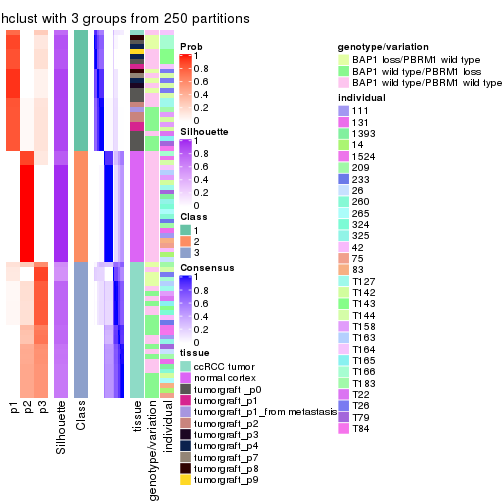</p>

</div>
<div id='tab-SD-hclust-consensus-heatmap-3'>
<pre><code class="r">consensus_heatmap(res, k = 4)
</code></pre>

<p></p>

</div>
<div id='tab-SD-hclust-consensus-heatmap-4'>
<pre><code class="r">consensus_heatmap(res, k = 5)
</code></pre>

<p></p>

</div>
<div id='tab-SD-hclust-consensus-heatmap-5'>
<pre><code class="r">consensus_heatmap(res, k = 6)
</code></pre>

<p></p>

</div>
</div>

Heatmaps for the membership of samples in all partitions to see how consistent they are:


<script>
$( function() {
	$( '#tabs-SD-hclust-membership-heatmap' ).tabs();
} );
</script>
<div id='tabs-SD-hclust-membership-heatmap'>
<ul>
<li><a href='#tab-SD-hclust-membership-heatmap-1'>k = 2</a></li>
<li><a href='#tab-SD-hclust-membership-heatmap-2'>k = 3</a></li>
<li><a href='#tab-SD-hclust-membership-heatmap-3'>k = 4</a></li>
<li><a href='#tab-SD-hclust-membership-heatmap-4'>k = 5</a></li>
<li><a href='#tab-SD-hclust-membership-heatmap-5'>k = 6</a></li>
</ul>
<div id='tab-SD-hclust-membership-heatmap-1'>
<pre><code class="r">membership_heatmap(res, k = 2)
</code></pre>

<p></p>

</div>
<div id='tab-SD-hclust-membership-heatmap-2'>
<pre><code class="r">membership_heatmap(res, k = 3)
</code></pre>

<p></p>

</div>
<div id='tab-SD-hclust-membership-heatmap-3'>
<pre><code class="r">membership_heatmap(res, k = 4)
</code></pre>

<p></p>

</div>
<div id='tab-SD-hclust-membership-heatmap-4'>
<pre><code class="r">membership_heatmap(res, k = 5)
</code></pre>

<p></p>

</div>
<div id='tab-SD-hclust-membership-heatmap-5'>
<pre><code class="r">membership_heatmap(res, k = 6)
</code></pre>

<p></p>

</div>
</div>

As soon as we have had the classes for columns, we can look for signatures
which are significantly different between classes which can be candidate marks
for certain classes. Following are the heatmaps for signatures.


Signature heatmaps where rows are scaled:


<script>
$( function() {
	$( '#tabs-SD-hclust-get-signatures' ).tabs();
} );
</script>
<div id='tabs-SD-hclust-get-signatures'>
<ul>
<li><a href='#tab-SD-hclust-get-signatures-1'>k = 2</a></li>
<li><a href='#tab-SD-hclust-get-signatures-2'>k = 3</a></li>
<li><a href='#tab-SD-hclust-get-signatures-3'>k = 4</a></li>
<li><a href='#tab-SD-hclust-get-signatures-4'>k = 5</a></li>
<li><a href='#tab-SD-hclust-get-signatures-5'>k = 6</a></li>
</ul>
<div id='tab-SD-hclust-get-signatures-1'>
<pre><code class="r">get_signatures(res, k = 2)
</code></pre>

<p></p>

</div>
<div id='tab-SD-hclust-get-signatures-2'>
<pre><code class="r">get_signatures(res, k = 3)
</code></pre>

<p></p>

</div>
<div id='tab-SD-hclust-get-signatures-3'>
<pre><code class="r">get_signatures(res, k = 4)
</code></pre>

<p></p>

</div>
<div id='tab-SD-hclust-get-signatures-4'>
<pre><code class="r">get_signatures(res, k = 5)
</code></pre>

<p></p>

</div>
<div id='tab-SD-hclust-get-signatures-5'>
<pre><code class="r">get_signatures(res, k = 6)
</code></pre>

<p></p>

</div>
</div>


Signature heatmaps where rows are not scaled:


<script>
$( function() {
	$( '#tabs-SD-hclust-get-signatures-no-scale' ).tabs();
} );
</script>
<div id='tabs-SD-hclust-get-signatures-no-scale'>
<ul>
<li><a href='#tab-SD-hclust-get-signatures-no-scale-1'>k = 2</a></li>
<li><a href='#tab-SD-hclust-get-signatures-no-scale-2'>k = 3</a></li>
<li><a href='#tab-SD-hclust-get-signatures-no-scale-3'>k = 4</a></li>
<li><a href='#tab-SD-hclust-get-signatures-no-scale-4'>k = 5</a></li>
<li><a href='#tab-SD-hclust-get-signatures-no-scale-5'>k = 6</a></li>
</ul>
<div id='tab-SD-hclust-get-signatures-no-scale-1'>
<pre><code class="r">get_signatures(res, k = 2, scale_rows = FALSE)
</code></pre>

<p></p>

</div>
<div id='tab-SD-hclust-get-signatures-no-scale-2'>
<pre><code class="r">get_signatures(res, k = 3, scale_rows = FALSE)
</code></pre>

<p></p>

</div>
<div id='tab-SD-hclust-get-signatures-no-scale-3'>
<pre><code class="r">get_signatures(res, k = 4, scale_rows = FALSE)
</code></pre>

<p></p>

</div>
<div id='tab-SD-hclust-get-signatures-no-scale-4'>
<pre><code class="r">get_signatures(res, k = 5, scale_rows = FALSE)
</code></pre>

<p></p>

</div>
<div id='tab-SD-hclust-get-signatures-no-scale-5'>
<pre><code class="r">get_signatures(res, k = 6, scale_rows = FALSE)
</code></pre>

<p></p>

</div>
</div>


Compare the overlap of signatures from different k:

```r
compare_signatures(res)
```


`get_signature()` returns a data frame invisibly. TO get the list of signatures, the function
call should be assigned to a variable explicitly. In following code, if `plot` argument is set
to `FALSE`, no heatmap is plotted while only the differential analysis is performed.

```r
# code only for demonstration
tb = get_signature(res, k = ..., plot = FALSE)
```

An example of the output of `tb` is:

```
#>   which_row         fdr    mean_1    mean_2 scaled_mean_1 scaled_mean_2 km
#> 1        38 0.042760348  8.373488  9.131774    -0.5533452     0.5164555  1
#> 2        40 0.018707592  7.106213  8.469186    -0.6173731     0.5762149  1
#> 3        55 0.019134737 10.221463 11.207825    -0.6159697     0.5749050  1
#> 4        59 0.006059896  5.921854  7.869574    -0.6899429     0.6439467  1
#> 5        60 0.018055526  8.928898 10.211722    -0.6204761     0.5791110  1
#> 6        98 0.009384629 15.714769 14.887706     0.6635654    -0.6193277  2
...
```

The columns in `tb` are:

1. `which_row`: row indices corresponding to the input matrix.
2. `fdr`: FDR for the differential test. 
3. `mean_x`: The mean value in group x.
4. `scaled_mean_x`: The mean value in group x after rows are scaled.
5. `km`: Row groups if k-means clustering is applied to rows.


UMAP plot which shows how samples are separated.


<script>
$( function() {
	$( '#tabs-SD-hclust-dimension-reduction' ).tabs();
} );
</script>
<div id='tabs-SD-hclust-dimension-reduction'>
<ul>
<li><a href='#tab-SD-hclust-dimension-reduction-1'>k = 2</a></li>
<li><a href='#tab-SD-hclust-dimension-reduction-2'>k = 3</a></li>
<li><a href='#tab-SD-hclust-dimension-reduction-3'>k = 4</a></li>
<li><a href='#tab-SD-hclust-dimension-reduction-4'>k = 5</a></li>
<li><a href='#tab-SD-hclust-dimension-reduction-5'>k = 6</a></li>
</ul>
<div id='tab-SD-hclust-dimension-reduction-1'>
<pre><code class="r">dimension_reduction(res, k = 2, method = &quot;UMAP&quot;)
</code></pre>

<p>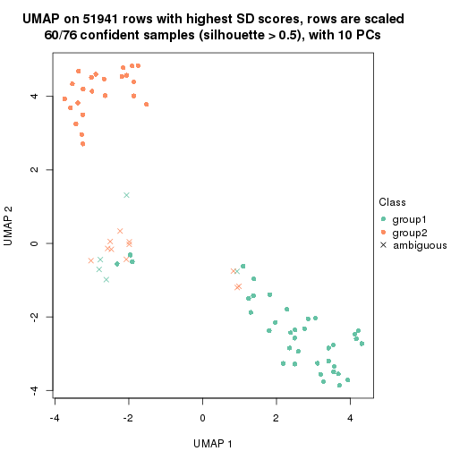</p>

</div>
<div id='tab-SD-hclust-dimension-reduction-2'>
<pre><code class="r">dimension_reduction(res, k = 3, method = &quot;UMAP&quot;)
</code></pre>

<p></p>

</div>
<div id='tab-SD-hclust-dimension-reduction-3'>
<pre><code class="r">dimension_reduction(res, k = 4, method = &quot;UMAP&quot;)
</code></pre>

<p></p>

</div>
<div id='tab-SD-hclust-dimension-reduction-4'>
<pre><code class="r">dimension_reduction(res, k = 5, method = &quot;UMAP&quot;)
</code></pre>

<p></p>

</div>
<div id='tab-SD-hclust-dimension-reduction-5'>
<pre><code class="r">dimension_reduction(res, k = 6, method = &quot;UMAP&quot;)
</code></pre>

<p></p>

</div>
</div>


Following heatmap shows how subgroups are split when increasing `k`:

```r
collect_classes(res)
```


Test correlation between subgroups and known annotations. If the known
annotation is numeric, one-way ANOVA test is applied, and if the known
annotation is discrete, chi-squared contingency table test is applied.

```r
test_to_known_factors(res)
```

```
#>            n tissue(p) genotype/variation(p) individual(p) k
#> SD:hclust 60  3.62e-09              4.36e-05         0.332 2
#> SD:hclust 76  3.01e-21              5.75e-05         0.992 3
#> SD:hclust 73  2.26e-20              7.84e-05         0.487 4
#> SD:hclust 66  3.13e-14              1.39e-05         0.409 5
#> SD:hclust 69  4.18e-18              1.04e-10         0.149 6
```


If matrix rows can be associated to genes, consider to use `functional_enrichment(res,
...)` to perform function enrichment for the signature genes. See [this vignette](http://bioconductor.org/packages/devel/bioc/vignettes/cola/inst/doc/functional_enrichment.html) for more detailed explanations.


 

---------------------------------------------------


### SD:kmeans


The object with results only for a single top-value method and a single partition method 
can be extracted as:

```r
res = res_list["SD", "kmeans"]
# you can also extract it by
# res = res_list["SD:kmeans"]
```

A summary of `res` and all the functions that can be applied to it:

```r
res
```

```
#> A 'ConsensusPartition' object with k = 2, 3, 4, 5, 6.
#>   On a matrix with 51941 rows and 76 columns.
#>   Top rows (1000, 2000, 3000, 4000, 5000) are extracted by 'SD' method.
#>   Subgroups are detected by 'kmeans' method.
#>   Performed in total 1250 partitions by row resampling.
#>   Best k for subgroups seems to be 2.
#> 
#> Following methods can be applied to this 'ConsensusPartition' object:
#>  [1] "cola_report"             "collect_classes"         "collect_plots"          
#>  [4] "collect_stats"           "colnames"                "compare_signatures"     
#>  [7] "consensus_heatmap"       "dimension_reduction"     "functional_enrichment"  
#> [10] "get_anno_col"            "get_anno"                "get_classes"            
#> [13] "get_consensus"           "get_matrix"              "get_membership"         
#> [16] "get_param"               "get_signatures"          "get_stats"              
#> [19] "is_best_k"               "is_stable_k"             "membership_heatmap"     
#> [22] "ncol"                    "nrow"                    "plot_ecdf"              
#> [25] "rownames"                "select_partition_number" "show"                   
#> [28] "suggest_best_k"          "test_to_known_factors"
```

`collect_plots()` function collects all the plots made from `res` for all `k` (number of partitions)
into one single page to provide an easy and fast comparison between different `k`.

```r
collect_plots(res)
```


The plots are:

- The first row: a plot of the ECDF (empirical cumulative distribution
  function) curves of the consensus matrix for each `k` and the heatmap of
  predicted classes for each `k`.
- The second row: heatmaps of the consensus matrix for each `k`.
- The third row: heatmaps of the membership matrix for each `k`.
- The fouth row: heatmaps of the signatures for each `k`.

All the plots in panels can be made by individual functions and they are
plotted later in this section.

`select_partition_number()` produces several plots showing different
statistics for choosing "optimized" `k`. There are following statistics:

- ECDF curves of the consensus matrix for each `k`;
- 1-PAC. [The PAC
  score](https://en.wikipedia.org/wiki/Consensus_clustering#Over-interpretation_potential_of_consensus_clustering)
  measures the proportion of the ambiguous subgrouping.
- Mean silhouette score.
- Concordance. The mean probability of fiting the consensus class ids in all
  partitions.
- Area increased. Denote $A_k$ as the area under the ECDF curve for current
  `k`, the area increased is defined as $A_k - A_{k-1}$.
- Rand index. The percent of pairs of samples that are both in a same cluster
  or both are not in a same cluster in the partition of k and k-1.
- Jaccard index. The ratio of pairs of samples are both in a same cluster in
  the partition of k and k-1 and the pairs of samples are both in a same
  cluster in the partition k or k-1.

The detailed explanations of these statistics can be found in [the _cola_
vignette](http://bioconductor.org/packages/devel/bioc/vignettes/cola/inst/doc/cola.html#toc_13).

Generally speaking, lower PAC score, higher mean silhouette score or higher
concordance corresponds to better partition. Rand index and Jaccard index
measure how similar the current partition is compared to partition with `k-1`.
If they are too similar, we won't accept `k` is better than `k-1`.

```r
select_partition_number(res)
```


The numeric values for all these statistics can be obtained by `get_stats()`.

```r
get_stats(res)
```

```
#>   k 1-PAC mean_silhouette concordance area_increased  Rand Jaccard
#> 2 2 0.581           0.857       0.892         0.4596 0.528   0.528
#> 3 3 0.654           0.923       0.866         0.3861 0.762   0.565
#> 4 4 0.829           0.864       0.840         0.1325 0.914   0.745
#> 5 5 0.796           0.768       0.814         0.0662 0.976   0.908
#> 6 6 0.754           0.732       0.786         0.0430 0.959   0.834
```

`suggest_best_k()` suggests the best $k$ based on these statistics. The rules are as follows:

- All $k$ with Jaccard index larger than 0.95 are removed because increasing
  $k$ does not provide enough extra information. If all $k$ are removed, it is
  marked as no subgroup is detected.
- For all $k$ with 1-PAC score larger than 0.9, the maximal $k$ is taken as
  the best $k$, and other $k$ are marked as optional $k$.
- If it does not fit the second rule. The $k$ with the maximal vote of the
  highest 1-PAC score, highest mean silhouette, and highest concordance is
  taken as the best $k$.

```r
suggest_best_k(res)
```

```
#> [1] 2
```


Following shows the table of the partitions (You need to click the **show/hide
code output** link to see it). The membership matrix (columns with name `p*`)
is inferred by
[`clue::cl_consensus()`](https://www.rdocumentation.org/link/cl_consensus?package=clue)
function with the `SE` method. Basically the value in the membership matrix
represents the probability to belong to a certain group. The finall class
label for an item is determined with the group with highest probability it
belongs to.

In `get_classes()` function, the entropy is calculated from the membership
matrix and the silhouette score is calculated from the consensus matrix.


<script>
$( function() {
	$( '#tabs-SD-kmeans-get-classes' ).tabs();
} );
</script>
<div id='tabs-SD-kmeans-get-classes'>
<ul>
<li><a href='#tab-SD-kmeans-get-classes-1'>k = 2</a></li>
<li><a href='#tab-SD-kmeans-get-classes-2'>k = 3</a></li>
<li><a href='#tab-SD-kmeans-get-classes-3'>k = 4</a></li>
<li><a href='#tab-SD-kmeans-get-classes-4'>k = 5</a></li>
<li><a href='#tab-SD-kmeans-get-classes-5'>k = 6</a></li>
</ul>

<div id='tab-SD-kmeans-get-classes-1'>
<p><a id='tab-SD-kmeans-get-classes-1-a' style='color:#0366d6' href='#'>show/hide code output</a></p>
<pre><code class="r">cbind(get_classes(res, k = 2), get_membership(res, k = 2))
</code></pre>

<pre><code>#&gt;           class entropy silhouette    p1    p2
#&gt; GSM905004     2  0.9044      0.763 0.320 0.680
#&gt; GSM905024     1  0.0672      0.991 0.992 0.008
#&gt; GSM905038     2  0.9000      0.763 0.316 0.684
#&gt; GSM905043     1  0.0672      0.991 0.992 0.008
#&gt; GSM904986     2  0.8955      0.767 0.312 0.688
#&gt; GSM904991     2  0.9044      0.759 0.320 0.680
#&gt; GSM904994     2  0.8955      0.767 0.312 0.688
#&gt; GSM904996     2  0.8955      0.767 0.312 0.688
#&gt; GSM905007     2  0.9000      0.763 0.316 0.684
#&gt; GSM905012     2  0.8955      0.767 0.312 0.688
#&gt; GSM905022     2  0.8955      0.767 0.312 0.688
#&gt; GSM905026     2  0.8955      0.767 0.312 0.688
#&gt; GSM905027     2  0.8955      0.767 0.312 0.688
#&gt; GSM905031     2  0.8955      0.767 0.312 0.688
#&gt; GSM905036     2  0.9000      0.763 0.316 0.684
#&gt; GSM905041     2  0.9922      0.529 0.448 0.552
#&gt; GSM905044     2  0.8955      0.767 0.312 0.688
#&gt; GSM904989     2  0.8955      0.767 0.312 0.688
#&gt; GSM904999     2  0.8955      0.767 0.312 0.688
#&gt; GSM905002     2  0.8955      0.767 0.312 0.688
#&gt; GSM905009     2  0.8955      0.767 0.312 0.688
#&gt; GSM905014     2  0.9000      0.763 0.316 0.684
#&gt; GSM905017     2  0.8955      0.767 0.312 0.688
#&gt; GSM905020     2  0.8955      0.767 0.312 0.688
#&gt; GSM905023     2  0.9000      0.763 0.316 0.684
#&gt; GSM905029     2  0.9000      0.763 0.316 0.684
#&gt; GSM905032     2  0.9044      0.759 0.320 0.680
#&gt; GSM905034     1  0.0672      0.991 0.992 0.008
#&gt; GSM905040     1  0.0672      0.991 0.992 0.008
#&gt; GSM904985     2  0.0672      0.798 0.008 0.992
#&gt; GSM904988     2  0.0672      0.798 0.008 0.992
#&gt; GSM904990     2  0.0672      0.798 0.008 0.992
#&gt; GSM904992     2  0.0672      0.798 0.008 0.992
#&gt; GSM904995     2  0.0672      0.798 0.008 0.992
#&gt; GSM904998     2  0.0672      0.798 0.008 0.992
#&gt; GSM905000     2  0.0672      0.798 0.008 0.992
#&gt; GSM905003     2  0.0672      0.798 0.008 0.992
#&gt; GSM905006     2  0.0672      0.798 0.008 0.992
#&gt; GSM905008     2  0.0672      0.798 0.008 0.992
#&gt; GSM905011     2  0.0672      0.798 0.008 0.992
#&gt; GSM905013     2  0.0672      0.798 0.008 0.992
#&gt; GSM905016     2  0.0672      0.798 0.008 0.992
#&gt; GSM905018     2  0.0672      0.798 0.008 0.992
#&gt; GSM905021     2  0.0672      0.798 0.008 0.992
#&gt; GSM905025     2  0.0672      0.798 0.008 0.992
#&gt; GSM905028     2  0.0672      0.798 0.008 0.992
#&gt; GSM905030     2  0.0672      0.798 0.008 0.992
#&gt; GSM905033     2  0.0672      0.798 0.008 0.992
#&gt; GSM905035     2  0.0672      0.798 0.008 0.992
#&gt; GSM905037     2  0.0672      0.798 0.008 0.992
#&gt; GSM905039     2  0.0672      0.798 0.008 0.992
#&gt; GSM905042     2  0.0672      0.798 0.008 0.992
#&gt; GSM905046     1  0.0000      0.998 1.000 0.000
#&gt; GSM905065     1  0.0000      0.998 1.000 0.000
#&gt; GSM905049     1  0.0000      0.998 1.000 0.000
#&gt; GSM905050     1  0.0000      0.998 1.000 0.000
#&gt; GSM905064     1  0.0000      0.998 1.000 0.000
#&gt; GSM905045     1  0.0000      0.998 1.000 0.000
#&gt; GSM905051     1  0.0000      0.998 1.000 0.000
#&gt; GSM905055     1  0.0000      0.998 1.000 0.000
#&gt; GSM905058     1  0.0000      0.998 1.000 0.000
#&gt; GSM905053     1  0.0000      0.998 1.000 0.000
#&gt; GSM905061     1  0.0000      0.998 1.000 0.000
#&gt; GSM905063     1  0.0000      0.998 1.000 0.000
#&gt; GSM905054     1  0.0000      0.998 1.000 0.000
#&gt; GSM905062     1  0.0000      0.998 1.000 0.000
#&gt; GSM905052     1  0.0000      0.998 1.000 0.000
#&gt; GSM905059     1  0.0000      0.998 1.000 0.000
#&gt; GSM905047     1  0.0000      0.998 1.000 0.000
#&gt; GSM905066     1  0.0000      0.998 1.000 0.000
#&gt; GSM905056     1  0.0000      0.998 1.000 0.000
#&gt; GSM905060     1  0.0000      0.998 1.000 0.000
#&gt; GSM905048     1  0.0000      0.998 1.000 0.000
#&gt; GSM905067     1  0.0000      0.998 1.000 0.000
#&gt; GSM905057     1  0.0000      0.998 1.000 0.000
#&gt; GSM905068     1  0.0000      0.998 1.000 0.000
</code></pre>

<script>
$('#tab-SD-kmeans-get-classes-1-a').parent().next().next().hide();
$('#tab-SD-kmeans-get-classes-1-a').click(function(){
  $('#tab-SD-kmeans-get-classes-1-a').parent().next().next().toggle();
  return(false);
});
</script>
</div>

<div id='tab-SD-kmeans-get-classes-2'>
<p><a id='tab-SD-kmeans-get-classes-2-a' style='color:#0366d6' href='#'>show/hide code output</a></p>
<pre><code class="r">cbind(get_classes(res, k = 3), get_membership(res, k = 3))
</code></pre>

<pre><code>#&gt;           class entropy silhouette    p1    p2    p3
#&gt; GSM905004     3  0.6363      0.804 0.136 0.096 0.768
#&gt; GSM905024     3  0.3267      0.523 0.116 0.000 0.884
#&gt; GSM905038     3  0.4931      0.954 0.000 0.232 0.768
#&gt; GSM905043     3  0.3267      0.523 0.116 0.000 0.884
#&gt; GSM904986     3  0.4931      0.954 0.000 0.232 0.768
#&gt; GSM904991     3  0.4784      0.927 0.004 0.200 0.796
#&gt; GSM904994     3  0.4931      0.954 0.000 0.232 0.768
#&gt; GSM904996     3  0.4931      0.954 0.000 0.232 0.768
#&gt; GSM905007     3  0.4931      0.954 0.000 0.232 0.768
#&gt; GSM905012     3  0.4931      0.954 0.000 0.232 0.768
#&gt; GSM905022     3  0.4931      0.954 0.000 0.232 0.768
#&gt; GSM905026     3  0.4931      0.954 0.000 0.232 0.768
#&gt; GSM905027     3  0.4931      0.954 0.000 0.232 0.768
#&gt; GSM905031     3  0.4931      0.954 0.000 0.232 0.768
#&gt; GSM905036     3  0.4931      0.954 0.000 0.232 0.768
#&gt; GSM905041     3  0.4733      0.924 0.004 0.196 0.800
#&gt; GSM905044     3  0.4931      0.954 0.000 0.232 0.768
#&gt; GSM904989     3  0.4931      0.954 0.000 0.232 0.768
#&gt; GSM904999     3  0.4931      0.954 0.000 0.232 0.768
#&gt; GSM905002     3  0.4931      0.954 0.000 0.232 0.768
#&gt; GSM905009     3  0.4931      0.954 0.000 0.232 0.768
#&gt; GSM905014     3  0.4931      0.954 0.000 0.232 0.768
#&gt; GSM905017     3  0.4931      0.954 0.000 0.232 0.768
#&gt; GSM905020     3  0.4931      0.954 0.000 0.232 0.768
#&gt; GSM905023     3  0.4931      0.954 0.000 0.232 0.768
#&gt; GSM905029     3  0.4931      0.954 0.000 0.232 0.768
#&gt; GSM905032     3  0.4555      0.927 0.000 0.200 0.800
#&gt; GSM905034     1  0.5178      0.889 0.744 0.000 0.256
#&gt; GSM905040     1  0.5327      0.884 0.728 0.000 0.272
#&gt; GSM904985     2  0.1289      0.984 0.032 0.968 0.000
#&gt; GSM904988     2  0.0237      0.988 0.004 0.996 0.000
#&gt; GSM904990     2  0.0000      0.988 0.000 1.000 0.000
#&gt; GSM904992     2  0.0237      0.988 0.004 0.996 0.000
#&gt; GSM904995     2  0.1289      0.984 0.032 0.968 0.000
#&gt; GSM904998     2  0.0237      0.988 0.004 0.996 0.000
#&gt; GSM905000     2  0.0000      0.988 0.000 1.000 0.000
#&gt; GSM905003     2  0.0592      0.987 0.012 0.988 0.000
#&gt; GSM905006     2  0.0237      0.988 0.004 0.996 0.000
#&gt; GSM905008     2  0.0237      0.988 0.004 0.996 0.000
#&gt; GSM905011     2  0.0237      0.988 0.004 0.996 0.000
#&gt; GSM905013     2  0.0000      0.988 0.000 1.000 0.000
#&gt; GSM905016     2  0.1289      0.984 0.032 0.968 0.000
#&gt; GSM905018     2  0.0000      0.988 0.000 1.000 0.000
#&gt; GSM905021     2  0.1163      0.984 0.028 0.972 0.000
#&gt; GSM905025     2  0.1163      0.984 0.028 0.972 0.000
#&gt; GSM905028     2  0.0000      0.988 0.000 1.000 0.000
#&gt; GSM905030     2  0.0237      0.988 0.004 0.996 0.000
#&gt; GSM905033     2  0.1163      0.984 0.028 0.972 0.000
#&gt; GSM905035     2  0.1289      0.984 0.032 0.968 0.000
#&gt; GSM905037     2  0.0000      0.988 0.000 1.000 0.000
#&gt; GSM905039     2  0.1163      0.984 0.028 0.972 0.000
#&gt; GSM905042     2  0.1163      0.984 0.028 0.972 0.000
#&gt; GSM905046     1  0.4796      0.899 0.780 0.000 0.220
#&gt; GSM905065     1  0.4796      0.899 0.780 0.000 0.220
#&gt; GSM905049     1  0.3116      0.847 0.892 0.000 0.108
#&gt; GSM905050     1  0.3116      0.847 0.892 0.000 0.108
#&gt; GSM905064     1  0.2356      0.862 0.928 0.000 0.072
#&gt; GSM905045     1  0.3116      0.847 0.892 0.000 0.108
#&gt; GSM905051     1  0.1753      0.869 0.952 0.000 0.048
#&gt; GSM905055     1  0.5254      0.888 0.736 0.000 0.264
#&gt; GSM905058     1  0.4796      0.899 0.780 0.000 0.220
#&gt; GSM905053     1  0.3116      0.847 0.892 0.000 0.108
#&gt; GSM905061     1  0.3116      0.847 0.892 0.000 0.108
#&gt; GSM905063     1  0.5254      0.888 0.736 0.000 0.264
#&gt; GSM905054     1  0.2959      0.851 0.900 0.000 0.100
#&gt; GSM905062     1  0.3116      0.847 0.892 0.000 0.108
#&gt; GSM905052     1  0.1753      0.869 0.952 0.000 0.048
#&gt; GSM905059     1  0.4750      0.899 0.784 0.000 0.216
#&gt; GSM905047     1  0.4750      0.899 0.784 0.000 0.216
#&gt; GSM905066     1  0.4796      0.899 0.780 0.000 0.220
#&gt; GSM905056     1  0.5254      0.888 0.736 0.000 0.264
#&gt; GSM905060     1  0.4750      0.899 0.784 0.000 0.216
#&gt; GSM905048     1  0.4796      0.899 0.780 0.000 0.220
#&gt; GSM905067     1  0.4796      0.899 0.780 0.000 0.220
#&gt; GSM905057     1  0.5254      0.888 0.736 0.000 0.264
#&gt; GSM905068     1  0.3116      0.847 0.892 0.000 0.108
</code></pre>

<script>
$('#tab-SD-kmeans-get-classes-2-a').parent().next().next().hide();
$('#tab-SD-kmeans-get-classes-2-a').click(function(){
  $('#tab-SD-kmeans-get-classes-2-a').parent().next().next().toggle();
  return(false);
});
</script>
</div>

<div id='tab-SD-kmeans-get-classes-3'>
<p><a id='tab-SD-kmeans-get-classes-3-a' style='color:#0366d6' href='#'>show/hide code output</a></p>
<pre><code class="r">cbind(get_classes(res, k = 4), get_membership(res, k = 4))
</code></pre>

<pre><code>#&gt;           class entropy silhouette    p1    p2    p3    p4
#&gt; GSM905004     3  0.3975      0.691 0.000 0.000 0.760 0.240
#&gt; GSM905024     1  0.5614      0.143 0.592 0.020 0.384 0.004
#&gt; GSM905038     3  0.0188      0.961 0.004 0.000 0.996 0.000
#&gt; GSM905043     1  0.4855      0.236 0.644 0.000 0.352 0.004
#&gt; GSM904986     3  0.0000      0.962 0.000 0.000 1.000 0.000
#&gt; GSM904991     3  0.2654      0.910 0.108 0.000 0.888 0.004
#&gt; GSM904994     3  0.0000      0.962 0.000 0.000 1.000 0.000
#&gt; GSM904996     3  0.0000      0.962 0.000 0.000 1.000 0.000
#&gt; GSM905007     3  0.1576      0.943 0.048 0.000 0.948 0.004
#&gt; GSM905012     3  0.0000      0.962 0.000 0.000 1.000 0.000
#&gt; GSM905022     3  0.0000      0.962 0.000 0.000 1.000 0.000
#&gt; GSM905026     3  0.0000      0.962 0.000 0.000 1.000 0.000
#&gt; GSM905027     3  0.0188      0.961 0.004 0.000 0.996 0.000
#&gt; GSM905031     3  0.0000      0.962 0.000 0.000 1.000 0.000
#&gt; GSM905036     3  0.0657      0.958 0.012 0.000 0.984 0.004
#&gt; GSM905041     3  0.2799      0.908 0.108 0.000 0.884 0.008
#&gt; GSM905044     3  0.0000      0.962 0.000 0.000 1.000 0.000
#&gt; GSM904989     3  0.0000      0.962 0.000 0.000 1.000 0.000
#&gt; GSM904999     3  0.3245      0.908 0.064 0.000 0.880 0.056
#&gt; GSM905002     3  0.0000      0.962 0.000 0.000 1.000 0.000
#&gt; GSM905009     3  0.0000      0.962 0.000 0.000 1.000 0.000
#&gt; GSM905014     3  0.1637      0.938 0.060 0.000 0.940 0.000
#&gt; GSM905017     3  0.3245      0.908 0.064 0.000 0.880 0.056
#&gt; GSM905020     3  0.0000      0.962 0.000 0.000 1.000 0.000
#&gt; GSM905023     3  0.0469      0.959 0.012 0.000 0.988 0.000
#&gt; GSM905029     3  0.0188      0.961 0.004 0.000 0.996 0.000
#&gt; GSM905032     3  0.4285      0.841 0.156 0.000 0.804 0.040
#&gt; GSM905034     1  0.2744      0.660 0.912 0.024 0.012 0.052
#&gt; GSM905040     1  0.0336      0.636 0.992 0.008 0.000 0.000
#&gt; GSM904985     2  0.5136      0.878 0.000 0.728 0.048 0.224
#&gt; GSM904988     2  0.1576      0.925 0.000 0.948 0.048 0.004
#&gt; GSM904990     2  0.1389      0.925 0.000 0.952 0.048 0.000
#&gt; GSM904992     2  0.1576      0.925 0.000 0.948 0.048 0.004
#&gt; GSM904995     2  0.4919      0.885 0.000 0.752 0.048 0.200
#&gt; GSM904998     2  0.1975      0.923 0.000 0.936 0.048 0.016
#&gt; GSM905000     2  0.1389      0.925 0.000 0.952 0.048 0.000
#&gt; GSM905003     2  0.2586      0.920 0.000 0.912 0.048 0.040
#&gt; GSM905006     2  0.1576      0.925 0.000 0.948 0.048 0.004
#&gt; GSM905008     2  0.2300      0.920 0.000 0.924 0.048 0.028
#&gt; GSM905011     2  0.1576      0.925 0.000 0.948 0.048 0.004
#&gt; GSM905013     2  0.1389      0.925 0.000 0.952 0.048 0.000
#&gt; GSM905016     2  0.4919      0.885 0.000 0.752 0.048 0.200
#&gt; GSM905018     2  0.1389      0.925 0.000 0.952 0.048 0.000
#&gt; GSM905021     2  0.5623      0.837 0.000 0.660 0.048 0.292
#&gt; GSM905025     2  0.4881      0.885 0.000 0.756 0.048 0.196
#&gt; GSM905028     2  0.1389      0.925 0.000 0.952 0.048 0.000
#&gt; GSM905030     2  0.1576      0.925 0.000 0.948 0.048 0.004
#&gt; GSM905033     2  0.5416      0.858 0.000 0.692 0.048 0.260
#&gt; GSM905035     2  0.4919      0.885 0.000 0.752 0.048 0.200
#&gt; GSM905037     2  0.1389      0.925 0.000 0.952 0.048 0.000
#&gt; GSM905039     2  0.4881      0.885 0.000 0.756 0.048 0.196
#&gt; GSM905042     2  0.5416      0.858 0.000 0.692 0.048 0.260
#&gt; GSM905046     1  0.4507      0.729 0.756 0.020 0.000 0.224
#&gt; GSM905065     1  0.4018      0.730 0.772 0.004 0.000 0.224
#&gt; GSM905049     4  0.5358      0.964 0.252 0.000 0.048 0.700
#&gt; GSM905050     4  0.5358      0.964 0.252 0.000 0.048 0.700
#&gt; GSM905064     4  0.5078      0.943 0.272 0.000 0.028 0.700
#&gt; GSM905045     4  0.5358      0.964 0.252 0.000 0.048 0.700
#&gt; GSM905051     4  0.5206      0.868 0.308 0.024 0.000 0.668
#&gt; GSM905055     1  0.2737      0.722 0.888 0.008 0.000 0.104
#&gt; GSM905058     1  0.4574      0.728 0.756 0.024 0.000 0.220
#&gt; GSM905053     4  0.5358      0.964 0.252 0.000 0.048 0.700
#&gt; GSM905061     4  0.5358      0.964 0.252 0.000 0.048 0.700
#&gt; GSM905063     1  0.2737      0.722 0.888 0.008 0.000 0.104
#&gt; GSM905054     4  0.5200      0.954 0.264 0.000 0.036 0.700
#&gt; GSM905062     4  0.5358      0.964 0.252 0.000 0.048 0.700
#&gt; GSM905052     4  0.5206      0.868 0.308 0.024 0.000 0.668
#&gt; GSM905059     1  0.4644      0.719 0.748 0.024 0.000 0.228
#&gt; GSM905047     1  0.4576      0.720 0.748 0.020 0.000 0.232
#&gt; GSM905066     1  0.4018      0.730 0.772 0.004 0.000 0.224
#&gt; GSM905056     1  0.2737      0.722 0.888 0.008 0.000 0.104
#&gt; GSM905060     1  0.4644      0.719 0.748 0.024 0.000 0.228
#&gt; GSM905048     1  0.4507      0.729 0.756 0.020 0.000 0.224
#&gt; GSM905067     1  0.4018      0.730 0.772 0.004 0.000 0.224
#&gt; GSM905057     1  0.2737      0.722 0.888 0.008 0.000 0.104
#&gt; GSM905068     4  0.5358      0.964 0.252 0.000 0.048 0.700
</code></pre>

<script>
$('#tab-SD-kmeans-get-classes-3-a').parent().next().next().hide();
$('#tab-SD-kmeans-get-classes-3-a').click(function(){
  $('#tab-SD-kmeans-get-classes-3-a').parent().next().next().toggle();
  return(false);
});
</script>
</div>

<div id='tab-SD-kmeans-get-classes-4'>
<p><a id='tab-SD-kmeans-get-classes-4-a' style='color:#0366d6' href='#'>show/hide code output</a></p>
<pre><code class="r">cbind(get_classes(res, k = 5), get_membership(res, k = 5))
</code></pre>

<pre><code>#&gt;           class entropy silhouette    p1    p2    p3    p4    p5
#&gt; GSM905004     3  0.3635      0.543 0.000 0.000 0.748 0.248 0.004
#&gt; GSM905024     5  0.6836      0.459 0.396 0.000 0.188 0.012 0.404
#&gt; GSM905038     3  0.1043      0.868 0.000 0.000 0.960 0.000 0.040
#&gt; GSM905043     5  0.6476      0.408 0.384 0.000 0.132 0.012 0.472
#&gt; GSM904986     3  0.0000      0.878 0.000 0.000 1.000 0.000 0.000
#&gt; GSM904991     3  0.3932      0.538 0.000 0.000 0.672 0.000 0.328
#&gt; GSM904994     3  0.0000      0.878 0.000 0.000 1.000 0.000 0.000
#&gt; GSM904996     3  0.0000      0.878 0.000 0.000 1.000 0.000 0.000
#&gt; GSM905007     3  0.2891      0.767 0.000 0.000 0.824 0.000 0.176
#&gt; GSM905012     3  0.0000      0.878 0.000 0.000 1.000 0.000 0.000
#&gt; GSM905022     3  0.0000      0.878 0.000 0.000 1.000 0.000 0.000
#&gt; GSM905026     3  0.0000      0.878 0.000 0.000 1.000 0.000 0.000
#&gt; GSM905027     3  0.1043      0.868 0.000 0.000 0.960 0.000 0.040
#&gt; GSM905031     3  0.0000      0.878 0.000 0.000 1.000 0.000 0.000
#&gt; GSM905036     3  0.1851      0.844 0.000 0.000 0.912 0.000 0.088
#&gt; GSM905041     3  0.3999      0.504 0.000 0.000 0.656 0.000 0.344
#&gt; GSM905044     3  0.0000      0.878 0.000 0.000 1.000 0.000 0.000
#&gt; GSM904989     3  0.0000      0.878 0.000 0.000 1.000 0.000 0.000
#&gt; GSM904999     3  0.4752      0.523 0.000 0.000 0.648 0.036 0.316
#&gt; GSM905002     3  0.0000      0.878 0.000 0.000 1.000 0.000 0.000
#&gt; GSM905009     3  0.0000      0.878 0.000 0.000 1.000 0.000 0.000
#&gt; GSM905014     3  0.3039      0.749 0.000 0.000 0.808 0.000 0.192
#&gt; GSM905017     3  0.4752      0.523 0.000 0.000 0.648 0.036 0.316
#&gt; GSM905020     3  0.0000      0.878 0.000 0.000 1.000 0.000 0.000
#&gt; GSM905023     3  0.1792      0.847 0.000 0.000 0.916 0.000 0.084
#&gt; GSM905029     3  0.1270      0.863 0.000 0.000 0.948 0.000 0.052
#&gt; GSM905032     5  0.4443     -0.259 0.000 0.000 0.472 0.004 0.524
#&gt; GSM905034     1  0.4791     -0.123 0.588 0.000 0.008 0.012 0.392
#&gt; GSM905040     5  0.5291     -0.175 0.456 0.000 0.000 0.048 0.496
#&gt; GSM904985     2  0.5747      0.764 0.000 0.636 0.004 0.200 0.160
#&gt; GSM904988     2  0.0162      0.858 0.000 0.996 0.004 0.000 0.000
#&gt; GSM904990     2  0.0451      0.858 0.000 0.988 0.004 0.008 0.000
#&gt; GSM904992     2  0.0162      0.858 0.000 0.996 0.004 0.000 0.000
#&gt; GSM904995     2  0.5497      0.775 0.000 0.664 0.004 0.196 0.136
#&gt; GSM904998     2  0.0613      0.857 0.000 0.984 0.004 0.008 0.004
#&gt; GSM905000     2  0.0451      0.858 0.000 0.988 0.004 0.008 0.000
#&gt; GSM905003     2  0.2313      0.845 0.000 0.912 0.004 0.040 0.044
#&gt; GSM905006     2  0.0162      0.858 0.000 0.996 0.004 0.000 0.000
#&gt; GSM905008     2  0.1153      0.852 0.000 0.964 0.004 0.008 0.024
#&gt; GSM905011     2  0.0162      0.858 0.000 0.996 0.004 0.000 0.000
#&gt; GSM905013     2  0.0451      0.858 0.000 0.988 0.004 0.008 0.000
#&gt; GSM905016     2  0.5497      0.775 0.000 0.664 0.004 0.196 0.136
#&gt; GSM905018     2  0.0451      0.858 0.000 0.988 0.004 0.008 0.000
#&gt; GSM905021     2  0.6414      0.645 0.000 0.504 0.004 0.168 0.324
#&gt; GSM905025     2  0.5527      0.776 0.000 0.660 0.004 0.200 0.136
#&gt; GSM905028     2  0.1892      0.848 0.000 0.916 0.004 0.080 0.000
#&gt; GSM905030     2  0.0162      0.858 0.000 0.996 0.004 0.000 0.000
#&gt; GSM905033     2  0.6054      0.713 0.000 0.572 0.004 0.140 0.284
#&gt; GSM905035     2  0.5497      0.775 0.000 0.664 0.004 0.196 0.136
#&gt; GSM905037     2  0.0451      0.858 0.000 0.988 0.004 0.008 0.000
#&gt; GSM905039     2  0.5527      0.776 0.000 0.660 0.004 0.200 0.136
#&gt; GSM905042     2  0.6054      0.713 0.000 0.572 0.004 0.140 0.284
#&gt; GSM905046     1  0.0162      0.806 0.996 0.000 0.000 0.000 0.004
#&gt; GSM905065     1  0.1732      0.801 0.920 0.000 0.000 0.000 0.080
#&gt; GSM905049     4  0.4152      0.973 0.296 0.000 0.012 0.692 0.000
#&gt; GSM905050     4  0.4152      0.973 0.296 0.000 0.012 0.692 0.000
#&gt; GSM905064     4  0.4067      0.971 0.300 0.000 0.008 0.692 0.000
#&gt; GSM905045     4  0.4305      0.973 0.296 0.000 0.012 0.688 0.004
#&gt; GSM905051     4  0.5152      0.901 0.344 0.004 0.000 0.608 0.044
#&gt; GSM905055     1  0.4477      0.655 0.708 0.000 0.000 0.040 0.252
#&gt; GSM905058     1  0.0000      0.806 1.000 0.000 0.000 0.000 0.000
#&gt; GSM905053     4  0.4152      0.973 0.296 0.000 0.012 0.692 0.000
#&gt; GSM905061     4  0.4715      0.966 0.296 0.000 0.012 0.672 0.020
#&gt; GSM905063     1  0.4352      0.661 0.720 0.000 0.000 0.036 0.244
#&gt; GSM905054     4  0.4067      0.971 0.300 0.000 0.008 0.692 0.000
#&gt; GSM905062     4  0.4715      0.966 0.296 0.000 0.012 0.672 0.020
#&gt; GSM905052     4  0.5152      0.901 0.344 0.004 0.000 0.608 0.044
#&gt; GSM905059     1  0.0510      0.800 0.984 0.000 0.000 0.016 0.000
#&gt; GSM905047     1  0.0671      0.799 0.980 0.000 0.000 0.016 0.004
#&gt; GSM905066     1  0.1732      0.801 0.920 0.000 0.000 0.000 0.080
#&gt; GSM905056     1  0.4477      0.655 0.708 0.000 0.000 0.040 0.252
#&gt; GSM905060     1  0.0510      0.800 0.984 0.000 0.000 0.016 0.000
#&gt; GSM905048     1  0.0162      0.806 0.996 0.000 0.000 0.000 0.004
#&gt; GSM905067     1  0.1732      0.801 0.920 0.000 0.000 0.000 0.080
#&gt; GSM905057     1  0.4477      0.655 0.708 0.000 0.000 0.040 0.252
#&gt; GSM905068     4  0.4305      0.973 0.296 0.000 0.012 0.688 0.004
</code></pre>

<script>
$('#tab-SD-kmeans-get-classes-4-a').parent().next().next().hide();
$('#tab-SD-kmeans-get-classes-4-a').click(function(){
  $('#tab-SD-kmeans-get-classes-4-a').parent().next().next().toggle();
  return(false);
});
</script>
</div>

<div id='tab-SD-kmeans-get-classes-5'>
<p><a id='tab-SD-kmeans-get-classes-5-a' style='color:#0366d6' href='#'>show/hide code output</a></p>
<pre><code class="r">cbind(get_classes(res, k = 6), get_membership(res, k = 6))
</code></pre>

<pre><code>#&gt;           class entropy silhouette    p1    p2    p3    p4    p5 p6
#&gt; GSM905004     3  0.3485      0.568 0.000 0.000 0.772 0.204 0.004 NA
#&gt; GSM905024     5  0.6203      0.441 0.300 0.000 0.052 0.012 0.548 NA
#&gt; GSM905038     3  0.2312      0.799 0.000 0.000 0.876 0.000 0.112 NA
#&gt; GSM905043     5  0.5826      0.406 0.256 0.000 0.028 0.012 0.600 NA
#&gt; GSM904986     3  0.0000      0.866 0.000 0.000 1.000 0.000 0.000 NA
#&gt; GSM904991     5  0.4205      0.226 0.000 0.000 0.420 0.000 0.564 NA
#&gt; GSM904994     3  0.0000      0.866 0.000 0.000 1.000 0.000 0.000 NA
#&gt; GSM904996     3  0.0000      0.866 0.000 0.000 1.000 0.000 0.000 NA
#&gt; GSM905007     3  0.3984      0.459 0.000 0.000 0.648 0.000 0.336 NA
#&gt; GSM905012     3  0.0000      0.866 0.000 0.000 1.000 0.000 0.000 NA
#&gt; GSM905022     3  0.0000      0.866 0.000 0.000 1.000 0.000 0.000 NA
#&gt; GSM905026     3  0.0000      0.866 0.000 0.000 1.000 0.000 0.000 NA
#&gt; GSM905027     3  0.2278      0.788 0.000 0.000 0.868 0.000 0.128 NA
#&gt; GSM905031     3  0.0000      0.866 0.000 0.000 1.000 0.000 0.000 NA
#&gt; GSM905036     3  0.3420      0.662 0.000 0.000 0.748 0.000 0.240 NA
#&gt; GSM905041     5  0.3899      0.277 0.000 0.000 0.404 0.000 0.592 NA
#&gt; GSM905044     3  0.0000      0.866 0.000 0.000 1.000 0.000 0.000 NA
#&gt; GSM904989     3  0.0260      0.863 0.000 0.000 0.992 0.000 0.000 NA
#&gt; GSM904999     5  0.6402      0.283 0.000 0.000 0.368 0.056 0.452 NA
#&gt; GSM905002     3  0.0000      0.866 0.000 0.000 1.000 0.000 0.000 NA
#&gt; GSM905009     3  0.0260      0.863 0.000 0.000 0.992 0.000 0.000 NA
#&gt; GSM905014     3  0.4076      0.381 0.000 0.000 0.620 0.000 0.364 NA
#&gt; GSM905017     5  0.6402      0.283 0.000 0.000 0.368 0.056 0.452 NA
#&gt; GSM905020     3  0.0000      0.866 0.000 0.000 1.000 0.000 0.000 NA
#&gt; GSM905023     3  0.3420      0.662 0.000 0.000 0.748 0.000 0.240 NA
#&gt; GSM905029     3  0.2805      0.758 0.000 0.000 0.828 0.000 0.160 NA
#&gt; GSM905032     5  0.3457      0.504 0.016 0.000 0.232 0.000 0.752 NA
#&gt; GSM905034     5  0.5521      0.310 0.360 0.000 0.000 0.016 0.532 NA
#&gt; GSM905040     5  0.6105      0.150 0.288 0.000 0.000 0.012 0.484 NA
#&gt; GSM904985     2  0.1864      0.658 0.000 0.924 0.000 0.004 0.032 NA
#&gt; GSM904988     2  0.3854      0.792 0.000 0.536 0.000 0.000 0.000 NA
#&gt; GSM904990     2  0.4103      0.792 0.000 0.544 0.000 0.004 0.004 NA
#&gt; GSM904992     2  0.4114      0.792 0.000 0.532 0.000 0.004 0.004 NA
#&gt; GSM904995     2  0.1194      0.670 0.000 0.956 0.000 0.004 0.032 NA
#&gt; GSM904998     2  0.4381      0.790 0.000 0.524 0.000 0.004 0.016 NA
#&gt; GSM905000     2  0.4103      0.792 0.000 0.544 0.000 0.004 0.004 NA
#&gt; GSM905003     2  0.4678      0.784 0.000 0.544 0.000 0.012 0.024 NA
#&gt; GSM905006     2  0.3854      0.792 0.000 0.536 0.000 0.000 0.000 NA
#&gt; GSM905008     2  0.4389      0.787 0.000 0.512 0.000 0.004 0.016 NA
#&gt; GSM905011     2  0.3854      0.792 0.000 0.536 0.000 0.000 0.000 NA
#&gt; GSM905013     2  0.4204      0.793 0.000 0.540 0.000 0.004 0.008 NA
#&gt; GSM905016     2  0.1194      0.670 0.000 0.956 0.000 0.004 0.032 NA
#&gt; GSM905018     2  0.4103      0.792 0.000 0.544 0.000 0.004 0.004 NA
#&gt; GSM905021     2  0.6188      0.377 0.000 0.580 0.000 0.068 0.192 NA
#&gt; GSM905025     2  0.0291      0.671 0.000 0.992 0.000 0.000 0.004 NA
#&gt; GSM905028     2  0.3844      0.773 0.000 0.676 0.000 0.004 0.008 NA
#&gt; GSM905030     2  0.4178      0.793 0.000 0.560 0.000 0.004 0.008 NA
#&gt; GSM905033     2  0.5022      0.548 0.000 0.712 0.000 0.060 0.140 NA
#&gt; GSM905035     2  0.0508      0.668 0.000 0.984 0.000 0.004 0.012 NA
#&gt; GSM905037     2  0.4158      0.792 0.000 0.572 0.000 0.004 0.008 NA
#&gt; GSM905039     2  0.0405      0.672 0.000 0.988 0.000 0.000 0.004 NA
#&gt; GSM905042     2  0.5022      0.548 0.000 0.712 0.000 0.060 0.140 NA
#&gt; GSM905046     1  0.2020      0.832 0.896 0.000 0.000 0.096 0.008 NA
#&gt; GSM905065     1  0.4028      0.832 0.796 0.000 0.000 0.096 0.056 NA
#&gt; GSM905049     4  0.2048      0.969 0.120 0.000 0.000 0.880 0.000 NA
#&gt; GSM905050     4  0.2048      0.969 0.120 0.000 0.000 0.880 0.000 NA
#&gt; GSM905064     4  0.2048      0.969 0.120 0.000 0.000 0.880 0.000 NA
#&gt; GSM905045     4  0.2662      0.965 0.120 0.000 0.000 0.856 0.000 NA
#&gt; GSM905051     4  0.3542      0.894 0.184 0.000 0.000 0.784 0.016 NA
#&gt; GSM905055     1  0.4403      0.707 0.708 0.000 0.000 0.000 0.096 NA
#&gt; GSM905058     1  0.2476      0.829 0.880 0.000 0.000 0.092 0.024 NA
#&gt; GSM905053     4  0.2048      0.969 0.120 0.000 0.000 0.880 0.000 NA
#&gt; GSM905061     4  0.2815      0.962 0.120 0.000 0.000 0.848 0.000 NA
#&gt; GSM905063     1  0.4434      0.704 0.712 0.000 0.000 0.000 0.116 NA
#&gt; GSM905054     4  0.2048      0.969 0.120 0.000 0.000 0.880 0.000 NA
#&gt; GSM905062     4  0.2815      0.962 0.120 0.000 0.000 0.848 0.000 NA
#&gt; GSM905052     4  0.3542      0.894 0.184 0.000 0.000 0.784 0.016 NA
#&gt; GSM905059     1  0.2669      0.821 0.864 0.000 0.000 0.108 0.024 NA
#&gt; GSM905047     1  0.2212      0.823 0.880 0.000 0.000 0.112 0.008 NA
#&gt; GSM905066     1  0.4028      0.832 0.796 0.000 0.000 0.096 0.056 NA
#&gt; GSM905056     1  0.4403      0.707 0.708 0.000 0.000 0.000 0.096 NA
#&gt; GSM905060     1  0.2669      0.821 0.864 0.000 0.000 0.108 0.024 NA
#&gt; GSM905048     1  0.2020      0.832 0.896 0.000 0.000 0.096 0.008 NA
#&gt; GSM905067     1  0.4028      0.832 0.796 0.000 0.000 0.096 0.056 NA
#&gt; GSM905057     1  0.4403      0.707 0.708 0.000 0.000 0.000 0.096 NA
#&gt; GSM905068     4  0.2662      0.965 0.120 0.000 0.000 0.856 0.000 NA
</code></pre>

<script>
$('#tab-SD-kmeans-get-classes-5-a').parent().next().next().hide();
$('#tab-SD-kmeans-get-classes-5-a').click(function(){
  $('#tab-SD-kmeans-get-classes-5-a').parent().next().next().toggle();
  return(false);
});
</script>
</div>
</div>

Heatmaps for the consensus matrix. It visualizes the probability of two
samples to be in a same group.


<script>
$( function() {
	$( '#tabs-SD-kmeans-consensus-heatmap' ).tabs();
} );
</script>
<div id='tabs-SD-kmeans-consensus-heatmap'>
<ul>
<li><a href='#tab-SD-kmeans-consensus-heatmap-1'>k = 2</a></li>
<li><a href='#tab-SD-kmeans-consensus-heatmap-2'>k = 3</a></li>
<li><a href='#tab-SD-kmeans-consensus-heatmap-3'>k = 4</a></li>
<li><a href='#tab-SD-kmeans-consensus-heatmap-4'>k = 5</a></li>
<li><a href='#tab-SD-kmeans-consensus-heatmap-5'>k = 6</a></li>
</ul>
<div id='tab-SD-kmeans-consensus-heatmap-1'>
<pre><code class="r">consensus_heatmap(res, k = 2)
</code></pre>

<p></p>

</div>
<div id='tab-SD-kmeans-consensus-heatmap-2'>
<pre><code class="r">consensus_heatmap(res, k = 3)
</code></pre>

<p></p>

</div>
<div id='tab-SD-kmeans-consensus-heatmap-3'>
<pre><code class="r">consensus_heatmap(res, k = 4)
</code></pre>

<p></p>

</div>
<div id='tab-SD-kmeans-consensus-heatmap-4'>
<pre><code class="r">consensus_heatmap(res, k = 5)
</code></pre>

<p></p>

</div>
<div id='tab-SD-kmeans-consensus-heatmap-5'>
<pre><code class="r">consensus_heatmap(res, k = 6)
</code></pre>

<p></p>

</div>
</div>

Heatmaps for the membership of samples in all partitions to see how consistent they are:


<script>
$( function() {
	$( '#tabs-SD-kmeans-membership-heatmap' ).tabs();
} );
</script>
<div id='tabs-SD-kmeans-membership-heatmap'>
<ul>
<li><a href='#tab-SD-kmeans-membership-heatmap-1'>k = 2</a></li>
<li><a href='#tab-SD-kmeans-membership-heatmap-2'>k = 3</a></li>
<li><a href='#tab-SD-kmeans-membership-heatmap-3'>k = 4</a></li>
<li><a href='#tab-SD-kmeans-membership-heatmap-4'>k = 5</a></li>
<li><a href='#tab-SD-kmeans-membership-heatmap-5'>k = 6</a></li>
</ul>
<div id='tab-SD-kmeans-membership-heatmap-1'>
<pre><code class="r">membership_heatmap(res, k = 2)
</code></pre>

<p></p>

</div>
<div id='tab-SD-kmeans-membership-heatmap-2'>
<pre><code class="r">membership_heatmap(res, k = 3)
</code></pre>

<p></p>

</div>
<div id='tab-SD-kmeans-membership-heatmap-3'>
<pre><code class="r">membership_heatmap(res, k = 4)
</code></pre>

<p></p>

</div>
<div id='tab-SD-kmeans-membership-heatmap-4'>
<pre><code class="r">membership_heatmap(res, k = 5)
</code></pre>

<p></p>

</div>
<div id='tab-SD-kmeans-membership-heatmap-5'>
<pre><code class="r">membership_heatmap(res, k = 6)
</code></pre>

<p></p>

</div>
</div>

As soon as we have had the classes for columns, we can look for signatures
which are significantly different between classes which can be candidate marks
for certain classes. Following are the heatmaps for signatures.


Signature heatmaps where rows are scaled:


<script>
$( function() {
	$( '#tabs-SD-kmeans-get-signatures' ).tabs();
} );
</script>
<div id='tabs-SD-kmeans-get-signatures'>
<ul>
<li><a href='#tab-SD-kmeans-get-signatures-1'>k = 2</a></li>
<li><a href='#tab-SD-kmeans-get-signatures-2'>k = 3</a></li>
<li><a href='#tab-SD-kmeans-get-signatures-3'>k = 4</a></li>
<li><a href='#tab-SD-kmeans-get-signatures-4'>k = 5</a></li>
<li><a href='#tab-SD-kmeans-get-signatures-5'>k = 6</a></li>
</ul>
<div id='tab-SD-kmeans-get-signatures-1'>
<pre><code class="r">get_signatures(res, k = 2)
</code></pre>

<p></p>

</div>
<div id='tab-SD-kmeans-get-signatures-2'>
<pre><code class="r">get_signatures(res, k = 3)
</code></pre>

<p></p>

</div>
<div id='tab-SD-kmeans-get-signatures-3'>
<pre><code class="r">get_signatures(res, k = 4)
</code></pre>

<p></p>

</div>
<div id='tab-SD-kmeans-get-signatures-4'>
<pre><code class="r">get_signatures(res, k = 5)
</code></pre>

<p></p>

</div>
<div id='tab-SD-kmeans-get-signatures-5'>
<pre><code class="r">get_signatures(res, k = 6)
</code></pre>

<p></p>

</div>
</div>


Signature heatmaps where rows are not scaled:


<script>
$( function() {
	$( '#tabs-SD-kmeans-get-signatures-no-scale' ).tabs();
} );
</script>
<div id='tabs-SD-kmeans-get-signatures-no-scale'>
<ul>
<li><a href='#tab-SD-kmeans-get-signatures-no-scale-1'>k = 2</a></li>
<li><a href='#tab-SD-kmeans-get-signatures-no-scale-2'>k = 3</a></li>
<li><a href='#tab-SD-kmeans-get-signatures-no-scale-3'>k = 4</a></li>
<li><a href='#tab-SD-kmeans-get-signatures-no-scale-4'>k = 5</a></li>
<li><a href='#tab-SD-kmeans-get-signatures-no-scale-5'>k = 6</a></li>
</ul>
<div id='tab-SD-kmeans-get-signatures-no-scale-1'>
<pre><code class="r">get_signatures(res, k = 2, scale_rows = FALSE)
</code></pre>

<p></p>

</div>
<div id='tab-SD-kmeans-get-signatures-no-scale-2'>
<pre><code class="r">get_signatures(res, k = 3, scale_rows = FALSE)
</code></pre>

<p></p>

</div>
<div id='tab-SD-kmeans-get-signatures-no-scale-3'>
<pre><code class="r">get_signatures(res, k = 4, scale_rows = FALSE)
</code></pre>

<p></p>

</div>
<div id='tab-SD-kmeans-get-signatures-no-scale-4'>
<pre><code class="r">get_signatures(res, k = 5, scale_rows = FALSE)
</code></pre>

<p></p>

</div>
<div id='tab-SD-kmeans-get-signatures-no-scale-5'>
<pre><code class="r">get_signatures(res, k = 6, scale_rows = FALSE)
</code></pre>

<p></p>

</div>
</div>


Compare the overlap of signatures from different k:

```r
compare_signatures(res)
```


`get_signature()` returns a data frame invisibly. TO get the list of signatures, the function
call should be assigned to a variable explicitly. In following code, if `plot` argument is set
to `FALSE`, no heatmap is plotted while only the differential analysis is performed.

```r
# code only for demonstration
tb = get_signature(res, k = ..., plot = FALSE)
```

An example of the output of `tb` is:

```
#>   which_row         fdr    mean_1    mean_2 scaled_mean_1 scaled_mean_2 km
#> 1        38 0.042760348  8.373488  9.131774    -0.5533452     0.5164555  1
#> 2        40 0.018707592  7.106213  8.469186    -0.6173731     0.5762149  1
#> 3        55 0.019134737 10.221463 11.207825    -0.6159697     0.5749050  1
#> 4        59 0.006059896  5.921854  7.869574    -0.6899429     0.6439467  1
#> 5        60 0.018055526  8.928898 10.211722    -0.6204761     0.5791110  1
#> 6        98 0.009384629 15.714769 14.887706     0.6635654    -0.6193277  2
...
```

The columns in `tb` are:

1. `which_row`: row indices corresponding to the input matrix.
2. `fdr`: FDR for the differential test. 
3. `mean_x`: The mean value in group x.
4. `scaled_mean_x`: The mean value in group x after rows are scaled.
5. `km`: Row groups if k-means clustering is applied to rows.


UMAP plot which shows how samples are separated.


<script>
$( function() {
	$( '#tabs-SD-kmeans-dimension-reduction' ).tabs();
} );
</script>
<div id='tabs-SD-kmeans-dimension-reduction'>
<ul>
<li><a href='#tab-SD-kmeans-dimension-reduction-1'>k = 2</a></li>
<li><a href='#tab-SD-kmeans-dimension-reduction-2'>k = 3</a></li>
<li><a href='#tab-SD-kmeans-dimension-reduction-3'>k = 4</a></li>
<li><a href='#tab-SD-kmeans-dimension-reduction-4'>k = 5</a></li>
<li><a href='#tab-SD-kmeans-dimension-reduction-5'>k = 6</a></li>
</ul>
<div id='tab-SD-kmeans-dimension-reduction-1'>
<pre><code class="r">dimension_reduction(res, k = 2, method = &quot;UMAP&quot;)
</code></pre>

<p></p>

</div>
<div id='tab-SD-kmeans-dimension-reduction-2'>
<pre><code class="r">dimension_reduction(res, k = 3, method = &quot;UMAP&quot;)
</code></pre>

<p></p>

</div>
<div id='tab-SD-kmeans-dimension-reduction-3'>
<pre><code class="r">dimension_reduction(res, k = 4, method = &quot;UMAP&quot;)
</code></pre>

<p></p>

</div>
<div id='tab-SD-kmeans-dimension-reduction-4'>
<pre><code class="r">dimension_reduction(res, k = 5, method = &quot;UMAP&quot;)
</code></pre>

<p></p>

</div>
<div id='tab-SD-kmeans-dimension-reduction-5'>
<pre><code class="r">dimension_reduction(res, k = 6, method = &quot;UMAP&quot;)
</code></pre>

<p></p>

</div>
</div>


Following heatmap shows how subgroups are split when increasing `k`:

```r
collect_classes(res)
```


Test correlation between subgroups and known annotations. If the known
annotation is numeric, one-way ANOVA test is applied, and if the known
annotation is discrete, chi-squared contingency table test is applied.

```r
test_to_known_factors(res)
```

```
#>            n tissue(p) genotype/variation(p) individual(p) k
#> SD:kmeans 76  2.17e-09              6.67e-03        0.0862 2
#> SD:kmeans 76  2.85e-20              4.94e-05        0.9774 3
#> SD:kmeans 74  3.63e-22              8.85e-09        0.4032 4
#> SD:kmeans 71  4.64e-23              3.14e-09        0.3778 5
#> SD:kmeans 65  7.31e-17              4.69e-08        0.7007 6
```


If matrix rows can be associated to genes, consider to use `functional_enrichment(res,
...)` to perform function enrichment for the signature genes. See [this vignette](http://bioconductor.org/packages/devel/bioc/vignettes/cola/inst/doc/functional_enrichment.html) for more detailed explanations.


 

---------------------------------------------------


### SD:skmeans**


The object with results only for a single top-value method and a single partition method 
can be extracted as:

```r
res = res_list["SD", "skmeans"]
# you can also extract it by
# res = res_list["SD:skmeans"]
```

A summary of `res` and all the functions that can be applied to it:

```r
res
```

```
#> A 'ConsensusPartition' object with k = 2, 3, 4, 5, 6.
#>   On a matrix with 51941 rows and 76 columns.
#>   Top rows (1000, 2000, 3000, 4000, 5000) are extracted by 'SD' method.
#>   Subgroups are detected by 'skmeans' method.
#>   Performed in total 1250 partitions by row resampling.
#>   Best k for subgroups seems to be 4.
#> 
#> Following methods can be applied to this 'ConsensusPartition' object:
#>  [1] "cola_report"             "collect_classes"         "collect_plots"          
#>  [4] "collect_stats"           "colnames"                "compare_signatures"     
#>  [7] "consensus_heatmap"       "dimension_reduction"     "functional_enrichment"  
#> [10] "get_anno_col"            "get_anno"                "get_classes"            
#> [13] "get_consensus"           "get_matrix"              "get_membership"         
#> [16] "get_param"               "get_signatures"          "get_stats"              
#> [19] "is_best_k"               "is_stable_k"             "membership_heatmap"     
#> [22] "ncol"                    "nrow"                    "plot_ecdf"              
#> [25] "rownames"                "select_partition_number" "show"                   
#> [28] "suggest_best_k"          "test_to_known_factors"
```

`collect_plots()` function collects all the plots made from `res` for all `k` (number of partitions)
into one single page to provide an easy and fast comparison between different `k`.

```r
collect_plots(res)
```


The plots are:

- The first row: a plot of the ECDF (empirical cumulative distribution
  function) curves of the consensus matrix for each `k` and the heatmap of
  predicted classes for each `k`.
- The second row: heatmaps of the consensus matrix for each `k`.
- The third row: heatmaps of the membership matrix for each `k`.
- The fouth row: heatmaps of the signatures for each `k`.

All the plots in panels can be made by individual functions and they are
plotted later in this section.

`select_partition_number()` produces several plots showing different
statistics for choosing "optimized" `k`. There are following statistics:

- ECDF curves of the consensus matrix for each `k`;
- 1-PAC. [The PAC
  score](https://en.wikipedia.org/wiki/Consensus_clustering#Over-interpretation_potential_of_consensus_clustering)
  measures the proportion of the ambiguous subgrouping.
- Mean silhouette score.
- Concordance. The mean probability of fiting the consensus class ids in all
  partitions.
- Area increased. Denote $A_k$ as the area under the ECDF curve for current
  `k`, the area increased is defined as $A_k - A_{k-1}$.
- Rand index. The percent of pairs of samples that are both in a same cluster
  or both are not in a same cluster in the partition of k and k-1.
- Jaccard index. The ratio of pairs of samples are both in a same cluster in
  the partition of k and k-1 and the pairs of samples are both in a same
  cluster in the partition k or k-1.

The detailed explanations of these statistics can be found in [the _cola_
vignette](http://bioconductor.org/packages/devel/bioc/vignettes/cola/inst/doc/cola.html#toc_13).

Generally speaking, lower PAC score, higher mean silhouette score or higher
concordance corresponds to better partition. Rand index and Jaccard index
measure how similar the current partition is compared to partition with `k-1`.
If they are too similar, we won't accept `k` is better than `k-1`.

```r
select_partition_number(res)
```


The numeric values for all these statistics can be obtained by `get_stats()`.

```r
get_stats(res)
```

```
#>   k 1-PAC mean_silhouette concordance area_increased  Rand Jaccard
#> 2 2 0.999           0.981       0.991         0.5031 0.496   0.496
#> 3 3 1.000           0.958       0.985         0.3381 0.742   0.522
#> 4 4 1.000           0.980       0.989         0.1056 0.908   0.727
#> 5 5 0.883           0.845       0.916         0.0608 0.931   0.737
#> 6 6 0.879           0.750       0.837         0.0301 0.964   0.828
```

`suggest_best_k()` suggests the best $k$ based on these statistics. The rules are as follows:

- All $k$ with Jaccard index larger than 0.95 are removed because increasing
  $k$ does not provide enough extra information. If all $k$ are removed, it is
  marked as no subgroup is detected.
- For all $k$ with 1-PAC score larger than 0.9, the maximal $k$ is taken as
  the best $k$, and other $k$ are marked as optional $k$.
- If it does not fit the second rule. The $k$ with the maximal vote of the
  highest 1-PAC score, highest mean silhouette, and highest concordance is
  taken as the best $k$.

```r
suggest_best_k(res)
```

```
#> [1] 4
#> attr(,"optional")
#> [1] 2 3
```

There is also optional best $k$ = 2 3 that is worth to check.

Following shows the table of the partitions (You need to click the **show/hide
code output** link to see it). The membership matrix (columns with name `p*`)
is inferred by
[`clue::cl_consensus()`](https://www.rdocumentation.org/link/cl_consensus?package=clue)
function with the `SE` method. Basically the value in the membership matrix
represents the probability to belong to a certain group. The finall class
label for an item is determined with the group with highest probability it
belongs to.

In `get_classes()` function, the entropy is calculated from the membership
matrix and the silhouette score is calculated from the consensus matrix.


<script>
$( function() {
	$( '#tabs-SD-skmeans-get-classes' ).tabs();
} );
</script>
<div id='tabs-SD-skmeans-get-classes'>
<ul>
<li><a href='#tab-SD-skmeans-get-classes-1'>k = 2</a></li>
<li><a href='#tab-SD-skmeans-get-classes-2'>k = 3</a></li>
<li><a href='#tab-SD-skmeans-get-classes-3'>k = 4</a></li>
<li><a href='#tab-SD-skmeans-get-classes-4'>k = 5</a></li>
<li><a href='#tab-SD-skmeans-get-classes-5'>k = 6</a></li>
</ul>

<div id='tab-SD-skmeans-get-classes-1'>
<p><a id='tab-SD-skmeans-get-classes-1-a' style='color:#0366d6' href='#'>show/hide code output</a></p>
<pre><code class="r">cbind(get_classes(res, k = 2), get_membership(res, k = 2))
</code></pre>

<pre><code>#&gt;           class entropy silhouette    p1    p2
#&gt; GSM905004     1  0.0000      0.988 1.000 0.000
#&gt; GSM905024     1  0.0000      0.988 1.000 0.000
#&gt; GSM905038     2  0.4298      0.907 0.088 0.912
#&gt; GSM905043     1  0.0000      0.988 1.000 0.000
#&gt; GSM904986     2  0.0000      0.993 0.000 1.000
#&gt; GSM904991     1  0.0000      0.988 1.000 0.000
#&gt; GSM904994     2  0.0000      0.993 0.000 1.000
#&gt; GSM904996     2  0.0000      0.993 0.000 1.000
#&gt; GSM905007     1  0.3733      0.920 0.928 0.072
#&gt; GSM905012     2  0.0000      0.993 0.000 1.000
#&gt; GSM905022     2  0.0000      0.993 0.000 1.000
#&gt; GSM905026     2  0.0000      0.993 0.000 1.000
#&gt; GSM905027     2  0.0938      0.983 0.012 0.988
#&gt; GSM905031     2  0.0000      0.993 0.000 1.000
#&gt; GSM905036     1  0.5294      0.866 0.880 0.120
#&gt; GSM905041     1  0.0000      0.988 1.000 0.000
#&gt; GSM905044     2  0.0000      0.993 0.000 1.000
#&gt; GSM904989     2  0.0000      0.993 0.000 1.000
#&gt; GSM904999     2  0.0000      0.993 0.000 1.000
#&gt; GSM905002     2  0.0000      0.993 0.000 1.000
#&gt; GSM905009     2  0.0000      0.993 0.000 1.000
#&gt; GSM905014     1  0.7376      0.743 0.792 0.208
#&gt; GSM905017     2  0.0000      0.993 0.000 1.000
#&gt; GSM905020     2  0.0000      0.993 0.000 1.000
#&gt; GSM905023     2  0.4298      0.907 0.088 0.912
#&gt; GSM905029     2  0.4298      0.907 0.088 0.912
#&gt; GSM905032     1  0.0000      0.988 1.000 0.000
#&gt; GSM905034     1  0.0000      0.988 1.000 0.000
#&gt; GSM905040     1  0.0000      0.988 1.000 0.000
#&gt; GSM904985     2  0.0000      0.993 0.000 1.000
#&gt; GSM904988     2  0.0000      0.993 0.000 1.000
#&gt; GSM904990     2  0.0000      0.993 0.000 1.000
#&gt; GSM904992     2  0.0000      0.993 0.000 1.000
#&gt; GSM904995     2  0.0000      0.993 0.000 1.000
#&gt; GSM904998     2  0.0000      0.993 0.000 1.000
#&gt; GSM905000     2  0.0000      0.993 0.000 1.000
#&gt; GSM905003     2  0.0000      0.993 0.000 1.000
#&gt; GSM905006     2  0.0000      0.993 0.000 1.000
#&gt; GSM905008     2  0.0000      0.993 0.000 1.000
#&gt; GSM905011     2  0.0000      0.993 0.000 1.000
#&gt; GSM905013     2  0.0000      0.993 0.000 1.000
#&gt; GSM905016     2  0.0000      0.993 0.000 1.000
#&gt; GSM905018     2  0.0000      0.993 0.000 1.000
#&gt; GSM905021     2  0.0000      0.993 0.000 1.000
#&gt; GSM905025     2  0.0000      0.993 0.000 1.000
#&gt; GSM905028     2  0.0000      0.993 0.000 1.000
#&gt; GSM905030     2  0.0000      0.993 0.000 1.000
#&gt; GSM905033     2  0.0000      0.993 0.000 1.000
#&gt; GSM905035     2  0.0000      0.993 0.000 1.000
#&gt; GSM905037     2  0.0000      0.993 0.000 1.000
#&gt; GSM905039     2  0.0000      0.993 0.000 1.000
#&gt; GSM905042     2  0.0000      0.993 0.000 1.000
#&gt; GSM905046     1  0.0000      0.988 1.000 0.000
#&gt; GSM905065     1  0.0000      0.988 1.000 0.000
#&gt; GSM905049     1  0.0000      0.988 1.000 0.000
#&gt; GSM905050     1  0.0000      0.988 1.000 0.000
#&gt; GSM905064     1  0.0000      0.988 1.000 0.000
#&gt; GSM905045     1  0.0000      0.988 1.000 0.000
#&gt; GSM905051     1  0.0000      0.988 1.000 0.000
#&gt; GSM905055     1  0.0000      0.988 1.000 0.000
#&gt; GSM905058     1  0.0000      0.988 1.000 0.000
#&gt; GSM905053     1  0.0000      0.988 1.000 0.000
#&gt; GSM905061     1  0.0000      0.988 1.000 0.000
#&gt; GSM905063     1  0.0000      0.988 1.000 0.000
#&gt; GSM905054     1  0.0000      0.988 1.000 0.000
#&gt; GSM905062     1  0.0000      0.988 1.000 0.000
#&gt; GSM905052     1  0.0000      0.988 1.000 0.000
#&gt; GSM905059     1  0.0000      0.988 1.000 0.000
#&gt; GSM905047     1  0.0000      0.988 1.000 0.000
#&gt; GSM905066     1  0.0000      0.988 1.000 0.000
#&gt; GSM905056     1  0.0000      0.988 1.000 0.000
#&gt; GSM905060     1  0.0000      0.988 1.000 0.000
#&gt; GSM905048     1  0.0000      0.988 1.000 0.000
#&gt; GSM905067     1  0.0000      0.988 1.000 0.000
#&gt; GSM905057     1  0.0000      0.988 1.000 0.000
#&gt; GSM905068     1  0.0000      0.988 1.000 0.000
</code></pre>

<script>
$('#tab-SD-skmeans-get-classes-1-a').parent().next().next().hide();
$('#tab-SD-skmeans-get-classes-1-a').click(function(){
  $('#tab-SD-skmeans-get-classes-1-a').parent().next().next().toggle();
  return(false);
});
</script>
</div>

<div id='tab-SD-skmeans-get-classes-2'>
<p><a id='tab-SD-skmeans-get-classes-2-a' style='color:#0366d6' href='#'>show/hide code output</a></p>
<pre><code class="r">cbind(get_classes(res, k = 3), get_membership(res, k = 3))
</code></pre>

<pre><code>#&gt;           class entropy silhouette    p1 p2    p3
#&gt; GSM905004     3   0.631    -0.0314 0.492  0 0.508
#&gt; GSM905024     1   0.593     0.4468 0.644  0 0.356
#&gt; GSM905038     3   0.000     0.9784 0.000  0 1.000
#&gt; GSM905043     1   0.559     0.5599 0.696  0 0.304
#&gt; GSM904986     3   0.000     0.9784 0.000  0 1.000
#&gt; GSM904991     3   0.000     0.9784 0.000  0 1.000
#&gt; GSM904994     3   0.000     0.9784 0.000  0 1.000
#&gt; GSM904996     3   0.000     0.9784 0.000  0 1.000
#&gt; GSM905007     3   0.000     0.9784 0.000  0 1.000
#&gt; GSM905012     3   0.000     0.9784 0.000  0 1.000
#&gt; GSM905022     3   0.000     0.9784 0.000  0 1.000
#&gt; GSM905026     3   0.000     0.9784 0.000  0 1.000
#&gt; GSM905027     3   0.000     0.9784 0.000  0 1.000
#&gt; GSM905031     3   0.000     0.9784 0.000  0 1.000
#&gt; GSM905036     3   0.000     0.9784 0.000  0 1.000
#&gt; GSM905041     3   0.000     0.9784 0.000  0 1.000
#&gt; GSM905044     3   0.000     0.9784 0.000  0 1.000
#&gt; GSM904989     3   0.000     0.9784 0.000  0 1.000
#&gt; GSM904999     3   0.000     0.9784 0.000  0 1.000
#&gt; GSM905002     3   0.000     0.9784 0.000  0 1.000
#&gt; GSM905009     3   0.000     0.9784 0.000  0 1.000
#&gt; GSM905014     3   0.000     0.9784 0.000  0 1.000
#&gt; GSM905017     3   0.000     0.9784 0.000  0 1.000
#&gt; GSM905020     3   0.000     0.9784 0.000  0 1.000
#&gt; GSM905023     3   0.000     0.9784 0.000  0 1.000
#&gt; GSM905029     3   0.000     0.9784 0.000  0 1.000
#&gt; GSM905032     3   0.000     0.9784 0.000  0 1.000
#&gt; GSM905034     1   0.000     0.9745 1.000  0 0.000
#&gt; GSM905040     1   0.000     0.9745 1.000  0 0.000
#&gt; GSM904985     2   0.000     1.0000 0.000  1 0.000
#&gt; GSM904988     2   0.000     1.0000 0.000  1 0.000
#&gt; GSM904990     2   0.000     1.0000 0.000  1 0.000
#&gt; GSM904992     2   0.000     1.0000 0.000  1 0.000
#&gt; GSM904995     2   0.000     1.0000 0.000  1 0.000
#&gt; GSM904998     2   0.000     1.0000 0.000  1 0.000
#&gt; GSM905000     2   0.000     1.0000 0.000  1 0.000
#&gt; GSM905003     2   0.000     1.0000 0.000  1 0.000
#&gt; GSM905006     2   0.000     1.0000 0.000  1 0.000
#&gt; GSM905008     2   0.000     1.0000 0.000  1 0.000
#&gt; GSM905011     2   0.000     1.0000 0.000  1 0.000
#&gt; GSM905013     2   0.000     1.0000 0.000  1 0.000
#&gt; GSM905016     2   0.000     1.0000 0.000  1 0.000
#&gt; GSM905018     2   0.000     1.0000 0.000  1 0.000
#&gt; GSM905021     2   0.000     1.0000 0.000  1 0.000
#&gt; GSM905025     2   0.000     1.0000 0.000  1 0.000
#&gt; GSM905028     2   0.000     1.0000 0.000  1 0.000
#&gt; GSM905030     2   0.000     1.0000 0.000  1 0.000
#&gt; GSM905033     2   0.000     1.0000 0.000  1 0.000
#&gt; GSM905035     2   0.000     1.0000 0.000  1 0.000
#&gt; GSM905037     2   0.000     1.0000 0.000  1 0.000
#&gt; GSM905039     2   0.000     1.0000 0.000  1 0.000
#&gt; GSM905042     2   0.000     1.0000 0.000  1 0.000
#&gt; GSM905046     1   0.000     0.9745 1.000  0 0.000
#&gt; GSM905065     1   0.000     0.9745 1.000  0 0.000
#&gt; GSM905049     1   0.000     0.9745 1.000  0 0.000
#&gt; GSM905050     1   0.000     0.9745 1.000  0 0.000
#&gt; GSM905064     1   0.000     0.9745 1.000  0 0.000
#&gt; GSM905045     1   0.000     0.9745 1.000  0 0.000
#&gt; GSM905051     1   0.000     0.9745 1.000  0 0.000
#&gt; GSM905055     1   0.000     0.9745 1.000  0 0.000
#&gt; GSM905058     1   0.000     0.9745 1.000  0 0.000
#&gt; GSM905053     1   0.000     0.9745 1.000  0 0.000
#&gt; GSM905061     1   0.000     0.9745 1.000  0 0.000
#&gt; GSM905063     1   0.000     0.9745 1.000  0 0.000
#&gt; GSM905054     1   0.000     0.9745 1.000  0 0.000
#&gt; GSM905062     1   0.000     0.9745 1.000  0 0.000
#&gt; GSM905052     1   0.000     0.9745 1.000  0 0.000
#&gt; GSM905059     1   0.000     0.9745 1.000  0 0.000
#&gt; GSM905047     1   0.000     0.9745 1.000  0 0.000
#&gt; GSM905066     1   0.000     0.9745 1.000  0 0.000
#&gt; GSM905056     1   0.000     0.9745 1.000  0 0.000
#&gt; GSM905060     1   0.000     0.9745 1.000  0 0.000
#&gt; GSM905048     1   0.000     0.9745 1.000  0 0.000
#&gt; GSM905067     1   0.000     0.9745 1.000  0 0.000
#&gt; GSM905057     1   0.000     0.9745 1.000  0 0.000
#&gt; GSM905068     1   0.000     0.9745 1.000  0 0.000
</code></pre>

<script>
$('#tab-SD-skmeans-get-classes-2-a').parent().next().next().hide();
$('#tab-SD-skmeans-get-classes-2-a').click(function(){
  $('#tab-SD-skmeans-get-classes-2-a').parent().next().next().toggle();
  return(false);
});
</script>
</div>

<div id='tab-SD-skmeans-get-classes-3'>
<p><a id='tab-SD-skmeans-get-classes-3-a' style='color:#0366d6' href='#'>show/hide code output</a></p>
<pre><code class="r">cbind(get_classes(res, k = 4), get_membership(res, k = 4))
</code></pre>

<pre><code>#&gt;           class entropy silhouette    p1 p2    p3    p4
#&gt; GSM905004     4  0.3649      0.744 0.000  0 0.204 0.796
#&gt; GSM905024     1  0.0000      0.964 1.000  0 0.000 0.000
#&gt; GSM905038     3  0.0188      0.995 0.004  0 0.996 0.000
#&gt; GSM905043     1  0.0000      0.964 1.000  0 0.000 0.000
#&gt; GSM904986     3  0.0000      0.995 0.000  0 1.000 0.000
#&gt; GSM904991     3  0.0592      0.990 0.016  0 0.984 0.000
#&gt; GSM904994     3  0.0000      0.995 0.000  0 1.000 0.000
#&gt; GSM904996     3  0.0000      0.995 0.000  0 1.000 0.000
#&gt; GSM905007     3  0.0592      0.990 0.016  0 0.984 0.000
#&gt; GSM905012     3  0.0000      0.995 0.000  0 1.000 0.000
#&gt; GSM905022     3  0.0000      0.995 0.000  0 1.000 0.000
#&gt; GSM905026     3  0.0000      0.995 0.000  0 1.000 0.000
#&gt; GSM905027     3  0.0000      0.995 0.000  0 1.000 0.000
#&gt; GSM905031     3  0.0000      0.995 0.000  0 1.000 0.000
#&gt; GSM905036     3  0.0336      0.994 0.008  0 0.992 0.000
#&gt; GSM905041     3  0.0707      0.987 0.020  0 0.980 0.000
#&gt; GSM905044     3  0.0000      0.995 0.000  0 1.000 0.000
#&gt; GSM904989     3  0.0000      0.995 0.000  0 1.000 0.000
#&gt; GSM904999     3  0.0469      0.991 0.012  0 0.988 0.000
#&gt; GSM905002     3  0.0000      0.995 0.000  0 1.000 0.000
#&gt; GSM905009     3  0.0000      0.995 0.000  0 1.000 0.000
#&gt; GSM905014     3  0.0592      0.990 0.016  0 0.984 0.000
#&gt; GSM905017     3  0.0469      0.991 0.012  0 0.988 0.000
#&gt; GSM905020     3  0.0000      0.995 0.000  0 1.000 0.000
#&gt; GSM905023     3  0.0336      0.994 0.008  0 0.992 0.000
#&gt; GSM905029     3  0.0188      0.995 0.004  0 0.996 0.000
#&gt; GSM905032     1  0.4304      0.587 0.716  0 0.284 0.000
#&gt; GSM905034     1  0.0000      0.964 1.000  0 0.000 0.000
#&gt; GSM905040     1  0.0000      0.964 1.000  0 0.000 0.000
#&gt; GSM904985     2  0.0000      1.000 0.000  1 0.000 0.000
#&gt; GSM904988     2  0.0000      1.000 0.000  1 0.000 0.000
#&gt; GSM904990     2  0.0000      1.000 0.000  1 0.000 0.000
#&gt; GSM904992     2  0.0000      1.000 0.000  1 0.000 0.000
#&gt; GSM904995     2  0.0000      1.000 0.000  1 0.000 0.000
#&gt; GSM904998     2  0.0000      1.000 0.000  1 0.000 0.000
#&gt; GSM905000     2  0.0000      1.000 0.000  1 0.000 0.000
#&gt; GSM905003     2  0.0000      1.000 0.000  1 0.000 0.000
#&gt; GSM905006     2  0.0000      1.000 0.000  1 0.000 0.000
#&gt; GSM905008     2  0.0000      1.000 0.000  1 0.000 0.000
#&gt; GSM905011     2  0.0000      1.000 0.000  1 0.000 0.000
#&gt; GSM905013     2  0.0000      1.000 0.000  1 0.000 0.000
#&gt; GSM905016     2  0.0000      1.000 0.000  1 0.000 0.000
#&gt; GSM905018     2  0.0000      1.000 0.000  1 0.000 0.000
#&gt; GSM905021     2  0.0000      1.000 0.000  1 0.000 0.000
#&gt; GSM905025     2  0.0000      1.000 0.000  1 0.000 0.000
#&gt; GSM905028     2  0.0000      1.000 0.000  1 0.000 0.000
#&gt; GSM905030     2  0.0000      1.000 0.000  1 0.000 0.000
#&gt; GSM905033     2  0.0000      1.000 0.000  1 0.000 0.000
#&gt; GSM905035     2  0.0000      1.000 0.000  1 0.000 0.000
#&gt; GSM905037     2  0.0000      1.000 0.000  1 0.000 0.000
#&gt; GSM905039     2  0.0000      1.000 0.000  1 0.000 0.000
#&gt; GSM905042     2  0.0000      1.000 0.000  1 0.000 0.000
#&gt; GSM905046     1  0.0707      0.973 0.980  0 0.000 0.020
#&gt; GSM905065     1  0.0707      0.973 0.980  0 0.000 0.020
#&gt; GSM905049     4  0.0000      0.979 0.000  0 0.000 1.000
#&gt; GSM905050     4  0.0000      0.979 0.000  0 0.000 1.000
#&gt; GSM905064     4  0.0000      0.979 0.000  0 0.000 1.000
#&gt; GSM905045     4  0.0000      0.979 0.000  0 0.000 1.000
#&gt; GSM905051     4  0.0000      0.979 0.000  0 0.000 1.000
#&gt; GSM905055     1  0.0592      0.973 0.984  0 0.000 0.016
#&gt; GSM905058     1  0.0707      0.973 0.980  0 0.000 0.020
#&gt; GSM905053     4  0.0000      0.979 0.000  0 0.000 1.000
#&gt; GSM905061     4  0.0000      0.979 0.000  0 0.000 1.000
#&gt; GSM905063     1  0.0592      0.973 0.984  0 0.000 0.016
#&gt; GSM905054     4  0.0000      0.979 0.000  0 0.000 1.000
#&gt; GSM905062     4  0.0000      0.979 0.000  0 0.000 1.000
#&gt; GSM905052     4  0.0000      0.979 0.000  0 0.000 1.000
#&gt; GSM905059     1  0.0707      0.973 0.980  0 0.000 0.020
#&gt; GSM905047     1  0.0707      0.973 0.980  0 0.000 0.020
#&gt; GSM905066     1  0.0707      0.973 0.980  0 0.000 0.020
#&gt; GSM905056     1  0.0592      0.973 0.984  0 0.000 0.016
#&gt; GSM905060     1  0.0707      0.973 0.980  0 0.000 0.020
#&gt; GSM905048     1  0.0707      0.973 0.980  0 0.000 0.020
#&gt; GSM905067     1  0.0707      0.973 0.980  0 0.000 0.020
#&gt; GSM905057     1  0.0592      0.973 0.984  0 0.000 0.016
#&gt; GSM905068     4  0.0000      0.979 0.000  0 0.000 1.000
</code></pre>

<script>
$('#tab-SD-skmeans-get-classes-3-a').parent().next().next().hide();
$('#tab-SD-skmeans-get-classes-3-a').click(function(){
  $('#tab-SD-skmeans-get-classes-3-a').parent().next().next().toggle();
  return(false);
});
</script>
</div>

<div id='tab-SD-skmeans-get-classes-4'>
<p><a id='tab-SD-skmeans-get-classes-4-a' style='color:#0366d6' href='#'>show/hide code output</a></p>
<pre><code class="r">cbind(get_classes(res, k = 5), get_membership(res, k = 5))
</code></pre>

<pre><code>#&gt;           class entropy silhouette    p1    p2    p3    p4    p5
#&gt; GSM905004     4  0.3521      0.681 0.000 0.000 0.232 0.764 0.004
#&gt; GSM905024     5  0.3123      0.571 0.184 0.000 0.000 0.004 0.812
#&gt; GSM905038     3  0.4273     -0.164 0.000 0.000 0.552 0.000 0.448
#&gt; GSM905043     5  0.4118      0.233 0.336 0.000 0.000 0.004 0.660
#&gt; GSM904986     3  0.0000      0.897 0.000 0.000 1.000 0.000 0.000
#&gt; GSM904991     5  0.3177      0.741 0.000 0.000 0.208 0.000 0.792
#&gt; GSM904994     3  0.0000      0.897 0.000 0.000 1.000 0.000 0.000
#&gt; GSM904996     3  0.0000      0.897 0.000 0.000 1.000 0.000 0.000
#&gt; GSM905007     5  0.3242      0.740 0.000 0.000 0.216 0.000 0.784
#&gt; GSM905012     3  0.0000      0.897 0.000 0.000 1.000 0.000 0.000
#&gt; GSM905022     3  0.0000      0.897 0.000 0.000 1.000 0.000 0.000
#&gt; GSM905026     3  0.0510      0.887 0.000 0.000 0.984 0.000 0.016
#&gt; GSM905027     3  0.4294     -0.272 0.000 0.000 0.532 0.000 0.468
#&gt; GSM905031     3  0.0510      0.887 0.000 0.000 0.984 0.000 0.016
#&gt; GSM905036     5  0.3983      0.615 0.000 0.000 0.340 0.000 0.660
#&gt; GSM905041     5  0.2929      0.738 0.000 0.000 0.180 0.000 0.820
#&gt; GSM905044     3  0.0510      0.887 0.000 0.000 0.984 0.000 0.016
#&gt; GSM904989     3  0.0000      0.897 0.000 0.000 1.000 0.000 0.000
#&gt; GSM904999     5  0.4402      0.624 0.000 0.000 0.352 0.012 0.636
#&gt; GSM905002     3  0.0000      0.897 0.000 0.000 1.000 0.000 0.000
#&gt; GSM905009     3  0.0000      0.897 0.000 0.000 1.000 0.000 0.000
#&gt; GSM905014     5  0.3210      0.741 0.000 0.000 0.212 0.000 0.788
#&gt; GSM905017     5  0.4402      0.624 0.000 0.000 0.352 0.012 0.636
#&gt; GSM905020     3  0.0000      0.897 0.000 0.000 1.000 0.000 0.000
#&gt; GSM905023     5  0.4030      0.598 0.000 0.000 0.352 0.000 0.648
#&gt; GSM905029     5  0.4306      0.273 0.000 0.000 0.492 0.000 0.508
#&gt; GSM905032     5  0.0613      0.647 0.008 0.000 0.004 0.004 0.984
#&gt; GSM905034     1  0.3521      0.764 0.764 0.000 0.000 0.004 0.232
#&gt; GSM905040     1  0.3969      0.750 0.692 0.000 0.000 0.004 0.304
#&gt; GSM904985     2  0.0162      0.997 0.000 0.996 0.000 0.000 0.004
#&gt; GSM904988     2  0.0000      0.999 0.000 1.000 0.000 0.000 0.000
#&gt; GSM904990     2  0.0000      0.999 0.000 1.000 0.000 0.000 0.000
#&gt; GSM904992     2  0.0000      0.999 0.000 1.000 0.000 0.000 0.000
#&gt; GSM904995     2  0.0162      0.997 0.000 0.996 0.000 0.000 0.004
#&gt; GSM904998     2  0.0000      0.999 0.000 1.000 0.000 0.000 0.000
#&gt; GSM905000     2  0.0000      0.999 0.000 1.000 0.000 0.000 0.000
#&gt; GSM905003     2  0.0000      0.999 0.000 1.000 0.000 0.000 0.000
#&gt; GSM905006     2  0.0000      0.999 0.000 1.000 0.000 0.000 0.000
#&gt; GSM905008     2  0.0000      0.999 0.000 1.000 0.000 0.000 0.000
#&gt; GSM905011     2  0.0000      0.999 0.000 1.000 0.000 0.000 0.000
#&gt; GSM905013     2  0.0000      0.999 0.000 1.000 0.000 0.000 0.000
#&gt; GSM905016     2  0.0162      0.997 0.000 0.996 0.000 0.000 0.004
#&gt; GSM905018     2  0.0000      0.999 0.000 1.000 0.000 0.000 0.000
#&gt; GSM905021     2  0.0451      0.991 0.000 0.988 0.000 0.004 0.008
#&gt; GSM905025     2  0.0162      0.997 0.000 0.996 0.000 0.000 0.004
#&gt; GSM905028     2  0.0000      0.999 0.000 1.000 0.000 0.000 0.000
#&gt; GSM905030     2  0.0000      0.999 0.000 1.000 0.000 0.000 0.000
#&gt; GSM905033     2  0.0000      0.999 0.000 1.000 0.000 0.000 0.000
#&gt; GSM905035     2  0.0162      0.997 0.000 0.996 0.000 0.000 0.004
#&gt; GSM905037     2  0.0000      0.999 0.000 1.000 0.000 0.000 0.000
#&gt; GSM905039     2  0.0162      0.997 0.000 0.996 0.000 0.000 0.004
#&gt; GSM905042     2  0.0000      0.999 0.000 1.000 0.000 0.000 0.000
#&gt; GSM905046     1  0.0162      0.917 0.996 0.000 0.000 0.004 0.000
#&gt; GSM905065     1  0.0451      0.918 0.988 0.000 0.000 0.004 0.008
#&gt; GSM905049     4  0.0404      0.932 0.012 0.000 0.000 0.988 0.000
#&gt; GSM905050     4  0.0404      0.932 0.012 0.000 0.000 0.988 0.000
#&gt; GSM905064     4  0.0404      0.932 0.012 0.000 0.000 0.988 0.000
#&gt; GSM905045     4  0.0404      0.932 0.012 0.000 0.000 0.988 0.000
#&gt; GSM905051     4  0.3395      0.743 0.236 0.000 0.000 0.764 0.000
#&gt; GSM905055     1  0.2891      0.870 0.824 0.000 0.000 0.000 0.176
#&gt; GSM905058     1  0.0162      0.917 0.996 0.000 0.000 0.004 0.000
#&gt; GSM905053     4  0.0404      0.932 0.012 0.000 0.000 0.988 0.000
#&gt; GSM905061     4  0.0566      0.931 0.012 0.000 0.000 0.984 0.004
#&gt; GSM905063     1  0.2891      0.870 0.824 0.000 0.000 0.000 0.176
#&gt; GSM905054     4  0.0404      0.932 0.012 0.000 0.000 0.988 0.000
#&gt; GSM905062     4  0.0566      0.931 0.012 0.000 0.000 0.984 0.004
#&gt; GSM905052     4  0.3395      0.743 0.236 0.000 0.000 0.764 0.000
#&gt; GSM905059     1  0.0290      0.916 0.992 0.000 0.000 0.008 0.000
#&gt; GSM905047     1  0.0290      0.916 0.992 0.000 0.000 0.008 0.000
#&gt; GSM905066     1  0.0451      0.918 0.988 0.000 0.000 0.004 0.008
#&gt; GSM905056     1  0.2891      0.870 0.824 0.000 0.000 0.000 0.176
#&gt; GSM905060     1  0.0290      0.916 0.992 0.000 0.000 0.008 0.000
#&gt; GSM905048     1  0.0162      0.917 0.996 0.000 0.000 0.004 0.000
#&gt; GSM905067     1  0.0451      0.918 0.988 0.000 0.000 0.004 0.008
#&gt; GSM905057     1  0.2891      0.870 0.824 0.000 0.000 0.000 0.176
#&gt; GSM905068     4  0.0404      0.932 0.012 0.000 0.000 0.988 0.000
</code></pre>

<script>
$('#tab-SD-skmeans-get-classes-4-a').parent().next().next().hide();
$('#tab-SD-skmeans-get-classes-4-a').click(function(){
  $('#tab-SD-skmeans-get-classes-4-a').parent().next().next().toggle();
  return(false);
});
</script>
</div>

<div id='tab-SD-skmeans-get-classes-5'>
<p><a id='tab-SD-skmeans-get-classes-5-a' style='color:#0366d6' href='#'>show/hide code output</a></p>
<pre><code class="r">cbind(get_classes(res, k = 6), get_membership(res, k = 6))
</code></pre>

<pre><code>#&gt;           class entropy silhouette    p1    p2    p3    p4    p5    p6
#&gt; GSM905004     4  0.4145     0.6460 0.044 0.000 0.208 0.736 0.012 0.000
#&gt; GSM905024     5  0.5047     0.4827 0.236 0.000 0.000 0.000 0.628 0.136
#&gt; GSM905038     5  0.4241     0.4637 0.024 0.000 0.368 0.000 0.608 0.000
#&gt; GSM905043     5  0.5886     0.2209 0.236 0.000 0.000 0.000 0.472 0.292
#&gt; GSM904986     3  0.0260     0.9804 0.008 0.000 0.992 0.000 0.000 0.000
#&gt; GSM904991     5  0.2325     0.7333 0.060 0.000 0.048 0.000 0.892 0.000
#&gt; GSM904994     3  0.0000     0.9817 0.000 0.000 1.000 0.000 0.000 0.000
#&gt; GSM904996     3  0.0000     0.9817 0.000 0.000 1.000 0.000 0.000 0.000
#&gt; GSM905007     5  0.2433     0.7428 0.044 0.000 0.072 0.000 0.884 0.000
#&gt; GSM905012     3  0.0000     0.9817 0.000 0.000 1.000 0.000 0.000 0.000
#&gt; GSM905022     3  0.0520     0.9779 0.008 0.000 0.984 0.000 0.008 0.000
#&gt; GSM905026     3  0.1528     0.9416 0.016 0.000 0.936 0.000 0.048 0.000
#&gt; GSM905027     5  0.4153     0.5329 0.024 0.000 0.340 0.000 0.636 0.000
#&gt; GSM905031     3  0.0909     0.9681 0.012 0.000 0.968 0.000 0.020 0.000
#&gt; GSM905036     5  0.2402     0.7279 0.012 0.000 0.120 0.000 0.868 0.000
#&gt; GSM905041     5  0.1562     0.7297 0.024 0.000 0.032 0.000 0.940 0.004
#&gt; GSM905044     3  0.1151     0.9609 0.012 0.000 0.956 0.000 0.032 0.000
#&gt; GSM904989     3  0.0520     0.9748 0.008 0.000 0.984 0.000 0.008 0.000
#&gt; GSM904999     5  0.5473     0.5922 0.240 0.000 0.192 0.000 0.568 0.000
#&gt; GSM905002     3  0.0146     0.9811 0.000 0.000 0.996 0.000 0.004 0.000
#&gt; GSM905009     3  0.0260     0.9793 0.008 0.000 0.992 0.000 0.000 0.000
#&gt; GSM905014     5  0.2308     0.7417 0.040 0.000 0.068 0.000 0.892 0.000
#&gt; GSM905017     5  0.5492     0.5914 0.244 0.000 0.192 0.000 0.564 0.000
#&gt; GSM905020     3  0.0000     0.9817 0.000 0.000 1.000 0.000 0.000 0.000
#&gt; GSM905023     5  0.2653     0.7173 0.012 0.000 0.144 0.000 0.844 0.000
#&gt; GSM905029     5  0.3738     0.6101 0.016 0.000 0.280 0.000 0.704 0.000
#&gt; GSM905032     5  0.5530     0.3646 0.140 0.000 0.000 0.000 0.496 0.364
#&gt; GSM905034     1  0.5643     0.0657 0.476 0.000 0.000 0.000 0.156 0.368
#&gt; GSM905040     6  0.3254     0.3757 0.124 0.000 0.000 0.000 0.056 0.820
#&gt; GSM904985     2  0.1333     0.9601 0.048 0.944 0.000 0.000 0.008 0.000
#&gt; GSM904988     2  0.0000     0.9740 0.000 1.000 0.000 0.000 0.000 0.000
#&gt; GSM904990     2  0.0000     0.9740 0.000 1.000 0.000 0.000 0.000 0.000
#&gt; GSM904992     2  0.0000     0.9740 0.000 1.000 0.000 0.000 0.000 0.000
#&gt; GSM904995     2  0.1333     0.9601 0.048 0.944 0.000 0.000 0.008 0.000
#&gt; GSM904998     2  0.0000     0.9740 0.000 1.000 0.000 0.000 0.000 0.000
#&gt; GSM905000     2  0.0000     0.9740 0.000 1.000 0.000 0.000 0.000 0.000
#&gt; GSM905003     2  0.0000     0.9740 0.000 1.000 0.000 0.000 0.000 0.000
#&gt; GSM905006     2  0.0000     0.9740 0.000 1.000 0.000 0.000 0.000 0.000
#&gt; GSM905008     2  0.0000     0.9740 0.000 1.000 0.000 0.000 0.000 0.000
#&gt; GSM905011     2  0.0000     0.9740 0.000 1.000 0.000 0.000 0.000 0.000
#&gt; GSM905013     2  0.0000     0.9740 0.000 1.000 0.000 0.000 0.000 0.000
#&gt; GSM905016     2  0.1333     0.9601 0.048 0.944 0.000 0.000 0.008 0.000
#&gt; GSM905018     2  0.0000     0.9740 0.000 1.000 0.000 0.000 0.000 0.000
#&gt; GSM905021     2  0.3409     0.8110 0.192 0.780 0.000 0.000 0.028 0.000
#&gt; GSM905025     2  0.1333     0.9601 0.048 0.944 0.000 0.000 0.008 0.000
#&gt; GSM905028     2  0.0000     0.9740 0.000 1.000 0.000 0.000 0.000 0.000
#&gt; GSM905030     2  0.0000     0.9740 0.000 1.000 0.000 0.000 0.000 0.000
#&gt; GSM905033     2  0.1411     0.9561 0.060 0.936 0.000 0.000 0.004 0.000
#&gt; GSM905035     2  0.1333     0.9601 0.048 0.944 0.000 0.000 0.008 0.000
#&gt; GSM905037     2  0.0000     0.9740 0.000 1.000 0.000 0.000 0.000 0.000
#&gt; GSM905039     2  0.1333     0.9601 0.048 0.944 0.000 0.000 0.008 0.000
#&gt; GSM905042     2  0.1411     0.9561 0.060 0.936 0.000 0.000 0.004 0.000
#&gt; GSM905046     1  0.3868     0.8272 0.508 0.000 0.000 0.000 0.000 0.492
#&gt; GSM905065     6  0.3823    -0.6600 0.436 0.000 0.000 0.000 0.000 0.564
#&gt; GSM905049     4  0.0146     0.8850 0.004 0.000 0.000 0.996 0.000 0.000
#&gt; GSM905050     4  0.0000     0.8852 0.000 0.000 0.000 1.000 0.000 0.000
#&gt; GSM905064     4  0.0000     0.8852 0.000 0.000 0.000 1.000 0.000 0.000
#&gt; GSM905045     4  0.0508     0.8839 0.012 0.000 0.000 0.984 0.004 0.000
#&gt; GSM905051     4  0.5220     0.3760 0.348 0.000 0.000 0.556 0.004 0.092
#&gt; GSM905055     6  0.0000     0.5441 0.000 0.000 0.000 0.000 0.000 1.000
#&gt; GSM905058     1  0.3868     0.8272 0.508 0.000 0.000 0.000 0.000 0.492
#&gt; GSM905053     4  0.0000     0.8852 0.000 0.000 0.000 1.000 0.000 0.000
#&gt; GSM905061     4  0.0603     0.8825 0.016 0.000 0.000 0.980 0.004 0.000
#&gt; GSM905063     6  0.0000     0.5441 0.000 0.000 0.000 0.000 0.000 1.000
#&gt; GSM905054     4  0.0000     0.8852 0.000 0.000 0.000 1.000 0.000 0.000
#&gt; GSM905062     4  0.0603     0.8825 0.016 0.000 0.000 0.980 0.004 0.000
#&gt; GSM905052     4  0.5220     0.3760 0.348 0.000 0.000 0.556 0.004 0.092
#&gt; GSM905059     1  0.3868     0.8272 0.508 0.000 0.000 0.000 0.000 0.492
#&gt; GSM905047     1  0.3868     0.8272 0.508 0.000 0.000 0.000 0.000 0.492
#&gt; GSM905066     6  0.3823    -0.6600 0.436 0.000 0.000 0.000 0.000 0.564
#&gt; GSM905056     6  0.0000     0.5441 0.000 0.000 0.000 0.000 0.000 1.000
#&gt; GSM905060     1  0.3868     0.8272 0.508 0.000 0.000 0.000 0.000 0.492
#&gt; GSM905048     1  0.3868     0.8272 0.508 0.000 0.000 0.000 0.000 0.492
#&gt; GSM905067     6  0.3823    -0.6600 0.436 0.000 0.000 0.000 0.000 0.564
#&gt; GSM905057     6  0.0000     0.5441 0.000 0.000 0.000 0.000 0.000 1.000
#&gt; GSM905068     4  0.0508     0.8835 0.012 0.000 0.000 0.984 0.004 0.000
</code></pre>

<script>
$('#tab-SD-skmeans-get-classes-5-a').parent().next().next().hide();
$('#tab-SD-skmeans-get-classes-5-a').click(function(){
  $('#tab-SD-skmeans-get-classes-5-a').parent().next().next().toggle();
  return(false);
});
</script>
</div>
</div>

Heatmaps for the consensus matrix. It visualizes the probability of two
samples to be in a same group.


<script>
$( function() {
	$( '#tabs-SD-skmeans-consensus-heatmap' ).tabs();
} );
</script>
<div id='tabs-SD-skmeans-consensus-heatmap'>
<ul>
<li><a href='#tab-SD-skmeans-consensus-heatmap-1'>k = 2</a></li>
<li><a href='#tab-SD-skmeans-consensus-heatmap-2'>k = 3</a></li>
<li><a href='#tab-SD-skmeans-consensus-heatmap-3'>k = 4</a></li>
<li><a href='#tab-SD-skmeans-consensus-heatmap-4'>k = 5</a></li>
<li><a href='#tab-SD-skmeans-consensus-heatmap-5'>k = 6</a></li>
</ul>
<div id='tab-SD-skmeans-consensus-heatmap-1'>
<pre><code class="r">consensus_heatmap(res, k = 2)
</code></pre>

<p></p>

</div>
<div id='tab-SD-skmeans-consensus-heatmap-2'>
<pre><code class="r">consensus_heatmap(res, k = 3)
</code></pre>

<p></p>

</div>
<div id='tab-SD-skmeans-consensus-heatmap-3'>
<pre><code class="r">consensus_heatmap(res, k = 4)
</code></pre>

<p></p>

</div>
<div id='tab-SD-skmeans-consensus-heatmap-4'>
<pre><code class="r">consensus_heatmap(res, k = 5)
</code></pre>

<p></p>

</div>
<div id='tab-SD-skmeans-consensus-heatmap-5'>
<pre><code class="r">consensus_heatmap(res, k = 6)
</code></pre>

<p>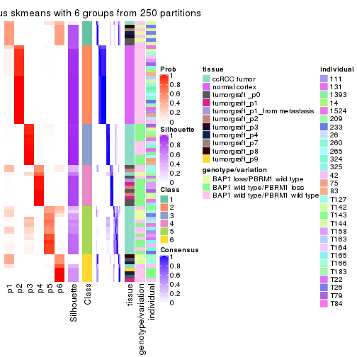</p>

</div>
</div>

Heatmaps for the membership of samples in all partitions to see how consistent they are:


<script>
$( function() {
	$( '#tabs-SD-skmeans-membership-heatmap' ).tabs();
} );
</script>
<div id='tabs-SD-skmeans-membership-heatmap'>
<ul>
<li><a href='#tab-SD-skmeans-membership-heatmap-1'>k = 2</a></li>
<li><a href='#tab-SD-skmeans-membership-heatmap-2'>k = 3</a></li>
<li><a href='#tab-SD-skmeans-membership-heatmap-3'>k = 4</a></li>
<li><a href='#tab-SD-skmeans-membership-heatmap-4'>k = 5</a></li>
<li><a href='#tab-SD-skmeans-membership-heatmap-5'>k = 6</a></li>
</ul>
<div id='tab-SD-skmeans-membership-heatmap-1'>
<pre><code class="r">membership_heatmap(res, k = 2)
</code></pre>

<p></p>

</div>
<div id='tab-SD-skmeans-membership-heatmap-2'>
<pre><code class="r">membership_heatmap(res, k = 3)
</code></pre>

<p></p>

</div>
<div id='tab-SD-skmeans-membership-heatmap-3'>
<pre><code class="r">membership_heatmap(res, k = 4)
</code></pre>

<p></p>

</div>
<div id='tab-SD-skmeans-membership-heatmap-4'>
<pre><code class="r">membership_heatmap(res, k = 5)
</code></pre>

<p></p>

</div>
<div id='tab-SD-skmeans-membership-heatmap-5'>
<pre><code class="r">membership_heatmap(res, k = 6)
</code></pre>

<p></p>

</div>
</div>

As soon as we have had the classes for columns, we can look for signatures
which are significantly different between classes which can be candidate marks
for certain classes. Following are the heatmaps for signatures.


Signature heatmaps where rows are scaled:


<script>
$( function() {
	$( '#tabs-SD-skmeans-get-signatures' ).tabs();
} );
</script>
<div id='tabs-SD-skmeans-get-signatures'>
<ul>
<li><a href='#tab-SD-skmeans-get-signatures-1'>k = 2</a></li>
<li><a href='#tab-SD-skmeans-get-signatures-2'>k = 3</a></li>
<li><a href='#tab-SD-skmeans-get-signatures-3'>k = 4</a></li>
<li><a href='#tab-SD-skmeans-get-signatures-4'>k = 5</a></li>
<li><a href='#tab-SD-skmeans-get-signatures-5'>k = 6</a></li>
</ul>
<div id='tab-SD-skmeans-get-signatures-1'>
<pre><code class="r">get_signatures(res, k = 2)
</code></pre>

<p></p>

</div>
<div id='tab-SD-skmeans-get-signatures-2'>
<pre><code class="r">get_signatures(res, k = 3)
</code></pre>

<p></p>

</div>
<div id='tab-SD-skmeans-get-signatures-3'>
<pre><code class="r">get_signatures(res, k = 4)
</code></pre>

<p>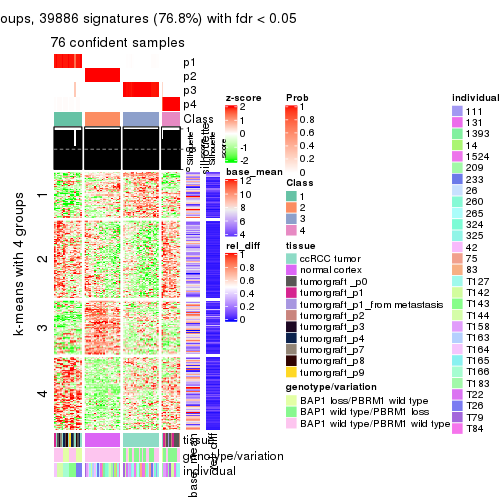</p>

</div>
<div id='tab-SD-skmeans-get-signatures-4'>
<pre><code class="r">get_signatures(res, k = 5)
</code></pre>

<p></p>

</div>
<div id='tab-SD-skmeans-get-signatures-5'>
<pre><code class="r">get_signatures(res, k = 6)
</code></pre>

<p>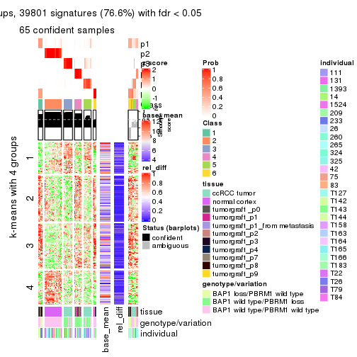</p>

</div>
</div>


Signature heatmaps where rows are not scaled:


<script>
$( function() {
	$( '#tabs-SD-skmeans-get-signatures-no-scale' ).tabs();
} );
</script>
<div id='tabs-SD-skmeans-get-signatures-no-scale'>
<ul>
<li><a href='#tab-SD-skmeans-get-signatures-no-scale-1'>k = 2</a></li>
<li><a href='#tab-SD-skmeans-get-signatures-no-scale-2'>k = 3</a></li>
<li><a href='#tab-SD-skmeans-get-signatures-no-scale-3'>k = 4</a></li>
<li><a href='#tab-SD-skmeans-get-signatures-no-scale-4'>k = 5</a></li>
<li><a href='#tab-SD-skmeans-get-signatures-no-scale-5'>k = 6</a></li>
</ul>
<div id='tab-SD-skmeans-get-signatures-no-scale-1'>
<pre><code class="r">get_signatures(res, k = 2, scale_rows = FALSE)
</code></pre>

<p></p>

</div>
<div id='tab-SD-skmeans-get-signatures-no-scale-2'>
<pre><code class="r">get_signatures(res, k = 3, scale_rows = FALSE)
</code></pre>

<p></p>

</div>
<div id='tab-SD-skmeans-get-signatures-no-scale-3'>
<pre><code class="r">get_signatures(res, k = 4, scale_rows = FALSE)
</code></pre>

<p></p>

</div>
<div id='tab-SD-skmeans-get-signatures-no-scale-4'>
<pre><code class="r">get_signatures(res, k = 5, scale_rows = FALSE)
</code></pre>

<p></p>

</div>
<div id='tab-SD-skmeans-get-signatures-no-scale-5'>
<pre><code class="r">get_signatures(res, k = 6, scale_rows = FALSE)
</code></pre>

<p></p>

</div>
</div>


Compare the overlap of signatures from different k:

```r
compare_signatures(res)
```


`get_signature()` returns a data frame invisibly. TO get the list of signatures, the function
call should be assigned to a variable explicitly. In following code, if `plot` argument is set
to `FALSE`, no heatmap is plotted while only the differential analysis is performed.

```r
# code only for demonstration
tb = get_signature(res, k = ..., plot = FALSE)
```

An example of the output of `tb` is:

```
#>   which_row         fdr    mean_1    mean_2 scaled_mean_1 scaled_mean_2 km
#> 1        38 0.042760348  8.373488  9.131774    -0.5533452     0.5164555  1
#> 2        40 0.018707592  7.106213  8.469186    -0.6173731     0.5762149  1
#> 3        55 0.019134737 10.221463 11.207825    -0.6159697     0.5749050  1
#> 4        59 0.006059896  5.921854  7.869574    -0.6899429     0.6439467  1
#> 5        60 0.018055526  8.928898 10.211722    -0.6204761     0.5791110  1
#> 6        98 0.009384629 15.714769 14.887706     0.6635654    -0.6193277  2
...
```

The columns in `tb` are:

1. `which_row`: row indices corresponding to the input matrix.
2. `fdr`: FDR for the differential test. 
3. `mean_x`: The mean value in group x.
4. `scaled_mean_x`: The mean value in group x after rows are scaled.
5. `km`: Row groups if k-means clustering is applied to rows.


UMAP plot which shows how samples are separated.


<script>
$( function() {
	$( '#tabs-SD-skmeans-dimension-reduction' ).tabs();
} );
</script>
<div id='tabs-SD-skmeans-dimension-reduction'>
<ul>
<li><a href='#tab-SD-skmeans-dimension-reduction-1'>k = 2</a></li>
<li><a href='#tab-SD-skmeans-dimension-reduction-2'>k = 3</a></li>
<li><a href='#tab-SD-skmeans-dimension-reduction-3'>k = 4</a></li>
<li><a href='#tab-SD-skmeans-dimension-reduction-4'>k = 5</a></li>
<li><a href='#tab-SD-skmeans-dimension-reduction-5'>k = 6</a></li>
</ul>
<div id='tab-SD-skmeans-dimension-reduction-1'>
<pre><code class="r">dimension_reduction(res, k = 2, method = &quot;UMAP&quot;)
</code></pre>

<p></p>

</div>
<div id='tab-SD-skmeans-dimension-reduction-2'>
<pre><code class="r">dimension_reduction(res, k = 3, method = &quot;UMAP&quot;)
</code></pre>

<p></p>

</div>
<div id='tab-SD-skmeans-dimension-reduction-3'>
<pre><code class="r">dimension_reduction(res, k = 4, method = &quot;UMAP&quot;)
</code></pre>

<p></p>

</div>
<div id='tab-SD-skmeans-dimension-reduction-4'>
<pre><code class="r">dimension_reduction(res, k = 5, method = &quot;UMAP&quot;)
</code></pre>

<p></p>

</div>
<div id='tab-SD-skmeans-dimension-reduction-5'>
<pre><code class="r">dimension_reduction(res, k = 6, method = &quot;UMAP&quot;)
</code></pre>

<p></p>

</div>
</div>


Following heatmap shows how subgroups are split when increasing `k`:

```r
collect_classes(res)
```


Test correlation between subgroups and known annotations. If the known
annotation is numeric, one-way ANOVA test is applied, and if the known
annotation is discrete, chi-squared contingency table test is applied.

```r
test_to_known_factors(res)
```

```
#>             n tissue(p) genotype/variation(p) individual(p) k
#> SD:skmeans 76  4.99e-07              1.61e-03        0.0803 2
#> SD:skmeans 74  1.34e-18              5.42e-06        0.9028 3
#> SD:skmeans 76  2.32e-19              1.01e-09        0.1977 4
#> SD:skmeans 72  1.53e-16              5.37e-08        0.3082 5
#> SD:skmeans 65  7.63e-17              9.59e-09        0.0270 6
```


If matrix rows can be associated to genes, consider to use `functional_enrichment(res,
...)` to perform function enrichment for the signature genes. See [this vignette](http://bioconductor.org/packages/devel/bioc/vignettes/cola/inst/doc/functional_enrichment.html) for more detailed explanations.


 

---------------------------------------------------


### SD:pam**


The object with results only for a single top-value method and a single partition method 
can be extracted as:

```r
res = res_list["SD", "pam"]
# you can also extract it by
# res = res_list["SD:pam"]
```

A summary of `res` and all the functions that can be applied to it:

```r
res
```

```
#> A 'ConsensusPartition' object with k = 2, 3, 4, 5, 6.
#>   On a matrix with 51941 rows and 76 columns.
#>   Top rows (1000, 2000, 3000, 4000, 5000) are extracted by 'SD' method.
#>   Subgroups are detected by 'pam' method.
#>   Performed in total 1250 partitions by row resampling.
#>   Best k for subgroups seems to be 6.
#> 
#> Following methods can be applied to this 'ConsensusPartition' object:
#>  [1] "cola_report"             "collect_classes"         "collect_plots"          
#>  [4] "collect_stats"           "colnames"                "compare_signatures"     
#>  [7] "consensus_heatmap"       "dimension_reduction"     "functional_enrichment"  
#> [10] "get_anno_col"            "get_anno"                "get_classes"            
#> [13] "get_consensus"           "get_matrix"              "get_membership"         
#> [16] "get_param"               "get_signatures"          "get_stats"              
#> [19] "is_best_k"               "is_stable_k"             "membership_heatmap"     
#> [22] "ncol"                    "nrow"                    "plot_ecdf"              
#> [25] "rownames"                "select_partition_number" "show"                   
#> [28] "suggest_best_k"          "test_to_known_factors"
```

`collect_plots()` function collects all the plots made from `res` for all `k` (number of partitions)
into one single page to provide an easy and fast comparison between different `k`.

```r
collect_plots(res)
```


The plots are:

- The first row: a plot of the ECDF (empirical cumulative distribution
  function) curves of the consensus matrix for each `k` and the heatmap of
  predicted classes for each `k`.
- The second row: heatmaps of the consensus matrix for each `k`.
- The third row: heatmaps of the membership matrix for each `k`.
- The fouth row: heatmaps of the signatures for each `k`.

All the plots in panels can be made by individual functions and they are
plotted later in this section.

`select_partition_number()` produces several plots showing different
statistics for choosing "optimized" `k`. There are following statistics:

- ECDF curves of the consensus matrix for each `k`;
- 1-PAC. [The PAC
  score](https://en.wikipedia.org/wiki/Consensus_clustering#Over-interpretation_potential_of_consensus_clustering)
  measures the proportion of the ambiguous subgrouping.
- Mean silhouette score.
- Concordance. The mean probability of fiting the consensus class ids in all
  partitions.
- Area increased. Denote $A_k$ as the area under the ECDF curve for current
  `k`, the area increased is defined as $A_k - A_{k-1}$.
- Rand index. The percent of pairs of samples that are both in a same cluster
  or both are not in a same cluster in the partition of k and k-1.
- Jaccard index. The ratio of pairs of samples are both in a same cluster in
  the partition of k and k-1 and the pairs of samples are both in a same
  cluster in the partition k or k-1.

The detailed explanations of these statistics can be found in [the _cola_
vignette](http://bioconductor.org/packages/devel/bioc/vignettes/cola/inst/doc/cola.html#toc_13).

Generally speaking, lower PAC score, higher mean silhouette score or higher
concordance corresponds to better partition. Rand index and Jaccard index
measure how similar the current partition is compared to partition with `k-1`.
If they are too similar, we won't accept `k` is better than `k-1`.

```r
select_partition_number(res)
```


The numeric values for all these statistics can be obtained by `get_stats()`.

```r
get_stats(res)
```

```
#>   k 1-PAC mean_silhouette concordance area_increased  Rand Jaccard
#> 2 2 0.572           0.931       0.949         0.4395 0.572   0.572
#> 3 3 1.000           0.993       0.997         0.5330 0.754   0.571
#> 4 4 1.000           0.986       0.995         0.0953 0.934   0.799
#> 5 5 1.000           0.992       0.998         0.0288 0.979   0.919
#> 6 6 0.959           0.925       0.954         0.0185 0.977   0.907
```

`suggest_best_k()` suggests the best $k$ based on these statistics. The rules are as follows:

- All $k$ with Jaccard index larger than 0.95 are removed because increasing
  $k$ does not provide enough extra information. If all $k$ are removed, it is
  marked as no subgroup is detected.
- For all $k$ with 1-PAC score larger than 0.9, the maximal $k$ is taken as
  the best $k$, and other $k$ are marked as optional $k$.
- If it does not fit the second rule. The $k$ with the maximal vote of the
  highest 1-PAC score, highest mean silhouette, and highest concordance is
  taken as the best $k$.

```r
suggest_best_k(res)
```

```
#> [1] 6
#> attr(,"optional")
#> [1] 3 4 5
```

There is also optional best $k$ = 3 4 5 that is worth to check.

Following shows the table of the partitions (You need to click the **show/hide
code output** link to see it). The membership matrix (columns with name `p*`)
is inferred by
[`clue::cl_consensus()`](https://www.rdocumentation.org/link/cl_consensus?package=clue)
function with the `SE` method. Basically the value in the membership matrix
represents the probability to belong to a certain group. The finall class
label for an item is determined with the group with highest probability it
belongs to.

In `get_classes()` function, the entropy is calculated from the membership
matrix and the silhouette score is calculated from the consensus matrix.


<script>
$( function() {
	$( '#tabs-SD-pam-get-classes' ).tabs();
} );
</script>
<div id='tabs-SD-pam-get-classes'>
<ul>
<li><a href='#tab-SD-pam-get-classes-1'>k = 2</a></li>
<li><a href='#tab-SD-pam-get-classes-2'>k = 3</a></li>
<li><a href='#tab-SD-pam-get-classes-3'>k = 4</a></li>
<li><a href='#tab-SD-pam-get-classes-4'>k = 5</a></li>
<li><a href='#tab-SD-pam-get-classes-5'>k = 6</a></li>
</ul>

<div id='tab-SD-pam-get-classes-1'>
<p><a id='tab-SD-pam-get-classes-1-a' style='color:#0366d6' href='#'>show/hide code output</a></p>
<pre><code class="r">cbind(get_classes(res, k = 2), get_membership(res, k = 2))
</code></pre>

<pre><code>#&gt;           class entropy silhouette    p1    p2
#&gt; GSM905004     1  0.4939      0.897 0.892 0.108
#&gt; GSM905024     1  0.0000      0.921 1.000 0.000
#&gt; GSM905038     1  0.6801      0.870 0.820 0.180
#&gt; GSM905043     1  0.0000      0.921 1.000 0.000
#&gt; GSM904986     1  0.6801      0.870 0.820 0.180
#&gt; GSM904991     1  0.0672      0.919 0.992 0.008
#&gt; GSM904994     1  0.6801      0.870 0.820 0.180
#&gt; GSM904996     1  0.6801      0.870 0.820 0.180
#&gt; GSM905007     1  0.4939      0.897 0.892 0.108
#&gt; GSM905012     1  0.6801      0.870 0.820 0.180
#&gt; GSM905022     1  0.6801      0.870 0.820 0.180
#&gt; GSM905026     1  0.6801      0.870 0.820 0.180
#&gt; GSM905027     1  0.4939      0.897 0.892 0.108
#&gt; GSM905031     1  0.6801      0.870 0.820 0.180
#&gt; GSM905036     1  0.4939      0.897 0.892 0.108
#&gt; GSM905041     1  0.0376      0.920 0.996 0.004
#&gt; GSM905044     1  0.6801      0.870 0.820 0.180
#&gt; GSM904989     1  0.6801      0.870 0.820 0.180
#&gt; GSM904999     1  0.6801      0.870 0.820 0.180
#&gt; GSM905002     1  0.6801      0.870 0.820 0.180
#&gt; GSM905009     1  0.6801      0.870 0.820 0.180
#&gt; GSM905014     1  0.6801      0.870 0.820 0.180
#&gt; GSM905017     1  0.6801      0.870 0.820 0.180
#&gt; GSM905020     1  0.6801      0.870 0.820 0.180
#&gt; GSM905023     1  0.6801      0.870 0.820 0.180
#&gt; GSM905029     1  0.6801      0.870 0.820 0.180
#&gt; GSM905032     1  0.6801      0.870 0.820 0.180
#&gt; GSM905034     1  0.0000      0.921 1.000 0.000
#&gt; GSM905040     1  0.0000      0.921 1.000 0.000
#&gt; GSM904985     2  0.0000      1.000 0.000 1.000
#&gt; GSM904988     2  0.0000      1.000 0.000 1.000
#&gt; GSM904990     2  0.0000      1.000 0.000 1.000
#&gt; GSM904992     2  0.0000      1.000 0.000 1.000
#&gt; GSM904995     2  0.0000      1.000 0.000 1.000
#&gt; GSM904998     2  0.0000      1.000 0.000 1.000
#&gt; GSM905000     2  0.0000      1.000 0.000 1.000
#&gt; GSM905003     2  0.0000      1.000 0.000 1.000
#&gt; GSM905006     2  0.0000      1.000 0.000 1.000
#&gt; GSM905008     2  0.0000      1.000 0.000 1.000
#&gt; GSM905011     2  0.0000      1.000 0.000 1.000
#&gt; GSM905013     2  0.0000      1.000 0.000 1.000
#&gt; GSM905016     2  0.0000      1.000 0.000 1.000
#&gt; GSM905018     2  0.0000      1.000 0.000 1.000
#&gt; GSM905021     2  0.0000      1.000 0.000 1.000
#&gt; GSM905025     2  0.0000      1.000 0.000 1.000
#&gt; GSM905028     2  0.0000      1.000 0.000 1.000
#&gt; GSM905030     2  0.0000      1.000 0.000 1.000
#&gt; GSM905033     2  0.0000      1.000 0.000 1.000
#&gt; GSM905035     2  0.0000      1.000 0.000 1.000
#&gt; GSM905037     2  0.0000      1.000 0.000 1.000
#&gt; GSM905039     2  0.0000      1.000 0.000 1.000
#&gt; GSM905042     2  0.0000      1.000 0.000 1.000
#&gt; GSM905046     1  0.0000      0.921 1.000 0.000
#&gt; GSM905065     1  0.0000      0.921 1.000 0.000
#&gt; GSM905049     1  0.0000      0.921 1.000 0.000
#&gt; GSM905050     1  0.0000      0.921 1.000 0.000
#&gt; GSM905064     1  0.0000      0.921 1.000 0.000
#&gt; GSM905045     1  0.0000      0.921 1.000 0.000
#&gt; GSM905051     1  0.0000      0.921 1.000 0.000
#&gt; GSM905055     1  0.0000      0.921 1.000 0.000
#&gt; GSM905058     1  0.0000      0.921 1.000 0.000
#&gt; GSM905053     1  0.0000      0.921 1.000 0.000
#&gt; GSM905061     1  0.0000      0.921 1.000 0.000
#&gt; GSM905063     1  0.0000      0.921 1.000 0.000
#&gt; GSM905054     1  0.0000      0.921 1.000 0.000
#&gt; GSM905062     1  0.0000      0.921 1.000 0.000
#&gt; GSM905052     1  0.0000      0.921 1.000 0.000
#&gt; GSM905059     1  0.0000      0.921 1.000 0.000
#&gt; GSM905047     1  0.0000      0.921 1.000 0.000
#&gt; GSM905066     1  0.0000      0.921 1.000 0.000
#&gt; GSM905056     1  0.0000      0.921 1.000 0.000
#&gt; GSM905060     1  0.0000      0.921 1.000 0.000
#&gt; GSM905048     1  0.0000      0.921 1.000 0.000
#&gt; GSM905067     1  0.0000      0.921 1.000 0.000
#&gt; GSM905057     1  0.0000      0.921 1.000 0.000
#&gt; GSM905068     1  0.0000      0.921 1.000 0.000
</code></pre>

<script>
$('#tab-SD-pam-get-classes-1-a').parent().next().next().hide();
$('#tab-SD-pam-get-classes-1-a').click(function(){
  $('#tab-SD-pam-get-classes-1-a').parent().next().next().toggle();
  return(false);
});
</script>
</div>

<div id='tab-SD-pam-get-classes-2'>
<p><a id='tab-SD-pam-get-classes-2-a' style='color:#0366d6' href='#'>show/hide code output</a></p>
<pre><code class="r">cbind(get_classes(res, k = 3), get_membership(res, k = 3))
</code></pre>

<pre><code>#&gt;           class entropy silhouette    p1 p2    p3
#&gt; GSM905004     3  0.0000      1.000 0.000  0 1.000
#&gt; GSM905024     1  0.0237      0.987 0.996  0 0.004
#&gt; GSM905038     3  0.0000      1.000 0.000  0 1.000
#&gt; GSM905043     1  0.4346      0.778 0.816  0 0.184
#&gt; GSM904986     3  0.0000      1.000 0.000  0 1.000
#&gt; GSM904991     3  0.0000      1.000 0.000  0 1.000
#&gt; GSM904994     3  0.0000      1.000 0.000  0 1.000
#&gt; GSM904996     3  0.0000      1.000 0.000  0 1.000
#&gt; GSM905007     3  0.0000      1.000 0.000  0 1.000
#&gt; GSM905012     3  0.0000      1.000 0.000  0 1.000
#&gt; GSM905022     3  0.0000      1.000 0.000  0 1.000
#&gt; GSM905026     3  0.0000      1.000 0.000  0 1.000
#&gt; GSM905027     3  0.0000      1.000 0.000  0 1.000
#&gt; GSM905031     3  0.0000      1.000 0.000  0 1.000
#&gt; GSM905036     3  0.0000      1.000 0.000  0 1.000
#&gt; GSM905041     3  0.0000      1.000 0.000  0 1.000
#&gt; GSM905044     3  0.0000      1.000 0.000  0 1.000
#&gt; GSM904989     3  0.0000      1.000 0.000  0 1.000
#&gt; GSM904999     3  0.0000      1.000 0.000  0 1.000
#&gt; GSM905002     3  0.0000      1.000 0.000  0 1.000
#&gt; GSM905009     3  0.0000      1.000 0.000  0 1.000
#&gt; GSM905014     3  0.0000      1.000 0.000  0 1.000
#&gt; GSM905017     3  0.0000      1.000 0.000  0 1.000
#&gt; GSM905020     3  0.0000      1.000 0.000  0 1.000
#&gt; GSM905023     3  0.0000      1.000 0.000  0 1.000
#&gt; GSM905029     3  0.0000      1.000 0.000  0 1.000
#&gt; GSM905032     3  0.0000      1.000 0.000  0 1.000
#&gt; GSM905034     1  0.0000      0.991 1.000  0 0.000
#&gt; GSM905040     1  0.0000      0.991 1.000  0 0.000
#&gt; GSM904985     2  0.0000      1.000 0.000  1 0.000
#&gt; GSM904988     2  0.0000      1.000 0.000  1 0.000
#&gt; GSM904990     2  0.0000      1.000 0.000  1 0.000
#&gt; GSM904992     2  0.0000      1.000 0.000  1 0.000
#&gt; GSM904995     2  0.0000      1.000 0.000  1 0.000
#&gt; GSM904998     2  0.0000      1.000 0.000  1 0.000
#&gt; GSM905000     2  0.0000      1.000 0.000  1 0.000
#&gt; GSM905003     2  0.0000      1.000 0.000  1 0.000
#&gt; GSM905006     2  0.0000      1.000 0.000  1 0.000
#&gt; GSM905008     2  0.0000      1.000 0.000  1 0.000
#&gt; GSM905011     2  0.0000      1.000 0.000  1 0.000
#&gt; GSM905013     2  0.0000      1.000 0.000  1 0.000
#&gt; GSM905016     2  0.0000      1.000 0.000  1 0.000
#&gt; GSM905018     2  0.0000      1.000 0.000  1 0.000
#&gt; GSM905021     2  0.0000      1.000 0.000  1 0.000
#&gt; GSM905025     2  0.0000      1.000 0.000  1 0.000
#&gt; GSM905028     2  0.0000      1.000 0.000  1 0.000
#&gt; GSM905030     2  0.0000      1.000 0.000  1 0.000
#&gt; GSM905033     2  0.0000      1.000 0.000  1 0.000
#&gt; GSM905035     2  0.0000      1.000 0.000  1 0.000
#&gt; GSM905037     2  0.0000      1.000 0.000  1 0.000
#&gt; GSM905039     2  0.0000      1.000 0.000  1 0.000
#&gt; GSM905042     2  0.0000      1.000 0.000  1 0.000
#&gt; GSM905046     1  0.0000      0.991 1.000  0 0.000
#&gt; GSM905065     1  0.0000      0.991 1.000  0 0.000
#&gt; GSM905049     1  0.0000      0.991 1.000  0 0.000
#&gt; GSM905050     1  0.1753      0.947 0.952  0 0.048
#&gt; GSM905064     1  0.0000      0.991 1.000  0 0.000
#&gt; GSM905045     1  0.0000      0.991 1.000  0 0.000
#&gt; GSM905051     1  0.0000      0.991 1.000  0 0.000
#&gt; GSM905055     1  0.0000      0.991 1.000  0 0.000
#&gt; GSM905058     1  0.0000      0.991 1.000  0 0.000
#&gt; GSM905053     1  0.0000      0.991 1.000  0 0.000
#&gt; GSM905061     1  0.0000      0.991 1.000  0 0.000
#&gt; GSM905063     1  0.0000      0.991 1.000  0 0.000
#&gt; GSM905054     1  0.0000      0.991 1.000  0 0.000
#&gt; GSM905062     1  0.0000      0.991 1.000  0 0.000
#&gt; GSM905052     1  0.0000      0.991 1.000  0 0.000
#&gt; GSM905059     1  0.0000      0.991 1.000  0 0.000
#&gt; GSM905047     1  0.0000      0.991 1.000  0 0.000
#&gt; GSM905066     1  0.0000      0.991 1.000  0 0.000
#&gt; GSM905056     1  0.0000      0.991 1.000  0 0.000
#&gt; GSM905060     1  0.0000      0.991 1.000  0 0.000
#&gt; GSM905048     1  0.0000      0.991 1.000  0 0.000
#&gt; GSM905067     1  0.0000      0.991 1.000  0 0.000
#&gt; GSM905057     1  0.0000      0.991 1.000  0 0.000
#&gt; GSM905068     1  0.0747      0.977 0.984  0 0.016
</code></pre>

<script>
$('#tab-SD-pam-get-classes-2-a').parent().next().next().hide();
$('#tab-SD-pam-get-classes-2-a').click(function(){
  $('#tab-SD-pam-get-classes-2-a').parent().next().next().toggle();
  return(false);
});
</script>
</div>

<div id='tab-SD-pam-get-classes-3'>
<p><a id='tab-SD-pam-get-classes-3-a' style='color:#0366d6' href='#'>show/hide code output</a></p>
<pre><code class="r">cbind(get_classes(res, k = 4), get_membership(res, k = 4))
</code></pre>

<pre><code>#&gt;           class entropy silhouette    p1 p2    p3    p4
#&gt; GSM905004     3  0.0000      1.000 0.000  0 1.000 0.000
#&gt; GSM905024     1  0.4746      0.420 0.632  0 0.368 0.000
#&gt; GSM905038     3  0.0000      1.000 0.000  0 1.000 0.000
#&gt; GSM905043     1  0.0336      0.963 0.992  0 0.008 0.000
#&gt; GSM904986     3  0.0000      1.000 0.000  0 1.000 0.000
#&gt; GSM904991     3  0.0000      1.000 0.000  0 1.000 0.000
#&gt; GSM904994     3  0.0000      1.000 0.000  0 1.000 0.000
#&gt; GSM904996     3  0.0000      1.000 0.000  0 1.000 0.000
#&gt; GSM905007     3  0.0000      1.000 0.000  0 1.000 0.000
#&gt; GSM905012     3  0.0000      1.000 0.000  0 1.000 0.000
#&gt; GSM905022     3  0.0000      1.000 0.000  0 1.000 0.000
#&gt; GSM905026     3  0.0000      1.000 0.000  0 1.000 0.000
#&gt; GSM905027     3  0.0000      1.000 0.000  0 1.000 0.000
#&gt; GSM905031     3  0.0000      1.000 0.000  0 1.000 0.000
#&gt; GSM905036     3  0.0000      1.000 0.000  0 1.000 0.000
#&gt; GSM905041     3  0.0000      1.000 0.000  0 1.000 0.000
#&gt; GSM905044     3  0.0000      1.000 0.000  0 1.000 0.000
#&gt; GSM904989     3  0.0000      1.000 0.000  0 1.000 0.000
#&gt; GSM904999     3  0.0000      1.000 0.000  0 1.000 0.000
#&gt; GSM905002     3  0.0000      1.000 0.000  0 1.000 0.000
#&gt; GSM905009     3  0.0000      1.000 0.000  0 1.000 0.000
#&gt; GSM905014     3  0.0000      1.000 0.000  0 1.000 0.000
#&gt; GSM905017     3  0.0000      1.000 0.000  0 1.000 0.000
#&gt; GSM905020     3  0.0000      1.000 0.000  0 1.000 0.000
#&gt; GSM905023     3  0.0000      1.000 0.000  0 1.000 0.000
#&gt; GSM905029     3  0.0000      1.000 0.000  0 1.000 0.000
#&gt; GSM905032     3  0.0000      1.000 0.000  0 1.000 0.000
#&gt; GSM905034     1  0.0000      0.970 1.000  0 0.000 0.000
#&gt; GSM905040     1  0.0000      0.970 1.000  0 0.000 0.000
#&gt; GSM904985     2  0.0000      1.000 0.000  1 0.000 0.000
#&gt; GSM904988     2  0.0000      1.000 0.000  1 0.000 0.000
#&gt; GSM904990     2  0.0000      1.000 0.000  1 0.000 0.000
#&gt; GSM904992     2  0.0000      1.000 0.000  1 0.000 0.000
#&gt; GSM904995     2  0.0000      1.000 0.000  1 0.000 0.000
#&gt; GSM904998     2  0.0000      1.000 0.000  1 0.000 0.000
#&gt; GSM905000     2  0.0000      1.000 0.000  1 0.000 0.000
#&gt; GSM905003     2  0.0000      1.000 0.000  1 0.000 0.000
#&gt; GSM905006     2  0.0000      1.000 0.000  1 0.000 0.000
#&gt; GSM905008     2  0.0000      1.000 0.000  1 0.000 0.000
#&gt; GSM905011     2  0.0000      1.000 0.000  1 0.000 0.000
#&gt; GSM905013     2  0.0000      1.000 0.000  1 0.000 0.000
#&gt; GSM905016     2  0.0000      1.000 0.000  1 0.000 0.000
#&gt; GSM905018     2  0.0000      1.000 0.000  1 0.000 0.000
#&gt; GSM905021     2  0.0000      1.000 0.000  1 0.000 0.000
#&gt; GSM905025     2  0.0000      1.000 0.000  1 0.000 0.000
#&gt; GSM905028     2  0.0000      1.000 0.000  1 0.000 0.000
#&gt; GSM905030     2  0.0000      1.000 0.000  1 0.000 0.000
#&gt; GSM905033     2  0.0000      1.000 0.000  1 0.000 0.000
#&gt; GSM905035     2  0.0000      1.000 0.000  1 0.000 0.000
#&gt; GSM905037     2  0.0000      1.000 0.000  1 0.000 0.000
#&gt; GSM905039     2  0.0000      1.000 0.000  1 0.000 0.000
#&gt; GSM905042     2  0.0000      1.000 0.000  1 0.000 0.000
#&gt; GSM905046     1  0.0000      0.970 1.000  0 0.000 0.000
#&gt; GSM905065     1  0.0000      0.970 1.000  0 0.000 0.000
#&gt; GSM905049     4  0.0000      1.000 0.000  0 0.000 1.000
#&gt; GSM905050     4  0.0000      1.000 0.000  0 0.000 1.000
#&gt; GSM905064     4  0.0000      1.000 0.000  0 0.000 1.000
#&gt; GSM905045     4  0.0000      1.000 0.000  0 0.000 1.000
#&gt; GSM905051     4  0.0000      1.000 0.000  0 0.000 1.000
#&gt; GSM905055     1  0.0000      0.970 1.000  0 0.000 0.000
#&gt; GSM905058     1  0.0000      0.970 1.000  0 0.000 0.000
#&gt; GSM905053     4  0.0000      1.000 0.000  0 0.000 1.000
#&gt; GSM905061     4  0.0000      1.000 0.000  0 0.000 1.000
#&gt; GSM905063     1  0.0000      0.970 1.000  0 0.000 0.000
#&gt; GSM905054     4  0.0000      1.000 0.000  0 0.000 1.000
#&gt; GSM905062     4  0.0000      1.000 0.000  0 0.000 1.000
#&gt; GSM905052     4  0.0000      1.000 0.000  0 0.000 1.000
#&gt; GSM905059     1  0.0469      0.960 0.988  0 0.000 0.012
#&gt; GSM905047     1  0.0000      0.970 1.000  0 0.000 0.000
#&gt; GSM905066     1  0.0000      0.970 1.000  0 0.000 0.000
#&gt; GSM905056     1  0.0000      0.970 1.000  0 0.000 0.000
#&gt; GSM905060     1  0.0000      0.970 1.000  0 0.000 0.000
#&gt; GSM905048     1  0.0000      0.970 1.000  0 0.000 0.000
#&gt; GSM905067     1  0.0000      0.970 1.000  0 0.000 0.000
#&gt; GSM905057     1  0.0000      0.970 1.000  0 0.000 0.000
#&gt; GSM905068     4  0.0000      1.000 0.000  0 0.000 1.000
</code></pre>

<script>
$('#tab-SD-pam-get-classes-3-a').parent().next().next().hide();
$('#tab-SD-pam-get-classes-3-a').click(function(){
  $('#tab-SD-pam-get-classes-3-a').parent().next().next().toggle();
  return(false);
});
</script>
</div>

<div id='tab-SD-pam-get-classes-4'>
<p><a id='tab-SD-pam-get-classes-4-a' style='color:#0366d6' href='#'>show/hide code output</a></p>
<pre><code class="r">cbind(get_classes(res, k = 5), get_membership(res, k = 5))
</code></pre>

<pre><code>#&gt;           class entropy silhouette    p1 p2    p3 p4 p5
#&gt; GSM905004     3  0.0000      1.000 0.000  0 1.000  0  0
#&gt; GSM905024     1  0.0162      0.970 0.996  0 0.004  0  0
#&gt; GSM905038     3  0.0000      1.000 0.000  0 1.000  0  0
#&gt; GSM905043     1  0.2966      0.704 0.816  0 0.184  0  0
#&gt; GSM904986     3  0.0000      1.000 0.000  0 1.000  0  0
#&gt; GSM904991     3  0.0000      1.000 0.000  0 1.000  0  0
#&gt; GSM904994     3  0.0000      1.000 0.000  0 1.000  0  0
#&gt; GSM904996     3  0.0000      1.000 0.000  0 1.000  0  0
#&gt; GSM905007     3  0.0000      1.000 0.000  0 1.000  0  0
#&gt; GSM905012     3  0.0000      1.000 0.000  0 1.000  0  0
#&gt; GSM905022     3  0.0000      1.000 0.000  0 1.000  0  0
#&gt; GSM905026     3  0.0000      1.000 0.000  0 1.000  0  0
#&gt; GSM905027     3  0.0000      1.000 0.000  0 1.000  0  0
#&gt; GSM905031     3  0.0000      1.000 0.000  0 1.000  0  0
#&gt; GSM905036     3  0.0000      1.000 0.000  0 1.000  0  0
#&gt; GSM905041     3  0.0000      1.000 0.000  0 1.000  0  0
#&gt; GSM905044     3  0.0000      1.000 0.000  0 1.000  0  0
#&gt; GSM904989     3  0.0000      1.000 0.000  0 1.000  0  0
#&gt; GSM904999     3  0.0000      1.000 0.000  0 1.000  0  0
#&gt; GSM905002     3  0.0000      1.000 0.000  0 1.000  0  0
#&gt; GSM905009     3  0.0000      1.000 0.000  0 1.000  0  0
#&gt; GSM905014     3  0.0000      1.000 0.000  0 1.000  0  0
#&gt; GSM905017     3  0.0000      1.000 0.000  0 1.000  0  0
#&gt; GSM905020     3  0.0000      1.000 0.000  0 1.000  0  0
#&gt; GSM905023     3  0.0000      1.000 0.000  0 1.000  0  0
#&gt; GSM905029     3  0.0000      1.000 0.000  0 1.000  0  0
#&gt; GSM905032     3  0.0000      1.000 0.000  0 1.000  0  0
#&gt; GSM905034     1  0.0000      0.975 1.000  0 0.000  0  0
#&gt; GSM905040     5  0.0000      1.000 0.000  0 0.000  0  1
#&gt; GSM904985     2  0.0000      1.000 0.000  1 0.000  0  0
#&gt; GSM904988     2  0.0000      1.000 0.000  1 0.000  0  0
#&gt; GSM904990     2  0.0000      1.000 0.000  1 0.000  0  0
#&gt; GSM904992     2  0.0000      1.000 0.000  1 0.000  0  0
#&gt; GSM904995     2  0.0000      1.000 0.000  1 0.000  0  0
#&gt; GSM904998     2  0.0000      1.000 0.000  1 0.000  0  0
#&gt; GSM905000     2  0.0000      1.000 0.000  1 0.000  0  0
#&gt; GSM905003     2  0.0000      1.000 0.000  1 0.000  0  0
#&gt; GSM905006     2  0.0000      1.000 0.000  1 0.000  0  0
#&gt; GSM905008     2  0.0000      1.000 0.000  1 0.000  0  0
#&gt; GSM905011     2  0.0000      1.000 0.000  1 0.000  0  0
#&gt; GSM905013     2  0.0000      1.000 0.000  1 0.000  0  0
#&gt; GSM905016     2  0.0000      1.000 0.000  1 0.000  0  0
#&gt; GSM905018     2  0.0000      1.000 0.000  1 0.000  0  0
#&gt; GSM905021     2  0.0000      1.000 0.000  1 0.000  0  0
#&gt; GSM905025     2  0.0000      1.000 0.000  1 0.000  0  0
#&gt; GSM905028     2  0.0000      1.000 0.000  1 0.000  0  0
#&gt; GSM905030     2  0.0000      1.000 0.000  1 0.000  0  0
#&gt; GSM905033     2  0.0000      1.000 0.000  1 0.000  0  0
#&gt; GSM905035     2  0.0000      1.000 0.000  1 0.000  0  0
#&gt; GSM905037     2  0.0000      1.000 0.000  1 0.000  0  0
#&gt; GSM905039     2  0.0000      1.000 0.000  1 0.000  0  0
#&gt; GSM905042     2  0.0000      1.000 0.000  1 0.000  0  0
#&gt; GSM905046     1  0.0000      0.975 1.000  0 0.000  0  0
#&gt; GSM905065     1  0.0000      0.975 1.000  0 0.000  0  0
#&gt; GSM905049     4  0.0000      1.000 0.000  0 0.000  1  0
#&gt; GSM905050     4  0.0000      1.000 0.000  0 0.000  1  0
#&gt; GSM905064     4  0.0000      1.000 0.000  0 0.000  1  0
#&gt; GSM905045     4  0.0000      1.000 0.000  0 0.000  1  0
#&gt; GSM905051     4  0.0000      1.000 0.000  0 0.000  1  0
#&gt; GSM905055     5  0.0000      1.000 0.000  0 0.000  0  1
#&gt; GSM905058     1  0.0000      0.975 1.000  0 0.000  0  0
#&gt; GSM905053     4  0.0000      1.000 0.000  0 0.000  1  0
#&gt; GSM905061     4  0.0000      1.000 0.000  0 0.000  1  0
#&gt; GSM905063     5  0.0000      1.000 0.000  0 0.000  0  1
#&gt; GSM905054     4  0.0000      1.000 0.000  0 0.000  1  0
#&gt; GSM905062     4  0.0000      1.000 0.000  0 0.000  1  0
#&gt; GSM905052     4  0.0000      1.000 0.000  0 0.000  1  0
#&gt; GSM905059     1  0.0000      0.975 1.000  0 0.000  0  0
#&gt; GSM905047     1  0.0000      0.975 1.000  0 0.000  0  0
#&gt; GSM905066     1  0.0000      0.975 1.000  0 0.000  0  0
#&gt; GSM905056     5  0.0000      1.000 0.000  0 0.000  0  1
#&gt; GSM905060     1  0.0000      0.975 1.000  0 0.000  0  0
#&gt; GSM905048     1  0.0000      0.975 1.000  0 0.000  0  0
#&gt; GSM905067     1  0.0000      0.975 1.000  0 0.000  0  0
#&gt; GSM905057     5  0.0000      1.000 0.000  0 0.000  0  1
#&gt; GSM905068     4  0.0000      1.000 0.000  0 0.000  1  0
</code></pre>

<script>
$('#tab-SD-pam-get-classes-4-a').parent().next().next().hide();
$('#tab-SD-pam-get-classes-4-a').click(function(){
  $('#tab-SD-pam-get-classes-4-a').parent().next().next().toggle();
  return(false);
});
</script>
</div>

<div id='tab-SD-pam-get-classes-5'>
<p><a id='tab-SD-pam-get-classes-5-a' style='color:#0366d6' href='#'>show/hide code output</a></p>
<pre><code class="r">cbind(get_classes(res, k = 6), get_membership(res, k = 6))
</code></pre>

<pre><code>#&gt;           class entropy silhouette    p1 p2    p3 p4    p5    p6
#&gt; GSM905004     3  0.0000      0.947 0.000  0 1.000  0 0.000 0.000
#&gt; GSM905024     3  0.3563      0.617 0.000  0 0.664  0 0.336 0.000
#&gt; GSM905038     3  0.0000      0.947 0.000  0 1.000  0 0.000 0.000
#&gt; GSM905043     1  0.3563      0.451 0.664  0 0.000  0 0.336 0.000
#&gt; GSM904986     3  0.0000      0.947 0.000  0 1.000  0 0.000 0.000
#&gt; GSM904991     3  0.3563      0.617 0.000  0 0.664  0 0.336 0.000
#&gt; GSM904994     3  0.0000      0.947 0.000  0 1.000  0 0.000 0.000
#&gt; GSM904996     3  0.0000      0.947 0.000  0 1.000  0 0.000 0.000
#&gt; GSM905007     3  0.0146      0.945 0.000  0 0.996  0 0.004 0.000
#&gt; GSM905012     3  0.0000      0.947 0.000  0 1.000  0 0.000 0.000
#&gt; GSM905022     3  0.0000      0.947 0.000  0 1.000  0 0.000 0.000
#&gt; GSM905026     3  0.0000      0.947 0.000  0 1.000  0 0.000 0.000
#&gt; GSM905027     3  0.0000      0.947 0.000  0 1.000  0 0.000 0.000
#&gt; GSM905031     3  0.0000      0.947 0.000  0 1.000  0 0.000 0.000
#&gt; GSM905036     3  0.0146      0.945 0.000  0 0.996  0 0.004 0.000
#&gt; GSM905041     3  0.3351      0.677 0.000  0 0.712  0 0.288 0.000
#&gt; GSM905044     3  0.0000      0.947 0.000  0 1.000  0 0.000 0.000
#&gt; GSM904989     3  0.0000      0.947 0.000  0 1.000  0 0.000 0.000
#&gt; GSM904999     3  0.0000      0.947 0.000  0 1.000  0 0.000 0.000
#&gt; GSM905002     3  0.0000      0.947 0.000  0 1.000  0 0.000 0.000
#&gt; GSM905009     3  0.0000      0.947 0.000  0 1.000  0 0.000 0.000
#&gt; GSM905014     3  0.0146      0.945 0.000  0 0.996  0 0.004 0.000
#&gt; GSM905017     3  0.0000      0.947 0.000  0 1.000  0 0.000 0.000
#&gt; GSM905020     3  0.0000      0.947 0.000  0 1.000  0 0.000 0.000
#&gt; GSM905023     3  0.0146      0.945 0.000  0 0.996  0 0.004 0.000
#&gt; GSM905029     3  0.0000      0.947 0.000  0 1.000  0 0.000 0.000
#&gt; GSM905032     3  0.3531      0.628 0.000  0 0.672  0 0.328 0.000
#&gt; GSM905034     5  0.0000      0.482 0.000  0 0.000  0 1.000 0.000
#&gt; GSM905040     6  0.3547      0.595 0.000  0 0.000  0 0.332 0.668
#&gt; GSM904985     2  0.0000      1.000 0.000  1 0.000  0 0.000 0.000
#&gt; GSM904988     2  0.0000      1.000 0.000  1 0.000  0 0.000 0.000
#&gt; GSM904990     2  0.0000      1.000 0.000  1 0.000  0 0.000 0.000
#&gt; GSM904992     2  0.0000      1.000 0.000  1 0.000  0 0.000 0.000
#&gt; GSM904995     2  0.0000      1.000 0.000  1 0.000  0 0.000 0.000
#&gt; GSM904998     2  0.0000      1.000 0.000  1 0.000  0 0.000 0.000
#&gt; GSM905000     2  0.0000      1.000 0.000  1 0.000  0 0.000 0.000
#&gt; GSM905003     2  0.0000      1.000 0.000  1 0.000  0 0.000 0.000
#&gt; GSM905006     2  0.0000      1.000 0.000  1 0.000  0 0.000 0.000
#&gt; GSM905008     2  0.0000      1.000 0.000  1 0.000  0 0.000 0.000
#&gt; GSM905011     2  0.0000      1.000 0.000  1 0.000  0 0.000 0.000
#&gt; GSM905013     2  0.0000      1.000 0.000  1 0.000  0 0.000 0.000
#&gt; GSM905016     2  0.0000      1.000 0.000  1 0.000  0 0.000 0.000
#&gt; GSM905018     2  0.0000      1.000 0.000  1 0.000  0 0.000 0.000
#&gt; GSM905021     2  0.0000      1.000 0.000  1 0.000  0 0.000 0.000
#&gt; GSM905025     2  0.0000      1.000 0.000  1 0.000  0 0.000 0.000
#&gt; GSM905028     2  0.0000      1.000 0.000  1 0.000  0 0.000 0.000
#&gt; GSM905030     2  0.0000      1.000 0.000  1 0.000  0 0.000 0.000
#&gt; GSM905033     2  0.0000      1.000 0.000  1 0.000  0 0.000 0.000
#&gt; GSM905035     2  0.0000      1.000 0.000  1 0.000  0 0.000 0.000
#&gt; GSM905037     2  0.0000      1.000 0.000  1 0.000  0 0.000 0.000
#&gt; GSM905039     2  0.0000      1.000 0.000  1 0.000  0 0.000 0.000
#&gt; GSM905042     2  0.0000      1.000 0.000  1 0.000  0 0.000 0.000
#&gt; GSM905046     1  0.0458      0.862 0.984  0 0.000  0 0.016 0.000
#&gt; GSM905065     1  0.0000      0.879 1.000  0 0.000  0 0.000 0.000
#&gt; GSM905049     4  0.0000      1.000 0.000  0 0.000  1 0.000 0.000
#&gt; GSM905050     4  0.0000      1.000 0.000  0 0.000  1 0.000 0.000
#&gt; GSM905064     4  0.0000      1.000 0.000  0 0.000  1 0.000 0.000
#&gt; GSM905045     4  0.0000      1.000 0.000  0 0.000  1 0.000 0.000
#&gt; GSM905051     4  0.0000      1.000 0.000  0 0.000  1 0.000 0.000
#&gt; GSM905055     6  0.0000      0.907 0.000  0 0.000  0 0.000 1.000
#&gt; GSM905058     5  0.3563      0.851 0.336  0 0.000  0 0.664 0.000
#&gt; GSM905053     4  0.0000      1.000 0.000  0 0.000  1 0.000 0.000
#&gt; GSM905061     4  0.0000      1.000 0.000  0 0.000  1 0.000 0.000
#&gt; GSM905063     6  0.0405      0.901 0.008  0 0.000  0 0.004 0.988
#&gt; GSM905054     4  0.0000      1.000 0.000  0 0.000  1 0.000 0.000
#&gt; GSM905062     4  0.0000      1.000 0.000  0 0.000  1 0.000 0.000
#&gt; GSM905052     4  0.0000      1.000 0.000  0 0.000  1 0.000 0.000
#&gt; GSM905059     5  0.3563      0.851 0.336  0 0.000  0 0.664 0.000
#&gt; GSM905047     5  0.3563      0.851 0.336  0 0.000  0 0.664 0.000
#&gt; GSM905066     1  0.0000      0.879 1.000  0 0.000  0 0.000 0.000
#&gt; GSM905056     6  0.0000      0.907 0.000  0 0.000  0 0.000 1.000
#&gt; GSM905060     5  0.3563      0.851 0.336  0 0.000  0 0.664 0.000
#&gt; GSM905048     1  0.0000      0.879 1.000  0 0.000  0 0.000 0.000
#&gt; GSM905067     1  0.0000      0.879 1.000  0 0.000  0 0.000 0.000
#&gt; GSM905057     6  0.0000      0.907 0.000  0 0.000  0 0.000 1.000
#&gt; GSM905068     4  0.0000      1.000 0.000  0 0.000  1 0.000 0.000
</code></pre>

<script>
$('#tab-SD-pam-get-classes-5-a').parent().next().next().hide();
$('#tab-SD-pam-get-classes-5-a').click(function(){
  $('#tab-SD-pam-get-classes-5-a').parent().next().next().toggle();
  return(false);
});
</script>
</div>
</div>

Heatmaps for the consensus matrix. It visualizes the probability of two
samples to be in a same group.


<script>
$( function() {
	$( '#tabs-SD-pam-consensus-heatmap' ).tabs();
} );
</script>
<div id='tabs-SD-pam-consensus-heatmap'>
<ul>
<li><a href='#tab-SD-pam-consensus-heatmap-1'>k = 2</a></li>
<li><a href='#tab-SD-pam-consensus-heatmap-2'>k = 3</a></li>
<li><a href='#tab-SD-pam-consensus-heatmap-3'>k = 4</a></li>
<li><a href='#tab-SD-pam-consensus-heatmap-4'>k = 5</a></li>
<li><a href='#tab-SD-pam-consensus-heatmap-5'>k = 6</a></li>
</ul>
<div id='tab-SD-pam-consensus-heatmap-1'>
<pre><code class="r">consensus_heatmap(res, k = 2)
</code></pre>

<p></p>

</div>
<div id='tab-SD-pam-consensus-heatmap-2'>
<pre><code class="r">consensus_heatmap(res, k = 3)
</code></pre>

<p></p>

</div>
<div id='tab-SD-pam-consensus-heatmap-3'>
<pre><code class="r">consensus_heatmap(res, k = 4)
</code></pre>

<p></p>

</div>
<div id='tab-SD-pam-consensus-heatmap-4'>
<pre><code class="r">consensus_heatmap(res, k = 5)
</code></pre>

<p></p>

</div>
<div id='tab-SD-pam-consensus-heatmap-5'>
<pre><code class="r">consensus_heatmap(res, k = 6)
</code></pre>

<p></p>

</div>
</div>

Heatmaps for the membership of samples in all partitions to see how consistent they are:


<script>
$( function() {
	$( '#tabs-SD-pam-membership-heatmap' ).tabs();
} );
</script>
<div id='tabs-SD-pam-membership-heatmap'>
<ul>
<li><a href='#tab-SD-pam-membership-heatmap-1'>k = 2</a></li>
<li><a href='#tab-SD-pam-membership-heatmap-2'>k = 3</a></li>
<li><a href='#tab-SD-pam-membership-heatmap-3'>k = 4</a></li>
<li><a href='#tab-SD-pam-membership-heatmap-4'>k = 5</a></li>
<li><a href='#tab-SD-pam-membership-heatmap-5'>k = 6</a></li>
</ul>
<div id='tab-SD-pam-membership-heatmap-1'>
<pre><code class="r">membership_heatmap(res, k = 2)
</code></pre>

<p></p>

</div>
<div id='tab-SD-pam-membership-heatmap-2'>
<pre><code class="r">membership_heatmap(res, k = 3)
</code></pre>

<p></p>

</div>
<div id='tab-SD-pam-membership-heatmap-3'>
<pre><code class="r">membership_heatmap(res, k = 4)
</code></pre>

<p></p>

</div>
<div id='tab-SD-pam-membership-heatmap-4'>
<pre><code class="r">membership_heatmap(res, k = 5)
</code></pre>

<p></p>

</div>
<div id='tab-SD-pam-membership-heatmap-5'>
<pre><code class="r">membership_heatmap(res, k = 6)
</code></pre>

<p></p>

</div>
</div>

As soon as we have had the classes for columns, we can look for signatures
which are significantly different between classes which can be candidate marks
for certain classes. Following are the heatmaps for signatures.


Signature heatmaps where rows are scaled:


<script>
$( function() {
	$( '#tabs-SD-pam-get-signatures' ).tabs();
} );
</script>
<div id='tabs-SD-pam-get-signatures'>
<ul>
<li><a href='#tab-SD-pam-get-signatures-1'>k = 2</a></li>
<li><a href='#tab-SD-pam-get-signatures-2'>k = 3</a></li>
<li><a href='#tab-SD-pam-get-signatures-3'>k = 4</a></li>
<li><a href='#tab-SD-pam-get-signatures-4'>k = 5</a></li>
<li><a href='#tab-SD-pam-get-signatures-5'>k = 6</a></li>
</ul>
<div id='tab-SD-pam-get-signatures-1'>
<pre><code class="r">get_signatures(res, k = 2)
</code></pre>

<p></p>

</div>
<div id='tab-SD-pam-get-signatures-2'>
<pre><code class="r">get_signatures(res, k = 3)
</code></pre>

<p></p>

</div>
<div id='tab-SD-pam-get-signatures-3'>
<pre><code class="r">get_signatures(res, k = 4)
</code></pre>

<p></p>

</div>
<div id='tab-SD-pam-get-signatures-4'>
<pre><code class="r">get_signatures(res, k = 5)
</code></pre>

<p></p>

</div>
<div id='tab-SD-pam-get-signatures-5'>
<pre><code class="r">get_signatures(res, k = 6)
</code></pre>

<p></p>

</div>
</div>


Signature heatmaps where rows are not scaled:


<script>
$( function() {
	$( '#tabs-SD-pam-get-signatures-no-scale' ).tabs();
} );
</script>
<div id='tabs-SD-pam-get-signatures-no-scale'>
<ul>
<li><a href='#tab-SD-pam-get-signatures-no-scale-1'>k = 2</a></li>
<li><a href='#tab-SD-pam-get-signatures-no-scale-2'>k = 3</a></li>
<li><a href='#tab-SD-pam-get-signatures-no-scale-3'>k = 4</a></li>
<li><a href='#tab-SD-pam-get-signatures-no-scale-4'>k = 5</a></li>
<li><a href='#tab-SD-pam-get-signatures-no-scale-5'>k = 6</a></li>
</ul>
<div id='tab-SD-pam-get-signatures-no-scale-1'>
<pre><code class="r">get_signatures(res, k = 2, scale_rows = FALSE)
</code></pre>

<p></p>

</div>
<div id='tab-SD-pam-get-signatures-no-scale-2'>
<pre><code class="r">get_signatures(res, k = 3, scale_rows = FALSE)
</code></pre>

<p></p>

</div>
<div id='tab-SD-pam-get-signatures-no-scale-3'>
<pre><code class="r">get_signatures(res, k = 4, scale_rows = FALSE)
</code></pre>

<p></p>

</div>
<div id='tab-SD-pam-get-signatures-no-scale-4'>
<pre><code class="r">get_signatures(res, k = 5, scale_rows = FALSE)
</code></pre>

<p></p>

</div>
<div id='tab-SD-pam-get-signatures-no-scale-5'>
<pre><code class="r">get_signatures(res, k = 6, scale_rows = FALSE)
</code></pre>

<p>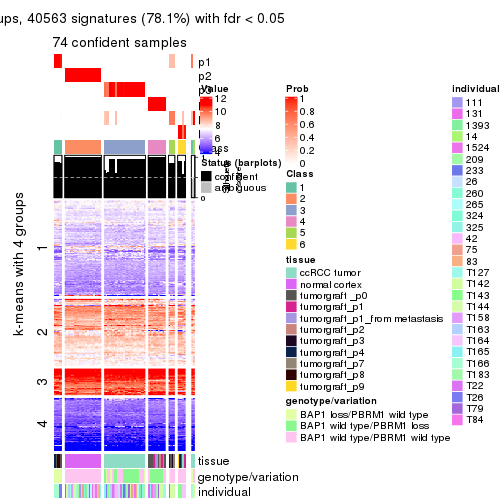</p>

</div>
</div>


Compare the overlap of signatures from different k:

```r
compare_signatures(res)
```


`get_signature()` returns a data frame invisibly. TO get the list of signatures, the function
call should be assigned to a variable explicitly. In following code, if `plot` argument is set
to `FALSE`, no heatmap is plotted while only the differential analysis is performed.

```r
# code only for demonstration
tb = get_signature(res, k = ..., plot = FALSE)
```

An example of the output of `tb` is:

```
#>   which_row         fdr    mean_1    mean_2 scaled_mean_1 scaled_mean_2 km
#> 1        38 0.042760348  8.373488  9.131774    -0.5533452     0.5164555  1
#> 2        40 0.018707592  7.106213  8.469186    -0.6173731     0.5762149  1
#> 3        55 0.019134737 10.221463 11.207825    -0.6159697     0.5749050  1
#> 4        59 0.006059896  5.921854  7.869574    -0.6899429     0.6439467  1
#> 5        60 0.018055526  8.928898 10.211722    -0.6204761     0.5791110  1
#> 6        98 0.009384629 15.714769 14.887706     0.6635654    -0.6193277  2
...
```

The columns in `tb` are:

1. `which_row`: row indices corresponding to the input matrix.
2. `fdr`: FDR for the differential test. 
3. `mean_x`: The mean value in group x.
4. `scaled_mean_x`: The mean value in group x after rows are scaled.
5. `km`: Row groups if k-means clustering is applied to rows.


UMAP plot which shows how samples are separated.


<script>
$( function() {
	$( '#tabs-SD-pam-dimension-reduction' ).tabs();
} );
</script>
<div id='tabs-SD-pam-dimension-reduction'>
<ul>
<li><a href='#tab-SD-pam-dimension-reduction-1'>k = 2</a></li>
<li><a href='#tab-SD-pam-dimension-reduction-2'>k = 3</a></li>
<li><a href='#tab-SD-pam-dimension-reduction-3'>k = 4</a></li>
<li><a href='#tab-SD-pam-dimension-reduction-4'>k = 5</a></li>
<li><a href='#tab-SD-pam-dimension-reduction-5'>k = 6</a></li>
</ul>
<div id='tab-SD-pam-dimension-reduction-1'>
<pre><code class="r">dimension_reduction(res, k = 2, method = &quot;UMAP&quot;)
</code></pre>

<p></p>

</div>
<div id='tab-SD-pam-dimension-reduction-2'>
<pre><code class="r">dimension_reduction(res, k = 3, method = &quot;UMAP&quot;)
</code></pre>

<p></p>

</div>
<div id='tab-SD-pam-dimension-reduction-3'>
<pre><code class="r">dimension_reduction(res, k = 4, method = &quot;UMAP&quot;)
</code></pre>

<p></p>

</div>
<div id='tab-SD-pam-dimension-reduction-4'>
<pre><code class="r">dimension_reduction(res, k = 5, method = &quot;UMAP&quot;)
</code></pre>

<p></p>

</div>
<div id='tab-SD-pam-dimension-reduction-5'>
<pre><code class="r">dimension_reduction(res, k = 6, method = &quot;UMAP&quot;)
</code></pre>

<p></p>

</div>
</div>


Following heatmap shows how subgroups are split when increasing `k`:

```r
collect_classes(res)
```


Test correlation between subgroups and known annotations. If the known
annotation is numeric, one-way ANOVA test is applied, and if the known
annotation is discrete, chi-squared contingency table test is applied.

```r
test_to_known_factors(res)
```

```
#>         n tissue(p) genotype/variation(p) individual(p) k
#> SD:pam 76  3.04e-12              1.17e-05        0.9902 2
#> SD:pam 76  1.53e-18              5.88e-06        0.8922 3
#> SD:pam 75  1.05e-21              2.27e-09        0.3547 4
#> SD:pam 76  1.33e-21              7.96e-12        0.0127 5
#> SD:pam 74  1.82e-26              7.00e-12        0.0266 6
```


If matrix rows can be associated to genes, consider to use `functional_enrichment(res,
...)` to perform function enrichment for the signature genes. See [this vignette](http://bioconductor.org/packages/devel/bioc/vignettes/cola/inst/doc/functional_enrichment.html) for more detailed explanations.


 

---------------------------------------------------


### SD:mclust**


The object with results only for a single top-value method and a single partition method 
can be extracted as:

```r
res = res_list["SD", "mclust"]
# you can also extract it by
# res = res_list["SD:mclust"]
```

A summary of `res` and all the functions that can be applied to it:

```r
res
```

```
#> A 'ConsensusPartition' object with k = 2, 3, 4, 5, 6.
#>   On a matrix with 51941 rows and 76 columns.
#>   Top rows (1000, 2000, 3000, 4000, 5000) are extracted by 'SD' method.
#>   Subgroups are detected by 'mclust' method.
#>   Performed in total 1250 partitions by row resampling.
#>   Best k for subgroups seems to be 5.
#> 
#> Following methods can be applied to this 'ConsensusPartition' object:
#>  [1] "cola_report"             "collect_classes"         "collect_plots"          
#>  [4] "collect_stats"           "colnames"                "compare_signatures"     
#>  [7] "consensus_heatmap"       "dimension_reduction"     "functional_enrichment"  
#> [10] "get_anno_col"            "get_anno"                "get_classes"            
#> [13] "get_consensus"           "get_matrix"              "get_membership"         
#> [16] "get_param"               "get_signatures"          "get_stats"              
#> [19] "is_best_k"               "is_stable_k"             "membership_heatmap"     
#> [22] "ncol"                    "nrow"                    "plot_ecdf"              
#> [25] "rownames"                "select_partition_number" "show"                   
#> [28] "suggest_best_k"          "test_to_known_factors"
```

`collect_plots()` function collects all the plots made from `res` for all `k` (number of partitions)
into one single page to provide an easy and fast comparison between different `k`.

```r
collect_plots(res)
```

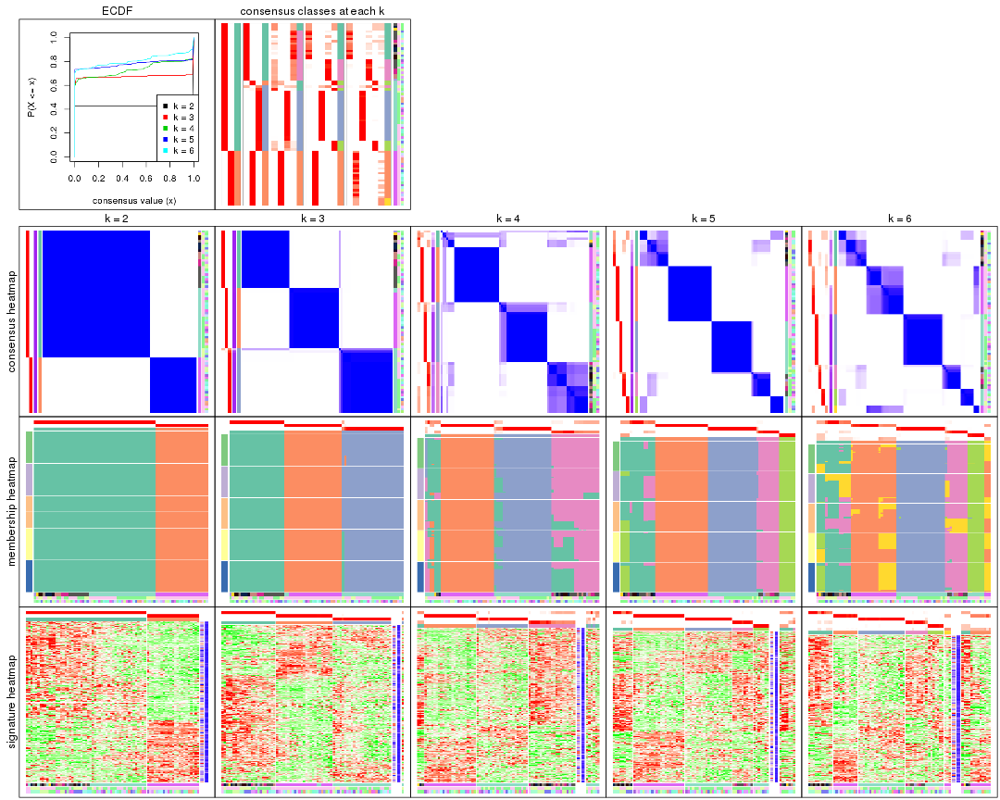

The plots are:

- The first row: a plot of the ECDF (empirical cumulative distribution
  function) curves of the consensus matrix for each `k` and the heatmap of
  predicted classes for each `k`.
- The second row: heatmaps of the consensus matrix for each `k`.
- The third row: heatmaps of the membership matrix for each `k`.
- The fouth row: heatmaps of the signatures for each `k`.

All the plots in panels can be made by individual functions and they are
plotted later in this section.

`select_partition_number()` produces several plots showing different
statistics for choosing "optimized" `k`. There are following statistics:

- ECDF curves of the consensus matrix for each `k`;
- 1-PAC. [The PAC
  score](https://en.wikipedia.org/wiki/Consensus_clustering#Over-interpretation_potential_of_consensus_clustering)
  measures the proportion of the ambiguous subgrouping.
- Mean silhouette score.
- Concordance. The mean probability of fiting the consensus class ids in all
  partitions.
- Area increased. Denote $A_k$ as the area under the ECDF curve for current
  `k`, the area increased is defined as $A_k - A_{k-1}$.
- Rand index. The percent of pairs of samples that are both in a same cluster
  or both are not in a same cluster in the partition of k and k-1.
- Jaccard index. The ratio of pairs of samples are both in a same cluster in
  the partition of k and k-1 and the pairs of samples are both in a same
  cluster in the partition k or k-1.

The detailed explanations of these statistics can be found in [the _cola_
vignette](http://bioconductor.org/packages/devel/bioc/vignettes/cola/inst/doc/cola.html#toc_13).

Generally speaking, lower PAC score, higher mean silhouette score or higher
concordance corresponds to better partition. Rand index and Jaccard index
measure how similar the current partition is compared to partition with `k-1`.
If they are too similar, we won't accept `k` is better than `k-1`.

```r
select_partition_number(res)
```


The numeric values for all these statistics can be obtained by `get_stats()`.

```r
get_stats(res)
```

```
#>   k 1-PAC mean_silhouette concordance area_increased  Rand Jaccard
#> 2 2 1.000           1.000       1.000         0.4283 0.572   0.572
#> 3 3 1.000           0.984       0.994         0.5768 0.721   0.525
#> 4 4 0.897           0.797       0.896         0.0862 0.939   0.814
#> 5 5 0.956           0.875       0.946         0.0621 0.907   0.686
#> 6 6 0.873           0.688       0.855         0.0380 0.979   0.905
```

`suggest_best_k()` suggests the best $k$ based on these statistics. The rules are as follows:

- All $k$ with Jaccard index larger than 0.95 are removed because increasing
  $k$ does not provide enough extra information. If all $k$ are removed, it is
  marked as no subgroup is detected.
- For all $k$ with 1-PAC score larger than 0.9, the maximal $k$ is taken as
  the best $k$, and other $k$ are marked as optional $k$.
- If it does not fit the second rule. The $k$ with the maximal vote of the
  highest 1-PAC score, highest mean silhouette, and highest concordance is
  taken as the best $k$.

```r
suggest_best_k(res)
```

```
#> [1] 5
#> attr(,"optional")
#> [1] 2 3
```

There is also optional best $k$ = 2 3 that is worth to check.

Following shows the table of the partitions (You need to click the **show/hide
code output** link to see it). The membership matrix (columns with name `p*`)
is inferred by
[`clue::cl_consensus()`](https://www.rdocumentation.org/link/cl_consensus?package=clue)
function with the `SE` method. Basically the value in the membership matrix
represents the probability to belong to a certain group. The finall class
label for an item is determined with the group with highest probability it
belongs to.

In `get_classes()` function, the entropy is calculated from the membership
matrix and the silhouette score is calculated from the consensus matrix.


<script>
$( function() {
	$( '#tabs-SD-mclust-get-classes' ).tabs();
} );
</script>
<div id='tabs-SD-mclust-get-classes'>
<ul>
<li><a href='#tab-SD-mclust-get-classes-1'>k = 2</a></li>
<li><a href='#tab-SD-mclust-get-classes-2'>k = 3</a></li>
<li><a href='#tab-SD-mclust-get-classes-3'>k = 4</a></li>
<li><a href='#tab-SD-mclust-get-classes-4'>k = 5</a></li>
<li><a href='#tab-SD-mclust-get-classes-5'>k = 6</a></li>
</ul>

<div id='tab-SD-mclust-get-classes-1'>
<p><a id='tab-SD-mclust-get-classes-1-a' style='color:#0366d6' href='#'>show/hide code output</a></p>
<pre><code class="r">cbind(get_classes(res, k = 2), get_membership(res, k = 2))
</code></pre>

<pre><code>#&gt;           class entropy silhouette p1 p2
#&gt; GSM905004     1       0          1  1  0
#&gt; GSM905024     1       0          1  1  0
#&gt; GSM905038     1       0          1  1  0
#&gt; GSM905043     1       0          1  1  0
#&gt; GSM904986     1       0          1  1  0
#&gt; GSM904991     1       0          1  1  0
#&gt; GSM904994     1       0          1  1  0
#&gt; GSM904996     1       0          1  1  0
#&gt; GSM905007     1       0          1  1  0
#&gt; GSM905012     1       0          1  1  0
#&gt; GSM905022     1       0          1  1  0
#&gt; GSM905026     1       0          1  1  0
#&gt; GSM905027     1       0          1  1  0
#&gt; GSM905031     1       0          1  1  0
#&gt; GSM905036     1       0          1  1  0
#&gt; GSM905041     1       0          1  1  0
#&gt; GSM905044     1       0          1  1  0
#&gt; GSM904989     1       0          1  1  0
#&gt; GSM904999     1       0          1  1  0
#&gt; GSM905002     1       0          1  1  0
#&gt; GSM905009     1       0          1  1  0
#&gt; GSM905014     1       0          1  1  0
#&gt; GSM905017     1       0          1  1  0
#&gt; GSM905020     1       0          1  1  0
#&gt; GSM905023     1       0          1  1  0
#&gt; GSM905029     1       0          1  1  0
#&gt; GSM905032     1       0          1  1  0
#&gt; GSM905034     1       0          1  1  0
#&gt; GSM905040     1       0          1  1  0
#&gt; GSM904985     2       0          1  0  1
#&gt; GSM904988     2       0          1  0  1
#&gt; GSM904990     2       0          1  0  1
#&gt; GSM904992     2       0          1  0  1
#&gt; GSM904995     2       0          1  0  1
#&gt; GSM904998     2       0          1  0  1
#&gt; GSM905000     2       0          1  0  1
#&gt; GSM905003     2       0          1  0  1
#&gt; GSM905006     2       0          1  0  1
#&gt; GSM905008     2       0          1  0  1
#&gt; GSM905011     2       0          1  0  1
#&gt; GSM905013     2       0          1  0  1
#&gt; GSM905016     2       0          1  0  1
#&gt; GSM905018     2       0          1  0  1
#&gt; GSM905021     2       0          1  0  1
#&gt; GSM905025     2       0          1  0  1
#&gt; GSM905028     2       0          1  0  1
#&gt; GSM905030     2       0          1  0  1
#&gt; GSM905033     2       0          1  0  1
#&gt; GSM905035     2       0          1  0  1
#&gt; GSM905037     2       0          1  0  1
#&gt; GSM905039     2       0          1  0  1
#&gt; GSM905042     2       0          1  0  1
#&gt; GSM905046     1       0          1  1  0
#&gt; GSM905065     1       0          1  1  0
#&gt; GSM905049     1       0          1  1  0
#&gt; GSM905050     1       0          1  1  0
#&gt; GSM905064     1       0          1  1  0
#&gt; GSM905045     1       0          1  1  0
#&gt; GSM905051     1       0          1  1  0
#&gt; GSM905055     1       0          1  1  0
#&gt; GSM905058     1       0          1  1  0
#&gt; GSM905053     1       0          1  1  0
#&gt; GSM905061     1       0          1  1  0
#&gt; GSM905063     1       0          1  1  0
#&gt; GSM905054     1       0          1  1  0
#&gt; GSM905062     1       0          1  1  0
#&gt; GSM905052     1       0          1  1  0
#&gt; GSM905059     1       0          1  1  0
#&gt; GSM905047     1       0          1  1  0
#&gt; GSM905066     1       0          1  1  0
#&gt; GSM905056     1       0          1  1  0
#&gt; GSM905060     1       0          1  1  0
#&gt; GSM905048     1       0          1  1  0
#&gt; GSM905067     1       0          1  1  0
#&gt; GSM905057     1       0          1  1  0
#&gt; GSM905068     1       0          1  1  0
</code></pre>

<script>
$('#tab-SD-mclust-get-classes-1-a').parent().next().next().hide();
$('#tab-SD-mclust-get-classes-1-a').click(function(){
  $('#tab-SD-mclust-get-classes-1-a').parent().next().next().toggle();
  return(false);
});
</script>
</div>

<div id='tab-SD-mclust-get-classes-2'>
<p><a id='tab-SD-mclust-get-classes-2-a' style='color:#0366d6' href='#'>show/hide code output</a></p>
<pre><code class="r">cbind(get_classes(res, k = 3), get_membership(res, k = 3))
</code></pre>

<pre><code>#&gt;           class entropy silhouette    p1    p2    p3
#&gt; GSM905004     3  0.6079      0.369 0.388 0.000 0.612
#&gt; GSM905024     3  0.0237      0.979 0.004 0.000 0.996
#&gt; GSM905038     3  0.0000      0.982 0.000 0.000 1.000
#&gt; GSM905043     3  0.0237      0.979 0.004 0.000 0.996
#&gt; GSM904986     3  0.0000      0.982 0.000 0.000 1.000
#&gt; GSM904991     3  0.0000      0.982 0.000 0.000 1.000
#&gt; GSM904994     3  0.0000      0.982 0.000 0.000 1.000
#&gt; GSM904996     3  0.0000      0.982 0.000 0.000 1.000
#&gt; GSM905007     3  0.0000      0.982 0.000 0.000 1.000
#&gt; GSM905012     3  0.0000      0.982 0.000 0.000 1.000
#&gt; GSM905022     3  0.0000      0.982 0.000 0.000 1.000
#&gt; GSM905026     3  0.0000      0.982 0.000 0.000 1.000
#&gt; GSM905027     3  0.0000      0.982 0.000 0.000 1.000
#&gt; GSM905031     3  0.0000      0.982 0.000 0.000 1.000
#&gt; GSM905036     3  0.0000      0.982 0.000 0.000 1.000
#&gt; GSM905041     3  0.0000      0.982 0.000 0.000 1.000
#&gt; GSM905044     3  0.0000      0.982 0.000 0.000 1.000
#&gt; GSM904989     3  0.0000      0.982 0.000 0.000 1.000
#&gt; GSM904999     2  0.0237      0.996 0.004 0.996 0.000
#&gt; GSM905002     3  0.0000      0.982 0.000 0.000 1.000
#&gt; GSM905009     3  0.0000      0.982 0.000 0.000 1.000
#&gt; GSM905014     3  0.0000      0.982 0.000 0.000 1.000
#&gt; GSM905017     2  0.0237      0.996 0.004 0.996 0.000
#&gt; GSM905020     3  0.0000      0.982 0.000 0.000 1.000
#&gt; GSM905023     3  0.0000      0.982 0.000 0.000 1.000
#&gt; GSM905029     3  0.0000      0.982 0.000 0.000 1.000
#&gt; GSM905032     3  0.2400      0.918 0.004 0.064 0.932
#&gt; GSM905034     3  0.0237      0.979 0.004 0.000 0.996
#&gt; GSM905040     3  0.0237      0.979 0.004 0.000 0.996
#&gt; GSM904985     2  0.0000      1.000 0.000 1.000 0.000
#&gt; GSM904988     2  0.0000      1.000 0.000 1.000 0.000
#&gt; GSM904990     2  0.0000      1.000 0.000 1.000 0.000
#&gt; GSM904992     2  0.0000      1.000 0.000 1.000 0.000
#&gt; GSM904995     2  0.0000      1.000 0.000 1.000 0.000
#&gt; GSM904998     2  0.0000      1.000 0.000 1.000 0.000
#&gt; GSM905000     2  0.0000      1.000 0.000 1.000 0.000
#&gt; GSM905003     2  0.0000      1.000 0.000 1.000 0.000
#&gt; GSM905006     2  0.0000      1.000 0.000 1.000 0.000
#&gt; GSM905008     2  0.0000      1.000 0.000 1.000 0.000
#&gt; GSM905011     2  0.0000      1.000 0.000 1.000 0.000
#&gt; GSM905013     2  0.0000      1.000 0.000 1.000 0.000
#&gt; GSM905016     2  0.0000      1.000 0.000 1.000 0.000
#&gt; GSM905018     2  0.0000      1.000 0.000 1.000 0.000
#&gt; GSM905021     2  0.0000      1.000 0.000 1.000 0.000
#&gt; GSM905025     2  0.0000      1.000 0.000 1.000 0.000
#&gt; GSM905028     2  0.0000      1.000 0.000 1.000 0.000
#&gt; GSM905030     2  0.0000      1.000 0.000 1.000 0.000
#&gt; GSM905033     2  0.0000      1.000 0.000 1.000 0.000
#&gt; GSM905035     2  0.0000      1.000 0.000 1.000 0.000
#&gt; GSM905037     2  0.0000      1.000 0.000 1.000 0.000
#&gt; GSM905039     2  0.0000      1.000 0.000 1.000 0.000
#&gt; GSM905042     2  0.0000      1.000 0.000 1.000 0.000
#&gt; GSM905046     1  0.0000      1.000 1.000 0.000 0.000
#&gt; GSM905065     1  0.0000      1.000 1.000 0.000 0.000
#&gt; GSM905049     1  0.0000      1.000 1.000 0.000 0.000
#&gt; GSM905050     1  0.0000      1.000 1.000 0.000 0.000
#&gt; GSM905064     1  0.0000      1.000 1.000 0.000 0.000
#&gt; GSM905045     1  0.0000      1.000 1.000 0.000 0.000
#&gt; GSM905051     1  0.0000      1.000 1.000 0.000 0.000
#&gt; GSM905055     1  0.0000      1.000 1.000 0.000 0.000
#&gt; GSM905058     1  0.0000      1.000 1.000 0.000 0.000
#&gt; GSM905053     1  0.0000      1.000 1.000 0.000 0.000
#&gt; GSM905061     1  0.0000      1.000 1.000 0.000 0.000
#&gt; GSM905063     1  0.0000      1.000 1.000 0.000 0.000
#&gt; GSM905054     1  0.0000      1.000 1.000 0.000 0.000
#&gt; GSM905062     1  0.0000      1.000 1.000 0.000 0.000
#&gt; GSM905052     1  0.0000      1.000 1.000 0.000 0.000
#&gt; GSM905059     1  0.0000      1.000 1.000 0.000 0.000
#&gt; GSM905047     1  0.0000      1.000 1.000 0.000 0.000
#&gt; GSM905066     1  0.0000      1.000 1.000 0.000 0.000
#&gt; GSM905056     1  0.0000      1.000 1.000 0.000 0.000
#&gt; GSM905060     1  0.0000      1.000 1.000 0.000 0.000
#&gt; GSM905048     1  0.0000      1.000 1.000 0.000 0.000
#&gt; GSM905067     1  0.0000      1.000 1.000 0.000 0.000
#&gt; GSM905057     1  0.0000      1.000 1.000 0.000 0.000
#&gt; GSM905068     1  0.0000      1.000 1.000 0.000 0.000
</code></pre>

<script>
$('#tab-SD-mclust-get-classes-2-a').parent().next().next().hide();
$('#tab-SD-mclust-get-classes-2-a').click(function(){
  $('#tab-SD-mclust-get-classes-2-a').parent().next().next().toggle();
  return(false);
});
</script>
</div>

<div id='tab-SD-mclust-get-classes-3'>
<p><a id='tab-SD-mclust-get-classes-3-a' style='color:#0366d6' href='#'>show/hide code output</a></p>
<pre><code class="r">cbind(get_classes(res, k = 4), get_membership(res, k = 4))
</code></pre>

<pre><code>#&gt;           class entropy silhouette    p1    p2    p3    p4
#&gt; GSM905004     1  0.7753    -0.3499 0.432 0.000 0.256 0.312
#&gt; GSM905024     3  0.6273     0.5008 0.264 0.000 0.636 0.100
#&gt; GSM905038     3  0.0000     0.9241 0.000 0.000 1.000 0.000
#&gt; GSM905043     3  0.6436     0.4519 0.292 0.000 0.608 0.100
#&gt; GSM904986     3  0.0000     0.9241 0.000 0.000 1.000 0.000
#&gt; GSM904991     3  0.0000     0.9241 0.000 0.000 1.000 0.000
#&gt; GSM904994     3  0.0000     0.9241 0.000 0.000 1.000 0.000
#&gt; GSM904996     3  0.0000     0.9241 0.000 0.000 1.000 0.000
#&gt; GSM905007     3  0.0000     0.9241 0.000 0.000 1.000 0.000
#&gt; GSM905012     3  0.0000     0.9241 0.000 0.000 1.000 0.000
#&gt; GSM905022     3  0.0000     0.9241 0.000 0.000 1.000 0.000
#&gt; GSM905026     3  0.0000     0.9241 0.000 0.000 1.000 0.000
#&gt; GSM905027     3  0.0000     0.9241 0.000 0.000 1.000 0.000
#&gt; GSM905031     3  0.0000     0.9241 0.000 0.000 1.000 0.000
#&gt; GSM905036     3  0.0000     0.9241 0.000 0.000 1.000 0.000
#&gt; GSM905041     3  0.0000     0.9241 0.000 0.000 1.000 0.000
#&gt; GSM905044     3  0.0000     0.9241 0.000 0.000 1.000 0.000
#&gt; GSM904989     3  0.0000     0.9241 0.000 0.000 1.000 0.000
#&gt; GSM904999     1  0.5893     0.3446 0.592 0.372 0.008 0.028
#&gt; GSM905002     3  0.0000     0.9241 0.000 0.000 1.000 0.000
#&gt; GSM905009     3  0.0000     0.9241 0.000 0.000 1.000 0.000
#&gt; GSM905014     3  0.0000     0.9241 0.000 0.000 1.000 0.000
#&gt; GSM905017     1  0.6038     0.2183 0.532 0.432 0.008 0.028
#&gt; GSM905020     3  0.0000     0.9241 0.000 0.000 1.000 0.000
#&gt; GSM905023     3  0.0376     0.9175 0.004 0.000 0.992 0.004
#&gt; GSM905029     3  0.0000     0.9241 0.000 0.000 1.000 0.000
#&gt; GSM905032     1  0.1256     0.3247 0.964 0.000 0.008 0.028
#&gt; GSM905034     3  0.6273     0.5008 0.264 0.000 0.636 0.100
#&gt; GSM905040     3  0.7568    -0.0635 0.400 0.000 0.408 0.192
#&gt; GSM904985     2  0.0000     1.0000 0.000 1.000 0.000 0.000
#&gt; GSM904988     2  0.0000     1.0000 0.000 1.000 0.000 0.000
#&gt; GSM904990     2  0.0000     1.0000 0.000 1.000 0.000 0.000
#&gt; GSM904992     2  0.0000     1.0000 0.000 1.000 0.000 0.000
#&gt; GSM904995     2  0.0000     1.0000 0.000 1.000 0.000 0.000
#&gt; GSM904998     2  0.0000     1.0000 0.000 1.000 0.000 0.000
#&gt; GSM905000     2  0.0000     1.0000 0.000 1.000 0.000 0.000
#&gt; GSM905003     2  0.0000     1.0000 0.000 1.000 0.000 0.000
#&gt; GSM905006     2  0.0000     1.0000 0.000 1.000 0.000 0.000
#&gt; GSM905008     2  0.0000     1.0000 0.000 1.000 0.000 0.000
#&gt; GSM905011     2  0.0000     1.0000 0.000 1.000 0.000 0.000
#&gt; GSM905013     2  0.0000     1.0000 0.000 1.000 0.000 0.000
#&gt; GSM905016     2  0.0000     1.0000 0.000 1.000 0.000 0.000
#&gt; GSM905018     2  0.0000     1.0000 0.000 1.000 0.000 0.000
#&gt; GSM905021     2  0.0000     1.0000 0.000 1.000 0.000 0.000
#&gt; GSM905025     2  0.0000     1.0000 0.000 1.000 0.000 0.000
#&gt; GSM905028     2  0.0000     1.0000 0.000 1.000 0.000 0.000
#&gt; GSM905030     2  0.0000     1.0000 0.000 1.000 0.000 0.000
#&gt; GSM905033     2  0.0000     1.0000 0.000 1.000 0.000 0.000
#&gt; GSM905035     2  0.0000     1.0000 0.000 1.000 0.000 0.000
#&gt; GSM905037     2  0.0000     1.0000 0.000 1.000 0.000 0.000
#&gt; GSM905039     2  0.0000     1.0000 0.000 1.000 0.000 0.000
#&gt; GSM905042     2  0.0000     1.0000 0.000 1.000 0.000 0.000
#&gt; GSM905046     4  0.1867     0.7038 0.072 0.000 0.000 0.928
#&gt; GSM905065     4  0.0000     0.6585 0.000 0.000 0.000 1.000
#&gt; GSM905049     4  0.4907     0.7277 0.420 0.000 0.000 0.580
#&gt; GSM905050     4  0.4907     0.7277 0.420 0.000 0.000 0.580
#&gt; GSM905064     4  0.4761     0.7405 0.372 0.000 0.000 0.628
#&gt; GSM905045     4  0.4898     0.7284 0.416 0.000 0.000 0.584
#&gt; GSM905051     4  0.4661     0.7411 0.348 0.000 0.000 0.652
#&gt; GSM905055     1  0.4933     0.5110 0.568 0.000 0.000 0.432
#&gt; GSM905058     4  0.0000     0.6585 0.000 0.000 0.000 1.000
#&gt; GSM905053     4  0.4907     0.7277 0.420 0.000 0.000 0.580
#&gt; GSM905061     4  0.4907     0.7277 0.420 0.000 0.000 0.580
#&gt; GSM905063     4  0.2216     0.5197 0.092 0.000 0.000 0.908
#&gt; GSM905054     4  0.4776     0.7399 0.376 0.000 0.000 0.624
#&gt; GSM905062     4  0.4907     0.7277 0.420 0.000 0.000 0.580
#&gt; GSM905052     4  0.4661     0.7411 0.348 0.000 0.000 0.652
#&gt; GSM905059     4  0.1867     0.7038 0.072 0.000 0.000 0.928
#&gt; GSM905047     4  0.1867     0.7038 0.072 0.000 0.000 0.928
#&gt; GSM905066     4  0.0000     0.6585 0.000 0.000 0.000 1.000
#&gt; GSM905056     1  0.4933     0.5110 0.568 0.000 0.000 0.432
#&gt; GSM905060     4  0.1867     0.7038 0.072 0.000 0.000 0.928
#&gt; GSM905048     4  0.0000     0.6585 0.000 0.000 0.000 1.000
#&gt; GSM905067     4  0.0000     0.6585 0.000 0.000 0.000 1.000
#&gt; GSM905057     1  0.4933     0.5110 0.568 0.000 0.000 0.432
#&gt; GSM905068     4  0.4907     0.7277 0.420 0.000 0.000 0.580
</code></pre>

<script>
$('#tab-SD-mclust-get-classes-3-a').parent().next().next().hide();
$('#tab-SD-mclust-get-classes-3-a').click(function(){
  $('#tab-SD-mclust-get-classes-3-a').parent().next().next().toggle();
  return(false);
});
</script>
</div>

<div id='tab-SD-mclust-get-classes-4'>
<p><a id='tab-SD-mclust-get-classes-4-a' style='color:#0366d6' href='#'>show/hide code output</a></p>
<pre><code class="r">cbind(get_classes(res, k = 5), get_membership(res, k = 5))
</code></pre>

<pre><code>#&gt;           class entropy silhouette    p1 p2    p3    p4   p5
#&gt; GSM905004     4   0.504     0.4178 0.044  0 0.356 0.600 0.00
#&gt; GSM905024     5   0.000     1.0000 0.000  0 0.000 0.000 1.00
#&gt; GSM905038     3   0.000     1.0000 0.000  0 1.000 0.000 0.00
#&gt; GSM905043     5   0.000     1.0000 0.000  0 0.000 0.000 1.00
#&gt; GSM904986     3   0.000     1.0000 0.000  0 1.000 0.000 0.00
#&gt; GSM904991     3   0.000     1.0000 0.000  0 1.000 0.000 0.00
#&gt; GSM904994     3   0.000     1.0000 0.000  0 1.000 0.000 0.00
#&gt; GSM904996     3   0.000     1.0000 0.000  0 1.000 0.000 0.00
#&gt; GSM905007     3   0.000     1.0000 0.000  0 1.000 0.000 0.00
#&gt; GSM905012     3   0.000     1.0000 0.000  0 1.000 0.000 0.00
#&gt; GSM905022     3   0.000     1.0000 0.000  0 1.000 0.000 0.00
#&gt; GSM905026     3   0.000     1.0000 0.000  0 1.000 0.000 0.00
#&gt; GSM905027     3   0.000     1.0000 0.000  0 1.000 0.000 0.00
#&gt; GSM905031     3   0.000     1.0000 0.000  0 1.000 0.000 0.00
#&gt; GSM905036     3   0.000     1.0000 0.000  0 1.000 0.000 0.00
#&gt; GSM905041     3   0.000     1.0000 0.000  0 1.000 0.000 0.00
#&gt; GSM905044     3   0.000     1.0000 0.000  0 1.000 0.000 0.00
#&gt; GSM904989     3   0.000     1.0000 0.000  0 1.000 0.000 0.00
#&gt; GSM904999     5   0.000     1.0000 0.000  0 0.000 0.000 1.00
#&gt; GSM905002     3   0.000     1.0000 0.000  0 1.000 0.000 0.00
#&gt; GSM905009     3   0.000     1.0000 0.000  0 1.000 0.000 0.00
#&gt; GSM905014     3   0.000     1.0000 0.000  0 1.000 0.000 0.00
#&gt; GSM905017     5   0.000     1.0000 0.000  0 0.000 0.000 1.00
#&gt; GSM905020     3   0.000     1.0000 0.000  0 1.000 0.000 0.00
#&gt; GSM905023     3   0.000     1.0000 0.000  0 1.000 0.000 0.00
#&gt; GSM905029     3   0.000     1.0000 0.000  0 1.000 0.000 0.00
#&gt; GSM905032     5   0.000     1.0000 0.000  0 0.000 0.000 1.00
#&gt; GSM905034     5   0.000     1.0000 0.000  0 0.000 0.000 1.00
#&gt; GSM905040     5   0.000     1.0000 0.000  0 0.000 0.000 1.00
#&gt; GSM904985     2   0.000     1.0000 0.000  1 0.000 0.000 0.00
#&gt; GSM904988     2   0.000     1.0000 0.000  1 0.000 0.000 0.00
#&gt; GSM904990     2   0.000     1.0000 0.000  1 0.000 0.000 0.00
#&gt; GSM904992     2   0.000     1.0000 0.000  1 0.000 0.000 0.00
#&gt; GSM904995     2   0.000     1.0000 0.000  1 0.000 0.000 0.00
#&gt; GSM904998     2   0.000     1.0000 0.000  1 0.000 0.000 0.00
#&gt; GSM905000     2   0.000     1.0000 0.000  1 0.000 0.000 0.00
#&gt; GSM905003     2   0.000     1.0000 0.000  1 0.000 0.000 0.00
#&gt; GSM905006     2   0.000     1.0000 0.000  1 0.000 0.000 0.00
#&gt; GSM905008     2   0.000     1.0000 0.000  1 0.000 0.000 0.00
#&gt; GSM905011     2   0.000     1.0000 0.000  1 0.000 0.000 0.00
#&gt; GSM905013     2   0.000     1.0000 0.000  1 0.000 0.000 0.00
#&gt; GSM905016     2   0.000     1.0000 0.000  1 0.000 0.000 0.00
#&gt; GSM905018     2   0.000     1.0000 0.000  1 0.000 0.000 0.00
#&gt; GSM905021     2   0.000     1.0000 0.000  1 0.000 0.000 0.00
#&gt; GSM905025     2   0.000     1.0000 0.000  1 0.000 0.000 0.00
#&gt; GSM905028     2   0.000     1.0000 0.000  1 0.000 0.000 0.00
#&gt; GSM905030     2   0.000     1.0000 0.000  1 0.000 0.000 0.00
#&gt; GSM905033     2   0.000     1.0000 0.000  1 0.000 0.000 0.00
#&gt; GSM905035     2   0.000     1.0000 0.000  1 0.000 0.000 0.00
#&gt; GSM905037     2   0.000     1.0000 0.000  1 0.000 0.000 0.00
#&gt; GSM905039     2   0.000     1.0000 0.000  1 0.000 0.000 0.00
#&gt; GSM905042     2   0.000     1.0000 0.000  1 0.000 0.000 0.00
#&gt; GSM905046     1   0.167     0.6698 0.924  0 0.000 0.076 0.00
#&gt; GSM905065     1   0.000     0.6857 1.000  0 0.000 0.000 0.00
#&gt; GSM905049     4   0.000     0.9257 0.000  0 0.000 1.000 0.00
#&gt; GSM905050     4   0.000     0.9257 0.000  0 0.000 1.000 0.00
#&gt; GSM905064     4   0.112     0.8929 0.044  0 0.000 0.956 0.00
#&gt; GSM905045     4   0.112     0.8929 0.044  0 0.000 0.956 0.00
#&gt; GSM905051     1   0.407     0.4317 0.636  0 0.000 0.364 0.00
#&gt; GSM905055     1   0.430     0.0748 0.520  0 0.000 0.000 0.48
#&gt; GSM905058     1   0.000     0.6857 1.000  0 0.000 0.000 0.00
#&gt; GSM905053     4   0.000     0.9257 0.000  0 0.000 1.000 0.00
#&gt; GSM905061     4   0.000     0.9257 0.000  0 0.000 1.000 0.00
#&gt; GSM905063     1   0.430     0.0748 0.520  0 0.000 0.000 0.48
#&gt; GSM905054     4   0.000     0.9257 0.000  0 0.000 1.000 0.00
#&gt; GSM905062     4   0.000     0.9257 0.000  0 0.000 1.000 0.00
#&gt; GSM905052     1   0.407     0.4317 0.636  0 0.000 0.364 0.00
#&gt; GSM905059     1   0.380     0.5245 0.700  0 0.000 0.300 0.00
#&gt; GSM905047     1   0.380     0.5245 0.700  0 0.000 0.300 0.00
#&gt; GSM905066     1   0.000     0.6857 1.000  0 0.000 0.000 0.00
#&gt; GSM905056     1   0.430     0.0748 0.520  0 0.000 0.000 0.48
#&gt; GSM905060     1   0.380     0.5245 0.700  0 0.000 0.300 0.00
#&gt; GSM905048     1   0.000     0.6857 1.000  0 0.000 0.000 0.00
#&gt; GSM905067     1   0.000     0.6857 1.000  0 0.000 0.000 0.00
#&gt; GSM905057     1   0.430     0.0748 0.520  0 0.000 0.000 0.48
#&gt; GSM905068     4   0.000     0.9257 0.000  0 0.000 1.000 0.00
</code></pre>

<script>
$('#tab-SD-mclust-get-classes-4-a').parent().next().next().hide();
$('#tab-SD-mclust-get-classes-4-a').click(function(){
  $('#tab-SD-mclust-get-classes-4-a').parent().next().next().toggle();
  return(false);
});
</script>
</div>

<div id='tab-SD-mclust-get-classes-5'>
<p><a id='tab-SD-mclust-get-classes-5-a' style='color:#0366d6' href='#'>show/hide code output</a></p>
<pre><code class="r">cbind(get_classes(res, k = 6), get_membership(res, k = 6))
</code></pre>

<pre><code>#&gt;           class entropy silhouette    p1    p2    p3    p4    p5    p6
#&gt; GSM905004     4  0.6240      0.549 0.024 0.000 0.176 0.608 0.044 0.148
#&gt; GSM905024     5  0.0000      0.994 0.000 0.000 0.000 0.000 1.000 0.000
#&gt; GSM905038     3  0.0000      0.997 0.000 0.000 1.000 0.000 0.000 0.000
#&gt; GSM905043     5  0.0000      0.994 0.000 0.000 0.000 0.000 1.000 0.000
#&gt; GSM904986     3  0.0000      0.997 0.000 0.000 1.000 0.000 0.000 0.000
#&gt; GSM904991     3  0.0632      0.976 0.000 0.000 0.976 0.000 0.024 0.000
#&gt; GSM904994     3  0.0000      0.997 0.000 0.000 1.000 0.000 0.000 0.000
#&gt; GSM904996     3  0.0000      0.997 0.000 0.000 1.000 0.000 0.000 0.000
#&gt; GSM905007     3  0.0000      0.997 0.000 0.000 1.000 0.000 0.000 0.000
#&gt; GSM905012     3  0.0000      0.997 0.000 0.000 1.000 0.000 0.000 0.000
#&gt; GSM905022     3  0.0000      0.997 0.000 0.000 1.000 0.000 0.000 0.000
#&gt; GSM905026     3  0.0000      0.997 0.000 0.000 1.000 0.000 0.000 0.000
#&gt; GSM905027     3  0.0000      0.997 0.000 0.000 1.000 0.000 0.000 0.000
#&gt; GSM905031     3  0.0000      0.997 0.000 0.000 1.000 0.000 0.000 0.000
#&gt; GSM905036     3  0.0000      0.997 0.000 0.000 1.000 0.000 0.000 0.000
#&gt; GSM905041     3  0.0865      0.964 0.000 0.000 0.964 0.000 0.036 0.000
#&gt; GSM905044     3  0.0000      0.997 0.000 0.000 1.000 0.000 0.000 0.000
#&gt; GSM904989     3  0.0000      0.997 0.000 0.000 1.000 0.000 0.000 0.000
#&gt; GSM904999     5  0.0520      0.987 0.000 0.000 0.008 0.000 0.984 0.008
#&gt; GSM905002     3  0.0000      0.997 0.000 0.000 1.000 0.000 0.000 0.000
#&gt; GSM905009     3  0.0000      0.997 0.000 0.000 1.000 0.000 0.000 0.000
#&gt; GSM905014     3  0.0000      0.997 0.000 0.000 1.000 0.000 0.000 0.000
#&gt; GSM905017     5  0.0520      0.987 0.000 0.000 0.008 0.000 0.984 0.008
#&gt; GSM905020     3  0.0000      0.997 0.000 0.000 1.000 0.000 0.000 0.000
#&gt; GSM905023     3  0.0000      0.997 0.000 0.000 1.000 0.000 0.000 0.000
#&gt; GSM905029     3  0.0000      0.997 0.000 0.000 1.000 0.000 0.000 0.000
#&gt; GSM905032     5  0.0146      0.993 0.000 0.000 0.000 0.000 0.996 0.004
#&gt; GSM905034     5  0.0000      0.994 0.000 0.000 0.000 0.000 1.000 0.000
#&gt; GSM905040     5  0.0000      0.994 0.000 0.000 0.000 0.000 1.000 0.000
#&gt; GSM904985     2  0.3797     -0.494 0.000 0.580 0.000 0.000 0.000 0.420
#&gt; GSM904988     2  0.0000      0.632 0.000 1.000 0.000 0.000 0.000 0.000
#&gt; GSM904990     2  0.0000      0.632 0.000 1.000 0.000 0.000 0.000 0.000
#&gt; GSM904992     2  0.0000      0.632 0.000 1.000 0.000 0.000 0.000 0.000
#&gt; GSM904995     2  0.3634     -0.208 0.000 0.644 0.000 0.000 0.000 0.356
#&gt; GSM904998     2  0.1007      0.595 0.000 0.956 0.000 0.000 0.000 0.044
#&gt; GSM905000     2  0.0000      0.632 0.000 1.000 0.000 0.000 0.000 0.000
#&gt; GSM905003     2  0.2416      0.427 0.000 0.844 0.000 0.000 0.000 0.156
#&gt; GSM905006     2  0.0000      0.632 0.000 1.000 0.000 0.000 0.000 0.000
#&gt; GSM905008     2  0.3860     -0.734 0.000 0.528 0.000 0.000 0.000 0.472
#&gt; GSM905011     2  0.0000      0.632 0.000 1.000 0.000 0.000 0.000 0.000
#&gt; GSM905013     2  0.0790      0.608 0.000 0.968 0.000 0.000 0.000 0.032
#&gt; GSM905016     2  0.3634     -0.208 0.000 0.644 0.000 0.000 0.000 0.356
#&gt; GSM905018     2  0.0000      0.632 0.000 1.000 0.000 0.000 0.000 0.000
#&gt; GSM905021     6  0.3833      0.987 0.000 0.444 0.000 0.000 0.000 0.556
#&gt; GSM905025     2  0.3634     -0.208 0.000 0.644 0.000 0.000 0.000 0.356
#&gt; GSM905028     2  0.3634     -0.208 0.000 0.644 0.000 0.000 0.000 0.356
#&gt; GSM905030     2  0.0713      0.612 0.000 0.972 0.000 0.000 0.000 0.028
#&gt; GSM905033     6  0.3828      0.994 0.000 0.440 0.000 0.000 0.000 0.560
#&gt; GSM905035     2  0.3634     -0.208 0.000 0.644 0.000 0.000 0.000 0.356
#&gt; GSM905037     2  0.0000      0.632 0.000 1.000 0.000 0.000 0.000 0.000
#&gt; GSM905039     2  0.3634     -0.208 0.000 0.644 0.000 0.000 0.000 0.356
#&gt; GSM905042     6  0.3828      0.994 0.000 0.440 0.000 0.000 0.000 0.560
#&gt; GSM905046     1  0.2830      0.643 0.836 0.000 0.000 0.144 0.000 0.020
#&gt; GSM905065     1  0.0000      0.695 1.000 0.000 0.000 0.000 0.000 0.000
#&gt; GSM905049     4  0.0000      0.928 0.000 0.000 0.000 1.000 0.000 0.000
#&gt; GSM905050     4  0.0000      0.928 0.000 0.000 0.000 1.000 0.000 0.000
#&gt; GSM905064     4  0.1411      0.882 0.060 0.000 0.000 0.936 0.000 0.004
#&gt; GSM905045     4  0.3275      0.790 0.032 0.000 0.000 0.820 0.008 0.140
#&gt; GSM905051     1  0.5082      0.555 0.648 0.000 0.000 0.188 0.004 0.160
#&gt; GSM905055     1  0.5994      0.217 0.440 0.000 0.000 0.000 0.284 0.276
#&gt; GSM905058     1  0.0000      0.695 1.000 0.000 0.000 0.000 0.000 0.000
#&gt; GSM905053     4  0.0000      0.928 0.000 0.000 0.000 1.000 0.000 0.000
#&gt; GSM905061     4  0.0000      0.928 0.000 0.000 0.000 1.000 0.000 0.000
#&gt; GSM905063     1  0.5974      0.228 0.448 0.000 0.000 0.000 0.276 0.276
#&gt; GSM905054     4  0.0000      0.928 0.000 0.000 0.000 1.000 0.000 0.000
#&gt; GSM905062     4  0.0000      0.928 0.000 0.000 0.000 1.000 0.000 0.000
#&gt; GSM905052     1  0.5055      0.560 0.652 0.000 0.000 0.184 0.004 0.160
#&gt; GSM905059     1  0.4602      0.602 0.696 0.000 0.000 0.144 0.000 0.160
#&gt; GSM905047     1  0.4602      0.602 0.696 0.000 0.000 0.144 0.000 0.160
#&gt; GSM905066     1  0.0000      0.695 1.000 0.000 0.000 0.000 0.000 0.000
#&gt; GSM905056     1  0.5994      0.217 0.440 0.000 0.000 0.000 0.284 0.276
#&gt; GSM905060     1  0.4602      0.602 0.696 0.000 0.000 0.144 0.000 0.160
#&gt; GSM905048     1  0.0000      0.695 1.000 0.000 0.000 0.000 0.000 0.000
#&gt; GSM905067     1  0.0000      0.695 1.000 0.000 0.000 0.000 0.000 0.000
#&gt; GSM905057     1  0.5994      0.217 0.440 0.000 0.000 0.000 0.284 0.276
#&gt; GSM905068     4  0.0000      0.928 0.000 0.000 0.000 1.000 0.000 0.000
</code></pre>

<script>
$('#tab-SD-mclust-get-classes-5-a').parent().next().next().hide();
$('#tab-SD-mclust-get-classes-5-a').click(function(){
  $('#tab-SD-mclust-get-classes-5-a').parent().next().next().toggle();
  return(false);
});
</script>
</div>
</div>

Heatmaps for the consensus matrix. It visualizes the probability of two
samples to be in a same group.


<script>
$( function() {
	$( '#tabs-SD-mclust-consensus-heatmap' ).tabs();
} );
</script>
<div id='tabs-SD-mclust-consensus-heatmap'>
<ul>
<li><a href='#tab-SD-mclust-consensus-heatmap-1'>k = 2</a></li>
<li><a href='#tab-SD-mclust-consensus-heatmap-2'>k = 3</a></li>
<li><a href='#tab-SD-mclust-consensus-heatmap-3'>k = 4</a></li>
<li><a href='#tab-SD-mclust-consensus-heatmap-4'>k = 5</a></li>
<li><a href='#tab-SD-mclust-consensus-heatmap-5'>k = 6</a></li>
</ul>
<div id='tab-SD-mclust-consensus-heatmap-1'>
<pre><code class="r">consensus_heatmap(res, k = 2)
</code></pre>

<p></p>

</div>
<div id='tab-SD-mclust-consensus-heatmap-2'>
<pre><code class="r">consensus_heatmap(res, k = 3)
</code></pre>

<p></p>

</div>
<div id='tab-SD-mclust-consensus-heatmap-3'>
<pre><code class="r">consensus_heatmap(res, k = 4)
</code></pre>

<p></p>

</div>
<div id='tab-SD-mclust-consensus-heatmap-4'>
<pre><code class="r">consensus_heatmap(res, k = 5)
</code></pre>

<p></p>

</div>
<div id='tab-SD-mclust-consensus-heatmap-5'>
<pre><code class="r">consensus_heatmap(res, k = 6)
</code></pre>

<p></p>

</div>
</div>

Heatmaps for the membership of samples in all partitions to see how consistent they are:


<script>
$( function() {
	$( '#tabs-SD-mclust-membership-heatmap' ).tabs();
} );
</script>
<div id='tabs-SD-mclust-membership-heatmap'>
<ul>
<li><a href='#tab-SD-mclust-membership-heatmap-1'>k = 2</a></li>
<li><a href='#tab-SD-mclust-membership-heatmap-2'>k = 3</a></li>
<li><a href='#tab-SD-mclust-membership-heatmap-3'>k = 4</a></li>
<li><a href='#tab-SD-mclust-membership-heatmap-4'>k = 5</a></li>
<li><a href='#tab-SD-mclust-membership-heatmap-5'>k = 6</a></li>
</ul>
<div id='tab-SD-mclust-membership-heatmap-1'>
<pre><code class="r">membership_heatmap(res, k = 2)
</code></pre>

<p></p>

</div>
<div id='tab-SD-mclust-membership-heatmap-2'>
<pre><code class="r">membership_heatmap(res, k = 3)
</code></pre>

<p></p>

</div>
<div id='tab-SD-mclust-membership-heatmap-3'>
<pre><code class="r">membership_heatmap(res, k = 4)
</code></pre>

<p></p>

</div>
<div id='tab-SD-mclust-membership-heatmap-4'>
<pre><code class="r">membership_heatmap(res, k = 5)
</code></pre>

<p></p>

</div>
<div id='tab-SD-mclust-membership-heatmap-5'>
<pre><code class="r">membership_heatmap(res, k = 6)
</code></pre>

<p></p>

</div>
</div>

As soon as we have had the classes for columns, we can look for signatures
which are significantly different between classes which can be candidate marks
for certain classes. Following are the heatmaps for signatures.


Signature heatmaps where rows are scaled:


<script>
$( function() {
	$( '#tabs-SD-mclust-get-signatures' ).tabs();
} );
</script>
<div id='tabs-SD-mclust-get-signatures'>
<ul>
<li><a href='#tab-SD-mclust-get-signatures-1'>k = 2</a></li>
<li><a href='#tab-SD-mclust-get-signatures-2'>k = 3</a></li>
<li><a href='#tab-SD-mclust-get-signatures-3'>k = 4</a></li>
<li><a href='#tab-SD-mclust-get-signatures-4'>k = 5</a></li>
<li><a href='#tab-SD-mclust-get-signatures-5'>k = 6</a></li>
</ul>
<div id='tab-SD-mclust-get-signatures-1'>
<pre><code class="r">get_signatures(res, k = 2)
</code></pre>

<p></p>

</div>
<div id='tab-SD-mclust-get-signatures-2'>
<pre><code class="r">get_signatures(res, k = 3)
</code></pre>

<p></p>

</div>
<div id='tab-SD-mclust-get-signatures-3'>
<pre><code class="r">get_signatures(res, k = 4)
</code></pre>

<p></p>

</div>
<div id='tab-SD-mclust-get-signatures-4'>
<pre><code class="r">get_signatures(res, k = 5)
</code></pre>

<p></p>

</div>
<div id='tab-SD-mclust-get-signatures-5'>
<pre><code class="r">get_signatures(res, k = 6)
</code></pre>

<p></p>

</div>
</div>


Signature heatmaps where rows are not scaled:


<script>
$( function() {
	$( '#tabs-SD-mclust-get-signatures-no-scale' ).tabs();
} );
</script>
<div id='tabs-SD-mclust-get-signatures-no-scale'>
<ul>
<li><a href='#tab-SD-mclust-get-signatures-no-scale-1'>k = 2</a></li>
<li><a href='#tab-SD-mclust-get-signatures-no-scale-2'>k = 3</a></li>
<li><a href='#tab-SD-mclust-get-signatures-no-scale-3'>k = 4</a></li>
<li><a href='#tab-SD-mclust-get-signatures-no-scale-4'>k = 5</a></li>
<li><a href='#tab-SD-mclust-get-signatures-no-scale-5'>k = 6</a></li>
</ul>
<div id='tab-SD-mclust-get-signatures-no-scale-1'>
<pre><code class="r">get_signatures(res, k = 2, scale_rows = FALSE)
</code></pre>

<p></p>

</div>
<div id='tab-SD-mclust-get-signatures-no-scale-2'>
<pre><code class="r">get_signatures(res, k = 3, scale_rows = FALSE)
</code></pre>

<p></p>

</div>
<div id='tab-SD-mclust-get-signatures-no-scale-3'>
<pre><code class="r">get_signatures(res, k = 4, scale_rows = FALSE)
</code></pre>

<p>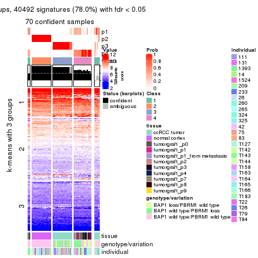</p>

</div>
<div id='tab-SD-mclust-get-signatures-no-scale-4'>
<pre><code class="r">get_signatures(res, k = 5, scale_rows = FALSE)
</code></pre>

<p></p>

</div>
<div id='tab-SD-mclust-get-signatures-no-scale-5'>
<pre><code class="r">get_signatures(res, k = 6, scale_rows = FALSE)
</code></pre>

<p></p>

</div>
</div>


Compare the overlap of signatures from different k:

```r
compare_signatures(res)
```


`get_signature()` returns a data frame invisibly. TO get the list of signatures, the function
call should be assigned to a variable explicitly. In following code, if `plot` argument is set
to `FALSE`, no heatmap is plotted while only the differential analysis is performed.

```r
# code only for demonstration
tb = get_signature(res, k = ..., plot = FALSE)
```

An example of the output of `tb` is:

```
#>   which_row         fdr    mean_1    mean_2 scaled_mean_1 scaled_mean_2 km
#> 1        38 0.042760348  8.373488  9.131774    -0.5533452     0.5164555  1
#> 2        40 0.018707592  7.106213  8.469186    -0.6173731     0.5762149  1
#> 3        55 0.019134737 10.221463 11.207825    -0.6159697     0.5749050  1
#> 4        59 0.006059896  5.921854  7.869574    -0.6899429     0.6439467  1
#> 5        60 0.018055526  8.928898 10.211722    -0.6204761     0.5791110  1
#> 6        98 0.009384629 15.714769 14.887706     0.6635654    -0.6193277  2
...
```

The columns in `tb` are:

1. `which_row`: row indices corresponding to the input matrix.
2. `fdr`: FDR for the differential test. 
3. `mean_x`: The mean value in group x.
4. `scaled_mean_x`: The mean value in group x after rows are scaled.
5. `km`: Row groups if k-means clustering is applied to rows.


UMAP plot which shows how samples are separated.


<script>
$( function() {
	$( '#tabs-SD-mclust-dimension-reduction' ).tabs();
} );
</script>
<div id='tabs-SD-mclust-dimension-reduction'>
<ul>
<li><a href='#tab-SD-mclust-dimension-reduction-1'>k = 2</a></li>
<li><a href='#tab-SD-mclust-dimension-reduction-2'>k = 3</a></li>
<li><a href='#tab-SD-mclust-dimension-reduction-3'>k = 4</a></li>
<li><a href='#tab-SD-mclust-dimension-reduction-4'>k = 5</a></li>
<li><a href='#tab-SD-mclust-dimension-reduction-5'>k = 6</a></li>
</ul>
<div id='tab-SD-mclust-dimension-reduction-1'>
<pre><code class="r">dimension_reduction(res, k = 2, method = &quot;UMAP&quot;)
</code></pre>

<p></p>

</div>
<div id='tab-SD-mclust-dimension-reduction-2'>
<pre><code class="r">dimension_reduction(res, k = 3, method = &quot;UMAP&quot;)
</code></pre>

<p></p>

</div>
<div id='tab-SD-mclust-dimension-reduction-3'>
<pre><code class="r">dimension_reduction(res, k = 4, method = &quot;UMAP&quot;)
</code></pre>

<p></p>

</div>
<div id='tab-SD-mclust-dimension-reduction-4'>
<pre><code class="r">dimension_reduction(res, k = 5, method = &quot;UMAP&quot;)
</code></pre>

<p></p>

</div>
<div id='tab-SD-mclust-dimension-reduction-5'>
<pre><code class="r">dimension_reduction(res, k = 6, method = &quot;UMAP&quot;)
</code></pre>

<p></p>

</div>
</div>


Following heatmap shows how subgroups are split when increasing `k`:

```r
collect_classes(res)
```


Test correlation between subgroups and known annotations. If the known
annotation is numeric, one-way ANOVA test is applied, and if the known
annotation is discrete, chi-squared contingency table test is applied.

```r
test_to_known_factors(res)
```

```
#>            n tissue(p) genotype/variation(p) individual(p) k
#> SD:mclust 76  3.04e-12              1.17e-05        0.9902 2
#> SD:mclust 75  7.59e-20              1.17e-05        0.9573 3
#> SD:mclust 70  3.18e-21              5.89e-06        0.0522 4
#> SD:mclust 69  3.53e-21              6.70e-12        0.6768 5
#> SD:mclust 63  5.19e-13              3.51e-07        0.5927 6
```


If matrix rows can be associated to genes, consider to use `functional_enrichment(res,
...)` to perform function enrichment for the signature genes. See [this vignette](http://bioconductor.org/packages/devel/bioc/vignettes/cola/inst/doc/functional_enrichment.html) for more detailed explanations.


 

---------------------------------------------------


### SD:NMF*


The object with results only for a single top-value method and a single partition method 
can be extracted as:

```r
res = res_list["SD", "NMF"]
# you can also extract it by
# res = res_list["SD:NMF"]
```

A summary of `res` and all the functions that can be applied to it:

```r
res
```

```
#> A 'ConsensusPartition' object with k = 2, 3, 4, 5, 6.
#>   On a matrix with 51941 rows and 76 columns.
#>   Top rows (1000, 2000, 3000, 4000, 5000) are extracted by 'SD' method.
#>   Subgroups are detected by 'NMF' method.
#>   Performed in total 1250 partitions by row resampling.
#>   Best k for subgroups seems to be 5.
#> 
#> Following methods can be applied to this 'ConsensusPartition' object:
#>  [1] "cola_report"             "collect_classes"         "collect_plots"          
#>  [4] "collect_stats"           "colnames"                "compare_signatures"     
#>  [7] "consensus_heatmap"       "dimension_reduction"     "functional_enrichment"  
#> [10] "get_anno_col"            "get_anno"                "get_classes"            
#> [13] "get_consensus"           "get_matrix"              "get_membership"         
#> [16] "get_param"               "get_signatures"          "get_stats"              
#> [19] "is_best_k"               "is_stable_k"             "membership_heatmap"     
#> [22] "ncol"                    "nrow"                    "plot_ecdf"              
#> [25] "rownames"                "select_partition_number" "show"                   
#> [28] "suggest_best_k"          "test_to_known_factors"
```

`collect_plots()` function collects all the plots made from `res` for all `k` (number of partitions)
into one single page to provide an easy and fast comparison between different `k`.

```r
collect_plots(res)
```


The plots are:

- The first row: a plot of the ECDF (empirical cumulative distribution
  function) curves of the consensus matrix for each `k` and the heatmap of
  predicted classes for each `k`.
- The second row: heatmaps of the consensus matrix for each `k`.
- The third row: heatmaps of the membership matrix for each `k`.
- The fouth row: heatmaps of the signatures for each `k`.

All the plots in panels can be made by individual functions and they are
plotted later in this section.

`select_partition_number()` produces several plots showing different
statistics for choosing "optimized" `k`. There are following statistics:

- ECDF curves of the consensus matrix for each `k`;
- 1-PAC. [The PAC
  score](https://en.wikipedia.org/wiki/Consensus_clustering#Over-interpretation_potential_of_consensus_clustering)
  measures the proportion of the ambiguous subgrouping.
- Mean silhouette score.
- Concordance. The mean probability of fiting the consensus class ids in all
  partitions.
- Area increased. Denote $A_k$ as the area under the ECDF curve for current
  `k`, the area increased is defined as $A_k - A_{k-1}$.
- Rand index. The percent of pairs of samples that are both in a same cluster
  or both are not in a same cluster in the partition of k and k-1.
- Jaccard index. The ratio of pairs of samples are both in a same cluster in
  the partition of k and k-1 and the pairs of samples are both in a same
  cluster in the partition k or k-1.

The detailed explanations of these statistics can be found in [the _cola_
vignette](http://bioconductor.org/packages/devel/bioc/vignettes/cola/inst/doc/cola.html#toc_13).

Generally speaking, lower PAC score, higher mean silhouette score or higher
concordance corresponds to better partition. Rand index and Jaccard index
measure how similar the current partition is compared to partition with `k-1`.
If they are too similar, we won't accept `k` is better than `k-1`.

```r
select_partition_number(res)
```


The numeric values for all these statistics can be obtained by `get_stats()`.

```r
get_stats(res)
```

```
#>   k 1-PAC mean_silhouette concordance area_increased  Rand Jaccard
#> 2 2 0.728           0.896       0.943         0.4867 0.494   0.494
#> 3 3 1.000           0.984       0.993         0.3850 0.705   0.470
#> 4 4 0.964           0.947       0.978         0.1055 0.890   0.681
#> 5 5 0.940           0.898       0.946         0.0425 0.921   0.716
#> 6 6 0.876           0.809       0.892         0.0294 0.970   0.871
```

`suggest_best_k()` suggests the best $k$ based on these statistics. The rules are as follows:

- All $k$ with Jaccard index larger than 0.95 are removed because increasing
  $k$ does not provide enough extra information. If all $k$ are removed, it is
  marked as no subgroup is detected.
- For all $k$ with 1-PAC score larger than 0.9, the maximal $k$ is taken as
  the best $k$, and other $k$ are marked as optional $k$.
- If it does not fit the second rule. The $k$ with the maximal vote of the
  highest 1-PAC score, highest mean silhouette, and highest concordance is
  taken as the best $k$.

```r
suggest_best_k(res)
```

```
#> [1] 5
#> attr(,"optional")
#> [1] 3 4
```

There is also optional best $k$ = 3 4 that is worth to check.

Following shows the table of the partitions (You need to click the **show/hide
code output** link to see it). The membership matrix (columns with name `p*`)
is inferred by
[`clue::cl_consensus()`](https://www.rdocumentation.org/link/cl_consensus?package=clue)
function with the `SE` method. Basically the value in the membership matrix
represents the probability to belong to a certain group. The finall class
label for an item is determined with the group with highest probability it
belongs to.

In `get_classes()` function, the entropy is calculated from the membership
matrix and the silhouette score is calculated from the consensus matrix.


<script>
$( function() {
	$( '#tabs-SD-NMF-get-classes' ).tabs();
} );
</script>
<div id='tabs-SD-NMF-get-classes'>
<ul>
<li><a href='#tab-SD-NMF-get-classes-1'>k = 2</a></li>
<li><a href='#tab-SD-NMF-get-classes-2'>k = 3</a></li>
<li><a href='#tab-SD-NMF-get-classes-3'>k = 4</a></li>
<li><a href='#tab-SD-NMF-get-classes-4'>k = 5</a></li>
<li><a href='#tab-SD-NMF-get-classes-5'>k = 6</a></li>
</ul>

<div id='tab-SD-NMF-get-classes-1'>
<p><a id='tab-SD-NMF-get-classes-1-a' style='color:#0366d6' href='#'>show/hide code output</a></p>
<pre><code class="r">cbind(get_classes(res, k = 2), get_membership(res, k = 2))
</code></pre>

<pre><code>#&gt;           class entropy silhouette    p1    p2
#&gt; GSM905004     1  0.6887      0.721 0.816 0.184
#&gt; GSM905024     1  0.0000      0.994 1.000 0.000
#&gt; GSM905038     1  0.0376      0.990 0.996 0.004
#&gt; GSM905043     1  0.0000      0.994 1.000 0.000
#&gt; GSM904986     2  0.7950      0.751 0.240 0.760
#&gt; GSM904991     1  0.0000      0.994 1.000 0.000
#&gt; GSM904994     2  0.8713      0.702 0.292 0.708
#&gt; GSM904996     2  0.8443      0.723 0.272 0.728
#&gt; GSM905007     1  0.0000      0.994 1.000 0.000
#&gt; GSM905012     2  0.8144      0.742 0.252 0.748
#&gt; GSM905022     2  0.9608      0.558 0.384 0.616
#&gt; GSM905026     2  0.9732      0.517 0.404 0.596
#&gt; GSM905027     1  0.0672      0.985 0.992 0.008
#&gt; GSM905031     2  0.8555      0.715 0.280 0.720
#&gt; GSM905036     1  0.0000      0.994 1.000 0.000
#&gt; GSM905041     1  0.0000      0.994 1.000 0.000
#&gt; GSM905044     2  0.9248      0.636 0.340 0.660
#&gt; GSM904989     2  0.9833      0.471 0.424 0.576
#&gt; GSM904999     2  0.9248      0.636 0.340 0.660
#&gt; GSM905002     2  0.9000      0.671 0.316 0.684
#&gt; GSM905009     2  0.8608      0.711 0.284 0.716
#&gt; GSM905014     1  0.0000      0.994 1.000 0.000
#&gt; GSM905017     2  0.5946      0.815 0.144 0.856
#&gt; GSM905020     2  0.6623      0.799 0.172 0.828
#&gt; GSM905023     1  0.0376      0.990 0.996 0.004
#&gt; GSM905029     1  0.0000      0.994 1.000 0.000
#&gt; GSM905032     1  0.0000      0.994 1.000 0.000
#&gt; GSM905034     1  0.0000      0.994 1.000 0.000
#&gt; GSM905040     1  0.0000      0.994 1.000 0.000
#&gt; GSM904985     2  0.0000      0.878 0.000 1.000
#&gt; GSM904988     2  0.0000      0.878 0.000 1.000
#&gt; GSM904990     2  0.0000      0.878 0.000 1.000
#&gt; GSM904992     2  0.0000      0.878 0.000 1.000
#&gt; GSM904995     2  0.0000      0.878 0.000 1.000
#&gt; GSM904998     2  0.0000      0.878 0.000 1.000
#&gt; GSM905000     2  0.0000      0.878 0.000 1.000
#&gt; GSM905003     2  0.0000      0.878 0.000 1.000
#&gt; GSM905006     2  0.0000      0.878 0.000 1.000
#&gt; GSM905008     2  0.0000      0.878 0.000 1.000
#&gt; GSM905011     2  0.0000      0.878 0.000 1.000
#&gt; GSM905013     2  0.0000      0.878 0.000 1.000
#&gt; GSM905016     2  0.0000      0.878 0.000 1.000
#&gt; GSM905018     2  0.0000      0.878 0.000 1.000
#&gt; GSM905021     2  0.0000      0.878 0.000 1.000
#&gt; GSM905025     2  0.0000      0.878 0.000 1.000
#&gt; GSM905028     2  0.0000      0.878 0.000 1.000
#&gt; GSM905030     2  0.0000      0.878 0.000 1.000
#&gt; GSM905033     2  0.0000      0.878 0.000 1.000
#&gt; GSM905035     2  0.0000      0.878 0.000 1.000
#&gt; GSM905037     2  0.0000      0.878 0.000 1.000
#&gt; GSM905039     2  0.0000      0.878 0.000 1.000
#&gt; GSM905042     2  0.0000      0.878 0.000 1.000
#&gt; GSM905046     1  0.0000      0.994 1.000 0.000
#&gt; GSM905065     1  0.0000      0.994 1.000 0.000
#&gt; GSM905049     1  0.0000      0.994 1.000 0.000
#&gt; GSM905050     1  0.0000      0.994 1.000 0.000
#&gt; GSM905064     1  0.0000      0.994 1.000 0.000
#&gt; GSM905045     1  0.0000      0.994 1.000 0.000
#&gt; GSM905051     1  0.0000      0.994 1.000 0.000
#&gt; GSM905055     1  0.0000      0.994 1.000 0.000
#&gt; GSM905058     1  0.0000      0.994 1.000 0.000
#&gt; GSM905053     1  0.0000      0.994 1.000 0.000
#&gt; GSM905061     1  0.0000      0.994 1.000 0.000
#&gt; GSM905063     1  0.0000      0.994 1.000 0.000
#&gt; GSM905054     1  0.0000      0.994 1.000 0.000
#&gt; GSM905062     1  0.0000      0.994 1.000 0.000
#&gt; GSM905052     1  0.0000      0.994 1.000 0.000
#&gt; GSM905059     1  0.0000      0.994 1.000 0.000
#&gt; GSM905047     1  0.0000      0.994 1.000 0.000
#&gt; GSM905066     1  0.0000      0.994 1.000 0.000
#&gt; GSM905056     1  0.0000      0.994 1.000 0.000
#&gt; GSM905060     1  0.0000      0.994 1.000 0.000
#&gt; GSM905048     1  0.0000      0.994 1.000 0.000
#&gt; GSM905067     1  0.0000      0.994 1.000 0.000
#&gt; GSM905057     1  0.0000      0.994 1.000 0.000
#&gt; GSM905068     1  0.0000      0.994 1.000 0.000
</code></pre>

<script>
$('#tab-SD-NMF-get-classes-1-a').parent().next().next().hide();
$('#tab-SD-NMF-get-classes-1-a').click(function(){
  $('#tab-SD-NMF-get-classes-1-a').parent().next().next().toggle();
  return(false);
});
</script>
</div>

<div id='tab-SD-NMF-get-classes-2'>
<p><a id='tab-SD-NMF-get-classes-2-a' style='color:#0366d6' href='#'>show/hide code output</a></p>
<pre><code class="r">cbind(get_classes(res, k = 3), get_membership(res, k = 3))
</code></pre>

<pre><code>#&gt;           class entropy silhouette    p1 p2    p3
#&gt; GSM905004     3   0.000      0.994 0.000  0 1.000
#&gt; GSM905024     3   0.271      0.904 0.088  0 0.912
#&gt; GSM905038     3   0.000      0.994 0.000  0 1.000
#&gt; GSM905043     3   0.207      0.936 0.060  0 0.940
#&gt; GSM904986     3   0.000      0.994 0.000  0 1.000
#&gt; GSM904991     3   0.000      0.994 0.000  0 1.000
#&gt; GSM904994     3   0.000      0.994 0.000  0 1.000
#&gt; GSM904996     3   0.000      0.994 0.000  0 1.000
#&gt; GSM905007     3   0.000      0.994 0.000  0 1.000
#&gt; GSM905012     3   0.000      0.994 0.000  0 1.000
#&gt; GSM905022     3   0.000      0.994 0.000  0 1.000
#&gt; GSM905026     3   0.000      0.994 0.000  0 1.000
#&gt; GSM905027     3   0.000      0.994 0.000  0 1.000
#&gt; GSM905031     3   0.000      0.994 0.000  0 1.000
#&gt; GSM905036     3   0.000      0.994 0.000  0 1.000
#&gt; GSM905041     3   0.000      0.994 0.000  0 1.000
#&gt; GSM905044     3   0.000      0.994 0.000  0 1.000
#&gt; GSM904989     3   0.000      0.994 0.000  0 1.000
#&gt; GSM904999     3   0.000      0.994 0.000  0 1.000
#&gt; GSM905002     3   0.000      0.994 0.000  0 1.000
#&gt; GSM905009     3   0.000      0.994 0.000  0 1.000
#&gt; GSM905014     3   0.000      0.994 0.000  0 1.000
#&gt; GSM905017     3   0.000      0.994 0.000  0 1.000
#&gt; GSM905020     3   0.000      0.994 0.000  0 1.000
#&gt; GSM905023     3   0.000      0.994 0.000  0 1.000
#&gt; GSM905029     3   0.000      0.994 0.000  0 1.000
#&gt; GSM905032     3   0.000      0.994 0.000  0 1.000
#&gt; GSM905034     1   0.207      0.926 0.940  0 0.060
#&gt; GSM905040     1   0.573      0.520 0.676  0 0.324
#&gt; GSM904985     2   0.000      1.000 0.000  1 0.000
#&gt; GSM904988     2   0.000      1.000 0.000  1 0.000
#&gt; GSM904990     2   0.000      1.000 0.000  1 0.000
#&gt; GSM904992     2   0.000      1.000 0.000  1 0.000
#&gt; GSM904995     2   0.000      1.000 0.000  1 0.000
#&gt; GSM904998     2   0.000      1.000 0.000  1 0.000
#&gt; GSM905000     2   0.000      1.000 0.000  1 0.000
#&gt; GSM905003     2   0.000      1.000 0.000  1 0.000
#&gt; GSM905006     2   0.000      1.000 0.000  1 0.000
#&gt; GSM905008     2   0.000      1.000 0.000  1 0.000
#&gt; GSM905011     2   0.000      1.000 0.000  1 0.000
#&gt; GSM905013     2   0.000      1.000 0.000  1 0.000
#&gt; GSM905016     2   0.000      1.000 0.000  1 0.000
#&gt; GSM905018     2   0.000      1.000 0.000  1 0.000
#&gt; GSM905021     2   0.000      1.000 0.000  1 0.000
#&gt; GSM905025     2   0.000      1.000 0.000  1 0.000
#&gt; GSM905028     2   0.000      1.000 0.000  1 0.000
#&gt; GSM905030     2   0.000      1.000 0.000  1 0.000
#&gt; GSM905033     2   0.000      1.000 0.000  1 0.000
#&gt; GSM905035     2   0.000      1.000 0.000  1 0.000
#&gt; GSM905037     2   0.000      1.000 0.000  1 0.000
#&gt; GSM905039     2   0.000      1.000 0.000  1 0.000
#&gt; GSM905042     2   0.000      1.000 0.000  1 0.000
#&gt; GSM905046     1   0.000      0.984 1.000  0 0.000
#&gt; GSM905065     1   0.000      0.984 1.000  0 0.000
#&gt; GSM905049     1   0.000      0.984 1.000  0 0.000
#&gt; GSM905050     1   0.000      0.984 1.000  0 0.000
#&gt; GSM905064     1   0.000      0.984 1.000  0 0.000
#&gt; GSM905045     1   0.000      0.984 1.000  0 0.000
#&gt; GSM905051     1   0.000      0.984 1.000  0 0.000
#&gt; GSM905055     1   0.000      0.984 1.000  0 0.000
#&gt; GSM905058     1   0.000      0.984 1.000  0 0.000
#&gt; GSM905053     1   0.000      0.984 1.000  0 0.000
#&gt; GSM905061     1   0.000      0.984 1.000  0 0.000
#&gt; GSM905063     1   0.000      0.984 1.000  0 0.000
#&gt; GSM905054     1   0.000      0.984 1.000  0 0.000
#&gt; GSM905062     1   0.000      0.984 1.000  0 0.000
#&gt; GSM905052     1   0.000      0.984 1.000  0 0.000
#&gt; GSM905059     1   0.000      0.984 1.000  0 0.000
#&gt; GSM905047     1   0.000      0.984 1.000  0 0.000
#&gt; GSM905066     1   0.000      0.984 1.000  0 0.000
#&gt; GSM905056     1   0.000      0.984 1.000  0 0.000
#&gt; GSM905060     1   0.000      0.984 1.000  0 0.000
#&gt; GSM905048     1   0.000      0.984 1.000  0 0.000
#&gt; GSM905067     1   0.000      0.984 1.000  0 0.000
#&gt; GSM905057     1   0.000      0.984 1.000  0 0.000
#&gt; GSM905068     1   0.000      0.984 1.000  0 0.000
</code></pre>

<script>
$('#tab-SD-NMF-get-classes-2-a').parent().next().next().hide();
$('#tab-SD-NMF-get-classes-2-a').click(function(){
  $('#tab-SD-NMF-get-classes-2-a').parent().next().next().toggle();
  return(false);
});
</script>
</div>

<div id='tab-SD-NMF-get-classes-3'>
<p><a id='tab-SD-NMF-get-classes-3-a' style='color:#0366d6' href='#'>show/hide code output</a></p>
<pre><code class="r">cbind(get_classes(res, k = 4), get_membership(res, k = 4))
</code></pre>

<pre><code>#&gt;           class entropy silhouette    p1 p2    p3    p4
#&gt; GSM905004     4  0.0000      0.948 0.000  0 0.000 1.000
#&gt; GSM905024     1  0.4888      0.357 0.588  0 0.412 0.000
#&gt; GSM905038     3  0.0000      0.986 0.000  0 1.000 0.000
#&gt; GSM905043     1  0.4304      0.631 0.716  0 0.284 0.000
#&gt; GSM904986     3  0.0000      0.986 0.000  0 1.000 0.000
#&gt; GSM904991     3  0.0000      0.986 0.000  0 1.000 0.000
#&gt; GSM904994     3  0.0000      0.986 0.000  0 1.000 0.000
#&gt; GSM904996     3  0.0000      0.986 0.000  0 1.000 0.000
#&gt; GSM905007     3  0.0000      0.986 0.000  0 1.000 0.000
#&gt; GSM905012     4  0.4134      0.631 0.000  0 0.260 0.740
#&gt; GSM905022     3  0.0000      0.986 0.000  0 1.000 0.000
#&gt; GSM905026     3  0.0000      0.986 0.000  0 1.000 0.000
#&gt; GSM905027     3  0.0000      0.986 0.000  0 1.000 0.000
#&gt; GSM905031     3  0.2216      0.895 0.000  0 0.908 0.092
#&gt; GSM905036     3  0.0000      0.986 0.000  0 1.000 0.000
#&gt; GSM905041     3  0.0000      0.986 0.000  0 1.000 0.000
#&gt; GSM905044     3  0.0000      0.986 0.000  0 1.000 0.000
#&gt; GSM904989     3  0.0000      0.986 0.000  0 1.000 0.000
#&gt; GSM904999     3  0.0000      0.986 0.000  0 1.000 0.000
#&gt; GSM905002     3  0.0000      0.986 0.000  0 1.000 0.000
#&gt; GSM905009     3  0.0592      0.972 0.000  0 0.984 0.016
#&gt; GSM905014     3  0.0000      0.986 0.000  0 1.000 0.000
#&gt; GSM905017     3  0.0000      0.986 0.000  0 1.000 0.000
#&gt; GSM905020     3  0.3569      0.755 0.000  0 0.804 0.196
#&gt; GSM905023     3  0.0000      0.986 0.000  0 1.000 0.000
#&gt; GSM905029     3  0.0000      0.986 0.000  0 1.000 0.000
#&gt; GSM905032     3  0.0000      0.986 0.000  0 1.000 0.000
#&gt; GSM905034     1  0.0000      0.938 1.000  0 0.000 0.000
#&gt; GSM905040     1  0.2589      0.832 0.884  0 0.116 0.000
#&gt; GSM904985     2  0.0000      1.000 0.000  1 0.000 0.000
#&gt; GSM904988     2  0.0000      1.000 0.000  1 0.000 0.000
#&gt; GSM904990     2  0.0000      1.000 0.000  1 0.000 0.000
#&gt; GSM904992     2  0.0000      1.000 0.000  1 0.000 0.000
#&gt; GSM904995     2  0.0000      1.000 0.000  1 0.000 0.000
#&gt; GSM904998     2  0.0000      1.000 0.000  1 0.000 0.000
#&gt; GSM905000     2  0.0000      1.000 0.000  1 0.000 0.000
#&gt; GSM905003     2  0.0000      1.000 0.000  1 0.000 0.000
#&gt; GSM905006     2  0.0000      1.000 0.000  1 0.000 0.000
#&gt; GSM905008     2  0.0000      1.000 0.000  1 0.000 0.000
#&gt; GSM905011     2  0.0000      1.000 0.000  1 0.000 0.000
#&gt; GSM905013     2  0.0000      1.000 0.000  1 0.000 0.000
#&gt; GSM905016     2  0.0000      1.000 0.000  1 0.000 0.000
#&gt; GSM905018     2  0.0000      1.000 0.000  1 0.000 0.000
#&gt; GSM905021     2  0.0000      1.000 0.000  1 0.000 0.000
#&gt; GSM905025     2  0.0000      1.000 0.000  1 0.000 0.000
#&gt; GSM905028     2  0.0000      1.000 0.000  1 0.000 0.000
#&gt; GSM905030     2  0.0000      1.000 0.000  1 0.000 0.000
#&gt; GSM905033     2  0.0000      1.000 0.000  1 0.000 0.000
#&gt; GSM905035     2  0.0000      1.000 0.000  1 0.000 0.000
#&gt; GSM905037     2  0.0000      1.000 0.000  1 0.000 0.000
#&gt; GSM905039     2  0.0000      1.000 0.000  1 0.000 0.000
#&gt; GSM905042     2  0.0000      1.000 0.000  1 0.000 0.000
#&gt; GSM905046     1  0.0000      0.938 1.000  0 0.000 0.000
#&gt; GSM905065     1  0.0000      0.938 1.000  0 0.000 0.000
#&gt; GSM905049     4  0.0000      0.948 0.000  0 0.000 1.000
#&gt; GSM905050     4  0.0000      0.948 0.000  0 0.000 1.000
#&gt; GSM905064     4  0.0000      0.948 0.000  0 0.000 1.000
#&gt; GSM905045     4  0.0000      0.948 0.000  0 0.000 1.000
#&gt; GSM905051     4  0.3726      0.734 0.212  0 0.000 0.788
#&gt; GSM905055     1  0.0000      0.938 1.000  0 0.000 0.000
#&gt; GSM905058     1  0.0000      0.938 1.000  0 0.000 0.000
#&gt; GSM905053     4  0.0000      0.948 0.000  0 0.000 1.000
#&gt; GSM905061     4  0.0000      0.948 0.000  0 0.000 1.000
#&gt; GSM905063     1  0.0000      0.938 1.000  0 0.000 0.000
#&gt; GSM905054     4  0.0000      0.948 0.000  0 0.000 1.000
#&gt; GSM905062     4  0.0000      0.948 0.000  0 0.000 1.000
#&gt; GSM905052     4  0.2345      0.868 0.100  0 0.000 0.900
#&gt; GSM905059     1  0.0000      0.938 1.000  0 0.000 0.000
#&gt; GSM905047     1  0.0469      0.928 0.988  0 0.000 0.012
#&gt; GSM905066     1  0.0000      0.938 1.000  0 0.000 0.000
#&gt; GSM905056     1  0.0000      0.938 1.000  0 0.000 0.000
#&gt; GSM905060     1  0.0000      0.938 1.000  0 0.000 0.000
#&gt; GSM905048     1  0.0000      0.938 1.000  0 0.000 0.000
#&gt; GSM905067     1  0.0000      0.938 1.000  0 0.000 0.000
#&gt; GSM905057     1  0.0000      0.938 1.000  0 0.000 0.000
#&gt; GSM905068     4  0.0000      0.948 0.000  0 0.000 1.000
</code></pre>

<script>
$('#tab-SD-NMF-get-classes-3-a').parent().next().next().hide();
$('#tab-SD-NMF-get-classes-3-a').click(function(){
  $('#tab-SD-NMF-get-classes-3-a').parent().next().next().toggle();
  return(false);
});
</script>
</div>

<div id='tab-SD-NMF-get-classes-4'>
<p><a id='tab-SD-NMF-get-classes-4-a' style='color:#0366d6' href='#'>show/hide code output</a></p>
<pre><code class="r">cbind(get_classes(res, k = 5), get_membership(res, k = 5))
</code></pre>

<pre><code>#&gt;           class entropy silhouette    p1    p2    p3    p4    p5
#&gt; GSM905004     4  0.1195      0.892 0.000 0.000 0.028 0.960 0.012
#&gt; GSM905024     1  0.4546      0.495 0.668 0.000 0.304 0.000 0.028
#&gt; GSM905038     3  0.0451      0.926 0.000 0.000 0.988 0.004 0.008
#&gt; GSM905043     3  0.5113      0.250 0.380 0.000 0.576 0.000 0.044
#&gt; GSM904986     3  0.1493      0.911 0.000 0.000 0.948 0.028 0.024
#&gt; GSM904991     3  0.0404      0.924 0.000 0.000 0.988 0.000 0.012
#&gt; GSM904994     3  0.1310      0.917 0.000 0.000 0.956 0.020 0.024
#&gt; GSM904996     3  0.1211      0.919 0.000 0.000 0.960 0.016 0.024
#&gt; GSM905007     3  0.0510      0.927 0.000 0.000 0.984 0.000 0.016
#&gt; GSM905012     4  0.1579      0.882 0.000 0.000 0.032 0.944 0.024
#&gt; GSM905022     3  0.0898      0.923 0.000 0.000 0.972 0.008 0.020
#&gt; GSM905026     3  0.0693      0.925 0.000 0.000 0.980 0.008 0.012
#&gt; GSM905027     3  0.0162      0.926 0.000 0.000 0.996 0.000 0.004
#&gt; GSM905031     4  0.3550      0.728 0.000 0.000 0.184 0.796 0.020
#&gt; GSM905036     3  0.0451      0.926 0.000 0.000 0.988 0.004 0.008
#&gt; GSM905041     3  0.0609      0.920 0.000 0.000 0.980 0.000 0.020
#&gt; GSM905044     3  0.0898      0.923 0.000 0.000 0.972 0.008 0.020
#&gt; GSM904989     3  0.2300      0.873 0.000 0.000 0.904 0.072 0.024
#&gt; GSM904999     3  0.0880      0.916 0.000 0.000 0.968 0.000 0.032
#&gt; GSM905002     3  0.0898      0.923 0.000 0.000 0.972 0.008 0.020
#&gt; GSM905009     3  0.4833      0.230 0.000 0.000 0.564 0.412 0.024
#&gt; GSM905014     3  0.0510      0.925 0.000 0.000 0.984 0.000 0.016
#&gt; GSM905017     3  0.0880      0.916 0.000 0.000 0.968 0.000 0.032
#&gt; GSM905020     4  0.4292      0.600 0.000 0.000 0.272 0.704 0.024
#&gt; GSM905023     3  0.0404      0.924 0.000 0.000 0.988 0.000 0.012
#&gt; GSM905029     3  0.0000      0.927 0.000 0.000 1.000 0.000 0.000
#&gt; GSM905032     5  0.3534      0.634 0.000 0.000 0.256 0.000 0.744
#&gt; GSM905034     1  0.1386      0.880 0.952 0.000 0.032 0.000 0.016
#&gt; GSM905040     5  0.1908      0.914 0.092 0.000 0.000 0.000 0.908
#&gt; GSM904985     2  0.0000      1.000 0.000 1.000 0.000 0.000 0.000
#&gt; GSM904988     2  0.0000      1.000 0.000 1.000 0.000 0.000 0.000
#&gt; GSM904990     2  0.0000      1.000 0.000 1.000 0.000 0.000 0.000
#&gt; GSM904992     2  0.0000      1.000 0.000 1.000 0.000 0.000 0.000
#&gt; GSM904995     2  0.0000      1.000 0.000 1.000 0.000 0.000 0.000
#&gt; GSM904998     2  0.0000      1.000 0.000 1.000 0.000 0.000 0.000
#&gt; GSM905000     2  0.0000      1.000 0.000 1.000 0.000 0.000 0.000
#&gt; GSM905003     2  0.0000      1.000 0.000 1.000 0.000 0.000 0.000
#&gt; GSM905006     2  0.0000      1.000 0.000 1.000 0.000 0.000 0.000
#&gt; GSM905008     2  0.0000      1.000 0.000 1.000 0.000 0.000 0.000
#&gt; GSM905011     2  0.0000      1.000 0.000 1.000 0.000 0.000 0.000
#&gt; GSM905013     2  0.0000      1.000 0.000 1.000 0.000 0.000 0.000
#&gt; GSM905016     2  0.0000      1.000 0.000 1.000 0.000 0.000 0.000
#&gt; GSM905018     2  0.0000      1.000 0.000 1.000 0.000 0.000 0.000
#&gt; GSM905021     2  0.0162      0.996 0.000 0.996 0.000 0.000 0.004
#&gt; GSM905025     2  0.0000      1.000 0.000 1.000 0.000 0.000 0.000
#&gt; GSM905028     2  0.0000      1.000 0.000 1.000 0.000 0.000 0.000
#&gt; GSM905030     2  0.0000      1.000 0.000 1.000 0.000 0.000 0.000
#&gt; GSM905033     2  0.0000      1.000 0.000 1.000 0.000 0.000 0.000
#&gt; GSM905035     2  0.0000      1.000 0.000 1.000 0.000 0.000 0.000
#&gt; GSM905037     2  0.0000      1.000 0.000 1.000 0.000 0.000 0.000
#&gt; GSM905039     2  0.0000      1.000 0.000 1.000 0.000 0.000 0.000
#&gt; GSM905042     2  0.0000      1.000 0.000 1.000 0.000 0.000 0.000
#&gt; GSM905046     1  0.0771      0.893 0.976 0.000 0.000 0.004 0.020
#&gt; GSM905065     1  0.1608      0.870 0.928 0.000 0.000 0.000 0.072
#&gt; GSM905049     4  0.1168      0.908 0.032 0.000 0.000 0.960 0.008
#&gt; GSM905050     4  0.0510      0.914 0.016 0.000 0.000 0.984 0.000
#&gt; GSM905064     4  0.2488      0.830 0.124 0.000 0.000 0.872 0.004
#&gt; GSM905045     4  0.0955      0.911 0.028 0.000 0.000 0.968 0.004
#&gt; GSM905051     1  0.2659      0.840 0.888 0.000 0.000 0.060 0.052
#&gt; GSM905055     5  0.2020      0.920 0.100 0.000 0.000 0.000 0.900
#&gt; GSM905058     1  0.0162      0.892 0.996 0.000 0.000 0.000 0.004
#&gt; GSM905053     4  0.0771      0.913 0.020 0.000 0.000 0.976 0.004
#&gt; GSM905061     4  0.0510      0.914 0.016 0.000 0.000 0.984 0.000
#&gt; GSM905063     5  0.2127      0.916 0.108 0.000 0.000 0.000 0.892
#&gt; GSM905054     4  0.1701      0.895 0.048 0.000 0.000 0.936 0.016
#&gt; GSM905062     4  0.0404      0.913 0.012 0.000 0.000 0.988 0.000
#&gt; GSM905052     1  0.3944      0.734 0.788 0.000 0.000 0.160 0.052
#&gt; GSM905059     1  0.0794      0.890 0.972 0.000 0.000 0.028 0.000
#&gt; GSM905047     1  0.0963      0.887 0.964 0.000 0.000 0.036 0.000
#&gt; GSM905066     1  0.1671      0.868 0.924 0.000 0.000 0.000 0.076
#&gt; GSM905056     5  0.1965      0.919 0.096 0.000 0.000 0.000 0.904
#&gt; GSM905060     1  0.0794      0.890 0.972 0.000 0.000 0.028 0.000
#&gt; GSM905048     1  0.0963      0.886 0.964 0.000 0.000 0.000 0.036
#&gt; GSM905067     1  0.1608      0.870 0.928 0.000 0.000 0.000 0.072
#&gt; GSM905057     5  0.2020      0.920 0.100 0.000 0.000 0.000 0.900
#&gt; GSM905068     4  0.0290      0.912 0.008 0.000 0.000 0.992 0.000
</code></pre>

<script>
$('#tab-SD-NMF-get-classes-4-a').parent().next().next().hide();
$('#tab-SD-NMF-get-classes-4-a').click(function(){
  $('#tab-SD-NMF-get-classes-4-a').parent().next().next().toggle();
  return(false);
});
</script>
</div>

<div id='tab-SD-NMF-get-classes-5'>
<p><a id='tab-SD-NMF-get-classes-5-a' style='color:#0366d6' href='#'>show/hide code output</a></p>
<pre><code class="r">cbind(get_classes(res, k = 6), get_membership(res, k = 6))
</code></pre>

<pre><code>#&gt;           class entropy silhouette    p1    p2    p3    p4    p5    p6
#&gt; GSM905004     4  0.4482     0.5356 0.000 0.000 0.124 0.708 0.168 0.000
#&gt; GSM905024     1  0.4669     0.5875 0.712 0.000 0.164 0.000 0.112 0.012
#&gt; GSM905038     3  0.1444     0.8461 0.000 0.000 0.928 0.000 0.072 0.000
#&gt; GSM905043     1  0.5587     0.2899 0.532 0.000 0.344 0.000 0.112 0.012
#&gt; GSM904986     3  0.3637     0.7594 0.000 0.000 0.780 0.056 0.164 0.000
#&gt; GSM904991     3  0.2402     0.8264 0.000 0.000 0.868 0.000 0.120 0.012
#&gt; GSM904994     3  0.3053     0.7917 0.000 0.000 0.812 0.020 0.168 0.000
#&gt; GSM904996     3  0.2968     0.7949 0.000 0.000 0.816 0.016 0.168 0.000
#&gt; GSM905007     3  0.2070     0.8401 0.000 0.000 0.892 0.000 0.100 0.008
#&gt; GSM905012     4  0.5039     0.5029 0.000 0.000 0.184 0.640 0.176 0.000
#&gt; GSM905022     3  0.2300     0.8164 0.000 0.000 0.856 0.000 0.144 0.000
#&gt; GSM905026     3  0.0790     0.8483 0.000 0.000 0.968 0.000 0.032 0.000
#&gt; GSM905027     3  0.2212     0.8317 0.000 0.000 0.880 0.000 0.112 0.008
#&gt; GSM905031     4  0.4454     0.5264 0.000 0.000 0.224 0.692 0.084 0.000
#&gt; GSM905036     3  0.2656     0.8270 0.000 0.000 0.860 0.008 0.120 0.012
#&gt; GSM905041     3  0.2402     0.8264 0.000 0.000 0.868 0.000 0.120 0.012
#&gt; GSM905044     3  0.1411     0.8426 0.000 0.000 0.936 0.004 0.060 0.000
#&gt; GSM904989     3  0.4918     0.5646 0.000 0.000 0.656 0.184 0.160 0.000
#&gt; GSM904999     3  0.3518     0.7751 0.000 0.000 0.732 0.000 0.256 0.012
#&gt; GSM905002     3  0.2416     0.8109 0.000 0.000 0.844 0.000 0.156 0.000
#&gt; GSM905009     4  0.5573     0.3905 0.000 0.000 0.312 0.524 0.164 0.000
#&gt; GSM905014     3  0.2489     0.8487 0.000 0.000 0.860 0.000 0.128 0.012
#&gt; GSM905017     3  0.3171     0.8137 0.000 0.000 0.784 0.000 0.204 0.012
#&gt; GSM905020     4  0.5420     0.4456 0.000 0.000 0.256 0.572 0.172 0.000
#&gt; GSM905023     3  0.2402     0.8264 0.000 0.000 0.868 0.000 0.120 0.012
#&gt; GSM905029     3  0.2006     0.8356 0.000 0.000 0.892 0.000 0.104 0.004
#&gt; GSM905032     6  0.4226     0.6083 0.000 0.000 0.152 0.000 0.112 0.736
#&gt; GSM905034     1  0.1500     0.8665 0.936 0.000 0.000 0.000 0.052 0.012
#&gt; GSM905040     6  0.0260     0.9063 0.000 0.000 0.000 0.000 0.008 0.992
#&gt; GSM904985     2  0.0000     0.9965 0.000 1.000 0.000 0.000 0.000 0.000
#&gt; GSM904988     2  0.0146     0.9958 0.000 0.996 0.000 0.000 0.004 0.000
#&gt; GSM904990     2  0.0146     0.9958 0.000 0.996 0.000 0.000 0.004 0.000
#&gt; GSM904992     2  0.0146     0.9958 0.000 0.996 0.000 0.000 0.004 0.000
#&gt; GSM904995     2  0.0000     0.9965 0.000 1.000 0.000 0.000 0.000 0.000
#&gt; GSM904998     2  0.0000     0.9965 0.000 1.000 0.000 0.000 0.000 0.000
#&gt; GSM905000     2  0.0146     0.9958 0.000 0.996 0.000 0.000 0.004 0.000
#&gt; GSM905003     2  0.0000     0.9965 0.000 1.000 0.000 0.000 0.000 0.000
#&gt; GSM905006     2  0.0146     0.9958 0.000 0.996 0.000 0.000 0.004 0.000
#&gt; GSM905008     2  0.0146     0.9958 0.000 0.996 0.000 0.000 0.004 0.000
#&gt; GSM905011     2  0.0146     0.9958 0.000 0.996 0.000 0.000 0.004 0.000
#&gt; GSM905013     2  0.0000     0.9965 0.000 1.000 0.000 0.000 0.000 0.000
#&gt; GSM905016     2  0.0000     0.9965 0.000 1.000 0.000 0.000 0.000 0.000
#&gt; GSM905018     2  0.0146     0.9958 0.000 0.996 0.000 0.000 0.004 0.000
#&gt; GSM905021     2  0.1082     0.9550 0.000 0.956 0.004 0.000 0.040 0.000
#&gt; GSM905025     2  0.0000     0.9965 0.000 1.000 0.000 0.000 0.000 0.000
#&gt; GSM905028     2  0.0000     0.9965 0.000 1.000 0.000 0.000 0.000 0.000
#&gt; GSM905030     2  0.0146     0.9958 0.000 0.996 0.000 0.000 0.004 0.000
#&gt; GSM905033     2  0.0000     0.9965 0.000 1.000 0.000 0.000 0.000 0.000
#&gt; GSM905035     2  0.0000     0.9965 0.000 1.000 0.000 0.000 0.000 0.000
#&gt; GSM905037     2  0.0000     0.9965 0.000 1.000 0.000 0.000 0.000 0.000
#&gt; GSM905039     2  0.0000     0.9965 0.000 1.000 0.000 0.000 0.000 0.000
#&gt; GSM905042     2  0.0000     0.9965 0.000 1.000 0.000 0.000 0.000 0.000
#&gt; GSM905046     1  0.0000     0.8798 1.000 0.000 0.000 0.000 0.000 0.000
#&gt; GSM905065     1  0.0405     0.8790 0.988 0.000 0.000 0.000 0.004 0.008
#&gt; GSM905049     4  0.1908     0.5481 0.004 0.000 0.000 0.900 0.096 0.000
#&gt; GSM905050     4  0.1010     0.5905 0.004 0.000 0.000 0.960 0.036 0.000
#&gt; GSM905064     4  0.3834     0.2716 0.036 0.000 0.000 0.732 0.232 0.000
#&gt; GSM905045     4  0.2964     0.3983 0.004 0.000 0.000 0.792 0.204 0.000
#&gt; GSM905051     5  0.4911     0.9455 0.100 0.000 0.000 0.276 0.624 0.000
#&gt; GSM905055     6  0.0363     0.9198 0.012 0.000 0.000 0.000 0.000 0.988
#&gt; GSM905058     1  0.1141     0.8662 0.948 0.000 0.000 0.000 0.052 0.000
#&gt; GSM905053     4  0.1908     0.5490 0.004 0.000 0.000 0.900 0.096 0.000
#&gt; GSM905061     4  0.0405     0.6030 0.004 0.000 0.000 0.988 0.008 0.000
#&gt; GSM905063     6  0.0363     0.9198 0.012 0.000 0.000 0.000 0.000 0.988
#&gt; GSM905054     4  0.3714     0.0134 0.004 0.000 0.000 0.656 0.340 0.000
#&gt; GSM905062     4  0.0458     0.6019 0.000 0.000 0.000 0.984 0.016 0.000
#&gt; GSM905052     5  0.4720     0.9441 0.072 0.000 0.000 0.304 0.624 0.000
#&gt; GSM905059     1  0.1327     0.8593 0.936 0.000 0.000 0.000 0.064 0.000
#&gt; GSM905047     1  0.0291     0.8783 0.992 0.000 0.000 0.004 0.004 0.000
#&gt; GSM905066     1  0.0603     0.8761 0.980 0.000 0.000 0.000 0.004 0.016
#&gt; GSM905056     6  0.0363     0.9198 0.012 0.000 0.000 0.000 0.000 0.988
#&gt; GSM905060     1  0.1267     0.8636 0.940 0.000 0.000 0.000 0.060 0.000
#&gt; GSM905048     1  0.0146     0.8798 0.996 0.000 0.000 0.000 0.004 0.000
#&gt; GSM905067     1  0.0405     0.8790 0.988 0.000 0.000 0.000 0.004 0.008
#&gt; GSM905057     6  0.0363     0.9198 0.012 0.000 0.000 0.000 0.000 0.988
#&gt; GSM905068     4  0.0146     0.6022 0.000 0.000 0.000 0.996 0.004 0.000
</code></pre>

<script>
$('#tab-SD-NMF-get-classes-5-a').parent().next().next().hide();
$('#tab-SD-NMF-get-classes-5-a').click(function(){
  $('#tab-SD-NMF-get-classes-5-a').parent().next().next().toggle();
  return(false);
});
</script>
</div>
</div>

Heatmaps for the consensus matrix. It visualizes the probability of two
samples to be in a same group.


<script>
$( function() {
	$( '#tabs-SD-NMF-consensus-heatmap' ).tabs();
} );
</script>
<div id='tabs-SD-NMF-consensus-heatmap'>
<ul>
<li><a href='#tab-SD-NMF-consensus-heatmap-1'>k = 2</a></li>
<li><a href='#tab-SD-NMF-consensus-heatmap-2'>k = 3</a></li>
<li><a href='#tab-SD-NMF-consensus-heatmap-3'>k = 4</a></li>
<li><a href='#tab-SD-NMF-consensus-heatmap-4'>k = 5</a></li>
<li><a href='#tab-SD-NMF-consensus-heatmap-5'>k = 6</a></li>
</ul>
<div id='tab-SD-NMF-consensus-heatmap-1'>
<pre><code class="r">consensus_heatmap(res, k = 2)
</code></pre>

<p></p>

</div>
<div id='tab-SD-NMF-consensus-heatmap-2'>
<pre><code class="r">consensus_heatmap(res, k = 3)
</code></pre>

<p></p>

</div>
<div id='tab-SD-NMF-consensus-heatmap-3'>
<pre><code class="r">consensus_heatmap(res, k = 4)
</code></pre>

<p></p>

</div>
<div id='tab-SD-NMF-consensus-heatmap-4'>
<pre><code class="r">consensus_heatmap(res, k = 5)
</code></pre>

<p></p>

</div>
<div id='tab-SD-NMF-consensus-heatmap-5'>
<pre><code class="r">consensus_heatmap(res, k = 6)
</code></pre>

<p></p>

</div>
</div>

Heatmaps for the membership of samples in all partitions to see how consistent they are:


<script>
$( function() {
	$( '#tabs-SD-NMF-membership-heatmap' ).tabs();
} );
</script>
<div id='tabs-SD-NMF-membership-heatmap'>
<ul>
<li><a href='#tab-SD-NMF-membership-heatmap-1'>k = 2</a></li>
<li><a href='#tab-SD-NMF-membership-heatmap-2'>k = 3</a></li>
<li><a href='#tab-SD-NMF-membership-heatmap-3'>k = 4</a></li>
<li><a href='#tab-SD-NMF-membership-heatmap-4'>k = 5</a></li>
<li><a href='#tab-SD-NMF-membership-heatmap-5'>k = 6</a></li>
</ul>
<div id='tab-SD-NMF-membership-heatmap-1'>
<pre><code class="r">membership_heatmap(res, k = 2)
</code></pre>

<p></p>

</div>
<div id='tab-SD-NMF-membership-heatmap-2'>
<pre><code class="r">membership_heatmap(res, k = 3)
</code></pre>

<p></p>

</div>
<div id='tab-SD-NMF-membership-heatmap-3'>
<pre><code class="r">membership_heatmap(res, k = 4)
</code></pre>

<p></p>

</div>
<div id='tab-SD-NMF-membership-heatmap-4'>
<pre><code class="r">membership_heatmap(res, k = 5)
</code></pre>

<p></p>

</div>
<div id='tab-SD-NMF-membership-heatmap-5'>
<pre><code class="r">membership_heatmap(res, k = 6)
</code></pre>

<p></p>

</div>
</div>

As soon as we have had the classes for columns, we can look for signatures
which are significantly different between classes which can be candidate marks
for certain classes. Following are the heatmaps for signatures.


Signature heatmaps where rows are scaled:


<script>
$( function() {
	$( '#tabs-SD-NMF-get-signatures' ).tabs();
} );
</script>
<div id='tabs-SD-NMF-get-signatures'>
<ul>
<li><a href='#tab-SD-NMF-get-signatures-1'>k = 2</a></li>
<li><a href='#tab-SD-NMF-get-signatures-2'>k = 3</a></li>
<li><a href='#tab-SD-NMF-get-signatures-3'>k = 4</a></li>
<li><a href='#tab-SD-NMF-get-signatures-4'>k = 5</a></li>
<li><a href='#tab-SD-NMF-get-signatures-5'>k = 6</a></li>
</ul>
<div id='tab-SD-NMF-get-signatures-1'>
<pre><code class="r">get_signatures(res, k = 2)
</code></pre>

<p></p>

</div>
<div id='tab-SD-NMF-get-signatures-2'>
<pre><code class="r">get_signatures(res, k = 3)
</code></pre>

<p></p>

</div>
<div id='tab-SD-NMF-get-signatures-3'>
<pre><code class="r">get_signatures(res, k = 4)
</code></pre>

<p></p>

</div>
<div id='tab-SD-NMF-get-signatures-4'>
<pre><code class="r">get_signatures(res, k = 5)
</code></pre>

<p></p>

</div>
<div id='tab-SD-NMF-get-signatures-5'>
<pre><code class="r">get_signatures(res, k = 6)
</code></pre>

<p></p>

</div>
</div>


Signature heatmaps where rows are not scaled:


<script>
$( function() {
	$( '#tabs-SD-NMF-get-signatures-no-scale' ).tabs();
} );
</script>
<div id='tabs-SD-NMF-get-signatures-no-scale'>
<ul>
<li><a href='#tab-SD-NMF-get-signatures-no-scale-1'>k = 2</a></li>
<li><a href='#tab-SD-NMF-get-signatures-no-scale-2'>k = 3</a></li>
<li><a href='#tab-SD-NMF-get-signatures-no-scale-3'>k = 4</a></li>
<li><a href='#tab-SD-NMF-get-signatures-no-scale-4'>k = 5</a></li>
<li><a href='#tab-SD-NMF-get-signatures-no-scale-5'>k = 6</a></li>
</ul>
<div id='tab-SD-NMF-get-signatures-no-scale-1'>
<pre><code class="r">get_signatures(res, k = 2, scale_rows = FALSE)
</code></pre>

<p></p>

</div>
<div id='tab-SD-NMF-get-signatures-no-scale-2'>
<pre><code class="r">get_signatures(res, k = 3, scale_rows = FALSE)
</code></pre>

<p></p>

</div>
<div id='tab-SD-NMF-get-signatures-no-scale-3'>
<pre><code class="r">get_signatures(res, k = 4, scale_rows = FALSE)
</code></pre>

<p></p>

</div>
<div id='tab-SD-NMF-get-signatures-no-scale-4'>
<pre><code class="r">get_signatures(res, k = 5, scale_rows = FALSE)
</code></pre>

<p></p>

</div>
<div id='tab-SD-NMF-get-signatures-no-scale-5'>
<pre><code class="r">get_signatures(res, k = 6, scale_rows = FALSE)
</code></pre>

<p></p>

</div>
</div>


Compare the overlap of signatures from different k:

```r
compare_signatures(res)
```


`get_signature()` returns a data frame invisibly. TO get the list of signatures, the function
call should be assigned to a variable explicitly. In following code, if `plot` argument is set
to `FALSE`, no heatmap is plotted while only the differential analysis is performed.

```r
# code only for demonstration
tb = get_signature(res, k = ..., plot = FALSE)
```

An example of the output of `tb` is:

```
#>   which_row         fdr    mean_1    mean_2 scaled_mean_1 scaled_mean_2 km
#> 1        38 0.042760348  8.373488  9.131774    -0.5533452     0.5164555  1
#> 2        40 0.018707592  7.106213  8.469186    -0.6173731     0.5762149  1
#> 3        55 0.019134737 10.221463 11.207825    -0.6159697     0.5749050  1
#> 4        59 0.006059896  5.921854  7.869574    -0.6899429     0.6439467  1
#> 5        60 0.018055526  8.928898 10.211722    -0.6204761     0.5791110  1
#> 6        98 0.009384629 15.714769 14.887706     0.6635654    -0.6193277  2
...
```

The columns in `tb` are:

1. `which_row`: row indices corresponding to the input matrix.
2. `fdr`: FDR for the differential test. 
3. `mean_x`: The mean value in group x.
4. `scaled_mean_x`: The mean value in group x after rows are scaled.
5. `km`: Row groups if k-means clustering is applied to rows.


UMAP plot which shows how samples are separated.


<script>
$( function() {
	$( '#tabs-SD-NMF-dimension-reduction' ).tabs();
} );
</script>
<div id='tabs-SD-NMF-dimension-reduction'>
<ul>
<li><a href='#tab-SD-NMF-dimension-reduction-1'>k = 2</a></li>
<li><a href='#tab-SD-NMF-dimension-reduction-2'>k = 3</a></li>
<li><a href='#tab-SD-NMF-dimension-reduction-3'>k = 4</a></li>
<li><a href='#tab-SD-NMF-dimension-reduction-4'>k = 5</a></li>
<li><a href='#tab-SD-NMF-dimension-reduction-5'>k = 6</a></li>
</ul>
<div id='tab-SD-NMF-dimension-reduction-1'>
<pre><code class="r">dimension_reduction(res, k = 2, method = &quot;UMAP&quot;)
</code></pre>

<p></p>

</div>
<div id='tab-SD-NMF-dimension-reduction-2'>
<pre><code class="r">dimension_reduction(res, k = 3, method = &quot;UMAP&quot;)
</code></pre>

<p></p>

</div>
<div id='tab-SD-NMF-dimension-reduction-3'>
<pre><code class="r">dimension_reduction(res, k = 4, method = &quot;UMAP&quot;)
</code></pre>

<p></p>

</div>
<div id='tab-SD-NMF-dimension-reduction-4'>
<pre><code class="r">dimension_reduction(res, k = 5, method = &quot;UMAP&quot;)
</code></pre>

<p></p>

</div>
<div id='tab-SD-NMF-dimension-reduction-5'>
<pre><code class="r">dimension_reduction(res, k = 6, method = &quot;UMAP&quot;)
</code></pre>

<p></p>

</div>
</div>


Following heatmap shows how subgroups are split when increasing `k`:

```r
collect_classes(res)
```


Test correlation between subgroups and known annotations. If the known
annotation is numeric, one-way ANOVA test is applied, and if the known
annotation is discrete, chi-squared contingency table test is applied.

```r
test_to_known_factors(res)
```

```
#>         n tissue(p) genotype/variation(p) individual(p) k
#> SD:NMF 75  9.06e-07              7.59e-04       0.05134 2
#> SD:NMF 76  2.85e-20              4.94e-05       0.97745 3
#> SD:NMF 75  2.38e-19              2.57e-09       0.35834 4
#> SD:NMF 73  1.10e-15              1.63e-10       0.00382 5
#> SD:NMF 70  8.36e-15              7.54e-12       0.00195 6
```


If matrix rows can be associated to genes, consider to use `functional_enrichment(res,
...)` to perform function enrichment for the signature genes. See [this vignette](http://bioconductor.org/packages/devel/bioc/vignettes/cola/inst/doc/functional_enrichment.html) for more detailed explanations.


 

---------------------------------------------------


### CV:hclust


The object with results only for a single top-value method and a single partition method 
can be extracted as:

```r
res = res_list["CV", "hclust"]
# you can also extract it by
# res = res_list["CV:hclust"]
```

A summary of `res` and all the functions that can be applied to it:

```r
res
```

```
#> A 'ConsensusPartition' object with k = 2, 3, 4, 5, 6.
#>   On a matrix with 51941 rows and 76 columns.
#>   Top rows (1000, 2000, 3000, 4000, 5000) are extracted by 'CV' method.
#>   Subgroups are detected by 'hclust' method.
#>   Performed in total 1250 partitions by row resampling.
#>   Best k for subgroups seems to be 6.
#> 
#> Following methods can be applied to this 'ConsensusPartition' object:
#>  [1] "cola_report"             "collect_classes"         "collect_plots"          
#>  [4] "collect_stats"           "colnames"                "compare_signatures"     
#>  [7] "consensus_heatmap"       "dimension_reduction"     "functional_enrichment"  
#> [10] "get_anno_col"            "get_anno"                "get_classes"            
#> [13] "get_consensus"           "get_matrix"              "get_membership"         
#> [16] "get_param"               "get_signatures"          "get_stats"              
#> [19] "is_best_k"               "is_stable_k"             "membership_heatmap"     
#> [22] "ncol"                    "nrow"                    "plot_ecdf"              
#> [25] "rownames"                "select_partition_number" "show"                   
#> [28] "suggest_best_k"          "test_to_known_factors"
```

`collect_plots()` function collects all the plots made from `res` for all `k` (number of partitions)
into one single page to provide an easy and fast comparison between different `k`.

```r
collect_plots(res)
```


The plots are:

- The first row: a plot of the ECDF (empirical cumulative distribution
  function) curves of the consensus matrix for each `k` and the heatmap of
  predicted classes for each `k`.
- The second row: heatmaps of the consensus matrix for each `k`.
- The third row: heatmaps of the membership matrix for each `k`.
- The fouth row: heatmaps of the signatures for each `k`.

All the plots in panels can be made by individual functions and they are
plotted later in this section.

`select_partition_number()` produces several plots showing different
statistics for choosing "optimized" `k`. There are following statistics:

- ECDF curves of the consensus matrix for each `k`;
- 1-PAC. [The PAC
  score](https://en.wikipedia.org/wiki/Consensus_clustering#Over-interpretation_potential_of_consensus_clustering)
  measures the proportion of the ambiguous subgrouping.
- Mean silhouette score.
- Concordance. The mean probability of fiting the consensus class ids in all
  partitions.
- Area increased. Denote $A_k$ as the area under the ECDF curve for current
  `k`, the area increased is defined as $A_k - A_{k-1}$.
- Rand index. The percent of pairs of samples that are both in a same cluster
  or both are not in a same cluster in the partition of k and k-1.
- Jaccard index. The ratio of pairs of samples are both in a same cluster in
  the partition of k and k-1 and the pairs of samples are both in a same
  cluster in the partition k or k-1.

The detailed explanations of these statistics can be found in [the _cola_
vignette](http://bioconductor.org/packages/devel/bioc/vignettes/cola/inst/doc/cola.html#toc_13).

Generally speaking, lower PAC score, higher mean silhouette score or higher
concordance corresponds to better partition. Rand index and Jaccard index
measure how similar the current partition is compared to partition with `k-1`.
If they are too similar, we won't accept `k` is better than `k-1`.

```r
select_partition_number(res)
```


The numeric values for all these statistics can be obtained by `get_stats()`.

```r
get_stats(res)
```

```
#>   k 1-PAC mean_silhouette concordance area_increased  Rand Jaccard
#> 2 2 0.541           0.713       0.885         0.4642 0.499   0.499
#> 3 3 0.615           0.813       0.851         0.3855 0.696   0.462
#> 4 4 0.713           0.805       0.873         0.0778 0.965   0.893
#> 5 5 0.743           0.784       0.846         0.0869 0.933   0.769
#> 6 6 0.893           0.816       0.908         0.0708 0.965   0.845
```

`suggest_best_k()` suggests the best $k$ based on these statistics. The rules are as follows:

- All $k$ with Jaccard index larger than 0.95 are removed because increasing
  $k$ does not provide enough extra information. If all $k$ are removed, it is
  marked as no subgroup is detected.
- For all $k$ with 1-PAC score larger than 0.9, the maximal $k$ is taken as
  the best $k$, and other $k$ are marked as optional $k$.
- If it does not fit the second rule. The $k$ with the maximal vote of the
  highest 1-PAC score, highest mean silhouette, and highest concordance is
  taken as the best $k$.

```r
suggest_best_k(res)
```

```
#> [1] 6
```


Following shows the table of the partitions (You need to click the **show/hide
code output** link to see it). The membership matrix (columns with name `p*`)
is inferred by
[`clue::cl_consensus()`](https://www.rdocumentation.org/link/cl_consensus?package=clue)
function with the `SE` method. Basically the value in the membership matrix
represents the probability to belong to a certain group. The finall class
label for an item is determined with the group with highest probability it
belongs to.

In `get_classes()` function, the entropy is calculated from the membership
matrix and the silhouette score is calculated from the consensus matrix.


<script>
$( function() {
	$( '#tabs-CV-hclust-get-classes' ).tabs();
} );
</script>
<div id='tabs-CV-hclust-get-classes'>
<ul>
<li><a href='#tab-CV-hclust-get-classes-1'>k = 2</a></li>
<li><a href='#tab-CV-hclust-get-classes-2'>k = 3</a></li>
<li><a href='#tab-CV-hclust-get-classes-3'>k = 4</a></li>
<li><a href='#tab-CV-hclust-get-classes-4'>k = 5</a></li>
<li><a href='#tab-CV-hclust-get-classes-5'>k = 6</a></li>
</ul>

<div id='tab-CV-hclust-get-classes-1'>
<p><a id='tab-CV-hclust-get-classes-1-a' style='color:#0366d6' href='#'>show/hide code output</a></p>
<pre><code class="r">cbind(get_classes(res, k = 2), get_membership(res, k = 2))
</code></pre>

<pre><code>#&gt;           class entropy silhouette    p1    p2
#&gt; GSM905004     1  0.9522     0.3379 0.628 0.372
#&gt; GSM905024     1  0.4431     0.8483 0.908 0.092
#&gt; GSM905038     1  0.5842     0.8124 0.860 0.140
#&gt; GSM905043     1  0.4431     0.8483 0.908 0.092
#&gt; GSM904986     2  0.9866     0.3182 0.432 0.568
#&gt; GSM904991     1  0.5737     0.8165 0.864 0.136
#&gt; GSM904994     2  0.9866     0.3182 0.432 0.568
#&gt; GSM904996     2  0.9866     0.3182 0.432 0.568
#&gt; GSM905007     1  0.5737     0.8165 0.864 0.136
#&gt; GSM905012     2  0.9866     0.3182 0.432 0.568
#&gt; GSM905022     1  0.9983    -0.0274 0.524 0.476
#&gt; GSM905026     2  0.9996     0.1331 0.488 0.512
#&gt; GSM905027     1  0.9963     0.0266 0.536 0.464
#&gt; GSM905031     2  0.9866     0.3182 0.432 0.568
#&gt; GSM905036     1  0.5737     0.8165 0.864 0.136
#&gt; GSM905041     1  0.5408     0.8263 0.876 0.124
#&gt; GSM905044     2  0.9996     0.1331 0.488 0.512
#&gt; GSM904989     2  0.9866     0.3182 0.432 0.568
#&gt; GSM904999     1  0.9954     0.0440 0.540 0.460
#&gt; GSM905002     2  0.9933     0.2592 0.452 0.548
#&gt; GSM905009     2  0.9866     0.3182 0.432 0.568
#&gt; GSM905014     1  0.5737     0.8165 0.864 0.136
#&gt; GSM905017     1  0.9954     0.0440 0.540 0.460
#&gt; GSM905020     2  0.9866     0.3182 0.432 0.568
#&gt; GSM905023     1  0.5737     0.8165 0.864 0.136
#&gt; GSM905029     1  0.5737     0.8165 0.864 0.136
#&gt; GSM905032     1  0.5178     0.8323 0.884 0.116
#&gt; GSM905034     1  0.2043     0.8765 0.968 0.032
#&gt; GSM905040     1  0.0000     0.8832 1.000 0.000
#&gt; GSM904985     2  0.0000     0.8121 0.000 1.000
#&gt; GSM904988     2  0.0000     0.8121 0.000 1.000
#&gt; GSM904990     2  0.0000     0.8121 0.000 1.000
#&gt; GSM904992     2  0.0000     0.8121 0.000 1.000
#&gt; GSM904995     2  0.0000     0.8121 0.000 1.000
#&gt; GSM904998     2  0.0000     0.8121 0.000 1.000
#&gt; GSM905000     2  0.0000     0.8121 0.000 1.000
#&gt; GSM905003     2  0.0000     0.8121 0.000 1.000
#&gt; GSM905006     2  0.0000     0.8121 0.000 1.000
#&gt; GSM905008     2  0.0000     0.8121 0.000 1.000
#&gt; GSM905011     2  0.0000     0.8121 0.000 1.000
#&gt; GSM905013     2  0.0000     0.8121 0.000 1.000
#&gt; GSM905016     2  0.0000     0.8121 0.000 1.000
#&gt; GSM905018     2  0.0000     0.8121 0.000 1.000
#&gt; GSM905021     2  0.2778     0.7817 0.048 0.952
#&gt; GSM905025     2  0.0000     0.8121 0.000 1.000
#&gt; GSM905028     2  0.0000     0.8121 0.000 1.000
#&gt; GSM905030     2  0.0000     0.8121 0.000 1.000
#&gt; GSM905033     2  0.0000     0.8121 0.000 1.000
#&gt; GSM905035     2  0.0000     0.8121 0.000 1.000
#&gt; GSM905037     2  0.0000     0.8121 0.000 1.000
#&gt; GSM905039     2  0.0000     0.8121 0.000 1.000
#&gt; GSM905042     2  0.0000     0.8121 0.000 1.000
#&gt; GSM905046     1  0.0000     0.8832 1.000 0.000
#&gt; GSM905065     1  0.0000     0.8832 1.000 0.000
#&gt; GSM905049     1  0.0938     0.8857 0.988 0.012
#&gt; GSM905050     1  0.0938     0.8857 0.988 0.012
#&gt; GSM905064     1  0.0938     0.8857 0.988 0.012
#&gt; GSM905045     1  0.0938     0.8857 0.988 0.012
#&gt; GSM905051     1  0.0938     0.8857 0.988 0.012
#&gt; GSM905055     1  0.0000     0.8832 1.000 0.000
#&gt; GSM905058     1  0.0000     0.8832 1.000 0.000
#&gt; GSM905053     1  0.0938     0.8857 0.988 0.012
#&gt; GSM905061     1  0.0938     0.8857 0.988 0.012
#&gt; GSM905063     1  0.0000     0.8832 1.000 0.000
#&gt; GSM905054     1  0.0938     0.8857 0.988 0.012
#&gt; GSM905062     1  0.0938     0.8857 0.988 0.012
#&gt; GSM905052     1  0.0938     0.8857 0.988 0.012
#&gt; GSM905059     1  0.0000     0.8832 1.000 0.000
#&gt; GSM905047     1  0.0000     0.8832 1.000 0.000
#&gt; GSM905066     1  0.0000     0.8832 1.000 0.000
#&gt; GSM905056     1  0.0000     0.8832 1.000 0.000
#&gt; GSM905060     1  0.0000     0.8832 1.000 0.000
#&gt; GSM905048     1  0.0000     0.8832 1.000 0.000
#&gt; GSM905067     1  0.0000     0.8832 1.000 0.000
#&gt; GSM905057     1  0.0000     0.8832 1.000 0.000
#&gt; GSM905068     1  0.0938     0.8857 0.988 0.012
</code></pre>

<script>
$('#tab-CV-hclust-get-classes-1-a').parent().next().next().hide();
$('#tab-CV-hclust-get-classes-1-a').click(function(){
  $('#tab-CV-hclust-get-classes-1-a').parent().next().next().toggle();
  return(false);
});
</script>
</div>

<div id='tab-CV-hclust-get-classes-2'>
<p><a id='tab-CV-hclust-get-classes-2-a' style='color:#0366d6' href='#'>show/hide code output</a></p>
<pre><code class="r">cbind(get_classes(res, k = 3), get_membership(res, k = 3))
</code></pre>

<pre><code>#&gt;           class entropy silhouette    p1    p2    p3
#&gt; GSM905004     3  0.7633      0.628 0.120 0.200 0.680
#&gt; GSM905024     3  0.8260      0.624 0.172 0.192 0.636
#&gt; GSM905038     3  0.7750      0.669 0.140 0.184 0.676
#&gt; GSM905043     3  0.8260      0.624 0.172 0.192 0.636
#&gt; GSM904986     3  0.3192      0.579 0.000 0.112 0.888
#&gt; GSM904991     3  0.7702      0.668 0.140 0.180 0.680
#&gt; GSM904994     3  0.3192      0.579 0.000 0.112 0.888
#&gt; GSM904996     3  0.3192      0.579 0.000 0.112 0.888
#&gt; GSM905007     3  0.7702      0.668 0.140 0.180 0.680
#&gt; GSM905012     3  0.3192      0.579 0.000 0.112 0.888
#&gt; GSM905022     3  0.0892      0.652 0.000 0.020 0.980
#&gt; GSM905026     3  0.1964      0.631 0.000 0.056 0.944
#&gt; GSM905027     3  0.0424      0.658 0.000 0.008 0.992
#&gt; GSM905031     3  0.3192      0.579 0.000 0.112 0.888
#&gt; GSM905036     3  0.7702      0.668 0.140 0.180 0.680
#&gt; GSM905041     3  0.7843      0.658 0.140 0.192 0.668
#&gt; GSM905044     3  0.1964      0.631 0.000 0.056 0.944
#&gt; GSM904989     3  0.3192      0.579 0.000 0.112 0.888
#&gt; GSM904999     3  0.0237      0.659 0.000 0.004 0.996
#&gt; GSM905002     3  0.2796      0.600 0.000 0.092 0.908
#&gt; GSM905009     3  0.3192      0.579 0.000 0.112 0.888
#&gt; GSM905014     3  0.7702      0.668 0.140 0.180 0.680
#&gt; GSM905017     3  0.0237      0.659 0.000 0.004 0.996
#&gt; GSM905020     3  0.3192      0.579 0.000 0.112 0.888
#&gt; GSM905023     3  0.7702      0.668 0.140 0.180 0.680
#&gt; GSM905029     3  0.7702      0.668 0.140 0.180 0.680
#&gt; GSM905032     3  0.7954      0.651 0.148 0.192 0.660
#&gt; GSM905034     3  0.8242      0.483 0.336 0.092 0.572
#&gt; GSM905040     1  0.4873      0.821 0.824 0.152 0.024
#&gt; GSM904985     2  0.5810      0.978 0.000 0.664 0.336
#&gt; GSM904988     2  0.5810      0.978 0.000 0.664 0.336
#&gt; GSM904990     2  0.5810      0.978 0.000 0.664 0.336
#&gt; GSM904992     2  0.5810      0.978 0.000 0.664 0.336
#&gt; GSM904995     2  0.5810      0.978 0.000 0.664 0.336
#&gt; GSM904998     2  0.5810      0.978 0.000 0.664 0.336
#&gt; GSM905000     2  0.5810      0.978 0.000 0.664 0.336
#&gt; GSM905003     2  0.5810      0.978 0.000 0.664 0.336
#&gt; GSM905006     2  0.5810      0.978 0.000 0.664 0.336
#&gt; GSM905008     2  0.5810      0.978 0.000 0.664 0.336
#&gt; GSM905011     2  0.5810      0.978 0.000 0.664 0.336
#&gt; GSM905013     2  0.5810      0.978 0.000 0.664 0.336
#&gt; GSM905016     2  0.5810      0.978 0.000 0.664 0.336
#&gt; GSM905018     2  0.5810      0.978 0.000 0.664 0.336
#&gt; GSM905021     2  0.6308      0.736 0.000 0.508 0.492
#&gt; GSM905025     2  0.5810      0.978 0.000 0.664 0.336
#&gt; GSM905028     2  0.5810      0.978 0.000 0.664 0.336
#&gt; GSM905030     2  0.5810      0.978 0.000 0.664 0.336
#&gt; GSM905033     2  0.6204      0.864 0.000 0.576 0.424
#&gt; GSM905035     2  0.5810      0.978 0.000 0.664 0.336
#&gt; GSM905037     2  0.5810      0.978 0.000 0.664 0.336
#&gt; GSM905039     2  0.5810      0.978 0.000 0.664 0.336
#&gt; GSM905042     2  0.6204      0.864 0.000 0.576 0.424
#&gt; GSM905046     1  0.0000      0.911 1.000 0.000 0.000
#&gt; GSM905065     1  0.0000      0.911 1.000 0.000 0.000
#&gt; GSM905049     1  0.3412      0.901 0.876 0.124 0.000
#&gt; GSM905050     1  0.3412      0.901 0.876 0.124 0.000
#&gt; GSM905064     1  0.3412      0.901 0.876 0.124 0.000
#&gt; GSM905045     1  0.3412      0.901 0.876 0.124 0.000
#&gt; GSM905051     1  0.3412      0.901 0.876 0.124 0.000
#&gt; GSM905055     1  0.3879      0.832 0.848 0.152 0.000
#&gt; GSM905058     1  0.0000      0.911 1.000 0.000 0.000
#&gt; GSM905053     1  0.3412      0.901 0.876 0.124 0.000
#&gt; GSM905061     1  0.3412      0.901 0.876 0.124 0.000
#&gt; GSM905063     1  0.3879      0.832 0.848 0.152 0.000
#&gt; GSM905054     1  0.3412      0.901 0.876 0.124 0.000
#&gt; GSM905062     1  0.3412      0.901 0.876 0.124 0.000
#&gt; GSM905052     1  0.3412      0.901 0.876 0.124 0.000
#&gt; GSM905059     1  0.0000      0.911 1.000 0.000 0.000
#&gt; GSM905047     1  0.0000      0.911 1.000 0.000 0.000
#&gt; GSM905066     1  0.0000      0.911 1.000 0.000 0.000
#&gt; GSM905056     1  0.3879      0.832 0.848 0.152 0.000
#&gt; GSM905060     1  0.0000      0.911 1.000 0.000 0.000
#&gt; GSM905048     1  0.0000      0.911 1.000 0.000 0.000
#&gt; GSM905067     1  0.0000      0.911 1.000 0.000 0.000
#&gt; GSM905057     1  0.3879      0.832 0.848 0.152 0.000
#&gt; GSM905068     1  0.3412      0.901 0.876 0.124 0.000
</code></pre>

<script>
$('#tab-CV-hclust-get-classes-2-a').parent().next().next().hide();
$('#tab-CV-hclust-get-classes-2-a').click(function(){
  $('#tab-CV-hclust-get-classes-2-a').parent().next().next().toggle();
  return(false);
});
</script>
</div>

<div id='tab-CV-hclust-get-classes-3'>
<p><a id='tab-CV-hclust-get-classes-3-a' style='color:#0366d6' href='#'>show/hide code output</a></p>
<pre><code class="r">cbind(get_classes(res, k = 4), get_membership(res, k = 4))
</code></pre>

<pre><code>#&gt;           class entropy silhouette    p1    p2    p3    p4
#&gt; GSM905004     3  0.7662      0.556 0.008 0.272 0.512 0.208
#&gt; GSM905024     3  0.1940      0.587 0.076 0.000 0.924 0.000
#&gt; GSM905038     3  0.0376      0.632 0.004 0.004 0.992 0.000
#&gt; GSM905043     3  0.1940      0.587 0.076 0.000 0.924 0.000
#&gt; GSM904986     3  0.5229      0.597 0.008 0.428 0.564 0.000
#&gt; GSM904991     3  0.1022      0.622 0.032 0.000 0.968 0.000
#&gt; GSM904994     3  0.5229      0.597 0.008 0.428 0.564 0.000
#&gt; GSM904996     3  0.5229      0.597 0.008 0.428 0.564 0.000
#&gt; GSM905007     3  0.0921      0.624 0.028 0.000 0.972 0.000
#&gt; GSM905012     3  0.5229      0.597 0.008 0.428 0.564 0.000
#&gt; GSM905022     3  0.4917      0.668 0.008 0.336 0.656 0.000
#&gt; GSM905026     3  0.5070      0.648 0.008 0.372 0.620 0.000
#&gt; GSM905027     3  0.5311      0.671 0.024 0.328 0.648 0.000
#&gt; GSM905031     3  0.5229      0.597 0.008 0.428 0.564 0.000
#&gt; GSM905036     3  0.0707      0.627 0.020 0.000 0.980 0.000
#&gt; GSM905041     3  0.1302      0.614 0.044 0.000 0.956 0.000
#&gt; GSM905044     3  0.5070      0.648 0.008 0.372 0.620 0.000
#&gt; GSM904989     3  0.5229      0.597 0.008 0.428 0.564 0.000
#&gt; GSM904999     3  0.5173      0.671 0.020 0.320 0.660 0.000
#&gt; GSM905002     3  0.5183      0.617 0.008 0.408 0.584 0.000
#&gt; GSM905009     3  0.5229      0.597 0.008 0.428 0.564 0.000
#&gt; GSM905014     3  0.1022      0.622 0.032 0.000 0.968 0.000
#&gt; GSM905017     3  0.5173      0.671 0.020 0.320 0.660 0.000
#&gt; GSM905020     3  0.5229      0.597 0.008 0.428 0.564 0.000
#&gt; GSM905023     3  0.0707      0.627 0.020 0.000 0.980 0.000
#&gt; GSM905029     3  0.0188      0.630 0.004 0.000 0.996 0.000
#&gt; GSM905032     3  0.1474      0.608 0.052 0.000 0.948 0.000
#&gt; GSM905034     3  0.5723      0.374 0.220 0.000 0.696 0.084
#&gt; GSM905040     1  0.1798      0.967 0.944 0.000 0.016 0.040
#&gt; GSM904985     2  0.0000      0.977 0.000 1.000 0.000 0.000
#&gt; GSM904988     2  0.0000      0.977 0.000 1.000 0.000 0.000
#&gt; GSM904990     2  0.0000      0.977 0.000 1.000 0.000 0.000
#&gt; GSM904992     2  0.0000      0.977 0.000 1.000 0.000 0.000
#&gt; GSM904995     2  0.0000      0.977 0.000 1.000 0.000 0.000
#&gt; GSM904998     2  0.0000      0.977 0.000 1.000 0.000 0.000
#&gt; GSM905000     2  0.0000      0.977 0.000 1.000 0.000 0.000
#&gt; GSM905003     2  0.0000      0.977 0.000 1.000 0.000 0.000
#&gt; GSM905006     2  0.0000      0.977 0.000 1.000 0.000 0.000
#&gt; GSM905008     2  0.0000      0.977 0.000 1.000 0.000 0.000
#&gt; GSM905011     2  0.0000      0.977 0.000 1.000 0.000 0.000
#&gt; GSM905013     2  0.0000      0.977 0.000 1.000 0.000 0.000
#&gt; GSM905016     2  0.0000      0.977 0.000 1.000 0.000 0.000
#&gt; GSM905018     2  0.0000      0.977 0.000 1.000 0.000 0.000
#&gt; GSM905021     2  0.3757      0.736 0.020 0.828 0.152 0.000
#&gt; GSM905025     2  0.0000      0.977 0.000 1.000 0.000 0.000
#&gt; GSM905028     2  0.0000      0.977 0.000 1.000 0.000 0.000
#&gt; GSM905030     2  0.0000      0.977 0.000 1.000 0.000 0.000
#&gt; GSM905033     2  0.2345      0.845 0.000 0.900 0.100 0.000
#&gt; GSM905035     2  0.0000      0.977 0.000 1.000 0.000 0.000
#&gt; GSM905037     2  0.0000      0.977 0.000 1.000 0.000 0.000
#&gt; GSM905039     2  0.0000      0.977 0.000 1.000 0.000 0.000
#&gt; GSM905042     2  0.2345      0.845 0.000 0.900 0.100 0.000
#&gt; GSM905046     4  0.3486      0.842 0.188 0.000 0.000 0.812
#&gt; GSM905065     4  0.3942      0.800 0.236 0.000 0.000 0.764
#&gt; GSM905049     4  0.0000      0.885 0.000 0.000 0.000 1.000
#&gt; GSM905050     4  0.0000      0.885 0.000 0.000 0.000 1.000
#&gt; GSM905064     4  0.0000      0.885 0.000 0.000 0.000 1.000
#&gt; GSM905045     4  0.0000      0.885 0.000 0.000 0.000 1.000
#&gt; GSM905051     4  0.0000      0.885 0.000 0.000 0.000 1.000
#&gt; GSM905055     1  0.1557      0.992 0.944 0.000 0.000 0.056
#&gt; GSM905058     4  0.3486      0.842 0.188 0.000 0.000 0.812
#&gt; GSM905053     4  0.0000      0.885 0.000 0.000 0.000 1.000
#&gt; GSM905061     4  0.0000      0.885 0.000 0.000 0.000 1.000
#&gt; GSM905063     1  0.1557      0.992 0.944 0.000 0.000 0.056
#&gt; GSM905054     4  0.0000      0.885 0.000 0.000 0.000 1.000
#&gt; GSM905062     4  0.0000      0.885 0.000 0.000 0.000 1.000
#&gt; GSM905052     4  0.0000      0.885 0.000 0.000 0.000 1.000
#&gt; GSM905059     4  0.3486      0.842 0.188 0.000 0.000 0.812
#&gt; GSM905047     4  0.3486      0.842 0.188 0.000 0.000 0.812
#&gt; GSM905066     4  0.3942      0.800 0.236 0.000 0.000 0.764
#&gt; GSM905056     1  0.1557      0.992 0.944 0.000 0.000 0.056
#&gt; GSM905060     4  0.3486      0.842 0.188 0.000 0.000 0.812
#&gt; GSM905048     4  0.3486      0.842 0.188 0.000 0.000 0.812
#&gt; GSM905067     4  0.3942      0.800 0.236 0.000 0.000 0.764
#&gt; GSM905057     1  0.1557      0.992 0.944 0.000 0.000 0.056
#&gt; GSM905068     4  0.0000      0.885 0.000 0.000 0.000 1.000
</code></pre>

<script>
$('#tab-CV-hclust-get-classes-3-a').parent().next().next().hide();
$('#tab-CV-hclust-get-classes-3-a').click(function(){
  $('#tab-CV-hclust-get-classes-3-a').parent().next().next().toggle();
  return(false);
});
</script>
</div>

<div id='tab-CV-hclust-get-classes-4'>
<p><a id='tab-CV-hclust-get-classes-4-a' style='color:#0366d6' href='#'>show/hide code output</a></p>
<pre><code class="r">cbind(get_classes(res, k = 5), get_membership(res, k = 5))
</code></pre>

<pre><code>#&gt;           class entropy silhouette    p1    p2    p3    p4    p5
#&gt; GSM905004     3  0.3073     0.5552 0.000 0.076 0.868 0.052 0.004
#&gt; GSM905024     5  0.2208     0.7561 0.020 0.000 0.072 0.000 0.908
#&gt; GSM905038     3  0.4262    -0.0867 0.000 0.000 0.560 0.000 0.440
#&gt; GSM905043     5  0.2208     0.7561 0.020 0.000 0.072 0.000 0.908
#&gt; GSM904986     3  0.3336     0.8394 0.000 0.228 0.772 0.000 0.000
#&gt; GSM904991     5  0.2471     0.7738 0.000 0.000 0.136 0.000 0.864
#&gt; GSM904994     3  0.3336     0.8394 0.000 0.228 0.772 0.000 0.000
#&gt; GSM904996     3  0.3336     0.8394 0.000 0.228 0.772 0.000 0.000
#&gt; GSM905007     5  0.2516     0.7719 0.000 0.000 0.140 0.000 0.860
#&gt; GSM905012     3  0.3336     0.8394 0.000 0.228 0.772 0.000 0.000
#&gt; GSM905022     3  0.5543     0.7372 0.000 0.224 0.640 0.000 0.136
#&gt; GSM905026     3  0.4879     0.7993 0.000 0.228 0.696 0.000 0.076
#&gt; GSM905027     3  0.6246     0.5994 0.000 0.224 0.544 0.000 0.232
#&gt; GSM905031     3  0.3336     0.8394 0.000 0.228 0.772 0.000 0.000
#&gt; GSM905036     5  0.4030     0.5331 0.000 0.000 0.352 0.000 0.648
#&gt; GSM905041     5  0.2723     0.7742 0.012 0.000 0.124 0.000 0.864
#&gt; GSM905044     3  0.4879     0.7993 0.000 0.228 0.696 0.000 0.076
#&gt; GSM904989     3  0.3336     0.8394 0.000 0.228 0.772 0.000 0.000
#&gt; GSM904999     5  0.6392     0.0529 0.000 0.220 0.268 0.000 0.512
#&gt; GSM905002     3  0.3912     0.8321 0.000 0.228 0.752 0.000 0.020
#&gt; GSM905009     3  0.3336     0.8394 0.000 0.228 0.772 0.000 0.000
#&gt; GSM905014     5  0.2471     0.7738 0.000 0.000 0.136 0.000 0.864
#&gt; GSM905017     5  0.6392     0.0529 0.000 0.220 0.268 0.000 0.512
#&gt; GSM905020     3  0.3336     0.8394 0.000 0.228 0.772 0.000 0.000
#&gt; GSM905023     5  0.4138     0.4702 0.000 0.000 0.384 0.000 0.616
#&gt; GSM905029     3  0.4268    -0.0972 0.000 0.000 0.556 0.000 0.444
#&gt; GSM905032     5  0.2519     0.7708 0.016 0.000 0.100 0.000 0.884
#&gt; GSM905034     5  0.3977     0.5281 0.024 0.000 0.016 0.168 0.792
#&gt; GSM905040     1  0.0703     0.9725 0.976 0.000 0.000 0.000 0.024
#&gt; GSM904985     2  0.0000     0.9600 0.000 1.000 0.000 0.000 0.000
#&gt; GSM904988     2  0.0000     0.9600 0.000 1.000 0.000 0.000 0.000
#&gt; GSM904990     2  0.0000     0.9600 0.000 1.000 0.000 0.000 0.000
#&gt; GSM904992     2  0.0000     0.9600 0.000 1.000 0.000 0.000 0.000
#&gt; GSM904995     2  0.0000     0.9600 0.000 1.000 0.000 0.000 0.000
#&gt; GSM904998     2  0.0000     0.9600 0.000 1.000 0.000 0.000 0.000
#&gt; GSM905000     2  0.0000     0.9600 0.000 1.000 0.000 0.000 0.000
#&gt; GSM905003     2  0.0000     0.9600 0.000 1.000 0.000 0.000 0.000
#&gt; GSM905006     2  0.0000     0.9600 0.000 1.000 0.000 0.000 0.000
#&gt; GSM905008     2  0.0000     0.9600 0.000 1.000 0.000 0.000 0.000
#&gt; GSM905011     2  0.0000     0.9600 0.000 1.000 0.000 0.000 0.000
#&gt; GSM905013     2  0.0000     0.9600 0.000 1.000 0.000 0.000 0.000
#&gt; GSM905016     2  0.0000     0.9600 0.000 1.000 0.000 0.000 0.000
#&gt; GSM905018     2  0.0000     0.9600 0.000 1.000 0.000 0.000 0.000
#&gt; GSM905021     2  0.4141     0.5391 0.000 0.728 0.248 0.000 0.024
#&gt; GSM905025     2  0.0000     0.9600 0.000 1.000 0.000 0.000 0.000
#&gt; GSM905028     2  0.0000     0.9600 0.000 1.000 0.000 0.000 0.000
#&gt; GSM905030     2  0.0000     0.9600 0.000 1.000 0.000 0.000 0.000
#&gt; GSM905033     2  0.3109     0.6810 0.000 0.800 0.200 0.000 0.000
#&gt; GSM905035     2  0.0000     0.9600 0.000 1.000 0.000 0.000 0.000
#&gt; GSM905037     2  0.0000     0.9600 0.000 1.000 0.000 0.000 0.000
#&gt; GSM905039     2  0.0000     0.9600 0.000 1.000 0.000 0.000 0.000
#&gt; GSM905042     2  0.3109     0.6810 0.000 0.800 0.200 0.000 0.000
#&gt; GSM905046     4  0.2927     0.7616 0.060 0.000 0.000 0.872 0.068
#&gt; GSM905065     4  0.3767     0.7155 0.120 0.000 0.000 0.812 0.068
#&gt; GSM905049     4  0.3461     0.8156 0.000 0.000 0.224 0.772 0.004
#&gt; GSM905050     4  0.3461     0.8156 0.000 0.000 0.224 0.772 0.004
#&gt; GSM905064     4  0.3461     0.8156 0.000 0.000 0.224 0.772 0.004
#&gt; GSM905045     4  0.3461     0.8156 0.000 0.000 0.224 0.772 0.004
#&gt; GSM905051     4  0.3109     0.8152 0.000 0.000 0.200 0.800 0.000
#&gt; GSM905055     1  0.0000     0.9933 1.000 0.000 0.000 0.000 0.000
#&gt; GSM905058     4  0.2927     0.7616 0.060 0.000 0.000 0.872 0.068
#&gt; GSM905053     4  0.3461     0.8156 0.000 0.000 0.224 0.772 0.004
#&gt; GSM905061     4  0.3461     0.8156 0.000 0.000 0.224 0.772 0.004
#&gt; GSM905063     1  0.0000     0.9933 1.000 0.000 0.000 0.000 0.000
#&gt; GSM905054     4  0.3461     0.8156 0.000 0.000 0.224 0.772 0.004
#&gt; GSM905062     4  0.3461     0.8156 0.000 0.000 0.224 0.772 0.004
#&gt; GSM905052     4  0.3109     0.8152 0.000 0.000 0.200 0.800 0.000
#&gt; GSM905059     4  0.2927     0.7616 0.060 0.000 0.000 0.872 0.068
#&gt; GSM905047     4  0.2927     0.7616 0.060 0.000 0.000 0.872 0.068
#&gt; GSM905066     4  0.3767     0.7155 0.120 0.000 0.000 0.812 0.068
#&gt; GSM905056     1  0.0000     0.9933 1.000 0.000 0.000 0.000 0.000
#&gt; GSM905060     4  0.2927     0.7616 0.060 0.000 0.000 0.872 0.068
#&gt; GSM905048     4  0.2927     0.7616 0.060 0.000 0.000 0.872 0.068
#&gt; GSM905067     4  0.3767     0.7155 0.120 0.000 0.000 0.812 0.068
#&gt; GSM905057     1  0.0000     0.9933 1.000 0.000 0.000 0.000 0.000
#&gt; GSM905068     4  0.3461     0.8156 0.000 0.000 0.224 0.772 0.004
</code></pre>

<script>
$('#tab-CV-hclust-get-classes-4-a').parent().next().next().hide();
$('#tab-CV-hclust-get-classes-4-a').click(function(){
  $('#tab-CV-hclust-get-classes-4-a').parent().next().next().toggle();
  return(false);
});
</script>
</div>

<div id='tab-CV-hclust-get-classes-5'>
<p><a id='tab-CV-hclust-get-classes-5-a' style='color:#0366d6' href='#'>show/hide code output</a></p>
<pre><code class="r">cbind(get_classes(res, k = 6), get_membership(res, k = 6))
</code></pre>

<pre><code>#&gt;           class entropy silhouette    p1    p2    p3    p4    p5    p6
#&gt; GSM905004     3  0.3290     0.6252 0.000 0.016 0.776 0.208 0.000 0.000
#&gt; GSM905024     5  0.0291     0.7472 0.004 0.000 0.000 0.000 0.992 0.004
#&gt; GSM905038     3  0.3862    -0.0187 0.000 0.000 0.524 0.000 0.476 0.000
#&gt; GSM905043     5  0.0291     0.7472 0.004 0.000 0.000 0.000 0.992 0.004
#&gt; GSM904986     3  0.0458     0.8498 0.000 0.016 0.984 0.000 0.000 0.000
#&gt; GSM904991     5  0.1556     0.7803 0.000 0.000 0.080 0.000 0.920 0.000
#&gt; GSM904994     3  0.0458     0.8498 0.000 0.016 0.984 0.000 0.000 0.000
#&gt; GSM904996     3  0.0458     0.8498 0.000 0.016 0.984 0.000 0.000 0.000
#&gt; GSM905007     5  0.1610     0.7786 0.000 0.000 0.084 0.000 0.916 0.000
#&gt; GSM905012     3  0.0458     0.8498 0.000 0.016 0.984 0.000 0.000 0.000
#&gt; GSM905022     3  0.2664     0.7536 0.000 0.016 0.848 0.000 0.136 0.000
#&gt; GSM905026     3  0.1951     0.8123 0.000 0.016 0.908 0.000 0.076 0.000
#&gt; GSM905027     3  0.3534     0.6011 0.000 0.016 0.740 0.000 0.244 0.000
#&gt; GSM905031     3  0.0458     0.8498 0.000 0.016 0.984 0.000 0.000 0.000
#&gt; GSM905036     5  0.3428     0.5340 0.000 0.000 0.304 0.000 0.696 0.000
#&gt; GSM905041     5  0.1387     0.7806 0.000 0.000 0.068 0.000 0.932 0.000
#&gt; GSM905044     3  0.1951     0.8123 0.000 0.016 0.908 0.000 0.076 0.000
#&gt; GSM904989     3  0.0458     0.8498 0.000 0.016 0.984 0.000 0.000 0.000
#&gt; GSM904999     5  0.5547     0.2079 0.072 0.000 0.416 0.000 0.488 0.024
#&gt; GSM905002     3  0.1003     0.8431 0.000 0.016 0.964 0.000 0.020 0.000
#&gt; GSM905009     3  0.0458     0.8498 0.000 0.016 0.984 0.000 0.000 0.000
#&gt; GSM905014     5  0.1556     0.7803 0.000 0.000 0.080 0.000 0.920 0.000
#&gt; GSM905017     5  0.5547     0.2079 0.072 0.000 0.416 0.000 0.488 0.024
#&gt; GSM905020     3  0.0458     0.8498 0.000 0.016 0.984 0.000 0.000 0.000
#&gt; GSM905023     5  0.3563     0.4699 0.000 0.000 0.336 0.000 0.664 0.000
#&gt; GSM905029     3  0.3864    -0.0307 0.000 0.000 0.520 0.000 0.480 0.000
#&gt; GSM905032     5  0.0713     0.7667 0.000 0.000 0.028 0.000 0.972 0.000
#&gt; GSM905034     5  0.3163     0.5663 0.232 0.000 0.000 0.000 0.764 0.004
#&gt; GSM905040     6  0.1176     0.9706 0.020 0.000 0.000 0.000 0.024 0.956
#&gt; GSM904985     2  0.0000     0.9397 0.000 1.000 0.000 0.000 0.000 0.000
#&gt; GSM904988     2  0.0000     0.9397 0.000 1.000 0.000 0.000 0.000 0.000
#&gt; GSM904990     2  0.0000     0.9397 0.000 1.000 0.000 0.000 0.000 0.000
#&gt; GSM904992     2  0.0000     0.9397 0.000 1.000 0.000 0.000 0.000 0.000
#&gt; GSM904995     2  0.0000     0.9397 0.000 1.000 0.000 0.000 0.000 0.000
#&gt; GSM904998     2  0.0000     0.9397 0.000 1.000 0.000 0.000 0.000 0.000
#&gt; GSM905000     2  0.0000     0.9397 0.000 1.000 0.000 0.000 0.000 0.000
#&gt; GSM905003     2  0.0000     0.9397 0.000 1.000 0.000 0.000 0.000 0.000
#&gt; GSM905006     2  0.0000     0.9397 0.000 1.000 0.000 0.000 0.000 0.000
#&gt; GSM905008     2  0.0000     0.9397 0.000 1.000 0.000 0.000 0.000 0.000
#&gt; GSM905011     2  0.0000     0.9397 0.000 1.000 0.000 0.000 0.000 0.000
#&gt; GSM905013     2  0.0000     0.9397 0.000 1.000 0.000 0.000 0.000 0.000
#&gt; GSM905016     2  0.0000     0.9397 0.000 1.000 0.000 0.000 0.000 0.000
#&gt; GSM905018     2  0.0000     0.9397 0.000 1.000 0.000 0.000 0.000 0.000
#&gt; GSM905021     2  0.5524     0.2389 0.072 0.508 0.396 0.000 0.000 0.024
#&gt; GSM905025     2  0.0000     0.9397 0.000 1.000 0.000 0.000 0.000 0.000
#&gt; GSM905028     2  0.0000     0.9397 0.000 1.000 0.000 0.000 0.000 0.000
#&gt; GSM905030     2  0.0000     0.9397 0.000 1.000 0.000 0.000 0.000 0.000
#&gt; GSM905033     2  0.4134     0.5278 0.028 0.656 0.316 0.000 0.000 0.000
#&gt; GSM905035     2  0.0000     0.9397 0.000 1.000 0.000 0.000 0.000 0.000
#&gt; GSM905037     2  0.0000     0.9397 0.000 1.000 0.000 0.000 0.000 0.000
#&gt; GSM905039     2  0.0000     0.9397 0.000 1.000 0.000 0.000 0.000 0.000
#&gt; GSM905042     2  0.4134     0.5278 0.028 0.656 0.316 0.000 0.000 0.000
#&gt; GSM905046     1  0.1501     0.9746 0.924 0.000 0.000 0.076 0.000 0.000
#&gt; GSM905065     1  0.2512     0.9471 0.880 0.000 0.000 0.060 0.000 0.060
#&gt; GSM905049     4  0.0000     0.9386 0.000 0.000 0.000 1.000 0.000 0.000
#&gt; GSM905050     4  0.0000     0.9386 0.000 0.000 0.000 1.000 0.000 0.000
#&gt; GSM905064     4  0.0000     0.9386 0.000 0.000 0.000 1.000 0.000 0.000
#&gt; GSM905045     4  0.0000     0.9386 0.000 0.000 0.000 1.000 0.000 0.000
#&gt; GSM905051     4  0.3266     0.6360 0.272 0.000 0.000 0.728 0.000 0.000
#&gt; GSM905055     6  0.0713     0.9926 0.028 0.000 0.000 0.000 0.000 0.972
#&gt; GSM905058     1  0.1501     0.9746 0.924 0.000 0.000 0.076 0.000 0.000
#&gt; GSM905053     4  0.0000     0.9386 0.000 0.000 0.000 1.000 0.000 0.000
#&gt; GSM905061     4  0.0000     0.9386 0.000 0.000 0.000 1.000 0.000 0.000
#&gt; GSM905063     6  0.0713     0.9926 0.028 0.000 0.000 0.000 0.000 0.972
#&gt; GSM905054     4  0.0000     0.9386 0.000 0.000 0.000 1.000 0.000 0.000
#&gt; GSM905062     4  0.0000     0.9386 0.000 0.000 0.000 1.000 0.000 0.000
#&gt; GSM905052     4  0.3266     0.6360 0.272 0.000 0.000 0.728 0.000 0.000
#&gt; GSM905059     1  0.1501     0.9746 0.924 0.000 0.000 0.076 0.000 0.000
#&gt; GSM905047     1  0.1501     0.9746 0.924 0.000 0.000 0.076 0.000 0.000
#&gt; GSM905066     1  0.2512     0.9471 0.880 0.000 0.000 0.060 0.000 0.060
#&gt; GSM905056     6  0.0713     0.9926 0.028 0.000 0.000 0.000 0.000 0.972
#&gt; GSM905060     1  0.1501     0.9746 0.924 0.000 0.000 0.076 0.000 0.000
#&gt; GSM905048     1  0.1501     0.9746 0.924 0.000 0.000 0.076 0.000 0.000
#&gt; GSM905067     1  0.2512     0.9471 0.880 0.000 0.000 0.060 0.000 0.060
#&gt; GSM905057     6  0.0713     0.9926 0.028 0.000 0.000 0.000 0.000 0.972
#&gt; GSM905068     4  0.0000     0.9386 0.000 0.000 0.000 1.000 0.000 0.000
</code></pre>

<script>
$('#tab-CV-hclust-get-classes-5-a').parent().next().next().hide();
$('#tab-CV-hclust-get-classes-5-a').click(function(){
  $('#tab-CV-hclust-get-classes-5-a').parent().next().next().toggle();
  return(false);
});
</script>
</div>
</div>

Heatmaps for the consensus matrix. It visualizes the probability of two
samples to be in a same group.


<script>
$( function() {
	$( '#tabs-CV-hclust-consensus-heatmap' ).tabs();
} );
</script>
<div id='tabs-CV-hclust-consensus-heatmap'>
<ul>
<li><a href='#tab-CV-hclust-consensus-heatmap-1'>k = 2</a></li>
<li><a href='#tab-CV-hclust-consensus-heatmap-2'>k = 3</a></li>
<li><a href='#tab-CV-hclust-consensus-heatmap-3'>k = 4</a></li>
<li><a href='#tab-CV-hclust-consensus-heatmap-4'>k = 5</a></li>
<li><a href='#tab-CV-hclust-consensus-heatmap-5'>k = 6</a></li>
</ul>
<div id='tab-CV-hclust-consensus-heatmap-1'>
<pre><code class="r">consensus_heatmap(res, k = 2)
</code></pre>

<p></p>

</div>
<div id='tab-CV-hclust-consensus-heatmap-2'>
<pre><code class="r">consensus_heatmap(res, k = 3)
</code></pre>

<p></p>

</div>
<div id='tab-CV-hclust-consensus-heatmap-3'>
<pre><code class="r">consensus_heatmap(res, k = 4)
</code></pre>

<p></p>

</div>
<div id='tab-CV-hclust-consensus-heatmap-4'>
<pre><code class="r">consensus_heatmap(res, k = 5)
</code></pre>

<p></p>

</div>
<div id='tab-CV-hclust-consensus-heatmap-5'>
<pre><code class="r">consensus_heatmap(res, k = 6)
</code></pre>

<p></p>

</div>
</div>

Heatmaps for the membership of samples in all partitions to see how consistent they are:


<script>
$( function() {
	$( '#tabs-CV-hclust-membership-heatmap' ).tabs();
} );
</script>
<div id='tabs-CV-hclust-membership-heatmap'>
<ul>
<li><a href='#tab-CV-hclust-membership-heatmap-1'>k = 2</a></li>
<li><a href='#tab-CV-hclust-membership-heatmap-2'>k = 3</a></li>
<li><a href='#tab-CV-hclust-membership-heatmap-3'>k = 4</a></li>
<li><a href='#tab-CV-hclust-membership-heatmap-4'>k = 5</a></li>
<li><a href='#tab-CV-hclust-membership-heatmap-5'>k = 6</a></li>
</ul>
<div id='tab-CV-hclust-membership-heatmap-1'>
<pre><code class="r">membership_heatmap(res, k = 2)
</code></pre>

<p></p>

</div>
<div id='tab-CV-hclust-membership-heatmap-2'>
<pre><code class="r">membership_heatmap(res, k = 3)
</code></pre>

<p></p>

</div>
<div id='tab-CV-hclust-membership-heatmap-3'>
<pre><code class="r">membership_heatmap(res, k = 4)
</code></pre>

<p></p>

</div>
<div id='tab-CV-hclust-membership-heatmap-4'>
<pre><code class="r">membership_heatmap(res, k = 5)
</code></pre>

<p></p>

</div>
<div id='tab-CV-hclust-membership-heatmap-5'>
<pre><code class="r">membership_heatmap(res, k = 6)
</code></pre>

<p></p>

</div>
</div>

As soon as we have had the classes for columns, we can look for signatures
which are significantly different between classes which can be candidate marks
for certain classes. Following are the heatmaps for signatures.


Signature heatmaps where rows are scaled:


<script>
$( function() {
	$( '#tabs-CV-hclust-get-signatures' ).tabs();
} );
</script>
<div id='tabs-CV-hclust-get-signatures'>
<ul>
<li><a href='#tab-CV-hclust-get-signatures-1'>k = 2</a></li>
<li><a href='#tab-CV-hclust-get-signatures-2'>k = 3</a></li>
<li><a href='#tab-CV-hclust-get-signatures-3'>k = 4</a></li>
<li><a href='#tab-CV-hclust-get-signatures-4'>k = 5</a></li>
<li><a href='#tab-CV-hclust-get-signatures-5'>k = 6</a></li>
</ul>
<div id='tab-CV-hclust-get-signatures-1'>
<pre><code class="r">get_signatures(res, k = 2)
</code></pre>

<p></p>

</div>
<div id='tab-CV-hclust-get-signatures-2'>
<pre><code class="r">get_signatures(res, k = 3)
</code></pre>

<p></p>

</div>
<div id='tab-CV-hclust-get-signatures-3'>
<pre><code class="r">get_signatures(res, k = 4)
</code></pre>

<p></p>

</div>
<div id='tab-CV-hclust-get-signatures-4'>
<pre><code class="r">get_signatures(res, k = 5)
</code></pre>

<p></p>

</div>
<div id='tab-CV-hclust-get-signatures-5'>
<pre><code class="r">get_signatures(res, k = 6)
</code></pre>

<p></p>

</div>
</div>


Signature heatmaps where rows are not scaled:


<script>
$( function() {
	$( '#tabs-CV-hclust-get-signatures-no-scale' ).tabs();
} );
</script>
<div id='tabs-CV-hclust-get-signatures-no-scale'>
<ul>
<li><a href='#tab-CV-hclust-get-signatures-no-scale-1'>k = 2</a></li>
<li><a href='#tab-CV-hclust-get-signatures-no-scale-2'>k = 3</a></li>
<li><a href='#tab-CV-hclust-get-signatures-no-scale-3'>k = 4</a></li>
<li><a href='#tab-CV-hclust-get-signatures-no-scale-4'>k = 5</a></li>
<li><a href='#tab-CV-hclust-get-signatures-no-scale-5'>k = 6</a></li>
</ul>
<div id='tab-CV-hclust-get-signatures-no-scale-1'>
<pre><code class="r">get_signatures(res, k = 2, scale_rows = FALSE)
</code></pre>

<p></p>

</div>
<div id='tab-CV-hclust-get-signatures-no-scale-2'>
<pre><code class="r">get_signatures(res, k = 3, scale_rows = FALSE)
</code></pre>

<p></p>

</div>
<div id='tab-CV-hclust-get-signatures-no-scale-3'>
<pre><code class="r">get_signatures(res, k = 4, scale_rows = FALSE)
</code></pre>

<p></p>

</div>
<div id='tab-CV-hclust-get-signatures-no-scale-4'>
<pre><code class="r">get_signatures(res, k = 5, scale_rows = FALSE)
</code></pre>

<p></p>

</div>
<div id='tab-CV-hclust-get-signatures-no-scale-5'>
<pre><code class="r">get_signatures(res, k = 6, scale_rows = FALSE)
</code></pre>

<p></p>

</div>
</div>


Compare the overlap of signatures from different k:

```r
compare_signatures(res)
```


`get_signature()` returns a data frame invisibly. TO get the list of signatures, the function
call should be assigned to a variable explicitly. In following code, if `plot` argument is set
to `FALSE`, no heatmap is plotted while only the differential analysis is performed.

```r
# code only for demonstration
tb = get_signature(res, k = ..., plot = FALSE)
```

An example of the output of `tb` is:

```
#>   which_row         fdr    mean_1    mean_2 scaled_mean_1 scaled_mean_2 km
#> 1        38 0.042760348  8.373488  9.131774    -0.5533452     0.5164555  1
#> 2        40 0.018707592  7.106213  8.469186    -0.6173731     0.5762149  1
#> 3        55 0.019134737 10.221463 11.207825    -0.6159697     0.5749050  1
#> 4        59 0.006059896  5.921854  7.869574    -0.6899429     0.6439467  1
#> 5        60 0.018055526  8.928898 10.211722    -0.6204761     0.5791110  1
#> 6        98 0.009384629 15.714769 14.887706     0.6635654    -0.6193277  2
...
```

The columns in `tb` are:

1. `which_row`: row indices corresponding to the input matrix.
2. `fdr`: FDR for the differential test. 
3. `mean_x`: The mean value in group x.
4. `scaled_mean_x`: The mean value in group x after rows are scaled.
5. `km`: Row groups if k-means clustering is applied to rows.


UMAP plot which shows how samples are separated.


<script>
$( function() {
	$( '#tabs-CV-hclust-dimension-reduction' ).tabs();
} );
</script>
<div id='tabs-CV-hclust-dimension-reduction'>
<ul>
<li><a href='#tab-CV-hclust-dimension-reduction-1'>k = 2</a></li>
<li><a href='#tab-CV-hclust-dimension-reduction-2'>k = 3</a></li>
<li><a href='#tab-CV-hclust-dimension-reduction-3'>k = 4</a></li>
<li><a href='#tab-CV-hclust-dimension-reduction-4'>k = 5</a></li>
<li><a href='#tab-CV-hclust-dimension-reduction-5'>k = 6</a></li>
</ul>
<div id='tab-CV-hclust-dimension-reduction-1'>
<pre><code class="r">dimension_reduction(res, k = 2, method = &quot;UMAP&quot;)
</code></pre>

<p></p>

</div>
<div id='tab-CV-hclust-dimension-reduction-2'>
<pre><code class="r">dimension_reduction(res, k = 3, method = &quot;UMAP&quot;)
</code></pre>

<p></p>

</div>
<div id='tab-CV-hclust-dimension-reduction-3'>
<pre><code class="r">dimension_reduction(res, k = 4, method = &quot;UMAP&quot;)
</code></pre>

<p></p>

</div>
<div id='tab-CV-hclust-dimension-reduction-4'>
<pre><code class="r">dimension_reduction(res, k = 5, method = &quot;UMAP&quot;)
</code></pre>

<p></p>

</div>
<div id='tab-CV-hclust-dimension-reduction-5'>
<pre><code class="r">dimension_reduction(res, k = 6, method = &quot;UMAP&quot;)
</code></pre>

<p></p>

</div>
</div>


Following heatmap shows how subgroups are split when increasing `k`:

```r
collect_classes(res)
```


Test correlation between subgroups and known annotations. If the known
annotation is numeric, one-way ANOVA test is applied, and if the known
annotation is discrete, chi-squared contingency table test is applied.

```r
test_to_known_factors(res)
```

```
#>            n tissue(p) genotype/variation(p) individual(p) k
#> CV:hclust 60  3.62e-09              4.36e-05         0.332 2
#> CV:hclust 75  7.29e-21              3.97e-05         0.985 3
#> CV:hclust 75  8.41e-21              7.24e-06         0.382 4
#> CV:hclust 71  8.82e-16              4.97e-06         0.380 5
#> CV:hclust 70  9.51e-19              6.55e-10         0.124 6
```


If matrix rows can be associated to genes, consider to use `functional_enrichment(res,
...)` to perform function enrichment for the signature genes. See [this vignette](http://bioconductor.org/packages/devel/bioc/vignettes/cola/inst/doc/functional_enrichment.html) for more detailed explanations.


 

---------------------------------------------------


### CV:kmeans


The object with results only for a single top-value method and a single partition method 
can be extracted as:

```r
res = res_list["CV", "kmeans"]
# you can also extract it by
# res = res_list["CV:kmeans"]
```

A summary of `res` and all the functions that can be applied to it:

```r
res
```

```
#> A 'ConsensusPartition' object with k = 2, 3, 4, 5, 6.
#>   On a matrix with 51941 rows and 76 columns.
#>   Top rows (1000, 2000, 3000, 4000, 5000) are extracted by 'CV' method.
#>   Subgroups are detected by 'kmeans' method.
#>   Performed in total 1250 partitions by row resampling.
#>   Best k for subgroups seems to be 3.
#> 
#> Following methods can be applied to this 'ConsensusPartition' object:
#>  [1] "cola_report"             "collect_classes"         "collect_plots"          
#>  [4] "collect_stats"           "colnames"                "compare_signatures"     
#>  [7] "consensus_heatmap"       "dimension_reduction"     "functional_enrichment"  
#> [10] "get_anno_col"            "get_anno"                "get_classes"            
#> [13] "get_consensus"           "get_matrix"              "get_membership"         
#> [16] "get_param"               "get_signatures"          "get_stats"              
#> [19] "is_best_k"               "is_stable_k"             "membership_heatmap"     
#> [22] "ncol"                    "nrow"                    "plot_ecdf"              
#> [25] "rownames"                "select_partition_number" "show"                   
#> [28] "suggest_best_k"          "test_to_known_factors"
```

`collect_plots()` function collects all the plots made from `res` for all `k` (number of partitions)
into one single page to provide an easy and fast comparison between different `k`.

```r
collect_plots(res)
```


The plots are:

- The first row: a plot of the ECDF (empirical cumulative distribution
  function) curves of the consensus matrix for each `k` and the heatmap of
  predicted classes for each `k`.
- The second row: heatmaps of the consensus matrix for each `k`.
- The third row: heatmaps of the membership matrix for each `k`.
- The fouth row: heatmaps of the signatures for each `k`.

All the plots in panels can be made by individual functions and they are
plotted later in this section.

`select_partition_number()` produces several plots showing different
statistics for choosing "optimized" `k`. There are following statistics:

- ECDF curves of the consensus matrix for each `k`;
- 1-PAC. [The PAC
  score](https://en.wikipedia.org/wiki/Consensus_clustering#Over-interpretation_potential_of_consensus_clustering)
  measures the proportion of the ambiguous subgrouping.
- Mean silhouette score.
- Concordance. The mean probability of fiting the consensus class ids in all
  partitions.
- Area increased. Denote $A_k$ as the area under the ECDF curve for current
  `k`, the area increased is defined as $A_k - A_{k-1}$.
- Rand index. The percent of pairs of samples that are both in a same cluster
  or both are not in a same cluster in the partition of k and k-1.
- Jaccard index. The ratio of pairs of samples are both in a same cluster in
  the partition of k and k-1 and the pairs of samples are both in a same
  cluster in the partition k or k-1.

The detailed explanations of these statistics can be found in [the _cola_
vignette](http://bioconductor.org/packages/devel/bioc/vignettes/cola/inst/doc/cola.html#toc_13).

Generally speaking, lower PAC score, higher mean silhouette score or higher
concordance corresponds to better partition. Rand index and Jaccard index
measure how similar the current partition is compared to partition with `k-1`.
If they are too similar, we won't accept `k` is better than `k-1`.

```r
select_partition_number(res)
```


The numeric values for all these statistics can be obtained by `get_stats()`.

```r
get_stats(res)
```

```
#>   k 1-PAC mean_silhouette concordance area_increased  Rand Jaccard
#> 2 2 0.581           0.864       0.860         0.4590 0.528   0.528
#> 3 3 0.727           0.963       0.923         0.4233 0.762   0.565
#> 4 4 0.811           0.718       0.819         0.1090 0.936   0.807
#> 5 5 0.793           0.804       0.820         0.0610 0.940   0.797
#> 6 6 0.733           0.438       0.752         0.0425 0.940   0.772
```

`suggest_best_k()` suggests the best $k$ based on these statistics. The rules are as follows:

- All $k$ with Jaccard index larger than 0.95 are removed because increasing
  $k$ does not provide enough extra information. If all $k$ are removed, it is
  marked as no subgroup is detected.
- For all $k$ with 1-PAC score larger than 0.9, the maximal $k$ is taken as
  the best $k$, and other $k$ are marked as optional $k$.
- If it does not fit the second rule. The $k$ with the maximal vote of the
  highest 1-PAC score, highest mean silhouette, and highest concordance is
  taken as the best $k$.

```r
suggest_best_k(res)
```

```
#> [1] 3
```


Following shows the table of the partitions (You need to click the **show/hide
code output** link to see it). The membership matrix (columns with name `p*`)
is inferred by
[`clue::cl_consensus()`](https://www.rdocumentation.org/link/cl_consensus?package=clue)
function with the `SE` method. Basically the value in the membership matrix
represents the probability to belong to a certain group. The finall class
label for an item is determined with the group with highest probability it
belongs to.

In `get_classes()` function, the entropy is calculated from the membership
matrix and the silhouette score is calculated from the consensus matrix.


<script>
$( function() {
	$( '#tabs-CV-kmeans-get-classes' ).tabs();
} );
</script>
<div id='tabs-CV-kmeans-get-classes'>
<ul>
<li><a href='#tab-CV-kmeans-get-classes-1'>k = 2</a></li>
<li><a href='#tab-CV-kmeans-get-classes-2'>k = 3</a></li>
<li><a href='#tab-CV-kmeans-get-classes-3'>k = 4</a></li>
<li><a href='#tab-CV-kmeans-get-classes-4'>k = 5</a></li>
<li><a href='#tab-CV-kmeans-get-classes-5'>k = 6</a></li>
</ul>

<div id='tab-CV-kmeans-get-classes-1'>
<p><a id='tab-CV-kmeans-get-classes-1-a' style='color:#0366d6' href='#'>show/hide code output</a></p>
<pre><code class="r">cbind(get_classes(res, k = 2), get_membership(res, k = 2))
</code></pre>

<pre><code>#&gt;           class entropy silhouette    p1    p2
#&gt; GSM905004     2  0.0672      0.769 0.008 0.992
#&gt; GSM905024     1  0.9044      0.986 0.680 0.320
#&gt; GSM905038     2  0.0000      0.775 0.000 1.000
#&gt; GSM905043     1  0.9044      0.986 0.680 0.320
#&gt; GSM904986     2  0.0000      0.775 0.000 1.000
#&gt; GSM904991     2  0.0376      0.770 0.004 0.996
#&gt; GSM904994     2  0.0000      0.775 0.000 1.000
#&gt; GSM904996     2  0.0000      0.775 0.000 1.000
#&gt; GSM905007     2  0.0000      0.775 0.000 1.000
#&gt; GSM905012     2  0.0000      0.775 0.000 1.000
#&gt; GSM905022     2  0.0000      0.775 0.000 1.000
#&gt; GSM905026     2  0.0000      0.775 0.000 1.000
#&gt; GSM905027     2  0.0000      0.775 0.000 1.000
#&gt; GSM905031     2  0.0000      0.775 0.000 1.000
#&gt; GSM905036     2  0.0000      0.775 0.000 1.000
#&gt; GSM905041     2  0.1633      0.743 0.024 0.976
#&gt; GSM905044     2  0.0000      0.775 0.000 1.000
#&gt; GSM904989     2  0.0000      0.775 0.000 1.000
#&gt; GSM904999     2  0.0000      0.775 0.000 1.000
#&gt; GSM905002     2  0.0000      0.775 0.000 1.000
#&gt; GSM905009     2  0.0000      0.775 0.000 1.000
#&gt; GSM905014     2  0.0000      0.775 0.000 1.000
#&gt; GSM905017     2  0.0000      0.775 0.000 1.000
#&gt; GSM905020     2  0.0000      0.775 0.000 1.000
#&gt; GSM905023     2  0.0000      0.775 0.000 1.000
#&gt; GSM905029     2  0.0000      0.775 0.000 1.000
#&gt; GSM905032     2  0.0376      0.770 0.004 0.996
#&gt; GSM905034     1  0.9044      0.986 0.680 0.320
#&gt; GSM905040     1  0.9044      0.986 0.680 0.320
#&gt; GSM904985     2  0.9044      0.801 0.320 0.680
#&gt; GSM904988     2  0.9044      0.801 0.320 0.680
#&gt; GSM904990     2  0.9044      0.801 0.320 0.680
#&gt; GSM904992     2  0.9044      0.801 0.320 0.680
#&gt; GSM904995     2  0.9044      0.801 0.320 0.680
#&gt; GSM904998     2  0.9044      0.801 0.320 0.680
#&gt; GSM905000     2  0.9044      0.801 0.320 0.680
#&gt; GSM905003     2  0.9044      0.801 0.320 0.680
#&gt; GSM905006     2  0.9044      0.801 0.320 0.680
#&gt; GSM905008     2  0.9044      0.801 0.320 0.680
#&gt; GSM905011     2  0.9044      0.801 0.320 0.680
#&gt; GSM905013     2  0.9044      0.801 0.320 0.680
#&gt; GSM905016     2  0.9044      0.801 0.320 0.680
#&gt; GSM905018     2  0.9044      0.801 0.320 0.680
#&gt; GSM905021     2  0.9044      0.801 0.320 0.680
#&gt; GSM905025     2  0.9044      0.801 0.320 0.680
#&gt; GSM905028     2  0.9044      0.801 0.320 0.680
#&gt; GSM905030     2  0.9044      0.801 0.320 0.680
#&gt; GSM905033     2  0.9044      0.801 0.320 0.680
#&gt; GSM905035     2  0.9044      0.801 0.320 0.680
#&gt; GSM905037     2  0.9044      0.801 0.320 0.680
#&gt; GSM905039     2  0.9044      0.801 0.320 0.680
#&gt; GSM905042     2  0.9044      0.801 0.320 0.680
#&gt; GSM905046     1  0.8909      0.998 0.692 0.308
#&gt; GSM905065     1  0.8909      0.998 0.692 0.308
#&gt; GSM905049     1  0.8909      0.998 0.692 0.308
#&gt; GSM905050     1  0.8909      0.998 0.692 0.308
#&gt; GSM905064     1  0.8909      0.998 0.692 0.308
#&gt; GSM905045     1  0.8909      0.998 0.692 0.308
#&gt; GSM905051     1  0.8909      0.998 0.692 0.308
#&gt; GSM905055     1  0.8909      0.998 0.692 0.308
#&gt; GSM905058     1  0.8909      0.998 0.692 0.308
#&gt; GSM905053     1  0.8909      0.998 0.692 0.308
#&gt; GSM905061     1  0.8909      0.998 0.692 0.308
#&gt; GSM905063     1  0.8909      0.998 0.692 0.308
#&gt; GSM905054     1  0.8909      0.998 0.692 0.308
#&gt; GSM905062     1  0.8909      0.998 0.692 0.308
#&gt; GSM905052     1  0.8909      0.998 0.692 0.308
#&gt; GSM905059     1  0.8909      0.998 0.692 0.308
#&gt; GSM905047     1  0.8909      0.998 0.692 0.308
#&gt; GSM905066     1  0.8909      0.998 0.692 0.308
#&gt; GSM905056     1  0.8909      0.998 0.692 0.308
#&gt; GSM905060     1  0.8909      0.998 0.692 0.308
#&gt; GSM905048     1  0.8909      0.998 0.692 0.308
#&gt; GSM905067     1  0.8909      0.998 0.692 0.308
#&gt; GSM905057     1  0.8909      0.998 0.692 0.308
#&gt; GSM905068     1  0.8909      0.998 0.692 0.308
</code></pre>

<script>
$('#tab-CV-kmeans-get-classes-1-a').parent().next().next().hide();
$('#tab-CV-kmeans-get-classes-1-a').click(function(){
  $('#tab-CV-kmeans-get-classes-1-a').parent().next().next().toggle();
  return(false);
});
</script>
</div>

<div id='tab-CV-kmeans-get-classes-2'>
<p><a id='tab-CV-kmeans-get-classes-2-a' style='color:#0366d6' href='#'>show/hide code output</a></p>
<pre><code class="r">cbind(get_classes(res, k = 3), get_membership(res, k = 3))
</code></pre>

<pre><code>#&gt;           class entropy silhouette    p1    p2    p3
#&gt; GSM905004     3  0.2176      0.842 0.032 0.020 0.948
#&gt; GSM905024     3  0.3038      0.827 0.104 0.000 0.896
#&gt; GSM905038     3  0.3879      0.973 0.000 0.152 0.848
#&gt; GSM905043     3  0.3038      0.827 0.104 0.000 0.896
#&gt; GSM904986     3  0.3879      0.973 0.000 0.152 0.848
#&gt; GSM904991     3  0.3192      0.943 0.000 0.112 0.888
#&gt; GSM904994     3  0.3879      0.973 0.000 0.152 0.848
#&gt; GSM904996     3  0.3879      0.973 0.000 0.152 0.848
#&gt; GSM905007     3  0.3879      0.973 0.000 0.152 0.848
#&gt; GSM905012     3  0.3879      0.973 0.000 0.152 0.848
#&gt; GSM905022     3  0.3879      0.973 0.000 0.152 0.848
#&gt; GSM905026     3  0.3879      0.973 0.000 0.152 0.848
#&gt; GSM905027     3  0.3879      0.973 0.000 0.152 0.848
#&gt; GSM905031     3  0.3879      0.973 0.000 0.152 0.848
#&gt; GSM905036     3  0.3879      0.973 0.000 0.152 0.848
#&gt; GSM905041     3  0.3116      0.940 0.000 0.108 0.892
#&gt; GSM905044     3  0.3879      0.973 0.000 0.152 0.848
#&gt; GSM904989     3  0.3879      0.973 0.000 0.152 0.848
#&gt; GSM904999     3  0.3879      0.973 0.000 0.152 0.848
#&gt; GSM905002     3  0.3879      0.973 0.000 0.152 0.848
#&gt; GSM905009     3  0.3879      0.973 0.000 0.152 0.848
#&gt; GSM905014     3  0.3879      0.973 0.000 0.152 0.848
#&gt; GSM905017     3  0.3879      0.973 0.000 0.152 0.848
#&gt; GSM905020     3  0.3879      0.973 0.000 0.152 0.848
#&gt; GSM905023     3  0.3879      0.973 0.000 0.152 0.848
#&gt; GSM905029     3  0.3879      0.973 0.000 0.152 0.848
#&gt; GSM905032     3  0.3116      0.940 0.000 0.108 0.892
#&gt; GSM905034     1  0.2165      0.943 0.936 0.000 0.064
#&gt; GSM905040     1  0.2261      0.942 0.932 0.000 0.068
#&gt; GSM904985     2  0.0592      0.993 0.012 0.988 0.000
#&gt; GSM904988     2  0.0000      0.996 0.000 1.000 0.000
#&gt; GSM904990     2  0.0000      0.996 0.000 1.000 0.000
#&gt; GSM904992     2  0.0000      0.996 0.000 1.000 0.000
#&gt; GSM904995     2  0.0592      0.993 0.012 0.988 0.000
#&gt; GSM904998     2  0.0000      0.996 0.000 1.000 0.000
#&gt; GSM905000     2  0.0000      0.996 0.000 1.000 0.000
#&gt; GSM905003     2  0.0000      0.996 0.000 1.000 0.000
#&gt; GSM905006     2  0.0000      0.996 0.000 1.000 0.000
#&gt; GSM905008     2  0.0000      0.996 0.000 1.000 0.000
#&gt; GSM905011     2  0.0000      0.996 0.000 1.000 0.000
#&gt; GSM905013     2  0.0000      0.996 0.000 1.000 0.000
#&gt; GSM905016     2  0.0592      0.993 0.012 0.988 0.000
#&gt; GSM905018     2  0.0000      0.996 0.000 1.000 0.000
#&gt; GSM905021     2  0.0747      0.993 0.016 0.984 0.000
#&gt; GSM905025     2  0.0747      0.993 0.016 0.984 0.000
#&gt; GSM905028     2  0.0237      0.995 0.004 0.996 0.000
#&gt; GSM905030     2  0.0237      0.995 0.004 0.996 0.000
#&gt; GSM905033     2  0.0592      0.994 0.012 0.988 0.000
#&gt; GSM905035     2  0.0747      0.993 0.016 0.984 0.000
#&gt; GSM905037     2  0.0237      0.995 0.004 0.996 0.000
#&gt; GSM905039     2  0.0747      0.993 0.016 0.984 0.000
#&gt; GSM905042     2  0.0592      0.994 0.012 0.988 0.000
#&gt; GSM905046     1  0.1289      0.952 0.968 0.000 0.032
#&gt; GSM905065     1  0.1289      0.952 0.968 0.000 0.032
#&gt; GSM905049     1  0.3267      0.944 0.884 0.000 0.116
#&gt; GSM905050     1  0.3267      0.944 0.884 0.000 0.116
#&gt; GSM905064     1  0.3267      0.944 0.884 0.000 0.116
#&gt; GSM905045     1  0.3267      0.944 0.884 0.000 0.116
#&gt; GSM905051     1  0.3267      0.944 0.884 0.000 0.116
#&gt; GSM905055     1  0.2261      0.942 0.932 0.000 0.068
#&gt; GSM905058     1  0.1289      0.952 0.968 0.000 0.032
#&gt; GSM905053     1  0.3267      0.944 0.884 0.000 0.116
#&gt; GSM905061     1  0.3267      0.944 0.884 0.000 0.116
#&gt; GSM905063     1  0.2261      0.942 0.932 0.000 0.068
#&gt; GSM905054     1  0.3267      0.944 0.884 0.000 0.116
#&gt; GSM905062     1  0.3267      0.944 0.884 0.000 0.116
#&gt; GSM905052     1  0.3267      0.944 0.884 0.000 0.116
#&gt; GSM905059     1  0.0747      0.953 0.984 0.000 0.016
#&gt; GSM905047     1  0.0747      0.953 0.984 0.000 0.016
#&gt; GSM905066     1  0.1289      0.952 0.968 0.000 0.032
#&gt; GSM905056     1  0.2261      0.942 0.932 0.000 0.068
#&gt; GSM905060     1  0.0747      0.953 0.984 0.000 0.016
#&gt; GSM905048     1  0.1289      0.952 0.968 0.000 0.032
#&gt; GSM905067     1  0.1289      0.952 0.968 0.000 0.032
#&gt; GSM905057     1  0.2261      0.942 0.932 0.000 0.068
#&gt; GSM905068     1  0.3267      0.944 0.884 0.000 0.116
</code></pre>

<script>
$('#tab-CV-kmeans-get-classes-2-a').parent().next().next().hide();
$('#tab-CV-kmeans-get-classes-2-a').click(function(){
  $('#tab-CV-kmeans-get-classes-2-a').parent().next().next().toggle();
  return(false);
});
</script>
</div>

<div id='tab-CV-kmeans-get-classes-3'>
<p><a id='tab-CV-kmeans-get-classes-3-a' style='color:#0366d6' href='#'>show/hide code output</a></p>
<pre><code class="r">cbind(get_classes(res, k = 4), get_membership(res, k = 4))
</code></pre>

<pre><code>#&gt;           class entropy silhouette    p1    p2    p3    p4
#&gt; GSM905004     3  0.4406     0.5773 0.000 0.000 0.700 0.300
#&gt; GSM905024     1  0.5558     0.0269 0.528 0.004 0.456 0.012
#&gt; GSM905038     3  0.0469     0.9491 0.000 0.012 0.988 0.000
#&gt; GSM905043     1  0.5290     0.1983 0.584 0.000 0.404 0.012
#&gt; GSM904986     3  0.0469     0.9491 0.000 0.012 0.988 0.000
#&gt; GSM904991     3  0.2921     0.8566 0.140 0.000 0.860 0.000
#&gt; GSM904994     3  0.0469     0.9491 0.000 0.012 0.988 0.000
#&gt; GSM904996     3  0.0469     0.9491 0.000 0.012 0.988 0.000
#&gt; GSM905007     3  0.2101     0.9222 0.060 0.012 0.928 0.000
#&gt; GSM905012     3  0.0469     0.9491 0.000 0.012 0.988 0.000
#&gt; GSM905022     3  0.0469     0.9491 0.000 0.012 0.988 0.000
#&gt; GSM905026     3  0.0469     0.9491 0.000 0.012 0.988 0.000
#&gt; GSM905027     3  0.0469     0.9491 0.000 0.012 0.988 0.000
#&gt; GSM905031     3  0.0469     0.9491 0.000 0.012 0.988 0.000
#&gt; GSM905036     3  0.1059     0.9437 0.016 0.012 0.972 0.000
#&gt; GSM905041     3  0.2921     0.8566 0.140 0.000 0.860 0.000
#&gt; GSM905044     3  0.0469     0.9491 0.000 0.012 0.988 0.000
#&gt; GSM904989     3  0.0469     0.9491 0.000 0.012 0.988 0.000
#&gt; GSM904999     3  0.3217     0.8854 0.128 0.012 0.860 0.000
#&gt; GSM905002     3  0.0469     0.9491 0.000 0.012 0.988 0.000
#&gt; GSM905009     3  0.0469     0.9491 0.000 0.012 0.988 0.000
#&gt; GSM905014     3  0.2329     0.9156 0.072 0.012 0.916 0.000
#&gt; GSM905017     3  0.3217     0.8854 0.128 0.012 0.860 0.000
#&gt; GSM905020     3  0.0469     0.9491 0.000 0.012 0.988 0.000
#&gt; GSM905023     3  0.1059     0.9437 0.016 0.012 0.972 0.000
#&gt; GSM905029     3  0.0469     0.9491 0.000 0.012 0.988 0.000
#&gt; GSM905032     3  0.3893     0.7923 0.196 0.008 0.796 0.000
#&gt; GSM905034     1  0.5464     0.3590 0.632 0.004 0.020 0.344
#&gt; GSM905040     1  0.5047     0.4331 0.712 0.012 0.012 0.264
#&gt; GSM904985     2  0.4182     0.9102 0.180 0.796 0.024 0.000
#&gt; GSM904988     2  0.1629     0.9390 0.024 0.952 0.024 0.000
#&gt; GSM904990     2  0.0817     0.9396 0.000 0.976 0.024 0.000
#&gt; GSM904992     2  0.1629     0.9390 0.024 0.952 0.024 0.000
#&gt; GSM904995     2  0.4095     0.9122 0.172 0.804 0.024 0.000
#&gt; GSM904998     2  0.2111     0.9384 0.044 0.932 0.024 0.000
#&gt; GSM905000     2  0.0817     0.9396 0.000 0.976 0.024 0.000
#&gt; GSM905003     2  0.2197     0.9338 0.048 0.928 0.024 0.000
#&gt; GSM905006     2  0.1629     0.9390 0.024 0.952 0.024 0.000
#&gt; GSM905008     2  0.2111     0.9384 0.044 0.932 0.024 0.000
#&gt; GSM905011     2  0.1629     0.9390 0.024 0.952 0.024 0.000
#&gt; GSM905013     2  0.0817     0.9396 0.000 0.976 0.024 0.000
#&gt; GSM905016     2  0.4095     0.9122 0.172 0.804 0.024 0.000
#&gt; GSM905018     2  0.0817     0.9396 0.000 0.976 0.024 0.000
#&gt; GSM905021     2  0.4644     0.8708 0.228 0.748 0.024 0.000
#&gt; GSM905025     2  0.3659     0.9143 0.136 0.840 0.024 0.000
#&gt; GSM905028     2  0.0817     0.9396 0.000 0.976 0.024 0.000
#&gt; GSM905030     2  0.1629     0.9390 0.024 0.952 0.024 0.000
#&gt; GSM905033     2  0.4225     0.8963 0.184 0.792 0.024 0.000
#&gt; GSM905035     2  0.4095     0.9122 0.172 0.804 0.024 0.000
#&gt; GSM905037     2  0.0817     0.9396 0.000 0.976 0.024 0.000
#&gt; GSM905039     2  0.3659     0.9143 0.136 0.840 0.024 0.000
#&gt; GSM905042     2  0.4225     0.8963 0.184 0.792 0.024 0.000
#&gt; GSM905046     4  0.5273     0.1045 0.456 0.008 0.000 0.536
#&gt; GSM905065     4  0.5147     0.0935 0.460 0.004 0.000 0.536
#&gt; GSM905049     4  0.0469     0.6301 0.000 0.000 0.012 0.988
#&gt; GSM905050     4  0.0469     0.6301 0.000 0.000 0.012 0.988
#&gt; GSM905064     4  0.0188     0.6290 0.000 0.000 0.004 0.996
#&gt; GSM905045     4  0.0469     0.6301 0.000 0.000 0.012 0.988
#&gt; GSM905051     4  0.0188     0.6265 0.000 0.004 0.000 0.996
#&gt; GSM905055     1  0.5809     0.3820 0.572 0.016 0.012 0.400
#&gt; GSM905058     4  0.5277     0.0970 0.460 0.008 0.000 0.532
#&gt; GSM905053     4  0.0469     0.6301 0.000 0.000 0.012 0.988
#&gt; GSM905061     4  0.0469     0.6301 0.000 0.000 0.012 0.988
#&gt; GSM905063     1  0.5809     0.3820 0.572 0.016 0.012 0.400
#&gt; GSM905054     4  0.0336     0.6300 0.000 0.000 0.008 0.992
#&gt; GSM905062     4  0.0469     0.6301 0.000 0.000 0.012 0.988
#&gt; GSM905052     4  0.0188     0.6265 0.000 0.004 0.000 0.996
#&gt; GSM905059     4  0.5257     0.1337 0.444 0.008 0.000 0.548
#&gt; GSM905047     4  0.5250     0.1387 0.440 0.008 0.000 0.552
#&gt; GSM905066     4  0.5147     0.0935 0.460 0.004 0.000 0.536
#&gt; GSM905056     1  0.5809     0.3820 0.572 0.016 0.012 0.400
#&gt; GSM905060     4  0.5257     0.1337 0.444 0.008 0.000 0.548
#&gt; GSM905048     4  0.5273     0.1045 0.456 0.008 0.000 0.536
#&gt; GSM905067     4  0.5147     0.0935 0.460 0.004 0.000 0.536
#&gt; GSM905057     1  0.5809     0.3820 0.572 0.016 0.012 0.400
#&gt; GSM905068     4  0.0469     0.6301 0.000 0.000 0.012 0.988
</code></pre>

<script>
$('#tab-CV-kmeans-get-classes-3-a').parent().next().next().hide();
$('#tab-CV-kmeans-get-classes-3-a').click(function(){
  $('#tab-CV-kmeans-get-classes-3-a').parent().next().next().toggle();
  return(false);
});
</script>
</div>

<div id='tab-CV-kmeans-get-classes-4'>
<p><a id='tab-CV-kmeans-get-classes-4-a' style='color:#0366d6' href='#'>show/hide code output</a></p>
<pre><code class="r">cbind(get_classes(res, k = 5), get_membership(res, k = 5))
</code></pre>

<pre><code>#&gt;           class entropy silhouette    p1    p2    p3    p4 p5
#&gt; GSM905004     3  0.4658      0.309 0.000 0.000 0.576 0.408 NA
#&gt; GSM905024     1  0.6498      0.254 0.460 0.000 0.200 0.000 NA
#&gt; GSM905038     3  0.1831      0.873 0.004 0.000 0.920 0.000 NA
#&gt; GSM905043     1  0.6039      0.366 0.552 0.000 0.148 0.000 NA
#&gt; GSM904986     3  0.0000      0.888 0.000 0.000 1.000 0.000 NA
#&gt; GSM904991     3  0.5515      0.693 0.112 0.000 0.628 0.000 NA
#&gt; GSM904994     3  0.0000      0.888 0.000 0.000 1.000 0.000 NA
#&gt; GSM904996     3  0.0000      0.888 0.000 0.000 1.000 0.000 NA
#&gt; GSM905007     3  0.3687      0.824 0.028 0.000 0.792 0.000 NA
#&gt; GSM905012     3  0.0000      0.888 0.000 0.000 1.000 0.000 NA
#&gt; GSM905022     3  0.0000      0.888 0.000 0.000 1.000 0.000 NA
#&gt; GSM905026     3  0.0000      0.888 0.000 0.000 1.000 0.000 NA
#&gt; GSM905027     3  0.0510      0.886 0.000 0.000 0.984 0.000 NA
#&gt; GSM905031     3  0.0000      0.888 0.000 0.000 1.000 0.000 NA
#&gt; GSM905036     3  0.2997      0.847 0.012 0.000 0.840 0.000 NA
#&gt; GSM905041     3  0.5537      0.689 0.112 0.000 0.624 0.000 NA
#&gt; GSM905044     3  0.0000      0.888 0.000 0.000 1.000 0.000 NA
#&gt; GSM904989     3  0.0000      0.888 0.000 0.000 1.000 0.000 NA
#&gt; GSM904999     3  0.4444      0.797 0.072 0.000 0.748 0.000 NA
#&gt; GSM905002     3  0.0000      0.888 0.000 0.000 1.000 0.000 NA
#&gt; GSM905009     3  0.0000      0.888 0.000 0.000 1.000 0.000 NA
#&gt; GSM905014     3  0.3994      0.812 0.040 0.000 0.772 0.000 NA
#&gt; GSM905017     3  0.4444      0.797 0.072 0.000 0.748 0.000 NA
#&gt; GSM905020     3  0.0000      0.888 0.000 0.000 1.000 0.000 NA
#&gt; GSM905023     3  0.2909      0.850 0.012 0.000 0.848 0.000 NA
#&gt; GSM905029     3  0.1704      0.875 0.004 0.000 0.928 0.000 NA
#&gt; GSM905032     3  0.6147      0.603 0.168 0.000 0.544 0.000 NA
#&gt; GSM905034     1  0.5892      0.497 0.520 0.000 0.000 0.108 NA
#&gt; GSM905040     1  0.5167      0.541 0.664 0.000 0.000 0.088 NA
#&gt; GSM904985     2  0.4444      0.783 0.000 0.624 0.012 0.000 NA
#&gt; GSM904988     2  0.0807      0.868 0.012 0.976 0.012 0.000 NA
#&gt; GSM904990     2  0.0968      0.869 0.004 0.972 0.012 0.000 NA
#&gt; GSM904992     2  0.0807      0.868 0.012 0.976 0.012 0.000 NA
#&gt; GSM904995     2  0.4464      0.800 0.008 0.676 0.012 0.000 NA
#&gt; GSM904998     2  0.2208      0.860 0.012 0.916 0.012 0.000 NA
#&gt; GSM905000     2  0.0968      0.869 0.004 0.972 0.012 0.000 NA
#&gt; GSM905003     2  0.3170      0.839 0.016 0.852 0.012 0.000 NA
#&gt; GSM905006     2  0.0807      0.868 0.012 0.976 0.012 0.000 NA
#&gt; GSM905008     2  0.2444      0.857 0.016 0.904 0.012 0.000 NA
#&gt; GSM905011     2  0.0807      0.868 0.012 0.976 0.012 0.000 NA
#&gt; GSM905013     2  0.0968      0.869 0.004 0.972 0.012 0.000 NA
#&gt; GSM905016     2  0.4464      0.800 0.008 0.676 0.012 0.000 NA
#&gt; GSM905018     2  0.0968      0.869 0.004 0.972 0.012 0.000 NA
#&gt; GSM905021     2  0.5504      0.718 0.040 0.516 0.012 0.000 NA
#&gt; GSM905025     2  0.4588      0.801 0.012 0.668 0.012 0.000 NA
#&gt; GSM905028     2  0.1605      0.869 0.004 0.944 0.012 0.000 NA
#&gt; GSM905030     2  0.0807      0.868 0.012 0.976 0.012 0.000 NA
#&gt; GSM905033     2  0.5484      0.756 0.048 0.580 0.012 0.000 NA
#&gt; GSM905035     2  0.4464      0.800 0.008 0.676 0.012 0.000 NA
#&gt; GSM905037     2  0.0968      0.869 0.004 0.972 0.012 0.000 NA
#&gt; GSM905039     2  0.4568      0.802 0.012 0.672 0.012 0.000 NA
#&gt; GSM905042     2  0.5484      0.756 0.048 0.580 0.012 0.000 NA
#&gt; GSM905046     1  0.5475      0.707 0.604 0.000 0.000 0.308 NA
#&gt; GSM905065     1  0.4400      0.709 0.672 0.000 0.000 0.308 NA
#&gt; GSM905049     4  0.0000      0.982 0.000 0.000 0.000 1.000 NA
#&gt; GSM905050     4  0.0000      0.982 0.000 0.000 0.000 1.000 NA
#&gt; GSM905064     4  0.0000      0.982 0.000 0.000 0.000 1.000 NA
#&gt; GSM905045     4  0.0510      0.979 0.000 0.000 0.000 0.984 NA
#&gt; GSM905051     4  0.1644      0.943 0.004 0.008 0.000 0.940 NA
#&gt; GSM905055     1  0.5147      0.686 0.692 0.004 0.000 0.208 NA
#&gt; GSM905058     1  0.5568      0.704 0.596 0.000 0.000 0.308 NA
#&gt; GSM905053     4  0.0000      0.982 0.000 0.000 0.000 1.000 NA
#&gt; GSM905061     4  0.0609      0.978 0.000 0.000 0.000 0.980 NA
#&gt; GSM905063     1  0.4841      0.691 0.708 0.000 0.000 0.208 NA
#&gt; GSM905054     4  0.0000      0.982 0.000 0.000 0.000 1.000 NA
#&gt; GSM905062     4  0.0609      0.978 0.000 0.000 0.000 0.980 NA
#&gt; GSM905052     4  0.1644      0.943 0.004 0.008 0.000 0.940 NA
#&gt; GSM905059     1  0.5630      0.693 0.580 0.000 0.000 0.324 NA
#&gt; GSM905047     1  0.5538      0.697 0.588 0.000 0.000 0.324 NA
#&gt; GSM905066     1  0.4400      0.709 0.672 0.000 0.000 0.308 NA
#&gt; GSM905056     1  0.5147      0.686 0.692 0.004 0.000 0.208 NA
#&gt; GSM905060     1  0.5630      0.693 0.580 0.000 0.000 0.324 NA
#&gt; GSM905048     1  0.5475      0.707 0.604 0.000 0.000 0.308 NA
#&gt; GSM905067     1  0.4400      0.709 0.672 0.000 0.000 0.308 NA
#&gt; GSM905057     1  0.5147      0.686 0.692 0.004 0.000 0.208 NA
#&gt; GSM905068     4  0.0404      0.979 0.000 0.000 0.000 0.988 NA
</code></pre>

<script>
$('#tab-CV-kmeans-get-classes-4-a').parent().next().next().hide();
$('#tab-CV-kmeans-get-classes-4-a').click(function(){
  $('#tab-CV-kmeans-get-classes-4-a').parent().next().next().toggle();
  return(false);
});
</script>
</div>

<div id='tab-CV-kmeans-get-classes-5'>
<p><a id='tab-CV-kmeans-get-classes-5-a' style='color:#0366d6' href='#'>show/hide code output</a></p>
<pre><code class="r">cbind(get_classes(res, k = 6), get_membership(res, k = 6))
</code></pre>

<pre><code>#&gt;           class entropy silhouette    p1    p2    p3    p4    p5    p6
#&gt; GSM905004     3  0.5145     0.2390 0.000 0.000 0.556 0.372 0.016 0.056
#&gt; GSM905024     5  0.6286     0.5273 0.260 0.000 0.096 0.008 0.564 0.072
#&gt; GSM905038     3  0.3398     0.6409 0.000 0.000 0.768 0.004 0.216 0.012
#&gt; GSM905043     5  0.5861     0.4968 0.228 0.000 0.064 0.008 0.620 0.080
#&gt; GSM904986     3  0.0146     0.7882 0.000 0.000 0.996 0.004 0.000 0.000
#&gt; GSM904991     5  0.4285     0.0559 0.000 0.000 0.432 0.008 0.552 0.008
#&gt; GSM904994     3  0.0000     0.7893 0.000 0.000 1.000 0.000 0.000 0.000
#&gt; GSM904996     3  0.0000     0.7893 0.000 0.000 1.000 0.000 0.000 0.000
#&gt; GSM905007     3  0.4161     0.4127 0.000 0.000 0.612 0.008 0.372 0.008
#&gt; GSM905012     3  0.0000     0.7893 0.000 0.000 1.000 0.000 0.000 0.000
#&gt; GSM905022     3  0.0146     0.7882 0.000 0.000 0.996 0.004 0.000 0.000
#&gt; GSM905026     3  0.0146     0.7888 0.000 0.000 0.996 0.000 0.000 0.004
#&gt; GSM905027     3  0.2225     0.7437 0.000 0.000 0.892 0.008 0.092 0.008
#&gt; GSM905031     3  0.0146     0.7888 0.000 0.000 0.996 0.000 0.000 0.004
#&gt; GSM905036     3  0.4044     0.5263 0.000 0.000 0.668 0.008 0.312 0.012
#&gt; GSM905041     5  0.4172     0.0862 0.000 0.000 0.424 0.008 0.564 0.004
#&gt; GSM905044     3  0.0291     0.7879 0.000 0.000 0.992 0.004 0.000 0.004
#&gt; GSM904989     3  0.0291     0.7878 0.000 0.000 0.992 0.004 0.000 0.004
#&gt; GSM904999     3  0.6076     0.2189 0.000 0.000 0.504 0.100 0.348 0.048
#&gt; GSM905002     3  0.0000     0.7893 0.000 0.000 1.000 0.000 0.000 0.000
#&gt; GSM905009     3  0.0146     0.7888 0.000 0.000 0.996 0.000 0.000 0.004
#&gt; GSM905014     3  0.4230     0.3437 0.000 0.000 0.584 0.008 0.400 0.008
#&gt; GSM905017     3  0.6076     0.2189 0.000 0.000 0.504 0.100 0.348 0.048
#&gt; GSM905020     3  0.0000     0.7893 0.000 0.000 1.000 0.000 0.000 0.000
#&gt; GSM905023     3  0.4009     0.5391 0.000 0.000 0.676 0.008 0.304 0.012
#&gt; GSM905029     3  0.3370     0.6490 0.000 0.000 0.772 0.004 0.212 0.012
#&gt; GSM905032     5  0.3405     0.3582 0.000 0.000 0.272 0.000 0.724 0.004
#&gt; GSM905034     5  0.5618     0.3080 0.364 0.000 0.004 0.012 0.524 0.096
#&gt; GSM905040     5  0.6564    -0.0560 0.312 0.000 0.000 0.052 0.464 0.172
#&gt; GSM904985     2  0.1983     0.2282 0.000 0.916 0.000 0.012 0.012 0.060
#&gt; GSM904988     2  0.3862    -0.4944 0.000 0.524 0.000 0.000 0.000 0.476
#&gt; GSM904990     2  0.3989    -0.4910 0.000 0.528 0.000 0.004 0.000 0.468
#&gt; GSM904992     2  0.4089    -0.5148 0.000 0.524 0.000 0.000 0.008 0.468
#&gt; GSM904995     2  0.0665     0.2576 0.000 0.980 0.000 0.008 0.004 0.008
#&gt; GSM904998     2  0.4394    -0.7985 0.000 0.492 0.000 0.004 0.016 0.488
#&gt; GSM905000     2  0.3989    -0.4910 0.000 0.528 0.000 0.004 0.000 0.468
#&gt; GSM905003     6  0.5238     0.7514 0.000 0.464 0.000 0.024 0.044 0.468
#&gt; GSM905006     2  0.3862    -0.4944 0.000 0.524 0.000 0.000 0.000 0.476
#&gt; GSM905008     6  0.4537     0.7373 0.000 0.480 0.000 0.004 0.024 0.492
#&gt; GSM905011     2  0.3862    -0.4944 0.000 0.524 0.000 0.000 0.000 0.476
#&gt; GSM905013     2  0.3989    -0.4910 0.000 0.528 0.000 0.004 0.000 0.468
#&gt; GSM905016     2  0.0665     0.2576 0.000 0.980 0.000 0.008 0.004 0.008
#&gt; GSM905018     2  0.3989    -0.4910 0.000 0.528 0.000 0.004 0.000 0.468
#&gt; GSM905021     2  0.5628     0.1404 0.000 0.660 0.000 0.084 0.124 0.132
#&gt; GSM905025     2  0.0458     0.2543 0.000 0.984 0.000 0.000 0.000 0.016
#&gt; GSM905028     2  0.3861    -0.4131 0.000 0.640 0.000 0.008 0.000 0.352
#&gt; GSM905030     2  0.4211    -0.5224 0.000 0.532 0.000 0.004 0.008 0.456
#&gt; GSM905033     2  0.5563     0.1224 0.000 0.660 0.000 0.064 0.136 0.140
#&gt; GSM905035     2  0.0405     0.2577 0.000 0.988 0.000 0.000 0.004 0.008
#&gt; GSM905037     2  0.4080    -0.5001 0.000 0.536 0.000 0.008 0.000 0.456
#&gt; GSM905039     2  0.0458     0.2543 0.000 0.984 0.000 0.000 0.000 0.016
#&gt; GSM905042     2  0.5563     0.1224 0.000 0.660 0.000 0.064 0.136 0.140
#&gt; GSM905046     1  0.0653     0.8114 0.980 0.000 0.000 0.012 0.004 0.004
#&gt; GSM905065     1  0.2806     0.8110 0.872 0.000 0.000 0.012 0.060 0.056
#&gt; GSM905049     4  0.3081     0.9601 0.220 0.000 0.004 0.776 0.000 0.000
#&gt; GSM905050     4  0.3081     0.9601 0.220 0.000 0.004 0.776 0.000 0.000
#&gt; GSM905064     4  0.3081     0.9601 0.220 0.000 0.004 0.776 0.000 0.000
#&gt; GSM905045     4  0.4072     0.9537 0.220 0.000 0.004 0.736 0.008 0.032
#&gt; GSM905051     4  0.4341     0.8790 0.284 0.000 0.000 0.676 0.016 0.024
#&gt; GSM905055     1  0.5978     0.6763 0.604 0.000 0.000 0.060 0.152 0.184
#&gt; GSM905058     1  0.1642     0.7915 0.936 0.000 0.000 0.004 0.032 0.028
#&gt; GSM905053     4  0.3081     0.9601 0.220 0.000 0.004 0.776 0.000 0.000
#&gt; GSM905061     4  0.4168     0.9524 0.220 0.000 0.004 0.732 0.012 0.032
#&gt; GSM905063     1  0.5846     0.6812 0.620 0.000 0.000 0.056 0.160 0.164
#&gt; GSM905054     4  0.3081     0.9601 0.220 0.000 0.004 0.776 0.000 0.000
#&gt; GSM905062     4  0.4168     0.9524 0.220 0.000 0.004 0.732 0.012 0.032
#&gt; GSM905052     4  0.4341     0.8790 0.284 0.000 0.000 0.676 0.016 0.024
#&gt; GSM905059     1  0.2038     0.7852 0.920 0.000 0.000 0.020 0.032 0.028
#&gt; GSM905047     1  0.1003     0.8023 0.964 0.000 0.000 0.028 0.004 0.004
#&gt; GSM905066     1  0.2806     0.8110 0.872 0.000 0.000 0.012 0.060 0.056
#&gt; GSM905056     1  0.5978     0.6763 0.604 0.000 0.000 0.060 0.152 0.184
#&gt; GSM905060     1  0.2038     0.7852 0.920 0.000 0.000 0.020 0.032 0.028
#&gt; GSM905048     1  0.0653     0.8114 0.980 0.000 0.000 0.012 0.004 0.004
#&gt; GSM905067     1  0.2806     0.8110 0.872 0.000 0.000 0.012 0.060 0.056
#&gt; GSM905057     1  0.5978     0.6763 0.604 0.000 0.000 0.060 0.152 0.184
#&gt; GSM905068     4  0.4072     0.9537 0.220 0.000 0.004 0.736 0.008 0.032
</code></pre>

<script>
$('#tab-CV-kmeans-get-classes-5-a').parent().next().next().hide();
$('#tab-CV-kmeans-get-classes-5-a').click(function(){
  $('#tab-CV-kmeans-get-classes-5-a').parent().next().next().toggle();
  return(false);
});
</script>
</div>
</div>

Heatmaps for the consensus matrix. It visualizes the probability of two
samples to be in a same group.


<script>
$( function() {
	$( '#tabs-CV-kmeans-consensus-heatmap' ).tabs();
} );
</script>
<div id='tabs-CV-kmeans-consensus-heatmap'>
<ul>
<li><a href='#tab-CV-kmeans-consensus-heatmap-1'>k = 2</a></li>
<li><a href='#tab-CV-kmeans-consensus-heatmap-2'>k = 3</a></li>
<li><a href='#tab-CV-kmeans-consensus-heatmap-3'>k = 4</a></li>
<li><a href='#tab-CV-kmeans-consensus-heatmap-4'>k = 5</a></li>
<li><a href='#tab-CV-kmeans-consensus-heatmap-5'>k = 6</a></li>
</ul>
<div id='tab-CV-kmeans-consensus-heatmap-1'>
<pre><code class="r">consensus_heatmap(res, k = 2)
</code></pre>

<p></p>

</div>
<div id='tab-CV-kmeans-consensus-heatmap-2'>
<pre><code class="r">consensus_heatmap(res, k = 3)
</code></pre>

<p>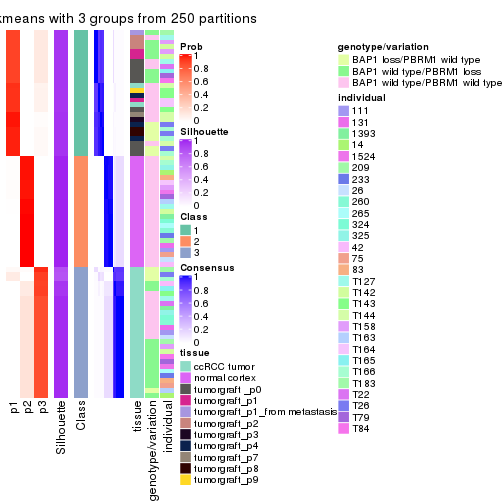</p>

</div>
<div id='tab-CV-kmeans-consensus-heatmap-3'>
<pre><code class="r">consensus_heatmap(res, k = 4)
</code></pre>

<p>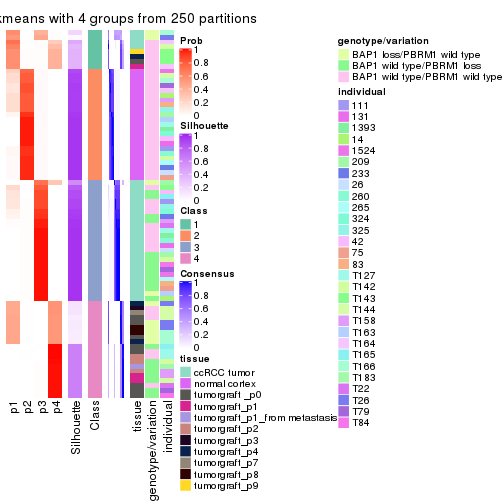</p>

</div>
<div id='tab-CV-kmeans-consensus-heatmap-4'>
<pre><code class="r">consensus_heatmap(res, k = 5)
</code></pre>

<p></p>

</div>
<div id='tab-CV-kmeans-consensus-heatmap-5'>
<pre><code class="r">consensus_heatmap(res, k = 6)
</code></pre>

<p></p>

</div>
</div>

Heatmaps for the membership of samples in all partitions to see how consistent they are:


<script>
$( function() {
	$( '#tabs-CV-kmeans-membership-heatmap' ).tabs();
} );
</script>
<div id='tabs-CV-kmeans-membership-heatmap'>
<ul>
<li><a href='#tab-CV-kmeans-membership-heatmap-1'>k = 2</a></li>
<li><a href='#tab-CV-kmeans-membership-heatmap-2'>k = 3</a></li>
<li><a href='#tab-CV-kmeans-membership-heatmap-3'>k = 4</a></li>
<li><a href='#tab-CV-kmeans-membership-heatmap-4'>k = 5</a></li>
<li><a href='#tab-CV-kmeans-membership-heatmap-5'>k = 6</a></li>
</ul>
<div id='tab-CV-kmeans-membership-heatmap-1'>
<pre><code class="r">membership_heatmap(res, k = 2)
</code></pre>

<p></p>

</div>
<div id='tab-CV-kmeans-membership-heatmap-2'>
<pre><code class="r">membership_heatmap(res, k = 3)
</code></pre>

<p></p>

</div>
<div id='tab-CV-kmeans-membership-heatmap-3'>
<pre><code class="r">membership_heatmap(res, k = 4)
</code></pre>

<p></p>

</div>
<div id='tab-CV-kmeans-membership-heatmap-4'>
<pre><code class="r">membership_heatmap(res, k = 5)
</code></pre>

<p></p>

</div>
<div id='tab-CV-kmeans-membership-heatmap-5'>
<pre><code class="r">membership_heatmap(res, k = 6)
</code></pre>

<p></p>

</div>
</div>

As soon as we have had the classes for columns, we can look for signatures
which are significantly different between classes which can be candidate marks
for certain classes. Following are the heatmaps for signatures.


Signature heatmaps where rows are scaled:


<script>
$( function() {
	$( '#tabs-CV-kmeans-get-signatures' ).tabs();
} );
</script>
<div id='tabs-CV-kmeans-get-signatures'>
<ul>
<li><a href='#tab-CV-kmeans-get-signatures-1'>k = 2</a></li>
<li><a href='#tab-CV-kmeans-get-signatures-2'>k = 3</a></li>
<li><a href='#tab-CV-kmeans-get-signatures-3'>k = 4</a></li>
<li><a href='#tab-CV-kmeans-get-signatures-4'>k = 5</a></li>
<li><a href='#tab-CV-kmeans-get-signatures-5'>k = 6</a></li>
</ul>
<div id='tab-CV-kmeans-get-signatures-1'>
<pre><code class="r">get_signatures(res, k = 2)
</code></pre>

<p></p>

</div>
<div id='tab-CV-kmeans-get-signatures-2'>
<pre><code class="r">get_signatures(res, k = 3)
</code></pre>

<p></p>

</div>
<div id='tab-CV-kmeans-get-signatures-3'>
<pre><code class="r">get_signatures(res, k = 4)
</code></pre>

<p></p>

</div>
<div id='tab-CV-kmeans-get-signatures-4'>
<pre><code class="r">get_signatures(res, k = 5)
</code></pre>

<p></p>

</div>
<div id='tab-CV-kmeans-get-signatures-5'>
<pre><code class="r">get_signatures(res, k = 6)
</code></pre>

<p></p>

</div>
</div>


Signature heatmaps where rows are not scaled:


<script>
$( function() {
	$( '#tabs-CV-kmeans-get-signatures-no-scale' ).tabs();
} );
</script>
<div id='tabs-CV-kmeans-get-signatures-no-scale'>
<ul>
<li><a href='#tab-CV-kmeans-get-signatures-no-scale-1'>k = 2</a></li>
<li><a href='#tab-CV-kmeans-get-signatures-no-scale-2'>k = 3</a></li>
<li><a href='#tab-CV-kmeans-get-signatures-no-scale-3'>k = 4</a></li>
<li><a href='#tab-CV-kmeans-get-signatures-no-scale-4'>k = 5</a></li>
<li><a href='#tab-CV-kmeans-get-signatures-no-scale-5'>k = 6</a></li>
</ul>
<div id='tab-CV-kmeans-get-signatures-no-scale-1'>
<pre><code class="r">get_signatures(res, k = 2, scale_rows = FALSE)
</code></pre>

<p></p>

</div>
<div id='tab-CV-kmeans-get-signatures-no-scale-2'>
<pre><code class="r">get_signatures(res, k = 3, scale_rows = FALSE)
</code></pre>

<p></p>

</div>
<div id='tab-CV-kmeans-get-signatures-no-scale-3'>
<pre><code class="r">get_signatures(res, k = 4, scale_rows = FALSE)
</code></pre>

<p></p>

</div>
<div id='tab-CV-kmeans-get-signatures-no-scale-4'>
<pre><code class="r">get_signatures(res, k = 5, scale_rows = FALSE)
</code></pre>

<p></p>

</div>
<div id='tab-CV-kmeans-get-signatures-no-scale-5'>
<pre><code class="r">get_signatures(res, k = 6, scale_rows = FALSE)
</code></pre>

<p></p>

</div>
</div>


Compare the overlap of signatures from different k:

```r
compare_signatures(res)
```


`get_signature()` returns a data frame invisibly. TO get the list of signatures, the function
call should be assigned to a variable explicitly. In following code, if `plot` argument is set
to `FALSE`, no heatmap is plotted while only the differential analysis is performed.

```r
# code only for demonstration
tb = get_signature(res, k = ..., plot = FALSE)
```

An example of the output of `tb` is:

```
#>   which_row         fdr    mean_1    mean_2 scaled_mean_1 scaled_mean_2 km
#> 1        38 0.042760348  8.373488  9.131774    -0.5533452     0.5164555  1
#> 2        40 0.018707592  7.106213  8.469186    -0.6173731     0.5762149  1
#> 3        55 0.019134737 10.221463 11.207825    -0.6159697     0.5749050  1
#> 4        59 0.006059896  5.921854  7.869574    -0.6899429     0.6439467  1
#> 5        60 0.018055526  8.928898 10.211722    -0.6204761     0.5791110  1
#> 6        98 0.009384629 15.714769 14.887706     0.6635654    -0.6193277  2
...
```

The columns in `tb` are:

1. `which_row`: row indices corresponding to the input matrix.
2. `fdr`: FDR for the differential test. 
3. `mean_x`: The mean value in group x.
4. `scaled_mean_x`: The mean value in group x after rows are scaled.
5. `km`: Row groups if k-means clustering is applied to rows.


UMAP plot which shows how samples are separated.


<script>
$( function() {
	$( '#tabs-CV-kmeans-dimension-reduction' ).tabs();
} );
</script>
<div id='tabs-CV-kmeans-dimension-reduction'>
<ul>
<li><a href='#tab-CV-kmeans-dimension-reduction-1'>k = 2</a></li>
<li><a href='#tab-CV-kmeans-dimension-reduction-2'>k = 3</a></li>
<li><a href='#tab-CV-kmeans-dimension-reduction-3'>k = 4</a></li>
<li><a href='#tab-CV-kmeans-dimension-reduction-4'>k = 5</a></li>
<li><a href='#tab-CV-kmeans-dimension-reduction-5'>k = 6</a></li>
</ul>
<div id='tab-CV-kmeans-dimension-reduction-1'>
<pre><code class="r">dimension_reduction(res, k = 2, method = &quot;UMAP&quot;)
</code></pre>

<p></p>

</div>
<div id='tab-CV-kmeans-dimension-reduction-2'>
<pre><code class="r">dimension_reduction(res, k = 3, method = &quot;UMAP&quot;)
</code></pre>

<p></p>

</div>
<div id='tab-CV-kmeans-dimension-reduction-3'>
<pre><code class="r">dimension_reduction(res, k = 4, method = &quot;UMAP&quot;)
</code></pre>

<p>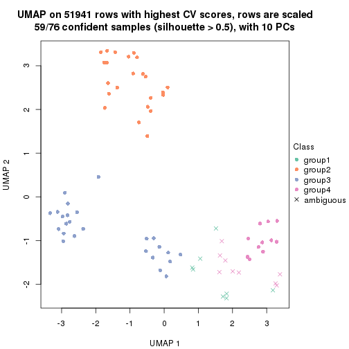</p>

</div>
<div id='tab-CV-kmeans-dimension-reduction-4'>
<pre><code class="r">dimension_reduction(res, k = 5, method = &quot;UMAP&quot;)
</code></pre>

<p></p>

</div>
<div id='tab-CV-kmeans-dimension-reduction-5'>
<pre><code class="r">dimension_reduction(res, k = 6, method = &quot;UMAP&quot;)
</code></pre>

<p></p>

</div>
</div>


Following heatmap shows how subgroups are split when increasing `k`:

```r
collect_classes(res)
```


Test correlation between subgroups and known annotations. If the known
annotation is numeric, one-way ANOVA test is applied, and if the known
annotation is discrete, chi-squared contingency table test is applied.

```r
test_to_known_factors(res)
```

```
#>            n tissue(p) genotype/variation(p) individual(p) k
#> CV:kmeans 76  2.17e-09              6.67e-03        0.0862 2
#> CV:kmeans 76  2.85e-20              4.94e-05        0.9774 3
#> CV:kmeans 59  1.29e-20              2.34e-05        0.9978 4
#> CV:kmeans 72  2.68e-22              1.67e-09        0.4484 5
#> CV:kmeans 44  1.51e-08              7.26e-04        0.2272 6
```


If matrix rows can be associated to genes, consider to use `functional_enrichment(res,
...)` to perform function enrichment for the signature genes. See [this vignette](http://bioconductor.org/packages/devel/bioc/vignettes/cola/inst/doc/functional_enrichment.html) for more detailed explanations.


 

---------------------------------------------------


### CV:skmeans**


The object with results only for a single top-value method and a single partition method 
can be extracted as:

```r
res = res_list["CV", "skmeans"]
# you can also extract it by
# res = res_list["CV:skmeans"]
```

A summary of `res` and all the functions that can be applied to it:

```r
res
```

```
#> A 'ConsensusPartition' object with k = 2, 3, 4, 5, 6.
#>   On a matrix with 51941 rows and 76 columns.
#>   Top rows (1000, 2000, 3000, 4000, 5000) are extracted by 'CV' method.
#>   Subgroups are detected by 'skmeans' method.
#>   Performed in total 1250 partitions by row resampling.
#>   Best k for subgroups seems to be 4.
#> 
#> Following methods can be applied to this 'ConsensusPartition' object:
#>  [1] "cola_report"             "collect_classes"         "collect_plots"          
#>  [4] "collect_stats"           "colnames"                "compare_signatures"     
#>  [7] "consensus_heatmap"       "dimension_reduction"     "functional_enrichment"  
#> [10] "get_anno_col"            "get_anno"                "get_classes"            
#> [13] "get_consensus"           "get_matrix"              "get_membership"         
#> [16] "get_param"               "get_signatures"          "get_stats"              
#> [19] "is_best_k"               "is_stable_k"             "membership_heatmap"     
#> [22] "ncol"                    "nrow"                    "plot_ecdf"              
#> [25] "rownames"                "select_partition_number" "show"                   
#> [28] "suggest_best_k"          "test_to_known_factors"
```

`collect_plots()` function collects all the plots made from `res` for all `k` (number of partitions)
into one single page to provide an easy and fast comparison between different `k`.

```r
collect_plots(res)
```


The plots are:

- The first row: a plot of the ECDF (empirical cumulative distribution
  function) curves of the consensus matrix for each `k` and the heatmap of
  predicted classes for each `k`.
- The second row: heatmaps of the consensus matrix for each `k`.
- The third row: heatmaps of the membership matrix for each `k`.
- The fouth row: heatmaps of the signatures for each `k`.

All the plots in panels can be made by individual functions and they are
plotted later in this section.

`select_partition_number()` produces several plots showing different
statistics for choosing "optimized" `k`. There are following statistics:

- ECDF curves of the consensus matrix for each `k`;
- 1-PAC. [The PAC
  score](https://en.wikipedia.org/wiki/Consensus_clustering#Over-interpretation_potential_of_consensus_clustering)
  measures the proportion of the ambiguous subgrouping.
- Mean silhouette score.
- Concordance. The mean probability of fiting the consensus class ids in all
  partitions.
- Area increased. Denote $A_k$ as the area under the ECDF curve for current
  `k`, the area increased is defined as $A_k - A_{k-1}$.
- Rand index. The percent of pairs of samples that are both in a same cluster
  or both are not in a same cluster in the partition of k and k-1.
- Jaccard index. The ratio of pairs of samples are both in a same cluster in
  the partition of k and k-1 and the pairs of samples are both in a same
  cluster in the partition k or k-1.

The detailed explanations of these statistics can be found in [the _cola_
vignette](http://bioconductor.org/packages/devel/bioc/vignettes/cola/inst/doc/cola.html#toc_13).

Generally speaking, lower PAC score, higher mean silhouette score or higher
concordance corresponds to better partition. Rand index and Jaccard index
measure how similar the current partition is compared to partition with `k-1`.
If they are too similar, we won't accept `k` is better than `k-1`.

```r
select_partition_number(res)
```


The numeric values for all these statistics can be obtained by `get_stats()`.

```r
get_stats(res)
```

```
#>   k 1-PAC mean_silhouette concordance area_increased  Rand Jaccard
#> 2 2 1.000           0.993       0.996         0.5039 0.496   0.496
#> 3 3 1.000           0.964       0.986         0.3364 0.728   0.504
#> 4 4 1.000           0.977       0.984         0.1061 0.897   0.698
#> 5 5 0.893           0.839       0.918         0.0593 0.938   0.761
#> 6 6 0.888           0.710       0.865         0.0293 0.971   0.866
```

`suggest_best_k()` suggests the best $k$ based on these statistics. The rules are as follows:

- All $k$ with Jaccard index larger than 0.95 are removed because increasing
  $k$ does not provide enough extra information. If all $k$ are removed, it is
  marked as no subgroup is detected.
- For all $k$ with 1-PAC score larger than 0.9, the maximal $k$ is taken as
  the best $k$, and other $k$ are marked as optional $k$.
- If it does not fit the second rule. The $k$ with the maximal vote of the
  highest 1-PAC score, highest mean silhouette, and highest concordance is
  taken as the best $k$.

```r
suggest_best_k(res)
```

```
#> [1] 4
#> attr(,"optional")
#> [1] 2 3
```

There is also optional best $k$ = 2 3 that is worth to check.

Following shows the table of the partitions (You need to click the **show/hide
code output** link to see it). The membership matrix (columns with name `p*`)
is inferred by
[`clue::cl_consensus()`](https://www.rdocumentation.org/link/cl_consensus?package=clue)
function with the `SE` method. Basically the value in the membership matrix
represents the probability to belong to a certain group. The finall class
label for an item is determined with the group with highest probability it
belongs to.

In `get_classes()` function, the entropy is calculated from the membership
matrix and the silhouette score is calculated from the consensus matrix.


<script>
$( function() {
	$( '#tabs-CV-skmeans-get-classes' ).tabs();
} );
</script>
<div id='tabs-CV-skmeans-get-classes'>
<ul>
<li><a href='#tab-CV-skmeans-get-classes-1'>k = 2</a></li>
<li><a href='#tab-CV-skmeans-get-classes-2'>k = 3</a></li>
<li><a href='#tab-CV-skmeans-get-classes-3'>k = 4</a></li>
<li><a href='#tab-CV-skmeans-get-classes-4'>k = 5</a></li>
<li><a href='#tab-CV-skmeans-get-classes-5'>k = 6</a></li>
</ul>

<div id='tab-CV-skmeans-get-classes-1'>
<p><a id='tab-CV-skmeans-get-classes-1-a' style='color:#0366d6' href='#'>show/hide code output</a></p>
<pre><code class="r">cbind(get_classes(res, k = 2), get_membership(res, k = 2))
</code></pre>

<pre><code>#&gt;           class entropy silhouette    p1    p2
#&gt; GSM905004     1  0.0000      0.997 1.000 0.000
#&gt; GSM905024     1  0.0000      0.997 1.000 0.000
#&gt; GSM905038     2  0.2778      0.952 0.048 0.952
#&gt; GSM905043     1  0.0000      0.997 1.000 0.000
#&gt; GSM904986     2  0.0000      0.996 0.000 1.000
#&gt; GSM904991     1  0.0000      0.997 1.000 0.000
#&gt; GSM904994     2  0.0000      0.996 0.000 1.000
#&gt; GSM904996     2  0.0000      0.996 0.000 1.000
#&gt; GSM905007     1  0.0000      0.997 1.000 0.000
#&gt; GSM905012     2  0.0000      0.996 0.000 1.000
#&gt; GSM905022     2  0.0000      0.996 0.000 1.000
#&gt; GSM905026     2  0.0000      0.996 0.000 1.000
#&gt; GSM905027     2  0.1633      0.975 0.024 0.976
#&gt; GSM905031     2  0.0000      0.996 0.000 1.000
#&gt; GSM905036     1  0.0672      0.990 0.992 0.008
#&gt; GSM905041     1  0.0000      0.997 1.000 0.000
#&gt; GSM905044     2  0.0000      0.996 0.000 1.000
#&gt; GSM904989     2  0.0000      0.996 0.000 1.000
#&gt; GSM904999     2  0.0000      0.996 0.000 1.000
#&gt; GSM905002     2  0.0000      0.996 0.000 1.000
#&gt; GSM905009     2  0.0000      0.996 0.000 1.000
#&gt; GSM905014     1  0.4431      0.898 0.908 0.092
#&gt; GSM905017     2  0.0000      0.996 0.000 1.000
#&gt; GSM905020     2  0.0000      0.996 0.000 1.000
#&gt; GSM905023     2  0.2778      0.952 0.048 0.952
#&gt; GSM905029     2  0.2778      0.952 0.048 0.952
#&gt; GSM905032     1  0.0000      0.997 1.000 0.000
#&gt; GSM905034     1  0.0000      0.997 1.000 0.000
#&gt; GSM905040     1  0.0000      0.997 1.000 0.000
#&gt; GSM904985     2  0.0000      0.996 0.000 1.000
#&gt; GSM904988     2  0.0000      0.996 0.000 1.000
#&gt; GSM904990     2  0.0000      0.996 0.000 1.000
#&gt; GSM904992     2  0.0000      0.996 0.000 1.000
#&gt; GSM904995     2  0.0000      0.996 0.000 1.000
#&gt; GSM904998     2  0.0000      0.996 0.000 1.000
#&gt; GSM905000     2  0.0000      0.996 0.000 1.000
#&gt; GSM905003     2  0.0000      0.996 0.000 1.000
#&gt; GSM905006     2  0.0000      0.996 0.000 1.000
#&gt; GSM905008     2  0.0000      0.996 0.000 1.000
#&gt; GSM905011     2  0.0000      0.996 0.000 1.000
#&gt; GSM905013     2  0.0000      0.996 0.000 1.000
#&gt; GSM905016     2  0.0000      0.996 0.000 1.000
#&gt; GSM905018     2  0.0000      0.996 0.000 1.000
#&gt; GSM905021     2  0.0000      0.996 0.000 1.000
#&gt; GSM905025     2  0.0000      0.996 0.000 1.000
#&gt; GSM905028     2  0.0000      0.996 0.000 1.000
#&gt; GSM905030     2  0.0000      0.996 0.000 1.000
#&gt; GSM905033     2  0.0000      0.996 0.000 1.000
#&gt; GSM905035     2  0.0000      0.996 0.000 1.000
#&gt; GSM905037     2  0.0000      0.996 0.000 1.000
#&gt; GSM905039     2  0.0000      0.996 0.000 1.000
#&gt; GSM905042     2  0.0000      0.996 0.000 1.000
#&gt; GSM905046     1  0.0000      0.997 1.000 0.000
#&gt; GSM905065     1  0.0000      0.997 1.000 0.000
#&gt; GSM905049     1  0.0000      0.997 1.000 0.000
#&gt; GSM905050     1  0.0000      0.997 1.000 0.000
#&gt; GSM905064     1  0.0000      0.997 1.000 0.000
#&gt; GSM905045     1  0.0000      0.997 1.000 0.000
#&gt; GSM905051     1  0.0000      0.997 1.000 0.000
#&gt; GSM905055     1  0.0000      0.997 1.000 0.000
#&gt; GSM905058     1  0.0000      0.997 1.000 0.000
#&gt; GSM905053     1  0.0000      0.997 1.000 0.000
#&gt; GSM905061     1  0.0000      0.997 1.000 0.000
#&gt; GSM905063     1  0.0000      0.997 1.000 0.000
#&gt; GSM905054     1  0.0000      0.997 1.000 0.000
#&gt; GSM905062     1  0.0000      0.997 1.000 0.000
#&gt; GSM905052     1  0.0000      0.997 1.000 0.000
#&gt; GSM905059     1  0.0000      0.997 1.000 0.000
#&gt; GSM905047     1  0.0000      0.997 1.000 0.000
#&gt; GSM905066     1  0.0000      0.997 1.000 0.000
#&gt; GSM905056     1  0.0000      0.997 1.000 0.000
#&gt; GSM905060     1  0.0000      0.997 1.000 0.000
#&gt; GSM905048     1  0.0000      0.997 1.000 0.000
#&gt; GSM905067     1  0.0000      0.997 1.000 0.000
#&gt; GSM905057     1  0.0000      0.997 1.000 0.000
#&gt; GSM905068     1  0.0000      0.997 1.000 0.000
</code></pre>

<script>
$('#tab-CV-skmeans-get-classes-1-a').parent().next().next().hide();
$('#tab-CV-skmeans-get-classes-1-a').click(function(){
  $('#tab-CV-skmeans-get-classes-1-a').parent().next().next().toggle();
  return(false);
});
</script>
</div>

<div id='tab-CV-skmeans-get-classes-2'>
<p><a id='tab-CV-skmeans-get-classes-2-a' style='color:#0366d6' href='#'>show/hide code output</a></p>
<pre><code class="r">cbind(get_classes(res, k = 3), get_membership(res, k = 3))
</code></pre>

<pre><code>#&gt;           class entropy silhouette    p1 p2    p3
#&gt; GSM905004     1   0.475      0.707 0.784  0 0.216
#&gt; GSM905024     3   0.617      0.312 0.412  0 0.588
#&gt; GSM905038     3   0.000      0.965 0.000  0 1.000
#&gt; GSM905043     3   0.618      0.301 0.416  0 0.584
#&gt; GSM904986     3   0.000      0.965 0.000  0 1.000
#&gt; GSM904991     3   0.000      0.965 0.000  0 1.000
#&gt; GSM904994     3   0.000      0.965 0.000  0 1.000
#&gt; GSM904996     3   0.000      0.965 0.000  0 1.000
#&gt; GSM905007     3   0.000      0.965 0.000  0 1.000
#&gt; GSM905012     3   0.000      0.965 0.000  0 1.000
#&gt; GSM905022     3   0.000      0.965 0.000  0 1.000
#&gt; GSM905026     3   0.000      0.965 0.000  0 1.000
#&gt; GSM905027     3   0.000      0.965 0.000  0 1.000
#&gt; GSM905031     3   0.000      0.965 0.000  0 1.000
#&gt; GSM905036     3   0.000      0.965 0.000  0 1.000
#&gt; GSM905041     3   0.000      0.965 0.000  0 1.000
#&gt; GSM905044     3   0.000      0.965 0.000  0 1.000
#&gt; GSM904989     3   0.000      0.965 0.000  0 1.000
#&gt; GSM904999     3   0.000      0.965 0.000  0 1.000
#&gt; GSM905002     3   0.000      0.965 0.000  0 1.000
#&gt; GSM905009     3   0.000      0.965 0.000  0 1.000
#&gt; GSM905014     3   0.000      0.965 0.000  0 1.000
#&gt; GSM905017     3   0.000      0.965 0.000  0 1.000
#&gt; GSM905020     3   0.000      0.965 0.000  0 1.000
#&gt; GSM905023     3   0.000      0.965 0.000  0 1.000
#&gt; GSM905029     3   0.000      0.965 0.000  0 1.000
#&gt; GSM905032     3   0.000      0.965 0.000  0 1.000
#&gt; GSM905034     1   0.000      0.991 1.000  0 0.000
#&gt; GSM905040     1   0.000      0.991 1.000  0 0.000
#&gt; GSM904985     2   0.000      1.000 0.000  1 0.000
#&gt; GSM904988     2   0.000      1.000 0.000  1 0.000
#&gt; GSM904990     2   0.000      1.000 0.000  1 0.000
#&gt; GSM904992     2   0.000      1.000 0.000  1 0.000
#&gt; GSM904995     2   0.000      1.000 0.000  1 0.000
#&gt; GSM904998     2   0.000      1.000 0.000  1 0.000
#&gt; GSM905000     2   0.000      1.000 0.000  1 0.000
#&gt; GSM905003     2   0.000      1.000 0.000  1 0.000
#&gt; GSM905006     2   0.000      1.000 0.000  1 0.000
#&gt; GSM905008     2   0.000      1.000 0.000  1 0.000
#&gt; GSM905011     2   0.000      1.000 0.000  1 0.000
#&gt; GSM905013     2   0.000      1.000 0.000  1 0.000
#&gt; GSM905016     2   0.000      1.000 0.000  1 0.000
#&gt; GSM905018     2   0.000      1.000 0.000  1 0.000
#&gt; GSM905021     2   0.000      1.000 0.000  1 0.000
#&gt; GSM905025     2   0.000      1.000 0.000  1 0.000
#&gt; GSM905028     2   0.000      1.000 0.000  1 0.000
#&gt; GSM905030     2   0.000      1.000 0.000  1 0.000
#&gt; GSM905033     2   0.000      1.000 0.000  1 0.000
#&gt; GSM905035     2   0.000      1.000 0.000  1 0.000
#&gt; GSM905037     2   0.000      1.000 0.000  1 0.000
#&gt; GSM905039     2   0.000      1.000 0.000  1 0.000
#&gt; GSM905042     2   0.000      1.000 0.000  1 0.000
#&gt; GSM905046     1   0.000      0.991 1.000  0 0.000
#&gt; GSM905065     1   0.000      0.991 1.000  0 0.000
#&gt; GSM905049     1   0.000      0.991 1.000  0 0.000
#&gt; GSM905050     1   0.000      0.991 1.000  0 0.000
#&gt; GSM905064     1   0.000      0.991 1.000  0 0.000
#&gt; GSM905045     1   0.000      0.991 1.000  0 0.000
#&gt; GSM905051     1   0.000      0.991 1.000  0 0.000
#&gt; GSM905055     1   0.000      0.991 1.000  0 0.000
#&gt; GSM905058     1   0.000      0.991 1.000  0 0.000
#&gt; GSM905053     1   0.000      0.991 1.000  0 0.000
#&gt; GSM905061     1   0.000      0.991 1.000  0 0.000
#&gt; GSM905063     1   0.000      0.991 1.000  0 0.000
#&gt; GSM905054     1   0.000      0.991 1.000  0 0.000
#&gt; GSM905062     1   0.000      0.991 1.000  0 0.000
#&gt; GSM905052     1   0.000      0.991 1.000  0 0.000
#&gt; GSM905059     1   0.000      0.991 1.000  0 0.000
#&gt; GSM905047     1   0.000      0.991 1.000  0 0.000
#&gt; GSM905066     1   0.000      0.991 1.000  0 0.000
#&gt; GSM905056     1   0.000      0.991 1.000  0 0.000
#&gt; GSM905060     1   0.000      0.991 1.000  0 0.000
#&gt; GSM905048     1   0.000      0.991 1.000  0 0.000
#&gt; GSM905067     1   0.000      0.991 1.000  0 0.000
#&gt; GSM905057     1   0.000      0.991 1.000  0 0.000
#&gt; GSM905068     1   0.000      0.991 1.000  0 0.000
</code></pre>

<script>
$('#tab-CV-skmeans-get-classes-2-a').parent().next().next().hide();
$('#tab-CV-skmeans-get-classes-2-a').click(function(){
  $('#tab-CV-skmeans-get-classes-2-a').parent().next().next().toggle();
  return(false);
});
</script>
</div>

<div id='tab-CV-skmeans-get-classes-3'>
<p><a id='tab-CV-skmeans-get-classes-3-a' style='color:#0366d6' href='#'>show/hide code output</a></p>
<pre><code class="r">cbind(get_classes(res, k = 4), get_membership(res, k = 4))
</code></pre>

<pre><code>#&gt;           class entropy silhouette    p1 p2    p3    p4
#&gt; GSM905004     4  0.1022      0.961 0.000  0 0.032 0.968
#&gt; GSM905024     1  0.0000      0.940 1.000  0 0.000 0.000
#&gt; GSM905038     3  0.0336      0.987 0.008  0 0.992 0.000
#&gt; GSM905043     1  0.0000      0.940 1.000  0 0.000 0.000
#&gt; GSM904986     3  0.0000      0.989 0.000  0 1.000 0.000
#&gt; GSM904991     3  0.1211      0.975 0.040  0 0.960 0.000
#&gt; GSM904994     3  0.0000      0.989 0.000  0 1.000 0.000
#&gt; GSM904996     3  0.0000      0.989 0.000  0 1.000 0.000
#&gt; GSM905007     3  0.1211      0.975 0.040  0 0.960 0.000
#&gt; GSM905012     3  0.0000      0.989 0.000  0 1.000 0.000
#&gt; GSM905022     3  0.0000      0.989 0.000  0 1.000 0.000
#&gt; GSM905026     3  0.0000      0.989 0.000  0 1.000 0.000
#&gt; GSM905027     3  0.0000      0.989 0.000  0 1.000 0.000
#&gt; GSM905031     3  0.0000      0.989 0.000  0 1.000 0.000
#&gt; GSM905036     3  0.0707      0.984 0.020  0 0.980 0.000
#&gt; GSM905041     3  0.1211      0.975 0.040  0 0.960 0.000
#&gt; GSM905044     3  0.0000      0.989 0.000  0 1.000 0.000
#&gt; GSM904989     3  0.0000      0.989 0.000  0 1.000 0.000
#&gt; GSM904999     3  0.1022      0.978 0.032  0 0.968 0.000
#&gt; GSM905002     3  0.0000      0.989 0.000  0 1.000 0.000
#&gt; GSM905009     3  0.0000      0.989 0.000  0 1.000 0.000
#&gt; GSM905014     3  0.1211      0.975 0.040  0 0.960 0.000
#&gt; GSM905017     3  0.1022      0.978 0.032  0 0.968 0.000
#&gt; GSM905020     3  0.0000      0.989 0.000  0 1.000 0.000
#&gt; GSM905023     3  0.0707      0.984 0.020  0 0.980 0.000
#&gt; GSM905029     3  0.0000      0.989 0.000  0 1.000 0.000
#&gt; GSM905032     1  0.4713      0.388 0.640  0 0.360 0.000
#&gt; GSM905034     1  0.0000      0.940 1.000  0 0.000 0.000
#&gt; GSM905040     1  0.0000      0.940 1.000  0 0.000 0.000
#&gt; GSM904985     2  0.0000      1.000 0.000  1 0.000 0.000
#&gt; GSM904988     2  0.0000      1.000 0.000  1 0.000 0.000
#&gt; GSM904990     2  0.0000      1.000 0.000  1 0.000 0.000
#&gt; GSM904992     2  0.0000      1.000 0.000  1 0.000 0.000
#&gt; GSM904995     2  0.0000      1.000 0.000  1 0.000 0.000
#&gt; GSM904998     2  0.0000      1.000 0.000  1 0.000 0.000
#&gt; GSM905000     2  0.0000      1.000 0.000  1 0.000 0.000
#&gt; GSM905003     2  0.0000      1.000 0.000  1 0.000 0.000
#&gt; GSM905006     2  0.0000      1.000 0.000  1 0.000 0.000
#&gt; GSM905008     2  0.0000      1.000 0.000  1 0.000 0.000
#&gt; GSM905011     2  0.0000      1.000 0.000  1 0.000 0.000
#&gt; GSM905013     2  0.0000      1.000 0.000  1 0.000 0.000
#&gt; GSM905016     2  0.0000      1.000 0.000  1 0.000 0.000
#&gt; GSM905018     2  0.0000      1.000 0.000  1 0.000 0.000
#&gt; GSM905021     2  0.0000      1.000 0.000  1 0.000 0.000
#&gt; GSM905025     2  0.0000      1.000 0.000  1 0.000 0.000
#&gt; GSM905028     2  0.0000      1.000 0.000  1 0.000 0.000
#&gt; GSM905030     2  0.0000      1.000 0.000  1 0.000 0.000
#&gt; GSM905033     2  0.0000      1.000 0.000  1 0.000 0.000
#&gt; GSM905035     2  0.0000      1.000 0.000  1 0.000 0.000
#&gt; GSM905037     2  0.0000      1.000 0.000  1 0.000 0.000
#&gt; GSM905039     2  0.0000      1.000 0.000  1 0.000 0.000
#&gt; GSM905042     2  0.0000      1.000 0.000  1 0.000 0.000
#&gt; GSM905046     1  0.1211      0.962 0.960  0 0.000 0.040
#&gt; GSM905065     1  0.1211      0.962 0.960  0 0.000 0.040
#&gt; GSM905049     4  0.0000      0.996 0.000  0 0.000 1.000
#&gt; GSM905050     4  0.0000      0.996 0.000  0 0.000 1.000
#&gt; GSM905064     4  0.0000      0.996 0.000  0 0.000 1.000
#&gt; GSM905045     4  0.0000      0.996 0.000  0 0.000 1.000
#&gt; GSM905051     4  0.0000      0.996 0.000  0 0.000 1.000
#&gt; GSM905055     1  0.1211      0.962 0.960  0 0.000 0.040
#&gt; GSM905058     1  0.1211      0.962 0.960  0 0.000 0.040
#&gt; GSM905053     4  0.0000      0.996 0.000  0 0.000 1.000
#&gt; GSM905061     4  0.0000      0.996 0.000  0 0.000 1.000
#&gt; GSM905063     1  0.1211      0.962 0.960  0 0.000 0.040
#&gt; GSM905054     4  0.0000      0.996 0.000  0 0.000 1.000
#&gt; GSM905062     4  0.0000      0.996 0.000  0 0.000 1.000
#&gt; GSM905052     4  0.0000      0.996 0.000  0 0.000 1.000
#&gt; GSM905059     1  0.1211      0.962 0.960  0 0.000 0.040
#&gt; GSM905047     1  0.1211      0.962 0.960  0 0.000 0.040
#&gt; GSM905066     1  0.1211      0.962 0.960  0 0.000 0.040
#&gt; GSM905056     1  0.1211      0.962 0.960  0 0.000 0.040
#&gt; GSM905060     1  0.1211      0.962 0.960  0 0.000 0.040
#&gt; GSM905048     1  0.1211      0.962 0.960  0 0.000 0.040
#&gt; GSM905067     1  0.1211      0.962 0.960  0 0.000 0.040
#&gt; GSM905057     1  0.1211      0.962 0.960  0 0.000 0.040
#&gt; GSM905068     4  0.0000      0.996 0.000  0 0.000 1.000
</code></pre>

<script>
$('#tab-CV-skmeans-get-classes-3-a').parent().next().next().hide();
$('#tab-CV-skmeans-get-classes-3-a').click(function(){
  $('#tab-CV-skmeans-get-classes-3-a').parent().next().next().toggle();
  return(false);
});
</script>
</div>

<div id='tab-CV-skmeans-get-classes-4'>
<p><a id='tab-CV-skmeans-get-classes-4-a' style='color:#0366d6' href='#'>show/hide code output</a></p>
<pre><code class="r">cbind(get_classes(res, k = 5), get_membership(res, k = 5))
</code></pre>

<pre><code>#&gt;           class entropy silhouette    p1    p2    p3    p4    p5
#&gt; GSM905004     4  0.2130     0.8780 0.000 0.000 0.080 0.908 0.012
#&gt; GSM905024     5  0.2648     0.6396 0.152 0.000 0.000 0.000 0.848
#&gt; GSM905038     3  0.4192     0.0631 0.000 0.000 0.596 0.000 0.404
#&gt; GSM905043     5  0.3177     0.5570 0.208 0.000 0.000 0.000 0.792
#&gt; GSM904986     3  0.0000     0.8618 0.000 0.000 1.000 0.000 0.000
#&gt; GSM904991     5  0.3274     0.7393 0.000 0.000 0.220 0.000 0.780
#&gt; GSM904994     3  0.0000     0.8618 0.000 0.000 1.000 0.000 0.000
#&gt; GSM904996     3  0.0000     0.8618 0.000 0.000 1.000 0.000 0.000
#&gt; GSM905007     5  0.3452     0.7283 0.000 0.000 0.244 0.000 0.756
#&gt; GSM905012     3  0.0000     0.8618 0.000 0.000 1.000 0.000 0.000
#&gt; GSM905022     3  0.0000     0.8618 0.000 0.000 1.000 0.000 0.000
#&gt; GSM905026     3  0.0000     0.8618 0.000 0.000 1.000 0.000 0.000
#&gt; GSM905027     3  0.3242     0.5828 0.000 0.000 0.784 0.000 0.216
#&gt; GSM905031     3  0.0000     0.8618 0.000 0.000 1.000 0.000 0.000
#&gt; GSM905036     5  0.4126     0.5506 0.000 0.000 0.380 0.000 0.620
#&gt; GSM905041     5  0.3242     0.7395 0.000 0.000 0.216 0.000 0.784
#&gt; GSM905044     3  0.0000     0.8618 0.000 0.000 1.000 0.000 0.000
#&gt; GSM904989     3  0.0000     0.8618 0.000 0.000 1.000 0.000 0.000
#&gt; GSM904999     5  0.4562     0.2157 0.000 0.000 0.496 0.008 0.496
#&gt; GSM905002     3  0.0000     0.8618 0.000 0.000 1.000 0.000 0.000
#&gt; GSM905009     3  0.0000     0.8618 0.000 0.000 1.000 0.000 0.000
#&gt; GSM905014     5  0.3366     0.7355 0.000 0.000 0.232 0.000 0.768
#&gt; GSM905017     3  0.4562    -0.3383 0.000 0.000 0.496 0.008 0.496
#&gt; GSM905020     3  0.0000     0.8618 0.000 0.000 1.000 0.000 0.000
#&gt; GSM905023     5  0.4171     0.5175 0.000 0.000 0.396 0.000 0.604
#&gt; GSM905029     3  0.4114     0.1696 0.000 0.000 0.624 0.000 0.376
#&gt; GSM905032     5  0.1205     0.6467 0.040 0.000 0.004 0.000 0.956
#&gt; GSM905034     1  0.3586     0.7021 0.736 0.000 0.000 0.000 0.264
#&gt; GSM905040     1  0.4030     0.6939 0.648 0.000 0.000 0.000 0.352
#&gt; GSM904985     2  0.0510     0.9911 0.000 0.984 0.000 0.000 0.016
#&gt; GSM904988     2  0.0000     0.9943 0.000 1.000 0.000 0.000 0.000
#&gt; GSM904990     2  0.0000     0.9943 0.000 1.000 0.000 0.000 0.000
#&gt; GSM904992     2  0.0000     0.9943 0.000 1.000 0.000 0.000 0.000
#&gt; GSM904995     2  0.0510     0.9911 0.000 0.984 0.000 0.000 0.016
#&gt; GSM904998     2  0.0000     0.9943 0.000 1.000 0.000 0.000 0.000
#&gt; GSM905000     2  0.0000     0.9943 0.000 1.000 0.000 0.000 0.000
#&gt; GSM905003     2  0.0000     0.9943 0.000 1.000 0.000 0.000 0.000
#&gt; GSM905006     2  0.0000     0.9943 0.000 1.000 0.000 0.000 0.000
#&gt; GSM905008     2  0.0000     0.9943 0.000 1.000 0.000 0.000 0.000
#&gt; GSM905011     2  0.0000     0.9943 0.000 1.000 0.000 0.000 0.000
#&gt; GSM905013     2  0.0000     0.9943 0.000 1.000 0.000 0.000 0.000
#&gt; GSM905016     2  0.0510     0.9911 0.000 0.984 0.000 0.000 0.016
#&gt; GSM905018     2  0.0000     0.9943 0.000 1.000 0.000 0.000 0.000
#&gt; GSM905021     2  0.0609     0.9890 0.000 0.980 0.000 0.000 0.020
#&gt; GSM905025     2  0.0510     0.9911 0.000 0.984 0.000 0.000 0.016
#&gt; GSM905028     2  0.0000     0.9943 0.000 1.000 0.000 0.000 0.000
#&gt; GSM905030     2  0.0000     0.9943 0.000 1.000 0.000 0.000 0.000
#&gt; GSM905033     2  0.0510     0.9911 0.000 0.984 0.000 0.000 0.016
#&gt; GSM905035     2  0.0510     0.9911 0.000 0.984 0.000 0.000 0.016
#&gt; GSM905037     2  0.0000     0.9943 0.000 1.000 0.000 0.000 0.000
#&gt; GSM905039     2  0.0510     0.9911 0.000 0.984 0.000 0.000 0.016
#&gt; GSM905042     2  0.0510     0.9911 0.000 0.984 0.000 0.000 0.016
#&gt; GSM905046     1  0.0290     0.9097 0.992 0.000 0.000 0.008 0.000
#&gt; GSM905065     1  0.0451     0.9099 0.988 0.000 0.000 0.008 0.004
#&gt; GSM905049     4  0.0290     0.9543 0.008 0.000 0.000 0.992 0.000
#&gt; GSM905050     4  0.0290     0.9543 0.008 0.000 0.000 0.992 0.000
#&gt; GSM905064     4  0.0290     0.9543 0.008 0.000 0.000 0.992 0.000
#&gt; GSM905045     4  0.0451     0.9539 0.008 0.000 0.000 0.988 0.004
#&gt; GSM905051     4  0.3123     0.8060 0.184 0.000 0.000 0.812 0.004
#&gt; GSM905055     1  0.2966     0.8540 0.816 0.000 0.000 0.000 0.184
#&gt; GSM905058     1  0.0451     0.9087 0.988 0.000 0.000 0.008 0.004
#&gt; GSM905053     4  0.0290     0.9543 0.008 0.000 0.000 0.992 0.000
#&gt; GSM905061     4  0.0693     0.9525 0.008 0.000 0.000 0.980 0.012
#&gt; GSM905063     1  0.2966     0.8540 0.816 0.000 0.000 0.000 0.184
#&gt; GSM905054     4  0.0290     0.9543 0.008 0.000 0.000 0.992 0.000
#&gt; GSM905062     4  0.0693     0.9525 0.008 0.000 0.000 0.980 0.012
#&gt; GSM905052     4  0.3086     0.8103 0.180 0.000 0.000 0.816 0.004
#&gt; GSM905059     1  0.0451     0.9087 0.988 0.000 0.000 0.008 0.004
#&gt; GSM905047     1  0.0290     0.9097 0.992 0.000 0.000 0.008 0.000
#&gt; GSM905066     1  0.0451     0.9099 0.988 0.000 0.000 0.008 0.004
#&gt; GSM905056     1  0.2966     0.8540 0.816 0.000 0.000 0.000 0.184
#&gt; GSM905060     1  0.0451     0.9087 0.988 0.000 0.000 0.008 0.004
#&gt; GSM905048     1  0.0290     0.9097 0.992 0.000 0.000 0.008 0.000
#&gt; GSM905067     1  0.0451     0.9099 0.988 0.000 0.000 0.008 0.004
#&gt; GSM905057     1  0.2966     0.8540 0.816 0.000 0.000 0.000 0.184
#&gt; GSM905068     4  0.0693     0.9525 0.008 0.000 0.000 0.980 0.012
</code></pre>

<script>
$('#tab-CV-skmeans-get-classes-4-a').parent().next().next().hide();
$('#tab-CV-skmeans-get-classes-4-a').click(function(){
  $('#tab-CV-skmeans-get-classes-4-a').parent().next().next().toggle();
  return(false);
});
</script>
</div>

<div id='tab-CV-skmeans-get-classes-5'>
<p><a id='tab-CV-skmeans-get-classes-5-a' style='color:#0366d6' href='#'>show/hide code output</a></p>
<pre><code class="r">cbind(get_classes(res, k = 6), get_membership(res, k = 6))
</code></pre>

<pre><code>#&gt;           class entropy silhouette    p1    p2    p3    p4    p5    p6
#&gt; GSM905004     4  0.2841     0.7948 0.000 0.000 0.092 0.864 0.012 0.032
#&gt; GSM905024     5  0.4148     0.5055 0.108 0.000 0.000 0.000 0.744 0.148
#&gt; GSM905038     5  0.4294     0.3288 0.000 0.000 0.428 0.000 0.552 0.020
#&gt; GSM905043     5  0.4983     0.3582 0.148 0.000 0.000 0.000 0.644 0.208
#&gt; GSM904986     3  0.0146     0.9437 0.000 0.000 0.996 0.000 0.000 0.004
#&gt; GSM904991     5  0.2106     0.6820 0.000 0.000 0.064 0.000 0.904 0.032
#&gt; GSM904994     3  0.0000     0.9444 0.000 0.000 1.000 0.000 0.000 0.000
#&gt; GSM904996     3  0.0000     0.9444 0.000 0.000 1.000 0.000 0.000 0.000
#&gt; GSM905007     5  0.1812     0.6890 0.000 0.000 0.080 0.000 0.912 0.008
#&gt; GSM905012     3  0.0000     0.9444 0.000 0.000 1.000 0.000 0.000 0.000
#&gt; GSM905022     3  0.0291     0.9429 0.000 0.000 0.992 0.000 0.004 0.004
#&gt; GSM905026     3  0.1151     0.9186 0.000 0.000 0.956 0.000 0.032 0.012
#&gt; GSM905027     3  0.4212     0.0381 0.000 0.000 0.560 0.000 0.424 0.016
#&gt; GSM905031     3  0.0603     0.9345 0.000 0.000 0.980 0.000 0.016 0.004
#&gt; GSM905036     5  0.2877     0.6790 0.000 0.000 0.168 0.000 0.820 0.012
#&gt; GSM905041     5  0.1713     0.6733 0.000 0.000 0.044 0.000 0.928 0.028
#&gt; GSM905044     3  0.0909     0.9293 0.000 0.000 0.968 0.000 0.020 0.012
#&gt; GSM904989     3  0.0146     0.9428 0.000 0.000 0.996 0.000 0.000 0.004
#&gt; GSM904999     5  0.5984     0.4048 0.000 0.000 0.284 0.000 0.444 0.272
#&gt; GSM905002     3  0.0291     0.9429 0.000 0.000 0.992 0.000 0.004 0.004
#&gt; GSM905009     3  0.0000     0.9444 0.000 0.000 1.000 0.000 0.000 0.000
#&gt; GSM905014     5  0.1701     0.6870 0.000 0.000 0.072 0.000 0.920 0.008
#&gt; GSM905017     5  0.5984     0.4048 0.000 0.000 0.284 0.000 0.444 0.272
#&gt; GSM905020     3  0.0000     0.9444 0.000 0.000 1.000 0.000 0.000 0.000
#&gt; GSM905023     5  0.3104     0.6730 0.000 0.000 0.184 0.000 0.800 0.016
#&gt; GSM905029     5  0.4224     0.3268 0.000 0.000 0.432 0.000 0.552 0.016
#&gt; GSM905032     5  0.3868     0.0799 0.000 0.000 0.000 0.000 0.504 0.496
#&gt; GSM905034     1  0.5117     0.0476 0.628 0.000 0.000 0.000 0.200 0.172
#&gt; GSM905040     6  0.4950     0.0000 0.344 0.000 0.000 0.000 0.080 0.576
#&gt; GSM904985     2  0.1471     0.9514 0.000 0.932 0.000 0.000 0.004 0.064
#&gt; GSM904988     2  0.0000     0.9683 0.000 1.000 0.000 0.000 0.000 0.000
#&gt; GSM904990     2  0.0000     0.9683 0.000 1.000 0.000 0.000 0.000 0.000
#&gt; GSM904992     2  0.0000     0.9683 0.000 1.000 0.000 0.000 0.000 0.000
#&gt; GSM904995     2  0.1411     0.9525 0.000 0.936 0.000 0.000 0.004 0.060
#&gt; GSM904998     2  0.0000     0.9683 0.000 1.000 0.000 0.000 0.000 0.000
#&gt; GSM905000     2  0.0000     0.9683 0.000 1.000 0.000 0.000 0.000 0.000
#&gt; GSM905003     2  0.0146     0.9676 0.000 0.996 0.000 0.000 0.000 0.004
#&gt; GSM905006     2  0.0000     0.9683 0.000 1.000 0.000 0.000 0.000 0.000
#&gt; GSM905008     2  0.0146     0.9676 0.000 0.996 0.000 0.000 0.000 0.004
#&gt; GSM905011     2  0.0000     0.9683 0.000 1.000 0.000 0.000 0.000 0.000
#&gt; GSM905013     2  0.0000     0.9683 0.000 1.000 0.000 0.000 0.000 0.000
#&gt; GSM905016     2  0.1411     0.9525 0.000 0.936 0.000 0.000 0.004 0.060
#&gt; GSM905018     2  0.0000     0.9683 0.000 1.000 0.000 0.000 0.000 0.000
#&gt; GSM905021     2  0.3420     0.7751 0.000 0.748 0.000 0.000 0.012 0.240
#&gt; GSM905025     2  0.1524     0.9518 0.000 0.932 0.000 0.000 0.008 0.060
#&gt; GSM905028     2  0.0146     0.9678 0.000 0.996 0.000 0.000 0.004 0.000
#&gt; GSM905030     2  0.0146     0.9678 0.000 0.996 0.000 0.000 0.004 0.000
#&gt; GSM905033     2  0.1643     0.9482 0.000 0.924 0.000 0.000 0.008 0.068
#&gt; GSM905035     2  0.1524     0.9518 0.000 0.932 0.000 0.000 0.008 0.060
#&gt; GSM905037     2  0.0146     0.9678 0.000 0.996 0.000 0.000 0.004 0.000
#&gt; GSM905039     2  0.1524     0.9518 0.000 0.932 0.000 0.000 0.008 0.060
#&gt; GSM905042     2  0.1701     0.9460 0.000 0.920 0.000 0.000 0.008 0.072
#&gt; GSM905046     1  0.0291     0.6667 0.992 0.000 0.000 0.004 0.000 0.004
#&gt; GSM905065     1  0.1219     0.6553 0.948 0.000 0.000 0.004 0.000 0.048
#&gt; GSM905049     4  0.0000     0.8997 0.000 0.000 0.000 1.000 0.000 0.000
#&gt; GSM905050     4  0.0000     0.8997 0.000 0.000 0.000 1.000 0.000 0.000
#&gt; GSM905064     4  0.0000     0.8997 0.000 0.000 0.000 1.000 0.000 0.000
#&gt; GSM905045     4  0.0363     0.8983 0.000 0.000 0.000 0.988 0.000 0.012
#&gt; GSM905051     4  0.5092     0.4310 0.356 0.000 0.000 0.576 0.024 0.044
#&gt; GSM905055     1  0.3986    -0.3769 0.532 0.000 0.000 0.000 0.004 0.464
#&gt; GSM905058     1  0.1232     0.6548 0.956 0.000 0.000 0.004 0.016 0.024
#&gt; GSM905053     4  0.0000     0.8997 0.000 0.000 0.000 1.000 0.000 0.000
#&gt; GSM905061     4  0.0508     0.8963 0.000 0.000 0.000 0.984 0.004 0.012
#&gt; GSM905063     1  0.3975    -0.3479 0.544 0.000 0.000 0.000 0.004 0.452
#&gt; GSM905054     4  0.0000     0.8997 0.000 0.000 0.000 1.000 0.000 0.000
#&gt; GSM905062     4  0.0508     0.8963 0.000 0.000 0.000 0.984 0.004 0.012
#&gt; GSM905052     4  0.5092     0.4310 0.356 0.000 0.000 0.576 0.024 0.044
#&gt; GSM905059     1  0.1232     0.6548 0.956 0.000 0.000 0.004 0.016 0.024
#&gt; GSM905047     1  0.0291     0.6667 0.992 0.000 0.000 0.004 0.000 0.004
#&gt; GSM905066     1  0.1219     0.6553 0.948 0.000 0.000 0.004 0.000 0.048
#&gt; GSM905056     1  0.3986    -0.3769 0.532 0.000 0.000 0.000 0.004 0.464
#&gt; GSM905060     1  0.1232     0.6548 0.956 0.000 0.000 0.004 0.016 0.024
#&gt; GSM905048     1  0.0603     0.6663 0.980 0.000 0.000 0.004 0.000 0.016
#&gt; GSM905067     1  0.1219     0.6553 0.948 0.000 0.000 0.004 0.000 0.048
#&gt; GSM905057     1  0.3986    -0.3769 0.532 0.000 0.000 0.000 0.004 0.464
#&gt; GSM905068     4  0.0260     0.8985 0.000 0.000 0.000 0.992 0.000 0.008
</code></pre>

<script>
$('#tab-CV-skmeans-get-classes-5-a').parent().next().next().hide();
$('#tab-CV-skmeans-get-classes-5-a').click(function(){
  $('#tab-CV-skmeans-get-classes-5-a').parent().next().next().toggle();
  return(false);
});
</script>
</div>
</div>

Heatmaps for the consensus matrix. It visualizes the probability of two
samples to be in a same group.


<script>
$( function() {
	$( '#tabs-CV-skmeans-consensus-heatmap' ).tabs();
} );
</script>
<div id='tabs-CV-skmeans-consensus-heatmap'>
<ul>
<li><a href='#tab-CV-skmeans-consensus-heatmap-1'>k = 2</a></li>
<li><a href='#tab-CV-skmeans-consensus-heatmap-2'>k = 3</a></li>
<li><a href='#tab-CV-skmeans-consensus-heatmap-3'>k = 4</a></li>
<li><a href='#tab-CV-skmeans-consensus-heatmap-4'>k = 5</a></li>
<li><a href='#tab-CV-skmeans-consensus-heatmap-5'>k = 6</a></li>
</ul>
<div id='tab-CV-skmeans-consensus-heatmap-1'>
<pre><code class="r">consensus_heatmap(res, k = 2)
</code></pre>

<p></p>

</div>
<div id='tab-CV-skmeans-consensus-heatmap-2'>
<pre><code class="r">consensus_heatmap(res, k = 3)
</code></pre>

<p></p>

</div>
<div id='tab-CV-skmeans-consensus-heatmap-3'>
<pre><code class="r">consensus_heatmap(res, k = 4)
</code></pre>

<p></p>

</div>
<div id='tab-CV-skmeans-consensus-heatmap-4'>
<pre><code class="r">consensus_heatmap(res, k = 5)
</code></pre>

<p></p>

</div>
<div id='tab-CV-skmeans-consensus-heatmap-5'>
<pre><code class="r">consensus_heatmap(res, k = 6)
</code></pre>

<p></p>

</div>
</div>

Heatmaps for the membership of samples in all partitions to see how consistent they are:


<script>
$( function() {
	$( '#tabs-CV-skmeans-membership-heatmap' ).tabs();
} );
</script>
<div id='tabs-CV-skmeans-membership-heatmap'>
<ul>
<li><a href='#tab-CV-skmeans-membership-heatmap-1'>k = 2</a></li>
<li><a href='#tab-CV-skmeans-membership-heatmap-2'>k = 3</a></li>
<li><a href='#tab-CV-skmeans-membership-heatmap-3'>k = 4</a></li>
<li><a href='#tab-CV-skmeans-membership-heatmap-4'>k = 5</a></li>
<li><a href='#tab-CV-skmeans-membership-heatmap-5'>k = 6</a></li>
</ul>
<div id='tab-CV-skmeans-membership-heatmap-1'>
<pre><code class="r">membership_heatmap(res, k = 2)
</code></pre>

<p></p>

</div>
<div id='tab-CV-skmeans-membership-heatmap-2'>
<pre><code class="r">membership_heatmap(res, k = 3)
</code></pre>

<p></p>

</div>
<div id='tab-CV-skmeans-membership-heatmap-3'>
<pre><code class="r">membership_heatmap(res, k = 4)
</code></pre>

<p></p>

</div>
<div id='tab-CV-skmeans-membership-heatmap-4'>
<pre><code class="r">membership_heatmap(res, k = 5)
</code></pre>

<p></p>

</div>
<div id='tab-CV-skmeans-membership-heatmap-5'>
<pre><code class="r">membership_heatmap(res, k = 6)
</code></pre>

<p></p>

</div>
</div>

As soon as we have had the classes for columns, we can look for signatures
which are significantly different between classes which can be candidate marks
for certain classes. Following are the heatmaps for signatures.


Signature heatmaps where rows are scaled:


<script>
$( function() {
	$( '#tabs-CV-skmeans-get-signatures' ).tabs();
} );
</script>
<div id='tabs-CV-skmeans-get-signatures'>
<ul>
<li><a href='#tab-CV-skmeans-get-signatures-1'>k = 2</a></li>
<li><a href='#tab-CV-skmeans-get-signatures-2'>k = 3</a></li>
<li><a href='#tab-CV-skmeans-get-signatures-3'>k = 4</a></li>
<li><a href='#tab-CV-skmeans-get-signatures-4'>k = 5</a></li>
<li><a href='#tab-CV-skmeans-get-signatures-5'>k = 6</a></li>
</ul>
<div id='tab-CV-skmeans-get-signatures-1'>
<pre><code class="r">get_signatures(res, k = 2)
</code></pre>

<p></p>

</div>
<div id='tab-CV-skmeans-get-signatures-2'>
<pre><code class="r">get_signatures(res, k = 3)
</code></pre>

<p></p>

</div>
<div id='tab-CV-skmeans-get-signatures-3'>
<pre><code class="r">get_signatures(res, k = 4)
</code></pre>

<p></p>

</div>
<div id='tab-CV-skmeans-get-signatures-4'>
<pre><code class="r">get_signatures(res, k = 5)
</code></pre>

<p></p>

</div>
<div id='tab-CV-skmeans-get-signatures-5'>
<pre><code class="r">get_signatures(res, k = 6)
</code></pre>

<p></p>

</div>
</div>


Signature heatmaps where rows are not scaled:


<script>
$( function() {
	$( '#tabs-CV-skmeans-get-signatures-no-scale' ).tabs();
} );
</script>
<div id='tabs-CV-skmeans-get-signatures-no-scale'>
<ul>
<li><a href='#tab-CV-skmeans-get-signatures-no-scale-1'>k = 2</a></li>
<li><a href='#tab-CV-skmeans-get-signatures-no-scale-2'>k = 3</a></li>
<li><a href='#tab-CV-skmeans-get-signatures-no-scale-3'>k = 4</a></li>
<li><a href='#tab-CV-skmeans-get-signatures-no-scale-4'>k = 5</a></li>
<li><a href='#tab-CV-skmeans-get-signatures-no-scale-5'>k = 6</a></li>
</ul>
<div id='tab-CV-skmeans-get-signatures-no-scale-1'>
<pre><code class="r">get_signatures(res, k = 2, scale_rows = FALSE)
</code></pre>

<p></p>

</div>
<div id='tab-CV-skmeans-get-signatures-no-scale-2'>
<pre><code class="r">get_signatures(res, k = 3, scale_rows = FALSE)
</code></pre>

<p></p>

</div>
<div id='tab-CV-skmeans-get-signatures-no-scale-3'>
<pre><code class="r">get_signatures(res, k = 4, scale_rows = FALSE)
</code></pre>

<p></p>

</div>
<div id='tab-CV-skmeans-get-signatures-no-scale-4'>
<pre><code class="r">get_signatures(res, k = 5, scale_rows = FALSE)
</code></pre>

<p></p>

</div>
<div id='tab-CV-skmeans-get-signatures-no-scale-5'>
<pre><code class="r">get_signatures(res, k = 6, scale_rows = FALSE)
</code></pre>

<p></p>

</div>
</div>


Compare the overlap of signatures from different k:

```r
compare_signatures(res)
```


`get_signature()` returns a data frame invisibly. TO get the list of signatures, the function
call should be assigned to a variable explicitly. In following code, if `plot` argument is set
to `FALSE`, no heatmap is plotted while only the differential analysis is performed.

```r
# code only for demonstration
tb = get_signature(res, k = ..., plot = FALSE)
```

An example of the output of `tb` is:

```
#>   which_row         fdr    mean_1    mean_2 scaled_mean_1 scaled_mean_2 km
#> 1        38 0.042760348  8.373488  9.131774    -0.5533452     0.5164555  1
#> 2        40 0.018707592  7.106213  8.469186    -0.6173731     0.5762149  1
#> 3        55 0.019134737 10.221463 11.207825    -0.6159697     0.5749050  1
#> 4        59 0.006059896  5.921854  7.869574    -0.6899429     0.6439467  1
#> 5        60 0.018055526  8.928898 10.211722    -0.6204761     0.5791110  1
#> 6        98 0.009384629 15.714769 14.887706     0.6635654    -0.6193277  2
...
```

The columns in `tb` are:

1. `which_row`: row indices corresponding to the input matrix.
2. `fdr`: FDR for the differential test. 
3. `mean_x`: The mean value in group x.
4. `scaled_mean_x`: The mean value in group x after rows are scaled.
5. `km`: Row groups if k-means clustering is applied to rows.


UMAP plot which shows how samples are separated.


<script>
$( function() {
	$( '#tabs-CV-skmeans-dimension-reduction' ).tabs();
} );
</script>
<div id='tabs-CV-skmeans-dimension-reduction'>
<ul>
<li><a href='#tab-CV-skmeans-dimension-reduction-1'>k = 2</a></li>
<li><a href='#tab-CV-skmeans-dimension-reduction-2'>k = 3</a></li>
<li><a href='#tab-CV-skmeans-dimension-reduction-3'>k = 4</a></li>
<li><a href='#tab-CV-skmeans-dimension-reduction-4'>k = 5</a></li>
<li><a href='#tab-CV-skmeans-dimension-reduction-5'>k = 6</a></li>
</ul>
<div id='tab-CV-skmeans-dimension-reduction-1'>
<pre><code class="r">dimension_reduction(res, k = 2, method = &quot;UMAP&quot;)
</code></pre>

<p></p>

</div>
<div id='tab-CV-skmeans-dimension-reduction-2'>
<pre><code class="r">dimension_reduction(res, k = 3, method = &quot;UMAP&quot;)
</code></pre>

<p></p>

</div>
<div id='tab-CV-skmeans-dimension-reduction-3'>
<pre><code class="r">dimension_reduction(res, k = 4, method = &quot;UMAP&quot;)
</code></pre>

<p></p>

</div>
<div id='tab-CV-skmeans-dimension-reduction-4'>
<pre><code class="r">dimension_reduction(res, k = 5, method = &quot;UMAP&quot;)
</code></pre>

<p></p>

</div>
<div id='tab-CV-skmeans-dimension-reduction-5'>
<pre><code class="r">dimension_reduction(res, k = 6, method = &quot;UMAP&quot;)
</code></pre>

<p></p>

</div>
</div>


Following heatmap shows how subgroups are split when increasing `k`:

```r
collect_classes(res)
```


Test correlation between subgroups and known annotations. If the known
annotation is numeric, one-way ANOVA test is applied, and if the known
annotation is discrete, chi-squared contingency table test is applied.

```r
test_to_known_factors(res)
```

```
#>             n tissue(p) genotype/variation(p) individual(p) k
#> CV:skmeans 76  4.99e-07              1.61e-03        0.0803 2
#> CV:skmeans 74  1.34e-18              5.42e-06        0.9460 3
#> CV:skmeans 75  1.27e-19              7.10e-10        0.2356 4
#> CV:skmeans 72  1.53e-16              2.67e-08        0.4302 5
#> CV:skmeans 61  3.24e-16              1.74e-10        0.5407 6
```


If matrix rows can be associated to genes, consider to use `functional_enrichment(res,
...)` to perform function enrichment for the signature genes. See [this vignette](http://bioconductor.org/packages/devel/bioc/vignettes/cola/inst/doc/functional_enrichment.html) for more detailed explanations.


 

---------------------------------------------------


### CV:pam**


The object with results only for a single top-value method and a single partition method 
can be extracted as:

```r
res = res_list["CV", "pam"]
# you can also extract it by
# res = res_list["CV:pam"]
```

A summary of `res` and all the functions that can be applied to it:

```r
res
```

```
#> A 'ConsensusPartition' object with k = 2, 3, 4, 5, 6.
#>   On a matrix with 51941 rows and 76 columns.
#>   Top rows (1000, 2000, 3000, 4000, 5000) are extracted by 'CV' method.
#>   Subgroups are detected by 'pam' method.
#>   Performed in total 1250 partitions by row resampling.
#>   Best k for subgroups seems to be 6.
#> 
#> Following methods can be applied to this 'ConsensusPartition' object:
#>  [1] "cola_report"             "collect_classes"         "collect_plots"          
#>  [4] "collect_stats"           "colnames"                "compare_signatures"     
#>  [7] "consensus_heatmap"       "dimension_reduction"     "functional_enrichment"  
#> [10] "get_anno_col"            "get_anno"                "get_classes"            
#> [13] "get_consensus"           "get_matrix"              "get_membership"         
#> [16] "get_param"               "get_signatures"          "get_stats"              
#> [19] "is_best_k"               "is_stable_k"             "membership_heatmap"     
#> [22] "ncol"                    "nrow"                    "plot_ecdf"              
#> [25] "rownames"                "select_partition_number" "show"                   
#> [28] "suggest_best_k"          "test_to_known_factors"
```

`collect_plots()` function collects all the plots made from `res` for all `k` (number of partitions)
into one single page to provide an easy and fast comparison between different `k`.

```r
collect_plots(res)
```


The plots are:

- The first row: a plot of the ECDF (empirical cumulative distribution
  function) curves of the consensus matrix for each `k` and the heatmap of
  predicted classes for each `k`.
- The second row: heatmaps of the consensus matrix for each `k`.
- The third row: heatmaps of the membership matrix for each `k`.
- The fouth row: heatmaps of the signatures for each `k`.

All the plots in panels can be made by individual functions and they are
plotted later in this section.

`select_partition_number()` produces several plots showing different
statistics for choosing "optimized" `k`. There are following statistics:

- ECDF curves of the consensus matrix for each `k`;
- 1-PAC. [The PAC
  score](https://en.wikipedia.org/wiki/Consensus_clustering#Over-interpretation_potential_of_consensus_clustering)
  measures the proportion of the ambiguous subgrouping.
- Mean silhouette score.
- Concordance. The mean probability of fiting the consensus class ids in all
  partitions.
- Area increased. Denote $A_k$ as the area under the ECDF curve for current
  `k`, the area increased is defined as $A_k - A_{k-1}$.
- Rand index. The percent of pairs of samples that are both in a same cluster
  or both are not in a same cluster in the partition of k and k-1.
- Jaccard index. The ratio of pairs of samples are both in a same cluster in
  the partition of k and k-1 and the pairs of samples are both in a same
  cluster in the partition k or k-1.

The detailed explanations of these statistics can be found in [the _cola_
vignette](http://bioconductor.org/packages/devel/bioc/vignettes/cola/inst/doc/cola.html#toc_13).

Generally speaking, lower PAC score, higher mean silhouette score or higher
concordance corresponds to better partition. Rand index and Jaccard index
measure how similar the current partition is compared to partition with `k-1`.
If they are too similar, we won't accept `k` is better than `k-1`.

```r
select_partition_number(res)
```


The numeric values for all these statistics can be obtained by `get_stats()`.

```r
get_stats(res)
```

```
#>   k 1-PAC mean_silhouette concordance area_increased  Rand Jaccard
#> 2 2 1.000           0.974       0.979         0.4332 0.572   0.572
#> 3 3 1.000           0.985       0.992         0.5556 0.754   0.571
#> 4 4 1.000           0.969       0.989         0.0928 0.920   0.762
#> 5 5 1.000           0.990       0.997         0.0312 0.968   0.881
#> 6 6 0.955           0.945       0.965         0.0146 0.977   0.907
```

`suggest_best_k()` suggests the best $k$ based on these statistics. The rules are as follows:

- All $k$ with Jaccard index larger than 0.95 are removed because increasing
  $k$ does not provide enough extra information. If all $k$ are removed, it is
  marked as no subgroup is detected.
- For all $k$ with 1-PAC score larger than 0.9, the maximal $k$ is taken as
  the best $k$, and other $k$ are marked as optional $k$.
- If it does not fit the second rule. The $k$ with the maximal vote of the
  highest 1-PAC score, highest mean silhouette, and highest concordance is
  taken as the best $k$.

```r
suggest_best_k(res)
```

```
#> [1] 6
#> attr(,"optional")
#> [1] 2 3 4 5
```

There is also optional best $k$ = 2 3 4 5 that is worth to check.

Following shows the table of the partitions (You need to click the **show/hide
code output** link to see it). The membership matrix (columns with name `p*`)
is inferred by
[`clue::cl_consensus()`](https://www.rdocumentation.org/link/cl_consensus?package=clue)
function with the `SE` method. Basically the value in the membership matrix
represents the probability to belong to a certain group. The finall class
label for an item is determined with the group with highest probability it
belongs to.

In `get_classes()` function, the entropy is calculated from the membership
matrix and the silhouette score is calculated from the consensus matrix.


<script>
$( function() {
	$( '#tabs-CV-pam-get-classes' ).tabs();
} );
</script>
<div id='tabs-CV-pam-get-classes'>
<ul>
<li><a href='#tab-CV-pam-get-classes-1'>k = 2</a></li>
<li><a href='#tab-CV-pam-get-classes-2'>k = 3</a></li>
<li><a href='#tab-CV-pam-get-classes-3'>k = 4</a></li>
<li><a href='#tab-CV-pam-get-classes-4'>k = 5</a></li>
<li><a href='#tab-CV-pam-get-classes-5'>k = 6</a></li>
</ul>

<div id='tab-CV-pam-get-classes-1'>
<p><a id='tab-CV-pam-get-classes-1-a' style='color:#0366d6' href='#'>show/hide code output</a></p>
<pre><code class="r">cbind(get_classes(res, k = 2), get_membership(res, k = 2))
</code></pre>

<pre><code>#&gt;           class entropy silhouette    p1    p2
#&gt; GSM905004     1  0.2043      0.964 0.968 0.032
#&gt; GSM905024     1  0.0000      0.969 1.000 0.000
#&gt; GSM905038     1  0.3879      0.950 0.924 0.076
#&gt; GSM905043     1  0.0000      0.969 1.000 0.000
#&gt; GSM904986     1  0.3879      0.950 0.924 0.076
#&gt; GSM904991     1  0.0376      0.969 0.996 0.004
#&gt; GSM904994     1  0.3879      0.950 0.924 0.076
#&gt; GSM904996     1  0.3879      0.950 0.924 0.076
#&gt; GSM905007     1  0.2043      0.964 0.968 0.032
#&gt; GSM905012     1  0.3879      0.950 0.924 0.076
#&gt; GSM905022     1  0.3879      0.950 0.924 0.076
#&gt; GSM905026     1  0.3879      0.950 0.924 0.076
#&gt; GSM905027     1  0.2043      0.964 0.968 0.032
#&gt; GSM905031     1  0.3879      0.950 0.924 0.076
#&gt; GSM905036     1  0.2043      0.964 0.968 0.032
#&gt; GSM905041     1  0.0376      0.969 0.996 0.004
#&gt; GSM905044     1  0.3879      0.950 0.924 0.076
#&gt; GSM904989     1  0.3879      0.950 0.924 0.076
#&gt; GSM904999     1  0.3879      0.950 0.924 0.076
#&gt; GSM905002     1  0.3879      0.950 0.924 0.076
#&gt; GSM905009     1  0.3879      0.950 0.924 0.076
#&gt; GSM905014     1  0.3879      0.950 0.924 0.076
#&gt; GSM905017     1  0.3879      0.950 0.924 0.076
#&gt; GSM905020     1  0.3879      0.950 0.924 0.076
#&gt; GSM905023     1  0.3879      0.950 0.924 0.076
#&gt; GSM905029     1  0.3879      0.950 0.924 0.076
#&gt; GSM905032     1  0.3879      0.950 0.924 0.076
#&gt; GSM905034     1  0.0000      0.969 1.000 0.000
#&gt; GSM905040     1  0.0000      0.969 1.000 0.000
#&gt; GSM904985     2  0.0000      1.000 0.000 1.000
#&gt; GSM904988     2  0.0000      1.000 0.000 1.000
#&gt; GSM904990     2  0.0000      1.000 0.000 1.000
#&gt; GSM904992     2  0.0000      1.000 0.000 1.000
#&gt; GSM904995     2  0.0000      1.000 0.000 1.000
#&gt; GSM904998     2  0.0000      1.000 0.000 1.000
#&gt; GSM905000     2  0.0000      1.000 0.000 1.000
#&gt; GSM905003     2  0.0000      1.000 0.000 1.000
#&gt; GSM905006     2  0.0000      1.000 0.000 1.000
#&gt; GSM905008     2  0.0000      1.000 0.000 1.000
#&gt; GSM905011     2  0.0000      1.000 0.000 1.000
#&gt; GSM905013     2  0.0000      1.000 0.000 1.000
#&gt; GSM905016     2  0.0000      1.000 0.000 1.000
#&gt; GSM905018     2  0.0000      1.000 0.000 1.000
#&gt; GSM905021     2  0.0000      1.000 0.000 1.000
#&gt; GSM905025     2  0.0000      1.000 0.000 1.000
#&gt; GSM905028     2  0.0000      1.000 0.000 1.000
#&gt; GSM905030     2  0.0000      1.000 0.000 1.000
#&gt; GSM905033     2  0.0000      1.000 0.000 1.000
#&gt; GSM905035     2  0.0000      1.000 0.000 1.000
#&gt; GSM905037     2  0.0000      1.000 0.000 1.000
#&gt; GSM905039     2  0.0000      1.000 0.000 1.000
#&gt; GSM905042     2  0.0000      1.000 0.000 1.000
#&gt; GSM905046     1  0.0000      0.969 1.000 0.000
#&gt; GSM905065     1  0.0000      0.969 1.000 0.000
#&gt; GSM905049     1  0.0000      0.969 1.000 0.000
#&gt; GSM905050     1  0.0000      0.969 1.000 0.000
#&gt; GSM905064     1  0.0000      0.969 1.000 0.000
#&gt; GSM905045     1  0.0000      0.969 1.000 0.000
#&gt; GSM905051     1  0.0000      0.969 1.000 0.000
#&gt; GSM905055     1  0.0000      0.969 1.000 0.000
#&gt; GSM905058     1  0.0000      0.969 1.000 0.000
#&gt; GSM905053     1  0.0000      0.969 1.000 0.000
#&gt; GSM905061     1  0.0000      0.969 1.000 0.000
#&gt; GSM905063     1  0.0000      0.969 1.000 0.000
#&gt; GSM905054     1  0.0000      0.969 1.000 0.000
#&gt; GSM905062     1  0.0000      0.969 1.000 0.000
#&gt; GSM905052     1  0.0000      0.969 1.000 0.000
#&gt; GSM905059     1  0.0000      0.969 1.000 0.000
#&gt; GSM905047     1  0.0000      0.969 1.000 0.000
#&gt; GSM905066     1  0.0000      0.969 1.000 0.000
#&gt; GSM905056     1  0.0000      0.969 1.000 0.000
#&gt; GSM905060     1  0.0000      0.969 1.000 0.000
#&gt; GSM905048     1  0.0000      0.969 1.000 0.000
#&gt; GSM905067     1  0.0000      0.969 1.000 0.000
#&gt; GSM905057     1  0.0000      0.969 1.000 0.000
#&gt; GSM905068     1  0.0000      0.969 1.000 0.000
</code></pre>

<script>
$('#tab-CV-pam-get-classes-1-a').parent().next().next().hide();
$('#tab-CV-pam-get-classes-1-a').click(function(){
  $('#tab-CV-pam-get-classes-1-a').parent().next().next().toggle();
  return(false);
});
</script>
</div>

<div id='tab-CV-pam-get-classes-2'>
<p><a id='tab-CV-pam-get-classes-2-a' style='color:#0366d6' href='#'>show/hide code output</a></p>
<pre><code class="r">cbind(get_classes(res, k = 3), get_membership(res, k = 3))
</code></pre>

<pre><code>#&gt;           class entropy silhouette    p1 p2    p3
#&gt; GSM905004     3  0.0000      1.000 0.000  0 1.000
#&gt; GSM905024     1  0.2066      0.932 0.940  0 0.060
#&gt; GSM905038     3  0.0000      1.000 0.000  0 1.000
#&gt; GSM905043     1  0.4452      0.782 0.808  0 0.192
#&gt; GSM904986     3  0.0000      1.000 0.000  0 1.000
#&gt; GSM904991     3  0.0000      1.000 0.000  0 1.000
#&gt; GSM904994     3  0.0000      1.000 0.000  0 1.000
#&gt; GSM904996     3  0.0000      1.000 0.000  0 1.000
#&gt; GSM905007     3  0.0000      1.000 0.000  0 1.000
#&gt; GSM905012     3  0.0000      1.000 0.000  0 1.000
#&gt; GSM905022     3  0.0000      1.000 0.000  0 1.000
#&gt; GSM905026     3  0.0000      1.000 0.000  0 1.000
#&gt; GSM905027     3  0.0000      1.000 0.000  0 1.000
#&gt; GSM905031     3  0.0000      1.000 0.000  0 1.000
#&gt; GSM905036     3  0.0000      1.000 0.000  0 1.000
#&gt; GSM905041     3  0.0000      1.000 0.000  0 1.000
#&gt; GSM905044     3  0.0000      1.000 0.000  0 1.000
#&gt; GSM904989     3  0.0000      1.000 0.000  0 1.000
#&gt; GSM904999     3  0.0000      1.000 0.000  0 1.000
#&gt; GSM905002     3  0.0000      1.000 0.000  0 1.000
#&gt; GSM905009     3  0.0000      1.000 0.000  0 1.000
#&gt; GSM905014     3  0.0000      1.000 0.000  0 1.000
#&gt; GSM905017     3  0.0000      1.000 0.000  0 1.000
#&gt; GSM905020     3  0.0000      1.000 0.000  0 1.000
#&gt; GSM905023     3  0.0000      1.000 0.000  0 1.000
#&gt; GSM905029     3  0.0000      1.000 0.000  0 1.000
#&gt; GSM905032     3  0.0000      1.000 0.000  0 1.000
#&gt; GSM905034     1  0.0237      0.976 0.996  0 0.004
#&gt; GSM905040     1  0.0892      0.965 0.980  0 0.020
#&gt; GSM904985     2  0.0000      1.000 0.000  1 0.000
#&gt; GSM904988     2  0.0000      1.000 0.000  1 0.000
#&gt; GSM904990     2  0.0000      1.000 0.000  1 0.000
#&gt; GSM904992     2  0.0000      1.000 0.000  1 0.000
#&gt; GSM904995     2  0.0000      1.000 0.000  1 0.000
#&gt; GSM904998     2  0.0000      1.000 0.000  1 0.000
#&gt; GSM905000     2  0.0000      1.000 0.000  1 0.000
#&gt; GSM905003     2  0.0000      1.000 0.000  1 0.000
#&gt; GSM905006     2  0.0000      1.000 0.000  1 0.000
#&gt; GSM905008     2  0.0000      1.000 0.000  1 0.000
#&gt; GSM905011     2  0.0000      1.000 0.000  1 0.000
#&gt; GSM905013     2  0.0000      1.000 0.000  1 0.000
#&gt; GSM905016     2  0.0000      1.000 0.000  1 0.000
#&gt; GSM905018     2  0.0000      1.000 0.000  1 0.000
#&gt; GSM905021     2  0.0000      1.000 0.000  1 0.000
#&gt; GSM905025     2  0.0000      1.000 0.000  1 0.000
#&gt; GSM905028     2  0.0000      1.000 0.000  1 0.000
#&gt; GSM905030     2  0.0000      1.000 0.000  1 0.000
#&gt; GSM905033     2  0.0000      1.000 0.000  1 0.000
#&gt; GSM905035     2  0.0000      1.000 0.000  1 0.000
#&gt; GSM905037     2  0.0000      1.000 0.000  1 0.000
#&gt; GSM905039     2  0.0000      1.000 0.000  1 0.000
#&gt; GSM905042     2  0.0000      1.000 0.000  1 0.000
#&gt; GSM905046     1  0.0000      0.978 1.000  0 0.000
#&gt; GSM905065     1  0.0000      0.978 1.000  0 0.000
#&gt; GSM905049     1  0.0424      0.973 0.992  0 0.008
#&gt; GSM905050     1  0.3551      0.857 0.868  0 0.132
#&gt; GSM905064     1  0.0000      0.978 1.000  0 0.000
#&gt; GSM905045     1  0.0000      0.978 1.000  0 0.000
#&gt; GSM905051     1  0.0000      0.978 1.000  0 0.000
#&gt; GSM905055     1  0.0000      0.978 1.000  0 0.000
#&gt; GSM905058     1  0.0000      0.978 1.000  0 0.000
#&gt; GSM905053     1  0.0000      0.978 1.000  0 0.000
#&gt; GSM905061     1  0.0000      0.978 1.000  0 0.000
#&gt; GSM905063     1  0.0000      0.978 1.000  0 0.000
#&gt; GSM905054     1  0.0000      0.978 1.000  0 0.000
#&gt; GSM905062     1  0.0000      0.978 1.000  0 0.000
#&gt; GSM905052     1  0.0000      0.978 1.000  0 0.000
#&gt; GSM905059     1  0.0000      0.978 1.000  0 0.000
#&gt; GSM905047     1  0.0000      0.978 1.000  0 0.000
#&gt; GSM905066     1  0.0000      0.978 1.000  0 0.000
#&gt; GSM905056     1  0.0000      0.978 1.000  0 0.000
#&gt; GSM905060     1  0.0000      0.978 1.000  0 0.000
#&gt; GSM905048     1  0.0000      0.978 1.000  0 0.000
#&gt; GSM905067     1  0.0000      0.978 1.000  0 0.000
#&gt; GSM905057     1  0.0000      0.978 1.000  0 0.000
#&gt; GSM905068     1  0.4062      0.816 0.836  0 0.164
</code></pre>

<script>
$('#tab-CV-pam-get-classes-2-a').parent().next().next().hide();
$('#tab-CV-pam-get-classes-2-a').click(function(){
  $('#tab-CV-pam-get-classes-2-a').parent().next().next().toggle();
  return(false);
});
</script>
</div>

<div id='tab-CV-pam-get-classes-3'>
<p><a id='tab-CV-pam-get-classes-3-a' style='color:#0366d6' href='#'>show/hide code output</a></p>
<pre><code class="r">cbind(get_classes(res, k = 4), get_membership(res, k = 4))
</code></pre>

<pre><code>#&gt;           class entropy silhouette    p1 p2    p3    p4
#&gt; GSM905004     3  0.1389     0.9321 0.000  0 0.952 0.048
#&gt; GSM905024     3  0.4981     0.0863 0.464  0 0.536 0.000
#&gt; GSM905038     3  0.0000     0.9782 0.000  0 1.000 0.000
#&gt; GSM905043     1  0.2589     0.8552 0.884  0 0.116 0.000
#&gt; GSM904986     3  0.0000     0.9782 0.000  0 1.000 0.000
#&gt; GSM904991     3  0.0000     0.9782 0.000  0 1.000 0.000
#&gt; GSM904994     3  0.0000     0.9782 0.000  0 1.000 0.000
#&gt; GSM904996     3  0.0000     0.9782 0.000  0 1.000 0.000
#&gt; GSM905007     3  0.0000     0.9782 0.000  0 1.000 0.000
#&gt; GSM905012     3  0.0000     0.9782 0.000  0 1.000 0.000
#&gt; GSM905022     3  0.0000     0.9782 0.000  0 1.000 0.000
#&gt; GSM905026     3  0.0000     0.9782 0.000  0 1.000 0.000
#&gt; GSM905027     3  0.0000     0.9782 0.000  0 1.000 0.000
#&gt; GSM905031     3  0.0000     0.9782 0.000  0 1.000 0.000
#&gt; GSM905036     3  0.0000     0.9782 0.000  0 1.000 0.000
#&gt; GSM905041     3  0.0000     0.9782 0.000  0 1.000 0.000
#&gt; GSM905044     3  0.0000     0.9782 0.000  0 1.000 0.000
#&gt; GSM904989     3  0.0000     0.9782 0.000  0 1.000 0.000
#&gt; GSM904999     3  0.0000     0.9782 0.000  0 1.000 0.000
#&gt; GSM905002     3  0.0000     0.9782 0.000  0 1.000 0.000
#&gt; GSM905009     3  0.0000     0.9782 0.000  0 1.000 0.000
#&gt; GSM905014     3  0.0000     0.9782 0.000  0 1.000 0.000
#&gt; GSM905017     3  0.0000     0.9782 0.000  0 1.000 0.000
#&gt; GSM905020     3  0.0000     0.9782 0.000  0 1.000 0.000
#&gt; GSM905023     3  0.0000     0.9782 0.000  0 1.000 0.000
#&gt; GSM905029     3  0.0000     0.9782 0.000  0 1.000 0.000
#&gt; GSM905032     3  0.0000     0.9782 0.000  0 1.000 0.000
#&gt; GSM905034     1  0.3569     0.7520 0.804  0 0.196 0.000
#&gt; GSM905040     1  0.0592     0.9586 0.984  0 0.016 0.000
#&gt; GSM904985     2  0.0000     1.0000 0.000  1 0.000 0.000
#&gt; GSM904988     2  0.0000     1.0000 0.000  1 0.000 0.000
#&gt; GSM904990     2  0.0000     1.0000 0.000  1 0.000 0.000
#&gt; GSM904992     2  0.0000     1.0000 0.000  1 0.000 0.000
#&gt; GSM904995     2  0.0000     1.0000 0.000  1 0.000 0.000
#&gt; GSM904998     2  0.0000     1.0000 0.000  1 0.000 0.000
#&gt; GSM905000     2  0.0000     1.0000 0.000  1 0.000 0.000
#&gt; GSM905003     2  0.0000     1.0000 0.000  1 0.000 0.000
#&gt; GSM905006     2  0.0000     1.0000 0.000  1 0.000 0.000
#&gt; GSM905008     2  0.0000     1.0000 0.000  1 0.000 0.000
#&gt; GSM905011     2  0.0000     1.0000 0.000  1 0.000 0.000
#&gt; GSM905013     2  0.0000     1.0000 0.000  1 0.000 0.000
#&gt; GSM905016     2  0.0000     1.0000 0.000  1 0.000 0.000
#&gt; GSM905018     2  0.0000     1.0000 0.000  1 0.000 0.000
#&gt; GSM905021     2  0.0000     1.0000 0.000  1 0.000 0.000
#&gt; GSM905025     2  0.0000     1.0000 0.000  1 0.000 0.000
#&gt; GSM905028     2  0.0000     1.0000 0.000  1 0.000 0.000
#&gt; GSM905030     2  0.0000     1.0000 0.000  1 0.000 0.000
#&gt; GSM905033     2  0.0000     1.0000 0.000  1 0.000 0.000
#&gt; GSM905035     2  0.0000     1.0000 0.000  1 0.000 0.000
#&gt; GSM905037     2  0.0000     1.0000 0.000  1 0.000 0.000
#&gt; GSM905039     2  0.0000     1.0000 0.000  1 0.000 0.000
#&gt; GSM905042     2  0.0000     1.0000 0.000  1 0.000 0.000
#&gt; GSM905046     1  0.0000     0.9709 1.000  0 0.000 0.000
#&gt; GSM905065     1  0.0000     0.9709 1.000  0 0.000 0.000
#&gt; GSM905049     4  0.0000     1.0000 0.000  0 0.000 1.000
#&gt; GSM905050     4  0.0000     1.0000 0.000  0 0.000 1.000
#&gt; GSM905064     4  0.0000     1.0000 0.000  0 0.000 1.000
#&gt; GSM905045     4  0.0000     1.0000 0.000  0 0.000 1.000
#&gt; GSM905051     4  0.0000     1.0000 0.000  0 0.000 1.000
#&gt; GSM905055     1  0.0000     0.9709 1.000  0 0.000 0.000
#&gt; GSM905058     1  0.0000     0.9709 1.000  0 0.000 0.000
#&gt; GSM905053     4  0.0000     1.0000 0.000  0 0.000 1.000
#&gt; GSM905061     4  0.0000     1.0000 0.000  0 0.000 1.000
#&gt; GSM905063     1  0.0000     0.9709 1.000  0 0.000 0.000
#&gt; GSM905054     4  0.0000     1.0000 0.000  0 0.000 1.000
#&gt; GSM905062     4  0.0000     1.0000 0.000  0 0.000 1.000
#&gt; GSM905052     4  0.0000     1.0000 0.000  0 0.000 1.000
#&gt; GSM905059     1  0.1022     0.9468 0.968  0 0.000 0.032
#&gt; GSM905047     1  0.0000     0.9709 1.000  0 0.000 0.000
#&gt; GSM905066     1  0.0000     0.9709 1.000  0 0.000 0.000
#&gt; GSM905056     1  0.0000     0.9709 1.000  0 0.000 0.000
#&gt; GSM905060     1  0.0000     0.9709 1.000  0 0.000 0.000
#&gt; GSM905048     1  0.0000     0.9709 1.000  0 0.000 0.000
#&gt; GSM905067     1  0.0000     0.9709 1.000  0 0.000 0.000
#&gt; GSM905057     1  0.0000     0.9709 1.000  0 0.000 0.000
#&gt; GSM905068     4  0.0000     1.0000 0.000  0 0.000 1.000
</code></pre>

<script>
$('#tab-CV-pam-get-classes-3-a').parent().next().next().hide();
$('#tab-CV-pam-get-classes-3-a').click(function(){
  $('#tab-CV-pam-get-classes-3-a').parent().next().next().toggle();
  return(false);
});
</script>
</div>

<div id='tab-CV-pam-get-classes-4'>
<p><a id='tab-CV-pam-get-classes-4-a' style='color:#0366d6' href='#'>show/hide code output</a></p>
<pre><code class="r">cbind(get_classes(res, k = 5), get_membership(res, k = 5))
</code></pre>

<pre><code>#&gt;           class entropy silhouette    p1 p2    p3    p4 p5
#&gt; GSM905004     3   0.120      0.945 0.000  0 0.952 0.048  0
#&gt; GSM905024     1   0.120      0.917 0.952  0 0.048 0.000  0
#&gt; GSM905038     3   0.000      0.998 0.000  0 1.000 0.000  0
#&gt; GSM905043     1   0.277      0.747 0.836  0 0.164 0.000  0
#&gt; GSM904986     3   0.000      0.998 0.000  0 1.000 0.000  0
#&gt; GSM904991     3   0.000      0.998 0.000  0 1.000 0.000  0
#&gt; GSM904994     3   0.000      0.998 0.000  0 1.000 0.000  0
#&gt; GSM904996     3   0.000      0.998 0.000  0 1.000 0.000  0
#&gt; GSM905007     3   0.000      0.998 0.000  0 1.000 0.000  0
#&gt; GSM905012     3   0.000      0.998 0.000  0 1.000 0.000  0
#&gt; GSM905022     3   0.000      0.998 0.000  0 1.000 0.000  0
#&gt; GSM905026     3   0.000      0.998 0.000  0 1.000 0.000  0
#&gt; GSM905027     3   0.000      0.998 0.000  0 1.000 0.000  0
#&gt; GSM905031     3   0.000      0.998 0.000  0 1.000 0.000  0
#&gt; GSM905036     3   0.000      0.998 0.000  0 1.000 0.000  0
#&gt; GSM905041     3   0.000      0.998 0.000  0 1.000 0.000  0
#&gt; GSM905044     3   0.000      0.998 0.000  0 1.000 0.000  0
#&gt; GSM904989     3   0.000      0.998 0.000  0 1.000 0.000  0
#&gt; GSM904999     3   0.000      0.998 0.000  0 1.000 0.000  0
#&gt; GSM905002     3   0.000      0.998 0.000  0 1.000 0.000  0
#&gt; GSM905009     3   0.000      0.998 0.000  0 1.000 0.000  0
#&gt; GSM905014     3   0.000      0.998 0.000  0 1.000 0.000  0
#&gt; GSM905017     3   0.000      0.998 0.000  0 1.000 0.000  0
#&gt; GSM905020     3   0.000      0.998 0.000  0 1.000 0.000  0
#&gt; GSM905023     3   0.000      0.998 0.000  0 1.000 0.000  0
#&gt; GSM905029     3   0.000      0.998 0.000  0 1.000 0.000  0
#&gt; GSM905032     3   0.000      0.998 0.000  0 1.000 0.000  0
#&gt; GSM905034     1   0.000      0.971 1.000  0 0.000 0.000  0
#&gt; GSM905040     5   0.000      1.000 0.000  0 0.000 0.000  1
#&gt; GSM904985     2   0.000      1.000 0.000  1 0.000 0.000  0
#&gt; GSM904988     2   0.000      1.000 0.000  1 0.000 0.000  0
#&gt; GSM904990     2   0.000      1.000 0.000  1 0.000 0.000  0
#&gt; GSM904992     2   0.000      1.000 0.000  1 0.000 0.000  0
#&gt; GSM904995     2   0.000      1.000 0.000  1 0.000 0.000  0
#&gt; GSM904998     2   0.000      1.000 0.000  1 0.000 0.000  0
#&gt; GSM905000     2   0.000      1.000 0.000  1 0.000 0.000  0
#&gt; GSM905003     2   0.000      1.000 0.000  1 0.000 0.000  0
#&gt; GSM905006     2   0.000      1.000 0.000  1 0.000 0.000  0
#&gt; GSM905008     2   0.000      1.000 0.000  1 0.000 0.000  0
#&gt; GSM905011     2   0.000      1.000 0.000  1 0.000 0.000  0
#&gt; GSM905013     2   0.000      1.000 0.000  1 0.000 0.000  0
#&gt; GSM905016     2   0.000      1.000 0.000  1 0.000 0.000  0
#&gt; GSM905018     2   0.000      1.000 0.000  1 0.000 0.000  0
#&gt; GSM905021     2   0.000      1.000 0.000  1 0.000 0.000  0
#&gt; GSM905025     2   0.000      1.000 0.000  1 0.000 0.000  0
#&gt; GSM905028     2   0.000      1.000 0.000  1 0.000 0.000  0
#&gt; GSM905030     2   0.000      1.000 0.000  1 0.000 0.000  0
#&gt; GSM905033     2   0.000      1.000 0.000  1 0.000 0.000  0
#&gt; GSM905035     2   0.000      1.000 0.000  1 0.000 0.000  0
#&gt; GSM905037     2   0.000      1.000 0.000  1 0.000 0.000  0
#&gt; GSM905039     2   0.000      1.000 0.000  1 0.000 0.000  0
#&gt; GSM905042     2   0.000      1.000 0.000  1 0.000 0.000  0
#&gt; GSM905046     1   0.000      0.971 1.000  0 0.000 0.000  0
#&gt; GSM905065     1   0.000      0.971 1.000  0 0.000 0.000  0
#&gt; GSM905049     4   0.000      1.000 0.000  0 0.000 1.000  0
#&gt; GSM905050     4   0.000      1.000 0.000  0 0.000 1.000  0
#&gt; GSM905064     4   0.000      1.000 0.000  0 0.000 1.000  0
#&gt; GSM905045     4   0.000      1.000 0.000  0 0.000 1.000  0
#&gt; GSM905051     4   0.000      1.000 0.000  0 0.000 1.000  0
#&gt; GSM905055     5   0.000      1.000 0.000  0 0.000 0.000  1
#&gt; GSM905058     1   0.000      0.971 1.000  0 0.000 0.000  0
#&gt; GSM905053     4   0.000      1.000 0.000  0 0.000 1.000  0
#&gt; GSM905061     4   0.000      1.000 0.000  0 0.000 1.000  0
#&gt; GSM905063     5   0.000      1.000 0.000  0 0.000 0.000  1
#&gt; GSM905054     4   0.000      1.000 0.000  0 0.000 1.000  0
#&gt; GSM905062     4   0.000      1.000 0.000  0 0.000 1.000  0
#&gt; GSM905052     4   0.000      1.000 0.000  0 0.000 1.000  0
#&gt; GSM905059     1   0.000      0.971 1.000  0 0.000 0.000  0
#&gt; GSM905047     1   0.000      0.971 1.000  0 0.000 0.000  0
#&gt; GSM905066     1   0.000      0.971 1.000  0 0.000 0.000  0
#&gt; GSM905056     5   0.000      1.000 0.000  0 0.000 0.000  1
#&gt; GSM905060     1   0.000      0.971 1.000  0 0.000 0.000  0
#&gt; GSM905048     1   0.000      0.971 1.000  0 0.000 0.000  0
#&gt; GSM905067     1   0.000      0.971 1.000  0 0.000 0.000  0
#&gt; GSM905057     5   0.000      1.000 0.000  0 0.000 0.000  1
#&gt; GSM905068     4   0.000      1.000 0.000  0 0.000 1.000  0
</code></pre>

<script>
$('#tab-CV-pam-get-classes-4-a').parent().next().next().hide();
$('#tab-CV-pam-get-classes-4-a').click(function(){
  $('#tab-CV-pam-get-classes-4-a').parent().next().next().toggle();
  return(false);
});
</script>
</div>

<div id='tab-CV-pam-get-classes-5'>
<p><a id='tab-CV-pam-get-classes-5-a' style='color:#0366d6' href='#'>show/hide code output</a></p>
<pre><code class="r">cbind(get_classes(res, k = 6), get_membership(res, k = 6))
</code></pre>

<pre><code>#&gt;           class entropy silhouette    p1 p2    p3    p4    p5    p6
#&gt; GSM905004     3   0.107      0.923 0.000  0 0.952 0.048 0.000 0.000
#&gt; GSM905024     3   0.322      0.721 0.000  0 0.736 0.000 0.264 0.000
#&gt; GSM905038     3   0.000      0.965 0.000  0 1.000 0.000 0.000 0.000
#&gt; GSM905043     1   0.299      0.736 0.824  0 0.024 0.000 0.152 0.000
#&gt; GSM904986     3   0.000      0.965 0.000  0 1.000 0.000 0.000 0.000
#&gt; GSM904991     3   0.238      0.852 0.000  0 0.848 0.000 0.152 0.000
#&gt; GSM904994     3   0.000      0.965 0.000  0 1.000 0.000 0.000 0.000
#&gt; GSM904996     3   0.000      0.965 0.000  0 1.000 0.000 0.000 0.000
#&gt; GSM905007     3   0.000      0.965 0.000  0 1.000 0.000 0.000 0.000
#&gt; GSM905012     3   0.000      0.965 0.000  0 1.000 0.000 0.000 0.000
#&gt; GSM905022     3   0.000      0.965 0.000  0 1.000 0.000 0.000 0.000
#&gt; GSM905026     3   0.000      0.965 0.000  0 1.000 0.000 0.000 0.000
#&gt; GSM905027     3   0.000      0.965 0.000  0 1.000 0.000 0.000 0.000
#&gt; GSM905031     3   0.000      0.965 0.000  0 1.000 0.000 0.000 0.000
#&gt; GSM905036     3   0.000      0.965 0.000  0 1.000 0.000 0.000 0.000
#&gt; GSM905041     3   0.238      0.852 0.000  0 0.848 0.000 0.152 0.000
#&gt; GSM905044     3   0.000      0.965 0.000  0 1.000 0.000 0.000 0.000
#&gt; GSM904989     3   0.000      0.965 0.000  0 1.000 0.000 0.000 0.000
#&gt; GSM904999     3   0.000      0.965 0.000  0 1.000 0.000 0.000 0.000
#&gt; GSM905002     3   0.000      0.965 0.000  0 1.000 0.000 0.000 0.000
#&gt; GSM905009     3   0.000      0.965 0.000  0 1.000 0.000 0.000 0.000
#&gt; GSM905014     3   0.218      0.870 0.000  0 0.868 0.000 0.132 0.000
#&gt; GSM905017     3   0.000      0.965 0.000  0 1.000 0.000 0.000 0.000
#&gt; GSM905020     3   0.000      0.965 0.000  0 1.000 0.000 0.000 0.000
#&gt; GSM905023     3   0.000      0.965 0.000  0 1.000 0.000 0.000 0.000
#&gt; GSM905029     3   0.000      0.965 0.000  0 1.000 0.000 0.000 0.000
#&gt; GSM905032     3   0.226      0.864 0.000  0 0.860 0.000 0.140 0.000
#&gt; GSM905034     5   0.000      0.747 0.000  0 0.000 0.000 1.000 0.000
#&gt; GSM905040     6   0.238      0.750 0.000  0 0.000 0.000 0.152 0.848
#&gt; GSM904985     2   0.000      1.000 0.000  1 0.000 0.000 0.000 0.000
#&gt; GSM904988     2   0.000      1.000 0.000  1 0.000 0.000 0.000 0.000
#&gt; GSM904990     2   0.000      1.000 0.000  1 0.000 0.000 0.000 0.000
#&gt; GSM904992     2   0.000      1.000 0.000  1 0.000 0.000 0.000 0.000
#&gt; GSM904995     2   0.000      1.000 0.000  1 0.000 0.000 0.000 0.000
#&gt; GSM904998     2   0.000      1.000 0.000  1 0.000 0.000 0.000 0.000
#&gt; GSM905000     2   0.000      1.000 0.000  1 0.000 0.000 0.000 0.000
#&gt; GSM905003     2   0.000      1.000 0.000  1 0.000 0.000 0.000 0.000
#&gt; GSM905006     2   0.000      1.000 0.000  1 0.000 0.000 0.000 0.000
#&gt; GSM905008     2   0.000      1.000 0.000  1 0.000 0.000 0.000 0.000
#&gt; GSM905011     2   0.000      1.000 0.000  1 0.000 0.000 0.000 0.000
#&gt; GSM905013     2   0.000      1.000 0.000  1 0.000 0.000 0.000 0.000
#&gt; GSM905016     2   0.000      1.000 0.000  1 0.000 0.000 0.000 0.000
#&gt; GSM905018     2   0.000      1.000 0.000  1 0.000 0.000 0.000 0.000
#&gt; GSM905021     2   0.000      1.000 0.000  1 0.000 0.000 0.000 0.000
#&gt; GSM905025     2   0.000      1.000 0.000  1 0.000 0.000 0.000 0.000
#&gt; GSM905028     2   0.000      1.000 0.000  1 0.000 0.000 0.000 0.000
#&gt; GSM905030     2   0.000      1.000 0.000  1 0.000 0.000 0.000 0.000
#&gt; GSM905033     2   0.000      1.000 0.000  1 0.000 0.000 0.000 0.000
#&gt; GSM905035     2   0.000      1.000 0.000  1 0.000 0.000 0.000 0.000
#&gt; GSM905037     2   0.000      1.000 0.000  1 0.000 0.000 0.000 0.000
#&gt; GSM905039     2   0.000      1.000 0.000  1 0.000 0.000 0.000 0.000
#&gt; GSM905042     2   0.000      1.000 0.000  1 0.000 0.000 0.000 0.000
#&gt; GSM905046     1   0.079      0.914 0.968  0 0.000 0.000 0.032 0.000
#&gt; GSM905065     1   0.000      0.941 1.000  0 0.000 0.000 0.000 0.000
#&gt; GSM905049     4   0.000      1.000 0.000  0 0.000 1.000 0.000 0.000
#&gt; GSM905050     4   0.000      1.000 0.000  0 0.000 1.000 0.000 0.000
#&gt; GSM905064     4   0.000      1.000 0.000  0 0.000 1.000 0.000 0.000
#&gt; GSM905045     4   0.000      1.000 0.000  0 0.000 1.000 0.000 0.000
#&gt; GSM905051     4   0.000      1.000 0.000  0 0.000 1.000 0.000 0.000
#&gt; GSM905055     6   0.000      0.854 0.000  0 0.000 0.000 0.000 1.000
#&gt; GSM905058     5   0.238      0.906 0.152  0 0.000 0.000 0.848 0.000
#&gt; GSM905053     4   0.000      1.000 0.000  0 0.000 1.000 0.000 0.000
#&gt; GSM905061     4   0.000      1.000 0.000  0 0.000 1.000 0.000 0.000
#&gt; GSM905063     6   0.490      0.439 0.304  0 0.000 0.000 0.088 0.608
#&gt; GSM905054     4   0.000      1.000 0.000  0 0.000 1.000 0.000 0.000
#&gt; GSM905062     4   0.000      1.000 0.000  0 0.000 1.000 0.000 0.000
#&gt; GSM905052     4   0.000      1.000 0.000  0 0.000 1.000 0.000 0.000
#&gt; GSM905059     5   0.238      0.906 0.152  0 0.000 0.000 0.848 0.000
#&gt; GSM905047     5   0.327      0.789 0.272  0 0.000 0.000 0.728 0.000
#&gt; GSM905066     1   0.000      0.941 1.000  0 0.000 0.000 0.000 0.000
#&gt; GSM905056     6   0.000      0.854 0.000  0 0.000 0.000 0.000 1.000
#&gt; GSM905060     5   0.238      0.906 0.152  0 0.000 0.000 0.848 0.000
#&gt; GSM905048     1   0.000      0.941 1.000  0 0.000 0.000 0.000 0.000
#&gt; GSM905067     1   0.000      0.941 1.000  0 0.000 0.000 0.000 0.000
#&gt; GSM905057     6   0.000      0.854 0.000  0 0.000 0.000 0.000 1.000
#&gt; GSM905068     4   0.000      1.000 0.000  0 0.000 1.000 0.000 0.000
</code></pre>

<script>
$('#tab-CV-pam-get-classes-5-a').parent().next().next().hide();
$('#tab-CV-pam-get-classes-5-a').click(function(){
  $('#tab-CV-pam-get-classes-5-a').parent().next().next().toggle();
  return(false);
});
</script>
</div>
</div>

Heatmaps for the consensus matrix. It visualizes the probability of two
samples to be in a same group.


<script>
$( function() {
	$( '#tabs-CV-pam-consensus-heatmap' ).tabs();
} );
</script>
<div id='tabs-CV-pam-consensus-heatmap'>
<ul>
<li><a href='#tab-CV-pam-consensus-heatmap-1'>k = 2</a></li>
<li><a href='#tab-CV-pam-consensus-heatmap-2'>k = 3</a></li>
<li><a href='#tab-CV-pam-consensus-heatmap-3'>k = 4</a></li>
<li><a href='#tab-CV-pam-consensus-heatmap-4'>k = 5</a></li>
<li><a href='#tab-CV-pam-consensus-heatmap-5'>k = 6</a></li>
</ul>
<div id='tab-CV-pam-consensus-heatmap-1'>
<pre><code class="r">consensus_heatmap(res, k = 2)
</code></pre>

<p></p>

</div>
<div id='tab-CV-pam-consensus-heatmap-2'>
<pre><code class="r">consensus_heatmap(res, k = 3)
</code></pre>

<p></p>

</div>
<div id='tab-CV-pam-consensus-heatmap-3'>
<pre><code class="r">consensus_heatmap(res, k = 4)
</code></pre>

<p></p>

</div>
<div id='tab-CV-pam-consensus-heatmap-4'>
<pre><code class="r">consensus_heatmap(res, k = 5)
</code></pre>

<p></p>

</div>
<div id='tab-CV-pam-consensus-heatmap-5'>
<pre><code class="r">consensus_heatmap(res, k = 6)
</code></pre>

<p></p>

</div>
</div>

Heatmaps for the membership of samples in all partitions to see how consistent they are:


<script>
$( function() {
	$( '#tabs-CV-pam-membership-heatmap' ).tabs();
} );
</script>
<div id='tabs-CV-pam-membership-heatmap'>
<ul>
<li><a href='#tab-CV-pam-membership-heatmap-1'>k = 2</a></li>
<li><a href='#tab-CV-pam-membership-heatmap-2'>k = 3</a></li>
<li><a href='#tab-CV-pam-membership-heatmap-3'>k = 4</a></li>
<li><a href='#tab-CV-pam-membership-heatmap-4'>k = 5</a></li>
<li><a href='#tab-CV-pam-membership-heatmap-5'>k = 6</a></li>
</ul>
<div id='tab-CV-pam-membership-heatmap-1'>
<pre><code class="r">membership_heatmap(res, k = 2)
</code></pre>

<p></p>

</div>
<div id='tab-CV-pam-membership-heatmap-2'>
<pre><code class="r">membership_heatmap(res, k = 3)
</code></pre>

<p></p>

</div>
<div id='tab-CV-pam-membership-heatmap-3'>
<pre><code class="r">membership_heatmap(res, k = 4)
</code></pre>

<p></p>

</div>
<div id='tab-CV-pam-membership-heatmap-4'>
<pre><code class="r">membership_heatmap(res, k = 5)
</code></pre>

<p></p>

</div>
<div id='tab-CV-pam-membership-heatmap-5'>
<pre><code class="r">membership_heatmap(res, k = 6)
</code></pre>

<p></p>

</div>
</div>

As soon as we have had the classes for columns, we can look for signatures
which are significantly different between classes which can be candidate marks
for certain classes. Following are the heatmaps for signatures.


Signature heatmaps where rows are scaled:


<script>
$( function() {
	$( '#tabs-CV-pam-get-signatures' ).tabs();
} );
</script>
<div id='tabs-CV-pam-get-signatures'>
<ul>
<li><a href='#tab-CV-pam-get-signatures-1'>k = 2</a></li>
<li><a href='#tab-CV-pam-get-signatures-2'>k = 3</a></li>
<li><a href='#tab-CV-pam-get-signatures-3'>k = 4</a></li>
<li><a href='#tab-CV-pam-get-signatures-4'>k = 5</a></li>
<li><a href='#tab-CV-pam-get-signatures-5'>k = 6</a></li>
</ul>
<div id='tab-CV-pam-get-signatures-1'>
<pre><code class="r">get_signatures(res, k = 2)
</code></pre>

<p></p>

</div>
<div id='tab-CV-pam-get-signatures-2'>
<pre><code class="r">get_signatures(res, k = 3)
</code></pre>

<p></p>

</div>
<div id='tab-CV-pam-get-signatures-3'>
<pre><code class="r">get_signatures(res, k = 4)
</code></pre>

<p></p>

</div>
<div id='tab-CV-pam-get-signatures-4'>
<pre><code class="r">get_signatures(res, k = 5)
</code></pre>

<p></p>

</div>
<div id='tab-CV-pam-get-signatures-5'>
<pre><code class="r">get_signatures(res, k = 6)
</code></pre>

<p></p>

</div>
</div>


Signature heatmaps where rows are not scaled:


<script>
$( function() {
	$( '#tabs-CV-pam-get-signatures-no-scale' ).tabs();
} );
</script>
<div id='tabs-CV-pam-get-signatures-no-scale'>
<ul>
<li><a href='#tab-CV-pam-get-signatures-no-scale-1'>k = 2</a></li>
<li><a href='#tab-CV-pam-get-signatures-no-scale-2'>k = 3</a></li>
<li><a href='#tab-CV-pam-get-signatures-no-scale-3'>k = 4</a></li>
<li><a href='#tab-CV-pam-get-signatures-no-scale-4'>k = 5</a></li>
<li><a href='#tab-CV-pam-get-signatures-no-scale-5'>k = 6</a></li>
</ul>
<div id='tab-CV-pam-get-signatures-no-scale-1'>
<pre><code class="r">get_signatures(res, k = 2, scale_rows = FALSE)
</code></pre>

<p></p>

</div>
<div id='tab-CV-pam-get-signatures-no-scale-2'>
<pre><code class="r">get_signatures(res, k = 3, scale_rows = FALSE)
</code></pre>

<p></p>

</div>
<div id='tab-CV-pam-get-signatures-no-scale-3'>
<pre><code class="r">get_signatures(res, k = 4, scale_rows = FALSE)
</code></pre>

<p></p>

</div>
<div id='tab-CV-pam-get-signatures-no-scale-4'>
<pre><code class="r">get_signatures(res, k = 5, scale_rows = FALSE)
</code></pre>

<p></p>

</div>
<div id='tab-CV-pam-get-signatures-no-scale-5'>
<pre><code class="r">get_signatures(res, k = 6, scale_rows = FALSE)
</code></pre>

<p></p>

</div>
</div>


Compare the overlap of signatures from different k:

```r
compare_signatures(res)
```


`get_signature()` returns a data frame invisibly. TO get the list of signatures, the function
call should be assigned to a variable explicitly. In following code, if `plot` argument is set
to `FALSE`, no heatmap is plotted while only the differential analysis is performed.

```r
# code only for demonstration
tb = get_signature(res, k = ..., plot = FALSE)
```

An example of the output of `tb` is:

```
#>   which_row         fdr    mean_1    mean_2 scaled_mean_1 scaled_mean_2 km
#> 1        38 0.042760348  8.373488  9.131774    -0.5533452     0.5164555  1
#> 2        40 0.018707592  7.106213  8.469186    -0.6173731     0.5762149  1
#> 3        55 0.019134737 10.221463 11.207825    -0.6159697     0.5749050  1
#> 4        59 0.006059896  5.921854  7.869574    -0.6899429     0.6439467  1
#> 5        60 0.018055526  8.928898 10.211722    -0.6204761     0.5791110  1
#> 6        98 0.009384629 15.714769 14.887706     0.6635654    -0.6193277  2
...
```

The columns in `tb` are:

1. `which_row`: row indices corresponding to the input matrix.
2. `fdr`: FDR for the differential test. 
3. `mean_x`: The mean value in group x.
4. `scaled_mean_x`: The mean value in group x after rows are scaled.
5. `km`: Row groups if k-means clustering is applied to rows.


UMAP plot which shows how samples are separated.


<script>
$( function() {
	$( '#tabs-CV-pam-dimension-reduction' ).tabs();
} );
</script>
<div id='tabs-CV-pam-dimension-reduction'>
<ul>
<li><a href='#tab-CV-pam-dimension-reduction-1'>k = 2</a></li>
<li><a href='#tab-CV-pam-dimension-reduction-2'>k = 3</a></li>
<li><a href='#tab-CV-pam-dimension-reduction-3'>k = 4</a></li>
<li><a href='#tab-CV-pam-dimension-reduction-4'>k = 5</a></li>
<li><a href='#tab-CV-pam-dimension-reduction-5'>k = 6</a></li>
</ul>
<div id='tab-CV-pam-dimension-reduction-1'>
<pre><code class="r">dimension_reduction(res, k = 2, method = &quot;UMAP&quot;)
</code></pre>

<p></p>

</div>
<div id='tab-CV-pam-dimension-reduction-2'>
<pre><code class="r">dimension_reduction(res, k = 3, method = &quot;UMAP&quot;)
</code></pre>

<p></p>

</div>
<div id='tab-CV-pam-dimension-reduction-3'>
<pre><code class="r">dimension_reduction(res, k = 4, method = &quot;UMAP&quot;)
</code></pre>

<p></p>

</div>
<div id='tab-CV-pam-dimension-reduction-4'>
<pre><code class="r">dimension_reduction(res, k = 5, method = &quot;UMAP&quot;)
</code></pre>

<p></p>

</div>
<div id='tab-CV-pam-dimension-reduction-5'>
<pre><code class="r">dimension_reduction(res, k = 6, method = &quot;UMAP&quot;)
</code></pre>

<p></p>

</div>
</div>


Following heatmap shows how subgroups are split when increasing `k`:

```r
collect_classes(res)
```


Test correlation between subgroups and known annotations. If the known
annotation is numeric, one-way ANOVA test is applied, and if the known
annotation is discrete, chi-squared contingency table test is applied.

```r
test_to_known_factors(res)
```

```
#>         n tissue(p) genotype/variation(p) individual(p) k
#> CV:pam 76  3.04e-12              1.17e-05       0.99018 2
#> CV:pam 76  1.53e-18              5.88e-06       0.89219 3
#> CV:pam 75  1.05e-21              2.27e-09       0.35473 4
#> CV:pam 76  1.33e-21              7.96e-12       0.01272 5
#> CV:pam 75  2.04e-24              1.54e-12       0.00838 6
```


If matrix rows can be associated to genes, consider to use `functional_enrichment(res,
...)` to perform function enrichment for the signature genes. See [this vignette](http://bioconductor.org/packages/devel/bioc/vignettes/cola/inst/doc/functional_enrichment.html) for more detailed explanations.


 

---------------------------------------------------


### CV:mclust**


The object with results only for a single top-value method and a single partition method 
can be extracted as:

```r
res = res_list["CV", "mclust"]
# you can also extract it by
# res = res_list["CV:mclust"]
```

A summary of `res` and all the functions that can be applied to it:

```r
res
```

```
#> A 'ConsensusPartition' object with k = 2, 3, 4, 5, 6.
#>   On a matrix with 51941 rows and 76 columns.
#>   Top rows (1000, 2000, 3000, 4000, 5000) are extracted by 'CV' method.
#>   Subgroups are detected by 'mclust' method.
#>   Performed in total 1250 partitions by row resampling.
#>   Best k for subgroups seems to be 5.
#> 
#> Following methods can be applied to this 'ConsensusPartition' object:
#>  [1] "cola_report"             "collect_classes"         "collect_plots"          
#>  [4] "collect_stats"           "colnames"                "compare_signatures"     
#>  [7] "consensus_heatmap"       "dimension_reduction"     "functional_enrichment"  
#> [10] "get_anno_col"            "get_anno"                "get_classes"            
#> [13] "get_consensus"           "get_matrix"              "get_membership"         
#> [16] "get_param"               "get_signatures"          "get_stats"              
#> [19] "is_best_k"               "is_stable_k"             "membership_heatmap"     
#> [22] "ncol"                    "nrow"                    "plot_ecdf"              
#> [25] "rownames"                "select_partition_number" "show"                   
#> [28] "suggest_best_k"          "test_to_known_factors"
```

`collect_plots()` function collects all the plots made from `res` for all `k` (number of partitions)
into one single page to provide an easy and fast comparison between different `k`.

```r
collect_plots(res)
```


The plots are:

- The first row: a plot of the ECDF (empirical cumulative distribution
  function) curves of the consensus matrix for each `k` and the heatmap of
  predicted classes for each `k`.
- The second row: heatmaps of the consensus matrix for each `k`.
- The third row: heatmaps of the membership matrix for each `k`.
- The fouth row: heatmaps of the signatures for each `k`.

All the plots in panels can be made by individual functions and they are
plotted later in this section.

`select_partition_number()` produces several plots showing different
statistics for choosing "optimized" `k`. There are following statistics:

- ECDF curves of the consensus matrix for each `k`;
- 1-PAC. [The PAC
  score](https://en.wikipedia.org/wiki/Consensus_clustering#Over-interpretation_potential_of_consensus_clustering)
  measures the proportion of the ambiguous subgrouping.
- Mean silhouette score.
- Concordance. The mean probability of fiting the consensus class ids in all
  partitions.
- Area increased. Denote $A_k$ as the area under the ECDF curve for current
  `k`, the area increased is defined as $A_k - A_{k-1}$.
- Rand index. The percent of pairs of samples that are both in a same cluster
  or both are not in a same cluster in the partition of k and k-1.
- Jaccard index. The ratio of pairs of samples are both in a same cluster in
  the partition of k and k-1 and the pairs of samples are both in a same
  cluster in the partition k or k-1.

The detailed explanations of these statistics can be found in [the _cola_
vignette](http://bioconductor.org/packages/devel/bioc/vignettes/cola/inst/doc/cola.html#toc_13).

Generally speaking, lower PAC score, higher mean silhouette score or higher
concordance corresponds to better partition. Rand index and Jaccard index
measure how similar the current partition is compared to partition with `k-1`.
If they are too similar, we won't accept `k` is better than `k-1`.

```r
select_partition_number(res)
```


The numeric values for all these statistics can be obtained by `get_stats()`.

```r
get_stats(res)
```

```
#>   k 1-PAC mean_silhouette concordance area_increased  Rand Jaccard
#> 2 2 1.000           1.000       1.000         0.4283 0.572   0.572
#> 3 3 1.000           0.984       0.994         0.5772 0.720   0.524
#> 4 4 0.886           0.892       0.936         0.0757 0.938   0.813
#> 5 5 0.955           0.903       0.957         0.0729 0.915   0.707
#> 6 6 0.883           0.852       0.874         0.0345 0.985   0.931
```

`suggest_best_k()` suggests the best $k$ based on these statistics. The rules are as follows:

- All $k$ with Jaccard index larger than 0.95 are removed because increasing
  $k$ does not provide enough extra information. If all $k$ are removed, it is
  marked as no subgroup is detected.
- For all $k$ with 1-PAC score larger than 0.9, the maximal $k$ is taken as
  the best $k$, and other $k$ are marked as optional $k$.
- If it does not fit the second rule. The $k$ with the maximal vote of the
  highest 1-PAC score, highest mean silhouette, and highest concordance is
  taken as the best $k$.

```r
suggest_best_k(res)
```

```
#> [1] 5
#> attr(,"optional")
#> [1] 2 3
```

There is also optional best $k$ = 2 3 that is worth to check.

Following shows the table of the partitions (You need to click the **show/hide
code output** link to see it). The membership matrix (columns with name `p*`)
is inferred by
[`clue::cl_consensus()`](https://www.rdocumentation.org/link/cl_consensus?package=clue)
function with the `SE` method. Basically the value in the membership matrix
represents the probability to belong to a certain group. The finall class
label for an item is determined with the group with highest probability it
belongs to.

In `get_classes()` function, the entropy is calculated from the membership
matrix and the silhouette score is calculated from the consensus matrix.


<script>
$( function() {
	$( '#tabs-CV-mclust-get-classes' ).tabs();
} );
</script>
<div id='tabs-CV-mclust-get-classes'>
<ul>
<li><a href='#tab-CV-mclust-get-classes-1'>k = 2</a></li>
<li><a href='#tab-CV-mclust-get-classes-2'>k = 3</a></li>
<li><a href='#tab-CV-mclust-get-classes-3'>k = 4</a></li>
<li><a href='#tab-CV-mclust-get-classes-4'>k = 5</a></li>
<li><a href='#tab-CV-mclust-get-classes-5'>k = 6</a></li>
</ul>

<div id='tab-CV-mclust-get-classes-1'>
<p><a id='tab-CV-mclust-get-classes-1-a' style='color:#0366d6' href='#'>show/hide code output</a></p>
<pre><code class="r">cbind(get_classes(res, k = 2), get_membership(res, k = 2))
</code></pre>

<pre><code>#&gt;           class entropy silhouette p1 p2
#&gt; GSM905004     1       0          1  1  0
#&gt; GSM905024     1       0          1  1  0
#&gt; GSM905038     1       0          1  1  0
#&gt; GSM905043     1       0          1  1  0
#&gt; GSM904986     1       0          1  1  0
#&gt; GSM904991     1       0          1  1  0
#&gt; GSM904994     1       0          1  1  0
#&gt; GSM904996     1       0          1  1  0
#&gt; GSM905007     1       0          1  1  0
#&gt; GSM905012     1       0          1  1  0
#&gt; GSM905022     1       0          1  1  0
#&gt; GSM905026     1       0          1  1  0
#&gt; GSM905027     1       0          1  1  0
#&gt; GSM905031     1       0          1  1  0
#&gt; GSM905036     1       0          1  1  0
#&gt; GSM905041     1       0          1  1  0
#&gt; GSM905044     1       0          1  1  0
#&gt; GSM904989     1       0          1  1  0
#&gt; GSM904999     1       0          1  1  0
#&gt; GSM905002     1       0          1  1  0
#&gt; GSM905009     1       0          1  1  0
#&gt; GSM905014     1       0          1  1  0
#&gt; GSM905017     1       0          1  1  0
#&gt; GSM905020     1       0          1  1  0
#&gt; GSM905023     1       0          1  1  0
#&gt; GSM905029     1       0          1  1  0
#&gt; GSM905032     1       0          1  1  0
#&gt; GSM905034     1       0          1  1  0
#&gt; GSM905040     1       0          1  1  0
#&gt; GSM904985     2       0          1  0  1
#&gt; GSM904988     2       0          1  0  1
#&gt; GSM904990     2       0          1  0  1
#&gt; GSM904992     2       0          1  0  1
#&gt; GSM904995     2       0          1  0  1
#&gt; GSM904998     2       0          1  0  1
#&gt; GSM905000     2       0          1  0  1
#&gt; GSM905003     2       0          1  0  1
#&gt; GSM905006     2       0          1  0  1
#&gt; GSM905008     2       0          1  0  1
#&gt; GSM905011     2       0          1  0  1
#&gt; GSM905013     2       0          1  0  1
#&gt; GSM905016     2       0          1  0  1
#&gt; GSM905018     2       0          1  0  1
#&gt; GSM905021     2       0          1  0  1
#&gt; GSM905025     2       0          1  0  1
#&gt; GSM905028     2       0          1  0  1
#&gt; GSM905030     2       0          1  0  1
#&gt; GSM905033     2       0          1  0  1
#&gt; GSM905035     2       0          1  0  1
#&gt; GSM905037     2       0          1  0  1
#&gt; GSM905039     2       0          1  0  1
#&gt; GSM905042     2       0          1  0  1
#&gt; GSM905046     1       0          1  1  0
#&gt; GSM905065     1       0          1  1  0
#&gt; GSM905049     1       0          1  1  0
#&gt; GSM905050     1       0          1  1  0
#&gt; GSM905064     1       0          1  1  0
#&gt; GSM905045     1       0          1  1  0
#&gt; GSM905051     1       0          1  1  0
#&gt; GSM905055     1       0          1  1  0
#&gt; GSM905058     1       0          1  1  0
#&gt; GSM905053     1       0          1  1  0
#&gt; GSM905061     1       0          1  1  0
#&gt; GSM905063     1       0          1  1  0
#&gt; GSM905054     1       0          1  1  0
#&gt; GSM905062     1       0          1  1  0
#&gt; GSM905052     1       0          1  1  0
#&gt; GSM905059     1       0          1  1  0
#&gt; GSM905047     1       0          1  1  0
#&gt; GSM905066     1       0          1  1  0
#&gt; GSM905056     1       0          1  1  0
#&gt; GSM905060     1       0          1  1  0
#&gt; GSM905048     1       0          1  1  0
#&gt; GSM905067     1       0          1  1  0
#&gt; GSM905057     1       0          1  1  0
#&gt; GSM905068     1       0          1  1  0
</code></pre>

<script>
$('#tab-CV-mclust-get-classes-1-a').parent().next().next().hide();
$('#tab-CV-mclust-get-classes-1-a').click(function(){
  $('#tab-CV-mclust-get-classes-1-a').parent().next().next().toggle();
  return(false);
});
</script>
</div>

<div id='tab-CV-mclust-get-classes-2'>
<p><a id='tab-CV-mclust-get-classes-2-a' style='color:#0366d6' href='#'>show/hide code output</a></p>
<pre><code class="r">cbind(get_classes(res, k = 3), get_membership(res, k = 3))
</code></pre>

<pre><code>#&gt;           class entropy silhouette  p1    p2    p3
#&gt; GSM905004     1   0.613      0.331 0.6 0.000 0.400
#&gt; GSM905024     3   0.000      0.998 0.0 0.000 1.000
#&gt; GSM905038     3   0.000      0.998 0.0 0.000 1.000
#&gt; GSM905043     3   0.000      0.998 0.0 0.000 1.000
#&gt; GSM904986     3   0.000      0.998 0.0 0.000 1.000
#&gt; GSM904991     3   0.000      0.998 0.0 0.000 1.000
#&gt; GSM904994     3   0.000      0.998 0.0 0.000 1.000
#&gt; GSM904996     3   0.000      0.998 0.0 0.000 1.000
#&gt; GSM905007     3   0.000      0.998 0.0 0.000 1.000
#&gt; GSM905012     3   0.000      0.998 0.0 0.000 1.000
#&gt; GSM905022     3   0.000      0.998 0.0 0.000 1.000
#&gt; GSM905026     3   0.000      0.998 0.0 0.000 1.000
#&gt; GSM905027     3   0.000      0.998 0.0 0.000 1.000
#&gt; GSM905031     3   0.000      0.998 0.0 0.000 1.000
#&gt; GSM905036     3   0.000      0.998 0.0 0.000 1.000
#&gt; GSM905041     3   0.000      0.998 0.0 0.000 1.000
#&gt; GSM905044     3   0.000      0.998 0.0 0.000 1.000
#&gt; GSM904989     3   0.000      0.998 0.0 0.000 1.000
#&gt; GSM904999     2   0.000      1.000 0.0 1.000 0.000
#&gt; GSM905002     3   0.000      0.998 0.0 0.000 1.000
#&gt; GSM905009     3   0.000      0.998 0.0 0.000 1.000
#&gt; GSM905014     3   0.000      0.998 0.0 0.000 1.000
#&gt; GSM905017     2   0.000      1.000 0.0 1.000 0.000
#&gt; GSM905020     3   0.000      0.998 0.0 0.000 1.000
#&gt; GSM905023     3   0.000      0.998 0.0 0.000 1.000
#&gt; GSM905029     3   0.000      0.998 0.0 0.000 1.000
#&gt; GSM905032     3   0.196      0.941 0.0 0.056 0.944
#&gt; GSM905034     3   0.000      0.998 0.0 0.000 1.000
#&gt; GSM905040     3   0.000      0.998 0.0 0.000 1.000
#&gt; GSM904985     2   0.000      1.000 0.0 1.000 0.000
#&gt; GSM904988     2   0.000      1.000 0.0 1.000 0.000
#&gt; GSM904990     2   0.000      1.000 0.0 1.000 0.000
#&gt; GSM904992     2   0.000      1.000 0.0 1.000 0.000
#&gt; GSM904995     2   0.000      1.000 0.0 1.000 0.000
#&gt; GSM904998     2   0.000      1.000 0.0 1.000 0.000
#&gt; GSM905000     2   0.000      1.000 0.0 1.000 0.000
#&gt; GSM905003     2   0.000      1.000 0.0 1.000 0.000
#&gt; GSM905006     2   0.000      1.000 0.0 1.000 0.000
#&gt; GSM905008     2   0.000      1.000 0.0 1.000 0.000
#&gt; GSM905011     2   0.000      1.000 0.0 1.000 0.000
#&gt; GSM905013     2   0.000      1.000 0.0 1.000 0.000
#&gt; GSM905016     2   0.000      1.000 0.0 1.000 0.000
#&gt; GSM905018     2   0.000      1.000 0.0 1.000 0.000
#&gt; GSM905021     2   0.000      1.000 0.0 1.000 0.000
#&gt; GSM905025     2   0.000      1.000 0.0 1.000 0.000
#&gt; GSM905028     2   0.000      1.000 0.0 1.000 0.000
#&gt; GSM905030     2   0.000      1.000 0.0 1.000 0.000
#&gt; GSM905033     2   0.000      1.000 0.0 1.000 0.000
#&gt; GSM905035     2   0.000      1.000 0.0 1.000 0.000
#&gt; GSM905037     2   0.000      1.000 0.0 1.000 0.000
#&gt; GSM905039     2   0.000      1.000 0.0 1.000 0.000
#&gt; GSM905042     2   0.000      1.000 0.0 1.000 0.000
#&gt; GSM905046     1   0.000      0.983 1.0 0.000 0.000
#&gt; GSM905065     1   0.000      0.983 1.0 0.000 0.000
#&gt; GSM905049     1   0.000      0.983 1.0 0.000 0.000
#&gt; GSM905050     1   0.000      0.983 1.0 0.000 0.000
#&gt; GSM905064     1   0.000      0.983 1.0 0.000 0.000
#&gt; GSM905045     1   0.000      0.983 1.0 0.000 0.000
#&gt; GSM905051     1   0.000      0.983 1.0 0.000 0.000
#&gt; GSM905055     1   0.000      0.983 1.0 0.000 0.000
#&gt; GSM905058     1   0.000      0.983 1.0 0.000 0.000
#&gt; GSM905053     1   0.000      0.983 1.0 0.000 0.000
#&gt; GSM905061     1   0.000      0.983 1.0 0.000 0.000
#&gt; GSM905063     1   0.000      0.983 1.0 0.000 0.000
#&gt; GSM905054     1   0.000      0.983 1.0 0.000 0.000
#&gt; GSM905062     1   0.000      0.983 1.0 0.000 0.000
#&gt; GSM905052     1   0.000      0.983 1.0 0.000 0.000
#&gt; GSM905059     1   0.000      0.983 1.0 0.000 0.000
#&gt; GSM905047     1   0.000      0.983 1.0 0.000 0.000
#&gt; GSM905066     1   0.000      0.983 1.0 0.000 0.000
#&gt; GSM905056     1   0.000      0.983 1.0 0.000 0.000
#&gt; GSM905060     1   0.000      0.983 1.0 0.000 0.000
#&gt; GSM905048     1   0.000      0.983 1.0 0.000 0.000
#&gt; GSM905067     1   0.000      0.983 1.0 0.000 0.000
#&gt; GSM905057     1   0.000      0.983 1.0 0.000 0.000
#&gt; GSM905068     1   0.000      0.983 1.0 0.000 0.000
</code></pre>

<script>
$('#tab-CV-mclust-get-classes-2-a').parent().next().next().hide();
$('#tab-CV-mclust-get-classes-2-a').click(function(){
  $('#tab-CV-mclust-get-classes-2-a').parent().next().next().toggle();
  return(false);
});
</script>
</div>

<div id='tab-CV-mclust-get-classes-3'>
<p><a id='tab-CV-mclust-get-classes-3-a' style='color:#0366d6' href='#'>show/hide code output</a></p>
<pre><code class="r">cbind(get_classes(res, k = 4), get_membership(res, k = 4))
</code></pre>

<pre><code>#&gt;           class entropy silhouette    p1    p2    p3    p4
#&gt; GSM905004     4  0.5393      0.430 0.044 0.000 0.268 0.688
#&gt; GSM905024     3  0.4222      0.642 0.272 0.000 0.728 0.000
#&gt; GSM905038     3  0.0000      0.957 0.000 0.000 1.000 0.000
#&gt; GSM905043     3  0.4522      0.558 0.320 0.000 0.680 0.000
#&gt; GSM904986     3  0.0000      0.957 0.000 0.000 1.000 0.000
#&gt; GSM904991     3  0.0000      0.957 0.000 0.000 1.000 0.000
#&gt; GSM904994     3  0.0000      0.957 0.000 0.000 1.000 0.000
#&gt; GSM904996     3  0.0000      0.957 0.000 0.000 1.000 0.000
#&gt; GSM905007     3  0.0000      0.957 0.000 0.000 1.000 0.000
#&gt; GSM905012     3  0.0000      0.957 0.000 0.000 1.000 0.000
#&gt; GSM905022     3  0.0000      0.957 0.000 0.000 1.000 0.000
#&gt; GSM905026     3  0.0000      0.957 0.000 0.000 1.000 0.000
#&gt; GSM905027     3  0.0000      0.957 0.000 0.000 1.000 0.000
#&gt; GSM905031     3  0.0000      0.957 0.000 0.000 1.000 0.000
#&gt; GSM905036     3  0.0000      0.957 0.000 0.000 1.000 0.000
#&gt; GSM905041     3  0.0592      0.942 0.016 0.000 0.984 0.000
#&gt; GSM905044     3  0.0000      0.957 0.000 0.000 1.000 0.000
#&gt; GSM904989     3  0.0000      0.957 0.000 0.000 1.000 0.000
#&gt; GSM904999     1  0.4818      0.668 0.748 0.216 0.036 0.000
#&gt; GSM905002     3  0.0000      0.957 0.000 0.000 1.000 0.000
#&gt; GSM905009     3  0.0000      0.957 0.000 0.000 1.000 0.000
#&gt; GSM905014     3  0.0000      0.957 0.000 0.000 1.000 0.000
#&gt; GSM905017     1  0.5247      0.579 0.684 0.284 0.032 0.000
#&gt; GSM905020     3  0.0000      0.957 0.000 0.000 1.000 0.000
#&gt; GSM905023     3  0.0592      0.942 0.016 0.000 0.984 0.000
#&gt; GSM905029     3  0.0000      0.957 0.000 0.000 1.000 0.000
#&gt; GSM905032     1  0.4525      0.691 0.804 0.000 0.116 0.080
#&gt; GSM905034     3  0.4331      0.619 0.288 0.000 0.712 0.000
#&gt; GSM905040     1  0.3801      0.592 0.780 0.000 0.220 0.000
#&gt; GSM904985     2  0.0000      1.000 0.000 1.000 0.000 0.000
#&gt; GSM904988     2  0.0000      1.000 0.000 1.000 0.000 0.000
#&gt; GSM904990     2  0.0000      1.000 0.000 1.000 0.000 0.000
#&gt; GSM904992     2  0.0000      1.000 0.000 1.000 0.000 0.000
#&gt; GSM904995     2  0.0000      1.000 0.000 1.000 0.000 0.000
#&gt; GSM904998     2  0.0000      1.000 0.000 1.000 0.000 0.000
#&gt; GSM905000     2  0.0000      1.000 0.000 1.000 0.000 0.000
#&gt; GSM905003     2  0.0000      1.000 0.000 1.000 0.000 0.000
#&gt; GSM905006     2  0.0000      1.000 0.000 1.000 0.000 0.000
#&gt; GSM905008     2  0.0000      1.000 0.000 1.000 0.000 0.000
#&gt; GSM905011     2  0.0000      1.000 0.000 1.000 0.000 0.000
#&gt; GSM905013     2  0.0000      1.000 0.000 1.000 0.000 0.000
#&gt; GSM905016     2  0.0000      1.000 0.000 1.000 0.000 0.000
#&gt; GSM905018     2  0.0000      1.000 0.000 1.000 0.000 0.000
#&gt; GSM905021     2  0.0000      1.000 0.000 1.000 0.000 0.000
#&gt; GSM905025     2  0.0000      1.000 0.000 1.000 0.000 0.000
#&gt; GSM905028     2  0.0000      1.000 0.000 1.000 0.000 0.000
#&gt; GSM905030     2  0.0000      1.000 0.000 1.000 0.000 0.000
#&gt; GSM905033     2  0.0000      1.000 0.000 1.000 0.000 0.000
#&gt; GSM905035     2  0.0000      1.000 0.000 1.000 0.000 0.000
#&gt; GSM905037     2  0.0000      1.000 0.000 1.000 0.000 0.000
#&gt; GSM905039     2  0.0000      1.000 0.000 1.000 0.000 0.000
#&gt; GSM905042     2  0.0000      1.000 0.000 1.000 0.000 0.000
#&gt; GSM905046     4  0.3172      0.863 0.160 0.000 0.000 0.840
#&gt; GSM905065     4  0.3266      0.859 0.168 0.000 0.000 0.832
#&gt; GSM905049     4  0.0817      0.859 0.024 0.000 0.000 0.976
#&gt; GSM905050     4  0.0817      0.859 0.024 0.000 0.000 0.976
#&gt; GSM905064     4  0.0707      0.870 0.020 0.000 0.000 0.980
#&gt; GSM905045     4  0.1302      0.865 0.044 0.000 0.000 0.956
#&gt; GSM905051     4  0.1940      0.874 0.076 0.000 0.000 0.924
#&gt; GSM905055     1  0.3266      0.684 0.832 0.000 0.000 0.168
#&gt; GSM905058     4  0.3266      0.859 0.168 0.000 0.000 0.832
#&gt; GSM905053     4  0.0817      0.859 0.024 0.000 0.000 0.976
#&gt; GSM905061     4  0.0817      0.859 0.024 0.000 0.000 0.976
#&gt; GSM905063     4  0.4661      0.616 0.348 0.000 0.000 0.652
#&gt; GSM905054     4  0.0000      0.866 0.000 0.000 0.000 1.000
#&gt; GSM905062     4  0.0817      0.859 0.024 0.000 0.000 0.976
#&gt; GSM905052     4  0.1940      0.874 0.076 0.000 0.000 0.924
#&gt; GSM905059     4  0.2973      0.868 0.144 0.000 0.000 0.856
#&gt; GSM905047     4  0.2973      0.868 0.144 0.000 0.000 0.856
#&gt; GSM905066     4  0.3266      0.859 0.168 0.000 0.000 0.832
#&gt; GSM905056     1  0.3266      0.684 0.832 0.000 0.000 0.168
#&gt; GSM905060     4  0.2973      0.868 0.144 0.000 0.000 0.856
#&gt; GSM905048     4  0.3266      0.859 0.168 0.000 0.000 0.832
#&gt; GSM905067     4  0.3266      0.859 0.168 0.000 0.000 0.832
#&gt; GSM905057     1  0.3266      0.684 0.832 0.000 0.000 0.168
#&gt; GSM905068     4  0.0817      0.859 0.024 0.000 0.000 0.976
</code></pre>

<script>
$('#tab-CV-mclust-get-classes-3-a').parent().next().next().hide();
$('#tab-CV-mclust-get-classes-3-a').click(function(){
  $('#tab-CV-mclust-get-classes-3-a').parent().next().next().toggle();
  return(false);
});
</script>
</div>

<div id='tab-CV-mclust-get-classes-4'>
<p><a id='tab-CV-mclust-get-classes-4-a' style='color:#0366d6' href='#'>show/hide code output</a></p>
<pre><code class="r">cbind(get_classes(res, k = 5), get_membership(res, k = 5))
</code></pre>

<pre><code>#&gt;           class entropy silhouette    p1 p2    p3    p4    p5
#&gt; GSM905004     4  0.4618      0.649 0.068  0 0.208 0.724 0.000
#&gt; GSM905024     5  0.0000      0.994 0.000  0 0.000 0.000 1.000
#&gt; GSM905038     3  0.0000      1.000 0.000  0 1.000 0.000 0.000
#&gt; GSM905043     5  0.0000      0.994 0.000  0 0.000 0.000 1.000
#&gt; GSM904986     3  0.0000      1.000 0.000  0 1.000 0.000 0.000
#&gt; GSM904991     3  0.0000      1.000 0.000  0 1.000 0.000 0.000
#&gt; GSM904994     3  0.0000      1.000 0.000  0 1.000 0.000 0.000
#&gt; GSM904996     3  0.0000      1.000 0.000  0 1.000 0.000 0.000
#&gt; GSM905007     3  0.0000      1.000 0.000  0 1.000 0.000 0.000
#&gt; GSM905012     3  0.0000      1.000 0.000  0 1.000 0.000 0.000
#&gt; GSM905022     3  0.0000      1.000 0.000  0 1.000 0.000 0.000
#&gt; GSM905026     3  0.0000      1.000 0.000  0 1.000 0.000 0.000
#&gt; GSM905027     3  0.0000      1.000 0.000  0 1.000 0.000 0.000
#&gt; GSM905031     3  0.0000      1.000 0.000  0 1.000 0.000 0.000
#&gt; GSM905036     3  0.0000      1.000 0.000  0 1.000 0.000 0.000
#&gt; GSM905041     3  0.0162      0.996 0.000  0 0.996 0.000 0.004
#&gt; GSM905044     3  0.0000      1.000 0.000  0 1.000 0.000 0.000
#&gt; GSM904989     3  0.0000      1.000 0.000  0 1.000 0.000 0.000
#&gt; GSM904999     5  0.0404      0.984 0.000  0 0.012 0.000 0.988
#&gt; GSM905002     3  0.0000      1.000 0.000  0 1.000 0.000 0.000
#&gt; GSM905009     3  0.0000      1.000 0.000  0 1.000 0.000 0.000
#&gt; GSM905014     3  0.0000      1.000 0.000  0 1.000 0.000 0.000
#&gt; GSM905017     5  0.0404      0.984 0.000  0 0.012 0.000 0.988
#&gt; GSM905020     3  0.0000      1.000 0.000  0 1.000 0.000 0.000
#&gt; GSM905023     3  0.0000      1.000 0.000  0 1.000 0.000 0.000
#&gt; GSM905029     3  0.0000      1.000 0.000  0 1.000 0.000 0.000
#&gt; GSM905032     5  0.0000      0.994 0.000  0 0.000 0.000 1.000
#&gt; GSM905034     5  0.0000      0.994 0.000  0 0.000 0.000 1.000
#&gt; GSM905040     5  0.0000      0.994 0.000  0 0.000 0.000 1.000
#&gt; GSM904985     2  0.0000      1.000 0.000  1 0.000 0.000 0.000
#&gt; GSM904988     2  0.0000      1.000 0.000  1 0.000 0.000 0.000
#&gt; GSM904990     2  0.0000      1.000 0.000  1 0.000 0.000 0.000
#&gt; GSM904992     2  0.0000      1.000 0.000  1 0.000 0.000 0.000
#&gt; GSM904995     2  0.0000      1.000 0.000  1 0.000 0.000 0.000
#&gt; GSM904998     2  0.0000      1.000 0.000  1 0.000 0.000 0.000
#&gt; GSM905000     2  0.0000      1.000 0.000  1 0.000 0.000 0.000
#&gt; GSM905003     2  0.0000      1.000 0.000  1 0.000 0.000 0.000
#&gt; GSM905006     2  0.0000      1.000 0.000  1 0.000 0.000 0.000
#&gt; GSM905008     2  0.0000      1.000 0.000  1 0.000 0.000 0.000
#&gt; GSM905011     2  0.0000      1.000 0.000  1 0.000 0.000 0.000
#&gt; GSM905013     2  0.0000      1.000 0.000  1 0.000 0.000 0.000
#&gt; GSM905016     2  0.0000      1.000 0.000  1 0.000 0.000 0.000
#&gt; GSM905018     2  0.0000      1.000 0.000  1 0.000 0.000 0.000
#&gt; GSM905021     2  0.0000      1.000 0.000  1 0.000 0.000 0.000
#&gt; GSM905025     2  0.0000      1.000 0.000  1 0.000 0.000 0.000
#&gt; GSM905028     2  0.0000      1.000 0.000  1 0.000 0.000 0.000
#&gt; GSM905030     2  0.0000      1.000 0.000  1 0.000 0.000 0.000
#&gt; GSM905033     2  0.0000      1.000 0.000  1 0.000 0.000 0.000
#&gt; GSM905035     2  0.0000      1.000 0.000  1 0.000 0.000 0.000
#&gt; GSM905037     2  0.0000      1.000 0.000  1 0.000 0.000 0.000
#&gt; GSM905039     2  0.0000      1.000 0.000  1 0.000 0.000 0.000
#&gt; GSM905042     2  0.0000      1.000 0.000  1 0.000 0.000 0.000
#&gt; GSM905046     1  0.0162      0.764 0.996  0 0.000 0.004 0.000
#&gt; GSM905065     1  0.0000      0.764 1.000  0 0.000 0.000 0.000
#&gt; GSM905049     4  0.0000      0.946 0.000  0 0.000 1.000 0.000
#&gt; GSM905050     4  0.0000      0.946 0.000  0 0.000 1.000 0.000
#&gt; GSM905064     4  0.1608      0.896 0.072  0 0.000 0.928 0.000
#&gt; GSM905045     4  0.1544      0.900 0.068  0 0.000 0.932 0.000
#&gt; GSM905051     1  0.4126      0.350 0.620  0 0.000 0.380 0.000
#&gt; GSM905055     1  0.4273      0.284 0.552  0 0.000 0.000 0.448
#&gt; GSM905058     1  0.0000      0.764 1.000  0 0.000 0.000 0.000
#&gt; GSM905053     4  0.0000      0.946 0.000  0 0.000 1.000 0.000
#&gt; GSM905061     4  0.0000      0.946 0.000  0 0.000 1.000 0.000
#&gt; GSM905063     1  0.4262      0.298 0.560  0 0.000 0.000 0.440
#&gt; GSM905054     4  0.0000      0.946 0.000  0 0.000 1.000 0.000
#&gt; GSM905062     4  0.0000      0.946 0.000  0 0.000 1.000 0.000
#&gt; GSM905052     1  0.4126      0.350 0.620  0 0.000 0.380 0.000
#&gt; GSM905059     1  0.2020      0.732 0.900  0 0.000 0.100 0.000
#&gt; GSM905047     1  0.2127      0.726 0.892  0 0.000 0.108 0.000
#&gt; GSM905066     1  0.0000      0.764 1.000  0 0.000 0.000 0.000
#&gt; GSM905056     1  0.4273      0.284 0.552  0 0.000 0.000 0.448
#&gt; GSM905060     1  0.2020      0.732 0.900  0 0.000 0.100 0.000
#&gt; GSM905048     1  0.0000      0.764 1.000  0 0.000 0.000 0.000
#&gt; GSM905067     1  0.0000      0.764 1.000  0 0.000 0.000 0.000
#&gt; GSM905057     1  0.4273      0.284 0.552  0 0.000 0.000 0.448
#&gt; GSM905068     4  0.0000      0.946 0.000  0 0.000 1.000 0.000
</code></pre>

<script>
$('#tab-CV-mclust-get-classes-4-a').parent().next().next().hide();
$('#tab-CV-mclust-get-classes-4-a').click(function(){
  $('#tab-CV-mclust-get-classes-4-a').parent().next().next().toggle();
  return(false);
});
</script>
</div>

<div id='tab-CV-mclust-get-classes-5'>
<p><a id='tab-CV-mclust-get-classes-5-a' style='color:#0366d6' href='#'>show/hide code output</a></p>
<pre><code class="r">cbind(get_classes(res, k = 6), get_membership(res, k = 6))
</code></pre>

<pre><code>#&gt;           class entropy silhouette    p1    p2    p3    p4    p5    p6
#&gt; GSM905004     4  0.8134      0.187 0.112 0.000 0.124 0.432 0.136 0.196
#&gt; GSM905024     5  0.3592      0.986 0.000 0.000 0.000 0.000 0.656 0.344
#&gt; GSM905038     3  0.0547      0.964 0.000 0.000 0.980 0.000 0.020 0.000
#&gt; GSM905043     5  0.3592      0.986 0.000 0.000 0.000 0.000 0.656 0.344
#&gt; GSM904986     3  0.0000      0.968 0.000 0.000 1.000 0.000 0.000 0.000
#&gt; GSM904991     3  0.2300      0.856 0.000 0.000 0.856 0.000 0.144 0.000
#&gt; GSM904994     3  0.0000      0.968 0.000 0.000 1.000 0.000 0.000 0.000
#&gt; GSM904996     3  0.0000      0.968 0.000 0.000 1.000 0.000 0.000 0.000
#&gt; GSM905007     3  0.1075      0.948 0.000 0.000 0.952 0.000 0.048 0.000
#&gt; GSM905012     3  0.0000      0.968 0.000 0.000 1.000 0.000 0.000 0.000
#&gt; GSM905022     3  0.0000      0.968 0.000 0.000 1.000 0.000 0.000 0.000
#&gt; GSM905026     3  0.0000      0.968 0.000 0.000 1.000 0.000 0.000 0.000
#&gt; GSM905027     3  0.0547      0.964 0.000 0.000 0.980 0.000 0.020 0.000
#&gt; GSM905031     3  0.0000      0.968 0.000 0.000 1.000 0.000 0.000 0.000
#&gt; GSM905036     3  0.0547      0.964 0.000 0.000 0.980 0.000 0.020 0.000
#&gt; GSM905041     3  0.3189      0.732 0.000 0.000 0.760 0.000 0.236 0.004
#&gt; GSM905044     3  0.0000      0.968 0.000 0.000 1.000 0.000 0.000 0.000
#&gt; GSM904989     3  0.0000      0.968 0.000 0.000 1.000 0.000 0.000 0.000
#&gt; GSM904999     5  0.3984      0.966 0.000 0.000 0.016 0.000 0.648 0.336
#&gt; GSM905002     3  0.0363      0.964 0.000 0.000 0.988 0.000 0.012 0.000
#&gt; GSM905009     3  0.0000      0.968 0.000 0.000 1.000 0.000 0.000 0.000
#&gt; GSM905014     3  0.1075      0.948 0.000 0.000 0.952 0.000 0.048 0.000
#&gt; GSM905017     5  0.3984      0.966 0.000 0.000 0.016 0.000 0.648 0.336
#&gt; GSM905020     3  0.0000      0.968 0.000 0.000 1.000 0.000 0.000 0.000
#&gt; GSM905023     3  0.1501      0.924 0.000 0.000 0.924 0.000 0.076 0.000
#&gt; GSM905029     3  0.0547      0.964 0.000 0.000 0.980 0.000 0.020 0.000
#&gt; GSM905032     5  0.3592      0.986 0.000 0.000 0.000 0.000 0.656 0.344
#&gt; GSM905034     5  0.3592      0.986 0.000 0.000 0.000 0.000 0.656 0.344
#&gt; GSM905040     5  0.3592      0.986 0.000 0.000 0.000 0.000 0.656 0.344
#&gt; GSM904985     2  0.3254      0.841 0.048 0.816 0.000 0.000 0.136 0.000
#&gt; GSM904988     2  0.0000      0.861 0.000 1.000 0.000 0.000 0.000 0.000
#&gt; GSM904990     2  0.0000      0.861 0.000 1.000 0.000 0.000 0.000 0.000
#&gt; GSM904992     2  0.0000      0.861 0.000 1.000 0.000 0.000 0.000 0.000
#&gt; GSM904995     2  0.3254      0.841 0.048 0.816 0.000 0.000 0.136 0.000
#&gt; GSM904998     2  0.0000      0.861 0.000 1.000 0.000 0.000 0.000 0.000
#&gt; GSM905000     2  0.0000      0.861 0.000 1.000 0.000 0.000 0.000 0.000
#&gt; GSM905003     2  0.1267      0.858 0.000 0.940 0.000 0.000 0.060 0.000
#&gt; GSM905006     2  0.0000      0.861 0.000 1.000 0.000 0.000 0.000 0.000
#&gt; GSM905008     2  0.6302      0.593 0.048 0.488 0.000 0.000 0.332 0.132
#&gt; GSM905011     2  0.0000      0.861 0.000 1.000 0.000 0.000 0.000 0.000
#&gt; GSM905013     2  0.0000      0.861 0.000 1.000 0.000 0.000 0.000 0.000
#&gt; GSM905016     2  0.3254      0.841 0.048 0.816 0.000 0.000 0.136 0.000
#&gt; GSM905018     2  0.0000      0.861 0.000 1.000 0.000 0.000 0.000 0.000
#&gt; GSM905021     2  0.6326      0.580 0.048 0.476 0.000 0.000 0.344 0.132
#&gt; GSM905025     2  0.3254      0.841 0.048 0.816 0.000 0.000 0.136 0.000
#&gt; GSM905028     2  0.3254      0.841 0.048 0.816 0.000 0.000 0.136 0.000
#&gt; GSM905030     2  0.0000      0.861 0.000 1.000 0.000 0.000 0.000 0.000
#&gt; GSM905033     2  0.6333      0.576 0.048 0.472 0.000 0.000 0.348 0.132
#&gt; GSM905035     2  0.3254      0.841 0.048 0.816 0.000 0.000 0.136 0.000
#&gt; GSM905037     2  0.0000      0.861 0.000 1.000 0.000 0.000 0.000 0.000
#&gt; GSM905039     2  0.3254      0.841 0.048 0.816 0.000 0.000 0.136 0.000
#&gt; GSM905042     2  0.6333      0.576 0.048 0.472 0.000 0.000 0.348 0.132
#&gt; GSM905046     1  0.3360      0.720 0.732 0.000 0.000 0.004 0.000 0.264
#&gt; GSM905065     1  0.3244      0.720 0.732 0.000 0.000 0.000 0.000 0.268
#&gt; GSM905049     4  0.0000      0.910 0.000 0.000 0.000 1.000 0.000 0.000
#&gt; GSM905050     4  0.0000      0.910 0.000 0.000 0.000 1.000 0.000 0.000
#&gt; GSM905064     4  0.1141      0.878 0.052 0.000 0.000 0.948 0.000 0.000
#&gt; GSM905045     4  0.3822      0.727 0.128 0.000 0.000 0.776 0.000 0.096
#&gt; GSM905051     1  0.4314      0.481 0.712 0.000 0.000 0.220 0.004 0.064
#&gt; GSM905055     6  0.2178      0.988 0.132 0.000 0.000 0.000 0.000 0.868
#&gt; GSM905058     1  0.3244      0.720 0.732 0.000 0.000 0.000 0.000 0.268
#&gt; GSM905053     4  0.0000      0.910 0.000 0.000 0.000 1.000 0.000 0.000
#&gt; GSM905061     4  0.0000      0.910 0.000 0.000 0.000 1.000 0.000 0.000
#&gt; GSM905063     6  0.2520      0.965 0.152 0.000 0.000 0.000 0.004 0.844
#&gt; GSM905054     4  0.0000      0.910 0.000 0.000 0.000 1.000 0.000 0.000
#&gt; GSM905062     4  0.0000      0.910 0.000 0.000 0.000 1.000 0.000 0.000
#&gt; GSM905052     1  0.4314      0.481 0.712 0.000 0.000 0.220 0.004 0.064
#&gt; GSM905059     1  0.1075      0.693 0.952 0.000 0.000 0.048 0.000 0.000
#&gt; GSM905047     1  0.1075      0.693 0.952 0.000 0.000 0.048 0.000 0.000
#&gt; GSM905066     1  0.3244      0.720 0.732 0.000 0.000 0.000 0.000 0.268
#&gt; GSM905056     6  0.2178      0.988 0.132 0.000 0.000 0.000 0.000 0.868
#&gt; GSM905060     1  0.1075      0.693 0.952 0.000 0.000 0.048 0.000 0.000
#&gt; GSM905048     1  0.3244      0.720 0.732 0.000 0.000 0.000 0.000 0.268
#&gt; GSM905067     1  0.3244      0.720 0.732 0.000 0.000 0.000 0.000 0.268
#&gt; GSM905057     6  0.2178      0.988 0.132 0.000 0.000 0.000 0.000 0.868
#&gt; GSM905068     4  0.0000      0.910 0.000 0.000 0.000 1.000 0.000 0.000
</code></pre>

<script>
$('#tab-CV-mclust-get-classes-5-a').parent().next().next().hide();
$('#tab-CV-mclust-get-classes-5-a').click(function(){
  $('#tab-CV-mclust-get-classes-5-a').parent().next().next().toggle();
  return(false);
});
</script>
</div>
</div>

Heatmaps for the consensus matrix. It visualizes the probability of two
samples to be in a same group.


<script>
$( function() {
	$( '#tabs-CV-mclust-consensus-heatmap' ).tabs();
} );
</script>
<div id='tabs-CV-mclust-consensus-heatmap'>
<ul>
<li><a href='#tab-CV-mclust-consensus-heatmap-1'>k = 2</a></li>
<li><a href='#tab-CV-mclust-consensus-heatmap-2'>k = 3</a></li>
<li><a href='#tab-CV-mclust-consensus-heatmap-3'>k = 4</a></li>
<li><a href='#tab-CV-mclust-consensus-heatmap-4'>k = 5</a></li>
<li><a href='#tab-CV-mclust-consensus-heatmap-5'>k = 6</a></li>
</ul>
<div id='tab-CV-mclust-consensus-heatmap-1'>
<pre><code class="r">consensus_heatmap(res, k = 2)
</code></pre>

<p></p>

</div>
<div id='tab-CV-mclust-consensus-heatmap-2'>
<pre><code class="r">consensus_heatmap(res, k = 3)
</code></pre>

<p></p>

</div>
<div id='tab-CV-mclust-consensus-heatmap-3'>
<pre><code class="r">consensus_heatmap(res, k = 4)
</code></pre>

<p></p>

</div>
<div id='tab-CV-mclust-consensus-heatmap-4'>
<pre><code class="r">consensus_heatmap(res, k = 5)
</code></pre>

<p></p>

</div>
<div id='tab-CV-mclust-consensus-heatmap-5'>
<pre><code class="r">consensus_heatmap(res, k = 6)
</code></pre>

<p></p>

</div>
</div>

Heatmaps for the membership of samples in all partitions to see how consistent they are:


<script>
$( function() {
	$( '#tabs-CV-mclust-membership-heatmap' ).tabs();
} );
</script>
<div id='tabs-CV-mclust-membership-heatmap'>
<ul>
<li><a href='#tab-CV-mclust-membership-heatmap-1'>k = 2</a></li>
<li><a href='#tab-CV-mclust-membership-heatmap-2'>k = 3</a></li>
<li><a href='#tab-CV-mclust-membership-heatmap-3'>k = 4</a></li>
<li><a href='#tab-CV-mclust-membership-heatmap-4'>k = 5</a></li>
<li><a href='#tab-CV-mclust-membership-heatmap-5'>k = 6</a></li>
</ul>
<div id='tab-CV-mclust-membership-heatmap-1'>
<pre><code class="r">membership_heatmap(res, k = 2)
</code></pre>

<p></p>

</div>
<div id='tab-CV-mclust-membership-heatmap-2'>
<pre><code class="r">membership_heatmap(res, k = 3)
</code></pre>

<p></p>

</div>
<div id='tab-CV-mclust-membership-heatmap-3'>
<pre><code class="r">membership_heatmap(res, k = 4)
</code></pre>

<p></p>

</div>
<div id='tab-CV-mclust-membership-heatmap-4'>
<pre><code class="r">membership_heatmap(res, k = 5)
</code></pre>

<p></p>

</div>
<div id='tab-CV-mclust-membership-heatmap-5'>
<pre><code class="r">membership_heatmap(res, k = 6)
</code></pre>

<p></p>

</div>
</div>

As soon as we have had the classes for columns, we can look for signatures
which are significantly different between classes which can be candidate marks
for certain classes. Following are the heatmaps for signatures.


Signature heatmaps where rows are scaled:


<script>
$( function() {
	$( '#tabs-CV-mclust-get-signatures' ).tabs();
} );
</script>
<div id='tabs-CV-mclust-get-signatures'>
<ul>
<li><a href='#tab-CV-mclust-get-signatures-1'>k = 2</a></li>
<li><a href='#tab-CV-mclust-get-signatures-2'>k = 3</a></li>
<li><a href='#tab-CV-mclust-get-signatures-3'>k = 4</a></li>
<li><a href='#tab-CV-mclust-get-signatures-4'>k = 5</a></li>
<li><a href='#tab-CV-mclust-get-signatures-5'>k = 6</a></li>
</ul>
<div id='tab-CV-mclust-get-signatures-1'>
<pre><code class="r">get_signatures(res, k = 2)
</code></pre>

<p></p>

</div>
<div id='tab-CV-mclust-get-signatures-2'>
<pre><code class="r">get_signatures(res, k = 3)
</code></pre>

<p></p>

</div>
<div id='tab-CV-mclust-get-signatures-3'>
<pre><code class="r">get_signatures(res, k = 4)
</code></pre>

<p></p>

</div>
<div id='tab-CV-mclust-get-signatures-4'>
<pre><code class="r">get_signatures(res, k = 5)
</code></pre>

<p></p>

</div>
<div id='tab-CV-mclust-get-signatures-5'>
<pre><code class="r">get_signatures(res, k = 6)
</code></pre>

<p></p>

</div>
</div>


Signature heatmaps where rows are not scaled:


<script>
$( function() {
	$( '#tabs-CV-mclust-get-signatures-no-scale' ).tabs();
} );
</script>
<div id='tabs-CV-mclust-get-signatures-no-scale'>
<ul>
<li><a href='#tab-CV-mclust-get-signatures-no-scale-1'>k = 2</a></li>
<li><a href='#tab-CV-mclust-get-signatures-no-scale-2'>k = 3</a></li>
<li><a href='#tab-CV-mclust-get-signatures-no-scale-3'>k = 4</a></li>
<li><a href='#tab-CV-mclust-get-signatures-no-scale-4'>k = 5</a></li>
<li><a href='#tab-CV-mclust-get-signatures-no-scale-5'>k = 6</a></li>
</ul>
<div id='tab-CV-mclust-get-signatures-no-scale-1'>
<pre><code class="r">get_signatures(res, k = 2, scale_rows = FALSE)
</code></pre>

<p></p>

</div>
<div id='tab-CV-mclust-get-signatures-no-scale-2'>
<pre><code class="r">get_signatures(res, k = 3, scale_rows = FALSE)
</code></pre>

<p></p>

</div>
<div id='tab-CV-mclust-get-signatures-no-scale-3'>
<pre><code class="r">get_signatures(res, k = 4, scale_rows = FALSE)
</code></pre>

<p></p>

</div>
<div id='tab-CV-mclust-get-signatures-no-scale-4'>
<pre><code class="r">get_signatures(res, k = 5, scale_rows = FALSE)
</code></pre>

<p></p>

</div>
<div id='tab-CV-mclust-get-signatures-no-scale-5'>
<pre><code class="r">get_signatures(res, k = 6, scale_rows = FALSE)
</code></pre>

<p></p>

</div>
</div>


Compare the overlap of signatures from different k:

```r
compare_signatures(res)
```


`get_signature()` returns a data frame invisibly. TO get the list of signatures, the function
call should be assigned to a variable explicitly. In following code, if `plot` argument is set
to `FALSE`, no heatmap is plotted while only the differential analysis is performed.

```r
# code only for demonstration
tb = get_signature(res, k = ..., plot = FALSE)
```

An example of the output of `tb` is:

```
#>   which_row         fdr    mean_1    mean_2 scaled_mean_1 scaled_mean_2 km
#> 1        38 0.042760348  8.373488  9.131774    -0.5533452     0.5164555  1
#> 2        40 0.018707592  7.106213  8.469186    -0.6173731     0.5762149  1
#> 3        55 0.019134737 10.221463 11.207825    -0.6159697     0.5749050  1
#> 4        59 0.006059896  5.921854  7.869574    -0.6899429     0.6439467  1
#> 5        60 0.018055526  8.928898 10.211722    -0.6204761     0.5791110  1
#> 6        98 0.009384629 15.714769 14.887706     0.6635654    -0.6193277  2
...
```

The columns in `tb` are:

1. `which_row`: row indices corresponding to the input matrix.
2. `fdr`: FDR for the differential test. 
3. `mean_x`: The mean value in group x.
4. `scaled_mean_x`: The mean value in group x after rows are scaled.
5. `km`: Row groups if k-means clustering is applied to rows.


UMAP plot which shows how samples are separated.


<script>
$( function() {
	$( '#tabs-CV-mclust-dimension-reduction' ).tabs();
} );
</script>
<div id='tabs-CV-mclust-dimension-reduction'>
<ul>
<li><a href='#tab-CV-mclust-dimension-reduction-1'>k = 2</a></li>
<li><a href='#tab-CV-mclust-dimension-reduction-2'>k = 3</a></li>
<li><a href='#tab-CV-mclust-dimension-reduction-3'>k = 4</a></li>
<li><a href='#tab-CV-mclust-dimension-reduction-4'>k = 5</a></li>
<li><a href='#tab-CV-mclust-dimension-reduction-5'>k = 6</a></li>
</ul>
<div id='tab-CV-mclust-dimension-reduction-1'>
<pre><code class="r">dimension_reduction(res, k = 2, method = &quot;UMAP&quot;)
</code></pre>

<p></p>

</div>
<div id='tab-CV-mclust-dimension-reduction-2'>
<pre><code class="r">dimension_reduction(res, k = 3, method = &quot;UMAP&quot;)
</code></pre>

<p></p>

</div>
<div id='tab-CV-mclust-dimension-reduction-3'>
<pre><code class="r">dimension_reduction(res, k = 4, method = &quot;UMAP&quot;)
</code></pre>

<p></p>

</div>
<div id='tab-CV-mclust-dimension-reduction-4'>
<pre><code class="r">dimension_reduction(res, k = 5, method = &quot;UMAP&quot;)
</code></pre>

<p></p>

</div>
<div id='tab-CV-mclust-dimension-reduction-5'>
<pre><code class="r">dimension_reduction(res, k = 6, method = &quot;UMAP&quot;)
</code></pre>

<p></p>

</div>
</div>


Following heatmap shows how subgroups are split when increasing `k`:

```r
collect_classes(res)
```


Test correlation between subgroups and known annotations. If the known
annotation is numeric, one-way ANOVA test is applied, and if the known
annotation is discrete, chi-squared contingency table test is applied.

```r
test_to_known_factors(res)
```

```
#>            n tissue(p) genotype/variation(p) individual(p) k
#> CV:mclust 76  3.04e-12              1.17e-05         0.990 2
#> CV:mclust 75  7.59e-20              1.17e-05         0.957 3
#> CV:mclust 75  7.56e-19              1.95e-06         0.337 4
#> CV:mclust 70  2.94e-20              4.72e-11         0.674 5
#> CV:mclust 73  2.08e-21              4.96e-12         0.310 6
```


If matrix rows can be associated to genes, consider to use `functional_enrichment(res,
...)` to perform function enrichment for the signature genes. See [this vignette](http://bioconductor.org/packages/devel/bioc/vignettes/cola/inst/doc/functional_enrichment.html) for more detailed explanations.


 

---------------------------------------------------


### CV:NMF**


The object with results only for a single top-value method and a single partition method 
can be extracted as:

```r
res = res_list["CV", "NMF"]
# you can also extract it by
# res = res_list["CV:NMF"]
```

A summary of `res` and all the functions that can be applied to it:

```r
res
```

```
#> A 'ConsensusPartition' object with k = 2, 3, 4, 5, 6.
#>   On a matrix with 51941 rows and 76 columns.
#>   Top rows (1000, 2000, 3000, 4000, 5000) are extracted by 'CV' method.
#>   Subgroups are detected by 'NMF' method.
#>   Performed in total 1250 partitions by row resampling.
#>   Best k for subgroups seems to be 5.
#> 
#> Following methods can be applied to this 'ConsensusPartition' object:
#>  [1] "cola_report"             "collect_classes"         "collect_plots"          
#>  [4] "collect_stats"           "colnames"                "compare_signatures"     
#>  [7] "consensus_heatmap"       "dimension_reduction"     "functional_enrichment"  
#> [10] "get_anno_col"            "get_anno"                "get_classes"            
#> [13] "get_consensus"           "get_matrix"              "get_membership"         
#> [16] "get_param"               "get_signatures"          "get_stats"              
#> [19] "is_best_k"               "is_stable_k"             "membership_heatmap"     
#> [22] "ncol"                    "nrow"                    "plot_ecdf"              
#> [25] "rownames"                "select_partition_number" "show"                   
#> [28] "suggest_best_k"          "test_to_known_factors"
```

`collect_plots()` function collects all the plots made from `res` for all `k` (number of partitions)
into one single page to provide an easy and fast comparison between different `k`.

```r
collect_plots(res)
```


The plots are:

- The first row: a plot of the ECDF (empirical cumulative distribution
  function) curves of the consensus matrix for each `k` and the heatmap of
  predicted classes for each `k`.
- The second row: heatmaps of the consensus matrix for each `k`.
- The third row: heatmaps of the membership matrix for each `k`.
- The fouth row: heatmaps of the signatures for each `k`.

All the plots in panels can be made by individual functions and they are
plotted later in this section.

`select_partition_number()` produces several plots showing different
statistics for choosing "optimized" `k`. There are following statistics:

- ECDF curves of the consensus matrix for each `k`;
- 1-PAC. [The PAC
  score](https://en.wikipedia.org/wiki/Consensus_clustering#Over-interpretation_potential_of_consensus_clustering)
  measures the proportion of the ambiguous subgrouping.
- Mean silhouette score.
- Concordance. The mean probability of fiting the consensus class ids in all
  partitions.
- Area increased. Denote $A_k$ as the area under the ECDF curve for current
  `k`, the area increased is defined as $A_k - A_{k-1}$.
- Rand index. The percent of pairs of samples that are both in a same cluster
  or both are not in a same cluster in the partition of k and k-1.
- Jaccard index. The ratio of pairs of samples are both in a same cluster in
  the partition of k and k-1 and the pairs of samples are both in a same
  cluster in the partition k or k-1.

The detailed explanations of these statistics can be found in [the _cola_
vignette](http://bioconductor.org/packages/devel/bioc/vignettes/cola/inst/doc/cola.html#toc_13).

Generally speaking, lower PAC score, higher mean silhouette score or higher
concordance corresponds to better partition. Rand index and Jaccard index
measure how similar the current partition is compared to partition with `k-1`.
If they are too similar, we won't accept `k` is better than `k-1`.

```r
select_partition_number(res)
```


The numeric values for all these statistics can be obtained by `get_stats()`.

```r
get_stats(res)
```

```
#>   k 1-PAC mean_silhouette concordance area_increased  Rand Jaccard
#> 2 2 0.728           0.849       0.928         0.4798 0.495   0.495
#> 3 3 1.000           0.991       0.996         0.4051 0.704   0.469
#> 4 4 1.000           0.949       0.979         0.1036 0.890   0.681
#> 5 5 0.956           0.908       0.950         0.0434 0.921   0.716
#> 6 6 0.894           0.811       0.887         0.0307 0.981   0.918
```

`suggest_best_k()` suggests the best $k$ based on these statistics. The rules are as follows:

- All $k$ with Jaccard index larger than 0.95 are removed because increasing
  $k$ does not provide enough extra information. If all $k$ are removed, it is
  marked as no subgroup is detected.
- For all $k$ with 1-PAC score larger than 0.9, the maximal $k$ is taken as
  the best $k$, and other $k$ are marked as optional $k$.
- If it does not fit the second rule. The $k$ with the maximal vote of the
  highest 1-PAC score, highest mean silhouette, and highest concordance is
  taken as the best $k$.

```r
suggest_best_k(res)
```

```
#> [1] 5
#> attr(,"optional")
#> [1] 3 4
```

There is also optional best $k$ = 3 4 that is worth to check.

Following shows the table of the partitions (You need to click the **show/hide
code output** link to see it). The membership matrix (columns with name `p*`)
is inferred by
[`clue::cl_consensus()`](https://www.rdocumentation.org/link/cl_consensus?package=clue)
function with the `SE` method. Basically the value in the membership matrix
represents the probability to belong to a certain group. The finall class
label for an item is determined with the group with highest probability it
belongs to.

In `get_classes()` function, the entropy is calculated from the membership
matrix and the silhouette score is calculated from the consensus matrix.


<script>
$( function() {
	$( '#tabs-CV-NMF-get-classes' ).tabs();
} );
</script>
<div id='tabs-CV-NMF-get-classes'>
<ul>
<li><a href='#tab-CV-NMF-get-classes-1'>k = 2</a></li>
<li><a href='#tab-CV-NMF-get-classes-2'>k = 3</a></li>
<li><a href='#tab-CV-NMF-get-classes-3'>k = 4</a></li>
<li><a href='#tab-CV-NMF-get-classes-4'>k = 5</a></li>
<li><a href='#tab-CV-NMF-get-classes-5'>k = 6</a></li>
</ul>

<div id='tab-CV-NMF-get-classes-1'>
<p><a id='tab-CV-NMF-get-classes-1-a' style='color:#0366d6' href='#'>show/hide code output</a></p>
<pre><code class="r">cbind(get_classes(res, k = 2), get_membership(res, k = 2))
</code></pre>

<pre><code>#&gt;           class entropy silhouette    p1    p2
#&gt; GSM905004     1  0.5629      0.800 0.868 0.132
#&gt; GSM905024     1  0.0000      0.981 1.000 0.000
#&gt; GSM905038     1  0.0672      0.973 0.992 0.008
#&gt; GSM905043     1  0.0000      0.981 1.000 0.000
#&gt; GSM904986     2  0.9323      0.599 0.348 0.652
#&gt; GSM904991     1  0.0000      0.981 1.000 0.000
#&gt; GSM904994     2  0.9635      0.540 0.388 0.612
#&gt; GSM904996     2  0.9580      0.553 0.380 0.620
#&gt; GSM905007     1  0.0000      0.981 1.000 0.000
#&gt; GSM905012     2  0.9427      0.583 0.360 0.640
#&gt; GSM905022     2  0.9977      0.350 0.472 0.528
#&gt; GSM905026     2  0.9963      0.373 0.464 0.536
#&gt; GSM905027     1  0.0672      0.973 0.992 0.008
#&gt; GSM905031     2  0.9427      0.583 0.360 0.640
#&gt; GSM905036     1  0.0000      0.981 1.000 0.000
#&gt; GSM905041     1  0.0000      0.981 1.000 0.000
#&gt; GSM905044     2  0.9795      0.487 0.416 0.584
#&gt; GSM904989     1  0.9933     -0.132 0.548 0.452
#&gt; GSM904999     2  0.9248      0.609 0.340 0.660
#&gt; GSM905002     2  0.9850      0.461 0.428 0.572
#&gt; GSM905009     2  0.9754      0.503 0.408 0.592
#&gt; GSM905014     1  0.0000      0.981 1.000 0.000
#&gt; GSM905017     2  0.7528      0.725 0.216 0.784
#&gt; GSM905020     2  0.8144      0.696 0.252 0.748
#&gt; GSM905023     1  0.0672      0.973 0.992 0.008
#&gt; GSM905029     1  0.0000      0.981 1.000 0.000
#&gt; GSM905032     1  0.0000      0.981 1.000 0.000
#&gt; GSM905034     1  0.0000      0.981 1.000 0.000
#&gt; GSM905040     1  0.0000      0.981 1.000 0.000
#&gt; GSM904985     2  0.0000      0.850 0.000 1.000
#&gt; GSM904988     2  0.0000      0.850 0.000 1.000
#&gt; GSM904990     2  0.0000      0.850 0.000 1.000
#&gt; GSM904992     2  0.0000      0.850 0.000 1.000
#&gt; GSM904995     2  0.0000      0.850 0.000 1.000
#&gt; GSM904998     2  0.0000      0.850 0.000 1.000
#&gt; GSM905000     2  0.0000      0.850 0.000 1.000
#&gt; GSM905003     2  0.0000      0.850 0.000 1.000
#&gt; GSM905006     2  0.0000      0.850 0.000 1.000
#&gt; GSM905008     2  0.0000      0.850 0.000 1.000
#&gt; GSM905011     2  0.0000      0.850 0.000 1.000
#&gt; GSM905013     2  0.0000      0.850 0.000 1.000
#&gt; GSM905016     2  0.0000      0.850 0.000 1.000
#&gt; GSM905018     2  0.0000      0.850 0.000 1.000
#&gt; GSM905021     2  0.0000      0.850 0.000 1.000
#&gt; GSM905025     2  0.0000      0.850 0.000 1.000
#&gt; GSM905028     2  0.0000      0.850 0.000 1.000
#&gt; GSM905030     2  0.0000      0.850 0.000 1.000
#&gt; GSM905033     2  0.0000      0.850 0.000 1.000
#&gt; GSM905035     2  0.0000      0.850 0.000 1.000
#&gt; GSM905037     2  0.0000      0.850 0.000 1.000
#&gt; GSM905039     2  0.0000      0.850 0.000 1.000
#&gt; GSM905042     2  0.0000      0.850 0.000 1.000
#&gt; GSM905046     1  0.0000      0.981 1.000 0.000
#&gt; GSM905065     1  0.0000      0.981 1.000 0.000
#&gt; GSM905049     1  0.0000      0.981 1.000 0.000
#&gt; GSM905050     1  0.0000      0.981 1.000 0.000
#&gt; GSM905064     1  0.0000      0.981 1.000 0.000
#&gt; GSM905045     1  0.0000      0.981 1.000 0.000
#&gt; GSM905051     1  0.0000      0.981 1.000 0.000
#&gt; GSM905055     1  0.0000      0.981 1.000 0.000
#&gt; GSM905058     1  0.0000      0.981 1.000 0.000
#&gt; GSM905053     1  0.0000      0.981 1.000 0.000
#&gt; GSM905061     1  0.0000      0.981 1.000 0.000
#&gt; GSM905063     1  0.0000      0.981 1.000 0.000
#&gt; GSM905054     1  0.0000      0.981 1.000 0.000
#&gt; GSM905062     1  0.0000      0.981 1.000 0.000
#&gt; GSM905052     1  0.0000      0.981 1.000 0.000
#&gt; GSM905059     1  0.0000      0.981 1.000 0.000
#&gt; GSM905047     1  0.0000      0.981 1.000 0.000
#&gt; GSM905066     1  0.0000      0.981 1.000 0.000
#&gt; GSM905056     1  0.0000      0.981 1.000 0.000
#&gt; GSM905060     1  0.0000      0.981 1.000 0.000
#&gt; GSM905048     1  0.0000      0.981 1.000 0.000
#&gt; GSM905067     1  0.0000      0.981 1.000 0.000
#&gt; GSM905057     1  0.0000      0.981 1.000 0.000
#&gt; GSM905068     1  0.0000      0.981 1.000 0.000
</code></pre>

<script>
$('#tab-CV-NMF-get-classes-1-a').parent().next().next().hide();
$('#tab-CV-NMF-get-classes-1-a').click(function(){
  $('#tab-CV-NMF-get-classes-1-a').parent().next().next().toggle();
  return(false);
});
</script>
</div>

<div id='tab-CV-NMF-get-classes-2'>
<p><a id='tab-CV-NMF-get-classes-2-a' style='color:#0366d6' href='#'>show/hide code output</a></p>
<pre><code class="r">cbind(get_classes(res, k = 3), get_membership(res, k = 3))
</code></pre>

<pre><code>#&gt;           class entropy silhouette    p1 p2    p3
#&gt; GSM905004     3   0.000      0.993 0.000  0 1.000
#&gt; GSM905024     3   0.296      0.891 0.100  0 0.900
#&gt; GSM905038     3   0.000      0.993 0.000  0 1.000
#&gt; GSM905043     3   0.236      0.923 0.072  0 0.928
#&gt; GSM904986     3   0.000      0.993 0.000  0 1.000
#&gt; GSM904991     3   0.000      0.993 0.000  0 1.000
#&gt; GSM904994     3   0.000      0.993 0.000  0 1.000
#&gt; GSM904996     3   0.000      0.993 0.000  0 1.000
#&gt; GSM905007     3   0.000      0.993 0.000  0 1.000
#&gt; GSM905012     3   0.000      0.993 0.000  0 1.000
#&gt; GSM905022     3   0.000      0.993 0.000  0 1.000
#&gt; GSM905026     3   0.000      0.993 0.000  0 1.000
#&gt; GSM905027     3   0.000      0.993 0.000  0 1.000
#&gt; GSM905031     3   0.000      0.993 0.000  0 1.000
#&gt; GSM905036     3   0.000      0.993 0.000  0 1.000
#&gt; GSM905041     3   0.000      0.993 0.000  0 1.000
#&gt; GSM905044     3   0.000      0.993 0.000  0 1.000
#&gt; GSM904989     3   0.000      0.993 0.000  0 1.000
#&gt; GSM904999     3   0.000      0.993 0.000  0 1.000
#&gt; GSM905002     3   0.000      0.993 0.000  0 1.000
#&gt; GSM905009     3   0.000      0.993 0.000  0 1.000
#&gt; GSM905014     3   0.000      0.993 0.000  0 1.000
#&gt; GSM905017     3   0.000      0.993 0.000  0 1.000
#&gt; GSM905020     3   0.000      0.993 0.000  0 1.000
#&gt; GSM905023     3   0.000      0.993 0.000  0 1.000
#&gt; GSM905029     3   0.000      0.993 0.000  0 1.000
#&gt; GSM905032     3   0.000      0.993 0.000  0 1.000
#&gt; GSM905034     1   0.236      0.924 0.928  0 0.072
#&gt; GSM905040     1   0.280      0.901 0.908  0 0.092
#&gt; GSM904985     2   0.000      1.000 0.000  1 0.000
#&gt; GSM904988     2   0.000      1.000 0.000  1 0.000
#&gt; GSM904990     2   0.000      1.000 0.000  1 0.000
#&gt; GSM904992     2   0.000      1.000 0.000  1 0.000
#&gt; GSM904995     2   0.000      1.000 0.000  1 0.000
#&gt; GSM904998     2   0.000      1.000 0.000  1 0.000
#&gt; GSM905000     2   0.000      1.000 0.000  1 0.000
#&gt; GSM905003     2   0.000      1.000 0.000  1 0.000
#&gt; GSM905006     2   0.000      1.000 0.000  1 0.000
#&gt; GSM905008     2   0.000      1.000 0.000  1 0.000
#&gt; GSM905011     2   0.000      1.000 0.000  1 0.000
#&gt; GSM905013     2   0.000      1.000 0.000  1 0.000
#&gt; GSM905016     2   0.000      1.000 0.000  1 0.000
#&gt; GSM905018     2   0.000      1.000 0.000  1 0.000
#&gt; GSM905021     2   0.000      1.000 0.000  1 0.000
#&gt; GSM905025     2   0.000      1.000 0.000  1 0.000
#&gt; GSM905028     2   0.000      1.000 0.000  1 0.000
#&gt; GSM905030     2   0.000      1.000 0.000  1 0.000
#&gt; GSM905033     2   0.000      1.000 0.000  1 0.000
#&gt; GSM905035     2   0.000      1.000 0.000  1 0.000
#&gt; GSM905037     2   0.000      1.000 0.000  1 0.000
#&gt; GSM905039     2   0.000      1.000 0.000  1 0.000
#&gt; GSM905042     2   0.000      1.000 0.000  1 0.000
#&gt; GSM905046     1   0.000      0.993 1.000  0 0.000
#&gt; GSM905065     1   0.000      0.993 1.000  0 0.000
#&gt; GSM905049     1   0.000      0.993 1.000  0 0.000
#&gt; GSM905050     1   0.000      0.993 1.000  0 0.000
#&gt; GSM905064     1   0.000      0.993 1.000  0 0.000
#&gt; GSM905045     1   0.000      0.993 1.000  0 0.000
#&gt; GSM905051     1   0.000      0.993 1.000  0 0.000
#&gt; GSM905055     1   0.000      0.993 1.000  0 0.000
#&gt; GSM905058     1   0.000      0.993 1.000  0 0.000
#&gt; GSM905053     1   0.000      0.993 1.000  0 0.000
#&gt; GSM905061     1   0.000      0.993 1.000  0 0.000
#&gt; GSM905063     1   0.000      0.993 1.000  0 0.000
#&gt; GSM905054     1   0.000      0.993 1.000  0 0.000
#&gt; GSM905062     1   0.000      0.993 1.000  0 0.000
#&gt; GSM905052     1   0.000      0.993 1.000  0 0.000
#&gt; GSM905059     1   0.000      0.993 1.000  0 0.000
#&gt; GSM905047     1   0.000      0.993 1.000  0 0.000
#&gt; GSM905066     1   0.000      0.993 1.000  0 0.000
#&gt; GSM905056     1   0.000      0.993 1.000  0 0.000
#&gt; GSM905060     1   0.000      0.993 1.000  0 0.000
#&gt; GSM905048     1   0.000      0.993 1.000  0 0.000
#&gt; GSM905067     1   0.000      0.993 1.000  0 0.000
#&gt; GSM905057     1   0.000      0.993 1.000  0 0.000
#&gt; GSM905068     1   0.000      0.993 1.000  0 0.000
</code></pre>

<script>
$('#tab-CV-NMF-get-classes-2-a').parent().next().next().hide();
$('#tab-CV-NMF-get-classes-2-a').click(function(){
  $('#tab-CV-NMF-get-classes-2-a').parent().next().next().toggle();
  return(false);
});
</script>
</div>

<div id='tab-CV-NMF-get-classes-3'>
<p><a id='tab-CV-NMF-get-classes-3-a' style='color:#0366d6' href='#'>show/hide code output</a></p>
<pre><code class="r">cbind(get_classes(res, k = 4), get_membership(res, k = 4))
</code></pre>

<pre><code>#&gt;           class entropy silhouette    p1 p2    p3    p4
#&gt; GSM905004     4  0.0000      0.945 0.000  0 0.000 1.000
#&gt; GSM905024     1  0.4977      0.204 0.540  0 0.460 0.000
#&gt; GSM905038     3  0.0000      0.995 0.000  0 1.000 0.000
#&gt; GSM905043     1  0.4564      0.535 0.672  0 0.328 0.000
#&gt; GSM904986     3  0.0000      0.995 0.000  0 1.000 0.000
#&gt; GSM904991     3  0.0000      0.995 0.000  0 1.000 0.000
#&gt; GSM904994     3  0.0000      0.995 0.000  0 1.000 0.000
#&gt; GSM904996     3  0.0000      0.995 0.000  0 1.000 0.000
#&gt; GSM905007     3  0.0000      0.995 0.000  0 1.000 0.000
#&gt; GSM905012     4  0.4477      0.541 0.000  0 0.312 0.688
#&gt; GSM905022     3  0.0000      0.995 0.000  0 1.000 0.000
#&gt; GSM905026     3  0.0000      0.995 0.000  0 1.000 0.000
#&gt; GSM905027     3  0.0000      0.995 0.000  0 1.000 0.000
#&gt; GSM905031     3  0.0469      0.985 0.000  0 0.988 0.012
#&gt; GSM905036     3  0.0000      0.995 0.000  0 1.000 0.000
#&gt; GSM905041     3  0.0000      0.995 0.000  0 1.000 0.000
#&gt; GSM905044     3  0.0000      0.995 0.000  0 1.000 0.000
#&gt; GSM904989     3  0.0188      0.992 0.000  0 0.996 0.004
#&gt; GSM904999     3  0.0000      0.995 0.000  0 1.000 0.000
#&gt; GSM905002     3  0.0000      0.995 0.000  0 1.000 0.000
#&gt; GSM905009     3  0.0188      0.992 0.000  0 0.996 0.004
#&gt; GSM905014     3  0.0000      0.995 0.000  0 1.000 0.000
#&gt; GSM905017     3  0.0000      0.995 0.000  0 1.000 0.000
#&gt; GSM905020     3  0.2149      0.900 0.000  0 0.912 0.088
#&gt; GSM905023     3  0.0000      0.995 0.000  0 1.000 0.000
#&gt; GSM905029     3  0.0000      0.995 0.000  0 1.000 0.000
#&gt; GSM905032     3  0.0000      0.995 0.000  0 1.000 0.000
#&gt; GSM905034     1  0.0921      0.914 0.972  0 0.028 0.000
#&gt; GSM905040     1  0.0817      0.918 0.976  0 0.024 0.000
#&gt; GSM904985     2  0.0000      1.000 0.000  1 0.000 0.000
#&gt; GSM904988     2  0.0000      1.000 0.000  1 0.000 0.000
#&gt; GSM904990     2  0.0000      1.000 0.000  1 0.000 0.000
#&gt; GSM904992     2  0.0000      1.000 0.000  1 0.000 0.000
#&gt; GSM904995     2  0.0000      1.000 0.000  1 0.000 0.000
#&gt; GSM904998     2  0.0000      1.000 0.000  1 0.000 0.000
#&gt; GSM905000     2  0.0000      1.000 0.000  1 0.000 0.000
#&gt; GSM905003     2  0.0000      1.000 0.000  1 0.000 0.000
#&gt; GSM905006     2  0.0000      1.000 0.000  1 0.000 0.000
#&gt; GSM905008     2  0.0000      1.000 0.000  1 0.000 0.000
#&gt; GSM905011     2  0.0000      1.000 0.000  1 0.000 0.000
#&gt; GSM905013     2  0.0000      1.000 0.000  1 0.000 0.000
#&gt; GSM905016     2  0.0000      1.000 0.000  1 0.000 0.000
#&gt; GSM905018     2  0.0000      1.000 0.000  1 0.000 0.000
#&gt; GSM905021     2  0.0000      1.000 0.000  1 0.000 0.000
#&gt; GSM905025     2  0.0000      1.000 0.000  1 0.000 0.000
#&gt; GSM905028     2  0.0000      1.000 0.000  1 0.000 0.000
#&gt; GSM905030     2  0.0000      1.000 0.000  1 0.000 0.000
#&gt; GSM905033     2  0.0000      1.000 0.000  1 0.000 0.000
#&gt; GSM905035     2  0.0000      1.000 0.000  1 0.000 0.000
#&gt; GSM905037     2  0.0000      1.000 0.000  1 0.000 0.000
#&gt; GSM905039     2  0.0000      1.000 0.000  1 0.000 0.000
#&gt; GSM905042     2  0.0000      1.000 0.000  1 0.000 0.000
#&gt; GSM905046     1  0.0000      0.935 1.000  0 0.000 0.000
#&gt; GSM905065     1  0.0000      0.935 1.000  0 0.000 0.000
#&gt; GSM905049     4  0.0000      0.945 0.000  0 0.000 1.000
#&gt; GSM905050     4  0.0000      0.945 0.000  0 0.000 1.000
#&gt; GSM905064     4  0.0188      0.943 0.004  0 0.000 0.996
#&gt; GSM905045     4  0.0000      0.945 0.000  0 0.000 1.000
#&gt; GSM905051     4  0.3801      0.718 0.220  0 0.000 0.780
#&gt; GSM905055     1  0.0000      0.935 1.000  0 0.000 0.000
#&gt; GSM905058     1  0.0000      0.935 1.000  0 0.000 0.000
#&gt; GSM905053     4  0.0000      0.945 0.000  0 0.000 1.000
#&gt; GSM905061     4  0.0000      0.945 0.000  0 0.000 1.000
#&gt; GSM905063     1  0.0000      0.935 1.000  0 0.000 0.000
#&gt; GSM905054     4  0.0000      0.945 0.000  0 0.000 1.000
#&gt; GSM905062     4  0.0000      0.945 0.000  0 0.000 1.000
#&gt; GSM905052     4  0.1940      0.888 0.076  0 0.000 0.924
#&gt; GSM905059     1  0.0000      0.935 1.000  0 0.000 0.000
#&gt; GSM905047     1  0.0188      0.932 0.996  0 0.000 0.004
#&gt; GSM905066     1  0.0000      0.935 1.000  0 0.000 0.000
#&gt; GSM905056     1  0.0000      0.935 1.000  0 0.000 0.000
#&gt; GSM905060     1  0.0000      0.935 1.000  0 0.000 0.000
#&gt; GSM905048     1  0.0000      0.935 1.000  0 0.000 0.000
#&gt; GSM905067     1  0.0000      0.935 1.000  0 0.000 0.000
#&gt; GSM905057     1  0.0000      0.935 1.000  0 0.000 0.000
#&gt; GSM905068     4  0.0000      0.945 0.000  0 0.000 1.000
</code></pre>

<script>
$('#tab-CV-NMF-get-classes-3-a').parent().next().next().hide();
$('#tab-CV-NMF-get-classes-3-a').click(function(){
  $('#tab-CV-NMF-get-classes-3-a').parent().next().next().toggle();
  return(false);
});
</script>
</div>

<div id='tab-CV-NMF-get-classes-4'>
<p><a id='tab-CV-NMF-get-classes-4-a' style='color:#0366d6' href='#'>show/hide code output</a></p>
<pre><code class="r">cbind(get_classes(res, k = 5), get_membership(res, k = 5))
</code></pre>

<pre><code>#&gt;           class entropy silhouette    p1    p2    p3    p4    p5
#&gt; GSM905004     4  0.0912      0.890 0.000 0.000 0.012 0.972 0.016
#&gt; GSM905024     1  0.4517      0.369 0.600 0.000 0.388 0.000 0.012
#&gt; GSM905038     3  0.0404      0.941 0.000 0.000 0.988 0.000 0.012
#&gt; GSM905043     3  0.5010      0.214 0.392 0.000 0.572 0.000 0.036
#&gt; GSM904986     3  0.1485      0.929 0.000 0.000 0.948 0.020 0.032
#&gt; GSM904991     3  0.0404      0.939 0.000 0.000 0.988 0.000 0.012
#&gt; GSM904994     3  0.1579      0.926 0.000 0.000 0.944 0.024 0.032
#&gt; GSM904996     3  0.1386      0.930 0.000 0.000 0.952 0.016 0.032
#&gt; GSM905007     3  0.0771      0.941 0.000 0.000 0.976 0.004 0.020
#&gt; GSM905012     4  0.1547      0.873 0.004 0.000 0.016 0.948 0.032
#&gt; GSM905022     3  0.1168      0.934 0.000 0.000 0.960 0.008 0.032
#&gt; GSM905026     3  0.0771      0.938 0.000 0.000 0.976 0.004 0.020
#&gt; GSM905027     3  0.0162      0.941 0.000 0.000 0.996 0.000 0.004
#&gt; GSM905031     4  0.4350      0.602 0.000 0.000 0.268 0.704 0.028
#&gt; GSM905036     3  0.0404      0.939 0.000 0.000 0.988 0.000 0.012
#&gt; GSM905041     3  0.0404      0.939 0.000 0.000 0.988 0.000 0.012
#&gt; GSM905044     3  0.0992      0.936 0.000 0.000 0.968 0.008 0.024
#&gt; GSM904989     3  0.1915      0.914 0.000 0.000 0.928 0.040 0.032
#&gt; GSM904999     3  0.0290      0.940 0.000 0.000 0.992 0.000 0.008
#&gt; GSM905002     3  0.1168      0.934 0.000 0.000 0.960 0.008 0.032
#&gt; GSM905009     3  0.4099      0.709 0.004 0.000 0.764 0.200 0.032
#&gt; GSM905014     3  0.0404      0.939 0.000 0.000 0.988 0.000 0.012
#&gt; GSM905017     3  0.0290      0.940 0.000 0.000 0.992 0.000 0.008
#&gt; GSM905020     4  0.4812      0.518 0.004 0.000 0.312 0.652 0.032
#&gt; GSM905023     3  0.0404      0.939 0.000 0.000 0.988 0.000 0.012
#&gt; GSM905029     3  0.0162      0.941 0.000 0.000 0.996 0.000 0.004
#&gt; GSM905032     5  0.2561      0.797 0.000 0.000 0.144 0.000 0.856
#&gt; GSM905034     1  0.1670      0.864 0.936 0.000 0.052 0.000 0.012
#&gt; GSM905040     5  0.1952      0.951 0.084 0.000 0.004 0.000 0.912
#&gt; GSM904985     2  0.0000      1.000 0.000 1.000 0.000 0.000 0.000
#&gt; GSM904988     2  0.0000      1.000 0.000 1.000 0.000 0.000 0.000
#&gt; GSM904990     2  0.0000      1.000 0.000 1.000 0.000 0.000 0.000
#&gt; GSM904992     2  0.0000      1.000 0.000 1.000 0.000 0.000 0.000
#&gt; GSM904995     2  0.0000      1.000 0.000 1.000 0.000 0.000 0.000
#&gt; GSM904998     2  0.0000      1.000 0.000 1.000 0.000 0.000 0.000
#&gt; GSM905000     2  0.0000      1.000 0.000 1.000 0.000 0.000 0.000
#&gt; GSM905003     2  0.0000      1.000 0.000 1.000 0.000 0.000 0.000
#&gt; GSM905006     2  0.0000      1.000 0.000 1.000 0.000 0.000 0.000
#&gt; GSM905008     2  0.0000      1.000 0.000 1.000 0.000 0.000 0.000
#&gt; GSM905011     2  0.0000      1.000 0.000 1.000 0.000 0.000 0.000
#&gt; GSM905013     2  0.0000      1.000 0.000 1.000 0.000 0.000 0.000
#&gt; GSM905016     2  0.0000      1.000 0.000 1.000 0.000 0.000 0.000
#&gt; GSM905018     2  0.0000      1.000 0.000 1.000 0.000 0.000 0.000
#&gt; GSM905021     2  0.0162      0.996 0.000 0.996 0.000 0.000 0.004
#&gt; GSM905025     2  0.0000      1.000 0.000 1.000 0.000 0.000 0.000
#&gt; GSM905028     2  0.0000      1.000 0.000 1.000 0.000 0.000 0.000
#&gt; GSM905030     2  0.0000      1.000 0.000 1.000 0.000 0.000 0.000
#&gt; GSM905033     2  0.0000      1.000 0.000 1.000 0.000 0.000 0.000
#&gt; GSM905035     2  0.0000      1.000 0.000 1.000 0.000 0.000 0.000
#&gt; GSM905037     2  0.0000      1.000 0.000 1.000 0.000 0.000 0.000
#&gt; GSM905039     2  0.0000      1.000 0.000 1.000 0.000 0.000 0.000
#&gt; GSM905042     2  0.0000      1.000 0.000 1.000 0.000 0.000 0.000
#&gt; GSM905046     1  0.0451      0.892 0.988 0.000 0.000 0.008 0.004
#&gt; GSM905065     1  0.1544      0.864 0.932 0.000 0.000 0.000 0.068
#&gt; GSM905049     4  0.0703      0.905 0.024 0.000 0.000 0.976 0.000
#&gt; GSM905050     4  0.0510      0.906 0.016 0.000 0.000 0.984 0.000
#&gt; GSM905064     4  0.2020      0.842 0.100 0.000 0.000 0.900 0.000
#&gt; GSM905045     4  0.0880      0.901 0.032 0.000 0.000 0.968 0.000
#&gt; GSM905051     1  0.2504      0.852 0.896 0.000 0.000 0.064 0.040
#&gt; GSM905055     5  0.1851      0.955 0.088 0.000 0.000 0.000 0.912
#&gt; GSM905058     1  0.0162      0.892 0.996 0.000 0.000 0.004 0.000
#&gt; GSM905053     4  0.0510      0.906 0.016 0.000 0.000 0.984 0.000
#&gt; GSM905061     4  0.0404      0.906 0.012 0.000 0.000 0.988 0.000
#&gt; GSM905063     5  0.1908      0.953 0.092 0.000 0.000 0.000 0.908
#&gt; GSM905054     4  0.0880      0.901 0.032 0.000 0.000 0.968 0.000
#&gt; GSM905062     4  0.0290      0.905 0.008 0.000 0.000 0.992 0.000
#&gt; GSM905052     1  0.3432      0.787 0.828 0.000 0.000 0.132 0.040
#&gt; GSM905059     1  0.0794      0.891 0.972 0.000 0.000 0.028 0.000
#&gt; GSM905047     1  0.1121      0.884 0.956 0.000 0.000 0.044 0.000
#&gt; GSM905066     1  0.1732      0.855 0.920 0.000 0.000 0.000 0.080
#&gt; GSM905056     5  0.1851      0.955 0.088 0.000 0.000 0.000 0.912
#&gt; GSM905060     1  0.0880      0.890 0.968 0.000 0.000 0.032 0.000
#&gt; GSM905048     1  0.0404      0.889 0.988 0.000 0.000 0.000 0.012
#&gt; GSM905067     1  0.1544      0.864 0.932 0.000 0.000 0.000 0.068
#&gt; GSM905057     5  0.1851      0.955 0.088 0.000 0.000 0.000 0.912
#&gt; GSM905068     4  0.0404      0.906 0.012 0.000 0.000 0.988 0.000
</code></pre>

<script>
$('#tab-CV-NMF-get-classes-4-a').parent().next().next().hide();
$('#tab-CV-NMF-get-classes-4-a').click(function(){
  $('#tab-CV-NMF-get-classes-4-a').parent().next().next().toggle();
  return(false);
});
</script>
</div>

<div id='tab-CV-NMF-get-classes-5'>
<p><a id='tab-CV-NMF-get-classes-5-a' style='color:#0366d6' href='#'>show/hide code output</a></p>
<pre><code class="r">cbind(get_classes(res, k = 6), get_membership(res, k = 6))
</code></pre>

<pre><code>#&gt;           class entropy silhouette    p1    p2    p3    p4    p5    p6
#&gt; GSM905004     4  0.3858     0.5916 0.000 0.000 0.216 0.740 0.044 0.000
#&gt; GSM905024     1  0.5254     0.4044 0.608 0.000 0.196 0.000 0.196 0.000
#&gt; GSM905038     3  0.2491     0.8116 0.000 0.000 0.836 0.000 0.164 0.000
#&gt; GSM905043     1  0.6047     0.0234 0.448 0.000 0.320 0.000 0.228 0.004
#&gt; GSM904986     3  0.1967     0.7596 0.000 0.000 0.904 0.012 0.084 0.000
#&gt; GSM904991     3  0.3126     0.7927 0.000 0.000 0.752 0.000 0.248 0.000
#&gt; GSM904994     3  0.1866     0.7621 0.000 0.000 0.908 0.008 0.084 0.000
#&gt; GSM904996     3  0.1663     0.7649 0.000 0.000 0.912 0.000 0.088 0.000
#&gt; GSM905007     3  0.1327     0.8099 0.000 0.000 0.936 0.000 0.064 0.000
#&gt; GSM905012     4  0.4725     0.5144 0.000 0.000 0.264 0.648 0.088 0.000
#&gt; GSM905022     3  0.1327     0.7753 0.000 0.000 0.936 0.000 0.064 0.000
#&gt; GSM905026     3  0.1765     0.8105 0.000 0.000 0.904 0.000 0.096 0.000
#&gt; GSM905027     3  0.3076     0.7970 0.000 0.000 0.760 0.000 0.240 0.000
#&gt; GSM905031     4  0.3608     0.5691 0.000 0.000 0.272 0.716 0.012 0.000
#&gt; GSM905036     3  0.3240     0.7959 0.000 0.000 0.752 0.004 0.244 0.000
#&gt; GSM905041     3  0.3126     0.7927 0.000 0.000 0.752 0.000 0.248 0.000
#&gt; GSM905044     3  0.0632     0.7979 0.000 0.000 0.976 0.000 0.024 0.000
#&gt; GSM904989     3  0.3118     0.6889 0.000 0.000 0.836 0.092 0.072 0.000
#&gt; GSM904999     3  0.3634     0.7335 0.000 0.000 0.644 0.000 0.356 0.000
#&gt; GSM905002     3  0.1387     0.7736 0.000 0.000 0.932 0.000 0.068 0.000
#&gt; GSM905009     3  0.5040    -0.1232 0.000 0.000 0.516 0.408 0.076 0.000
#&gt; GSM905014     3  0.2527     0.8104 0.000 0.000 0.832 0.000 0.168 0.000
#&gt; GSM905017     3  0.3563     0.7510 0.000 0.000 0.664 0.000 0.336 0.000
#&gt; GSM905020     4  0.4932     0.4562 0.000 0.000 0.312 0.600 0.088 0.000
#&gt; GSM905023     3  0.3151     0.7915 0.000 0.000 0.748 0.000 0.252 0.000
#&gt; GSM905029     3  0.3023     0.7999 0.000 0.000 0.768 0.000 0.232 0.000
#&gt; GSM905032     6  0.2778     0.7477 0.000 0.000 0.008 0.000 0.168 0.824
#&gt; GSM905034     1  0.1556     0.8192 0.920 0.000 0.000 0.000 0.080 0.000
#&gt; GSM905040     6  0.0291     0.9487 0.004 0.000 0.000 0.000 0.004 0.992
#&gt; GSM904985     2  0.0146     0.9958 0.000 0.996 0.000 0.000 0.004 0.000
#&gt; GSM904988     2  0.0000     0.9968 0.000 1.000 0.000 0.000 0.000 0.000
#&gt; GSM904990     2  0.0000     0.9968 0.000 1.000 0.000 0.000 0.000 0.000
#&gt; GSM904992     2  0.0000     0.9968 0.000 1.000 0.000 0.000 0.000 0.000
#&gt; GSM904995     2  0.0146     0.9958 0.000 0.996 0.000 0.000 0.004 0.000
#&gt; GSM904998     2  0.0000     0.9968 0.000 1.000 0.000 0.000 0.000 0.000
#&gt; GSM905000     2  0.0000     0.9968 0.000 1.000 0.000 0.000 0.000 0.000
#&gt; GSM905003     2  0.0000     0.9968 0.000 1.000 0.000 0.000 0.000 0.000
#&gt; GSM905006     2  0.0000     0.9968 0.000 1.000 0.000 0.000 0.000 0.000
#&gt; GSM905008     2  0.0000     0.9968 0.000 1.000 0.000 0.000 0.000 0.000
#&gt; GSM905011     2  0.0000     0.9968 0.000 1.000 0.000 0.000 0.000 0.000
#&gt; GSM905013     2  0.0000     0.9968 0.000 1.000 0.000 0.000 0.000 0.000
#&gt; GSM905016     2  0.0146     0.9958 0.000 0.996 0.000 0.000 0.004 0.000
#&gt; GSM905018     2  0.0000     0.9968 0.000 1.000 0.000 0.000 0.000 0.000
#&gt; GSM905021     2  0.1007     0.9581 0.000 0.956 0.000 0.000 0.044 0.000
#&gt; GSM905025     2  0.0146     0.9958 0.000 0.996 0.000 0.000 0.004 0.000
#&gt; GSM905028     2  0.0000     0.9968 0.000 1.000 0.000 0.000 0.000 0.000
#&gt; GSM905030     2  0.0000     0.9968 0.000 1.000 0.000 0.000 0.000 0.000
#&gt; GSM905033     2  0.0146     0.9958 0.000 0.996 0.000 0.000 0.004 0.000
#&gt; GSM905035     2  0.0146     0.9958 0.000 0.996 0.000 0.000 0.004 0.000
#&gt; GSM905037     2  0.0000     0.9968 0.000 1.000 0.000 0.000 0.000 0.000
#&gt; GSM905039     2  0.0146     0.9958 0.000 0.996 0.000 0.000 0.004 0.000
#&gt; GSM905042     2  0.0146     0.9958 0.000 0.996 0.000 0.000 0.004 0.000
#&gt; GSM905046     1  0.0000     0.8371 1.000 0.000 0.000 0.000 0.000 0.000
#&gt; GSM905065     1  0.0632     0.8333 0.976 0.000 0.000 0.000 0.000 0.024
#&gt; GSM905049     4  0.0790     0.7056 0.000 0.000 0.000 0.968 0.032 0.000
#&gt; GSM905050     4  0.0146     0.7192 0.000 0.000 0.000 0.996 0.004 0.000
#&gt; GSM905064     4  0.3736     0.4544 0.068 0.000 0.000 0.776 0.156 0.000
#&gt; GSM905045     4  0.2597     0.5501 0.000 0.000 0.000 0.824 0.176 0.000
#&gt; GSM905051     5  0.4837     0.9567 0.088 0.000 0.000 0.288 0.624 0.000
#&gt; GSM905055     6  0.0146     0.9511 0.004 0.000 0.000 0.000 0.000 0.996
#&gt; GSM905058     1  0.1501     0.8198 0.924 0.000 0.000 0.000 0.076 0.000
#&gt; GSM905053     4  0.0458     0.7151 0.000 0.000 0.000 0.984 0.016 0.000
#&gt; GSM905061     4  0.0363     0.7189 0.000 0.000 0.000 0.988 0.012 0.000
#&gt; GSM905063     6  0.0146     0.9511 0.004 0.000 0.000 0.000 0.000 0.996
#&gt; GSM905054     4  0.2697     0.5258 0.000 0.000 0.000 0.812 0.188 0.000
#&gt; GSM905062     4  0.0458     0.7182 0.000 0.000 0.000 0.984 0.016 0.000
#&gt; GSM905052     5  0.4637     0.9558 0.064 0.000 0.000 0.308 0.628 0.000
#&gt; GSM905059     1  0.1501     0.8198 0.924 0.000 0.000 0.000 0.076 0.000
#&gt; GSM905047     1  0.0000     0.8371 1.000 0.000 0.000 0.000 0.000 0.000
#&gt; GSM905066     1  0.0790     0.8292 0.968 0.000 0.000 0.000 0.000 0.032
#&gt; GSM905056     6  0.0146     0.9511 0.004 0.000 0.000 0.000 0.000 0.996
#&gt; GSM905060     1  0.1501     0.8198 0.924 0.000 0.000 0.000 0.076 0.000
#&gt; GSM905048     1  0.0146     0.8369 0.996 0.000 0.000 0.000 0.000 0.004
#&gt; GSM905067     1  0.0632     0.8333 0.976 0.000 0.000 0.000 0.000 0.024
#&gt; GSM905057     6  0.0146     0.9511 0.004 0.000 0.000 0.000 0.000 0.996
#&gt; GSM905068     4  0.0000     0.7196 0.000 0.000 0.000 1.000 0.000 0.000
</code></pre>

<script>
$('#tab-CV-NMF-get-classes-5-a').parent().next().next().hide();
$('#tab-CV-NMF-get-classes-5-a').click(function(){
  $('#tab-CV-NMF-get-classes-5-a').parent().next().next().toggle();
  return(false);
});
</script>
</div>
</div>

Heatmaps for the consensus matrix. It visualizes the probability of two
samples to be in a same group.


<script>
$( function() {
	$( '#tabs-CV-NMF-consensus-heatmap' ).tabs();
} );
</script>
<div id='tabs-CV-NMF-consensus-heatmap'>
<ul>
<li><a href='#tab-CV-NMF-consensus-heatmap-1'>k = 2</a></li>
<li><a href='#tab-CV-NMF-consensus-heatmap-2'>k = 3</a></li>
<li><a href='#tab-CV-NMF-consensus-heatmap-3'>k = 4</a></li>
<li><a href='#tab-CV-NMF-consensus-heatmap-4'>k = 5</a></li>
<li><a href='#tab-CV-NMF-consensus-heatmap-5'>k = 6</a></li>
</ul>
<div id='tab-CV-NMF-consensus-heatmap-1'>
<pre><code class="r">consensus_heatmap(res, k = 2)
</code></pre>

<p></p>

</div>
<div id='tab-CV-NMF-consensus-heatmap-2'>
<pre><code class="r">consensus_heatmap(res, k = 3)
</code></pre>

<p></p>

</div>
<div id='tab-CV-NMF-consensus-heatmap-3'>
<pre><code class="r">consensus_heatmap(res, k = 4)
</code></pre>

<p></p>

</div>
<div id='tab-CV-NMF-consensus-heatmap-4'>
<pre><code class="r">consensus_heatmap(res, k = 5)
</code></pre>

<p></p>

</div>
<div id='tab-CV-NMF-consensus-heatmap-5'>
<pre><code class="r">consensus_heatmap(res, k = 6)
</code></pre>

<p>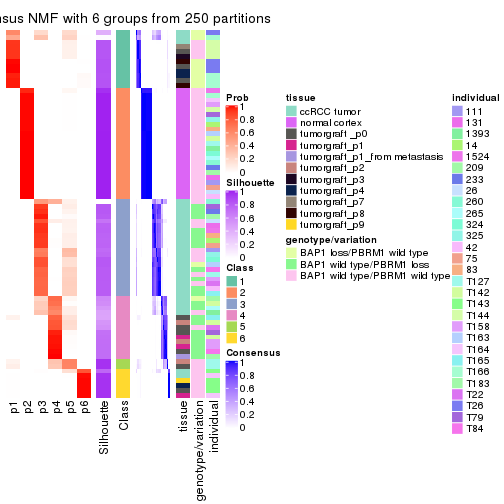</p>

</div>
</div>

Heatmaps for the membership of samples in all partitions to see how consistent they are:


<script>
$( function() {
	$( '#tabs-CV-NMF-membership-heatmap' ).tabs();
} );
</script>
<div id='tabs-CV-NMF-membership-heatmap'>
<ul>
<li><a href='#tab-CV-NMF-membership-heatmap-1'>k = 2</a></li>
<li><a href='#tab-CV-NMF-membership-heatmap-2'>k = 3</a></li>
<li><a href='#tab-CV-NMF-membership-heatmap-3'>k = 4</a></li>
<li><a href='#tab-CV-NMF-membership-heatmap-4'>k = 5</a></li>
<li><a href='#tab-CV-NMF-membership-heatmap-5'>k = 6</a></li>
</ul>
<div id='tab-CV-NMF-membership-heatmap-1'>
<pre><code class="r">membership_heatmap(res, k = 2)
</code></pre>

<p></p>

</div>
<div id='tab-CV-NMF-membership-heatmap-2'>
<pre><code class="r">membership_heatmap(res, k = 3)
</code></pre>

<p></p>

</div>
<div id='tab-CV-NMF-membership-heatmap-3'>
<pre><code class="r">membership_heatmap(res, k = 4)
</code></pre>

<p></p>

</div>
<div id='tab-CV-NMF-membership-heatmap-4'>
<pre><code class="r">membership_heatmap(res, k = 5)
</code></pre>

<p></p>

</div>
<div id='tab-CV-NMF-membership-heatmap-5'>
<pre><code class="r">membership_heatmap(res, k = 6)
</code></pre>

<p>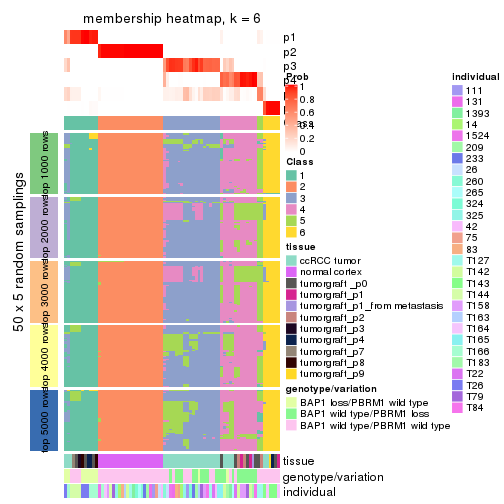</p>

</div>
</div>

As soon as we have had the classes for columns, we can look for signatures
which are significantly different between classes which can be candidate marks
for certain classes. Following are the heatmaps for signatures.


Signature heatmaps where rows are scaled:


<script>
$( function() {
	$( '#tabs-CV-NMF-get-signatures' ).tabs();
} );
</script>
<div id='tabs-CV-NMF-get-signatures'>
<ul>
<li><a href='#tab-CV-NMF-get-signatures-1'>k = 2</a></li>
<li><a href='#tab-CV-NMF-get-signatures-2'>k = 3</a></li>
<li><a href='#tab-CV-NMF-get-signatures-3'>k = 4</a></li>
<li><a href='#tab-CV-NMF-get-signatures-4'>k = 5</a></li>
<li><a href='#tab-CV-NMF-get-signatures-5'>k = 6</a></li>
</ul>
<div id='tab-CV-NMF-get-signatures-1'>
<pre><code class="r">get_signatures(res, k = 2)
</code></pre>

<p></p>

</div>
<div id='tab-CV-NMF-get-signatures-2'>
<pre><code class="r">get_signatures(res, k = 3)
</code></pre>

<p></p>

</div>
<div id='tab-CV-NMF-get-signatures-3'>
<pre><code class="r">get_signatures(res, k = 4)
</code></pre>

<p></p>

</div>
<div id='tab-CV-NMF-get-signatures-4'>
<pre><code class="r">get_signatures(res, k = 5)
</code></pre>

<p></p>

</div>
<div id='tab-CV-NMF-get-signatures-5'>
<pre><code class="r">get_signatures(res, k = 6)
</code></pre>

<p></p>

</div>
</div>


Signature heatmaps where rows are not scaled:


<script>
$( function() {
	$( '#tabs-CV-NMF-get-signatures-no-scale' ).tabs();
} );
</script>
<div id='tabs-CV-NMF-get-signatures-no-scale'>
<ul>
<li><a href='#tab-CV-NMF-get-signatures-no-scale-1'>k = 2</a></li>
<li><a href='#tab-CV-NMF-get-signatures-no-scale-2'>k = 3</a></li>
<li><a href='#tab-CV-NMF-get-signatures-no-scale-3'>k = 4</a></li>
<li><a href='#tab-CV-NMF-get-signatures-no-scale-4'>k = 5</a></li>
<li><a href='#tab-CV-NMF-get-signatures-no-scale-5'>k = 6</a></li>
</ul>
<div id='tab-CV-NMF-get-signatures-no-scale-1'>
<pre><code class="r">get_signatures(res, k = 2, scale_rows = FALSE)
</code></pre>

<p></p>

</div>
<div id='tab-CV-NMF-get-signatures-no-scale-2'>
<pre><code class="r">get_signatures(res, k = 3, scale_rows = FALSE)
</code></pre>

<p>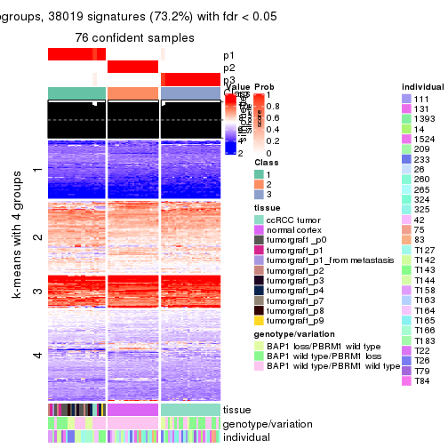</p>

</div>
<div id='tab-CV-NMF-get-signatures-no-scale-3'>
<pre><code class="r">get_signatures(res, k = 4, scale_rows = FALSE)
</code></pre>

<p></p>

</div>
<div id='tab-CV-NMF-get-signatures-no-scale-4'>
<pre><code class="r">get_signatures(res, k = 5, scale_rows = FALSE)
</code></pre>

<p></p>

</div>
<div id='tab-CV-NMF-get-signatures-no-scale-5'>
<pre><code class="r">get_signatures(res, k = 6, scale_rows = FALSE)
</code></pre>

<p></p>

</div>
</div>


Compare the overlap of signatures from different k:

```r
compare_signatures(res)
```


`get_signature()` returns a data frame invisibly. TO get the list of signatures, the function
call should be assigned to a variable explicitly. In following code, if `plot` argument is set
to `FALSE`, no heatmap is plotted while only the differential analysis is performed.

```r
# code only for demonstration
tb = get_signature(res, k = ..., plot = FALSE)
```

An example of the output of `tb` is:

```
#>   which_row         fdr    mean_1    mean_2 scaled_mean_1 scaled_mean_2 km
#> 1        38 0.042760348  8.373488  9.131774    -0.5533452     0.5164555  1
#> 2        40 0.018707592  7.106213  8.469186    -0.6173731     0.5762149  1
#> 3        55 0.019134737 10.221463 11.207825    -0.6159697     0.5749050  1
#> 4        59 0.006059896  5.921854  7.869574    -0.6899429     0.6439467  1
#> 5        60 0.018055526  8.928898 10.211722    -0.6204761     0.5791110  1
#> 6        98 0.009384629 15.714769 14.887706     0.6635654    -0.6193277  2
...
```

The columns in `tb` are:

1. `which_row`: row indices corresponding to the input matrix.
2. `fdr`: FDR for the differential test. 
3. `mean_x`: The mean value in group x.
4. `scaled_mean_x`: The mean value in group x after rows are scaled.
5. `km`: Row groups if k-means clustering is applied to rows.


UMAP plot which shows how samples are separated.


<script>
$( function() {
	$( '#tabs-CV-NMF-dimension-reduction' ).tabs();
} );
</script>
<div id='tabs-CV-NMF-dimension-reduction'>
<ul>
<li><a href='#tab-CV-NMF-dimension-reduction-1'>k = 2</a></li>
<li><a href='#tab-CV-NMF-dimension-reduction-2'>k = 3</a></li>
<li><a href='#tab-CV-NMF-dimension-reduction-3'>k = 4</a></li>
<li><a href='#tab-CV-NMF-dimension-reduction-4'>k = 5</a></li>
<li><a href='#tab-CV-NMF-dimension-reduction-5'>k = 6</a></li>
</ul>
<div id='tab-CV-NMF-dimension-reduction-1'>
<pre><code class="r">dimension_reduction(res, k = 2, method = &quot;UMAP&quot;)
</code></pre>

<p></p>

</div>
<div id='tab-CV-NMF-dimension-reduction-2'>
<pre><code class="r">dimension_reduction(res, k = 3, method = &quot;UMAP&quot;)
</code></pre>

<p></p>

</div>
<div id='tab-CV-NMF-dimension-reduction-3'>
<pre><code class="r">dimension_reduction(res, k = 4, method = &quot;UMAP&quot;)
</code></pre>

<p></p>

</div>
<div id='tab-CV-NMF-dimension-reduction-4'>
<pre><code class="r">dimension_reduction(res, k = 5, method = &quot;UMAP&quot;)
</code></pre>

<p></p>

</div>
<div id='tab-CV-NMF-dimension-reduction-5'>
<pre><code class="r">dimension_reduction(res, k = 6, method = &quot;UMAP&quot;)
</code></pre>

<p></p>

</div>
</div>


Following heatmap shows how subgroups are split when increasing `k`:

```r
collect_classes(res)
```


Test correlation between subgroups and known annotations. If the known
annotation is numeric, one-way ANOVA test is applied, and if the known
annotation is discrete, chi-squared contingency table test is applied.

```r
test_to_known_factors(res)
```

```
#>         n tissue(p) genotype/variation(p) individual(p) k
#> CV:NMF 71  5.52e-07              3.65e-04       0.07133 2
#> CV:NMF 76  2.85e-20              4.94e-05       0.97745 3
#> CV:NMF 75  2.38e-19              2.57e-09       0.35834 4
#> CV:NMF 74  3.99e-16              2.12e-10       0.00344 5
#> CV:NMF 71  2.05e-15              6.30e-11       0.00141 6
```


If matrix rows can be associated to genes, consider to use `functional_enrichment(res,
...)` to perform function enrichment for the signature genes. See [this vignette](http://bioconductor.org/packages/devel/bioc/vignettes/cola/inst/doc/functional_enrichment.html) for more detailed explanations.


 

---------------------------------------------------


### MAD:hclust


The object with results only for a single top-value method and a single partition method 
can be extracted as:

```r
res = res_list["MAD", "hclust"]
# you can also extract it by
# res = res_list["MAD:hclust"]
```

A summary of `res` and all the functions that can be applied to it:

```r
res
```

```
#> A 'ConsensusPartition' object with k = 2, 3, 4, 5, 6.
#>   On a matrix with 51941 rows and 76 columns.
#>   Top rows (1000, 2000, 3000, 4000, 5000) are extracted by 'MAD' method.
#>   Subgroups are detected by 'hclust' method.
#>   Performed in total 1250 partitions by row resampling.
#>   Best k for subgroups seems to be 5.
#> 
#> Following methods can be applied to this 'ConsensusPartition' object:
#>  [1] "cola_report"             "collect_classes"         "collect_plots"          
#>  [4] "collect_stats"           "colnames"                "compare_signatures"     
#>  [7] "consensus_heatmap"       "dimension_reduction"     "functional_enrichment"  
#> [10] "get_anno_col"            "get_anno"                "get_classes"            
#> [13] "get_consensus"           "get_matrix"              "get_membership"         
#> [16] "get_param"               "get_signatures"          "get_stats"              
#> [19] "is_best_k"               "is_stable_k"             "membership_heatmap"     
#> [22] "ncol"                    "nrow"                    "plot_ecdf"              
#> [25] "rownames"                "select_partition_number" "show"                   
#> [28] "suggest_best_k"          "test_to_known_factors"
```

`collect_plots()` function collects all the plots made from `res` for all `k` (number of partitions)
into one single page to provide an easy and fast comparison between different `k`.

```r
collect_plots(res)
```


The plots are:

- The first row: a plot of the ECDF (empirical cumulative distribution
  function) curves of the consensus matrix for each `k` and the heatmap of
  predicted classes for each `k`.
- The second row: heatmaps of the consensus matrix for each `k`.
- The third row: heatmaps of the membership matrix for each `k`.
- The fouth row: heatmaps of the signatures for each `k`.

All the plots in panels can be made by individual functions and they are
plotted later in this section.

`select_partition_number()` produces several plots showing different
statistics for choosing "optimized" `k`. There are following statistics:

- ECDF curves of the consensus matrix for each `k`;
- 1-PAC. [The PAC
  score](https://en.wikipedia.org/wiki/Consensus_clustering#Over-interpretation_potential_of_consensus_clustering)
  measures the proportion of the ambiguous subgrouping.
- Mean silhouette score.
- Concordance. The mean probability of fiting the consensus class ids in all
  partitions.
- Area increased. Denote $A_k$ as the area under the ECDF curve for current
  `k`, the area increased is defined as $A_k - A_{k-1}$.
- Rand index. The percent of pairs of samples that are both in a same cluster
  or both are not in a same cluster in the partition of k and k-1.
- Jaccard index. The ratio of pairs of samples are both in a same cluster in
  the partition of k and k-1 and the pairs of samples are both in a same
  cluster in the partition k or k-1.

The detailed explanations of these statistics can be found in [the _cola_
vignette](http://bioconductor.org/packages/devel/bioc/vignettes/cola/inst/doc/cola.html#toc_13).

Generally speaking, lower PAC score, higher mean silhouette score or higher
concordance corresponds to better partition. Rand index and Jaccard index
measure how similar the current partition is compared to partition with `k-1`.
If they are too similar, we won't accept `k` is better than `k-1`.

```r
select_partition_number(res)
```


The numeric values for all these statistics can be obtained by `get_stats()`.

```r
get_stats(res)
```

```
#>   k 1-PAC mean_silhouette concordance area_increased  Rand Jaccard
#> 2 2 0.534           0.771       0.900         0.4751 0.494   0.494
#> 3 3 0.663           0.658       0.837         0.3440 0.814   0.639
#> 4 4 0.702           0.762       0.845         0.0947 0.793   0.501
#> 5 5 0.848           0.778       0.891         0.0920 0.953   0.829
#> 6 6 0.846           0.683       0.838         0.0434 0.921   0.696
```

`suggest_best_k()` suggests the best $k$ based on these statistics. The rules are as follows:

- All $k$ with Jaccard index larger than 0.95 are removed because increasing
  $k$ does not provide enough extra information. If all $k$ are removed, it is
  marked as no subgroup is detected.
- For all $k$ with 1-PAC score larger than 0.9, the maximal $k$ is taken as
  the best $k$, and other $k$ are marked as optional $k$.
- If it does not fit the second rule. The $k$ with the maximal vote of the
  highest 1-PAC score, highest mean silhouette, and highest concordance is
  taken as the best $k$.

```r
suggest_best_k(res)
```

```
#> [1] 5
```


Following shows the table of the partitions (You need to click the **show/hide
code output** link to see it). The membership matrix (columns with name `p*`)
is inferred by
[`clue::cl_consensus()`](https://www.rdocumentation.org/link/cl_consensus?package=clue)
function with the `SE` method. Basically the value in the membership matrix
represents the probability to belong to a certain group. The finall class
label for an item is determined with the group with highest probability it
belongs to.

In `get_classes()` function, the entropy is calculated from the membership
matrix and the silhouette score is calculated from the consensus matrix.


<script>
$( function() {
	$( '#tabs-MAD-hclust-get-classes' ).tabs();
} );
</script>
<div id='tabs-MAD-hclust-get-classes'>
<ul>
<li><a href='#tab-MAD-hclust-get-classes-1'>k = 2</a></li>
<li><a href='#tab-MAD-hclust-get-classes-2'>k = 3</a></li>
<li><a href='#tab-MAD-hclust-get-classes-3'>k = 4</a></li>
<li><a href='#tab-MAD-hclust-get-classes-4'>k = 5</a></li>
<li><a href='#tab-MAD-hclust-get-classes-5'>k = 6</a></li>
</ul>

<div id='tab-MAD-hclust-get-classes-1'>
<p><a id='tab-MAD-hclust-get-classes-1-a' style='color:#0366d6' href='#'>show/hide code output</a></p>
<pre><code class="r">cbind(get_classes(res, k = 2), get_membership(res, k = 2))
</code></pre>

<pre><code>#&gt;           class entropy silhouette    p1    p2
#&gt; GSM905004     2   0.871      0.646 0.292 0.708
#&gt; GSM905024     1   0.456      0.789 0.904 0.096
#&gt; GSM905038     1   0.999      0.102 0.516 0.484
#&gt; GSM905043     1   0.456      0.789 0.904 0.096
#&gt; GSM904986     2   0.634      0.840 0.160 0.840
#&gt; GSM904991     1   0.994      0.202 0.544 0.456
#&gt; GSM904994     2   0.634      0.840 0.160 0.840
#&gt; GSM904996     2   0.634      0.840 0.160 0.840
#&gt; GSM905007     1   0.994      0.202 0.544 0.456
#&gt; GSM905012     2   0.634      0.840 0.160 0.840
#&gt; GSM905022     2   0.714      0.798 0.196 0.804
#&gt; GSM905026     2   0.634      0.840 0.160 0.840
#&gt; GSM905027     2   0.714      0.798 0.196 0.804
#&gt; GSM905031     2   0.634      0.840 0.160 0.840
#&gt; GSM905036     1   0.997      0.162 0.532 0.468
#&gt; GSM905041     1   0.990      0.246 0.560 0.440
#&gt; GSM905044     2   0.634      0.840 0.160 0.840
#&gt; GSM904989     2   0.634      0.840 0.160 0.840
#&gt; GSM904999     2   0.871      0.633 0.292 0.708
#&gt; GSM905002     2   0.634      0.840 0.160 0.840
#&gt; GSM905009     2   0.634      0.840 0.160 0.840
#&gt; GSM905014     1   0.994      0.202 0.544 0.456
#&gt; GSM905017     2   0.871      0.633 0.292 0.708
#&gt; GSM905020     2   0.634      0.840 0.160 0.840
#&gt; GSM905023     1   0.997      0.162 0.532 0.468
#&gt; GSM905029     1   0.999      0.102 0.516 0.484
#&gt; GSM905032     1   0.980      0.306 0.584 0.416
#&gt; GSM905034     1   0.456      0.789 0.904 0.096
#&gt; GSM905040     1   0.358      0.809 0.932 0.068
#&gt; GSM904985     2   0.000      0.897 0.000 1.000
#&gt; GSM904988     2   0.000      0.897 0.000 1.000
#&gt; GSM904990     2   0.000      0.897 0.000 1.000
#&gt; GSM904992     2   0.000      0.897 0.000 1.000
#&gt; GSM904995     2   0.000      0.897 0.000 1.000
#&gt; GSM904998     2   0.000      0.897 0.000 1.000
#&gt; GSM905000     2   0.000      0.897 0.000 1.000
#&gt; GSM905003     2   0.000      0.897 0.000 1.000
#&gt; GSM905006     2   0.000      0.897 0.000 1.000
#&gt; GSM905008     2   0.000      0.897 0.000 1.000
#&gt; GSM905011     2   0.000      0.897 0.000 1.000
#&gt; GSM905013     2   0.000      0.897 0.000 1.000
#&gt; GSM905016     2   0.000      0.897 0.000 1.000
#&gt; GSM905018     2   0.000      0.897 0.000 1.000
#&gt; GSM905021     2   0.430      0.870 0.088 0.912
#&gt; GSM905025     2   0.000      0.897 0.000 1.000
#&gt; GSM905028     2   0.000      0.897 0.000 1.000
#&gt; GSM905030     2   0.000      0.897 0.000 1.000
#&gt; GSM905033     2   0.000      0.897 0.000 1.000
#&gt; GSM905035     2   0.000      0.897 0.000 1.000
#&gt; GSM905037     2   0.000      0.897 0.000 1.000
#&gt; GSM905039     2   0.000      0.897 0.000 1.000
#&gt; GSM905042     2   0.000      0.897 0.000 1.000
#&gt; GSM905046     1   0.000      0.850 1.000 0.000
#&gt; GSM905065     1   0.000      0.850 1.000 0.000
#&gt; GSM905049     1   0.000      0.850 1.000 0.000
#&gt; GSM905050     1   0.000      0.850 1.000 0.000
#&gt; GSM905064     1   0.000      0.850 1.000 0.000
#&gt; GSM905045     1   0.000      0.850 1.000 0.000
#&gt; GSM905051     1   0.000      0.850 1.000 0.000
#&gt; GSM905055     1   0.000      0.850 1.000 0.000
#&gt; GSM905058     1   0.000      0.850 1.000 0.000
#&gt; GSM905053     1   0.000      0.850 1.000 0.000
#&gt; GSM905061     1   0.000      0.850 1.000 0.000
#&gt; GSM905063     1   0.000      0.850 1.000 0.000
#&gt; GSM905054     1   0.000      0.850 1.000 0.000
#&gt; GSM905062     1   0.000      0.850 1.000 0.000
#&gt; GSM905052     1   0.000      0.850 1.000 0.000
#&gt; GSM905059     1   0.000      0.850 1.000 0.000
#&gt; GSM905047     1   0.000      0.850 1.000 0.000
#&gt; GSM905066     1   0.000      0.850 1.000 0.000
#&gt; GSM905056     1   0.000      0.850 1.000 0.000
#&gt; GSM905060     1   0.000      0.850 1.000 0.000
#&gt; GSM905048     1   0.000      0.850 1.000 0.000
#&gt; GSM905067     1   0.000      0.850 1.000 0.000
#&gt; GSM905057     1   0.000      0.850 1.000 0.000
#&gt; GSM905068     1   0.000      0.850 1.000 0.000
</code></pre>

<script>
$('#tab-MAD-hclust-get-classes-1-a').parent().next().next().hide();
$('#tab-MAD-hclust-get-classes-1-a').click(function(){
  $('#tab-MAD-hclust-get-classes-1-a').parent().next().next().toggle();
  return(false);
});
</script>
</div>

<div id='tab-MAD-hclust-get-classes-2'>
<p><a id='tab-MAD-hclust-get-classes-2-a' style='color:#0366d6' href='#'>show/hide code output</a></p>
<pre><code class="r">cbind(get_classes(res, k = 3), get_membership(res, k = 3))
</code></pre>

<pre><code>#&gt;           class entropy silhouette    p1    p2    p3
#&gt; GSM905004     3  0.7969     0.1935 0.064 0.396 0.540
#&gt; GSM905024     3  0.5431     0.3285 0.284 0.000 0.716
#&gt; GSM905038     3  0.3715     0.7147 0.004 0.128 0.868
#&gt; GSM905043     3  0.5431     0.3285 0.284 0.000 0.716
#&gt; GSM904986     2  0.6299     0.1334 0.000 0.524 0.476
#&gt; GSM904991     3  0.3375     0.7260 0.008 0.100 0.892
#&gt; GSM904994     2  0.6299     0.1334 0.000 0.524 0.476
#&gt; GSM904996     2  0.6299     0.1334 0.000 0.524 0.476
#&gt; GSM905007     3  0.3375     0.7260 0.008 0.100 0.892
#&gt; GSM905012     2  0.6299     0.1334 0.000 0.524 0.476
#&gt; GSM905022     3  0.6280     0.0582 0.000 0.460 0.540
#&gt; GSM905026     2  0.6299     0.1334 0.000 0.524 0.476
#&gt; GSM905027     3  0.6280     0.0582 0.000 0.460 0.540
#&gt; GSM905031     2  0.6299     0.1334 0.000 0.524 0.476
#&gt; GSM905036     3  0.3607     0.7243 0.008 0.112 0.880
#&gt; GSM905041     3  0.3502     0.7202 0.020 0.084 0.896
#&gt; GSM905044     2  0.6299     0.1334 0.000 0.524 0.476
#&gt; GSM904989     2  0.6299     0.1334 0.000 0.524 0.476
#&gt; GSM904999     3  0.5905     0.3940 0.000 0.352 0.648
#&gt; GSM905002     2  0.6299     0.1334 0.000 0.524 0.476
#&gt; GSM905009     2  0.6299     0.1334 0.000 0.524 0.476
#&gt; GSM905014     3  0.3375     0.7260 0.008 0.100 0.892
#&gt; GSM905017     3  0.5905     0.3940 0.000 0.352 0.648
#&gt; GSM905020     2  0.6299     0.1334 0.000 0.524 0.476
#&gt; GSM905023     3  0.3607     0.7243 0.008 0.112 0.880
#&gt; GSM905029     3  0.3715     0.7147 0.004 0.128 0.868
#&gt; GSM905032     3  0.3181     0.7072 0.024 0.064 0.912
#&gt; GSM905034     3  0.5431     0.3285 0.284 0.000 0.716
#&gt; GSM905040     1  0.4399     0.8191 0.812 0.000 0.188
#&gt; GSM904985     2  0.0000     0.7541 0.000 1.000 0.000
#&gt; GSM904988     2  0.0000     0.7541 0.000 1.000 0.000
#&gt; GSM904990     2  0.0000     0.7541 0.000 1.000 0.000
#&gt; GSM904992     2  0.0000     0.7541 0.000 1.000 0.000
#&gt; GSM904995     2  0.0000     0.7541 0.000 1.000 0.000
#&gt; GSM904998     2  0.0000     0.7541 0.000 1.000 0.000
#&gt; GSM905000     2  0.0000     0.7541 0.000 1.000 0.000
#&gt; GSM905003     2  0.0000     0.7541 0.000 1.000 0.000
#&gt; GSM905006     2  0.0000     0.7541 0.000 1.000 0.000
#&gt; GSM905008     2  0.0000     0.7541 0.000 1.000 0.000
#&gt; GSM905011     2  0.0000     0.7541 0.000 1.000 0.000
#&gt; GSM905013     2  0.0000     0.7541 0.000 1.000 0.000
#&gt; GSM905016     2  0.0000     0.7541 0.000 1.000 0.000
#&gt; GSM905018     2  0.0000     0.7541 0.000 1.000 0.000
#&gt; GSM905021     2  0.6126     0.2708 0.000 0.600 0.400
#&gt; GSM905025     2  0.0000     0.7541 0.000 1.000 0.000
#&gt; GSM905028     2  0.0000     0.7541 0.000 1.000 0.000
#&gt; GSM905030     2  0.0000     0.7541 0.000 1.000 0.000
#&gt; GSM905033     2  0.0424     0.7493 0.000 0.992 0.008
#&gt; GSM905035     2  0.0000     0.7541 0.000 1.000 0.000
#&gt; GSM905037     2  0.0000     0.7541 0.000 1.000 0.000
#&gt; GSM905039     2  0.0000     0.7541 0.000 1.000 0.000
#&gt; GSM905042     2  0.0424     0.7493 0.000 0.992 0.008
#&gt; GSM905046     1  0.0000     0.9405 1.000 0.000 0.000
#&gt; GSM905065     1  0.1289     0.9343 0.968 0.000 0.032
#&gt; GSM905049     1  0.2878     0.9227 0.904 0.000 0.096
#&gt; GSM905050     1  0.2878     0.9227 0.904 0.000 0.096
#&gt; GSM905064     1  0.2878     0.9227 0.904 0.000 0.096
#&gt; GSM905045     1  0.2878     0.9227 0.904 0.000 0.096
#&gt; GSM905051     1  0.0000     0.9405 1.000 0.000 0.000
#&gt; GSM905055     1  0.2796     0.9099 0.908 0.000 0.092
#&gt; GSM905058     1  0.0000     0.9405 1.000 0.000 0.000
#&gt; GSM905053     1  0.2878     0.9227 0.904 0.000 0.096
#&gt; GSM905061     1  0.2878     0.9227 0.904 0.000 0.096
#&gt; GSM905063     1  0.2796     0.9099 0.908 0.000 0.092
#&gt; GSM905054     1  0.2878     0.9227 0.904 0.000 0.096
#&gt; GSM905062     1  0.2878     0.9227 0.904 0.000 0.096
#&gt; GSM905052     1  0.0000     0.9405 1.000 0.000 0.000
#&gt; GSM905059     1  0.0000     0.9405 1.000 0.000 0.000
#&gt; GSM905047     1  0.0000     0.9405 1.000 0.000 0.000
#&gt; GSM905066     1  0.1289     0.9343 0.968 0.000 0.032
#&gt; GSM905056     1  0.2796     0.9099 0.908 0.000 0.092
#&gt; GSM905060     1  0.0000     0.9405 1.000 0.000 0.000
#&gt; GSM905048     1  0.0000     0.9405 1.000 0.000 0.000
#&gt; GSM905067     1  0.1289     0.9343 0.968 0.000 0.032
#&gt; GSM905057     1  0.2796     0.9099 0.908 0.000 0.092
#&gt; GSM905068     1  0.2878     0.9227 0.904 0.000 0.096
</code></pre>

<script>
$('#tab-MAD-hclust-get-classes-2-a').parent().next().next().hide();
$('#tab-MAD-hclust-get-classes-2-a').click(function(){
  $('#tab-MAD-hclust-get-classes-2-a').parent().next().next().toggle();
  return(false);
});
</script>
</div>

<div id='tab-MAD-hclust-get-classes-3'>
<p><a id='tab-MAD-hclust-get-classes-3-a' style='color:#0366d6' href='#'>show/hide code output</a></p>
<pre><code class="r">cbind(get_classes(res, k = 4), get_membership(res, k = 4))
</code></pre>

<pre><code>#&gt;           class entropy silhouette    p1    p2    p3    p4
#&gt; GSM905004     3  0.4656      0.576 0.000 0.056 0.784 0.160
#&gt; GSM905024     1  0.7732      0.412 0.392 0.380 0.228 0.000
#&gt; GSM905038     3  0.4872      0.488 0.004 0.356 0.640 0.000
#&gt; GSM905043     1  0.7732      0.412 0.392 0.380 0.228 0.000
#&gt; GSM904986     3  0.1557      0.663 0.000 0.056 0.944 0.000
#&gt; GSM904991     3  0.5428      0.446 0.020 0.380 0.600 0.000
#&gt; GSM904994     3  0.1557      0.663 0.000 0.056 0.944 0.000
#&gt; GSM904996     3  0.1557      0.663 0.000 0.056 0.944 0.000
#&gt; GSM905007     3  0.5428      0.446 0.020 0.380 0.600 0.000
#&gt; GSM905012     3  0.1557      0.663 0.000 0.056 0.944 0.000
#&gt; GSM905022     3  0.0817      0.689 0.000 0.024 0.976 0.000
#&gt; GSM905026     3  0.1557      0.663 0.000 0.056 0.944 0.000
#&gt; GSM905027     3  0.0817      0.689 0.000 0.024 0.976 0.000
#&gt; GSM905031     3  0.1557      0.663 0.000 0.056 0.944 0.000
#&gt; GSM905036     3  0.4936      0.471 0.004 0.372 0.624 0.000
#&gt; GSM905041     3  0.5781      0.423 0.036 0.380 0.584 0.000
#&gt; GSM905044     3  0.1557      0.663 0.000 0.056 0.944 0.000
#&gt; GSM904989     3  0.1557      0.663 0.000 0.056 0.944 0.000
#&gt; GSM904999     3  0.2999      0.667 0.004 0.132 0.864 0.000
#&gt; GSM905002     3  0.1557      0.663 0.000 0.056 0.944 0.000
#&gt; GSM905009     3  0.1557      0.663 0.000 0.056 0.944 0.000
#&gt; GSM905014     3  0.5428      0.446 0.020 0.380 0.600 0.000
#&gt; GSM905017     3  0.2999      0.667 0.004 0.132 0.864 0.000
#&gt; GSM905020     3  0.1557      0.663 0.000 0.056 0.944 0.000
#&gt; GSM905023     3  0.4936      0.471 0.004 0.372 0.624 0.000
#&gt; GSM905029     3  0.4872      0.488 0.004 0.356 0.640 0.000
#&gt; GSM905032     3  0.6337      0.370 0.068 0.380 0.552 0.000
#&gt; GSM905034     1  0.7732      0.412 0.392 0.380 0.228 0.000
#&gt; GSM905040     1  0.2021      0.678 0.936 0.024 0.040 0.000
#&gt; GSM904985     2  0.4790      0.998 0.000 0.620 0.380 0.000
#&gt; GSM904988     2  0.4790      0.998 0.000 0.620 0.380 0.000
#&gt; GSM904990     2  0.4790      0.998 0.000 0.620 0.380 0.000
#&gt; GSM904992     2  0.4790      0.998 0.000 0.620 0.380 0.000
#&gt; GSM904995     2  0.4790      0.998 0.000 0.620 0.380 0.000
#&gt; GSM904998     2  0.4790      0.998 0.000 0.620 0.380 0.000
#&gt; GSM905000     2  0.4790      0.998 0.000 0.620 0.380 0.000
#&gt; GSM905003     2  0.4790      0.998 0.000 0.620 0.380 0.000
#&gt; GSM905006     2  0.4790      0.998 0.000 0.620 0.380 0.000
#&gt; GSM905008     2  0.4790      0.998 0.000 0.620 0.380 0.000
#&gt; GSM905011     2  0.4790      0.998 0.000 0.620 0.380 0.000
#&gt; GSM905013     2  0.4790      0.998 0.000 0.620 0.380 0.000
#&gt; GSM905016     2  0.4790      0.998 0.000 0.620 0.380 0.000
#&gt; GSM905018     2  0.4790      0.998 0.000 0.620 0.380 0.000
#&gt; GSM905021     3  0.3074      0.394 0.000 0.152 0.848 0.000
#&gt; GSM905025     2  0.4790      0.998 0.000 0.620 0.380 0.000
#&gt; GSM905028     2  0.4790      0.998 0.000 0.620 0.380 0.000
#&gt; GSM905030     2  0.4790      0.998 0.000 0.620 0.380 0.000
#&gt; GSM905033     2  0.4830      0.983 0.000 0.608 0.392 0.000
#&gt; GSM905035     2  0.4790      0.998 0.000 0.620 0.380 0.000
#&gt; GSM905037     2  0.4790      0.998 0.000 0.620 0.380 0.000
#&gt; GSM905039     2  0.4790      0.998 0.000 0.620 0.380 0.000
#&gt; GSM905042     2  0.4830      0.983 0.000 0.608 0.392 0.000
#&gt; GSM905046     4  0.3219      0.858 0.164 0.000 0.000 0.836
#&gt; GSM905065     4  0.4855      0.584 0.400 0.000 0.000 0.600
#&gt; GSM905049     4  0.0000      0.861 0.000 0.000 0.000 1.000
#&gt; GSM905050     4  0.0000      0.861 0.000 0.000 0.000 1.000
#&gt; GSM905064     4  0.0000      0.861 0.000 0.000 0.000 1.000
#&gt; GSM905045     4  0.0000      0.861 0.000 0.000 0.000 1.000
#&gt; GSM905051     4  0.2973      0.862 0.144 0.000 0.000 0.856
#&gt; GSM905055     1  0.1022      0.673 0.968 0.000 0.000 0.032
#&gt; GSM905058     4  0.3219      0.858 0.164 0.000 0.000 0.836
#&gt; GSM905053     4  0.0000      0.861 0.000 0.000 0.000 1.000
#&gt; GSM905061     4  0.0000      0.861 0.000 0.000 0.000 1.000
#&gt; GSM905063     1  0.1022      0.673 0.968 0.000 0.000 0.032
#&gt; GSM905054     4  0.0000      0.861 0.000 0.000 0.000 1.000
#&gt; GSM905062     4  0.0000      0.861 0.000 0.000 0.000 1.000
#&gt; GSM905052     4  0.2973      0.862 0.144 0.000 0.000 0.856
#&gt; GSM905059     4  0.3219      0.858 0.164 0.000 0.000 0.836
#&gt; GSM905047     4  0.3219      0.858 0.164 0.000 0.000 0.836
#&gt; GSM905066     4  0.4855      0.584 0.400 0.000 0.000 0.600
#&gt; GSM905056     1  0.1022      0.673 0.968 0.000 0.000 0.032
#&gt; GSM905060     4  0.3219      0.858 0.164 0.000 0.000 0.836
#&gt; GSM905048     4  0.3219      0.858 0.164 0.000 0.000 0.836
#&gt; GSM905067     4  0.4855      0.584 0.400 0.000 0.000 0.600
#&gt; GSM905057     1  0.1022      0.673 0.968 0.000 0.000 0.032
#&gt; GSM905068     4  0.0000      0.861 0.000 0.000 0.000 1.000
</code></pre>

<script>
$('#tab-MAD-hclust-get-classes-3-a').parent().next().next().hide();
$('#tab-MAD-hclust-get-classes-3-a').click(function(){
  $('#tab-MAD-hclust-get-classes-3-a').parent().next().next().toggle();
  return(false);
});
</script>
</div>

<div id='tab-MAD-hclust-get-classes-4'>
<p><a id='tab-MAD-hclust-get-classes-4-a' style='color:#0366d6' href='#'>show/hide code output</a></p>
<pre><code class="r">cbind(get_classes(res, k = 5), get_membership(res, k = 5))
</code></pre>

<pre><code>#&gt;           class entropy silhouette    p1    p2    p3    p4    p5
#&gt; GSM905004     3  0.4547    0.61763 0.112 0.056 0.788 0.044 0.000
#&gt; GSM905024     5  0.0000    0.52593 0.000 0.000 0.000 0.000 1.000
#&gt; GSM905038     3  0.4138   -0.00777 0.000 0.000 0.616 0.000 0.384
#&gt; GSM905043     5  0.0000    0.52593 0.000 0.000 0.000 0.000 1.000
#&gt; GSM904986     3  0.1410    0.77838 0.000 0.060 0.940 0.000 0.000
#&gt; GSM904991     5  0.4249    0.57149 0.000 0.000 0.432 0.000 0.568
#&gt; GSM904994     3  0.1410    0.77838 0.000 0.060 0.940 0.000 0.000
#&gt; GSM904996     3  0.1410    0.77838 0.000 0.060 0.940 0.000 0.000
#&gt; GSM905007     5  0.4249    0.57149 0.000 0.000 0.432 0.000 0.568
#&gt; GSM905012     3  0.1410    0.77838 0.000 0.060 0.940 0.000 0.000
#&gt; GSM905022     3  0.0865    0.72156 0.000 0.004 0.972 0.000 0.024
#&gt; GSM905026     3  0.1571    0.77721 0.000 0.060 0.936 0.000 0.004
#&gt; GSM905027     3  0.0955    0.72077 0.000 0.004 0.968 0.000 0.028
#&gt; GSM905031     3  0.1571    0.77721 0.000 0.060 0.936 0.000 0.004
#&gt; GSM905036     3  0.4235   -0.16342 0.000 0.000 0.576 0.000 0.424
#&gt; GSM905041     5  0.4171    0.60293 0.000 0.000 0.396 0.000 0.604
#&gt; GSM905044     3  0.1571    0.77721 0.000 0.060 0.936 0.000 0.004
#&gt; GSM904989     3  0.1410    0.77838 0.000 0.060 0.940 0.000 0.000
#&gt; GSM904999     3  0.3491    0.47742 0.000 0.004 0.768 0.000 0.228
#&gt; GSM905002     3  0.1410    0.77838 0.000 0.060 0.940 0.000 0.000
#&gt; GSM905009     3  0.1410    0.77838 0.000 0.060 0.940 0.000 0.000
#&gt; GSM905014     5  0.4249    0.57149 0.000 0.000 0.432 0.000 0.568
#&gt; GSM905017     3  0.3491    0.47742 0.000 0.004 0.768 0.000 0.228
#&gt; GSM905020     3  0.1410    0.77838 0.000 0.060 0.940 0.000 0.000
#&gt; GSM905023     3  0.4235   -0.16342 0.000 0.000 0.576 0.000 0.424
#&gt; GSM905029     3  0.4138   -0.00777 0.000 0.000 0.616 0.000 0.384
#&gt; GSM905032     5  0.4060    0.61915 0.000 0.000 0.360 0.000 0.640
#&gt; GSM905034     5  0.0000    0.52593 0.000 0.000 0.000 0.000 1.000
#&gt; GSM905040     1  0.4541    0.86806 0.752 0.000 0.000 0.112 0.136
#&gt; GSM904985     2  0.0000    0.99809 0.000 1.000 0.000 0.000 0.000
#&gt; GSM904988     2  0.0000    0.99809 0.000 1.000 0.000 0.000 0.000
#&gt; GSM904990     2  0.0000    0.99809 0.000 1.000 0.000 0.000 0.000
#&gt; GSM904992     2  0.0000    0.99809 0.000 1.000 0.000 0.000 0.000
#&gt; GSM904995     2  0.0000    0.99809 0.000 1.000 0.000 0.000 0.000
#&gt; GSM904998     2  0.0000    0.99809 0.000 1.000 0.000 0.000 0.000
#&gt; GSM905000     2  0.0000    0.99809 0.000 1.000 0.000 0.000 0.000
#&gt; GSM905003     2  0.0000    0.99809 0.000 1.000 0.000 0.000 0.000
#&gt; GSM905006     2  0.0000    0.99809 0.000 1.000 0.000 0.000 0.000
#&gt; GSM905008     2  0.0000    0.99809 0.000 1.000 0.000 0.000 0.000
#&gt; GSM905011     2  0.0000    0.99809 0.000 1.000 0.000 0.000 0.000
#&gt; GSM905013     2  0.0000    0.99809 0.000 1.000 0.000 0.000 0.000
#&gt; GSM905016     2  0.0000    0.99809 0.000 1.000 0.000 0.000 0.000
#&gt; GSM905018     2  0.0000    0.99809 0.000 1.000 0.000 0.000 0.000
#&gt; GSM905021     3  0.3752    0.40264 0.000 0.292 0.708 0.000 0.000
#&gt; GSM905025     2  0.0000    0.99809 0.000 1.000 0.000 0.000 0.000
#&gt; GSM905028     2  0.0000    0.99809 0.000 1.000 0.000 0.000 0.000
#&gt; GSM905030     2  0.0000    0.99809 0.000 1.000 0.000 0.000 0.000
#&gt; GSM905033     2  0.0510    0.98073 0.000 0.984 0.016 0.000 0.000
#&gt; GSM905035     2  0.0000    0.99809 0.000 1.000 0.000 0.000 0.000
#&gt; GSM905037     2  0.0000    0.99809 0.000 1.000 0.000 0.000 0.000
#&gt; GSM905039     2  0.0000    0.99809 0.000 1.000 0.000 0.000 0.000
#&gt; GSM905042     2  0.0510    0.98073 0.000 0.984 0.016 0.000 0.000
#&gt; GSM905046     4  0.0798    0.84620 0.008 0.000 0.000 0.976 0.016
#&gt; GSM905065     4  0.4054    0.62467 0.020 0.000 0.000 0.732 0.248
#&gt; GSM905049     4  0.2848    0.85262 0.156 0.000 0.004 0.840 0.000
#&gt; GSM905050     4  0.2848    0.85262 0.156 0.000 0.004 0.840 0.000
#&gt; GSM905064     4  0.2848    0.85262 0.156 0.000 0.004 0.840 0.000
#&gt; GSM905045     4  0.2848    0.85262 0.156 0.000 0.004 0.840 0.000
#&gt; GSM905051     4  0.0162    0.84911 0.000 0.000 0.000 0.996 0.004
#&gt; GSM905055     1  0.2690    0.96979 0.844 0.000 0.000 0.156 0.000
#&gt; GSM905058     4  0.0798    0.84620 0.008 0.000 0.000 0.976 0.016
#&gt; GSM905053     4  0.2848    0.85262 0.156 0.000 0.004 0.840 0.000
#&gt; GSM905061     4  0.2848    0.85262 0.156 0.000 0.004 0.840 0.000
#&gt; GSM905063     1  0.2690    0.96979 0.844 0.000 0.000 0.156 0.000
#&gt; GSM905054     4  0.2848    0.85262 0.156 0.000 0.004 0.840 0.000
#&gt; GSM905062     4  0.2848    0.85262 0.156 0.000 0.004 0.840 0.000
#&gt; GSM905052     4  0.0162    0.84911 0.000 0.000 0.000 0.996 0.004
#&gt; GSM905059     4  0.0798    0.84620 0.008 0.000 0.000 0.976 0.016
#&gt; GSM905047     4  0.0798    0.84620 0.008 0.000 0.000 0.976 0.016
#&gt; GSM905066     4  0.4054    0.62467 0.020 0.000 0.000 0.732 0.248
#&gt; GSM905056     1  0.2690    0.96979 0.844 0.000 0.000 0.156 0.000
#&gt; GSM905060     4  0.0798    0.84620 0.008 0.000 0.000 0.976 0.016
#&gt; GSM905048     4  0.0798    0.84620 0.008 0.000 0.000 0.976 0.016
#&gt; GSM905067     4  0.4054    0.62467 0.020 0.000 0.000 0.732 0.248
#&gt; GSM905057     1  0.2690    0.96979 0.844 0.000 0.000 0.156 0.000
#&gt; GSM905068     4  0.2848    0.85262 0.156 0.000 0.004 0.840 0.000
</code></pre>

<script>
$('#tab-MAD-hclust-get-classes-4-a').parent().next().next().hide();
$('#tab-MAD-hclust-get-classes-4-a').click(function(){
  $('#tab-MAD-hclust-get-classes-4-a').parent().next().next().toggle();
  return(false);
});
</script>
</div>

<div id='tab-MAD-hclust-get-classes-5'>
<p><a id='tab-MAD-hclust-get-classes-5-a' style='color:#0366d6' href='#'>show/hide code output</a></p>
<pre><code class="r">cbind(get_classes(res, k = 6), get_membership(res, k = 6))
</code></pre>

<pre><code>#&gt;           class entropy silhouette    p1    p2    p3    p4    p5    p6
#&gt; GSM905004     3  0.2454     0.6611 0.000 0.000 0.840 0.160 0.000 0.000
#&gt; GSM905024     5  0.3499     0.3995 0.320 0.000 0.000 0.000 0.680 0.000
#&gt; GSM905038     5  0.3647     0.4672 0.000 0.000 0.360 0.000 0.640 0.000
#&gt; GSM905043     5  0.3499     0.3995 0.320 0.000 0.000 0.000 0.680 0.000
#&gt; GSM904986     3  0.0000     0.8656 0.000 0.000 1.000 0.000 0.000 0.000
#&gt; GSM904991     5  0.3647     0.5390 0.000 0.000 0.360 0.000 0.640 0.000
#&gt; GSM904994     3  0.0000     0.8656 0.000 0.000 1.000 0.000 0.000 0.000
#&gt; GSM904996     3  0.0000     0.8656 0.000 0.000 1.000 0.000 0.000 0.000
#&gt; GSM905007     5  0.3647     0.5390 0.000 0.000 0.360 0.000 0.640 0.000
#&gt; GSM905012     3  0.0000     0.8656 0.000 0.000 1.000 0.000 0.000 0.000
#&gt; GSM905022     3  0.1714     0.7746 0.000 0.000 0.908 0.000 0.092 0.000
#&gt; GSM905026     3  0.2730     0.7119 0.000 0.000 0.808 0.000 0.192 0.000
#&gt; GSM905027     3  0.3330     0.5699 0.000 0.000 0.716 0.000 0.284 0.000
#&gt; GSM905031     3  0.2730     0.7119 0.000 0.000 0.808 0.000 0.192 0.000
#&gt; GSM905036     5  0.3499     0.5223 0.000 0.000 0.320 0.000 0.680 0.000
#&gt; GSM905041     5  0.2402     0.6195 0.004 0.000 0.140 0.000 0.856 0.000
#&gt; GSM905044     3  0.2730     0.7119 0.000 0.000 0.808 0.000 0.192 0.000
#&gt; GSM904989     3  0.0000     0.8656 0.000 0.000 1.000 0.000 0.000 0.000
#&gt; GSM904999     5  0.6028     0.3024 0.316 0.000 0.264 0.000 0.420 0.000
#&gt; GSM905002     3  0.0000     0.8656 0.000 0.000 1.000 0.000 0.000 0.000
#&gt; GSM905009     3  0.0000     0.8656 0.000 0.000 1.000 0.000 0.000 0.000
#&gt; GSM905014     5  0.3647     0.5390 0.000 0.000 0.360 0.000 0.640 0.000
#&gt; GSM905017     5  0.6028     0.3024 0.316 0.000 0.264 0.000 0.420 0.000
#&gt; GSM905020     3  0.0000     0.8656 0.000 0.000 1.000 0.000 0.000 0.000
#&gt; GSM905023     5  0.3499     0.5223 0.000 0.000 0.320 0.000 0.680 0.000
#&gt; GSM905029     5  0.3647     0.4672 0.000 0.000 0.360 0.000 0.640 0.000
#&gt; GSM905032     5  0.2263     0.6207 0.016 0.000 0.100 0.000 0.884 0.000
#&gt; GSM905034     5  0.3499     0.3995 0.320 0.000 0.000 0.000 0.680 0.000
#&gt; GSM905040     6  0.2744     0.8711 0.064 0.000 0.000 0.000 0.072 0.864
#&gt; GSM904985     2  0.0000     0.9651 0.000 1.000 0.000 0.000 0.000 0.000
#&gt; GSM904988     2  0.0000     0.9651 0.000 1.000 0.000 0.000 0.000 0.000
#&gt; GSM904990     2  0.0000     0.9651 0.000 1.000 0.000 0.000 0.000 0.000
#&gt; GSM904992     2  0.0000     0.9651 0.000 1.000 0.000 0.000 0.000 0.000
#&gt; GSM904995     2  0.0000     0.9651 0.000 1.000 0.000 0.000 0.000 0.000
#&gt; GSM904998     2  0.0000     0.9651 0.000 1.000 0.000 0.000 0.000 0.000
#&gt; GSM905000     2  0.0000     0.9651 0.000 1.000 0.000 0.000 0.000 0.000
#&gt; GSM905003     2  0.0000     0.9651 0.000 1.000 0.000 0.000 0.000 0.000
#&gt; GSM905006     2  0.0000     0.9651 0.000 1.000 0.000 0.000 0.000 0.000
#&gt; GSM905008     2  0.0000     0.9651 0.000 1.000 0.000 0.000 0.000 0.000
#&gt; GSM905011     2  0.0000     0.9651 0.000 1.000 0.000 0.000 0.000 0.000
#&gt; GSM905013     2  0.0000     0.9651 0.000 1.000 0.000 0.000 0.000 0.000
#&gt; GSM905016     2  0.0000     0.9651 0.000 1.000 0.000 0.000 0.000 0.000
#&gt; GSM905018     2  0.0000     0.9651 0.000 1.000 0.000 0.000 0.000 0.000
#&gt; GSM905021     2  0.7704    -0.3561 0.244 0.288 0.212 0.000 0.256 0.000
#&gt; GSM905025     2  0.0000     0.9651 0.000 1.000 0.000 0.000 0.000 0.000
#&gt; GSM905028     2  0.0000     0.9651 0.000 1.000 0.000 0.000 0.000 0.000
#&gt; GSM905030     2  0.0000     0.9651 0.000 1.000 0.000 0.000 0.000 0.000
#&gt; GSM905033     2  0.0458     0.9524 0.016 0.984 0.000 0.000 0.000 0.000
#&gt; GSM905035     2  0.0000     0.9651 0.000 1.000 0.000 0.000 0.000 0.000
#&gt; GSM905037     2  0.0000     0.9651 0.000 1.000 0.000 0.000 0.000 0.000
#&gt; GSM905039     2  0.0000     0.9651 0.000 1.000 0.000 0.000 0.000 0.000
#&gt; GSM905042     2  0.0458     0.9524 0.016 0.984 0.000 0.000 0.000 0.000
#&gt; GSM905046     4  0.4524     0.0199 0.376 0.000 0.000 0.584 0.000 0.040
#&gt; GSM905065     1  0.6025     1.0000 0.452 0.000 0.000 0.416 0.080 0.052
#&gt; GSM905049     4  0.0000     0.5859 0.000 0.000 0.000 1.000 0.000 0.000
#&gt; GSM905050     4  0.0000     0.5859 0.000 0.000 0.000 1.000 0.000 0.000
#&gt; GSM905064     4  0.0000     0.5859 0.000 0.000 0.000 1.000 0.000 0.000
#&gt; GSM905045     4  0.0000     0.5859 0.000 0.000 0.000 1.000 0.000 0.000
#&gt; GSM905051     4  0.4371     0.1044 0.344 0.000 0.000 0.620 0.000 0.036
#&gt; GSM905055     6  0.0000     0.9699 0.000 0.000 0.000 0.000 0.000 1.000
#&gt; GSM905058     4  0.4524     0.0199 0.376 0.000 0.000 0.584 0.000 0.040
#&gt; GSM905053     4  0.0000     0.5859 0.000 0.000 0.000 1.000 0.000 0.000
#&gt; GSM905061     4  0.0000     0.5859 0.000 0.000 0.000 1.000 0.000 0.000
#&gt; GSM905063     6  0.0000     0.9699 0.000 0.000 0.000 0.000 0.000 1.000
#&gt; GSM905054     4  0.0000     0.5859 0.000 0.000 0.000 1.000 0.000 0.000
#&gt; GSM905062     4  0.0000     0.5859 0.000 0.000 0.000 1.000 0.000 0.000
#&gt; GSM905052     4  0.4371     0.1044 0.344 0.000 0.000 0.620 0.000 0.036
#&gt; GSM905059     4  0.4524     0.0199 0.376 0.000 0.000 0.584 0.000 0.040
#&gt; GSM905047     4  0.4524     0.0199 0.376 0.000 0.000 0.584 0.000 0.040
#&gt; GSM905066     1  0.6025     1.0000 0.452 0.000 0.000 0.416 0.080 0.052
#&gt; GSM905056     6  0.0000     0.9699 0.000 0.000 0.000 0.000 0.000 1.000
#&gt; GSM905060     4  0.4524     0.0199 0.376 0.000 0.000 0.584 0.000 0.040
#&gt; GSM905048     4  0.4524     0.0199 0.376 0.000 0.000 0.584 0.000 0.040
#&gt; GSM905067     1  0.6025     1.0000 0.452 0.000 0.000 0.416 0.080 0.052
#&gt; GSM905057     6  0.0000     0.9699 0.000 0.000 0.000 0.000 0.000 1.000
#&gt; GSM905068     4  0.0000     0.5859 0.000 0.000 0.000 1.000 0.000 0.000
</code></pre>

<script>
$('#tab-MAD-hclust-get-classes-5-a').parent().next().next().hide();
$('#tab-MAD-hclust-get-classes-5-a').click(function(){
  $('#tab-MAD-hclust-get-classes-5-a').parent().next().next().toggle();
  return(false);
});
</script>
</div>
</div>

Heatmaps for the consensus matrix. It visualizes the probability of two
samples to be in a same group.


<script>
$( function() {
	$( '#tabs-MAD-hclust-consensus-heatmap' ).tabs();
} );
</script>
<div id='tabs-MAD-hclust-consensus-heatmap'>
<ul>
<li><a href='#tab-MAD-hclust-consensus-heatmap-1'>k = 2</a></li>
<li><a href='#tab-MAD-hclust-consensus-heatmap-2'>k = 3</a></li>
<li><a href='#tab-MAD-hclust-consensus-heatmap-3'>k = 4</a></li>
<li><a href='#tab-MAD-hclust-consensus-heatmap-4'>k = 5</a></li>
<li><a href='#tab-MAD-hclust-consensus-heatmap-5'>k = 6</a></li>
</ul>
<div id='tab-MAD-hclust-consensus-heatmap-1'>
<pre><code class="r">consensus_heatmap(res, k = 2)
</code></pre>

<p></p>

</div>
<div id='tab-MAD-hclust-consensus-heatmap-2'>
<pre><code class="r">consensus_heatmap(res, k = 3)
</code></pre>

<p></p>

</div>
<div id='tab-MAD-hclust-consensus-heatmap-3'>
<pre><code class="r">consensus_heatmap(res, k = 4)
</code></pre>

<p></p>

</div>
<div id='tab-MAD-hclust-consensus-heatmap-4'>
<pre><code class="r">consensus_heatmap(res, k = 5)
</code></pre>

<p></p>

</div>
<div id='tab-MAD-hclust-consensus-heatmap-5'>
<pre><code class="r">consensus_heatmap(res, k = 6)
</code></pre>

<p></p>

</div>
</div>

Heatmaps for the membership of samples in all partitions to see how consistent they are:


<script>
$( function() {
	$( '#tabs-MAD-hclust-membership-heatmap' ).tabs();
} );
</script>
<div id='tabs-MAD-hclust-membership-heatmap'>
<ul>
<li><a href='#tab-MAD-hclust-membership-heatmap-1'>k = 2</a></li>
<li><a href='#tab-MAD-hclust-membership-heatmap-2'>k = 3</a></li>
<li><a href='#tab-MAD-hclust-membership-heatmap-3'>k = 4</a></li>
<li><a href='#tab-MAD-hclust-membership-heatmap-4'>k = 5</a></li>
<li><a href='#tab-MAD-hclust-membership-heatmap-5'>k = 6</a></li>
</ul>
<div id='tab-MAD-hclust-membership-heatmap-1'>
<pre><code class="r">membership_heatmap(res, k = 2)
</code></pre>

<p></p>

</div>
<div id='tab-MAD-hclust-membership-heatmap-2'>
<pre><code class="r">membership_heatmap(res, k = 3)
</code></pre>

<p></p>

</div>
<div id='tab-MAD-hclust-membership-heatmap-3'>
<pre><code class="r">membership_heatmap(res, k = 4)
</code></pre>

<p></p>

</div>
<div id='tab-MAD-hclust-membership-heatmap-4'>
<pre><code class="r">membership_heatmap(res, k = 5)
</code></pre>

<p></p>

</div>
<div id='tab-MAD-hclust-membership-heatmap-5'>
<pre><code class="r">membership_heatmap(res, k = 6)
</code></pre>

<p></p>

</div>
</div>

As soon as we have had the classes for columns, we can look for signatures
which are significantly different between classes which can be candidate marks
for certain classes. Following are the heatmaps for signatures.


Signature heatmaps where rows are scaled:


<script>
$( function() {
	$( '#tabs-MAD-hclust-get-signatures' ).tabs();
} );
</script>
<div id='tabs-MAD-hclust-get-signatures'>
<ul>
<li><a href='#tab-MAD-hclust-get-signatures-1'>k = 2</a></li>
<li><a href='#tab-MAD-hclust-get-signatures-2'>k = 3</a></li>
<li><a href='#tab-MAD-hclust-get-signatures-3'>k = 4</a></li>
<li><a href='#tab-MAD-hclust-get-signatures-4'>k = 5</a></li>
<li><a href='#tab-MAD-hclust-get-signatures-5'>k = 6</a></li>
</ul>
<div id='tab-MAD-hclust-get-signatures-1'>
<pre><code class="r">get_signatures(res, k = 2)
</code></pre>

<p></p>

</div>
<div id='tab-MAD-hclust-get-signatures-2'>
<pre><code class="r">get_signatures(res, k = 3)
</code></pre>

<p></p>

</div>
<div id='tab-MAD-hclust-get-signatures-3'>
<pre><code class="r">get_signatures(res, k = 4)
</code></pre>

<p></p>

</div>
<div id='tab-MAD-hclust-get-signatures-4'>
<pre><code class="r">get_signatures(res, k = 5)
</code></pre>

<p></p>

</div>
<div id='tab-MAD-hclust-get-signatures-5'>
<pre><code class="r">get_signatures(res, k = 6)
</code></pre>

<p></p>

</div>
</div>


Signature heatmaps where rows are not scaled:


<script>
$( function() {
	$( '#tabs-MAD-hclust-get-signatures-no-scale' ).tabs();
} );
</script>
<div id='tabs-MAD-hclust-get-signatures-no-scale'>
<ul>
<li><a href='#tab-MAD-hclust-get-signatures-no-scale-1'>k = 2</a></li>
<li><a href='#tab-MAD-hclust-get-signatures-no-scale-2'>k = 3</a></li>
<li><a href='#tab-MAD-hclust-get-signatures-no-scale-3'>k = 4</a></li>
<li><a href='#tab-MAD-hclust-get-signatures-no-scale-4'>k = 5</a></li>
<li><a href='#tab-MAD-hclust-get-signatures-no-scale-5'>k = 6</a></li>
</ul>
<div id='tab-MAD-hclust-get-signatures-no-scale-1'>
<pre><code class="r">get_signatures(res, k = 2, scale_rows = FALSE)
</code></pre>

<p></p>

</div>
<div id='tab-MAD-hclust-get-signatures-no-scale-2'>
<pre><code class="r">get_signatures(res, k = 3, scale_rows = FALSE)
</code></pre>

<p></p>

</div>
<div id='tab-MAD-hclust-get-signatures-no-scale-3'>
<pre><code class="r">get_signatures(res, k = 4, scale_rows = FALSE)
</code></pre>

<p></p>

</div>
<div id='tab-MAD-hclust-get-signatures-no-scale-4'>
<pre><code class="r">get_signatures(res, k = 5, scale_rows = FALSE)
</code></pre>

<p></p>

</div>
<div id='tab-MAD-hclust-get-signatures-no-scale-5'>
<pre><code class="r">get_signatures(res, k = 6, scale_rows = FALSE)
</code></pre>

<p></p>

</div>
</div>


Compare the overlap of signatures from different k:

```r
compare_signatures(res)
```


`get_signature()` returns a data frame invisibly. TO get the list of signatures, the function
call should be assigned to a variable explicitly. In following code, if `plot` argument is set
to `FALSE`, no heatmap is plotted while only the differential analysis is performed.

```r
# code only for demonstration
tb = get_signature(res, k = ..., plot = FALSE)
```

An example of the output of `tb` is:

```
#>   which_row         fdr    mean_1    mean_2 scaled_mean_1 scaled_mean_2 km
#> 1        38 0.042760348  8.373488  9.131774    -0.5533452     0.5164555  1
#> 2        40 0.018707592  7.106213  8.469186    -0.6173731     0.5762149  1
#> 3        55 0.019134737 10.221463 11.207825    -0.6159697     0.5749050  1
#> 4        59 0.006059896  5.921854  7.869574    -0.6899429     0.6439467  1
#> 5        60 0.018055526  8.928898 10.211722    -0.6204761     0.5791110  1
#> 6        98 0.009384629 15.714769 14.887706     0.6635654    -0.6193277  2
...
```

The columns in `tb` are:

1. `which_row`: row indices corresponding to the input matrix.
2. `fdr`: FDR for the differential test. 
3. `mean_x`: The mean value in group x.
4. `scaled_mean_x`: The mean value in group x after rows are scaled.
5. `km`: Row groups if k-means clustering is applied to rows.


UMAP plot which shows how samples are separated.


<script>
$( function() {
	$( '#tabs-MAD-hclust-dimension-reduction' ).tabs();
} );
</script>
<div id='tabs-MAD-hclust-dimension-reduction'>
<ul>
<li><a href='#tab-MAD-hclust-dimension-reduction-1'>k = 2</a></li>
<li><a href='#tab-MAD-hclust-dimension-reduction-2'>k = 3</a></li>
<li><a href='#tab-MAD-hclust-dimension-reduction-3'>k = 4</a></li>
<li><a href='#tab-MAD-hclust-dimension-reduction-4'>k = 5</a></li>
<li><a href='#tab-MAD-hclust-dimension-reduction-5'>k = 6</a></li>
</ul>
<div id='tab-MAD-hclust-dimension-reduction-1'>
<pre><code class="r">dimension_reduction(res, k = 2, method = &quot;UMAP&quot;)
</code></pre>

<p></p>

</div>
<div id='tab-MAD-hclust-dimension-reduction-2'>
<pre><code class="r">dimension_reduction(res, k = 3, method = &quot;UMAP&quot;)
</code></pre>

<p></p>

</div>
<div id='tab-MAD-hclust-dimension-reduction-3'>
<pre><code class="r">dimension_reduction(res, k = 4, method = &quot;UMAP&quot;)
</code></pre>

<p></p>

</div>
<div id='tab-MAD-hclust-dimension-reduction-4'>
<pre><code class="r">dimension_reduction(res, k = 5, method = &quot;UMAP&quot;)
</code></pre>

<p></p>

</div>
<div id='tab-MAD-hclust-dimension-reduction-5'>
<pre><code class="r">dimension_reduction(res, k = 6, method = &quot;UMAP&quot;)
</code></pre>

<p></p>

</div>
</div>


Following heatmap shows how subgroups are split when increasing `k`:

```r
collect_classes(res)
```


Test correlation between subgroups and known annotations. If the known
annotation is numeric, one-way ANOVA test is applied, and if the known
annotation is discrete, chi-squared contingency table test is applied.

```r
test_to_known_factors(res)
```

```
#>             n tissue(p) genotype/variation(p) individual(p) k
#> MAD:hclust 67  5.18e-08              4.00e-03        0.0511 2
#> MAD:hclust 56  2.05e-13              5.07e-04        0.7699 3
#> MAD:hclust 63  7.21e-16              5.29e-06        0.0854 4
#> MAD:hclust 69  4.90e-15              8.72e-06        0.3441 5
#> MAD:hclust 60  1.39e-16              4.82e-13        0.2297 6
```


If matrix rows can be associated to genes, consider to use `functional_enrichment(res,
...)` to perform function enrichment for the signature genes. See [this vignette](http://bioconductor.org/packages/devel/bioc/vignettes/cola/inst/doc/functional_enrichment.html) for more detailed explanations.


 

---------------------------------------------------


### MAD:kmeans


The object with results only for a single top-value method and a single partition method 
can be extracted as:

```r
res = res_list["MAD", "kmeans"]
# you can also extract it by
# res = res_list["MAD:kmeans"]
```

A summary of `res` and all the functions that can be applied to it:

```r
res
```

```
#> A 'ConsensusPartition' object with k = 2, 3, 4, 5, 6.
#>   On a matrix with 51941 rows and 76 columns.
#>   Top rows (1000, 2000, 3000, 4000, 5000) are extracted by 'MAD' method.
#>   Subgroups are detected by 'kmeans' method.
#>   Performed in total 1250 partitions by row resampling.
#>   Best k for subgroups seems to be 3.
#> 
#> Following methods can be applied to this 'ConsensusPartition' object:
#>  [1] "cola_report"             "collect_classes"         "collect_plots"          
#>  [4] "collect_stats"           "colnames"                "compare_signatures"     
#>  [7] "consensus_heatmap"       "dimension_reduction"     "functional_enrichment"  
#> [10] "get_anno_col"            "get_anno"                "get_classes"            
#> [13] "get_consensus"           "get_matrix"              "get_membership"         
#> [16] "get_param"               "get_signatures"          "get_stats"              
#> [19] "is_best_k"               "is_stable_k"             "membership_heatmap"     
#> [22] "ncol"                    "nrow"                    "plot_ecdf"              
#> [25] "rownames"                "select_partition_number" "show"                   
#> [28] "suggest_best_k"          "test_to_known_factors"
```

`collect_plots()` function collects all the plots made from `res` for all `k` (number of partitions)
into one single page to provide an easy and fast comparison between different `k`.

```r
collect_plots(res)
```


The plots are:

- The first row: a plot of the ECDF (empirical cumulative distribution
  function) curves of the consensus matrix for each `k` and the heatmap of
  predicted classes for each `k`.
- The second row: heatmaps of the consensus matrix for each `k`.
- The third row: heatmaps of the membership matrix for each `k`.
- The fouth row: heatmaps of the signatures for each `k`.

All the plots in panels can be made by individual functions and they are
plotted later in this section.

`select_partition_number()` produces several plots showing different
statistics for choosing "optimized" `k`. There are following statistics:

- ECDF curves of the consensus matrix for each `k`;
- 1-PAC. [The PAC
  score](https://en.wikipedia.org/wiki/Consensus_clustering#Over-interpretation_potential_of_consensus_clustering)
  measures the proportion of the ambiguous subgrouping.
- Mean silhouette score.
- Concordance. The mean probability of fiting the consensus class ids in all
  partitions.
- Area increased. Denote $A_k$ as the area under the ECDF curve for current
  `k`, the area increased is defined as $A_k - A_{k-1}$.
- Rand index. The percent of pairs of samples that are both in a same cluster
  or both are not in a same cluster in the partition of k and k-1.
- Jaccard index. The ratio of pairs of samples are both in a same cluster in
  the partition of k and k-1 and the pairs of samples are both in a same
  cluster in the partition k or k-1.

The detailed explanations of these statistics can be found in [the _cola_
vignette](http://bioconductor.org/packages/devel/bioc/vignettes/cola/inst/doc/cola.html#toc_13).

Generally speaking, lower PAC score, higher mean silhouette score or higher
concordance corresponds to better partition. Rand index and Jaccard index
measure how similar the current partition is compared to partition with `k-1`.
If they are too similar, we won't accept `k` is better than `k-1`.

```r
select_partition_number(res)
```


The numeric values for all these statistics can be obtained by `get_stats()`.

```r
get_stats(res)
```

```
#>   k 1-PAC mean_silhouette concordance area_increased  Rand Jaccard
#> 2 2 0.581           0.853       0.899         0.4645 0.522   0.522
#> 3 3 0.728           0.952       0.916         0.4035 0.754   0.550
#> 4 4 0.827           0.831       0.801         0.1083 0.964   0.896
#> 5 5 0.771           0.733       0.796         0.0648 0.909   0.723
#> 6 6 0.735           0.540       0.794         0.0405 0.937   0.754
```

`suggest_best_k()` suggests the best $k$ based on these statistics. The rules are as follows:

- All $k$ with Jaccard index larger than 0.95 are removed because increasing
  $k$ does not provide enough extra information. If all $k$ are removed, it is
  marked as no subgroup is detected.
- For all $k$ with 1-PAC score larger than 0.9, the maximal $k$ is taken as
  the best $k$, and other $k$ are marked as optional $k$.
- If it does not fit the second rule. The $k$ with the maximal vote of the
  highest 1-PAC score, highest mean silhouette, and highest concordance is
  taken as the best $k$.

```r
suggest_best_k(res)
```

```
#> [1] 3
```


Following shows the table of the partitions (You need to click the **show/hide
code output** link to see it). The membership matrix (columns with name `p*`)
is inferred by
[`clue::cl_consensus()`](https://www.rdocumentation.org/link/cl_consensus?package=clue)
function with the `SE` method. Basically the value in the membership matrix
represents the probability to belong to a certain group. The finall class
label for an item is determined with the group with highest probability it
belongs to.

In `get_classes()` function, the entropy is calculated from the membership
matrix and the silhouette score is calculated from the consensus matrix.


<script>
$( function() {
	$( '#tabs-MAD-kmeans-get-classes' ).tabs();
} );
</script>
<div id='tabs-MAD-kmeans-get-classes'>
<ul>
<li><a href='#tab-MAD-kmeans-get-classes-1'>k = 2</a></li>
<li><a href='#tab-MAD-kmeans-get-classes-2'>k = 3</a></li>
<li><a href='#tab-MAD-kmeans-get-classes-3'>k = 4</a></li>
<li><a href='#tab-MAD-kmeans-get-classes-4'>k = 5</a></li>
<li><a href='#tab-MAD-kmeans-get-classes-5'>k = 6</a></li>
</ul>

<div id='tab-MAD-kmeans-get-classes-1'>
<p><a id='tab-MAD-kmeans-get-classes-1-a' style='color:#0366d6' href='#'>show/hide code output</a></p>
<pre><code class="r">cbind(get_classes(res, k = 2), get_membership(res, k = 2))
</code></pre>

<pre><code>#&gt;           class entropy silhouette    p1    p2
#&gt; GSM905004     2   0.876      0.782 0.296 0.704
#&gt; GSM905024     1   0.224      0.938 0.964 0.036
#&gt; GSM905038     2   0.827      0.795 0.260 0.740
#&gt; GSM905043     1   0.224      0.938 0.964 0.036
#&gt; GSM904986     2   0.808      0.805 0.248 0.752
#&gt; GSM904991     2   0.850      0.777 0.276 0.724
#&gt; GSM904994     2   0.808      0.805 0.248 0.752
#&gt; GSM904996     2   0.808      0.805 0.248 0.752
#&gt; GSM905007     2   0.827      0.795 0.260 0.740
#&gt; GSM905012     2   0.808      0.805 0.248 0.752
#&gt; GSM905022     2   0.808      0.805 0.248 0.752
#&gt; GSM905026     2   0.808      0.805 0.248 0.752
#&gt; GSM905027     2   0.827      0.795 0.260 0.740
#&gt; GSM905031     2   0.808      0.805 0.248 0.752
#&gt; GSM905036     2   0.850      0.777 0.276 0.724
#&gt; GSM905041     1   1.000     -0.287 0.508 0.492
#&gt; GSM905044     2   0.808      0.805 0.248 0.752
#&gt; GSM904989     2   0.808      0.805 0.248 0.752
#&gt; GSM904999     2   0.808      0.805 0.248 0.752
#&gt; GSM905002     2   0.808      0.805 0.248 0.752
#&gt; GSM905009     2   0.808      0.805 0.248 0.752
#&gt; GSM905014     2   0.827      0.795 0.260 0.740
#&gt; GSM905017     2   0.808      0.805 0.248 0.752
#&gt; GSM905020     2   0.808      0.805 0.248 0.752
#&gt; GSM905023     2   0.827      0.795 0.260 0.740
#&gt; GSM905029     2   0.827      0.795 0.260 0.740
#&gt; GSM905032     2   0.949      0.629 0.368 0.632
#&gt; GSM905034     1   0.224      0.938 0.964 0.036
#&gt; GSM905040     1   0.224      0.938 0.964 0.036
#&gt; GSM904985     2   0.224      0.828 0.036 0.964
#&gt; GSM904988     2   0.224      0.828 0.036 0.964
#&gt; GSM904990     2   0.224      0.828 0.036 0.964
#&gt; GSM904992     2   0.224      0.828 0.036 0.964
#&gt; GSM904995     2   0.224      0.828 0.036 0.964
#&gt; GSM904998     2   0.224      0.828 0.036 0.964
#&gt; GSM905000     2   0.224      0.828 0.036 0.964
#&gt; GSM905003     2   0.224      0.828 0.036 0.964
#&gt; GSM905006     2   0.224      0.828 0.036 0.964
#&gt; GSM905008     2   0.204      0.827 0.032 0.968
#&gt; GSM905011     2   0.224      0.828 0.036 0.964
#&gt; GSM905013     2   0.224      0.828 0.036 0.964
#&gt; GSM905016     2   0.224      0.828 0.036 0.964
#&gt; GSM905018     2   0.224      0.828 0.036 0.964
#&gt; GSM905021     2   0.000      0.818 0.000 1.000
#&gt; GSM905025     2   0.224      0.828 0.036 0.964
#&gt; GSM905028     2   0.224      0.828 0.036 0.964
#&gt; GSM905030     2   0.224      0.828 0.036 0.964
#&gt; GSM905033     2   0.204      0.827 0.032 0.968
#&gt; GSM905035     2   0.224      0.828 0.036 0.964
#&gt; GSM905037     2   0.224      0.828 0.036 0.964
#&gt; GSM905039     2   0.224      0.828 0.036 0.964
#&gt; GSM905042     2   0.184      0.826 0.028 0.972
#&gt; GSM905046     1   0.000      0.972 1.000 0.000
#&gt; GSM905065     1   0.000      0.972 1.000 0.000
#&gt; GSM905049     1   0.000      0.972 1.000 0.000
#&gt; GSM905050     1   0.000      0.972 1.000 0.000
#&gt; GSM905064     1   0.000      0.972 1.000 0.000
#&gt; GSM905045     1   0.000      0.972 1.000 0.000
#&gt; GSM905051     1   0.000      0.972 1.000 0.000
#&gt; GSM905055     1   0.000      0.972 1.000 0.000
#&gt; GSM905058     1   0.000      0.972 1.000 0.000
#&gt; GSM905053     1   0.000      0.972 1.000 0.000
#&gt; GSM905061     1   0.000      0.972 1.000 0.000
#&gt; GSM905063     1   0.000      0.972 1.000 0.000
#&gt; GSM905054     1   0.000      0.972 1.000 0.000
#&gt; GSM905062     1   0.000      0.972 1.000 0.000
#&gt; GSM905052     1   0.000      0.972 1.000 0.000
#&gt; GSM905059     1   0.000      0.972 1.000 0.000
#&gt; GSM905047     1   0.000      0.972 1.000 0.000
#&gt; GSM905066     1   0.000      0.972 1.000 0.000
#&gt; GSM905056     1   0.000      0.972 1.000 0.000
#&gt; GSM905060     1   0.000      0.972 1.000 0.000
#&gt; GSM905048     1   0.000      0.972 1.000 0.000
#&gt; GSM905067     1   0.000      0.972 1.000 0.000
#&gt; GSM905057     1   0.000      0.972 1.000 0.000
#&gt; GSM905068     1   0.000      0.972 1.000 0.000
</code></pre>

<script>
$('#tab-MAD-kmeans-get-classes-1-a').parent().next().next().hide();
$('#tab-MAD-kmeans-get-classes-1-a').click(function(){
  $('#tab-MAD-kmeans-get-classes-1-a').parent().next().next().toggle();
  return(false);
});
</script>
</div>

<div id='tab-MAD-kmeans-get-classes-2'>
<p><a id='tab-MAD-kmeans-get-classes-2-a' style='color:#0366d6' href='#'>show/hide code output</a></p>
<pre><code class="r">cbind(get_classes(res, k = 3), get_membership(res, k = 3))
</code></pre>

<pre><code>#&gt;           class entropy silhouette    p1    p2    p3
#&gt; GSM905004     3  0.1163      0.942 0.028 0.000 0.972
#&gt; GSM905024     3  0.7097      0.646 0.128 0.148 0.724
#&gt; GSM905038     3  0.0000      0.967 0.000 0.000 1.000
#&gt; GSM905043     3  0.7097      0.646 0.128 0.148 0.724
#&gt; GSM904986     3  0.0000      0.967 0.000 0.000 1.000
#&gt; GSM904991     3  0.0747      0.954 0.000 0.016 0.984
#&gt; GSM904994     3  0.0000      0.967 0.000 0.000 1.000
#&gt; GSM904996     3  0.0000      0.967 0.000 0.000 1.000
#&gt; GSM905007     3  0.0000      0.967 0.000 0.000 1.000
#&gt; GSM905012     3  0.0000      0.967 0.000 0.000 1.000
#&gt; GSM905022     3  0.0000      0.967 0.000 0.000 1.000
#&gt; GSM905026     3  0.0000      0.967 0.000 0.000 1.000
#&gt; GSM905027     3  0.0000      0.967 0.000 0.000 1.000
#&gt; GSM905031     3  0.0000      0.967 0.000 0.000 1.000
#&gt; GSM905036     3  0.0000      0.967 0.000 0.000 1.000
#&gt; GSM905041     3  0.2446      0.908 0.012 0.052 0.936
#&gt; GSM905044     3  0.0000      0.967 0.000 0.000 1.000
#&gt; GSM904989     3  0.0000      0.967 0.000 0.000 1.000
#&gt; GSM904999     3  0.0000      0.967 0.000 0.000 1.000
#&gt; GSM905002     3  0.0000      0.967 0.000 0.000 1.000
#&gt; GSM905009     3  0.0000      0.967 0.000 0.000 1.000
#&gt; GSM905014     3  0.0000      0.967 0.000 0.000 1.000
#&gt; GSM905017     3  0.0000      0.967 0.000 0.000 1.000
#&gt; GSM905020     3  0.0000      0.967 0.000 0.000 1.000
#&gt; GSM905023     3  0.0000      0.967 0.000 0.000 1.000
#&gt; GSM905029     3  0.0000      0.967 0.000 0.000 1.000
#&gt; GSM905032     3  0.1860      0.921 0.000 0.052 0.948
#&gt; GSM905034     1  0.6968      0.839 0.732 0.148 0.120
#&gt; GSM905040     1  0.6968      0.839 0.732 0.148 0.120
#&gt; GSM904985     2  0.4002      0.998 0.000 0.840 0.160
#&gt; GSM904988     2  0.4002      0.998 0.000 0.840 0.160
#&gt; GSM904990     2  0.4002      0.998 0.000 0.840 0.160
#&gt; GSM904992     2  0.4002      0.998 0.000 0.840 0.160
#&gt; GSM904995     2  0.4002      0.998 0.000 0.840 0.160
#&gt; GSM904998     2  0.4002      0.998 0.000 0.840 0.160
#&gt; GSM905000     2  0.4002      0.998 0.000 0.840 0.160
#&gt; GSM905003     2  0.4002      0.998 0.000 0.840 0.160
#&gt; GSM905006     2  0.4002      0.998 0.000 0.840 0.160
#&gt; GSM905008     2  0.4002      0.998 0.000 0.840 0.160
#&gt; GSM905011     2  0.4002      0.998 0.000 0.840 0.160
#&gt; GSM905013     2  0.4002      0.998 0.000 0.840 0.160
#&gt; GSM905016     2  0.4002      0.998 0.000 0.840 0.160
#&gt; GSM905018     2  0.4002      0.998 0.000 0.840 0.160
#&gt; GSM905021     2  0.4002      0.998 0.000 0.840 0.160
#&gt; GSM905025     2  0.4413      0.996 0.008 0.832 0.160
#&gt; GSM905028     2  0.4413      0.996 0.008 0.832 0.160
#&gt; GSM905030     2  0.4413      0.996 0.008 0.832 0.160
#&gt; GSM905033     2  0.4413      0.996 0.008 0.832 0.160
#&gt; GSM905035     2  0.4413      0.996 0.008 0.832 0.160
#&gt; GSM905037     2  0.4413      0.996 0.008 0.832 0.160
#&gt; GSM905039     2  0.4413      0.996 0.008 0.832 0.160
#&gt; GSM905042     2  0.4413      0.996 0.008 0.832 0.160
#&gt; GSM905046     1  0.4033      0.940 0.856 0.136 0.008
#&gt; GSM905065     1  0.4033      0.940 0.856 0.136 0.008
#&gt; GSM905049     1  0.0424      0.930 0.992 0.000 0.008
#&gt; GSM905050     1  0.0424      0.930 0.992 0.000 0.008
#&gt; GSM905064     1  0.0424      0.930 0.992 0.000 0.008
#&gt; GSM905045     1  0.0424      0.930 0.992 0.000 0.008
#&gt; GSM905051     1  0.0424      0.930 0.992 0.000 0.008
#&gt; GSM905055     1  0.4413      0.934 0.832 0.160 0.008
#&gt; GSM905058     1  0.4033      0.940 0.856 0.136 0.008
#&gt; GSM905053     1  0.0424      0.930 0.992 0.000 0.008
#&gt; GSM905061     1  0.0424      0.930 0.992 0.000 0.008
#&gt; GSM905063     1  0.4228      0.936 0.844 0.148 0.008
#&gt; GSM905054     1  0.0424      0.930 0.992 0.000 0.008
#&gt; GSM905062     1  0.0424      0.930 0.992 0.000 0.008
#&gt; GSM905052     1  0.0424      0.930 0.992 0.000 0.008
#&gt; GSM905059     1  0.3896      0.940 0.864 0.128 0.008
#&gt; GSM905047     1  0.3896      0.940 0.864 0.128 0.008
#&gt; GSM905066     1  0.4033      0.940 0.856 0.136 0.008
#&gt; GSM905056     1  0.4413      0.934 0.832 0.160 0.008
#&gt; GSM905060     1  0.3896      0.940 0.864 0.128 0.008
#&gt; GSM905048     1  0.4033      0.940 0.856 0.136 0.008
#&gt; GSM905067     1  0.4033      0.940 0.856 0.136 0.008
#&gt; GSM905057     1  0.4413      0.934 0.832 0.160 0.008
#&gt; GSM905068     1  0.0424      0.930 0.992 0.000 0.008
</code></pre>

<script>
$('#tab-MAD-kmeans-get-classes-2-a').parent().next().next().hide();
$('#tab-MAD-kmeans-get-classes-2-a').click(function(){
  $('#tab-MAD-kmeans-get-classes-2-a').parent().next().next().toggle();
  return(false);
});
</script>
</div>

<div id='tab-MAD-kmeans-get-classes-3'>
<p><a id='tab-MAD-kmeans-get-classes-3-a' style='color:#0366d6' href='#'>show/hide code output</a></p>
<pre><code class="r">cbind(get_classes(res, k = 4), get_membership(res, k = 4))
</code></pre>

<pre><code>#&gt;           class entropy silhouette    p1    p2    p3 p4
#&gt; GSM905004     3  0.1109      0.930 0.000 0.004 0.968 NA
#&gt; GSM905024     1  0.7833     -0.104 0.376 0.000 0.364 NA
#&gt; GSM905038     3  0.1867      0.935 0.000 0.000 0.928 NA
#&gt; GSM905043     1  0.7993     -0.104 0.372 0.004 0.364 NA
#&gt; GSM904986     3  0.0000      0.946 0.000 0.000 1.000 NA
#&gt; GSM904991     3  0.3486      0.882 0.000 0.000 0.812 NA
#&gt; GSM904994     3  0.0000      0.946 0.000 0.000 1.000 NA
#&gt; GSM904996     3  0.0000      0.946 0.000 0.000 1.000 NA
#&gt; GSM905007     3  0.2281      0.929 0.000 0.000 0.904 NA
#&gt; GSM905012     3  0.0000      0.946 0.000 0.000 1.000 NA
#&gt; GSM905022     3  0.0000      0.946 0.000 0.000 1.000 NA
#&gt; GSM905026     3  0.0000      0.946 0.000 0.000 1.000 NA
#&gt; GSM905027     3  0.1474      0.940 0.000 0.000 0.948 NA
#&gt; GSM905031     3  0.0000      0.946 0.000 0.000 1.000 NA
#&gt; GSM905036     3  0.2814      0.915 0.000 0.000 0.868 NA
#&gt; GSM905041     3  0.3486      0.882 0.000 0.000 0.812 NA
#&gt; GSM905044     3  0.0000      0.946 0.000 0.000 1.000 NA
#&gt; GSM904989     3  0.0000      0.946 0.000 0.000 1.000 NA
#&gt; GSM904999     3  0.2814      0.915 0.000 0.000 0.868 NA
#&gt; GSM905002     3  0.0000      0.946 0.000 0.000 1.000 NA
#&gt; GSM905009     3  0.0000      0.946 0.000 0.000 1.000 NA
#&gt; GSM905014     3  0.2281      0.929 0.000 0.000 0.904 NA
#&gt; GSM905017     3  0.2814      0.915 0.000 0.000 0.868 NA
#&gt; GSM905020     3  0.0000      0.946 0.000 0.000 1.000 NA
#&gt; GSM905023     3  0.2704      0.919 0.000 0.000 0.876 NA
#&gt; GSM905029     3  0.2530      0.924 0.000 0.000 0.888 NA
#&gt; GSM905032     3  0.4372      0.808 0.000 0.004 0.728 NA
#&gt; GSM905034     1  0.5652      0.587 0.688 0.008 0.044 NA
#&gt; GSM905040     1  0.5865      0.572 0.644 0.016 0.028 NA
#&gt; GSM904985     2  0.4552      0.912 0.000 0.784 0.044 NA
#&gt; GSM904988     2  0.1302      0.942 0.000 0.956 0.044 NA
#&gt; GSM904990     2  0.1302      0.942 0.000 0.956 0.044 NA
#&gt; GSM904992     2  0.1302      0.942 0.000 0.956 0.044 NA
#&gt; GSM904995     2  0.4224      0.919 0.000 0.812 0.044 NA
#&gt; GSM904998     2  0.2408      0.939 0.000 0.920 0.044 NA
#&gt; GSM905000     2  0.1302      0.942 0.000 0.956 0.044 NA
#&gt; GSM905003     2  0.2500      0.938 0.000 0.916 0.044 NA
#&gt; GSM905006     2  0.1302      0.942 0.000 0.956 0.044 NA
#&gt; GSM905008     2  0.2500      0.938 0.000 0.916 0.044 NA
#&gt; GSM905011     2  0.1302      0.942 0.000 0.956 0.044 NA
#&gt; GSM905013     2  0.1302      0.942 0.000 0.956 0.044 NA
#&gt; GSM905016     2  0.4224      0.919 0.000 0.812 0.044 NA
#&gt; GSM905018     2  0.1302      0.942 0.000 0.956 0.044 NA
#&gt; GSM905021     2  0.5156      0.882 0.000 0.720 0.044 NA
#&gt; GSM905025     2  0.4370      0.916 0.000 0.800 0.044 NA
#&gt; GSM905028     2  0.2002      0.941 0.000 0.936 0.044 NA
#&gt; GSM905030     2  0.2002      0.941 0.000 0.936 0.044 NA
#&gt; GSM905033     2  0.4800      0.906 0.000 0.760 0.044 NA
#&gt; GSM905035     2  0.4462      0.915 0.000 0.792 0.044 NA
#&gt; GSM905037     2  0.2002      0.941 0.000 0.936 0.044 NA
#&gt; GSM905039     2  0.4370      0.916 0.000 0.800 0.044 NA
#&gt; GSM905042     2  0.4800      0.906 0.000 0.760 0.044 NA
#&gt; GSM905046     1  0.0000      0.766 1.000 0.000 0.000 NA
#&gt; GSM905065     1  0.0188      0.766 0.996 0.004 0.000 NA
#&gt; GSM905049     1  0.5112      0.715 0.560 0.004 0.000 NA
#&gt; GSM905050     1  0.5112      0.715 0.560 0.004 0.000 NA
#&gt; GSM905064     1  0.4948      0.715 0.560 0.000 0.000 NA
#&gt; GSM905045     1  0.4948      0.715 0.560 0.000 0.000 NA
#&gt; GSM905051     1  0.5161      0.720 0.592 0.008 0.000 NA
#&gt; GSM905055     1  0.3552      0.727 0.848 0.024 0.000 NA
#&gt; GSM905058     1  0.0336      0.766 0.992 0.008 0.000 NA
#&gt; GSM905053     1  0.5112      0.715 0.560 0.004 0.000 NA
#&gt; GSM905061     1  0.4948      0.715 0.560 0.000 0.000 NA
#&gt; GSM905063     1  0.3280      0.728 0.860 0.016 0.000 NA
#&gt; GSM905054     1  0.5112      0.715 0.560 0.004 0.000 NA
#&gt; GSM905062     1  0.4948      0.715 0.560 0.000 0.000 NA
#&gt; GSM905052     1  0.5161      0.720 0.592 0.008 0.000 NA
#&gt; GSM905059     1  0.0336      0.766 0.992 0.008 0.000 NA
#&gt; GSM905047     1  0.0000      0.766 1.000 0.000 0.000 NA
#&gt; GSM905066     1  0.0188      0.766 0.996 0.004 0.000 NA
#&gt; GSM905056     1  0.3552      0.727 0.848 0.024 0.000 NA
#&gt; GSM905060     1  0.0336      0.766 0.992 0.008 0.000 NA
#&gt; GSM905048     1  0.0000      0.766 1.000 0.000 0.000 NA
#&gt; GSM905067     1  0.0188      0.766 0.996 0.004 0.000 NA
#&gt; GSM905057     1  0.3552      0.727 0.848 0.024 0.000 NA
#&gt; GSM905068     1  0.5112      0.715 0.560 0.004 0.000 NA
</code></pre>

<script>
$('#tab-MAD-kmeans-get-classes-3-a').parent().next().next().hide();
$('#tab-MAD-kmeans-get-classes-3-a').click(function(){
  $('#tab-MAD-kmeans-get-classes-3-a').parent().next().next().toggle();
  return(false);
});
</script>
</div>

<div id='tab-MAD-kmeans-get-classes-4'>
<p><a id='tab-MAD-kmeans-get-classes-4-a' style='color:#0366d6' href='#'>show/hide code output</a></p>
<pre><code class="r">cbind(get_classes(res, k = 5), get_membership(res, k = 5))
</code></pre>

<pre><code>#&gt;           class entropy silhouette    p1    p2    p3    p4    p5
#&gt; GSM905004     3  0.0865     0.8324 0.000 0.000 0.972 0.024 0.004
#&gt; GSM905024     5  0.6444     0.6772 0.260 0.000 0.176 0.012 0.552
#&gt; GSM905038     3  0.3320     0.7775 0.000 0.004 0.820 0.012 0.164
#&gt; GSM905043     5  0.6228     0.6781 0.220 0.000 0.176 0.012 0.592
#&gt; GSM904986     3  0.0162     0.8500 0.000 0.004 0.996 0.000 0.000
#&gt; GSM904991     3  0.4551     0.3226 0.000 0.004 0.556 0.004 0.436
#&gt; GSM904994     3  0.0162     0.8500 0.000 0.004 0.996 0.000 0.000
#&gt; GSM904996     3  0.0162     0.8500 0.000 0.004 0.996 0.000 0.000
#&gt; GSM905007     3  0.3128     0.7784 0.000 0.004 0.824 0.004 0.168
#&gt; GSM905012     3  0.0324     0.8497 0.000 0.004 0.992 0.004 0.000
#&gt; GSM905022     3  0.0162     0.8500 0.000 0.004 0.996 0.000 0.000
#&gt; GSM905026     3  0.0740     0.8486 0.000 0.004 0.980 0.008 0.008
#&gt; GSM905027     3  0.2570     0.8158 0.000 0.004 0.880 0.008 0.108
#&gt; GSM905031     3  0.0740     0.8486 0.000 0.004 0.980 0.008 0.008
#&gt; GSM905036     3  0.4283     0.6456 0.000 0.004 0.692 0.012 0.292
#&gt; GSM905041     3  0.4589     0.2210 0.000 0.004 0.520 0.004 0.472
#&gt; GSM905044     3  0.0613     0.8491 0.000 0.004 0.984 0.004 0.008
#&gt; GSM904989     3  0.0324     0.8497 0.000 0.004 0.992 0.004 0.000
#&gt; GSM904999     3  0.4359     0.7301 0.000 0.004 0.756 0.052 0.188
#&gt; GSM905002     3  0.0162     0.8500 0.000 0.004 0.996 0.000 0.000
#&gt; GSM905009     3  0.0324     0.8497 0.000 0.004 0.992 0.004 0.000
#&gt; GSM905014     3  0.3128     0.7784 0.000 0.004 0.824 0.004 0.168
#&gt; GSM905017     3  0.4359     0.7301 0.000 0.004 0.756 0.052 0.188
#&gt; GSM905020     3  0.0324     0.8497 0.000 0.004 0.992 0.004 0.000
#&gt; GSM905023     3  0.4217     0.6627 0.000 0.004 0.704 0.012 0.280
#&gt; GSM905029     3  0.3797     0.7240 0.000 0.004 0.756 0.008 0.232
#&gt; GSM905032     5  0.4383    -0.0537 0.000 0.004 0.424 0.000 0.572
#&gt; GSM905034     5  0.5205     0.4813 0.412 0.000 0.020 0.016 0.552
#&gt; GSM905040     5  0.5629     0.2994 0.388 0.000 0.008 0.060 0.544
#&gt; GSM904985     2  0.5572     0.7818 0.000 0.644 0.000 0.192 0.164
#&gt; GSM904988     2  0.0000     0.8615 0.000 1.000 0.000 0.000 0.000
#&gt; GSM904990     2  0.0000     0.8615 0.000 1.000 0.000 0.000 0.000
#&gt; GSM904992     2  0.0162     0.8615 0.000 0.996 0.000 0.004 0.000
#&gt; GSM904995     2  0.5273     0.7950 0.000 0.680 0.000 0.156 0.164
#&gt; GSM904998     2  0.1830     0.8546 0.000 0.924 0.000 0.068 0.008
#&gt; GSM905000     2  0.0000     0.8615 0.000 1.000 0.000 0.000 0.000
#&gt; GSM905003     2  0.1894     0.8542 0.000 0.920 0.000 0.072 0.008
#&gt; GSM905006     2  0.0000     0.8615 0.000 1.000 0.000 0.000 0.000
#&gt; GSM905008     2  0.1956     0.8528 0.000 0.916 0.000 0.076 0.008
#&gt; GSM905011     2  0.0000     0.8615 0.000 1.000 0.000 0.000 0.000
#&gt; GSM905013     2  0.0162     0.8615 0.000 0.996 0.000 0.004 0.000
#&gt; GSM905016     2  0.5273     0.7950 0.000 0.680 0.000 0.156 0.164
#&gt; GSM905018     2  0.0000     0.8615 0.000 1.000 0.000 0.000 0.000
#&gt; GSM905021     2  0.6155     0.7191 0.000 0.560 0.000 0.228 0.212
#&gt; GSM905025     2  0.5354     0.7914 0.000 0.668 0.000 0.140 0.192
#&gt; GSM905028     2  0.1741     0.8583 0.000 0.936 0.000 0.024 0.040
#&gt; GSM905030     2  0.1485     0.8587 0.000 0.948 0.000 0.020 0.032
#&gt; GSM905033     2  0.5700     0.7821 0.000 0.628 0.000 0.196 0.176
#&gt; GSM905035     2  0.5460     0.7882 0.000 0.656 0.000 0.148 0.196
#&gt; GSM905037     2  0.1386     0.8584 0.000 0.952 0.000 0.016 0.032
#&gt; GSM905039     2  0.5314     0.7922 0.000 0.672 0.000 0.136 0.192
#&gt; GSM905042     2  0.5700     0.7821 0.000 0.628 0.000 0.196 0.176
#&gt; GSM905046     1  0.0000     0.7295 1.000 0.000 0.000 0.000 0.000
#&gt; GSM905065     1  0.1270     0.7262 0.948 0.000 0.000 0.000 0.052
#&gt; GSM905049     4  0.4201     0.9938 0.408 0.000 0.000 0.592 0.000
#&gt; GSM905050     4  0.4201     0.9938 0.408 0.000 0.000 0.592 0.000
#&gt; GSM905064     4  0.4350     0.9926 0.408 0.000 0.000 0.588 0.004
#&gt; GSM905045     4  0.4499     0.9921 0.408 0.000 0.004 0.584 0.004
#&gt; GSM905051     1  0.5137    -0.6660 0.536 0.000 0.000 0.424 0.040
#&gt; GSM905055     1  0.5130     0.5579 0.680 0.000 0.000 0.100 0.220
#&gt; GSM905058     1  0.0693     0.7265 0.980 0.000 0.000 0.008 0.012
#&gt; GSM905053     4  0.4350     0.9926 0.408 0.000 0.000 0.588 0.004
#&gt; GSM905061     4  0.4499     0.9921 0.408 0.000 0.004 0.584 0.004
#&gt; GSM905063     1  0.5024     0.5494 0.692 0.000 0.000 0.096 0.212
#&gt; GSM905054     4  0.4350     0.9926 0.408 0.000 0.000 0.588 0.004
#&gt; GSM905062     4  0.4499     0.9921 0.408 0.000 0.004 0.584 0.004
#&gt; GSM905052     1  0.5137    -0.6660 0.536 0.000 0.000 0.424 0.040
#&gt; GSM905059     1  0.0807     0.7243 0.976 0.000 0.000 0.012 0.012
#&gt; GSM905047     1  0.0162     0.7269 0.996 0.000 0.000 0.004 0.000
#&gt; GSM905066     1  0.1270     0.7262 0.948 0.000 0.000 0.000 0.052
#&gt; GSM905056     1  0.5130     0.5579 0.680 0.000 0.000 0.100 0.220
#&gt; GSM905060     1  0.0807     0.7243 0.976 0.000 0.000 0.012 0.012
#&gt; GSM905048     1  0.0000     0.7295 1.000 0.000 0.000 0.000 0.000
#&gt; GSM905067     1  0.1270     0.7262 0.948 0.000 0.000 0.000 0.052
#&gt; GSM905057     1  0.5130     0.5579 0.680 0.000 0.000 0.100 0.220
#&gt; GSM905068     4  0.4350     0.9929 0.408 0.000 0.004 0.588 0.000
</code></pre>

<script>
$('#tab-MAD-kmeans-get-classes-4-a').parent().next().next().hide();
$('#tab-MAD-kmeans-get-classes-4-a').click(function(){
  $('#tab-MAD-kmeans-get-classes-4-a').parent().next().next().toggle();
  return(false);
});
</script>
</div>

<div id='tab-MAD-kmeans-get-classes-5'>
<p><a id='tab-MAD-kmeans-get-classes-5-a' style='color:#0366d6' href='#'>show/hide code output</a></p>
<pre><code class="r">cbind(get_classes(res, k = 6), get_membership(res, k = 6))
</code></pre>

<pre><code>#&gt;           class entropy silhouette    p1    p2    p3    p4    p5    p6
#&gt; GSM905004     3  0.2357     0.7306 0.008 0.000 0.908 0.032 0.016 0.036
#&gt; GSM905024     5  0.5511     0.5602 0.192 0.000 0.100 0.000 0.652 0.056
#&gt; GSM905038     3  0.4358     0.1944 0.008 0.000 0.596 0.000 0.380 0.016
#&gt; GSM905043     5  0.5615     0.5608 0.208 0.000 0.100 0.000 0.636 0.056
#&gt; GSM904986     3  0.0146     0.7824 0.000 0.000 0.996 0.000 0.000 0.004
#&gt; GSM904991     5  0.4417     0.3889 0.000 0.000 0.416 0.000 0.556 0.028
#&gt; GSM904994     3  0.0000     0.7833 0.000 0.000 1.000 0.000 0.000 0.000
#&gt; GSM904996     3  0.0000     0.7833 0.000 0.000 1.000 0.000 0.000 0.000
#&gt; GSM905007     3  0.4165     0.4049 0.004 0.000 0.676 0.000 0.292 0.028
#&gt; GSM905012     3  0.0000     0.7833 0.000 0.000 1.000 0.000 0.000 0.000
#&gt; GSM905022     3  0.0146     0.7824 0.000 0.000 0.996 0.000 0.000 0.004
#&gt; GSM905026     3  0.1610     0.7424 0.000 0.000 0.916 0.000 0.084 0.000
#&gt; GSM905027     3  0.3565     0.4617 0.000 0.000 0.692 0.000 0.304 0.004
#&gt; GSM905031     3  0.1327     0.7539 0.000 0.000 0.936 0.000 0.064 0.000
#&gt; GSM905036     5  0.4312     0.1723 0.004 0.000 0.476 0.000 0.508 0.012
#&gt; GSM905041     5  0.3508     0.5552 0.004 0.000 0.292 0.000 0.704 0.000
#&gt; GSM905044     3  0.1471     0.7536 0.000 0.000 0.932 0.000 0.064 0.004
#&gt; GSM904989     3  0.0862     0.7764 0.008 0.000 0.972 0.000 0.004 0.016
#&gt; GSM904999     3  0.5815     0.3809 0.048 0.000 0.612 0.000 0.204 0.136
#&gt; GSM905002     3  0.0000     0.7833 0.000 0.000 1.000 0.000 0.000 0.000
#&gt; GSM905009     3  0.0405     0.7814 0.008 0.000 0.988 0.000 0.000 0.004
#&gt; GSM905014     3  0.4165     0.4049 0.004 0.000 0.676 0.000 0.292 0.028
#&gt; GSM905017     3  0.5815     0.3809 0.048 0.000 0.612 0.000 0.204 0.136
#&gt; GSM905020     3  0.0000     0.7833 0.000 0.000 1.000 0.000 0.000 0.000
#&gt; GSM905023     5  0.4313     0.1586 0.004 0.000 0.480 0.000 0.504 0.012
#&gt; GSM905029     3  0.4199    -0.0218 0.004 0.000 0.544 0.000 0.444 0.008
#&gt; GSM905032     5  0.3948     0.5724 0.012 0.000 0.272 0.000 0.704 0.012
#&gt; GSM905034     5  0.5222     0.2626 0.264 0.000 0.004 0.020 0.636 0.076
#&gt; GSM905040     1  0.5775     0.1161 0.468 0.000 0.000 0.020 0.408 0.104
#&gt; GSM904985     2  0.4161    -0.3354 0.004 0.608 0.000 0.000 0.012 0.376
#&gt; GSM904988     2  0.0146     0.6321 0.004 0.996 0.000 0.000 0.000 0.000
#&gt; GSM904990     2  0.0146     0.6321 0.004 0.996 0.000 0.000 0.000 0.000
#&gt; GSM904992     2  0.0436     0.6293 0.004 0.988 0.000 0.000 0.004 0.004
#&gt; GSM904995     2  0.4347    -0.1357 0.012 0.660 0.000 0.000 0.024 0.304
#&gt; GSM904998     2  0.2102     0.5733 0.012 0.908 0.000 0.000 0.012 0.068
#&gt; GSM905000     2  0.0146     0.6321 0.004 0.996 0.000 0.000 0.000 0.000
#&gt; GSM905003     2  0.2467     0.5467 0.012 0.884 0.000 0.000 0.016 0.088
#&gt; GSM905006     2  0.0146     0.6321 0.004 0.996 0.000 0.000 0.000 0.000
#&gt; GSM905008     2  0.2568     0.5357 0.012 0.876 0.000 0.000 0.016 0.096
#&gt; GSM905011     2  0.0146     0.6321 0.004 0.996 0.000 0.000 0.000 0.000
#&gt; GSM905013     2  0.0436     0.6293 0.004 0.988 0.000 0.000 0.004 0.004
#&gt; GSM905016     2  0.4347    -0.1357 0.012 0.660 0.000 0.000 0.024 0.304
#&gt; GSM905018     2  0.0146     0.6321 0.004 0.996 0.000 0.000 0.000 0.000
#&gt; GSM905021     6  0.4924     0.0000 0.020 0.440 0.000 0.000 0.028 0.512
#&gt; GSM905025     2  0.4497    -0.1932 0.012 0.600 0.000 0.000 0.020 0.368
#&gt; GSM905028     2  0.2605     0.5590 0.012 0.876 0.000 0.000 0.020 0.092
#&gt; GSM905030     2  0.1806     0.5823 0.000 0.908 0.000 0.000 0.004 0.088
#&gt; GSM905033     2  0.4366    -0.4246 0.004 0.540 0.000 0.000 0.016 0.440
#&gt; GSM905035     2  0.4528    -0.2291 0.012 0.588 0.000 0.000 0.020 0.380
#&gt; GSM905037     2  0.1866     0.5809 0.000 0.908 0.000 0.000 0.008 0.084
#&gt; GSM905039     2  0.4497    -0.1932 0.012 0.600 0.000 0.000 0.020 0.368
#&gt; GSM905042     2  0.4366    -0.4246 0.004 0.540 0.000 0.000 0.016 0.440
#&gt; GSM905046     1  0.4968     0.7866 0.688 0.000 0.000 0.208 0.044 0.060
#&gt; GSM905065     1  0.3623     0.7873 0.764 0.000 0.000 0.208 0.020 0.008
#&gt; GSM905049     4  0.0000     0.9090 0.000 0.000 0.000 1.000 0.000 0.000
#&gt; GSM905050     4  0.0000     0.9090 0.000 0.000 0.000 1.000 0.000 0.000
#&gt; GSM905064     4  0.0260     0.9082 0.000 0.000 0.000 0.992 0.000 0.008
#&gt; GSM905045     4  0.0909     0.9052 0.000 0.000 0.000 0.968 0.012 0.020
#&gt; GSM905051     4  0.5717     0.5484 0.144 0.000 0.000 0.644 0.068 0.144
#&gt; GSM905055     1  0.5545     0.6958 0.668 0.000 0.000 0.128 0.080 0.124
#&gt; GSM905058     1  0.5278     0.7826 0.668 0.000 0.000 0.204 0.064 0.064
#&gt; GSM905053     4  0.0363     0.9075 0.000 0.000 0.000 0.988 0.000 0.012
#&gt; GSM905061     4  0.1176     0.9023 0.000 0.000 0.000 0.956 0.020 0.024
#&gt; GSM905063     1  0.5073     0.7202 0.712 0.000 0.000 0.128 0.084 0.076
#&gt; GSM905054     4  0.0363     0.9075 0.000 0.000 0.000 0.988 0.000 0.012
#&gt; GSM905062     4  0.1176     0.9023 0.000 0.000 0.000 0.956 0.020 0.024
#&gt; GSM905052     4  0.5717     0.5484 0.144 0.000 0.000 0.644 0.068 0.144
#&gt; GSM905059     1  0.5278     0.7826 0.668 0.000 0.000 0.204 0.064 0.064
#&gt; GSM905047     1  0.4968     0.7866 0.688 0.000 0.000 0.208 0.044 0.060
#&gt; GSM905066     1  0.3623     0.7873 0.764 0.000 0.000 0.208 0.020 0.008
#&gt; GSM905056     1  0.5545     0.6958 0.668 0.000 0.000 0.128 0.080 0.124
#&gt; GSM905060     1  0.5278     0.7826 0.668 0.000 0.000 0.204 0.064 0.064
#&gt; GSM905048     1  0.4968     0.7866 0.688 0.000 0.000 0.208 0.044 0.060
#&gt; GSM905067     1  0.3623     0.7873 0.764 0.000 0.000 0.208 0.020 0.008
#&gt; GSM905057     1  0.5545     0.6958 0.668 0.000 0.000 0.128 0.080 0.124
#&gt; GSM905068     4  0.0806     0.9053 0.000 0.000 0.000 0.972 0.008 0.020
</code></pre>

<script>
$('#tab-MAD-kmeans-get-classes-5-a').parent().next().next().hide();
$('#tab-MAD-kmeans-get-classes-5-a').click(function(){
  $('#tab-MAD-kmeans-get-classes-5-a').parent().next().next().toggle();
  return(false);
});
</script>
</div>
</div>

Heatmaps for the consensus matrix. It visualizes the probability of two
samples to be in a same group.


<script>
$( function() {
	$( '#tabs-MAD-kmeans-consensus-heatmap' ).tabs();
} );
</script>
<div id='tabs-MAD-kmeans-consensus-heatmap'>
<ul>
<li><a href='#tab-MAD-kmeans-consensus-heatmap-1'>k = 2</a></li>
<li><a href='#tab-MAD-kmeans-consensus-heatmap-2'>k = 3</a></li>
<li><a href='#tab-MAD-kmeans-consensus-heatmap-3'>k = 4</a></li>
<li><a href='#tab-MAD-kmeans-consensus-heatmap-4'>k = 5</a></li>
<li><a href='#tab-MAD-kmeans-consensus-heatmap-5'>k = 6</a></li>
</ul>
<div id='tab-MAD-kmeans-consensus-heatmap-1'>
<pre><code class="r">consensus_heatmap(res, k = 2)
</code></pre>

<p></p>

</div>
<div id='tab-MAD-kmeans-consensus-heatmap-2'>
<pre><code class="r">consensus_heatmap(res, k = 3)
</code></pre>

<p></p>

</div>
<div id='tab-MAD-kmeans-consensus-heatmap-3'>
<pre><code class="r">consensus_heatmap(res, k = 4)
</code></pre>

<p></p>

</div>
<div id='tab-MAD-kmeans-consensus-heatmap-4'>
<pre><code class="r">consensus_heatmap(res, k = 5)
</code></pre>

<p></p>

</div>
<div id='tab-MAD-kmeans-consensus-heatmap-5'>
<pre><code class="r">consensus_heatmap(res, k = 6)
</code></pre>

<p></p>

</div>
</div>

Heatmaps for the membership of samples in all partitions to see how consistent they are:


<script>
$( function() {
	$( '#tabs-MAD-kmeans-membership-heatmap' ).tabs();
} );
</script>
<div id='tabs-MAD-kmeans-membership-heatmap'>
<ul>
<li><a href='#tab-MAD-kmeans-membership-heatmap-1'>k = 2</a></li>
<li><a href='#tab-MAD-kmeans-membership-heatmap-2'>k = 3</a></li>
<li><a href='#tab-MAD-kmeans-membership-heatmap-3'>k = 4</a></li>
<li><a href='#tab-MAD-kmeans-membership-heatmap-4'>k = 5</a></li>
<li><a href='#tab-MAD-kmeans-membership-heatmap-5'>k = 6</a></li>
</ul>
<div id='tab-MAD-kmeans-membership-heatmap-1'>
<pre><code class="r">membership_heatmap(res, k = 2)
</code></pre>

<p></p>

</div>
<div id='tab-MAD-kmeans-membership-heatmap-2'>
<pre><code class="r">membership_heatmap(res, k = 3)
</code></pre>

<p></p>

</div>
<div id='tab-MAD-kmeans-membership-heatmap-3'>
<pre><code class="r">membership_heatmap(res, k = 4)
</code></pre>

<p></p>

</div>
<div id='tab-MAD-kmeans-membership-heatmap-4'>
<pre><code class="r">membership_heatmap(res, k = 5)
</code></pre>

<p></p>

</div>
<div id='tab-MAD-kmeans-membership-heatmap-5'>
<pre><code class="r">membership_heatmap(res, k = 6)
</code></pre>

<p></p>

</div>
</div>

As soon as we have had the classes for columns, we can look for signatures
which are significantly different between classes which can be candidate marks
for certain classes. Following are the heatmaps for signatures.


Signature heatmaps where rows are scaled:


<script>
$( function() {
	$( '#tabs-MAD-kmeans-get-signatures' ).tabs();
} );
</script>
<div id='tabs-MAD-kmeans-get-signatures'>
<ul>
<li><a href='#tab-MAD-kmeans-get-signatures-1'>k = 2</a></li>
<li><a href='#tab-MAD-kmeans-get-signatures-2'>k = 3</a></li>
<li><a href='#tab-MAD-kmeans-get-signatures-3'>k = 4</a></li>
<li><a href='#tab-MAD-kmeans-get-signatures-4'>k = 5</a></li>
<li><a href='#tab-MAD-kmeans-get-signatures-5'>k = 6</a></li>
</ul>
<div id='tab-MAD-kmeans-get-signatures-1'>
<pre><code class="r">get_signatures(res, k = 2)
</code></pre>

<p></p>

</div>
<div id='tab-MAD-kmeans-get-signatures-2'>
<pre><code class="r">get_signatures(res, k = 3)
</code></pre>

<p></p>

</div>
<div id='tab-MAD-kmeans-get-signatures-3'>
<pre><code class="r">get_signatures(res, k = 4)
</code></pre>

<p></p>

</div>
<div id='tab-MAD-kmeans-get-signatures-4'>
<pre><code class="r">get_signatures(res, k = 5)
</code></pre>

<p></p>

</div>
<div id='tab-MAD-kmeans-get-signatures-5'>
<pre><code class="r">get_signatures(res, k = 6)
</code></pre>

<p></p>

</div>
</div>


Signature heatmaps where rows are not scaled:


<script>
$( function() {
	$( '#tabs-MAD-kmeans-get-signatures-no-scale' ).tabs();
} );
</script>
<div id='tabs-MAD-kmeans-get-signatures-no-scale'>
<ul>
<li><a href='#tab-MAD-kmeans-get-signatures-no-scale-1'>k = 2</a></li>
<li><a href='#tab-MAD-kmeans-get-signatures-no-scale-2'>k = 3</a></li>
<li><a href='#tab-MAD-kmeans-get-signatures-no-scale-3'>k = 4</a></li>
<li><a href='#tab-MAD-kmeans-get-signatures-no-scale-4'>k = 5</a></li>
<li><a href='#tab-MAD-kmeans-get-signatures-no-scale-5'>k = 6</a></li>
</ul>
<div id='tab-MAD-kmeans-get-signatures-no-scale-1'>
<pre><code class="r">get_signatures(res, k = 2, scale_rows = FALSE)
</code></pre>

<p></p>

</div>
<div id='tab-MAD-kmeans-get-signatures-no-scale-2'>
<pre><code class="r">get_signatures(res, k = 3, scale_rows = FALSE)
</code></pre>

<p></p>

</div>
<div id='tab-MAD-kmeans-get-signatures-no-scale-3'>
<pre><code class="r">get_signatures(res, k = 4, scale_rows = FALSE)
</code></pre>

<p></p>

</div>
<div id='tab-MAD-kmeans-get-signatures-no-scale-4'>
<pre><code class="r">get_signatures(res, k = 5, scale_rows = FALSE)
</code></pre>

<p></p>

</div>
<div id='tab-MAD-kmeans-get-signatures-no-scale-5'>
<pre><code class="r">get_signatures(res, k = 6, scale_rows = FALSE)
</code></pre>

<p></p>

</div>
</div>


Compare the overlap of signatures from different k:

```r
compare_signatures(res)
```


`get_signature()` returns a data frame invisibly. TO get the list of signatures, the function
call should be assigned to a variable explicitly. In following code, if `plot` argument is set
to `FALSE`, no heatmap is plotted while only the differential analysis is performed.

```r
# code only for demonstration
tb = get_signature(res, k = ..., plot = FALSE)
```

An example of the output of `tb` is:

```
#>   which_row         fdr    mean_1    mean_2 scaled_mean_1 scaled_mean_2 km
#> 1        38 0.042760348  8.373488  9.131774    -0.5533452     0.5164555  1
#> 2        40 0.018707592  7.106213  8.469186    -0.6173731     0.5762149  1
#> 3        55 0.019134737 10.221463 11.207825    -0.6159697     0.5749050  1
#> 4        59 0.006059896  5.921854  7.869574    -0.6899429     0.6439467  1
#> 5        60 0.018055526  8.928898 10.211722    -0.6204761     0.5791110  1
#> 6        98 0.009384629 15.714769 14.887706     0.6635654    -0.6193277  2
...
```

The columns in `tb` are:

1. `which_row`: row indices corresponding to the input matrix.
2. `fdr`: FDR for the differential test. 
3. `mean_x`: The mean value in group x.
4. `scaled_mean_x`: The mean value in group x after rows are scaled.
5. `km`: Row groups if k-means clustering is applied to rows.


UMAP plot which shows how samples are separated.


<script>
$( function() {
	$( '#tabs-MAD-kmeans-dimension-reduction' ).tabs();
} );
</script>
<div id='tabs-MAD-kmeans-dimension-reduction'>
<ul>
<li><a href='#tab-MAD-kmeans-dimension-reduction-1'>k = 2</a></li>
<li><a href='#tab-MAD-kmeans-dimension-reduction-2'>k = 3</a></li>
<li><a href='#tab-MAD-kmeans-dimension-reduction-3'>k = 4</a></li>
<li><a href='#tab-MAD-kmeans-dimension-reduction-4'>k = 5</a></li>
<li><a href='#tab-MAD-kmeans-dimension-reduction-5'>k = 6</a></li>
</ul>
<div id='tab-MAD-kmeans-dimension-reduction-1'>
<pre><code class="r">dimension_reduction(res, k = 2, method = &quot;UMAP&quot;)
</code></pre>

<p></p>

</div>
<div id='tab-MAD-kmeans-dimension-reduction-2'>
<pre><code class="r">dimension_reduction(res, k = 3, method = &quot;UMAP&quot;)
</code></pre>

<p></p>

</div>
<div id='tab-MAD-kmeans-dimension-reduction-3'>
<pre><code class="r">dimension_reduction(res, k = 4, method = &quot;UMAP&quot;)
</code></pre>

<p></p>

</div>
<div id='tab-MAD-kmeans-dimension-reduction-4'>
<pre><code class="r">dimension_reduction(res, k = 5, method = &quot;UMAP&quot;)
</code></pre>

<p></p>

</div>
<div id='tab-MAD-kmeans-dimension-reduction-5'>
<pre><code class="r">dimension_reduction(res, k = 6, method = &quot;UMAP&quot;)
</code></pre>

<p></p>

</div>
</div>


Following heatmap shows how subgroups are split when increasing `k`:

```r
collect_classes(res)
```


Test correlation between subgroups and known annotations. If the known
annotation is numeric, one-way ANOVA test is applied, and if the known
annotation is discrete, chi-squared contingency table test is applied.

```r
test_to_known_factors(res)
```

```
#>             n tissue(p) genotype/variation(p) individual(p) k
#> MAD:kmeans 75  3.12e-09              6.64e-03        0.0658 2
#> MAD:kmeans 76  2.85e-20              4.94e-05        0.9774 3
#> MAD:kmeans 74  1.68e-19              2.77e-05        0.9378 4
#> MAD:kmeans 69  2.29e-18              8.80e-11        0.7769 5
#> MAD:kmeans 55  9.35e-13              1.28e-06        0.2975 6
```


If matrix rows can be associated to genes, consider to use `functional_enrichment(res,
...)` to perform function enrichment for the signature genes. See [this vignette](http://bioconductor.org/packages/devel/bioc/vignettes/cola/inst/doc/functional_enrichment.html) for more detailed explanations.


 

---------------------------------------------------


### MAD:skmeans**


The object with results only for a single top-value method and a single partition method 
can be extracted as:

```r
res = res_list["MAD", "skmeans"]
# you can also extract it by
# res = res_list["MAD:skmeans"]
```

A summary of `res` and all the functions that can be applied to it:

```r
res
```

```
#> A 'ConsensusPartition' object with k = 2, 3, 4, 5, 6.
#>   On a matrix with 51941 rows and 76 columns.
#>   Top rows (1000, 2000, 3000, 4000, 5000) are extracted by 'MAD' method.
#>   Subgroups are detected by 'skmeans' method.
#>   Performed in total 1250 partitions by row resampling.
#>   Best k for subgroups seems to be 3.
#> 
#> Following methods can be applied to this 'ConsensusPartition' object:
#>  [1] "cola_report"             "collect_classes"         "collect_plots"          
#>  [4] "collect_stats"           "colnames"                "compare_signatures"     
#>  [7] "consensus_heatmap"       "dimension_reduction"     "functional_enrichment"  
#> [10] "get_anno_col"            "get_anno"                "get_classes"            
#> [13] "get_consensus"           "get_matrix"              "get_membership"         
#> [16] "get_param"               "get_signatures"          "get_stats"              
#> [19] "is_best_k"               "is_stable_k"             "membership_heatmap"     
#> [22] "ncol"                    "nrow"                    "plot_ecdf"              
#> [25] "rownames"                "select_partition_number" "show"                   
#> [28] "suggest_best_k"          "test_to_known_factors"
```

`collect_plots()` function collects all the plots made from `res` for all `k` (number of partitions)
into one single page to provide an easy and fast comparison between different `k`.

```r
collect_plots(res)
```


The plots are:

- The first row: a plot of the ECDF (empirical cumulative distribution
  function) curves of the consensus matrix for each `k` and the heatmap of
  predicted classes for each `k`.
- The second row: heatmaps of the consensus matrix for each `k`.
- The third row: heatmaps of the membership matrix for each `k`.
- The fouth row: heatmaps of the signatures for each `k`.

All the plots in panels can be made by individual functions and they are
plotted later in this section.

`select_partition_number()` produces several plots showing different
statistics for choosing "optimized" `k`. There are following statistics:

- ECDF curves of the consensus matrix for each `k`;
- 1-PAC. [The PAC
  score](https://en.wikipedia.org/wiki/Consensus_clustering#Over-interpretation_potential_of_consensus_clustering)
  measures the proportion of the ambiguous subgrouping.
- Mean silhouette score.
- Concordance. The mean probability of fiting the consensus class ids in all
  partitions.
- Area increased. Denote $A_k$ as the area under the ECDF curve for current
  `k`, the area increased is defined as $A_k - A_{k-1}$.
- Rand index. The percent of pairs of samples that are both in a same cluster
  or both are not in a same cluster in the partition of k and k-1.
- Jaccard index. The ratio of pairs of samples are both in a same cluster in
  the partition of k and k-1 and the pairs of samples are both in a same
  cluster in the partition k or k-1.

The detailed explanations of these statistics can be found in [the _cola_
vignette](http://bioconductor.org/packages/devel/bioc/vignettes/cola/inst/doc/cola.html#toc_13).

Generally speaking, lower PAC score, higher mean silhouette score or higher
concordance corresponds to better partition. Rand index and Jaccard index
measure how similar the current partition is compared to partition with `k-1`.
If they are too similar, we won't accept `k` is better than `k-1`.

```r
select_partition_number(res)
```


The numeric values for all these statistics can be obtained by `get_stats()`.

```r
get_stats(res)
```

```
#>   k 1-PAC mean_silhouette concordance area_increased  Rand Jaccard
#> 2 2 0.872           0.956       0.979         0.4993 0.502   0.502
#> 3 3 1.000           0.945       0.980         0.3487 0.740   0.522
#> 4 4 0.862           0.929       0.932         0.1072 0.897   0.698
#> 5 5 0.899           0.826       0.912         0.0604 0.931   0.737
#> 6 6 0.884           0.713       0.873         0.0306 0.978   0.898
```

`suggest_best_k()` suggests the best $k$ based on these statistics. The rules are as follows:

- All $k$ with Jaccard index larger than 0.95 are removed because increasing
  $k$ does not provide enough extra information. If all $k$ are removed, it is
  marked as no subgroup is detected.
- For all $k$ with 1-PAC score larger than 0.9, the maximal $k$ is taken as
  the best $k$, and other $k$ are marked as optional $k$.
- If it does not fit the second rule. The $k$ with the maximal vote of the
  highest 1-PAC score, highest mean silhouette, and highest concordance is
  taken as the best $k$.

```r
suggest_best_k(res)
```

```
#> [1] 3
```


Following shows the table of the partitions (You need to click the **show/hide
code output** link to see it). The membership matrix (columns with name `p*`)
is inferred by
[`clue::cl_consensus()`](https://www.rdocumentation.org/link/cl_consensus?package=clue)
function with the `SE` method. Basically the value in the membership matrix
represents the probability to belong to a certain group. The finall class
label for an item is determined with the group with highest probability it
belongs to.

In `get_classes()` function, the entropy is calculated from the membership
matrix and the silhouette score is calculated from the consensus matrix.


<script>
$( function() {
	$( '#tabs-MAD-skmeans-get-classes' ).tabs();
} );
</script>
<div id='tabs-MAD-skmeans-get-classes'>
<ul>
<li><a href='#tab-MAD-skmeans-get-classes-1'>k = 2</a></li>
<li><a href='#tab-MAD-skmeans-get-classes-2'>k = 3</a></li>
<li><a href='#tab-MAD-skmeans-get-classes-3'>k = 4</a></li>
<li><a href='#tab-MAD-skmeans-get-classes-4'>k = 5</a></li>
<li><a href='#tab-MAD-skmeans-get-classes-5'>k = 6</a></li>
</ul>

<div id='tab-MAD-skmeans-get-classes-1'>
<p><a id='tab-MAD-skmeans-get-classes-1-a' style='color:#0366d6' href='#'>show/hide code output</a></p>
<pre><code class="r">cbind(get_classes(res, k = 2), get_membership(res, k = 2))
</code></pre>

<pre><code>#&gt;           class entropy silhouette    p1    p2
#&gt; GSM905004     1  0.0000      0.991 1.000 0.000
#&gt; GSM905024     1  0.0000      0.991 1.000 0.000
#&gt; GSM905038     2  0.7602      0.745 0.220 0.780
#&gt; GSM905043     1  0.0000      0.991 1.000 0.000
#&gt; GSM904986     2  0.0000      0.968 0.000 1.000
#&gt; GSM904991     1  0.0376      0.988 0.996 0.004
#&gt; GSM904994     2  0.0000      0.968 0.000 1.000
#&gt; GSM904996     2  0.0000      0.968 0.000 1.000
#&gt; GSM905007     2  0.8327      0.676 0.264 0.736
#&gt; GSM905012     2  0.0000      0.968 0.000 1.000
#&gt; GSM905022     2  0.0000      0.968 0.000 1.000
#&gt; GSM905026     2  0.0000      0.968 0.000 1.000
#&gt; GSM905027     2  0.6623      0.805 0.172 0.828
#&gt; GSM905031     2  0.0000      0.968 0.000 1.000
#&gt; GSM905036     1  0.7815      0.679 0.768 0.232
#&gt; GSM905041     1  0.0000      0.991 1.000 0.000
#&gt; GSM905044     2  0.0000      0.968 0.000 1.000
#&gt; GSM904989     2  0.0000      0.968 0.000 1.000
#&gt; GSM904999     2  0.0000      0.968 0.000 1.000
#&gt; GSM905002     2  0.0000      0.968 0.000 1.000
#&gt; GSM905009     2  0.0000      0.968 0.000 1.000
#&gt; GSM905014     2  0.7219      0.771 0.200 0.800
#&gt; GSM905017     2  0.0000      0.968 0.000 1.000
#&gt; GSM905020     2  0.0000      0.968 0.000 1.000
#&gt; GSM905023     2  0.7602      0.745 0.220 0.780
#&gt; GSM905029     2  0.7602      0.745 0.220 0.780
#&gt; GSM905032     1  0.1843      0.964 0.972 0.028
#&gt; GSM905034     1  0.0000      0.991 1.000 0.000
#&gt; GSM905040     1  0.0000      0.991 1.000 0.000
#&gt; GSM904985     2  0.0000      0.968 0.000 1.000
#&gt; GSM904988     2  0.0000      0.968 0.000 1.000
#&gt; GSM904990     2  0.0000      0.968 0.000 1.000
#&gt; GSM904992     2  0.0000      0.968 0.000 1.000
#&gt; GSM904995     2  0.0000      0.968 0.000 1.000
#&gt; GSM904998     2  0.0000      0.968 0.000 1.000
#&gt; GSM905000     2  0.0000      0.968 0.000 1.000
#&gt; GSM905003     2  0.0000      0.968 0.000 1.000
#&gt; GSM905006     2  0.0000      0.968 0.000 1.000
#&gt; GSM905008     2  0.0000      0.968 0.000 1.000
#&gt; GSM905011     2  0.0000      0.968 0.000 1.000
#&gt; GSM905013     2  0.0000      0.968 0.000 1.000
#&gt; GSM905016     2  0.0000      0.968 0.000 1.000
#&gt; GSM905018     2  0.0000      0.968 0.000 1.000
#&gt; GSM905021     2  0.0000      0.968 0.000 1.000
#&gt; GSM905025     2  0.0000      0.968 0.000 1.000
#&gt; GSM905028     2  0.0000      0.968 0.000 1.000
#&gt; GSM905030     2  0.0000      0.968 0.000 1.000
#&gt; GSM905033     2  0.0000      0.968 0.000 1.000
#&gt; GSM905035     2  0.0000      0.968 0.000 1.000
#&gt; GSM905037     2  0.0000      0.968 0.000 1.000
#&gt; GSM905039     2  0.0000      0.968 0.000 1.000
#&gt; GSM905042     2  0.0000      0.968 0.000 1.000
#&gt; GSM905046     1  0.0000      0.991 1.000 0.000
#&gt; GSM905065     1  0.0000      0.991 1.000 0.000
#&gt; GSM905049     1  0.0000      0.991 1.000 0.000
#&gt; GSM905050     1  0.0000      0.991 1.000 0.000
#&gt; GSM905064     1  0.0000      0.991 1.000 0.000
#&gt; GSM905045     1  0.0000      0.991 1.000 0.000
#&gt; GSM905051     1  0.0000      0.991 1.000 0.000
#&gt; GSM905055     1  0.0000      0.991 1.000 0.000
#&gt; GSM905058     1  0.0000      0.991 1.000 0.000
#&gt; GSM905053     1  0.0000      0.991 1.000 0.000
#&gt; GSM905061     1  0.0000      0.991 1.000 0.000
#&gt; GSM905063     1  0.0000      0.991 1.000 0.000
#&gt; GSM905054     1  0.0000      0.991 1.000 0.000
#&gt; GSM905062     1  0.0000      0.991 1.000 0.000
#&gt; GSM905052     1  0.0000      0.991 1.000 0.000
#&gt; GSM905059     1  0.0000      0.991 1.000 0.000
#&gt; GSM905047     1  0.0000      0.991 1.000 0.000
#&gt; GSM905066     1  0.0000      0.991 1.000 0.000
#&gt; GSM905056     1  0.0000      0.991 1.000 0.000
#&gt; GSM905060     1  0.0000      0.991 1.000 0.000
#&gt; GSM905048     1  0.0000      0.991 1.000 0.000
#&gt; GSM905067     1  0.0000      0.991 1.000 0.000
#&gt; GSM905057     1  0.0000      0.991 1.000 0.000
#&gt; GSM905068     1  0.0000      0.991 1.000 0.000
</code></pre>

<script>
$('#tab-MAD-skmeans-get-classes-1-a').parent().next().next().hide();
$('#tab-MAD-skmeans-get-classes-1-a').click(function(){
  $('#tab-MAD-skmeans-get-classes-1-a').parent().next().next().toggle();
  return(false);
});
</script>
</div>

<div id='tab-MAD-skmeans-get-classes-2'>
<p><a id='tab-MAD-skmeans-get-classes-2-a' style='color:#0366d6' href='#'>show/hide code output</a></p>
<pre><code class="r">cbind(get_classes(res, k = 3), get_membership(res, k = 3))
</code></pre>

<pre><code>#&gt;           class entropy silhouette    p1 p2    p3
#&gt; GSM905004     1   0.623      0.181 0.564  0 0.436
#&gt; GSM905024     3   0.630      0.135 0.472  0 0.528
#&gt; GSM905038     3   0.000      0.955 0.000  0 1.000
#&gt; GSM905043     3   0.630      0.135 0.472  0 0.528
#&gt; GSM904986     3   0.000      0.955 0.000  0 1.000
#&gt; GSM904991     3   0.000      0.955 0.000  0 1.000
#&gt; GSM904994     3   0.000      0.955 0.000  0 1.000
#&gt; GSM904996     3   0.000      0.955 0.000  0 1.000
#&gt; GSM905007     3   0.000      0.955 0.000  0 1.000
#&gt; GSM905012     3   0.000      0.955 0.000  0 1.000
#&gt; GSM905022     3   0.000      0.955 0.000  0 1.000
#&gt; GSM905026     3   0.000      0.955 0.000  0 1.000
#&gt; GSM905027     3   0.000      0.955 0.000  0 1.000
#&gt; GSM905031     3   0.000      0.955 0.000  0 1.000
#&gt; GSM905036     3   0.000      0.955 0.000  0 1.000
#&gt; GSM905041     3   0.000      0.955 0.000  0 1.000
#&gt; GSM905044     3   0.000      0.955 0.000  0 1.000
#&gt; GSM904989     3   0.000      0.955 0.000  0 1.000
#&gt; GSM904999     3   0.000      0.955 0.000  0 1.000
#&gt; GSM905002     3   0.000      0.955 0.000  0 1.000
#&gt; GSM905009     3   0.000      0.955 0.000  0 1.000
#&gt; GSM905014     3   0.000      0.955 0.000  0 1.000
#&gt; GSM905017     3   0.000      0.955 0.000  0 1.000
#&gt; GSM905020     3   0.000      0.955 0.000  0 1.000
#&gt; GSM905023     3   0.000      0.955 0.000  0 1.000
#&gt; GSM905029     3   0.000      0.955 0.000  0 1.000
#&gt; GSM905032     3   0.355      0.821 0.132  0 0.868
#&gt; GSM905034     1   0.000      0.982 1.000  0 0.000
#&gt; GSM905040     1   0.000      0.982 1.000  0 0.000
#&gt; GSM904985     2   0.000      1.000 0.000  1 0.000
#&gt; GSM904988     2   0.000      1.000 0.000  1 0.000
#&gt; GSM904990     2   0.000      1.000 0.000  1 0.000
#&gt; GSM904992     2   0.000      1.000 0.000  1 0.000
#&gt; GSM904995     2   0.000      1.000 0.000  1 0.000
#&gt; GSM904998     2   0.000      1.000 0.000  1 0.000
#&gt; GSM905000     2   0.000      1.000 0.000  1 0.000
#&gt; GSM905003     2   0.000      1.000 0.000  1 0.000
#&gt; GSM905006     2   0.000      1.000 0.000  1 0.000
#&gt; GSM905008     2   0.000      1.000 0.000  1 0.000
#&gt; GSM905011     2   0.000      1.000 0.000  1 0.000
#&gt; GSM905013     2   0.000      1.000 0.000  1 0.000
#&gt; GSM905016     2   0.000      1.000 0.000  1 0.000
#&gt; GSM905018     2   0.000      1.000 0.000  1 0.000
#&gt; GSM905021     2   0.000      1.000 0.000  1 0.000
#&gt; GSM905025     2   0.000      1.000 0.000  1 0.000
#&gt; GSM905028     2   0.000      1.000 0.000  1 0.000
#&gt; GSM905030     2   0.000      1.000 0.000  1 0.000
#&gt; GSM905033     2   0.000      1.000 0.000  1 0.000
#&gt; GSM905035     2   0.000      1.000 0.000  1 0.000
#&gt; GSM905037     2   0.000      1.000 0.000  1 0.000
#&gt; GSM905039     2   0.000      1.000 0.000  1 0.000
#&gt; GSM905042     2   0.000      1.000 0.000  1 0.000
#&gt; GSM905046     1   0.000      0.982 1.000  0 0.000
#&gt; GSM905065     1   0.000      0.982 1.000  0 0.000
#&gt; GSM905049     1   0.000      0.982 1.000  0 0.000
#&gt; GSM905050     1   0.000      0.982 1.000  0 0.000
#&gt; GSM905064     1   0.000      0.982 1.000  0 0.000
#&gt; GSM905045     1   0.000      0.982 1.000  0 0.000
#&gt; GSM905051     1   0.000      0.982 1.000  0 0.000
#&gt; GSM905055     1   0.000      0.982 1.000  0 0.000
#&gt; GSM905058     1   0.000      0.982 1.000  0 0.000
#&gt; GSM905053     1   0.000      0.982 1.000  0 0.000
#&gt; GSM905061     1   0.000      0.982 1.000  0 0.000
#&gt; GSM905063     1   0.000      0.982 1.000  0 0.000
#&gt; GSM905054     1   0.000      0.982 1.000  0 0.000
#&gt; GSM905062     1   0.000      0.982 1.000  0 0.000
#&gt; GSM905052     1   0.000      0.982 1.000  0 0.000
#&gt; GSM905059     1   0.000      0.982 1.000  0 0.000
#&gt; GSM905047     1   0.000      0.982 1.000  0 0.000
#&gt; GSM905066     1   0.000      0.982 1.000  0 0.000
#&gt; GSM905056     1   0.000      0.982 1.000  0 0.000
#&gt; GSM905060     1   0.000      0.982 1.000  0 0.000
#&gt; GSM905048     1   0.000      0.982 1.000  0 0.000
#&gt; GSM905067     1   0.000      0.982 1.000  0 0.000
#&gt; GSM905057     1   0.000      0.982 1.000  0 0.000
#&gt; GSM905068     1   0.000      0.982 1.000  0 0.000
</code></pre>

<script>
$('#tab-MAD-skmeans-get-classes-2-a').parent().next().next().hide();
$('#tab-MAD-skmeans-get-classes-2-a').click(function(){
  $('#tab-MAD-skmeans-get-classes-2-a').parent().next().next().toggle();
  return(false);
});
</script>
</div>

<div id='tab-MAD-skmeans-get-classes-3'>
<p><a id='tab-MAD-skmeans-get-classes-3-a' style='color:#0366d6' href='#'>show/hide code output</a></p>
<pre><code class="r">cbind(get_classes(res, k = 4), get_membership(res, k = 4))
</code></pre>

<pre><code>#&gt;           class entropy silhouette    p1 p2    p3    p4
#&gt; GSM905004     4  0.3688      0.719 0.000  0 0.208 0.792
#&gt; GSM905024     1  0.0000      0.773 1.000  0 0.000 0.000
#&gt; GSM905038     3  0.1022      0.910 0.032  0 0.968 0.000
#&gt; GSM905043     1  0.0000      0.773 1.000  0 0.000 0.000
#&gt; GSM904986     3  0.0000      0.914 0.000  0 1.000 0.000
#&gt; GSM904991     3  0.3764      0.872 0.216  0 0.784 0.000
#&gt; GSM904994     3  0.0000      0.914 0.000  0 1.000 0.000
#&gt; GSM904996     3  0.0000      0.914 0.000  0 1.000 0.000
#&gt; GSM905007     3  0.3610      0.879 0.200  0 0.800 0.000
#&gt; GSM905012     3  0.0000      0.914 0.000  0 1.000 0.000
#&gt; GSM905022     3  0.0000      0.914 0.000  0 1.000 0.000
#&gt; GSM905026     3  0.0000      0.914 0.000  0 1.000 0.000
#&gt; GSM905027     3  0.2469      0.900 0.108  0 0.892 0.000
#&gt; GSM905031     3  0.0000      0.914 0.000  0 1.000 0.000
#&gt; GSM905036     3  0.3764      0.872 0.216  0 0.784 0.000
#&gt; GSM905041     3  0.3837      0.867 0.224  0 0.776 0.000
#&gt; GSM905044     3  0.0000      0.914 0.000  0 1.000 0.000
#&gt; GSM904989     3  0.0000      0.914 0.000  0 1.000 0.000
#&gt; GSM904999     3  0.3569      0.880 0.196  0 0.804 0.000
#&gt; GSM905002     3  0.0000      0.914 0.000  0 1.000 0.000
#&gt; GSM905009     3  0.0000      0.914 0.000  0 1.000 0.000
#&gt; GSM905014     3  0.3610      0.879 0.200  0 0.800 0.000
#&gt; GSM905017     3  0.3569      0.880 0.196  0 0.804 0.000
#&gt; GSM905020     3  0.0000      0.914 0.000  0 1.000 0.000
#&gt; GSM905023     3  0.3764      0.872 0.216  0 0.784 0.000
#&gt; GSM905029     3  0.3764      0.872 0.216  0 0.784 0.000
#&gt; GSM905032     1  0.1022      0.743 0.968  0 0.032 0.000
#&gt; GSM905034     1  0.0000      0.773 1.000  0 0.000 0.000
#&gt; GSM905040     1  0.0000      0.773 1.000  0 0.000 0.000
#&gt; GSM904985     2  0.0000      1.000 0.000  1 0.000 0.000
#&gt; GSM904988     2  0.0000      1.000 0.000  1 0.000 0.000
#&gt; GSM904990     2  0.0000      1.000 0.000  1 0.000 0.000
#&gt; GSM904992     2  0.0000      1.000 0.000  1 0.000 0.000
#&gt; GSM904995     2  0.0000      1.000 0.000  1 0.000 0.000
#&gt; GSM904998     2  0.0000      1.000 0.000  1 0.000 0.000
#&gt; GSM905000     2  0.0000      1.000 0.000  1 0.000 0.000
#&gt; GSM905003     2  0.0000      1.000 0.000  1 0.000 0.000
#&gt; GSM905006     2  0.0000      1.000 0.000  1 0.000 0.000
#&gt; GSM905008     2  0.0000      1.000 0.000  1 0.000 0.000
#&gt; GSM905011     2  0.0000      1.000 0.000  1 0.000 0.000
#&gt; GSM905013     2  0.0000      1.000 0.000  1 0.000 0.000
#&gt; GSM905016     2  0.0000      1.000 0.000  1 0.000 0.000
#&gt; GSM905018     2  0.0000      1.000 0.000  1 0.000 0.000
#&gt; GSM905021     2  0.0000      1.000 0.000  1 0.000 0.000
#&gt; GSM905025     2  0.0000      1.000 0.000  1 0.000 0.000
#&gt; GSM905028     2  0.0000      1.000 0.000  1 0.000 0.000
#&gt; GSM905030     2  0.0000      1.000 0.000  1 0.000 0.000
#&gt; GSM905033     2  0.0000      1.000 0.000  1 0.000 0.000
#&gt; GSM905035     2  0.0000      1.000 0.000  1 0.000 0.000
#&gt; GSM905037     2  0.0000      1.000 0.000  1 0.000 0.000
#&gt; GSM905039     2  0.0000      1.000 0.000  1 0.000 0.000
#&gt; GSM905042     2  0.0000      1.000 0.000  1 0.000 0.000
#&gt; GSM905046     1  0.3837      0.903 0.776  0 0.000 0.224
#&gt; GSM905065     1  0.3837      0.903 0.776  0 0.000 0.224
#&gt; GSM905049     4  0.0000      0.972 0.000  0 0.000 1.000
#&gt; GSM905050     4  0.0000      0.972 0.000  0 0.000 1.000
#&gt; GSM905064     4  0.0000      0.972 0.000  0 0.000 1.000
#&gt; GSM905045     4  0.0000      0.972 0.000  0 0.000 1.000
#&gt; GSM905051     4  0.0188      0.969 0.004  0 0.000 0.996
#&gt; GSM905055     1  0.3764      0.902 0.784  0 0.000 0.216
#&gt; GSM905058     1  0.3837      0.903 0.776  0 0.000 0.224
#&gt; GSM905053     4  0.0000      0.972 0.000  0 0.000 1.000
#&gt; GSM905061     4  0.0000      0.972 0.000  0 0.000 1.000
#&gt; GSM905063     1  0.3764      0.902 0.784  0 0.000 0.216
#&gt; GSM905054     4  0.0000      0.972 0.000  0 0.000 1.000
#&gt; GSM905062     4  0.0000      0.972 0.000  0 0.000 1.000
#&gt; GSM905052     4  0.0188      0.969 0.004  0 0.000 0.996
#&gt; GSM905059     1  0.3837      0.903 0.776  0 0.000 0.224
#&gt; GSM905047     1  0.3837      0.903 0.776  0 0.000 0.224
#&gt; GSM905066     1  0.3837      0.903 0.776  0 0.000 0.224
#&gt; GSM905056     1  0.3764      0.902 0.784  0 0.000 0.216
#&gt; GSM905060     1  0.3837      0.903 0.776  0 0.000 0.224
#&gt; GSM905048     1  0.3837      0.903 0.776  0 0.000 0.224
#&gt; GSM905067     1  0.3837      0.903 0.776  0 0.000 0.224
#&gt; GSM905057     1  0.3764      0.902 0.784  0 0.000 0.216
#&gt; GSM905068     4  0.0000      0.972 0.000  0 0.000 1.000
</code></pre>

<script>
$('#tab-MAD-skmeans-get-classes-3-a').parent().next().next().hide();
$('#tab-MAD-skmeans-get-classes-3-a').click(function(){
  $('#tab-MAD-skmeans-get-classes-3-a').parent().next().next().toggle();
  return(false);
});
</script>
</div>

<div id='tab-MAD-skmeans-get-classes-4'>
<p><a id='tab-MAD-skmeans-get-classes-4-a' style='color:#0366d6' href='#'>show/hide code output</a></p>
<pre><code class="r">cbind(get_classes(res, k = 5), get_membership(res, k = 5))
</code></pre>

<pre><code>#&gt;           class entropy silhouette    p1    p2    p3    p4    p5
#&gt; GSM905004     4  0.2124      0.795 0.000 0.000 0.096 0.900 0.004
#&gt; GSM905024     5  0.3992      0.532 0.268 0.000 0.000 0.012 0.720
#&gt; GSM905038     5  0.3366      0.635 0.000 0.000 0.232 0.000 0.768
#&gt; GSM905043     5  0.4063      0.515 0.280 0.000 0.000 0.012 0.708
#&gt; GSM904986     3  0.0000      0.855 0.000 0.000 1.000 0.000 0.000
#&gt; GSM904991     5  0.3928      0.613 0.000 0.000 0.296 0.004 0.700
#&gt; GSM904994     3  0.0000      0.855 0.000 0.000 1.000 0.000 0.000
#&gt; GSM904996     3  0.0000      0.855 0.000 0.000 1.000 0.000 0.000
#&gt; GSM905007     5  0.4249      0.424 0.000 0.000 0.432 0.000 0.568
#&gt; GSM905012     3  0.0000      0.855 0.000 0.000 1.000 0.000 0.000
#&gt; GSM905022     3  0.0000      0.855 0.000 0.000 1.000 0.000 0.000
#&gt; GSM905026     3  0.3452      0.629 0.000 0.000 0.756 0.000 0.244
#&gt; GSM905027     5  0.3857      0.516 0.000 0.000 0.312 0.000 0.688
#&gt; GSM905031     3  0.3274      0.661 0.000 0.000 0.780 0.000 0.220
#&gt; GSM905036     5  0.1965      0.734 0.000 0.000 0.096 0.000 0.904
#&gt; GSM905041     5  0.1270      0.729 0.000 0.000 0.052 0.000 0.948
#&gt; GSM905044     3  0.3274      0.661 0.000 0.000 0.780 0.000 0.220
#&gt; GSM904989     3  0.0000      0.855 0.000 0.000 1.000 0.000 0.000
#&gt; GSM904999     3  0.4201      0.316 0.000 0.000 0.664 0.008 0.328
#&gt; GSM905002     3  0.0000      0.855 0.000 0.000 1.000 0.000 0.000
#&gt; GSM905009     3  0.0000      0.855 0.000 0.000 1.000 0.000 0.000
#&gt; GSM905014     5  0.4227      0.446 0.000 0.000 0.420 0.000 0.580
#&gt; GSM905017     3  0.4201      0.316 0.000 0.000 0.664 0.008 0.328
#&gt; GSM905020     3  0.0000      0.855 0.000 0.000 1.000 0.000 0.000
#&gt; GSM905023     5  0.2074      0.733 0.000 0.000 0.104 0.000 0.896
#&gt; GSM905029     5  0.2471      0.721 0.000 0.000 0.136 0.000 0.864
#&gt; GSM905032     5  0.2130      0.694 0.080 0.000 0.000 0.012 0.908
#&gt; GSM905034     1  0.4063      0.624 0.708 0.000 0.000 0.012 0.280
#&gt; GSM905040     1  0.3280      0.764 0.812 0.000 0.000 0.012 0.176
#&gt; GSM904985     2  0.0290      0.992 0.000 0.992 0.000 0.000 0.008
#&gt; GSM904988     2  0.0000      0.993 0.000 1.000 0.000 0.000 0.000
#&gt; GSM904990     2  0.0000      0.993 0.000 1.000 0.000 0.000 0.000
#&gt; GSM904992     2  0.0000      0.993 0.000 1.000 0.000 0.000 0.000
#&gt; GSM904995     2  0.0290      0.992 0.000 0.992 0.000 0.000 0.008
#&gt; GSM904998     2  0.0000      0.993 0.000 1.000 0.000 0.000 0.000
#&gt; GSM905000     2  0.0000      0.993 0.000 1.000 0.000 0.000 0.000
#&gt; GSM905003     2  0.0000      0.993 0.000 1.000 0.000 0.000 0.000
#&gt; GSM905006     2  0.0000      0.993 0.000 1.000 0.000 0.000 0.000
#&gt; GSM905008     2  0.0000      0.993 0.000 1.000 0.000 0.000 0.000
#&gt; GSM905011     2  0.0000      0.993 0.000 1.000 0.000 0.000 0.000
#&gt; GSM905013     2  0.0000      0.993 0.000 1.000 0.000 0.000 0.000
#&gt; GSM905016     2  0.0290      0.992 0.000 0.992 0.000 0.000 0.008
#&gt; GSM905018     2  0.0000      0.993 0.000 1.000 0.000 0.000 0.000
#&gt; GSM905021     2  0.0798      0.984 0.000 0.976 0.000 0.008 0.016
#&gt; GSM905025     2  0.0703      0.988 0.000 0.976 0.000 0.000 0.024
#&gt; GSM905028     2  0.0404      0.991 0.000 0.988 0.000 0.000 0.012
#&gt; GSM905030     2  0.0404      0.991 0.000 0.988 0.000 0.000 0.012
#&gt; GSM905033     2  0.0703      0.988 0.000 0.976 0.000 0.000 0.024
#&gt; GSM905035     2  0.0703      0.988 0.000 0.976 0.000 0.000 0.024
#&gt; GSM905037     2  0.0404      0.991 0.000 0.988 0.000 0.000 0.012
#&gt; GSM905039     2  0.0703      0.988 0.000 0.976 0.000 0.000 0.024
#&gt; GSM905042     2  0.0703      0.988 0.000 0.976 0.000 0.000 0.024
#&gt; GSM905046     1  0.1282      0.930 0.952 0.000 0.000 0.044 0.004
#&gt; GSM905065     1  0.1121      0.931 0.956 0.000 0.000 0.044 0.000
#&gt; GSM905049     4  0.0609      0.888 0.020 0.000 0.000 0.980 0.000
#&gt; GSM905050     4  0.0609      0.888 0.020 0.000 0.000 0.980 0.000
#&gt; GSM905064     4  0.0609      0.888 0.020 0.000 0.000 0.980 0.000
#&gt; GSM905045     4  0.0771      0.888 0.020 0.000 0.000 0.976 0.004
#&gt; GSM905051     4  0.4562      0.104 0.492 0.000 0.000 0.500 0.008
#&gt; GSM905055     1  0.1121      0.906 0.956 0.000 0.000 0.000 0.044
#&gt; GSM905058     1  0.1282      0.930 0.952 0.000 0.000 0.044 0.004
#&gt; GSM905053     4  0.0609      0.888 0.020 0.000 0.000 0.980 0.000
#&gt; GSM905061     4  0.0771      0.888 0.020 0.000 0.000 0.976 0.004
#&gt; GSM905063     1  0.0963      0.909 0.964 0.000 0.000 0.000 0.036
#&gt; GSM905054     4  0.0609      0.888 0.020 0.000 0.000 0.980 0.000
#&gt; GSM905062     4  0.0771      0.888 0.020 0.000 0.000 0.976 0.004
#&gt; GSM905052     4  0.4562      0.104 0.492 0.000 0.000 0.500 0.008
#&gt; GSM905059     1  0.1357      0.929 0.948 0.000 0.000 0.048 0.004
#&gt; GSM905047     1  0.1357      0.929 0.948 0.000 0.000 0.048 0.004
#&gt; GSM905066     1  0.1121      0.931 0.956 0.000 0.000 0.044 0.000
#&gt; GSM905056     1  0.1121      0.906 0.956 0.000 0.000 0.000 0.044
#&gt; GSM905060     1  0.1357      0.929 0.948 0.000 0.000 0.048 0.004
#&gt; GSM905048     1  0.1121      0.931 0.956 0.000 0.000 0.044 0.000
#&gt; GSM905067     1  0.1121      0.931 0.956 0.000 0.000 0.044 0.000
#&gt; GSM905057     1  0.1121      0.906 0.956 0.000 0.000 0.000 0.044
#&gt; GSM905068     4  0.0771      0.888 0.020 0.000 0.000 0.976 0.004
</code></pre>

<script>
$('#tab-MAD-skmeans-get-classes-4-a').parent().next().next().hide();
$('#tab-MAD-skmeans-get-classes-4-a').click(function(){
  $('#tab-MAD-skmeans-get-classes-4-a').parent().next().next().toggle();
  return(false);
});
</script>
</div>

<div id='tab-MAD-skmeans-get-classes-5'>
<p><a id='tab-MAD-skmeans-get-classes-5-a' style='color:#0366d6' href='#'>show/hide code output</a></p>
<pre><code class="r">cbind(get_classes(res, k = 6), get_membership(res, k = 6))
</code></pre>

<pre><code>#&gt;           class entropy silhouette    p1    p2    p3    p4    p5    p6
#&gt; GSM905004     4  0.1829      0.918 0.000 0.000 0.056 0.920 0.000 0.024
#&gt; GSM905024     5  0.5354      0.271 0.160 0.000 0.000 0.000 0.580 0.260
#&gt; GSM905038     5  0.1757      0.658 0.000 0.000 0.076 0.000 0.916 0.008
#&gt; GSM905043     5  0.5411      0.252 0.168 0.000 0.000 0.000 0.572 0.260
#&gt; GSM904986     3  0.0458      0.811 0.000 0.000 0.984 0.000 0.000 0.016
#&gt; GSM904991     5  0.4801      0.582 0.000 0.000 0.196 0.000 0.668 0.136
#&gt; GSM904994     3  0.0000      0.814 0.000 0.000 1.000 0.000 0.000 0.000
#&gt; GSM904996     3  0.0000      0.814 0.000 0.000 1.000 0.000 0.000 0.000
#&gt; GSM905007     5  0.4828      0.494 0.000 0.000 0.320 0.000 0.604 0.076
#&gt; GSM905012     3  0.0000      0.814 0.000 0.000 1.000 0.000 0.000 0.000
#&gt; GSM905022     3  0.0806      0.807 0.000 0.000 0.972 0.000 0.008 0.020
#&gt; GSM905026     3  0.4300      0.516 0.000 0.000 0.640 0.000 0.324 0.036
#&gt; GSM905027     5  0.3456      0.560 0.000 0.000 0.172 0.000 0.788 0.040
#&gt; GSM905031     3  0.4087      0.575 0.000 0.000 0.688 0.000 0.276 0.036
#&gt; GSM905036     5  0.1245      0.670 0.000 0.000 0.016 0.000 0.952 0.032
#&gt; GSM905041     5  0.2191      0.641 0.000 0.000 0.004 0.000 0.876 0.120
#&gt; GSM905044     3  0.4146      0.565 0.000 0.000 0.676 0.000 0.288 0.036
#&gt; GSM904989     3  0.0260      0.812 0.000 0.000 0.992 0.000 0.000 0.008
#&gt; GSM904999     3  0.5951      0.126 0.000 0.000 0.456 0.000 0.272 0.272
#&gt; GSM905002     3  0.0146      0.814 0.000 0.000 0.996 0.000 0.004 0.000
#&gt; GSM905009     3  0.0260      0.812 0.000 0.000 0.992 0.000 0.000 0.008
#&gt; GSM905014     5  0.4798      0.504 0.000 0.000 0.312 0.000 0.612 0.076
#&gt; GSM905017     3  0.5951      0.126 0.000 0.000 0.456 0.000 0.272 0.272
#&gt; GSM905020     3  0.0000      0.814 0.000 0.000 1.000 0.000 0.000 0.000
#&gt; GSM905023     5  0.0777      0.671 0.000 0.000 0.024 0.000 0.972 0.004
#&gt; GSM905029     5  0.1333      0.670 0.000 0.000 0.048 0.000 0.944 0.008
#&gt; GSM905032     5  0.5587      0.319 0.240 0.000 0.000 0.000 0.548 0.212
#&gt; GSM905034     6  0.5870      0.000 0.364 0.000 0.000 0.000 0.200 0.436
#&gt; GSM905040     1  0.4044     -0.391 0.744 0.000 0.000 0.000 0.076 0.180
#&gt; GSM904985     2  0.1267      0.949 0.000 0.940 0.000 0.000 0.000 0.060
#&gt; GSM904988     2  0.0000      0.961 0.000 1.000 0.000 0.000 0.000 0.000
#&gt; GSM904990     2  0.0000      0.961 0.000 1.000 0.000 0.000 0.000 0.000
#&gt; GSM904992     2  0.0000      0.961 0.000 1.000 0.000 0.000 0.000 0.000
#&gt; GSM904995     2  0.1267      0.949 0.000 0.940 0.000 0.000 0.000 0.060
#&gt; GSM904998     2  0.0000      0.961 0.000 1.000 0.000 0.000 0.000 0.000
#&gt; GSM905000     2  0.0000      0.961 0.000 1.000 0.000 0.000 0.000 0.000
#&gt; GSM905003     2  0.0146      0.961 0.000 0.996 0.000 0.000 0.000 0.004
#&gt; GSM905006     2  0.0000      0.961 0.000 1.000 0.000 0.000 0.000 0.000
#&gt; GSM905008     2  0.0000      0.961 0.000 1.000 0.000 0.000 0.000 0.000
#&gt; GSM905011     2  0.0000      0.961 0.000 1.000 0.000 0.000 0.000 0.000
#&gt; GSM905013     2  0.0000      0.961 0.000 1.000 0.000 0.000 0.000 0.000
#&gt; GSM905016     2  0.1267      0.949 0.000 0.940 0.000 0.000 0.000 0.060
#&gt; GSM905018     2  0.0000      0.961 0.000 1.000 0.000 0.000 0.000 0.000
#&gt; GSM905021     2  0.3244      0.752 0.000 0.732 0.000 0.000 0.000 0.268
#&gt; GSM905025     2  0.1806      0.942 0.000 0.908 0.000 0.000 0.004 0.088
#&gt; GSM905028     2  0.0935      0.955 0.000 0.964 0.000 0.000 0.004 0.032
#&gt; GSM905030     2  0.0858      0.955 0.000 0.968 0.000 0.000 0.004 0.028
#&gt; GSM905033     2  0.1958      0.937 0.000 0.896 0.000 0.000 0.004 0.100
#&gt; GSM905035     2  0.1858      0.940 0.000 0.904 0.000 0.000 0.004 0.092
#&gt; GSM905037     2  0.0858      0.955 0.000 0.968 0.000 0.000 0.004 0.028
#&gt; GSM905039     2  0.1806      0.942 0.000 0.908 0.000 0.000 0.004 0.088
#&gt; GSM905042     2  0.1958      0.937 0.000 0.896 0.000 0.000 0.004 0.100
#&gt; GSM905046     1  0.3728      0.632 0.652 0.000 0.000 0.004 0.000 0.344
#&gt; GSM905065     1  0.3668      0.631 0.668 0.000 0.000 0.004 0.000 0.328
#&gt; GSM905049     4  0.0000      0.991 0.000 0.000 0.000 1.000 0.000 0.000
#&gt; GSM905050     4  0.0000      0.991 0.000 0.000 0.000 1.000 0.000 0.000
#&gt; GSM905064     4  0.0000      0.991 0.000 0.000 0.000 1.000 0.000 0.000
#&gt; GSM905045     4  0.0000      0.991 0.000 0.000 0.000 1.000 0.000 0.000
#&gt; GSM905051     1  0.5982      0.289 0.428 0.000 0.000 0.240 0.000 0.332
#&gt; GSM905055     1  0.0520      0.319 0.984 0.000 0.000 0.000 0.008 0.008
#&gt; GSM905058     1  0.3807      0.621 0.628 0.000 0.000 0.004 0.000 0.368
#&gt; GSM905053     4  0.0000      0.991 0.000 0.000 0.000 1.000 0.000 0.000
#&gt; GSM905061     4  0.0000      0.991 0.000 0.000 0.000 1.000 0.000 0.000
#&gt; GSM905063     1  0.0146      0.330 0.996 0.000 0.000 0.000 0.004 0.000
#&gt; GSM905054     4  0.0000      0.991 0.000 0.000 0.000 1.000 0.000 0.000
#&gt; GSM905062     4  0.0000      0.991 0.000 0.000 0.000 1.000 0.000 0.000
#&gt; GSM905052     1  0.5982      0.289 0.428 0.000 0.000 0.240 0.000 0.332
#&gt; GSM905059     1  0.3807      0.621 0.628 0.000 0.000 0.004 0.000 0.368
#&gt; GSM905047     1  0.3742      0.631 0.648 0.000 0.000 0.004 0.000 0.348
#&gt; GSM905066     1  0.3668      0.631 0.668 0.000 0.000 0.004 0.000 0.328
#&gt; GSM905056     1  0.0520      0.319 0.984 0.000 0.000 0.000 0.008 0.008
#&gt; GSM905060     1  0.3807      0.621 0.628 0.000 0.000 0.004 0.000 0.368
#&gt; GSM905048     1  0.3728      0.632 0.652 0.000 0.000 0.004 0.000 0.344
#&gt; GSM905067     1  0.3668      0.631 0.668 0.000 0.000 0.004 0.000 0.328
#&gt; GSM905057     1  0.0520      0.319 0.984 0.000 0.000 0.000 0.008 0.008
#&gt; GSM905068     4  0.0000      0.991 0.000 0.000 0.000 1.000 0.000 0.000
</code></pre>

<script>
$('#tab-MAD-skmeans-get-classes-5-a').parent().next().next().hide();
$('#tab-MAD-skmeans-get-classes-5-a').click(function(){
  $('#tab-MAD-skmeans-get-classes-5-a').parent().next().next().toggle();
  return(false);
});
</script>
</div>
</div>

Heatmaps for the consensus matrix. It visualizes the probability of two
samples to be in a same group.


<script>
$( function() {
	$( '#tabs-MAD-skmeans-consensus-heatmap' ).tabs();
} );
</script>
<div id='tabs-MAD-skmeans-consensus-heatmap'>
<ul>
<li><a href='#tab-MAD-skmeans-consensus-heatmap-1'>k = 2</a></li>
<li><a href='#tab-MAD-skmeans-consensus-heatmap-2'>k = 3</a></li>
<li><a href='#tab-MAD-skmeans-consensus-heatmap-3'>k = 4</a></li>
<li><a href='#tab-MAD-skmeans-consensus-heatmap-4'>k = 5</a></li>
<li><a href='#tab-MAD-skmeans-consensus-heatmap-5'>k = 6</a></li>
</ul>
<div id='tab-MAD-skmeans-consensus-heatmap-1'>
<pre><code class="r">consensus_heatmap(res, k = 2)
</code></pre>

<p></p>

</div>
<div id='tab-MAD-skmeans-consensus-heatmap-2'>
<pre><code class="r">consensus_heatmap(res, k = 3)
</code></pre>

<p></p>

</div>
<div id='tab-MAD-skmeans-consensus-heatmap-3'>
<pre><code class="r">consensus_heatmap(res, k = 4)
</code></pre>

<p>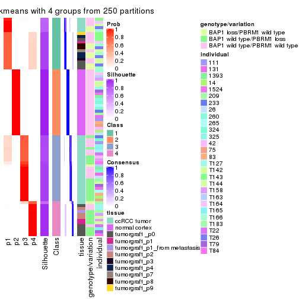</p>

</div>
<div id='tab-MAD-skmeans-consensus-heatmap-4'>
<pre><code class="r">consensus_heatmap(res, k = 5)
</code></pre>

<p></p>

</div>
<div id='tab-MAD-skmeans-consensus-heatmap-5'>
<pre><code class="r">consensus_heatmap(res, k = 6)
</code></pre>

<p></p>

</div>
</div>

Heatmaps for the membership of samples in all partitions to see how consistent they are:


<script>
$( function() {
	$( '#tabs-MAD-skmeans-membership-heatmap' ).tabs();
} );
</script>
<div id='tabs-MAD-skmeans-membership-heatmap'>
<ul>
<li><a href='#tab-MAD-skmeans-membership-heatmap-1'>k = 2</a></li>
<li><a href='#tab-MAD-skmeans-membership-heatmap-2'>k = 3</a></li>
<li><a href='#tab-MAD-skmeans-membership-heatmap-3'>k = 4</a></li>
<li><a href='#tab-MAD-skmeans-membership-heatmap-4'>k = 5</a></li>
<li><a href='#tab-MAD-skmeans-membership-heatmap-5'>k = 6</a></li>
</ul>
<div id='tab-MAD-skmeans-membership-heatmap-1'>
<pre><code class="r">membership_heatmap(res, k = 2)
</code></pre>

<p></p>

</div>
<div id='tab-MAD-skmeans-membership-heatmap-2'>
<pre><code class="r">membership_heatmap(res, k = 3)
</code></pre>

<p></p>

</div>
<div id='tab-MAD-skmeans-membership-heatmap-3'>
<pre><code class="r">membership_heatmap(res, k = 4)
</code></pre>

<p></p>

</div>
<div id='tab-MAD-skmeans-membership-heatmap-4'>
<pre><code class="r">membership_heatmap(res, k = 5)
</code></pre>

<p></p>

</div>
<div id='tab-MAD-skmeans-membership-heatmap-5'>
<pre><code class="r">membership_heatmap(res, k = 6)
</code></pre>

<p></p>

</div>
</div>

As soon as we have had the classes for columns, we can look for signatures
which are significantly different between classes which can be candidate marks
for certain classes. Following are the heatmaps for signatures.


Signature heatmaps where rows are scaled:


<script>
$( function() {
	$( '#tabs-MAD-skmeans-get-signatures' ).tabs();
} );
</script>
<div id='tabs-MAD-skmeans-get-signatures'>
<ul>
<li><a href='#tab-MAD-skmeans-get-signatures-1'>k = 2</a></li>
<li><a href='#tab-MAD-skmeans-get-signatures-2'>k = 3</a></li>
<li><a href='#tab-MAD-skmeans-get-signatures-3'>k = 4</a></li>
<li><a href='#tab-MAD-skmeans-get-signatures-4'>k = 5</a></li>
<li><a href='#tab-MAD-skmeans-get-signatures-5'>k = 6</a></li>
</ul>
<div id='tab-MAD-skmeans-get-signatures-1'>
<pre><code class="r">get_signatures(res, k = 2)
</code></pre>

<p></p>

</div>
<div id='tab-MAD-skmeans-get-signatures-2'>
<pre><code class="r">get_signatures(res, k = 3)
</code></pre>

<p></p>

</div>
<div id='tab-MAD-skmeans-get-signatures-3'>
<pre><code class="r">get_signatures(res, k = 4)
</code></pre>

<p></p>

</div>
<div id='tab-MAD-skmeans-get-signatures-4'>
<pre><code class="r">get_signatures(res, k = 5)
</code></pre>

<p></p>

</div>
<div id='tab-MAD-skmeans-get-signatures-5'>
<pre><code class="r">get_signatures(res, k = 6)
</code></pre>

<p></p>

</div>
</div>


Signature heatmaps where rows are not scaled:


<script>
$( function() {
	$( '#tabs-MAD-skmeans-get-signatures-no-scale' ).tabs();
} );
</script>
<div id='tabs-MAD-skmeans-get-signatures-no-scale'>
<ul>
<li><a href='#tab-MAD-skmeans-get-signatures-no-scale-1'>k = 2</a></li>
<li><a href='#tab-MAD-skmeans-get-signatures-no-scale-2'>k = 3</a></li>
<li><a href='#tab-MAD-skmeans-get-signatures-no-scale-3'>k = 4</a></li>
<li><a href='#tab-MAD-skmeans-get-signatures-no-scale-4'>k = 5</a></li>
<li><a href='#tab-MAD-skmeans-get-signatures-no-scale-5'>k = 6</a></li>
</ul>
<div id='tab-MAD-skmeans-get-signatures-no-scale-1'>
<pre><code class="r">get_signatures(res, k = 2, scale_rows = FALSE)
</code></pre>

<p>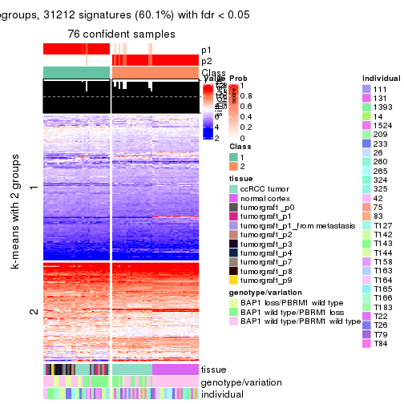</p>

</div>
<div id='tab-MAD-skmeans-get-signatures-no-scale-2'>
<pre><code class="r">get_signatures(res, k = 3, scale_rows = FALSE)
</code></pre>

<p></p>

</div>
<div id='tab-MAD-skmeans-get-signatures-no-scale-3'>
<pre><code class="r">get_signatures(res, k = 4, scale_rows = FALSE)
</code></pre>

<p></p>

</div>
<div id='tab-MAD-skmeans-get-signatures-no-scale-4'>
<pre><code class="r">get_signatures(res, k = 5, scale_rows = FALSE)
</code></pre>

<p></p>

</div>
<div id='tab-MAD-skmeans-get-signatures-no-scale-5'>
<pre><code class="r">get_signatures(res, k = 6, scale_rows = FALSE)
</code></pre>

<p>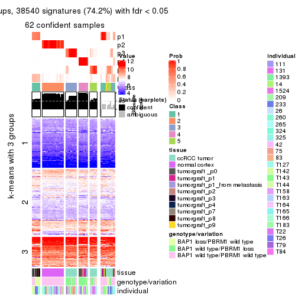</p>

</div>
</div>


Compare the overlap of signatures from different k:

```r
compare_signatures(res)
```


`get_signature()` returns a data frame invisibly. TO get the list of signatures, the function
call should be assigned to a variable explicitly. In following code, if `plot` argument is set
to `FALSE`, no heatmap is plotted while only the differential analysis is performed.

```r
# code only for demonstration
tb = get_signature(res, k = ..., plot = FALSE)
```

An example of the output of `tb` is:

```
#>   which_row         fdr    mean_1    mean_2 scaled_mean_1 scaled_mean_2 km
#> 1        38 0.042760348  8.373488  9.131774    -0.5533452     0.5164555  1
#> 2        40 0.018707592  7.106213  8.469186    -0.6173731     0.5762149  1
#> 3        55 0.019134737 10.221463 11.207825    -0.6159697     0.5749050  1
#> 4        59 0.006059896  5.921854  7.869574    -0.6899429     0.6439467  1
#> 5        60 0.018055526  8.928898 10.211722    -0.6204761     0.5791110  1
#> 6        98 0.009384629 15.714769 14.887706     0.6635654    -0.6193277  2
...
```

The columns in `tb` are:

1. `which_row`: row indices corresponding to the input matrix.
2. `fdr`: FDR for the differential test. 
3. `mean_x`: The mean value in group x.
4. `scaled_mean_x`: The mean value in group x after rows are scaled.
5. `km`: Row groups if k-means clustering is applied to rows.


UMAP plot which shows how samples are separated.


<script>
$( function() {
	$( '#tabs-MAD-skmeans-dimension-reduction' ).tabs();
} );
</script>
<div id='tabs-MAD-skmeans-dimension-reduction'>
<ul>
<li><a href='#tab-MAD-skmeans-dimension-reduction-1'>k = 2</a></li>
<li><a href='#tab-MAD-skmeans-dimension-reduction-2'>k = 3</a></li>
<li><a href='#tab-MAD-skmeans-dimension-reduction-3'>k = 4</a></li>
<li><a href='#tab-MAD-skmeans-dimension-reduction-4'>k = 5</a></li>
<li><a href='#tab-MAD-skmeans-dimension-reduction-5'>k = 6</a></li>
</ul>
<div id='tab-MAD-skmeans-dimension-reduction-1'>
<pre><code class="r">dimension_reduction(res, k = 2, method = &quot;UMAP&quot;)
</code></pre>

<p></p>

</div>
<div id='tab-MAD-skmeans-dimension-reduction-2'>
<pre><code class="r">dimension_reduction(res, k = 3, method = &quot;UMAP&quot;)
</code></pre>

<p></p>

</div>
<div id='tab-MAD-skmeans-dimension-reduction-3'>
<pre><code class="r">dimension_reduction(res, k = 4, method = &quot;UMAP&quot;)
</code></pre>

<p></p>

</div>
<div id='tab-MAD-skmeans-dimension-reduction-4'>
<pre><code class="r">dimension_reduction(res, k = 5, method = &quot;UMAP&quot;)
</code></pre>

<p></p>

</div>
<div id='tab-MAD-skmeans-dimension-reduction-5'>
<pre><code class="r">dimension_reduction(res, k = 6, method = &quot;UMAP&quot;)
</code></pre>

<p></p>

</div>
</div>


Following heatmap shows how subgroups are split when increasing `k`:

```r
collect_classes(res)
```


Test correlation between subgroups and known annotations. If the known
annotation is numeric, one-way ANOVA test is applied, and if the known
annotation is discrete, chi-squared contingency table test is applied.

```r
test_to_known_factors(res)
```

```
#>              n tissue(p) genotype/variation(p) individual(p) k
#> MAD:skmeans 76  1.95e-07              1.24e-03        0.0373 2
#> MAD:skmeans 73  4.09e-19              1.27e-05        0.9240 3
#> MAD:skmeans 76  2.32e-19              1.01e-09        0.1977 4
#> MAD:skmeans 70  1.75e-15              6.17e-09        0.5000 5
#> MAD:skmeans 62  1.16e-16              2.11e-10        0.4077 6
```


If matrix rows can be associated to genes, consider to use `functional_enrichment(res,
...)` to perform function enrichment for the signature genes. See [this vignette](http://bioconductor.org/packages/devel/bioc/vignettes/cola/inst/doc/functional_enrichment.html) for more detailed explanations.


 

---------------------------------------------------


### MAD:pam*


The object with results only for a single top-value method and a single partition method 
can be extracted as:

```r
res = res_list["MAD", "pam"]
# you can also extract it by
# res = res_list["MAD:pam"]
```

A summary of `res` and all the functions that can be applied to it:

```r
res
```

```
#> A 'ConsensusPartition' object with k = 2, 3, 4, 5, 6.
#>   On a matrix with 51941 rows and 76 columns.
#>   Top rows (1000, 2000, 3000, 4000, 5000) are extracted by 'MAD' method.
#>   Subgroups are detected by 'pam' method.
#>   Performed in total 1250 partitions by row resampling.
#>   Best k for subgroups seems to be 6.
#> 
#> Following methods can be applied to this 'ConsensusPartition' object:
#>  [1] "cola_report"             "collect_classes"         "collect_plots"          
#>  [4] "collect_stats"           "colnames"                "compare_signatures"     
#>  [7] "consensus_heatmap"       "dimension_reduction"     "functional_enrichment"  
#> [10] "get_anno_col"            "get_anno"                "get_classes"            
#> [13] "get_consensus"           "get_matrix"              "get_membership"         
#> [16] "get_param"               "get_signatures"          "get_stats"              
#> [19] "is_best_k"               "is_stable_k"             "membership_heatmap"     
#> [22] "ncol"                    "nrow"                    "plot_ecdf"              
#> [25] "rownames"                "select_partition_number" "show"                   
#> [28] "suggest_best_k"          "test_to_known_factors"
```

`collect_plots()` function collects all the plots made from `res` for all `k` (number of partitions)
into one single page to provide an easy and fast comparison between different `k`.

```r
collect_plots(res)
```


The plots are:

- The first row: a plot of the ECDF (empirical cumulative distribution
  function) curves of the consensus matrix for each `k` and the heatmap of
  predicted classes for each `k`.
- The second row: heatmaps of the consensus matrix for each `k`.
- The third row: heatmaps of the membership matrix for each `k`.
- The fouth row: heatmaps of the signatures for each `k`.

All the plots in panels can be made by individual functions and they are
plotted later in this section.

`select_partition_number()` produces several plots showing different
statistics for choosing "optimized" `k`. There are following statistics:

- ECDF curves of the consensus matrix for each `k`;
- 1-PAC. [The PAC
  score](https://en.wikipedia.org/wiki/Consensus_clustering#Over-interpretation_potential_of_consensus_clustering)
  measures the proportion of the ambiguous subgrouping.
- Mean silhouette score.
- Concordance. The mean probability of fiting the consensus class ids in all
  partitions.
- Area increased. Denote $A_k$ as the area under the ECDF curve for current
  `k`, the area increased is defined as $A_k - A_{k-1}$.
- Rand index. The percent of pairs of samples that are both in a same cluster
  or both are not in a same cluster in the partition of k and k-1.
- Jaccard index. The ratio of pairs of samples are both in a same cluster in
  the partition of k and k-1 and the pairs of samples are both in a same
  cluster in the partition k or k-1.

The detailed explanations of these statistics can be found in [the _cola_
vignette](http://bioconductor.org/packages/devel/bioc/vignettes/cola/inst/doc/cola.html#toc_13).

Generally speaking, lower PAC score, higher mean silhouette score or higher
concordance corresponds to better partition. Rand index and Jaccard index
measure how similar the current partition is compared to partition with `k-1`.
If they are too similar, we won't accept `k` is better than `k-1`.

```r
select_partition_number(res)
```


The numeric values for all these statistics can be obtained by `get_stats()`.

```r
get_stats(res)
```

```
#>   k 1-PAC mean_silhouette concordance area_increased  Rand Jaccard
#> 2 2 1.000           0.991       0.996         0.4845 0.516   0.516
#> 3 3 1.000           0.991       0.996         0.3900 0.779   0.584
#> 4 4 1.000           0.988       0.995         0.0964 0.934   0.799
#> 5 5 0.993           0.969       0.984         0.0281 0.982   0.930
#> 6 6 0.908           0.844       0.919         0.0484 0.960   0.839
```

`suggest_best_k()` suggests the best $k$ based on these statistics. The rules are as follows:

- All $k$ with Jaccard index larger than 0.95 are removed because increasing
  $k$ does not provide enough extra information. If all $k$ are removed, it is
  marked as no subgroup is detected.
- For all $k$ with 1-PAC score larger than 0.9, the maximal $k$ is taken as
  the best $k$, and other $k$ are marked as optional $k$.
- If it does not fit the second rule. The $k$ with the maximal vote of the
  highest 1-PAC score, highest mean silhouette, and highest concordance is
  taken as the best $k$.

```r
suggest_best_k(res)
```

```
#> [1] 6
#> attr(,"optional")
#> [1] 2 3 4 5
```

There is also optional best $k$ = 2 3 4 5 that is worth to check.

Following shows the table of the partitions (You need to click the **show/hide
code output** link to see it). The membership matrix (columns with name `p*`)
is inferred by
[`clue::cl_consensus()`](https://www.rdocumentation.org/link/cl_consensus?package=clue)
function with the `SE` method. Basically the value in the membership matrix
represents the probability to belong to a certain group. The finall class
label for an item is determined with the group with highest probability it
belongs to.

In `get_classes()` function, the entropy is calculated from the membership
matrix and the silhouette score is calculated from the consensus matrix.


<script>
$( function() {
	$( '#tabs-MAD-pam-get-classes' ).tabs();
} );
</script>
<div id='tabs-MAD-pam-get-classes'>
<ul>
<li><a href='#tab-MAD-pam-get-classes-1'>k = 2</a></li>
<li><a href='#tab-MAD-pam-get-classes-2'>k = 3</a></li>
<li><a href='#tab-MAD-pam-get-classes-3'>k = 4</a></li>
<li><a href='#tab-MAD-pam-get-classes-4'>k = 5</a></li>
<li><a href='#tab-MAD-pam-get-classes-5'>k = 6</a></li>
</ul>

<div id='tab-MAD-pam-get-classes-1'>
<p><a id='tab-MAD-pam-get-classes-1-a' style='color:#0366d6' href='#'>show/hide code output</a></p>
<pre><code class="r">cbind(get_classes(res, k = 2), get_membership(res, k = 2))
</code></pre>

<pre><code>#&gt;           class entropy silhouette    p1    p2
#&gt; GSM905004     2   0.204      0.965 0.032 0.968
#&gt; GSM905024     1   0.000      0.994 1.000 0.000
#&gt; GSM905038     2   0.000      0.996 0.000 1.000
#&gt; GSM905043     1   0.000      0.994 1.000 0.000
#&gt; GSM904986     2   0.000      0.996 0.000 1.000
#&gt; GSM904991     1   0.653      0.796 0.832 0.168
#&gt; GSM904994     2   0.000      0.996 0.000 1.000
#&gt; GSM904996     2   0.000      0.996 0.000 1.000
#&gt; GSM905007     2   0.000      0.996 0.000 1.000
#&gt; GSM905012     2   0.000      0.996 0.000 1.000
#&gt; GSM905022     2   0.000      0.996 0.000 1.000
#&gt; GSM905026     2   0.000      0.996 0.000 1.000
#&gt; GSM905027     2   0.000      0.996 0.000 1.000
#&gt; GSM905031     2   0.000      0.996 0.000 1.000
#&gt; GSM905036     2   0.541      0.858 0.124 0.876
#&gt; GSM905041     1   0.000      0.994 1.000 0.000
#&gt; GSM905044     2   0.000      0.996 0.000 1.000
#&gt; GSM904989     2   0.000      0.996 0.000 1.000
#&gt; GSM904999     2   0.000      0.996 0.000 1.000
#&gt; GSM905002     2   0.000      0.996 0.000 1.000
#&gt; GSM905009     2   0.000      0.996 0.000 1.000
#&gt; GSM905014     2   0.000      0.996 0.000 1.000
#&gt; GSM905017     2   0.000      0.996 0.000 1.000
#&gt; GSM905020     2   0.000      0.996 0.000 1.000
#&gt; GSM905023     2   0.000      0.996 0.000 1.000
#&gt; GSM905029     2   0.000      0.996 0.000 1.000
#&gt; GSM905032     2   0.000      0.996 0.000 1.000
#&gt; GSM905034     1   0.000      0.994 1.000 0.000
#&gt; GSM905040     1   0.000      0.994 1.000 0.000
#&gt; GSM904985     2   0.000      0.996 0.000 1.000
#&gt; GSM904988     2   0.000      0.996 0.000 1.000
#&gt; GSM904990     2   0.000      0.996 0.000 1.000
#&gt; GSM904992     2   0.000      0.996 0.000 1.000
#&gt; GSM904995     2   0.000      0.996 0.000 1.000
#&gt; GSM904998     2   0.000      0.996 0.000 1.000
#&gt; GSM905000     2   0.000      0.996 0.000 1.000
#&gt; GSM905003     2   0.000      0.996 0.000 1.000
#&gt; GSM905006     2   0.000      0.996 0.000 1.000
#&gt; GSM905008     2   0.000      0.996 0.000 1.000
#&gt; GSM905011     2   0.000      0.996 0.000 1.000
#&gt; GSM905013     2   0.000      0.996 0.000 1.000
#&gt; GSM905016     2   0.000      0.996 0.000 1.000
#&gt; GSM905018     2   0.000      0.996 0.000 1.000
#&gt; GSM905021     2   0.000      0.996 0.000 1.000
#&gt; GSM905025     2   0.000      0.996 0.000 1.000
#&gt; GSM905028     2   0.000      0.996 0.000 1.000
#&gt; GSM905030     2   0.000      0.996 0.000 1.000
#&gt; GSM905033     2   0.000      0.996 0.000 1.000
#&gt; GSM905035     2   0.000      0.996 0.000 1.000
#&gt; GSM905037     2   0.000      0.996 0.000 1.000
#&gt; GSM905039     2   0.000      0.996 0.000 1.000
#&gt; GSM905042     2   0.000      0.996 0.000 1.000
#&gt; GSM905046     1   0.000      0.994 1.000 0.000
#&gt; GSM905065     1   0.000      0.994 1.000 0.000
#&gt; GSM905049     1   0.000      0.994 1.000 0.000
#&gt; GSM905050     1   0.000      0.994 1.000 0.000
#&gt; GSM905064     1   0.000      0.994 1.000 0.000
#&gt; GSM905045     1   0.000      0.994 1.000 0.000
#&gt; GSM905051     1   0.000      0.994 1.000 0.000
#&gt; GSM905055     1   0.000      0.994 1.000 0.000
#&gt; GSM905058     1   0.000      0.994 1.000 0.000
#&gt; GSM905053     1   0.000      0.994 1.000 0.000
#&gt; GSM905061     1   0.000      0.994 1.000 0.000
#&gt; GSM905063     1   0.000      0.994 1.000 0.000
#&gt; GSM905054     1   0.000      0.994 1.000 0.000
#&gt; GSM905062     1   0.000      0.994 1.000 0.000
#&gt; GSM905052     1   0.000      0.994 1.000 0.000
#&gt; GSM905059     1   0.000      0.994 1.000 0.000
#&gt; GSM905047     1   0.000      0.994 1.000 0.000
#&gt; GSM905066     1   0.000      0.994 1.000 0.000
#&gt; GSM905056     1   0.000      0.994 1.000 0.000
#&gt; GSM905060     1   0.000      0.994 1.000 0.000
#&gt; GSM905048     1   0.000      0.994 1.000 0.000
#&gt; GSM905067     1   0.000      0.994 1.000 0.000
#&gt; GSM905057     1   0.000      0.994 1.000 0.000
#&gt; GSM905068     1   0.000      0.994 1.000 0.000
</code></pre>

<script>
$('#tab-MAD-pam-get-classes-1-a').parent().next().next().hide();
$('#tab-MAD-pam-get-classes-1-a').click(function(){
  $('#tab-MAD-pam-get-classes-1-a').parent().next().next().toggle();
  return(false);
});
</script>
</div>

<div id='tab-MAD-pam-get-classes-2'>
<p><a id='tab-MAD-pam-get-classes-2-a' style='color:#0366d6' href='#'>show/hide code output</a></p>
<pre><code class="r">cbind(get_classes(res, k = 3), get_membership(res, k = 3))
</code></pre>

<pre><code>#&gt;           class entropy silhouette    p1    p2    p3
#&gt; GSM905004     3  0.0000      1.000 0.000 0.000 1.000
#&gt; GSM905024     1  0.0424      0.989 0.992 0.000 0.008
#&gt; GSM905038     3  0.0000      1.000 0.000 0.000 1.000
#&gt; GSM905043     1  0.2878      0.895 0.904 0.000 0.096
#&gt; GSM904986     3  0.0000      1.000 0.000 0.000 1.000
#&gt; GSM904991     3  0.0000      1.000 0.000 0.000 1.000
#&gt; GSM904994     3  0.0000      1.000 0.000 0.000 1.000
#&gt; GSM904996     3  0.0000      1.000 0.000 0.000 1.000
#&gt; GSM905007     3  0.0000      1.000 0.000 0.000 1.000
#&gt; GSM905012     3  0.0000      1.000 0.000 0.000 1.000
#&gt; GSM905022     3  0.0000      1.000 0.000 0.000 1.000
#&gt; GSM905026     3  0.0000      1.000 0.000 0.000 1.000
#&gt; GSM905027     3  0.0000      1.000 0.000 0.000 1.000
#&gt; GSM905031     3  0.0000      1.000 0.000 0.000 1.000
#&gt; GSM905036     3  0.0000      1.000 0.000 0.000 1.000
#&gt; GSM905041     3  0.0000      1.000 0.000 0.000 1.000
#&gt; GSM905044     3  0.0000      1.000 0.000 0.000 1.000
#&gt; GSM904989     3  0.0000      1.000 0.000 0.000 1.000
#&gt; GSM904999     3  0.0000      1.000 0.000 0.000 1.000
#&gt; GSM905002     3  0.0000      1.000 0.000 0.000 1.000
#&gt; GSM905009     3  0.0000      1.000 0.000 0.000 1.000
#&gt; GSM905014     3  0.0000      1.000 0.000 0.000 1.000
#&gt; GSM905017     3  0.0000      1.000 0.000 0.000 1.000
#&gt; GSM905020     3  0.0000      1.000 0.000 0.000 1.000
#&gt; GSM905023     3  0.0000      1.000 0.000 0.000 1.000
#&gt; GSM905029     3  0.0000      1.000 0.000 0.000 1.000
#&gt; GSM905032     3  0.0000      1.000 0.000 0.000 1.000
#&gt; GSM905034     1  0.0000      0.996 1.000 0.000 0.000
#&gt; GSM905040     1  0.0237      0.993 0.996 0.000 0.004
#&gt; GSM904985     2  0.0000      0.991 0.000 1.000 0.000
#&gt; GSM904988     2  0.0000      0.991 0.000 1.000 0.000
#&gt; GSM904990     2  0.0000      0.991 0.000 1.000 0.000
#&gt; GSM904992     2  0.0000      0.991 0.000 1.000 0.000
#&gt; GSM904995     2  0.0000      0.991 0.000 1.000 0.000
#&gt; GSM904998     2  0.0000      0.991 0.000 1.000 0.000
#&gt; GSM905000     2  0.0000      0.991 0.000 1.000 0.000
#&gt; GSM905003     2  0.0000      0.991 0.000 1.000 0.000
#&gt; GSM905006     2  0.0000      0.991 0.000 1.000 0.000
#&gt; GSM905008     2  0.0000      0.991 0.000 1.000 0.000
#&gt; GSM905011     2  0.0000      0.991 0.000 1.000 0.000
#&gt; GSM905013     2  0.0000      0.991 0.000 1.000 0.000
#&gt; GSM905016     2  0.0000      0.991 0.000 1.000 0.000
#&gt; GSM905018     2  0.0000      0.991 0.000 1.000 0.000
#&gt; GSM905021     2  0.4504      0.756 0.000 0.804 0.196
#&gt; GSM905025     2  0.0000      0.991 0.000 1.000 0.000
#&gt; GSM905028     2  0.0000      0.991 0.000 1.000 0.000
#&gt; GSM905030     2  0.0000      0.991 0.000 1.000 0.000
#&gt; GSM905033     2  0.0000      0.991 0.000 1.000 0.000
#&gt; GSM905035     2  0.0000      0.991 0.000 1.000 0.000
#&gt; GSM905037     2  0.0000      0.991 0.000 1.000 0.000
#&gt; GSM905039     2  0.0000      0.991 0.000 1.000 0.000
#&gt; GSM905042     2  0.0000      0.991 0.000 1.000 0.000
#&gt; GSM905046     1  0.0000      0.996 1.000 0.000 0.000
#&gt; GSM905065     1  0.0000      0.996 1.000 0.000 0.000
#&gt; GSM905049     1  0.0000      0.996 1.000 0.000 0.000
#&gt; GSM905050     1  0.0000      0.996 1.000 0.000 0.000
#&gt; GSM905064     1  0.0000      0.996 1.000 0.000 0.000
#&gt; GSM905045     1  0.0000      0.996 1.000 0.000 0.000
#&gt; GSM905051     1  0.0000      0.996 1.000 0.000 0.000
#&gt; GSM905055     1  0.0000      0.996 1.000 0.000 0.000
#&gt; GSM905058     1  0.0000      0.996 1.000 0.000 0.000
#&gt; GSM905053     1  0.0000      0.996 1.000 0.000 0.000
#&gt; GSM905061     1  0.0000      0.996 1.000 0.000 0.000
#&gt; GSM905063     1  0.0000      0.996 1.000 0.000 0.000
#&gt; GSM905054     1  0.0000      0.996 1.000 0.000 0.000
#&gt; GSM905062     1  0.0000      0.996 1.000 0.000 0.000
#&gt; GSM905052     1  0.0000      0.996 1.000 0.000 0.000
#&gt; GSM905059     1  0.0000      0.996 1.000 0.000 0.000
#&gt; GSM905047     1  0.0000      0.996 1.000 0.000 0.000
#&gt; GSM905066     1  0.0000      0.996 1.000 0.000 0.000
#&gt; GSM905056     1  0.0000      0.996 1.000 0.000 0.000
#&gt; GSM905060     1  0.0000      0.996 1.000 0.000 0.000
#&gt; GSM905048     1  0.0000      0.996 1.000 0.000 0.000
#&gt; GSM905067     1  0.0000      0.996 1.000 0.000 0.000
#&gt; GSM905057     1  0.0000      0.996 1.000 0.000 0.000
#&gt; GSM905068     1  0.0000      0.996 1.000 0.000 0.000
</code></pre>

<script>
$('#tab-MAD-pam-get-classes-2-a').parent().next().next().hide();
$('#tab-MAD-pam-get-classes-2-a').click(function(){
  $('#tab-MAD-pam-get-classes-2-a').parent().next().next().toggle();
  return(false);
});
</script>
</div>

<div id='tab-MAD-pam-get-classes-3'>
<p><a id='tab-MAD-pam-get-classes-3-a' style='color:#0366d6' href='#'>show/hide code output</a></p>
<pre><code class="r">cbind(get_classes(res, k = 4), get_membership(res, k = 4))
</code></pre>

<pre><code>#&gt;           class entropy silhouette    p1    p2    p3    p4
#&gt; GSM905004     3  0.0000      1.000 0.000 0.000 1.000 0.000
#&gt; GSM905024     1  0.0469      0.981 0.988 0.000 0.012 0.000
#&gt; GSM905038     3  0.0000      1.000 0.000 0.000 1.000 0.000
#&gt; GSM905043     1  0.2281      0.878 0.904 0.000 0.096 0.000
#&gt; GSM904986     3  0.0000      1.000 0.000 0.000 1.000 0.000
#&gt; GSM904991     3  0.0000      1.000 0.000 0.000 1.000 0.000
#&gt; GSM904994     3  0.0000      1.000 0.000 0.000 1.000 0.000
#&gt; GSM904996     3  0.0000      1.000 0.000 0.000 1.000 0.000
#&gt; GSM905007     3  0.0000      1.000 0.000 0.000 1.000 0.000
#&gt; GSM905012     3  0.0000      1.000 0.000 0.000 1.000 0.000
#&gt; GSM905022     3  0.0000      1.000 0.000 0.000 1.000 0.000
#&gt; GSM905026     3  0.0000      1.000 0.000 0.000 1.000 0.000
#&gt; GSM905027     3  0.0000      1.000 0.000 0.000 1.000 0.000
#&gt; GSM905031     3  0.0000      1.000 0.000 0.000 1.000 0.000
#&gt; GSM905036     3  0.0000      1.000 0.000 0.000 1.000 0.000
#&gt; GSM905041     3  0.0000      1.000 0.000 0.000 1.000 0.000
#&gt; GSM905044     3  0.0000      1.000 0.000 0.000 1.000 0.000
#&gt; GSM904989     3  0.0000      1.000 0.000 0.000 1.000 0.000
#&gt; GSM904999     3  0.0000      1.000 0.000 0.000 1.000 0.000
#&gt; GSM905002     3  0.0000      1.000 0.000 0.000 1.000 0.000
#&gt; GSM905009     3  0.0000      1.000 0.000 0.000 1.000 0.000
#&gt; GSM905014     3  0.0000      1.000 0.000 0.000 1.000 0.000
#&gt; GSM905017     3  0.0000      1.000 0.000 0.000 1.000 0.000
#&gt; GSM905020     3  0.0000      1.000 0.000 0.000 1.000 0.000
#&gt; GSM905023     3  0.0000      1.000 0.000 0.000 1.000 0.000
#&gt; GSM905029     3  0.0000      1.000 0.000 0.000 1.000 0.000
#&gt; GSM905032     3  0.0000      1.000 0.000 0.000 1.000 0.000
#&gt; GSM905034     1  0.0188      0.988 0.996 0.000 0.004 0.000
#&gt; GSM905040     1  0.0336      0.985 0.992 0.000 0.008 0.000
#&gt; GSM904985     2  0.0000      0.989 0.000 1.000 0.000 0.000
#&gt; GSM904988     2  0.0000      0.989 0.000 1.000 0.000 0.000
#&gt; GSM904990     2  0.0000      0.989 0.000 1.000 0.000 0.000
#&gt; GSM904992     2  0.0000      0.989 0.000 1.000 0.000 0.000
#&gt; GSM904995     2  0.0000      0.989 0.000 1.000 0.000 0.000
#&gt; GSM904998     2  0.0000      0.989 0.000 1.000 0.000 0.000
#&gt; GSM905000     2  0.0000      0.989 0.000 1.000 0.000 0.000
#&gt; GSM905003     2  0.0000      0.989 0.000 1.000 0.000 0.000
#&gt; GSM905006     2  0.0000      0.989 0.000 1.000 0.000 0.000
#&gt; GSM905008     2  0.0000      0.989 0.000 1.000 0.000 0.000
#&gt; GSM905011     2  0.0000      0.989 0.000 1.000 0.000 0.000
#&gt; GSM905013     2  0.0000      0.989 0.000 1.000 0.000 0.000
#&gt; GSM905016     2  0.0000      0.989 0.000 1.000 0.000 0.000
#&gt; GSM905018     2  0.0000      0.989 0.000 1.000 0.000 0.000
#&gt; GSM905021     2  0.3569      0.738 0.000 0.804 0.196 0.000
#&gt; GSM905025     2  0.0000      0.989 0.000 1.000 0.000 0.000
#&gt; GSM905028     2  0.0000      0.989 0.000 1.000 0.000 0.000
#&gt; GSM905030     2  0.0000      0.989 0.000 1.000 0.000 0.000
#&gt; GSM905033     2  0.0000      0.989 0.000 1.000 0.000 0.000
#&gt; GSM905035     2  0.0000      0.989 0.000 1.000 0.000 0.000
#&gt; GSM905037     2  0.0000      0.989 0.000 1.000 0.000 0.000
#&gt; GSM905039     2  0.0000      0.989 0.000 1.000 0.000 0.000
#&gt; GSM905042     2  0.0000      0.989 0.000 1.000 0.000 0.000
#&gt; GSM905046     1  0.0000      0.991 1.000 0.000 0.000 0.000
#&gt; GSM905065     1  0.0000      0.991 1.000 0.000 0.000 0.000
#&gt; GSM905049     4  0.0000      0.992 0.000 0.000 0.000 1.000
#&gt; GSM905050     4  0.0000      0.992 0.000 0.000 0.000 1.000
#&gt; GSM905064     4  0.0000      0.992 0.000 0.000 0.000 1.000
#&gt; GSM905045     4  0.0000      0.992 0.000 0.000 0.000 1.000
#&gt; GSM905051     4  0.1792      0.928 0.068 0.000 0.000 0.932
#&gt; GSM905055     1  0.0000      0.991 1.000 0.000 0.000 0.000
#&gt; GSM905058     1  0.0000      0.991 1.000 0.000 0.000 0.000
#&gt; GSM905053     4  0.0000      0.992 0.000 0.000 0.000 1.000
#&gt; GSM905061     4  0.0000      0.992 0.000 0.000 0.000 1.000
#&gt; GSM905063     1  0.0000      0.991 1.000 0.000 0.000 0.000
#&gt; GSM905054     4  0.0000      0.992 0.000 0.000 0.000 1.000
#&gt; GSM905062     4  0.0000      0.992 0.000 0.000 0.000 1.000
#&gt; GSM905052     4  0.0336      0.987 0.008 0.000 0.000 0.992
#&gt; GSM905059     1  0.0000      0.991 1.000 0.000 0.000 0.000
#&gt; GSM905047     1  0.0000      0.991 1.000 0.000 0.000 0.000
#&gt; GSM905066     1  0.0000      0.991 1.000 0.000 0.000 0.000
#&gt; GSM905056     1  0.0000      0.991 1.000 0.000 0.000 0.000
#&gt; GSM905060     1  0.0000      0.991 1.000 0.000 0.000 0.000
#&gt; GSM905048     1  0.0000      0.991 1.000 0.000 0.000 0.000
#&gt; GSM905067     1  0.0000      0.991 1.000 0.000 0.000 0.000
#&gt; GSM905057     1  0.0000      0.991 1.000 0.000 0.000 0.000
#&gt; GSM905068     4  0.0000      0.992 0.000 0.000 0.000 1.000
</code></pre>

<script>
$('#tab-MAD-pam-get-classes-3-a').parent().next().next().hide();
$('#tab-MAD-pam-get-classes-3-a').click(function(){
  $('#tab-MAD-pam-get-classes-3-a').parent().next().next().toggle();
  return(false);
});
</script>
</div>

<div id='tab-MAD-pam-get-classes-4'>
<p><a id='tab-MAD-pam-get-classes-4-a' style='color:#0366d6' href='#'>show/hide code output</a></p>
<pre><code class="r">cbind(get_classes(res, k = 5), get_membership(res, k = 5))
</code></pre>

<pre><code>#&gt;           class entropy silhouette    p1    p2    p3    p4    p5
#&gt; GSM905004     3  0.0000      0.988 0.000 0.000 1.000 0.000 0.000
#&gt; GSM905024     1  0.1892      0.902 0.916 0.000 0.004 0.000 0.080
#&gt; GSM905038     3  0.0000      0.988 0.000 0.000 1.000 0.000 0.000
#&gt; GSM905043     1  0.2754      0.865 0.880 0.000 0.040 0.000 0.080
#&gt; GSM904986     3  0.0000      0.988 0.000 0.000 1.000 0.000 0.000
#&gt; GSM904991     3  0.1732      0.924 0.000 0.000 0.920 0.000 0.080
#&gt; GSM904994     3  0.0000      0.988 0.000 0.000 1.000 0.000 0.000
#&gt; GSM904996     3  0.0000      0.988 0.000 0.000 1.000 0.000 0.000
#&gt; GSM905007     3  0.0290      0.984 0.000 0.000 0.992 0.000 0.008
#&gt; GSM905012     3  0.0000      0.988 0.000 0.000 1.000 0.000 0.000
#&gt; GSM905022     3  0.0000      0.988 0.000 0.000 1.000 0.000 0.000
#&gt; GSM905026     3  0.0000      0.988 0.000 0.000 1.000 0.000 0.000
#&gt; GSM905027     3  0.0000      0.988 0.000 0.000 1.000 0.000 0.000
#&gt; GSM905031     3  0.0000      0.988 0.000 0.000 1.000 0.000 0.000
#&gt; GSM905036     3  0.0290      0.984 0.000 0.000 0.992 0.000 0.008
#&gt; GSM905041     3  0.1732      0.924 0.000 0.000 0.920 0.000 0.080
#&gt; GSM905044     3  0.0000      0.988 0.000 0.000 1.000 0.000 0.000
#&gt; GSM904989     3  0.0000      0.988 0.000 0.000 1.000 0.000 0.000
#&gt; GSM904999     3  0.0000      0.988 0.000 0.000 1.000 0.000 0.000
#&gt; GSM905002     3  0.0000      0.988 0.000 0.000 1.000 0.000 0.000
#&gt; GSM905009     3  0.0000      0.988 0.000 0.000 1.000 0.000 0.000
#&gt; GSM905014     3  0.0290      0.984 0.000 0.000 0.992 0.000 0.008
#&gt; GSM905017     3  0.0000      0.988 0.000 0.000 1.000 0.000 0.000
#&gt; GSM905020     3  0.0000      0.988 0.000 0.000 1.000 0.000 0.000
#&gt; GSM905023     3  0.0290      0.984 0.000 0.000 0.992 0.000 0.008
#&gt; GSM905029     3  0.0000      0.988 0.000 0.000 1.000 0.000 0.000
#&gt; GSM905032     3  0.2020      0.905 0.000 0.000 0.900 0.000 0.100
#&gt; GSM905034     1  0.1732      0.904 0.920 0.000 0.000 0.000 0.080
#&gt; GSM905040     5  0.0000      0.904 0.000 0.000 0.000 0.000 1.000
#&gt; GSM904985     2  0.0000      0.988 0.000 1.000 0.000 0.000 0.000
#&gt; GSM904988     2  0.0000      0.988 0.000 1.000 0.000 0.000 0.000
#&gt; GSM904990     2  0.0000      0.988 0.000 1.000 0.000 0.000 0.000
#&gt; GSM904992     2  0.0000      0.988 0.000 1.000 0.000 0.000 0.000
#&gt; GSM904995     2  0.0000      0.988 0.000 1.000 0.000 0.000 0.000
#&gt; GSM904998     2  0.0000      0.988 0.000 1.000 0.000 0.000 0.000
#&gt; GSM905000     2  0.0000      0.988 0.000 1.000 0.000 0.000 0.000
#&gt; GSM905003     2  0.0000      0.988 0.000 1.000 0.000 0.000 0.000
#&gt; GSM905006     2  0.0000      0.988 0.000 1.000 0.000 0.000 0.000
#&gt; GSM905008     2  0.0000      0.988 0.000 1.000 0.000 0.000 0.000
#&gt; GSM905011     2  0.0000      0.988 0.000 1.000 0.000 0.000 0.000
#&gt; GSM905013     2  0.0000      0.988 0.000 1.000 0.000 0.000 0.000
#&gt; GSM905016     2  0.0000      0.988 0.000 1.000 0.000 0.000 0.000
#&gt; GSM905018     2  0.0000      0.988 0.000 1.000 0.000 0.000 0.000
#&gt; GSM905021     2  0.3039      0.703 0.000 0.808 0.192 0.000 0.000
#&gt; GSM905025     2  0.0000      0.988 0.000 1.000 0.000 0.000 0.000
#&gt; GSM905028     2  0.0000      0.988 0.000 1.000 0.000 0.000 0.000
#&gt; GSM905030     2  0.0000      0.988 0.000 1.000 0.000 0.000 0.000
#&gt; GSM905033     2  0.0000      0.988 0.000 1.000 0.000 0.000 0.000
#&gt; GSM905035     2  0.0000      0.988 0.000 1.000 0.000 0.000 0.000
#&gt; GSM905037     2  0.0000      0.988 0.000 1.000 0.000 0.000 0.000
#&gt; GSM905039     2  0.0000      0.988 0.000 1.000 0.000 0.000 0.000
#&gt; GSM905042     2  0.0000      0.988 0.000 1.000 0.000 0.000 0.000
#&gt; GSM905046     1  0.0000      0.957 1.000 0.000 0.000 0.000 0.000
#&gt; GSM905065     1  0.0000      0.957 1.000 0.000 0.000 0.000 0.000
#&gt; GSM905049     4  0.0000      0.991 0.000 0.000 0.000 1.000 0.000
#&gt; GSM905050     4  0.0000      0.991 0.000 0.000 0.000 1.000 0.000
#&gt; GSM905064     4  0.0000      0.991 0.000 0.000 0.000 1.000 0.000
#&gt; GSM905045     4  0.0000      0.991 0.000 0.000 0.000 1.000 0.000
#&gt; GSM905051     4  0.1478      0.916 0.064 0.000 0.000 0.936 0.000
#&gt; GSM905055     5  0.1732      0.967 0.080 0.000 0.000 0.000 0.920
#&gt; GSM905058     1  0.0000      0.957 1.000 0.000 0.000 0.000 0.000
#&gt; GSM905053     4  0.0000      0.991 0.000 0.000 0.000 1.000 0.000
#&gt; GSM905061     4  0.0000      0.991 0.000 0.000 0.000 1.000 0.000
#&gt; GSM905063     1  0.2813      0.779 0.832 0.000 0.000 0.000 0.168
#&gt; GSM905054     4  0.0000      0.991 0.000 0.000 0.000 1.000 0.000
#&gt; GSM905062     4  0.0000      0.991 0.000 0.000 0.000 1.000 0.000
#&gt; GSM905052     4  0.0162      0.988 0.004 0.000 0.000 0.996 0.000
#&gt; GSM905059     1  0.0000      0.957 1.000 0.000 0.000 0.000 0.000
#&gt; GSM905047     1  0.0000      0.957 1.000 0.000 0.000 0.000 0.000
#&gt; GSM905066     1  0.0000      0.957 1.000 0.000 0.000 0.000 0.000
#&gt; GSM905056     5  0.1732      0.967 0.080 0.000 0.000 0.000 0.920
#&gt; GSM905060     1  0.0000      0.957 1.000 0.000 0.000 0.000 0.000
#&gt; GSM905048     1  0.0000      0.957 1.000 0.000 0.000 0.000 0.000
#&gt; GSM905067     1  0.0000      0.957 1.000 0.000 0.000 0.000 0.000
#&gt; GSM905057     5  0.1732      0.967 0.080 0.000 0.000 0.000 0.920
#&gt; GSM905068     4  0.0000      0.991 0.000 0.000 0.000 1.000 0.000
</code></pre>

<script>
$('#tab-MAD-pam-get-classes-4-a').parent().next().next().hide();
$('#tab-MAD-pam-get-classes-4-a').click(function(){
  $('#tab-MAD-pam-get-classes-4-a').parent().next().next().toggle();
  return(false);
});
</script>
</div>

<div id='tab-MAD-pam-get-classes-5'>
<p><a id='tab-MAD-pam-get-classes-5-a' style='color:#0366d6' href='#'>show/hide code output</a></p>
<pre><code class="r">cbind(get_classes(res, k = 6), get_membership(res, k = 6))
</code></pre>

<pre><code>#&gt;           class entropy silhouette    p1    p2    p3    p4    p5    p6
#&gt; GSM905004     3  0.0000      0.822 0.000 0.000 1.000 0.000 0.000 0.000
#&gt; GSM905024     5  0.4333      0.404 0.376 0.000 0.028 0.000 0.596 0.000
#&gt; GSM905038     3  0.3578      0.643 0.000 0.000 0.660 0.000 0.340 0.000
#&gt; GSM905043     5  0.3330      0.546 0.284 0.000 0.000 0.000 0.716 0.000
#&gt; GSM904986     3  0.0000      0.822 0.000 0.000 1.000 0.000 0.000 0.000
#&gt; GSM904991     5  0.3828      0.309 0.000 0.000 0.440 0.000 0.560 0.000
#&gt; GSM904994     3  0.0000      0.822 0.000 0.000 1.000 0.000 0.000 0.000
#&gt; GSM904996     3  0.0000      0.822 0.000 0.000 1.000 0.000 0.000 0.000
#&gt; GSM905007     3  0.0458      0.812 0.000 0.000 0.984 0.000 0.016 0.000
#&gt; GSM905012     3  0.0000      0.822 0.000 0.000 1.000 0.000 0.000 0.000
#&gt; GSM905022     3  0.0000      0.822 0.000 0.000 1.000 0.000 0.000 0.000
#&gt; GSM905026     3  0.3578      0.643 0.000 0.000 0.660 0.000 0.340 0.000
#&gt; GSM905027     3  0.3774      0.569 0.000 0.000 0.592 0.000 0.408 0.000
#&gt; GSM905031     3  0.3578      0.643 0.000 0.000 0.660 0.000 0.340 0.000
#&gt; GSM905036     3  0.3851      0.493 0.000 0.000 0.540 0.000 0.460 0.000
#&gt; GSM905041     5  0.1814      0.516 0.000 0.000 0.100 0.000 0.900 0.000
#&gt; GSM905044     3  0.3578      0.643 0.000 0.000 0.660 0.000 0.340 0.000
#&gt; GSM904989     3  0.0000      0.822 0.000 0.000 1.000 0.000 0.000 0.000
#&gt; GSM904999     3  0.0000      0.822 0.000 0.000 1.000 0.000 0.000 0.000
#&gt; GSM905002     3  0.0000      0.822 0.000 0.000 1.000 0.000 0.000 0.000
#&gt; GSM905009     3  0.0000      0.822 0.000 0.000 1.000 0.000 0.000 0.000
#&gt; GSM905014     3  0.0458      0.812 0.000 0.000 0.984 0.000 0.016 0.000
#&gt; GSM905017     3  0.0000      0.822 0.000 0.000 1.000 0.000 0.000 0.000
#&gt; GSM905020     3  0.0000      0.822 0.000 0.000 1.000 0.000 0.000 0.000
#&gt; GSM905023     3  0.3860      0.469 0.000 0.000 0.528 0.000 0.472 0.000
#&gt; GSM905029     3  0.3774      0.569 0.000 0.000 0.592 0.000 0.408 0.000
#&gt; GSM905032     5  0.1970      0.517 0.000 0.000 0.092 0.000 0.900 0.008
#&gt; GSM905034     5  0.3578      0.367 0.340 0.000 0.000 0.000 0.660 0.000
#&gt; GSM905040     5  0.3774      0.130 0.000 0.000 0.000 0.000 0.592 0.408
#&gt; GSM904985     2  0.0000      0.988 0.000 1.000 0.000 0.000 0.000 0.000
#&gt; GSM904988     2  0.0000      0.988 0.000 1.000 0.000 0.000 0.000 0.000
#&gt; GSM904990     2  0.0000      0.988 0.000 1.000 0.000 0.000 0.000 0.000
#&gt; GSM904992     2  0.0000      0.988 0.000 1.000 0.000 0.000 0.000 0.000
#&gt; GSM904995     2  0.0000      0.988 0.000 1.000 0.000 0.000 0.000 0.000
#&gt; GSM904998     2  0.0000      0.988 0.000 1.000 0.000 0.000 0.000 0.000
#&gt; GSM905000     2  0.0000      0.988 0.000 1.000 0.000 0.000 0.000 0.000
#&gt; GSM905003     2  0.0000      0.988 0.000 1.000 0.000 0.000 0.000 0.000
#&gt; GSM905006     2  0.0000      0.988 0.000 1.000 0.000 0.000 0.000 0.000
#&gt; GSM905008     2  0.0000      0.988 0.000 1.000 0.000 0.000 0.000 0.000
#&gt; GSM905011     2  0.0000      0.988 0.000 1.000 0.000 0.000 0.000 0.000
#&gt; GSM905013     2  0.0000      0.988 0.000 1.000 0.000 0.000 0.000 0.000
#&gt; GSM905016     2  0.0000      0.988 0.000 1.000 0.000 0.000 0.000 0.000
#&gt; GSM905018     2  0.0000      0.988 0.000 1.000 0.000 0.000 0.000 0.000
#&gt; GSM905021     2  0.2823      0.711 0.000 0.796 0.204 0.000 0.000 0.000
#&gt; GSM905025     2  0.0000      0.988 0.000 1.000 0.000 0.000 0.000 0.000
#&gt; GSM905028     2  0.0000      0.988 0.000 1.000 0.000 0.000 0.000 0.000
#&gt; GSM905030     2  0.0000      0.988 0.000 1.000 0.000 0.000 0.000 0.000
#&gt; GSM905033     2  0.0000      0.988 0.000 1.000 0.000 0.000 0.000 0.000
#&gt; GSM905035     2  0.0000      0.988 0.000 1.000 0.000 0.000 0.000 0.000
#&gt; GSM905037     2  0.0000      0.988 0.000 1.000 0.000 0.000 0.000 0.000
#&gt; GSM905039     2  0.0000      0.988 0.000 1.000 0.000 0.000 0.000 0.000
#&gt; GSM905042     2  0.0547      0.968 0.000 0.980 0.000 0.000 0.020 0.000
#&gt; GSM905046     1  0.0000      0.928 1.000 0.000 0.000 0.000 0.000 0.000
#&gt; GSM905065     1  0.0000      0.928 1.000 0.000 0.000 0.000 0.000 0.000
#&gt; GSM905049     4  0.0000      0.990 0.000 0.000 0.000 1.000 0.000 0.000
#&gt; GSM905050     4  0.0000      0.990 0.000 0.000 0.000 1.000 0.000 0.000
#&gt; GSM905064     4  0.0000      0.990 0.000 0.000 0.000 1.000 0.000 0.000
#&gt; GSM905045     4  0.0000      0.990 0.000 0.000 0.000 1.000 0.000 0.000
#&gt; GSM905051     4  0.1471      0.916 0.064 0.000 0.000 0.932 0.004 0.000
#&gt; GSM905055     6  0.0000      1.000 0.000 0.000 0.000 0.000 0.000 1.000
#&gt; GSM905058     1  0.1814      0.907 0.900 0.000 0.000 0.000 0.100 0.000
#&gt; GSM905053     4  0.0000      0.990 0.000 0.000 0.000 1.000 0.000 0.000
#&gt; GSM905061     4  0.0000      0.990 0.000 0.000 0.000 1.000 0.000 0.000
#&gt; GSM905063     1  0.3766      0.679 0.736 0.000 0.000 0.000 0.032 0.232
#&gt; GSM905054     4  0.0000      0.990 0.000 0.000 0.000 1.000 0.000 0.000
#&gt; GSM905062     4  0.0000      0.990 0.000 0.000 0.000 1.000 0.000 0.000
#&gt; GSM905052     4  0.0405      0.981 0.008 0.000 0.000 0.988 0.004 0.000
#&gt; GSM905059     1  0.1814      0.907 0.900 0.000 0.000 0.000 0.100 0.000
#&gt; GSM905047     1  0.1267      0.916 0.940 0.000 0.000 0.000 0.060 0.000
#&gt; GSM905066     1  0.0000      0.928 1.000 0.000 0.000 0.000 0.000 0.000
#&gt; GSM905056     6  0.0000      1.000 0.000 0.000 0.000 0.000 0.000 1.000
#&gt; GSM905060     1  0.1814      0.907 0.900 0.000 0.000 0.000 0.100 0.000
#&gt; GSM905048     1  0.0000      0.928 1.000 0.000 0.000 0.000 0.000 0.000
#&gt; GSM905067     1  0.0000      0.928 1.000 0.000 0.000 0.000 0.000 0.000
#&gt; GSM905057     6  0.0000      1.000 0.000 0.000 0.000 0.000 0.000 1.000
#&gt; GSM905068     4  0.0000      0.990 0.000 0.000 0.000 1.000 0.000 0.000
</code></pre>

<script>
$('#tab-MAD-pam-get-classes-5-a').parent().next().next().hide();
$('#tab-MAD-pam-get-classes-5-a').click(function(){
  $('#tab-MAD-pam-get-classes-5-a').parent().next().next().toggle();
  return(false);
});
</script>
</div>
</div>

Heatmaps for the consensus matrix. It visualizes the probability of two
samples to be in a same group.


<script>
$( function() {
	$( '#tabs-MAD-pam-consensus-heatmap' ).tabs();
} );
</script>
<div id='tabs-MAD-pam-consensus-heatmap'>
<ul>
<li><a href='#tab-MAD-pam-consensus-heatmap-1'>k = 2</a></li>
<li><a href='#tab-MAD-pam-consensus-heatmap-2'>k = 3</a></li>
<li><a href='#tab-MAD-pam-consensus-heatmap-3'>k = 4</a></li>
<li><a href='#tab-MAD-pam-consensus-heatmap-4'>k = 5</a></li>
<li><a href='#tab-MAD-pam-consensus-heatmap-5'>k = 6</a></li>
</ul>
<div id='tab-MAD-pam-consensus-heatmap-1'>
<pre><code class="r">consensus_heatmap(res, k = 2)
</code></pre>

<p></p>

</div>
<div id='tab-MAD-pam-consensus-heatmap-2'>
<pre><code class="r">consensus_heatmap(res, k = 3)
</code></pre>

<p></p>

</div>
<div id='tab-MAD-pam-consensus-heatmap-3'>
<pre><code class="r">consensus_heatmap(res, k = 4)
</code></pre>

<p></p>

</div>
<div id='tab-MAD-pam-consensus-heatmap-4'>
<pre><code class="r">consensus_heatmap(res, k = 5)
</code></pre>

<p></p>

</div>
<div id='tab-MAD-pam-consensus-heatmap-5'>
<pre><code class="r">consensus_heatmap(res, k = 6)
</code></pre>

<p></p>

</div>
</div>

Heatmaps for the membership of samples in all partitions to see how consistent they are:


<script>
$( function() {
	$( '#tabs-MAD-pam-membership-heatmap' ).tabs();
} );
</script>
<div id='tabs-MAD-pam-membership-heatmap'>
<ul>
<li><a href='#tab-MAD-pam-membership-heatmap-1'>k = 2</a></li>
<li><a href='#tab-MAD-pam-membership-heatmap-2'>k = 3</a></li>
<li><a href='#tab-MAD-pam-membership-heatmap-3'>k = 4</a></li>
<li><a href='#tab-MAD-pam-membership-heatmap-4'>k = 5</a></li>
<li><a href='#tab-MAD-pam-membership-heatmap-5'>k = 6</a></li>
</ul>
<div id='tab-MAD-pam-membership-heatmap-1'>
<pre><code class="r">membership_heatmap(res, k = 2)
</code></pre>

<p></p>

</div>
<div id='tab-MAD-pam-membership-heatmap-2'>
<pre><code class="r">membership_heatmap(res, k = 3)
</code></pre>

<p></p>

</div>
<div id='tab-MAD-pam-membership-heatmap-3'>
<pre><code class="r">membership_heatmap(res, k = 4)
</code></pre>

<p>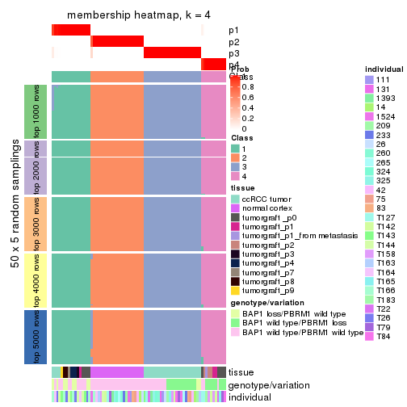</p>

</div>
<div id='tab-MAD-pam-membership-heatmap-4'>
<pre><code class="r">membership_heatmap(res, k = 5)
</code></pre>

<p></p>

</div>
<div id='tab-MAD-pam-membership-heatmap-5'>
<pre><code class="r">membership_heatmap(res, k = 6)
</code></pre>

<p></p>

</div>
</div>

As soon as we have had the classes for columns, we can look for signatures
which are significantly different between classes which can be candidate marks
for certain classes. Following are the heatmaps for signatures.


Signature heatmaps where rows are scaled:


<script>
$( function() {
	$( '#tabs-MAD-pam-get-signatures' ).tabs();
} );
</script>
<div id='tabs-MAD-pam-get-signatures'>
<ul>
<li><a href='#tab-MAD-pam-get-signatures-1'>k = 2</a></li>
<li><a href='#tab-MAD-pam-get-signatures-2'>k = 3</a></li>
<li><a href='#tab-MAD-pam-get-signatures-3'>k = 4</a></li>
<li><a href='#tab-MAD-pam-get-signatures-4'>k = 5</a></li>
<li><a href='#tab-MAD-pam-get-signatures-5'>k = 6</a></li>
</ul>
<div id='tab-MAD-pam-get-signatures-1'>
<pre><code class="r">get_signatures(res, k = 2)
</code></pre>

<p></p>

</div>
<div id='tab-MAD-pam-get-signatures-2'>
<pre><code class="r">get_signatures(res, k = 3)
</code></pre>

<p></p>

</div>
<div id='tab-MAD-pam-get-signatures-3'>
<pre><code class="r">get_signatures(res, k = 4)
</code></pre>

<p></p>

</div>
<div id='tab-MAD-pam-get-signatures-4'>
<pre><code class="r">get_signatures(res, k = 5)
</code></pre>

<p></p>

</div>
<div id='tab-MAD-pam-get-signatures-5'>
<pre><code class="r">get_signatures(res, k = 6)
</code></pre>

<p></p>

</div>
</div>


Signature heatmaps where rows are not scaled:


<script>
$( function() {
	$( '#tabs-MAD-pam-get-signatures-no-scale' ).tabs();
} );
</script>
<div id='tabs-MAD-pam-get-signatures-no-scale'>
<ul>
<li><a href='#tab-MAD-pam-get-signatures-no-scale-1'>k = 2</a></li>
<li><a href='#tab-MAD-pam-get-signatures-no-scale-2'>k = 3</a></li>
<li><a href='#tab-MAD-pam-get-signatures-no-scale-3'>k = 4</a></li>
<li><a href='#tab-MAD-pam-get-signatures-no-scale-4'>k = 5</a></li>
<li><a href='#tab-MAD-pam-get-signatures-no-scale-5'>k = 6</a></li>
</ul>
<div id='tab-MAD-pam-get-signatures-no-scale-1'>
<pre><code class="r">get_signatures(res, k = 2, scale_rows = FALSE)
</code></pre>

<p></p>

</div>
<div id='tab-MAD-pam-get-signatures-no-scale-2'>
<pre><code class="r">get_signatures(res, k = 3, scale_rows = FALSE)
</code></pre>

<p></p>

</div>
<div id='tab-MAD-pam-get-signatures-no-scale-3'>
<pre><code class="r">get_signatures(res, k = 4, scale_rows = FALSE)
</code></pre>

<p></p>

</div>
<div id='tab-MAD-pam-get-signatures-no-scale-4'>
<pre><code class="r">get_signatures(res, k = 5, scale_rows = FALSE)
</code></pre>

<p></p>

</div>
<div id='tab-MAD-pam-get-signatures-no-scale-5'>
<pre><code class="r">get_signatures(res, k = 6, scale_rows = FALSE)
</code></pre>

<p></p>

</div>
</div>


Compare the overlap of signatures from different k:

```r
compare_signatures(res)
```


`get_signature()` returns a data frame invisibly. TO get the list of signatures, the function
call should be assigned to a variable explicitly. In following code, if `plot` argument is set
to `FALSE`, no heatmap is plotted while only the differential analysis is performed.

```r
# code only for demonstration
tb = get_signature(res, k = ..., plot = FALSE)
```

An example of the output of `tb` is:

```
#>   which_row         fdr    mean_1    mean_2 scaled_mean_1 scaled_mean_2 km
#> 1        38 0.042760348  8.373488  9.131774    -0.5533452     0.5164555  1
#> 2        40 0.018707592  7.106213  8.469186    -0.6173731     0.5762149  1
#> 3        55 0.019134737 10.221463 11.207825    -0.6159697     0.5749050  1
#> 4        59 0.006059896  5.921854  7.869574    -0.6899429     0.6439467  1
#> 5        60 0.018055526  8.928898 10.211722    -0.6204761     0.5791110  1
#> 6        98 0.009384629 15.714769 14.887706     0.6635654    -0.6193277  2
...
```

The columns in `tb` are:

1. `which_row`: row indices corresponding to the input matrix.
2. `fdr`: FDR for the differential test. 
3. `mean_x`: The mean value in group x.
4. `scaled_mean_x`: The mean value in group x after rows are scaled.
5. `km`: Row groups if k-means clustering is applied to rows.


UMAP plot which shows how samples are separated.


<script>
$( function() {
	$( '#tabs-MAD-pam-dimension-reduction' ).tabs();
} );
</script>
<div id='tabs-MAD-pam-dimension-reduction'>
<ul>
<li><a href='#tab-MAD-pam-dimension-reduction-1'>k = 2</a></li>
<li><a href='#tab-MAD-pam-dimension-reduction-2'>k = 3</a></li>
<li><a href='#tab-MAD-pam-dimension-reduction-3'>k = 4</a></li>
<li><a href='#tab-MAD-pam-dimension-reduction-4'>k = 5</a></li>
<li><a href='#tab-MAD-pam-dimension-reduction-5'>k = 6</a></li>
</ul>
<div id='tab-MAD-pam-dimension-reduction-1'>
<pre><code class="r">dimension_reduction(res, k = 2, method = &quot;UMAP&quot;)
</code></pre>

<p></p>

</div>
<div id='tab-MAD-pam-dimension-reduction-2'>
<pre><code class="r">dimension_reduction(res, k = 3, method = &quot;UMAP&quot;)
</code></pre>

<p></p>

</div>
<div id='tab-MAD-pam-dimension-reduction-3'>
<pre><code class="r">dimension_reduction(res, k = 4, method = &quot;UMAP&quot;)
</code></pre>

<p></p>

</div>
<div id='tab-MAD-pam-dimension-reduction-4'>
<pre><code class="r">dimension_reduction(res, k = 5, method = &quot;UMAP&quot;)
</code></pre>

<p></p>

</div>
<div id='tab-MAD-pam-dimension-reduction-5'>
<pre><code class="r">dimension_reduction(res, k = 6, method = &quot;UMAP&quot;)
</code></pre>

<p></p>

</div>
</div>


Following heatmap shows how subgroups are split when increasing `k`:

```r
collect_classes(res)
```


Test correlation between subgroups and known annotations. If the known
annotation is numeric, one-way ANOVA test is applied, and if the known
annotation is discrete, chi-squared contingency table test is applied.

```r
test_to_known_factors(res)
```

```
#>          n tissue(p) genotype/variation(p) individual(p) k
#> MAD:pam 76  1.98e-08              5.13e-03        0.0709 2
#> MAD:pam 76  1.53e-18              5.88e-06        0.8922 3
#> MAD:pam 76  2.37e-21              6.19e-10        0.3008 4
#> MAD:pam 76  1.78e-21              4.53e-11        0.0398 5
#> MAD:pam 70  3.68e-20              1.67e-08        0.1009 6
```


If matrix rows can be associated to genes, consider to use `functional_enrichment(res,
...)` to perform function enrichment for the signature genes. See [this vignette](http://bioconductor.org/packages/devel/bioc/vignettes/cola/inst/doc/functional_enrichment.html) for more detailed explanations.


 

---------------------------------------------------


### MAD:mclust**


The object with results only for a single top-value method and a single partition method 
can be extracted as:

```r
res = res_list["MAD", "mclust"]
# you can also extract it by
# res = res_list["MAD:mclust"]
```

A summary of `res` and all the functions that can be applied to it:

```r
res
```

```
#> A 'ConsensusPartition' object with k = 2, 3, 4, 5, 6.
#>   On a matrix with 51941 rows and 76 columns.
#>   Top rows (1000, 2000, 3000, 4000, 5000) are extracted by 'MAD' method.
#>   Subgroups are detected by 'mclust' method.
#>   Performed in total 1250 partitions by row resampling.
#>   Best k for subgroups seems to be 5.
#> 
#> Following methods can be applied to this 'ConsensusPartition' object:
#>  [1] "cola_report"             "collect_classes"         "collect_plots"          
#>  [4] "collect_stats"           "colnames"                "compare_signatures"     
#>  [7] "consensus_heatmap"       "dimension_reduction"     "functional_enrichment"  
#> [10] "get_anno_col"            "get_anno"                "get_classes"            
#> [13] "get_consensus"           "get_matrix"              "get_membership"         
#> [16] "get_param"               "get_signatures"          "get_stats"              
#> [19] "is_best_k"               "is_stable_k"             "membership_heatmap"     
#> [22] "ncol"                    "nrow"                    "plot_ecdf"              
#> [25] "rownames"                "select_partition_number" "show"                   
#> [28] "suggest_best_k"          "test_to_known_factors"
```

`collect_plots()` function collects all the plots made from `res` for all `k` (number of partitions)
into one single page to provide an easy and fast comparison between different `k`.

```r
collect_plots(res)
```


The plots are:

- The first row: a plot of the ECDF (empirical cumulative distribution
  function) curves of the consensus matrix for each `k` and the heatmap of
  predicted classes for each `k`.
- The second row: heatmaps of the consensus matrix for each `k`.
- The third row: heatmaps of the membership matrix for each `k`.
- The fouth row: heatmaps of the signatures for each `k`.

All the plots in panels can be made by individual functions and they are
plotted later in this section.

`select_partition_number()` produces several plots showing different
statistics for choosing "optimized" `k`. There are following statistics:

- ECDF curves of the consensus matrix for each `k`;
- 1-PAC. [The PAC
  score](https://en.wikipedia.org/wiki/Consensus_clustering#Over-interpretation_potential_of_consensus_clustering)
  measures the proportion of the ambiguous subgrouping.
- Mean silhouette score.
- Concordance. The mean probability of fiting the consensus class ids in all
  partitions.
- Area increased. Denote $A_k$ as the area under the ECDF curve for current
  `k`, the area increased is defined as $A_k - A_{k-1}$.
- Rand index. The percent of pairs of samples that are both in a same cluster
  or both are not in a same cluster in the partition of k and k-1.
- Jaccard index. The ratio of pairs of samples are both in a same cluster in
  the partition of k and k-1 and the pairs of samples are both in a same
  cluster in the partition k or k-1.

The detailed explanations of these statistics can be found in [the _cola_
vignette](http://bioconductor.org/packages/devel/bioc/vignettes/cola/inst/doc/cola.html#toc_13).

Generally speaking, lower PAC score, higher mean silhouette score or higher
concordance corresponds to better partition. Rand index and Jaccard index
measure how similar the current partition is compared to partition with `k-1`.
If they are too similar, we won't accept `k` is better than `k-1`.

```r
select_partition_number(res)
```


The numeric values for all these statistics can be obtained by `get_stats()`.

```r
get_stats(res)
```

```
#>   k 1-PAC mean_silhouette concordance area_increased  Rand Jaccard
#> 2 2 1.000           1.000       1.000         0.4283 0.572   0.572
#> 3 3 1.000           0.984       0.994         0.5765 0.721   0.525
#> 4 4 0.870           0.856       0.913         0.0790 0.939   0.814
#> 5 5 0.979           0.958       0.977         0.0706 0.914   0.701
#> 6 6 0.863           0.769       0.887         0.0420 0.972   0.873
```

`suggest_best_k()` suggests the best $k$ based on these statistics. The rules are as follows:

- All $k$ with Jaccard index larger than 0.95 are removed because increasing
  $k$ does not provide enough extra information. If all $k$ are removed, it is
  marked as no subgroup is detected.
- For all $k$ with 1-PAC score larger than 0.9, the maximal $k$ is taken as
  the best $k$, and other $k$ are marked as optional $k$.
- If it does not fit the second rule. The $k$ with the maximal vote of the
  highest 1-PAC score, highest mean silhouette, and highest concordance is
  taken as the best $k$.

```r
suggest_best_k(res)
```

```
#> [1] 5
#> attr(,"optional")
#> [1] 2 3
```

There is also optional best $k$ = 2 3 that is worth to check.

Following shows the table of the partitions (You need to click the **show/hide
code output** link to see it). The membership matrix (columns with name `p*`)
is inferred by
[`clue::cl_consensus()`](https://www.rdocumentation.org/link/cl_consensus?package=clue)
function with the `SE` method. Basically the value in the membership matrix
represents the probability to belong to a certain group. The finall class
label for an item is determined with the group with highest probability it
belongs to.

In `get_classes()` function, the entropy is calculated from the membership
matrix and the silhouette score is calculated from the consensus matrix.


<script>
$( function() {
	$( '#tabs-MAD-mclust-get-classes' ).tabs();
} );
</script>
<div id='tabs-MAD-mclust-get-classes'>
<ul>
<li><a href='#tab-MAD-mclust-get-classes-1'>k = 2</a></li>
<li><a href='#tab-MAD-mclust-get-classes-2'>k = 3</a></li>
<li><a href='#tab-MAD-mclust-get-classes-3'>k = 4</a></li>
<li><a href='#tab-MAD-mclust-get-classes-4'>k = 5</a></li>
<li><a href='#tab-MAD-mclust-get-classes-5'>k = 6</a></li>
</ul>

<div id='tab-MAD-mclust-get-classes-1'>
<p><a id='tab-MAD-mclust-get-classes-1-a' style='color:#0366d6' href='#'>show/hide code output</a></p>
<pre><code class="r">cbind(get_classes(res, k = 2), get_membership(res, k = 2))
</code></pre>

<pre><code>#&gt;           class entropy silhouette p1 p2
#&gt; GSM905004     1       0          1  1  0
#&gt; GSM905024     1       0          1  1  0
#&gt; GSM905038     1       0          1  1  0
#&gt; GSM905043     1       0          1  1  0
#&gt; GSM904986     1       0          1  1  0
#&gt; GSM904991     1       0          1  1  0
#&gt; GSM904994     1       0          1  1  0
#&gt; GSM904996     1       0          1  1  0
#&gt; GSM905007     1       0          1  1  0
#&gt; GSM905012     1       0          1  1  0
#&gt; GSM905022     1       0          1  1  0
#&gt; GSM905026     1       0          1  1  0
#&gt; GSM905027     1       0          1  1  0
#&gt; GSM905031     1       0          1  1  0
#&gt; GSM905036     1       0          1  1  0
#&gt; GSM905041     1       0          1  1  0
#&gt; GSM905044     1       0          1  1  0
#&gt; GSM904989     1       0          1  1  0
#&gt; GSM904999     1       0          1  1  0
#&gt; GSM905002     1       0          1  1  0
#&gt; GSM905009     1       0          1  1  0
#&gt; GSM905014     1       0          1  1  0
#&gt; GSM905017     1       0          1  1  0
#&gt; GSM905020     1       0          1  1  0
#&gt; GSM905023     1       0          1  1  0
#&gt; GSM905029     1       0          1  1  0
#&gt; GSM905032     1       0          1  1  0
#&gt; GSM905034     1       0          1  1  0
#&gt; GSM905040     1       0          1  1  0
#&gt; GSM904985     2       0          1  0  1
#&gt; GSM904988     2       0          1  0  1
#&gt; GSM904990     2       0          1  0  1
#&gt; GSM904992     2       0          1  0  1
#&gt; GSM904995     2       0          1  0  1
#&gt; GSM904998     2       0          1  0  1
#&gt; GSM905000     2       0          1  0  1
#&gt; GSM905003     2       0          1  0  1
#&gt; GSM905006     2       0          1  0  1
#&gt; GSM905008     2       0          1  0  1
#&gt; GSM905011     2       0          1  0  1
#&gt; GSM905013     2       0          1  0  1
#&gt; GSM905016     2       0          1  0  1
#&gt; GSM905018     2       0          1  0  1
#&gt; GSM905021     2       0          1  0  1
#&gt; GSM905025     2       0          1  0  1
#&gt; GSM905028     2       0          1  0  1
#&gt; GSM905030     2       0          1  0  1
#&gt; GSM905033     2       0          1  0  1
#&gt; GSM905035     2       0          1  0  1
#&gt; GSM905037     2       0          1  0  1
#&gt; GSM905039     2       0          1  0  1
#&gt; GSM905042     2       0          1  0  1
#&gt; GSM905046     1       0          1  1  0
#&gt; GSM905065     1       0          1  1  0
#&gt; GSM905049     1       0          1  1  0
#&gt; GSM905050     1       0          1  1  0
#&gt; GSM905064     1       0          1  1  0
#&gt; GSM905045     1       0          1  1  0
#&gt; GSM905051     1       0          1  1  0
#&gt; GSM905055     1       0          1  1  0
#&gt; GSM905058     1       0          1  1  0
#&gt; GSM905053     1       0          1  1  0
#&gt; GSM905061     1       0          1  1  0
#&gt; GSM905063     1       0          1  1  0
#&gt; GSM905054     1       0          1  1  0
#&gt; GSM905062     1       0          1  1  0
#&gt; GSM905052     1       0          1  1  0
#&gt; GSM905059     1       0          1  1  0
#&gt; GSM905047     1       0          1  1  0
#&gt; GSM905066     1       0          1  1  0
#&gt; GSM905056     1       0          1  1  0
#&gt; GSM905060     1       0          1  1  0
#&gt; GSM905048     1       0          1  1  0
#&gt; GSM905067     1       0          1  1  0
#&gt; GSM905057     1       0          1  1  0
#&gt; GSM905068     1       0          1  1  0
</code></pre>

<script>
$('#tab-MAD-mclust-get-classes-1-a').parent().next().next().hide();
$('#tab-MAD-mclust-get-classes-1-a').click(function(){
  $('#tab-MAD-mclust-get-classes-1-a').parent().next().next().toggle();
  return(false);
});
</script>
</div>

<div id='tab-MAD-mclust-get-classes-2'>
<p><a id='tab-MAD-mclust-get-classes-2-a' style='color:#0366d6' href='#'>show/hide code output</a></p>
<pre><code class="r">cbind(get_classes(res, k = 3), get_membership(res, k = 3))
</code></pre>

<pre><code>#&gt;           class entropy silhouette    p1    p2    p3
#&gt; GSM905004     3  0.1643      0.940 0.044 0.000 0.956
#&gt; GSM905024     3  0.0000      0.983 0.000 0.000 1.000
#&gt; GSM905038     3  0.0000      0.983 0.000 0.000 1.000
#&gt; GSM905043     3  0.0000      0.983 0.000 0.000 1.000
#&gt; GSM904986     3  0.0000      0.983 0.000 0.000 1.000
#&gt; GSM904991     3  0.0000      0.983 0.000 0.000 1.000
#&gt; GSM904994     3  0.0000      0.983 0.000 0.000 1.000
#&gt; GSM904996     3  0.0000      0.983 0.000 0.000 1.000
#&gt; GSM905007     3  0.0000      0.983 0.000 0.000 1.000
#&gt; GSM905012     3  0.0000      0.983 0.000 0.000 1.000
#&gt; GSM905022     3  0.0000      0.983 0.000 0.000 1.000
#&gt; GSM905026     3  0.0000      0.983 0.000 0.000 1.000
#&gt; GSM905027     3  0.0000      0.983 0.000 0.000 1.000
#&gt; GSM905031     3  0.0000      0.983 0.000 0.000 1.000
#&gt; GSM905036     3  0.0000      0.983 0.000 0.000 1.000
#&gt; GSM905041     3  0.0000      0.983 0.000 0.000 1.000
#&gt; GSM905044     3  0.0000      0.983 0.000 0.000 1.000
#&gt; GSM904989     3  0.0000      0.983 0.000 0.000 1.000
#&gt; GSM904999     2  0.0592      0.988 0.000 0.988 0.012
#&gt; GSM905002     3  0.0000      0.983 0.000 0.000 1.000
#&gt; GSM905009     3  0.0000      0.983 0.000 0.000 1.000
#&gt; GSM905014     3  0.0000      0.983 0.000 0.000 1.000
#&gt; GSM905017     2  0.0592      0.988 0.000 0.988 0.012
#&gt; GSM905020     3  0.0000      0.983 0.000 0.000 1.000
#&gt; GSM905023     3  0.0000      0.983 0.000 0.000 1.000
#&gt; GSM905029     3  0.0000      0.983 0.000 0.000 1.000
#&gt; GSM905032     3  0.6126      0.332 0.000 0.400 0.600
#&gt; GSM905034     3  0.0000      0.983 0.000 0.000 1.000
#&gt; GSM905040     3  0.0000      0.983 0.000 0.000 1.000
#&gt; GSM904985     2  0.0000      0.999 0.000 1.000 0.000
#&gt; GSM904988     2  0.0000      0.999 0.000 1.000 0.000
#&gt; GSM904990     2  0.0000      0.999 0.000 1.000 0.000
#&gt; GSM904992     2  0.0000      0.999 0.000 1.000 0.000
#&gt; GSM904995     2  0.0000      0.999 0.000 1.000 0.000
#&gt; GSM904998     2  0.0000      0.999 0.000 1.000 0.000
#&gt; GSM905000     2  0.0000      0.999 0.000 1.000 0.000
#&gt; GSM905003     2  0.0000      0.999 0.000 1.000 0.000
#&gt; GSM905006     2  0.0000      0.999 0.000 1.000 0.000
#&gt; GSM905008     2  0.0000      0.999 0.000 1.000 0.000
#&gt; GSM905011     2  0.0000      0.999 0.000 1.000 0.000
#&gt; GSM905013     2  0.0000      0.999 0.000 1.000 0.000
#&gt; GSM905016     2  0.0000      0.999 0.000 1.000 0.000
#&gt; GSM905018     2  0.0000      0.999 0.000 1.000 0.000
#&gt; GSM905021     2  0.0000      0.999 0.000 1.000 0.000
#&gt; GSM905025     2  0.0000      0.999 0.000 1.000 0.000
#&gt; GSM905028     2  0.0000      0.999 0.000 1.000 0.000
#&gt; GSM905030     2  0.0000      0.999 0.000 1.000 0.000
#&gt; GSM905033     2  0.0000      0.999 0.000 1.000 0.000
#&gt; GSM905035     2  0.0000      0.999 0.000 1.000 0.000
#&gt; GSM905037     2  0.0000      0.999 0.000 1.000 0.000
#&gt; GSM905039     2  0.0000      0.999 0.000 1.000 0.000
#&gt; GSM905042     2  0.0000      0.999 0.000 1.000 0.000
#&gt; GSM905046     1  0.0000      1.000 1.000 0.000 0.000
#&gt; GSM905065     1  0.0000      1.000 1.000 0.000 0.000
#&gt; GSM905049     1  0.0000      1.000 1.000 0.000 0.000
#&gt; GSM905050     1  0.0000      1.000 1.000 0.000 0.000
#&gt; GSM905064     1  0.0000      1.000 1.000 0.000 0.000
#&gt; GSM905045     1  0.0000      1.000 1.000 0.000 0.000
#&gt; GSM905051     1  0.0000      1.000 1.000 0.000 0.000
#&gt; GSM905055     1  0.0000      1.000 1.000 0.000 0.000
#&gt; GSM905058     1  0.0000      1.000 1.000 0.000 0.000
#&gt; GSM905053     1  0.0000      1.000 1.000 0.000 0.000
#&gt; GSM905061     1  0.0000      1.000 1.000 0.000 0.000
#&gt; GSM905063     1  0.0000      1.000 1.000 0.000 0.000
#&gt; GSM905054     1  0.0000      1.000 1.000 0.000 0.000
#&gt; GSM905062     1  0.0000      1.000 1.000 0.000 0.000
#&gt; GSM905052     1  0.0000      1.000 1.000 0.000 0.000
#&gt; GSM905059     1  0.0000      1.000 1.000 0.000 0.000
#&gt; GSM905047     1  0.0000      1.000 1.000 0.000 0.000
#&gt; GSM905066     1  0.0000      1.000 1.000 0.000 0.000
#&gt; GSM905056     1  0.0000      1.000 1.000 0.000 0.000
#&gt; GSM905060     1  0.0000      1.000 1.000 0.000 0.000
#&gt; GSM905048     1  0.0000      1.000 1.000 0.000 0.000
#&gt; GSM905067     1  0.0000      1.000 1.000 0.000 0.000
#&gt; GSM905057     1  0.0000      1.000 1.000 0.000 0.000
#&gt; GSM905068     1  0.0000      1.000 1.000 0.000 0.000
</code></pre>

<script>
$('#tab-MAD-mclust-get-classes-2-a').parent().next().next().hide();
$('#tab-MAD-mclust-get-classes-2-a').click(function(){
  $('#tab-MAD-mclust-get-classes-2-a').parent().next().next().toggle();
  return(false);
});
</script>
</div>

<div id='tab-MAD-mclust-get-classes-3'>
<p><a id='tab-MAD-mclust-get-classes-3-a' style='color:#0366d6' href='#'>show/hide code output</a></p>
<pre><code class="r">cbind(get_classes(res, k = 4), get_membership(res, k = 4))
</code></pre>

<pre><code>#&gt;           class entropy silhouette    p1    p2    p3    p4
#&gt; GSM905004     3  0.5636      0.342 0.024 0.000 0.552 0.424
#&gt; GSM905024     3  0.3975      0.635 0.240 0.000 0.760 0.000
#&gt; GSM905038     3  0.0000      0.926 0.000 0.000 1.000 0.000
#&gt; GSM905043     3  0.4961      0.199 0.448 0.000 0.552 0.000
#&gt; GSM904986     3  0.0000      0.926 0.000 0.000 1.000 0.000
#&gt; GSM904991     3  0.0000      0.926 0.000 0.000 1.000 0.000
#&gt; GSM904994     3  0.0000      0.926 0.000 0.000 1.000 0.000
#&gt; GSM904996     3  0.0000      0.926 0.000 0.000 1.000 0.000
#&gt; GSM905007     3  0.0000      0.926 0.000 0.000 1.000 0.000
#&gt; GSM905012     3  0.0592      0.916 0.000 0.000 0.984 0.016
#&gt; GSM905022     3  0.0000      0.926 0.000 0.000 1.000 0.000
#&gt; GSM905026     3  0.0000      0.926 0.000 0.000 1.000 0.000
#&gt; GSM905027     3  0.0000      0.926 0.000 0.000 1.000 0.000
#&gt; GSM905031     3  0.0336      0.922 0.000 0.000 0.992 0.008
#&gt; GSM905036     3  0.0000      0.926 0.000 0.000 1.000 0.000
#&gt; GSM905041     3  0.0000      0.926 0.000 0.000 1.000 0.000
#&gt; GSM905044     3  0.0000      0.926 0.000 0.000 1.000 0.000
#&gt; GSM904989     3  0.0336      0.922 0.000 0.000 0.992 0.008
#&gt; GSM904999     1  0.4406      0.717 0.780 0.192 0.028 0.000
#&gt; GSM905002     3  0.0000      0.926 0.000 0.000 1.000 0.000
#&gt; GSM905009     3  0.0336      0.922 0.000 0.000 0.992 0.008
#&gt; GSM905014     3  0.0000      0.926 0.000 0.000 1.000 0.000
#&gt; GSM905017     1  0.5343      0.584 0.656 0.316 0.028 0.000
#&gt; GSM905020     3  0.0336      0.922 0.000 0.000 0.992 0.008
#&gt; GSM905023     3  0.2589      0.808 0.116 0.000 0.884 0.000
#&gt; GSM905029     3  0.0000      0.926 0.000 0.000 1.000 0.000
#&gt; GSM905032     1  0.3182      0.752 0.876 0.000 0.028 0.096
#&gt; GSM905034     3  0.4008      0.630 0.244 0.000 0.756 0.000
#&gt; GSM905040     1  0.3266      0.699 0.832 0.000 0.168 0.000
#&gt; GSM904985     2  0.0000      1.000 0.000 1.000 0.000 0.000
#&gt; GSM904988     2  0.0000      1.000 0.000 1.000 0.000 0.000
#&gt; GSM904990     2  0.0000      1.000 0.000 1.000 0.000 0.000
#&gt; GSM904992     2  0.0000      1.000 0.000 1.000 0.000 0.000
#&gt; GSM904995     2  0.0000      1.000 0.000 1.000 0.000 0.000
#&gt; GSM904998     2  0.0000      1.000 0.000 1.000 0.000 0.000
#&gt; GSM905000     2  0.0000      1.000 0.000 1.000 0.000 0.000
#&gt; GSM905003     2  0.0000      1.000 0.000 1.000 0.000 0.000
#&gt; GSM905006     2  0.0000      1.000 0.000 1.000 0.000 0.000
#&gt; GSM905008     2  0.0000      1.000 0.000 1.000 0.000 0.000
#&gt; GSM905011     2  0.0000      1.000 0.000 1.000 0.000 0.000
#&gt; GSM905013     2  0.0000      1.000 0.000 1.000 0.000 0.000
#&gt; GSM905016     2  0.0000      1.000 0.000 1.000 0.000 0.000
#&gt; GSM905018     2  0.0000      1.000 0.000 1.000 0.000 0.000
#&gt; GSM905021     2  0.0000      1.000 0.000 1.000 0.000 0.000
#&gt; GSM905025     2  0.0000      1.000 0.000 1.000 0.000 0.000
#&gt; GSM905028     2  0.0000      1.000 0.000 1.000 0.000 0.000
#&gt; GSM905030     2  0.0000      1.000 0.000 1.000 0.000 0.000
#&gt; GSM905033     2  0.0000      1.000 0.000 1.000 0.000 0.000
#&gt; GSM905035     2  0.0000      1.000 0.000 1.000 0.000 0.000
#&gt; GSM905037     2  0.0000      1.000 0.000 1.000 0.000 0.000
#&gt; GSM905039     2  0.0000      1.000 0.000 1.000 0.000 0.000
#&gt; GSM905042     2  0.0000      1.000 0.000 1.000 0.000 0.000
#&gt; GSM905046     4  0.4643      0.772 0.344 0.000 0.000 0.656
#&gt; GSM905065     4  0.4776      0.754 0.376 0.000 0.000 0.624
#&gt; GSM905049     4  0.0000      0.732 0.000 0.000 0.000 1.000
#&gt; GSM905050     4  0.0000      0.732 0.000 0.000 0.000 1.000
#&gt; GSM905064     4  0.2216      0.761 0.092 0.000 0.000 0.908
#&gt; GSM905045     4  0.2081      0.759 0.084 0.000 0.000 0.916
#&gt; GSM905051     4  0.4134      0.775 0.260 0.000 0.000 0.740
#&gt; GSM905055     1  0.0592      0.787 0.984 0.000 0.000 0.016
#&gt; GSM905058     4  0.4713      0.764 0.360 0.000 0.000 0.640
#&gt; GSM905053     4  0.0000      0.732 0.000 0.000 0.000 1.000
#&gt; GSM905061     4  0.0000      0.732 0.000 0.000 0.000 1.000
#&gt; GSM905063     4  0.4730      0.761 0.364 0.000 0.000 0.636
#&gt; GSM905054     4  0.1022      0.743 0.032 0.000 0.000 0.968
#&gt; GSM905062     4  0.0000      0.732 0.000 0.000 0.000 1.000
#&gt; GSM905052     4  0.4134      0.775 0.260 0.000 0.000 0.740
#&gt; GSM905059     4  0.4624      0.774 0.340 0.000 0.000 0.660
#&gt; GSM905047     4  0.4624      0.774 0.340 0.000 0.000 0.660
#&gt; GSM905066     4  0.4776      0.754 0.376 0.000 0.000 0.624
#&gt; GSM905056     1  0.0592      0.787 0.984 0.000 0.000 0.016
#&gt; GSM905060     4  0.4624      0.774 0.340 0.000 0.000 0.660
#&gt; GSM905048     4  0.4730      0.762 0.364 0.000 0.000 0.636
#&gt; GSM905067     4  0.4776      0.754 0.376 0.000 0.000 0.624
#&gt; GSM905057     1  0.0592      0.787 0.984 0.000 0.000 0.016
#&gt; GSM905068     4  0.0000      0.732 0.000 0.000 0.000 1.000
</code></pre>

<script>
$('#tab-MAD-mclust-get-classes-3-a').parent().next().next().hide();
$('#tab-MAD-mclust-get-classes-3-a').click(function(){
  $('#tab-MAD-mclust-get-classes-3-a').parent().next().next().toggle();
  return(false);
});
</script>
</div>

<div id='tab-MAD-mclust-get-classes-4'>
<p><a id='tab-MAD-mclust-get-classes-4-a' style='color:#0366d6' href='#'>show/hide code output</a></p>
<pre><code class="r">cbind(get_classes(res, k = 5), get_membership(res, k = 5))
</code></pre>

<pre><code>#&gt;           class entropy silhouette    p1    p2    p3    p4    p5
#&gt; GSM905004     4  0.4169      0.637 0.016 0.000 0.256 0.724 0.004
#&gt; GSM905024     5  0.1197      0.888 0.000 0.000 0.048 0.000 0.952
#&gt; GSM905038     3  0.0000      1.000 0.000 0.000 1.000 0.000 0.000
#&gt; GSM905043     5  0.1121      0.890 0.000 0.000 0.044 0.000 0.956
#&gt; GSM904986     3  0.0000      1.000 0.000 0.000 1.000 0.000 0.000
#&gt; GSM904991     3  0.0000      1.000 0.000 0.000 1.000 0.000 0.000
#&gt; GSM904994     3  0.0000      1.000 0.000 0.000 1.000 0.000 0.000
#&gt; GSM904996     3  0.0000      1.000 0.000 0.000 1.000 0.000 0.000
#&gt; GSM905007     3  0.0000      1.000 0.000 0.000 1.000 0.000 0.000
#&gt; GSM905012     3  0.0000      1.000 0.000 0.000 1.000 0.000 0.000
#&gt; GSM905022     3  0.0000      1.000 0.000 0.000 1.000 0.000 0.000
#&gt; GSM905026     3  0.0000      1.000 0.000 0.000 1.000 0.000 0.000
#&gt; GSM905027     3  0.0000      1.000 0.000 0.000 1.000 0.000 0.000
#&gt; GSM905031     3  0.0000      1.000 0.000 0.000 1.000 0.000 0.000
#&gt; GSM905036     3  0.0000      1.000 0.000 0.000 1.000 0.000 0.000
#&gt; GSM905041     3  0.0000      1.000 0.000 0.000 1.000 0.000 0.000
#&gt; GSM905044     3  0.0000      1.000 0.000 0.000 1.000 0.000 0.000
#&gt; GSM904989     3  0.0000      1.000 0.000 0.000 1.000 0.000 0.000
#&gt; GSM904999     5  0.0000      0.902 0.000 0.000 0.000 0.000 1.000
#&gt; GSM905002     3  0.0000      1.000 0.000 0.000 1.000 0.000 0.000
#&gt; GSM905009     3  0.0000      1.000 0.000 0.000 1.000 0.000 0.000
#&gt; GSM905014     3  0.0000      1.000 0.000 0.000 1.000 0.000 0.000
#&gt; GSM905017     5  0.0000      0.902 0.000 0.000 0.000 0.000 1.000
#&gt; GSM905020     3  0.0000      1.000 0.000 0.000 1.000 0.000 0.000
#&gt; GSM905023     3  0.0000      1.000 0.000 0.000 1.000 0.000 0.000
#&gt; GSM905029     3  0.0000      1.000 0.000 0.000 1.000 0.000 0.000
#&gt; GSM905032     5  0.0000      0.902 0.000 0.000 0.000 0.000 1.000
#&gt; GSM905034     5  0.1197      0.889 0.000 0.000 0.048 0.000 0.952
#&gt; GSM905040     5  0.0000      0.902 0.000 0.000 0.000 0.000 1.000
#&gt; GSM904985     2  0.0000      0.999 0.000 1.000 0.000 0.000 0.000
#&gt; GSM904988     2  0.0000      0.999 0.000 1.000 0.000 0.000 0.000
#&gt; GSM904990     2  0.0000      0.999 0.000 1.000 0.000 0.000 0.000
#&gt; GSM904992     2  0.0000      0.999 0.000 1.000 0.000 0.000 0.000
#&gt; GSM904995     2  0.0000      0.999 0.000 1.000 0.000 0.000 0.000
#&gt; GSM904998     2  0.0000      0.999 0.000 1.000 0.000 0.000 0.000
#&gt; GSM905000     2  0.0000      0.999 0.000 1.000 0.000 0.000 0.000
#&gt; GSM905003     2  0.0000      0.999 0.000 1.000 0.000 0.000 0.000
#&gt; GSM905006     2  0.0000      0.999 0.000 1.000 0.000 0.000 0.000
#&gt; GSM905008     2  0.0000      0.999 0.000 1.000 0.000 0.000 0.000
#&gt; GSM905011     2  0.0000      0.999 0.000 1.000 0.000 0.000 0.000
#&gt; GSM905013     2  0.0000      0.999 0.000 1.000 0.000 0.000 0.000
#&gt; GSM905016     2  0.0000      0.999 0.000 1.000 0.000 0.000 0.000
#&gt; GSM905018     2  0.0000      0.999 0.000 1.000 0.000 0.000 0.000
#&gt; GSM905021     2  0.0162      0.996 0.000 0.996 0.000 0.000 0.004
#&gt; GSM905025     2  0.0000      0.999 0.000 1.000 0.000 0.000 0.000
#&gt; GSM905028     2  0.0000      0.999 0.000 1.000 0.000 0.000 0.000
#&gt; GSM905030     2  0.0000      0.999 0.000 1.000 0.000 0.000 0.000
#&gt; GSM905033     2  0.0162      0.996 0.000 0.996 0.000 0.000 0.004
#&gt; GSM905035     2  0.0000      0.999 0.000 1.000 0.000 0.000 0.000
#&gt; GSM905037     2  0.0000      0.999 0.000 1.000 0.000 0.000 0.000
#&gt; GSM905039     2  0.0000      0.999 0.000 1.000 0.000 0.000 0.000
#&gt; GSM905042     2  0.0162      0.996 0.000 0.996 0.000 0.000 0.004
#&gt; GSM905046     1  0.0000      0.978 1.000 0.000 0.000 0.000 0.000
#&gt; GSM905065     1  0.0000      0.978 1.000 0.000 0.000 0.000 0.000
#&gt; GSM905049     4  0.0000      0.915 0.000 0.000 0.000 1.000 0.000
#&gt; GSM905050     4  0.0000      0.915 0.000 0.000 0.000 1.000 0.000
#&gt; GSM905064     4  0.2377      0.822 0.128 0.000 0.000 0.872 0.000
#&gt; GSM905045     4  0.3586      0.641 0.264 0.000 0.000 0.736 0.000
#&gt; GSM905051     1  0.1043      0.970 0.960 0.000 0.000 0.040 0.000
#&gt; GSM905055     5  0.2852      0.846 0.172 0.000 0.000 0.000 0.828
#&gt; GSM905058     1  0.0000      0.978 1.000 0.000 0.000 0.000 0.000
#&gt; GSM905053     4  0.0000      0.915 0.000 0.000 0.000 1.000 0.000
#&gt; GSM905061     4  0.0000      0.915 0.000 0.000 0.000 1.000 0.000
#&gt; GSM905063     5  0.3452      0.768 0.244 0.000 0.000 0.000 0.756
#&gt; GSM905054     4  0.0162      0.913 0.004 0.000 0.000 0.996 0.000
#&gt; GSM905062     4  0.0000      0.915 0.000 0.000 0.000 1.000 0.000
#&gt; GSM905052     1  0.1043      0.970 0.960 0.000 0.000 0.040 0.000
#&gt; GSM905059     1  0.0963      0.973 0.964 0.000 0.000 0.036 0.000
#&gt; GSM905047     1  0.0963      0.973 0.964 0.000 0.000 0.036 0.000
#&gt; GSM905066     1  0.0000      0.978 1.000 0.000 0.000 0.000 0.000
#&gt; GSM905056     5  0.2852      0.846 0.172 0.000 0.000 0.000 0.828
#&gt; GSM905060     1  0.0963      0.973 0.964 0.000 0.000 0.036 0.000
#&gt; GSM905048     1  0.0000      0.978 1.000 0.000 0.000 0.000 0.000
#&gt; GSM905067     1  0.0000      0.978 1.000 0.000 0.000 0.000 0.000
#&gt; GSM905057     5  0.2852      0.846 0.172 0.000 0.000 0.000 0.828
#&gt; GSM905068     4  0.0000      0.915 0.000 0.000 0.000 1.000 0.000
</code></pre>

<script>
$('#tab-MAD-mclust-get-classes-4-a').parent().next().next().hide();
$('#tab-MAD-mclust-get-classes-4-a').click(function(){
  $('#tab-MAD-mclust-get-classes-4-a').parent().next().next().toggle();
  return(false);
});
</script>
</div>

<div id='tab-MAD-mclust-get-classes-5'>
<p><a id='tab-MAD-mclust-get-classes-5-a' style='color:#0366d6' href='#'>show/hide code output</a></p>
<pre><code class="r">cbind(get_classes(res, k = 6), get_membership(res, k = 6))
</code></pre>

<pre><code>#&gt;           class entropy silhouette    p1    p2    p3    p4    p5    p6
#&gt; GSM905004     4  0.4998      0.609 0.016 0.000 0.196 0.676 0.112 0.000
#&gt; GSM905024     5  0.1610      0.815 0.000 0.000 0.000 0.000 0.916 0.084
#&gt; GSM905038     3  0.2135      0.926 0.000 0.000 0.872 0.000 0.000 0.128
#&gt; GSM905043     5  0.1610      0.815 0.000 0.000 0.000 0.000 0.916 0.084
#&gt; GSM904986     3  0.0000      0.946 0.000 0.000 1.000 0.000 0.000 0.000
#&gt; GSM904991     3  0.2135      0.926 0.000 0.000 0.872 0.000 0.000 0.128
#&gt; GSM904994     3  0.0000      0.946 0.000 0.000 1.000 0.000 0.000 0.000
#&gt; GSM904996     3  0.0000      0.946 0.000 0.000 1.000 0.000 0.000 0.000
#&gt; GSM905007     3  0.2135      0.926 0.000 0.000 0.872 0.000 0.000 0.128
#&gt; GSM905012     3  0.0000      0.946 0.000 0.000 1.000 0.000 0.000 0.000
#&gt; GSM905022     3  0.0146      0.946 0.000 0.000 0.996 0.000 0.000 0.004
#&gt; GSM905026     3  0.0000      0.946 0.000 0.000 1.000 0.000 0.000 0.000
#&gt; GSM905027     3  0.2135      0.926 0.000 0.000 0.872 0.000 0.000 0.128
#&gt; GSM905031     3  0.0000      0.946 0.000 0.000 1.000 0.000 0.000 0.000
#&gt; GSM905036     3  0.2135      0.926 0.000 0.000 0.872 0.000 0.000 0.128
#&gt; GSM905041     3  0.2278      0.923 0.000 0.000 0.868 0.000 0.004 0.128
#&gt; GSM905044     3  0.0146      0.946 0.000 0.000 0.996 0.000 0.000 0.004
#&gt; GSM904989     3  0.0000      0.946 0.000 0.000 1.000 0.000 0.000 0.000
#&gt; GSM904999     5  0.2996      0.740 0.000 0.000 0.000 0.000 0.772 0.228
#&gt; GSM905002     3  0.0000      0.946 0.000 0.000 1.000 0.000 0.000 0.000
#&gt; GSM905009     3  0.0000      0.946 0.000 0.000 1.000 0.000 0.000 0.000
#&gt; GSM905014     3  0.2135      0.926 0.000 0.000 0.872 0.000 0.000 0.128
#&gt; GSM905017     5  0.2996      0.740 0.000 0.000 0.000 0.000 0.772 0.228
#&gt; GSM905020     3  0.0146      0.946 0.000 0.000 0.996 0.000 0.000 0.004
#&gt; GSM905023     3  0.1957      0.929 0.000 0.000 0.888 0.000 0.000 0.112
#&gt; GSM905029     3  0.2135      0.926 0.000 0.000 0.872 0.000 0.000 0.128
#&gt; GSM905032     5  0.1556      0.814 0.000 0.000 0.000 0.000 0.920 0.080
#&gt; GSM905034     5  0.1075      0.825 0.000 0.000 0.000 0.000 0.952 0.048
#&gt; GSM905040     5  0.0000      0.825 0.000 0.000 0.000 0.000 1.000 0.000
#&gt; GSM904985     2  0.3659      0.150 0.000 0.636 0.000 0.000 0.000 0.364
#&gt; GSM904988     2  0.0000      0.703 0.000 1.000 0.000 0.000 0.000 0.000
#&gt; GSM904990     2  0.0000      0.703 0.000 1.000 0.000 0.000 0.000 0.000
#&gt; GSM904992     2  0.0000      0.703 0.000 1.000 0.000 0.000 0.000 0.000
#&gt; GSM904995     2  0.3659      0.150 0.000 0.636 0.000 0.000 0.000 0.364
#&gt; GSM904998     2  0.0146      0.701 0.000 0.996 0.000 0.000 0.000 0.004
#&gt; GSM905000     2  0.0000      0.703 0.000 1.000 0.000 0.000 0.000 0.000
#&gt; GSM905003     2  0.0146      0.701 0.000 0.996 0.000 0.000 0.000 0.004
#&gt; GSM905006     2  0.0000      0.703 0.000 1.000 0.000 0.000 0.000 0.000
#&gt; GSM905008     2  0.3860     -0.415 0.000 0.528 0.000 0.000 0.000 0.472
#&gt; GSM905011     2  0.0000      0.703 0.000 1.000 0.000 0.000 0.000 0.000
#&gt; GSM905013     2  0.0146      0.701 0.000 0.996 0.000 0.000 0.000 0.004
#&gt; GSM905016     2  0.3659      0.150 0.000 0.636 0.000 0.000 0.000 0.364
#&gt; GSM905018     2  0.0000      0.703 0.000 1.000 0.000 0.000 0.000 0.000
#&gt; GSM905021     6  0.3765      0.800 0.000 0.404 0.000 0.000 0.000 0.596
#&gt; GSM905025     2  0.3647      0.157 0.000 0.640 0.000 0.000 0.000 0.360
#&gt; GSM905028     2  0.3647      0.157 0.000 0.640 0.000 0.000 0.000 0.360
#&gt; GSM905030     2  0.0000      0.703 0.000 1.000 0.000 0.000 0.000 0.000
#&gt; GSM905033     6  0.3547      0.913 0.000 0.332 0.000 0.000 0.000 0.668
#&gt; GSM905035     2  0.3659      0.150 0.000 0.636 0.000 0.000 0.000 0.364
#&gt; GSM905037     2  0.0000      0.703 0.000 1.000 0.000 0.000 0.000 0.000
#&gt; GSM905039     2  0.3647      0.157 0.000 0.640 0.000 0.000 0.000 0.360
#&gt; GSM905042     6  0.3547      0.913 0.000 0.332 0.000 0.000 0.000 0.668
#&gt; GSM905046     1  0.0260      0.934 0.992 0.000 0.000 0.008 0.000 0.000
#&gt; GSM905065     1  0.0632      0.928 0.976 0.000 0.000 0.000 0.000 0.024
#&gt; GSM905049     4  0.0000      0.947 0.000 0.000 0.000 1.000 0.000 0.000
#&gt; GSM905050     4  0.0000      0.947 0.000 0.000 0.000 1.000 0.000 0.000
#&gt; GSM905064     4  0.1866      0.867 0.084 0.000 0.000 0.908 0.000 0.008
#&gt; GSM905045     1  0.5532      0.212 0.520 0.000 0.000 0.368 0.100 0.012
#&gt; GSM905051     1  0.0870      0.932 0.972 0.000 0.000 0.012 0.004 0.012
#&gt; GSM905055     5  0.4024      0.785 0.072 0.000 0.000 0.000 0.744 0.184
#&gt; GSM905058     1  0.0363      0.931 0.988 0.000 0.000 0.000 0.000 0.012
#&gt; GSM905053     4  0.0000      0.947 0.000 0.000 0.000 1.000 0.000 0.000
#&gt; GSM905061     4  0.0000      0.947 0.000 0.000 0.000 1.000 0.000 0.000
#&gt; GSM905063     5  0.5454      0.589 0.252 0.000 0.000 0.000 0.568 0.180
#&gt; GSM905054     4  0.0000      0.947 0.000 0.000 0.000 1.000 0.000 0.000
#&gt; GSM905062     4  0.0000      0.947 0.000 0.000 0.000 1.000 0.000 0.000
#&gt; GSM905052     1  0.0870      0.932 0.972 0.000 0.000 0.012 0.004 0.012
#&gt; GSM905059     1  0.0725      0.933 0.976 0.000 0.000 0.012 0.000 0.012
#&gt; GSM905047     1  0.0725      0.933 0.976 0.000 0.000 0.012 0.000 0.012
#&gt; GSM905066     1  0.0865      0.920 0.964 0.000 0.000 0.000 0.000 0.036
#&gt; GSM905056     5  0.4024      0.785 0.072 0.000 0.000 0.000 0.744 0.184
#&gt; GSM905060     1  0.0725      0.933 0.976 0.000 0.000 0.012 0.000 0.012
#&gt; GSM905048     1  0.0547      0.929 0.980 0.000 0.000 0.000 0.000 0.020
#&gt; GSM905067     1  0.0632      0.928 0.976 0.000 0.000 0.000 0.000 0.024
#&gt; GSM905057     5  0.4024      0.785 0.072 0.000 0.000 0.000 0.744 0.184
#&gt; GSM905068     4  0.0000      0.947 0.000 0.000 0.000 1.000 0.000 0.000
</code></pre>

<script>
$('#tab-MAD-mclust-get-classes-5-a').parent().next().next().hide();
$('#tab-MAD-mclust-get-classes-5-a').click(function(){
  $('#tab-MAD-mclust-get-classes-5-a').parent().next().next().toggle();
  return(false);
});
</script>
</div>
</div>

Heatmaps for the consensus matrix. It visualizes the probability of two
samples to be in a same group.


<script>
$( function() {
	$( '#tabs-MAD-mclust-consensus-heatmap' ).tabs();
} );
</script>
<div id='tabs-MAD-mclust-consensus-heatmap'>
<ul>
<li><a href='#tab-MAD-mclust-consensus-heatmap-1'>k = 2</a></li>
<li><a href='#tab-MAD-mclust-consensus-heatmap-2'>k = 3</a></li>
<li><a href='#tab-MAD-mclust-consensus-heatmap-3'>k = 4</a></li>
<li><a href='#tab-MAD-mclust-consensus-heatmap-4'>k = 5</a></li>
<li><a href='#tab-MAD-mclust-consensus-heatmap-5'>k = 6</a></li>
</ul>
<div id='tab-MAD-mclust-consensus-heatmap-1'>
<pre><code class="r">consensus_heatmap(res, k = 2)
</code></pre>

<p></p>

</div>
<div id='tab-MAD-mclust-consensus-heatmap-2'>
<pre><code class="r">consensus_heatmap(res, k = 3)
</code></pre>

<p></p>

</div>
<div id='tab-MAD-mclust-consensus-heatmap-3'>
<pre><code class="r">consensus_heatmap(res, k = 4)
</code></pre>

<p></p>

</div>
<div id='tab-MAD-mclust-consensus-heatmap-4'>
<pre><code class="r">consensus_heatmap(res, k = 5)
</code></pre>

<p></p>

</div>
<div id='tab-MAD-mclust-consensus-heatmap-5'>
<pre><code class="r">consensus_heatmap(res, k = 6)
</code></pre>

<p></p>

</div>
</div>

Heatmaps for the membership of samples in all partitions to see how consistent they are:


<script>
$( function() {
	$( '#tabs-MAD-mclust-membership-heatmap' ).tabs();
} );
</script>
<div id='tabs-MAD-mclust-membership-heatmap'>
<ul>
<li><a href='#tab-MAD-mclust-membership-heatmap-1'>k = 2</a></li>
<li><a href='#tab-MAD-mclust-membership-heatmap-2'>k = 3</a></li>
<li><a href='#tab-MAD-mclust-membership-heatmap-3'>k = 4</a></li>
<li><a href='#tab-MAD-mclust-membership-heatmap-4'>k = 5</a></li>
<li><a href='#tab-MAD-mclust-membership-heatmap-5'>k = 6</a></li>
</ul>
<div id='tab-MAD-mclust-membership-heatmap-1'>
<pre><code class="r">membership_heatmap(res, k = 2)
</code></pre>

<p></p>

</div>
<div id='tab-MAD-mclust-membership-heatmap-2'>
<pre><code class="r">membership_heatmap(res, k = 3)
</code></pre>

<p></p>

</div>
<div id='tab-MAD-mclust-membership-heatmap-3'>
<pre><code class="r">membership_heatmap(res, k = 4)
</code></pre>

<p></p>

</div>
<div id='tab-MAD-mclust-membership-heatmap-4'>
<pre><code class="r">membership_heatmap(res, k = 5)
</code></pre>

<p></p>

</div>
<div id='tab-MAD-mclust-membership-heatmap-5'>
<pre><code class="r">membership_heatmap(res, k = 6)
</code></pre>

<p></p>

</div>
</div>

As soon as we have had the classes for columns, we can look for signatures
which are significantly different between classes which can be candidate marks
for certain classes. Following are the heatmaps for signatures.


Signature heatmaps where rows are scaled:


<script>
$( function() {
	$( '#tabs-MAD-mclust-get-signatures' ).tabs();
} );
</script>
<div id='tabs-MAD-mclust-get-signatures'>
<ul>
<li><a href='#tab-MAD-mclust-get-signatures-1'>k = 2</a></li>
<li><a href='#tab-MAD-mclust-get-signatures-2'>k = 3</a></li>
<li><a href='#tab-MAD-mclust-get-signatures-3'>k = 4</a></li>
<li><a href='#tab-MAD-mclust-get-signatures-4'>k = 5</a></li>
<li><a href='#tab-MAD-mclust-get-signatures-5'>k = 6</a></li>
</ul>
<div id='tab-MAD-mclust-get-signatures-1'>
<pre><code class="r">get_signatures(res, k = 2)
</code></pre>

<p></p>

</div>
<div id='tab-MAD-mclust-get-signatures-2'>
<pre><code class="r">get_signatures(res, k = 3)
</code></pre>

<p></p>

</div>
<div id='tab-MAD-mclust-get-signatures-3'>
<pre><code class="r">get_signatures(res, k = 4)
</code></pre>

<p></p>

</div>
<div id='tab-MAD-mclust-get-signatures-4'>
<pre><code class="r">get_signatures(res, k = 5)
</code></pre>

<p></p>

</div>
<div id='tab-MAD-mclust-get-signatures-5'>
<pre><code class="r">get_signatures(res, k = 6)
</code></pre>

<p></p>

</div>
</div>


Signature heatmaps where rows are not scaled:


<script>
$( function() {
	$( '#tabs-MAD-mclust-get-signatures-no-scale' ).tabs();
} );
</script>
<div id='tabs-MAD-mclust-get-signatures-no-scale'>
<ul>
<li><a href='#tab-MAD-mclust-get-signatures-no-scale-1'>k = 2</a></li>
<li><a href='#tab-MAD-mclust-get-signatures-no-scale-2'>k = 3</a></li>
<li><a href='#tab-MAD-mclust-get-signatures-no-scale-3'>k = 4</a></li>
<li><a href='#tab-MAD-mclust-get-signatures-no-scale-4'>k = 5</a></li>
<li><a href='#tab-MAD-mclust-get-signatures-no-scale-5'>k = 6</a></li>
</ul>
<div id='tab-MAD-mclust-get-signatures-no-scale-1'>
<pre><code class="r">get_signatures(res, k = 2, scale_rows = FALSE)
</code></pre>

<p></p>

</div>
<div id='tab-MAD-mclust-get-signatures-no-scale-2'>
<pre><code class="r">get_signatures(res, k = 3, scale_rows = FALSE)
</code></pre>

<p></p>

</div>
<div id='tab-MAD-mclust-get-signatures-no-scale-3'>
<pre><code class="r">get_signatures(res, k = 4, scale_rows = FALSE)
</code></pre>

<p></p>

</div>
<div id='tab-MAD-mclust-get-signatures-no-scale-4'>
<pre><code class="r">get_signatures(res, k = 5, scale_rows = FALSE)
</code></pre>

<p></p>

</div>
<div id='tab-MAD-mclust-get-signatures-no-scale-5'>
<pre><code class="r">get_signatures(res, k = 6, scale_rows = FALSE)
</code></pre>

<p></p>

</div>
</div>


Compare the overlap of signatures from different k:

```r
compare_signatures(res)
```


`get_signature()` returns a data frame invisibly. TO get the list of signatures, the function
call should be assigned to a variable explicitly. In following code, if `plot` argument is set
to `FALSE`, no heatmap is plotted while only the differential analysis is performed.

```r
# code only for demonstration
tb = get_signature(res, k = ..., plot = FALSE)
```

An example of the output of `tb` is:

```
#>   which_row         fdr    mean_1    mean_2 scaled_mean_1 scaled_mean_2 km
#> 1        38 0.042760348  8.373488  9.131774    -0.5533452     0.5164555  1
#> 2        40 0.018707592  7.106213  8.469186    -0.6173731     0.5762149  1
#> 3        55 0.019134737 10.221463 11.207825    -0.6159697     0.5749050  1
#> 4        59 0.006059896  5.921854  7.869574    -0.6899429     0.6439467  1
#> 5        60 0.018055526  8.928898 10.211722    -0.6204761     0.5791110  1
#> 6        98 0.009384629 15.714769 14.887706     0.6635654    -0.6193277  2
...
```

The columns in `tb` are:

1. `which_row`: row indices corresponding to the input matrix.
2. `fdr`: FDR for the differential test. 
3. `mean_x`: The mean value in group x.
4. `scaled_mean_x`: The mean value in group x after rows are scaled.
5. `km`: Row groups if k-means clustering is applied to rows.


UMAP plot which shows how samples are separated.


<script>
$( function() {
	$( '#tabs-MAD-mclust-dimension-reduction' ).tabs();
} );
</script>
<div id='tabs-MAD-mclust-dimension-reduction'>
<ul>
<li><a href='#tab-MAD-mclust-dimension-reduction-1'>k = 2</a></li>
<li><a href='#tab-MAD-mclust-dimension-reduction-2'>k = 3</a></li>
<li><a href='#tab-MAD-mclust-dimension-reduction-3'>k = 4</a></li>
<li><a href='#tab-MAD-mclust-dimension-reduction-4'>k = 5</a></li>
<li><a href='#tab-MAD-mclust-dimension-reduction-5'>k = 6</a></li>
</ul>
<div id='tab-MAD-mclust-dimension-reduction-1'>
<pre><code class="r">dimension_reduction(res, k = 2, method = &quot;UMAP&quot;)
</code></pre>

<p></p>

</div>
<div id='tab-MAD-mclust-dimension-reduction-2'>
<pre><code class="r">dimension_reduction(res, k = 3, method = &quot;UMAP&quot;)
</code></pre>

<p></p>

</div>
<div id='tab-MAD-mclust-dimension-reduction-3'>
<pre><code class="r">dimension_reduction(res, k = 4, method = &quot;UMAP&quot;)
</code></pre>

<p></p>

</div>
<div id='tab-MAD-mclust-dimension-reduction-4'>
<pre><code class="r">dimension_reduction(res, k = 5, method = &quot;UMAP&quot;)
</code></pre>

<p></p>

</div>
<div id='tab-MAD-mclust-dimension-reduction-5'>
<pre><code class="r">dimension_reduction(res, k = 6, method = &quot;UMAP&quot;)
</code></pre>

<p></p>

</div>
</div>


Following heatmap shows how subgroups are split when increasing `k`:

```r
collect_classes(res)
```


Test correlation between subgroups and known annotations. If the known
annotation is numeric, one-way ANOVA test is applied, and if the known
annotation is discrete, chi-squared contingency table test is applied.

```r
test_to_known_factors(res)
```

```
#>             n tissue(p) genotype/variation(p) individual(p) k
#> MAD:mclust 76  3.04e-12              1.17e-05         0.990 2
#> MAD:mclust 75  7.59e-20              9.30e-06         0.938 3
#> MAD:mclust 74  1.89e-18              1.21e-06         0.303 4
#> MAD:mclust 76  2.61e-18              6.72e-11         0.217 5
#> MAD:mclust 67  2.82e-12              1.34e-08         0.220 6
```


If matrix rows can be associated to genes, consider to use `functional_enrichment(res,
...)` to perform function enrichment for the signature genes. See [this vignette](http://bioconductor.org/packages/devel/bioc/vignettes/cola/inst/doc/functional_enrichment.html) for more detailed explanations.


 

---------------------------------------------------


### MAD:NMF**


The object with results only for a single top-value method and a single partition method 
can be extracted as:

```r
res = res_list["MAD", "NMF"]
# you can also extract it by
# res = res_list["MAD:NMF"]
```

A summary of `res` and all the functions that can be applied to it:

```r
res
```

```
#> A 'ConsensusPartition' object with k = 2, 3, 4, 5, 6.
#>   On a matrix with 51941 rows and 76 columns.
#>   Top rows (1000, 2000, 3000, 4000, 5000) are extracted by 'MAD' method.
#>   Subgroups are detected by 'NMF' method.
#>   Performed in total 1250 partitions by row resampling.
#>   Best k for subgroups seems to be 4.
#> 
#> Following methods can be applied to this 'ConsensusPartition' object:
#>  [1] "cola_report"             "collect_classes"         "collect_plots"          
#>  [4] "collect_stats"           "colnames"                "compare_signatures"     
#>  [7] "consensus_heatmap"       "dimension_reduction"     "functional_enrichment"  
#> [10] "get_anno_col"            "get_anno"                "get_classes"            
#> [13] "get_consensus"           "get_matrix"              "get_membership"         
#> [16] "get_param"               "get_signatures"          "get_stats"              
#> [19] "is_best_k"               "is_stable_k"             "membership_heatmap"     
#> [22] "ncol"                    "nrow"                    "plot_ecdf"              
#> [25] "rownames"                "select_partition_number" "show"                   
#> [28] "suggest_best_k"          "test_to_known_factors"
```

`collect_plots()` function collects all the plots made from `res` for all `k` (number of partitions)
into one single page to provide an easy and fast comparison between different `k`.

```r
collect_plots(res)
```


The plots are:

- The first row: a plot of the ECDF (empirical cumulative distribution
  function) curves of the consensus matrix for each `k` and the heatmap of
  predicted classes for each `k`.
- The second row: heatmaps of the consensus matrix for each `k`.
- The third row: heatmaps of the membership matrix for each `k`.
- The fouth row: heatmaps of the signatures for each `k`.

All the plots in panels can be made by individual functions and they are
plotted later in this section.

`select_partition_number()` produces several plots showing different
statistics for choosing "optimized" `k`. There are following statistics:

- ECDF curves of the consensus matrix for each `k`;
- 1-PAC. [The PAC
  score](https://en.wikipedia.org/wiki/Consensus_clustering#Over-interpretation_potential_of_consensus_clustering)
  measures the proportion of the ambiguous subgrouping.
- Mean silhouette score.
- Concordance. The mean probability of fiting the consensus class ids in all
  partitions.
- Area increased. Denote $A_k$ as the area under the ECDF curve for current
  `k`, the area increased is defined as $A_k - A_{k-1}$.
- Rand index. The percent of pairs of samples that are both in a same cluster
  or both are not in a same cluster in the partition of k and k-1.
- Jaccard index. The ratio of pairs of samples are both in a same cluster in
  the partition of k and k-1 and the pairs of samples are both in a same
  cluster in the partition k or k-1.

The detailed explanations of these statistics can be found in [the _cola_
vignette](http://bioconductor.org/packages/devel/bioc/vignettes/cola/inst/doc/cola.html#toc_13).

Generally speaking, lower PAC score, higher mean silhouette score or higher
concordance corresponds to better partition. Rand index and Jaccard index
measure how similar the current partition is compared to partition with `k-1`.
If they are too similar, we won't accept `k` is better than `k-1`.

```r
select_partition_number(res)
```


The numeric values for all these statistics can be obtained by `get_stats()`.

```r
get_stats(res)
```

```
#>   k 1-PAC mean_silhouette concordance area_increased  Rand Jaccard
#> 2 2 0.944           0.926       0.971         0.4964 0.502   0.502
#> 3 3 1.000           0.960       0.985         0.3586 0.716   0.490
#> 4 4 0.963           0.918       0.968         0.1020 0.883   0.664
#> 5 5 0.889           0.866       0.916         0.0474 0.907   0.675
#> 6 6 0.872           0.773       0.885         0.0283 0.980   0.913
```

`suggest_best_k()` suggests the best $k$ based on these statistics. The rules are as follows:

- All $k$ with Jaccard index larger than 0.95 are removed because increasing
  $k$ does not provide enough extra information. If all $k$ are removed, it is
  marked as no subgroup is detected.
- For all $k$ with 1-PAC score larger than 0.9, the maximal $k$ is taken as
  the best $k$, and other $k$ are marked as optional $k$.
- If it does not fit the second rule. The $k$ with the maximal vote of the
  highest 1-PAC score, highest mean silhouette, and highest concordance is
  taken as the best $k$.

```r
suggest_best_k(res)
```

```
#> [1] 4
#> attr(,"optional")
#> [1] 2 3
```

There is also optional best $k$ = 2 3 that is worth to check.

Following shows the table of the partitions (You need to click the **show/hide
code output** link to see it). The membership matrix (columns with name `p*`)
is inferred by
[`clue::cl_consensus()`](https://www.rdocumentation.org/link/cl_consensus?package=clue)
function with the `SE` method. Basically the value in the membership matrix
represents the probability to belong to a certain group. The finall class
label for an item is determined with the group with highest probability it
belongs to.

In `get_classes()` function, the entropy is calculated from the membership
matrix and the silhouette score is calculated from the consensus matrix.


<script>
$( function() {
	$( '#tabs-MAD-NMF-get-classes' ).tabs();
} );
</script>
<div id='tabs-MAD-NMF-get-classes'>
<ul>
<li><a href='#tab-MAD-NMF-get-classes-1'>k = 2</a></li>
<li><a href='#tab-MAD-NMF-get-classes-2'>k = 3</a></li>
<li><a href='#tab-MAD-NMF-get-classes-3'>k = 4</a></li>
<li><a href='#tab-MAD-NMF-get-classes-4'>k = 5</a></li>
<li><a href='#tab-MAD-NMF-get-classes-5'>k = 6</a></li>
</ul>

<div id='tab-MAD-NMF-get-classes-1'>
<p><a id='tab-MAD-NMF-get-classes-1-a' style='color:#0366d6' href='#'>show/hide code output</a></p>
<pre><code class="r">cbind(get_classes(res, k = 2), get_membership(res, k = 2))
</code></pre>

<pre><code>#&gt;           class entropy silhouette    p1    p2
#&gt; GSM905004     2  0.1414      0.954 0.020 0.980
#&gt; GSM905024     1  0.0000      0.965 1.000 0.000
#&gt; GSM905038     2  0.4161      0.891 0.084 0.916
#&gt; GSM905043     1  0.0000      0.965 1.000 0.000
#&gt; GSM904986     2  0.0000      0.970 0.000 1.000
#&gt; GSM904991     1  0.4022      0.890 0.920 0.080
#&gt; GSM904994     2  0.0000      0.970 0.000 1.000
#&gt; GSM904996     2  0.0000      0.970 0.000 1.000
#&gt; GSM905007     1  0.8861      0.562 0.696 0.304
#&gt; GSM905012     2  0.0000      0.970 0.000 1.000
#&gt; GSM905022     2  0.0000      0.970 0.000 1.000
#&gt; GSM905026     2  0.0000      0.970 0.000 1.000
#&gt; GSM905027     2  0.4298      0.887 0.088 0.912
#&gt; GSM905031     2  0.0000      0.970 0.000 1.000
#&gt; GSM905036     1  0.8016      0.672 0.756 0.244
#&gt; GSM905041     1  0.0376      0.962 0.996 0.004
#&gt; GSM905044     2  0.0000      0.970 0.000 1.000
#&gt; GSM904989     2  0.0000      0.970 0.000 1.000
#&gt; GSM904999     2  0.0000      0.970 0.000 1.000
#&gt; GSM905002     2  0.0000      0.970 0.000 1.000
#&gt; GSM905009     2  0.0000      0.970 0.000 1.000
#&gt; GSM905014     1  0.9833      0.259 0.576 0.424
#&gt; GSM905017     2  0.0000      0.970 0.000 1.000
#&gt; GSM905020     2  0.0000      0.970 0.000 1.000
#&gt; GSM905023     2  0.6343      0.799 0.160 0.840
#&gt; GSM905029     2  0.9909      0.183 0.444 0.556
#&gt; GSM905032     2  0.9608      0.366 0.384 0.616
#&gt; GSM905034     1  0.0000      0.965 1.000 0.000
#&gt; GSM905040     1  0.0000      0.965 1.000 0.000
#&gt; GSM904985     2  0.0000      0.970 0.000 1.000
#&gt; GSM904988     2  0.0000      0.970 0.000 1.000
#&gt; GSM904990     2  0.0000      0.970 0.000 1.000
#&gt; GSM904992     2  0.0000      0.970 0.000 1.000
#&gt; GSM904995     2  0.0000      0.970 0.000 1.000
#&gt; GSM904998     2  0.0000      0.970 0.000 1.000
#&gt; GSM905000     2  0.0000      0.970 0.000 1.000
#&gt; GSM905003     2  0.0000      0.970 0.000 1.000
#&gt; GSM905006     2  0.0000      0.970 0.000 1.000
#&gt; GSM905008     2  0.0000      0.970 0.000 1.000
#&gt; GSM905011     2  0.0000      0.970 0.000 1.000
#&gt; GSM905013     2  0.0000      0.970 0.000 1.000
#&gt; GSM905016     2  0.0000      0.970 0.000 1.000
#&gt; GSM905018     2  0.0000      0.970 0.000 1.000
#&gt; GSM905021     2  0.0000      0.970 0.000 1.000
#&gt; GSM905025     2  0.0000      0.970 0.000 1.000
#&gt; GSM905028     2  0.0000      0.970 0.000 1.000
#&gt; GSM905030     2  0.0000      0.970 0.000 1.000
#&gt; GSM905033     2  0.0000      0.970 0.000 1.000
#&gt; GSM905035     2  0.0000      0.970 0.000 1.000
#&gt; GSM905037     2  0.0000      0.970 0.000 1.000
#&gt; GSM905039     2  0.0000      0.970 0.000 1.000
#&gt; GSM905042     2  0.0000      0.970 0.000 1.000
#&gt; GSM905046     1  0.0000      0.965 1.000 0.000
#&gt; GSM905065     1  0.0000      0.965 1.000 0.000
#&gt; GSM905049     1  0.0000      0.965 1.000 0.000
#&gt; GSM905050     1  0.0000      0.965 1.000 0.000
#&gt; GSM905064     1  0.0000      0.965 1.000 0.000
#&gt; GSM905045     1  0.0000      0.965 1.000 0.000
#&gt; GSM905051     1  0.0000      0.965 1.000 0.000
#&gt; GSM905055     1  0.0000      0.965 1.000 0.000
#&gt; GSM905058     1  0.0000      0.965 1.000 0.000
#&gt; GSM905053     1  0.0000      0.965 1.000 0.000
#&gt; GSM905061     1  0.0000      0.965 1.000 0.000
#&gt; GSM905063     1  0.0000      0.965 1.000 0.000
#&gt; GSM905054     1  0.0000      0.965 1.000 0.000
#&gt; GSM905062     1  0.0000      0.965 1.000 0.000
#&gt; GSM905052     1  0.0000      0.965 1.000 0.000
#&gt; GSM905059     1  0.0000      0.965 1.000 0.000
#&gt; GSM905047     1  0.0000      0.965 1.000 0.000
#&gt; GSM905066     1  0.0000      0.965 1.000 0.000
#&gt; GSM905056     1  0.0000      0.965 1.000 0.000
#&gt; GSM905060     1  0.0000      0.965 1.000 0.000
#&gt; GSM905048     1  0.0000      0.965 1.000 0.000
#&gt; GSM905067     1  0.0000      0.965 1.000 0.000
#&gt; GSM905057     1  0.0000      0.965 1.000 0.000
#&gt; GSM905068     1  0.0000      0.965 1.000 0.000
</code></pre>

<script>
$('#tab-MAD-NMF-get-classes-1-a').parent().next().next().hide();
$('#tab-MAD-NMF-get-classes-1-a').click(function(){
  $('#tab-MAD-NMF-get-classes-1-a').parent().next().next().toggle();
  return(false);
});
</script>
</div>

<div id='tab-MAD-NMF-get-classes-2'>
<p><a id='tab-MAD-NMF-get-classes-2-a' style='color:#0366d6' href='#'>show/hide code output</a></p>
<pre><code class="r">cbind(get_classes(res, k = 3), get_membership(res, k = 3))
</code></pre>

<pre><code>#&gt;           class entropy silhouette    p1    p2    p3
#&gt; GSM905004     2  0.6541   0.535841 0.024 0.672 0.304
#&gt; GSM905024     3  0.0592   0.968559 0.012 0.000 0.988
#&gt; GSM905038     3  0.0000   0.979023 0.000 0.000 1.000
#&gt; GSM905043     3  0.0592   0.968559 0.012 0.000 0.988
#&gt; GSM904986     3  0.0000   0.979023 0.000 0.000 1.000
#&gt; GSM904991     3  0.0000   0.979023 0.000 0.000 1.000
#&gt; GSM904994     3  0.0000   0.979023 0.000 0.000 1.000
#&gt; GSM904996     3  0.0000   0.979023 0.000 0.000 1.000
#&gt; GSM905007     3  0.0000   0.979023 0.000 0.000 1.000
#&gt; GSM905012     3  0.0000   0.979023 0.000 0.000 1.000
#&gt; GSM905022     3  0.0000   0.979023 0.000 0.000 1.000
#&gt; GSM905026     3  0.0000   0.979023 0.000 0.000 1.000
#&gt; GSM905027     3  0.0000   0.979023 0.000 0.000 1.000
#&gt; GSM905031     3  0.0000   0.979023 0.000 0.000 1.000
#&gt; GSM905036     3  0.0000   0.979023 0.000 0.000 1.000
#&gt; GSM905041     3  0.0000   0.979023 0.000 0.000 1.000
#&gt; GSM905044     3  0.0000   0.979023 0.000 0.000 1.000
#&gt; GSM904989     3  0.0000   0.979023 0.000 0.000 1.000
#&gt; GSM904999     3  0.0000   0.979023 0.000 0.000 1.000
#&gt; GSM905002     3  0.0000   0.979023 0.000 0.000 1.000
#&gt; GSM905009     3  0.0000   0.979023 0.000 0.000 1.000
#&gt; GSM905014     3  0.0000   0.979023 0.000 0.000 1.000
#&gt; GSM905017     3  0.0000   0.979023 0.000 0.000 1.000
#&gt; GSM905020     3  0.0000   0.979023 0.000 0.000 1.000
#&gt; GSM905023     3  0.0000   0.979023 0.000 0.000 1.000
#&gt; GSM905029     3  0.0000   0.979023 0.000 0.000 1.000
#&gt; GSM905032     3  0.0000   0.979023 0.000 0.000 1.000
#&gt; GSM905034     1  0.4178   0.784600 0.828 0.000 0.172
#&gt; GSM905040     3  0.6309  -0.000368 0.496 0.000 0.504
#&gt; GSM904985     2  0.0000   0.980331 0.000 1.000 0.000
#&gt; GSM904988     2  0.0000   0.980331 0.000 1.000 0.000
#&gt; GSM904990     2  0.0000   0.980331 0.000 1.000 0.000
#&gt; GSM904992     2  0.0000   0.980331 0.000 1.000 0.000
#&gt; GSM904995     2  0.0000   0.980331 0.000 1.000 0.000
#&gt; GSM904998     2  0.0000   0.980331 0.000 1.000 0.000
#&gt; GSM905000     2  0.0000   0.980331 0.000 1.000 0.000
#&gt; GSM905003     2  0.0000   0.980331 0.000 1.000 0.000
#&gt; GSM905006     2  0.0000   0.980331 0.000 1.000 0.000
#&gt; GSM905008     2  0.0000   0.980331 0.000 1.000 0.000
#&gt; GSM905011     2  0.0000   0.980331 0.000 1.000 0.000
#&gt; GSM905013     2  0.0000   0.980331 0.000 1.000 0.000
#&gt; GSM905016     2  0.0000   0.980331 0.000 1.000 0.000
#&gt; GSM905018     2  0.0000   0.980331 0.000 1.000 0.000
#&gt; GSM905021     2  0.3412   0.853325 0.000 0.876 0.124
#&gt; GSM905025     2  0.0000   0.980331 0.000 1.000 0.000
#&gt; GSM905028     2  0.0000   0.980331 0.000 1.000 0.000
#&gt; GSM905030     2  0.0000   0.980331 0.000 1.000 0.000
#&gt; GSM905033     2  0.0000   0.980331 0.000 1.000 0.000
#&gt; GSM905035     2  0.0000   0.980331 0.000 1.000 0.000
#&gt; GSM905037     2  0.0000   0.980331 0.000 1.000 0.000
#&gt; GSM905039     2  0.0000   0.980331 0.000 1.000 0.000
#&gt; GSM905042     2  0.0000   0.980331 0.000 1.000 0.000
#&gt; GSM905046     1  0.0000   0.992472 1.000 0.000 0.000
#&gt; GSM905065     1  0.0000   0.992472 1.000 0.000 0.000
#&gt; GSM905049     1  0.0000   0.992472 1.000 0.000 0.000
#&gt; GSM905050     1  0.0000   0.992472 1.000 0.000 0.000
#&gt; GSM905064     1  0.0000   0.992472 1.000 0.000 0.000
#&gt; GSM905045     1  0.0000   0.992472 1.000 0.000 0.000
#&gt; GSM905051     1  0.0000   0.992472 1.000 0.000 0.000
#&gt; GSM905055     1  0.0000   0.992472 1.000 0.000 0.000
#&gt; GSM905058     1  0.0000   0.992472 1.000 0.000 0.000
#&gt; GSM905053     1  0.0000   0.992472 1.000 0.000 0.000
#&gt; GSM905061     1  0.0000   0.992472 1.000 0.000 0.000
#&gt; GSM905063     1  0.0000   0.992472 1.000 0.000 0.000
#&gt; GSM905054     1  0.0000   0.992472 1.000 0.000 0.000
#&gt; GSM905062     1  0.0000   0.992472 1.000 0.000 0.000
#&gt; GSM905052     1  0.0000   0.992472 1.000 0.000 0.000
#&gt; GSM905059     1  0.0000   0.992472 1.000 0.000 0.000
#&gt; GSM905047     1  0.0000   0.992472 1.000 0.000 0.000
#&gt; GSM905066     1  0.0000   0.992472 1.000 0.000 0.000
#&gt; GSM905056     1  0.0000   0.992472 1.000 0.000 0.000
#&gt; GSM905060     1  0.0000   0.992472 1.000 0.000 0.000
#&gt; GSM905048     1  0.0000   0.992472 1.000 0.000 0.000
#&gt; GSM905067     1  0.0000   0.992472 1.000 0.000 0.000
#&gt; GSM905057     1  0.0000   0.992472 1.000 0.000 0.000
#&gt; GSM905068     1  0.0000   0.992472 1.000 0.000 0.000
</code></pre>

<script>
$('#tab-MAD-NMF-get-classes-2-a').parent().next().next().hide();
$('#tab-MAD-NMF-get-classes-2-a').click(function(){
  $('#tab-MAD-NMF-get-classes-2-a').parent().next().next().toggle();
  return(false);
});
</script>
</div>

<div id='tab-MAD-NMF-get-classes-3'>
<p><a id='tab-MAD-NMF-get-classes-3-a' style='color:#0366d6' href='#'>show/hide code output</a></p>
<pre><code class="r">cbind(get_classes(res, k = 4), get_membership(res, k = 4))
</code></pre>

<pre><code>#&gt;           class entropy silhouette    p1    p2    p3    p4
#&gt; GSM905004     4  0.0336      0.922 0.000 0.000 0.008 0.992
#&gt; GSM905024     1  0.4992      0.127 0.524 0.000 0.476 0.000
#&gt; GSM905038     3  0.0000      0.985 0.000 0.000 1.000 0.000
#&gt; GSM905043     1  0.4776      0.407 0.624 0.000 0.376 0.000
#&gt; GSM904986     3  0.0000      0.985 0.000 0.000 1.000 0.000
#&gt; GSM904991     3  0.0000      0.985 0.000 0.000 1.000 0.000
#&gt; GSM904994     3  0.0000      0.985 0.000 0.000 1.000 0.000
#&gt; GSM904996     3  0.0000      0.985 0.000 0.000 1.000 0.000
#&gt; GSM905007     3  0.0000      0.985 0.000 0.000 1.000 0.000
#&gt; GSM905012     4  0.3356      0.756 0.000 0.000 0.176 0.824
#&gt; GSM905022     3  0.0000      0.985 0.000 0.000 1.000 0.000
#&gt; GSM905026     3  0.0000      0.985 0.000 0.000 1.000 0.000
#&gt; GSM905027     3  0.0000      0.985 0.000 0.000 1.000 0.000
#&gt; GSM905031     3  0.2408      0.887 0.000 0.000 0.896 0.104
#&gt; GSM905036     3  0.0000      0.985 0.000 0.000 1.000 0.000
#&gt; GSM905041     3  0.0000      0.985 0.000 0.000 1.000 0.000
#&gt; GSM905044     3  0.0000      0.985 0.000 0.000 1.000 0.000
#&gt; GSM904989     3  0.0000      0.985 0.000 0.000 1.000 0.000
#&gt; GSM904999     3  0.0000      0.985 0.000 0.000 1.000 0.000
#&gt; GSM905002     3  0.0000      0.985 0.000 0.000 1.000 0.000
#&gt; GSM905009     3  0.0817      0.965 0.000 0.000 0.976 0.024
#&gt; GSM905014     3  0.0000      0.985 0.000 0.000 1.000 0.000
#&gt; GSM905017     3  0.0000      0.985 0.000 0.000 1.000 0.000
#&gt; GSM905020     3  0.2647      0.864 0.000 0.000 0.880 0.120
#&gt; GSM905023     3  0.0000      0.985 0.000 0.000 1.000 0.000
#&gt; GSM905029     3  0.0000      0.985 0.000 0.000 1.000 0.000
#&gt; GSM905032     3  0.1867      0.914 0.072 0.000 0.928 0.000
#&gt; GSM905034     1  0.0817      0.884 0.976 0.000 0.024 0.000
#&gt; GSM905040     1  0.0817      0.885 0.976 0.000 0.024 0.000
#&gt; GSM904985     2  0.0000      1.000 0.000 1.000 0.000 0.000
#&gt; GSM904988     2  0.0000      1.000 0.000 1.000 0.000 0.000
#&gt; GSM904990     2  0.0000      1.000 0.000 1.000 0.000 0.000
#&gt; GSM904992     2  0.0000      1.000 0.000 1.000 0.000 0.000
#&gt; GSM904995     2  0.0000      1.000 0.000 1.000 0.000 0.000
#&gt; GSM904998     2  0.0000      1.000 0.000 1.000 0.000 0.000
#&gt; GSM905000     2  0.0000      1.000 0.000 1.000 0.000 0.000
#&gt; GSM905003     2  0.0000      1.000 0.000 1.000 0.000 0.000
#&gt; GSM905006     2  0.0000      1.000 0.000 1.000 0.000 0.000
#&gt; GSM905008     2  0.0000      1.000 0.000 1.000 0.000 0.000
#&gt; GSM905011     2  0.0000      1.000 0.000 1.000 0.000 0.000
#&gt; GSM905013     2  0.0000      1.000 0.000 1.000 0.000 0.000
#&gt; GSM905016     2  0.0000      1.000 0.000 1.000 0.000 0.000
#&gt; GSM905018     2  0.0000      1.000 0.000 1.000 0.000 0.000
#&gt; GSM905021     2  0.0188      0.995 0.000 0.996 0.004 0.000
#&gt; GSM905025     2  0.0000      1.000 0.000 1.000 0.000 0.000
#&gt; GSM905028     2  0.0000      1.000 0.000 1.000 0.000 0.000
#&gt; GSM905030     2  0.0000      1.000 0.000 1.000 0.000 0.000
#&gt; GSM905033     2  0.0000      1.000 0.000 1.000 0.000 0.000
#&gt; GSM905035     2  0.0000      1.000 0.000 1.000 0.000 0.000
#&gt; GSM905037     2  0.0000      1.000 0.000 1.000 0.000 0.000
#&gt; GSM905039     2  0.0000      1.000 0.000 1.000 0.000 0.000
#&gt; GSM905042     2  0.0000      1.000 0.000 1.000 0.000 0.000
#&gt; GSM905046     1  0.0000      0.902 1.000 0.000 0.000 0.000
#&gt; GSM905065     1  0.0000      0.902 1.000 0.000 0.000 0.000
#&gt; GSM905049     4  0.0707      0.925 0.020 0.000 0.000 0.980
#&gt; GSM905050     4  0.0000      0.923 0.000 0.000 0.000 1.000
#&gt; GSM905064     4  0.1557      0.904 0.056 0.000 0.000 0.944
#&gt; GSM905045     4  0.1022      0.921 0.032 0.000 0.000 0.968
#&gt; GSM905051     1  0.4866      0.205 0.596 0.000 0.000 0.404
#&gt; GSM905055     1  0.0000      0.902 1.000 0.000 0.000 0.000
#&gt; GSM905058     1  0.0000      0.902 1.000 0.000 0.000 0.000
#&gt; GSM905053     4  0.0336      0.926 0.008 0.000 0.000 0.992
#&gt; GSM905061     4  0.0336      0.926 0.008 0.000 0.000 0.992
#&gt; GSM905063     1  0.0000      0.902 1.000 0.000 0.000 0.000
#&gt; GSM905054     4  0.1118      0.919 0.036 0.000 0.000 0.964
#&gt; GSM905062     4  0.0336      0.926 0.008 0.000 0.000 0.992
#&gt; GSM905052     4  0.4948      0.228 0.440 0.000 0.000 0.560
#&gt; GSM905059     1  0.0000      0.902 1.000 0.000 0.000 0.000
#&gt; GSM905047     1  0.0817      0.885 0.976 0.000 0.000 0.024
#&gt; GSM905066     1  0.0000      0.902 1.000 0.000 0.000 0.000
#&gt; GSM905056     1  0.0000      0.902 1.000 0.000 0.000 0.000
#&gt; GSM905060     1  0.0336      0.897 0.992 0.000 0.000 0.008
#&gt; GSM905048     1  0.0000      0.902 1.000 0.000 0.000 0.000
#&gt; GSM905067     1  0.0000      0.902 1.000 0.000 0.000 0.000
#&gt; GSM905057     1  0.0000      0.902 1.000 0.000 0.000 0.000
#&gt; GSM905068     4  0.0000      0.923 0.000 0.000 0.000 1.000
</code></pre>

<script>
$('#tab-MAD-NMF-get-classes-3-a').parent().next().next().hide();
$('#tab-MAD-NMF-get-classes-3-a').click(function(){
  $('#tab-MAD-NMF-get-classes-3-a').parent().next().next().toggle();
  return(false);
});
</script>
</div>

<div id='tab-MAD-NMF-get-classes-4'>
<p><a id='tab-MAD-NMF-get-classes-4-a' style='color:#0366d6' href='#'>show/hide code output</a></p>
<pre><code class="r">cbind(get_classes(res, k = 5), get_membership(res, k = 5))
</code></pre>

<pre><code>#&gt;           class entropy silhouette    p1    p2    p3    p4    p5
#&gt; GSM905004     4  0.3037      0.775 0.000 0.000 0.040 0.860 0.100
#&gt; GSM905024     3  0.5519      0.228 0.412 0.000 0.520 0.000 0.068
#&gt; GSM905038     3  0.1043      0.896 0.000 0.000 0.960 0.000 0.040
#&gt; GSM905043     3  0.5163      0.530 0.296 0.000 0.636 0.000 0.068
#&gt; GSM904986     3  0.1741      0.876 0.000 0.000 0.936 0.024 0.040
#&gt; GSM904991     3  0.1270      0.895 0.000 0.000 0.948 0.000 0.052
#&gt; GSM904994     3  0.2848      0.831 0.000 0.000 0.868 0.028 0.104
#&gt; GSM904996     3  0.2624      0.833 0.000 0.000 0.872 0.012 0.116
#&gt; GSM905007     3  0.1270      0.896 0.000 0.000 0.948 0.000 0.052
#&gt; GSM905012     4  0.4010      0.735 0.000 0.000 0.072 0.792 0.136
#&gt; GSM905022     3  0.0963      0.886 0.000 0.000 0.964 0.000 0.036
#&gt; GSM905026     3  0.0963      0.897 0.000 0.000 0.964 0.000 0.036
#&gt; GSM905027     3  0.0963      0.898 0.000 0.000 0.964 0.000 0.036
#&gt; GSM905031     4  0.3919      0.691 0.000 0.000 0.188 0.776 0.036
#&gt; GSM905036     3  0.1544      0.887 0.000 0.000 0.932 0.000 0.068
#&gt; GSM905041     3  0.1544      0.887 0.000 0.000 0.932 0.000 0.068
#&gt; GSM905044     3  0.1043      0.897 0.000 0.000 0.960 0.000 0.040
#&gt; GSM904989     3  0.4410      0.715 0.000 0.000 0.764 0.112 0.124
#&gt; GSM904999     3  0.0880      0.898 0.000 0.000 0.968 0.000 0.032
#&gt; GSM905002     3  0.1544      0.873 0.000 0.000 0.932 0.000 0.068
#&gt; GSM905009     4  0.6146      0.246 0.000 0.000 0.400 0.468 0.132
#&gt; GSM905014     3  0.1197      0.896 0.000 0.000 0.952 0.000 0.048
#&gt; GSM905017     3  0.0703      0.898 0.000 0.000 0.976 0.000 0.024
#&gt; GSM905020     4  0.6016      0.461 0.000 0.000 0.312 0.548 0.140
#&gt; GSM905023     3  0.1544      0.887 0.000 0.000 0.932 0.000 0.068
#&gt; GSM905029     3  0.0880      0.897 0.000 0.000 0.968 0.000 0.032
#&gt; GSM905032     5  0.3630      0.634 0.016 0.000 0.204 0.000 0.780
#&gt; GSM905034     1  0.3055      0.783 0.864 0.000 0.072 0.000 0.064
#&gt; GSM905040     5  0.3452      0.871 0.244 0.000 0.000 0.000 0.756
#&gt; GSM904985     2  0.0000      0.998 0.000 1.000 0.000 0.000 0.000
#&gt; GSM904988     2  0.0000      0.998 0.000 1.000 0.000 0.000 0.000
#&gt; GSM904990     2  0.0162      0.995 0.000 0.996 0.000 0.000 0.004
#&gt; GSM904992     2  0.0000      0.998 0.000 1.000 0.000 0.000 0.000
#&gt; GSM904995     2  0.0000      0.998 0.000 1.000 0.000 0.000 0.000
#&gt; GSM904998     2  0.0000      0.998 0.000 1.000 0.000 0.000 0.000
#&gt; GSM905000     2  0.0000      0.998 0.000 1.000 0.000 0.000 0.000
#&gt; GSM905003     2  0.0000      0.998 0.000 1.000 0.000 0.000 0.000
#&gt; GSM905006     2  0.0162      0.995 0.000 0.996 0.000 0.000 0.004
#&gt; GSM905008     2  0.0000      0.998 0.000 1.000 0.000 0.000 0.000
#&gt; GSM905011     2  0.0162      0.995 0.000 0.996 0.000 0.000 0.004
#&gt; GSM905013     2  0.0000      0.998 0.000 1.000 0.000 0.000 0.000
#&gt; GSM905016     2  0.0000      0.998 0.000 1.000 0.000 0.000 0.000
#&gt; GSM905018     2  0.0000      0.998 0.000 1.000 0.000 0.000 0.000
#&gt; GSM905021     2  0.0992      0.966 0.000 0.968 0.024 0.000 0.008
#&gt; GSM905025     2  0.0000      0.998 0.000 1.000 0.000 0.000 0.000
#&gt; GSM905028     2  0.0000      0.998 0.000 1.000 0.000 0.000 0.000
#&gt; GSM905030     2  0.0000      0.998 0.000 1.000 0.000 0.000 0.000
#&gt; GSM905033     2  0.0000      0.998 0.000 1.000 0.000 0.000 0.000
#&gt; GSM905035     2  0.0000      0.998 0.000 1.000 0.000 0.000 0.000
#&gt; GSM905037     2  0.0000      0.998 0.000 1.000 0.000 0.000 0.000
#&gt; GSM905039     2  0.0000      0.998 0.000 1.000 0.000 0.000 0.000
#&gt; GSM905042     2  0.0162      0.994 0.000 0.996 0.000 0.000 0.004
#&gt; GSM905046     1  0.0609      0.897 0.980 0.000 0.000 0.020 0.000
#&gt; GSM905065     1  0.0290      0.890 0.992 0.000 0.000 0.000 0.008
#&gt; GSM905049     4  0.0703      0.826 0.024 0.000 0.000 0.976 0.000
#&gt; GSM905050     4  0.0290      0.830 0.008 0.000 0.000 0.992 0.000
#&gt; GSM905064     4  0.3109      0.659 0.200 0.000 0.000 0.800 0.000
#&gt; GSM905045     4  0.1608      0.801 0.072 0.000 0.000 0.928 0.000
#&gt; GSM905051     1  0.2813      0.815 0.832 0.000 0.000 0.168 0.000
#&gt; GSM905055     5  0.3242      0.889 0.216 0.000 0.000 0.000 0.784
#&gt; GSM905058     1  0.0162      0.895 0.996 0.000 0.000 0.004 0.000
#&gt; GSM905053     4  0.0290      0.830 0.008 0.000 0.000 0.992 0.000
#&gt; GSM905061     4  0.0290      0.830 0.008 0.000 0.000 0.992 0.000
#&gt; GSM905063     5  0.3837      0.815 0.308 0.000 0.000 0.000 0.692
#&gt; GSM905054     4  0.1608      0.802 0.072 0.000 0.000 0.928 0.000
#&gt; GSM905062     4  0.0290      0.830 0.008 0.000 0.000 0.992 0.000
#&gt; GSM905052     1  0.3074      0.783 0.804 0.000 0.000 0.196 0.000
#&gt; GSM905059     1  0.1410      0.892 0.940 0.000 0.000 0.060 0.000
#&gt; GSM905047     1  0.2424      0.847 0.868 0.000 0.000 0.132 0.000
#&gt; GSM905066     1  0.0290      0.890 0.992 0.000 0.000 0.000 0.008
#&gt; GSM905056     5  0.3242      0.889 0.216 0.000 0.000 0.000 0.784
#&gt; GSM905060     1  0.1544      0.889 0.932 0.000 0.000 0.068 0.000
#&gt; GSM905048     1  0.0162      0.892 0.996 0.000 0.000 0.000 0.004
#&gt; GSM905067     1  0.0290      0.890 0.992 0.000 0.000 0.000 0.008
#&gt; GSM905057     5  0.3242      0.889 0.216 0.000 0.000 0.000 0.784
#&gt; GSM905068     4  0.0162      0.829 0.004 0.000 0.000 0.996 0.000
</code></pre>

<script>
$('#tab-MAD-NMF-get-classes-4-a').parent().next().next().hide();
$('#tab-MAD-NMF-get-classes-4-a').click(function(){
  $('#tab-MAD-NMF-get-classes-4-a').parent().next().next().toggle();
  return(false);
});
</script>
</div>

<div id='tab-MAD-NMF-get-classes-5'>
<p><a id='tab-MAD-NMF-get-classes-5-a' style='color:#0366d6' href='#'>show/hide code output</a></p>
<pre><code class="r">cbind(get_classes(res, k = 6), get_membership(res, k = 6))
</code></pre>

<pre><code>#&gt;           class entropy silhouette    p1    p2    p3    p4    p5    p6
#&gt; GSM905004     4  0.4192     -0.119 0.000 0.004 0.008 0.612 0.372 0.004
#&gt; GSM905024     1  0.3862      0.157 0.524 0.000 0.476 0.000 0.000 0.000
#&gt; GSM905038     3  0.0363      0.756 0.000 0.000 0.988 0.000 0.012 0.000
#&gt; GSM905043     3  0.3892      0.320 0.352 0.000 0.640 0.000 0.004 0.004
#&gt; GSM904986     3  0.3933      0.679 0.000 0.000 0.716 0.036 0.248 0.000
#&gt; GSM904991     3  0.1387      0.767 0.000 0.000 0.932 0.000 0.068 0.000
#&gt; GSM904994     3  0.4409      0.508 0.000 0.000 0.588 0.032 0.380 0.000
#&gt; GSM904996     3  0.3782      0.512 0.000 0.000 0.588 0.000 0.412 0.000
#&gt; GSM905007     3  0.2416      0.756 0.000 0.000 0.844 0.000 0.156 0.000
#&gt; GSM905012     4  0.4762     -0.647 0.000 0.000 0.032 0.488 0.472 0.008
#&gt; GSM905022     3  0.2941      0.727 0.000 0.000 0.780 0.000 0.220 0.000
#&gt; GSM905026     3  0.1387      0.766 0.000 0.000 0.932 0.000 0.068 0.000
#&gt; GSM905027     3  0.1007      0.765 0.000 0.000 0.956 0.000 0.044 0.000
#&gt; GSM905031     4  0.3678      0.408 0.000 0.000 0.128 0.788 0.084 0.000
#&gt; GSM905036     3  0.2234      0.652 0.000 0.000 0.872 0.124 0.004 0.000
#&gt; GSM905041     3  0.0146      0.749 0.000 0.000 0.996 0.000 0.004 0.000
#&gt; GSM905044     3  0.1957      0.763 0.000 0.000 0.888 0.000 0.112 0.000
#&gt; GSM904989     3  0.5850     -0.204 0.000 0.000 0.420 0.164 0.412 0.004
#&gt; GSM904999     3  0.3918      0.583 0.000 0.004 0.632 0.000 0.360 0.004
#&gt; GSM905002     3  0.3531      0.638 0.000 0.000 0.672 0.000 0.328 0.000
#&gt; GSM905009     5  0.5951      0.767 0.000 0.000 0.192 0.356 0.448 0.004
#&gt; GSM905014     3  0.2340      0.756 0.000 0.000 0.852 0.000 0.148 0.000
#&gt; GSM905017     3  0.3329      0.716 0.000 0.004 0.756 0.000 0.236 0.004
#&gt; GSM905020     5  0.5117      0.739 0.000 0.000 0.076 0.376 0.544 0.004
#&gt; GSM905023     3  0.0717      0.746 0.000 0.000 0.976 0.016 0.008 0.000
#&gt; GSM905029     3  0.0632      0.761 0.000 0.000 0.976 0.000 0.024 0.000
#&gt; GSM905032     6  0.2772      0.794 0.000 0.000 0.180 0.000 0.004 0.816
#&gt; GSM905034     1  0.1408      0.868 0.944 0.000 0.036 0.000 0.020 0.000
#&gt; GSM905040     6  0.1708      0.927 0.024 0.000 0.040 0.000 0.004 0.932
#&gt; GSM904985     2  0.0363      0.973 0.000 0.988 0.000 0.000 0.012 0.000
#&gt; GSM904988     2  0.0547      0.974 0.000 0.980 0.000 0.000 0.020 0.000
#&gt; GSM904990     2  0.0632      0.973 0.000 0.976 0.000 0.000 0.024 0.000
#&gt; GSM904992     2  0.0547      0.974 0.000 0.980 0.000 0.000 0.020 0.000
#&gt; GSM904995     2  0.0363      0.973 0.000 0.988 0.000 0.000 0.012 0.000
#&gt; GSM904998     2  0.0000      0.976 0.000 1.000 0.000 0.000 0.000 0.000
#&gt; GSM905000     2  0.0547      0.974 0.000 0.980 0.000 0.000 0.020 0.000
#&gt; GSM905003     2  0.0000      0.976 0.000 1.000 0.000 0.000 0.000 0.000
#&gt; GSM905006     2  0.0547      0.974 0.000 0.980 0.000 0.000 0.020 0.000
#&gt; GSM905008     2  0.0458      0.975 0.000 0.984 0.000 0.000 0.016 0.000
#&gt; GSM905011     2  0.0547      0.974 0.000 0.980 0.000 0.000 0.020 0.000
#&gt; GSM905013     2  0.0547      0.974 0.000 0.980 0.000 0.000 0.020 0.000
#&gt; GSM905016     2  0.0260      0.974 0.000 0.992 0.000 0.000 0.008 0.000
#&gt; GSM905018     2  0.0547      0.974 0.000 0.980 0.000 0.000 0.020 0.000
#&gt; GSM905021     2  0.3828      0.637 0.000 0.696 0.004 0.000 0.288 0.012
#&gt; GSM905025     2  0.0146      0.975 0.000 0.996 0.000 0.000 0.004 0.000
#&gt; GSM905028     2  0.0146      0.975 0.000 0.996 0.000 0.000 0.004 0.000
#&gt; GSM905030     2  0.0363      0.976 0.000 0.988 0.000 0.000 0.012 0.000
#&gt; GSM905033     2  0.0458      0.971 0.000 0.984 0.000 0.000 0.016 0.000
#&gt; GSM905035     2  0.0363      0.973 0.000 0.988 0.000 0.000 0.012 0.000
#&gt; GSM905037     2  0.0146      0.976 0.000 0.996 0.000 0.000 0.004 0.000
#&gt; GSM905039     2  0.0146      0.975 0.000 0.996 0.000 0.000 0.004 0.000
#&gt; GSM905042     2  0.0603      0.969 0.000 0.980 0.004 0.000 0.016 0.000
#&gt; GSM905046     1  0.0291      0.888 0.992 0.000 0.000 0.000 0.004 0.004
#&gt; GSM905065     1  0.0291      0.888 0.992 0.000 0.000 0.000 0.004 0.004
#&gt; GSM905049     4  0.0777      0.797 0.024 0.000 0.000 0.972 0.004 0.000
#&gt; GSM905050     4  0.0458      0.798 0.016 0.000 0.000 0.984 0.000 0.000
#&gt; GSM905064     4  0.2706      0.674 0.124 0.000 0.000 0.852 0.024 0.000
#&gt; GSM905045     4  0.1297      0.789 0.040 0.000 0.000 0.948 0.012 0.000
#&gt; GSM905051     1  0.4310      0.683 0.684 0.000 0.000 0.044 0.268 0.004
#&gt; GSM905055     6  0.0632      0.945 0.024 0.000 0.000 0.000 0.000 0.976
#&gt; GSM905058     1  0.0632      0.885 0.976 0.000 0.000 0.000 0.024 0.000
#&gt; GSM905053     4  0.0777      0.797 0.024 0.000 0.000 0.972 0.004 0.000
#&gt; GSM905061     4  0.0806      0.798 0.020 0.000 0.000 0.972 0.008 0.000
#&gt; GSM905063     6  0.1007      0.936 0.044 0.000 0.000 0.000 0.000 0.956
#&gt; GSM905054     4  0.1575      0.779 0.032 0.000 0.000 0.936 0.032 0.000
#&gt; GSM905062     4  0.0717      0.791 0.008 0.000 0.000 0.976 0.016 0.000
#&gt; GSM905052     1  0.4855      0.621 0.620 0.000 0.000 0.072 0.304 0.004
#&gt; GSM905059     1  0.0632      0.885 0.976 0.000 0.000 0.000 0.024 0.000
#&gt; GSM905047     1  0.0260      0.887 0.992 0.000 0.000 0.008 0.000 0.000
#&gt; GSM905066     1  0.0291      0.888 0.992 0.000 0.000 0.000 0.004 0.004
#&gt; GSM905056     6  0.0547      0.943 0.020 0.000 0.000 0.000 0.000 0.980
#&gt; GSM905060     1  0.0632      0.885 0.976 0.000 0.000 0.000 0.024 0.000
#&gt; GSM905048     1  0.0291      0.888 0.992 0.000 0.000 0.000 0.004 0.004
#&gt; GSM905067     1  0.0291      0.888 0.992 0.000 0.000 0.000 0.004 0.004
#&gt; GSM905057     6  0.0632      0.945 0.024 0.000 0.000 0.000 0.000 0.976
#&gt; GSM905068     4  0.0405      0.790 0.004 0.000 0.000 0.988 0.008 0.000
</code></pre>

<script>
$('#tab-MAD-NMF-get-classes-5-a').parent().next().next().hide();
$('#tab-MAD-NMF-get-classes-5-a').click(function(){
  $('#tab-MAD-NMF-get-classes-5-a').parent().next().next().toggle();
  return(false);
});
</script>
</div>
</div>

Heatmaps for the consensus matrix. It visualizes the probability of two
samples to be in a same group.


<script>
$( function() {
	$( '#tabs-MAD-NMF-consensus-heatmap' ).tabs();
} );
</script>
<div id='tabs-MAD-NMF-consensus-heatmap'>
<ul>
<li><a href='#tab-MAD-NMF-consensus-heatmap-1'>k = 2</a></li>
<li><a href='#tab-MAD-NMF-consensus-heatmap-2'>k = 3</a></li>
<li><a href='#tab-MAD-NMF-consensus-heatmap-3'>k = 4</a></li>
<li><a href='#tab-MAD-NMF-consensus-heatmap-4'>k = 5</a></li>
<li><a href='#tab-MAD-NMF-consensus-heatmap-5'>k = 6</a></li>
</ul>
<div id='tab-MAD-NMF-consensus-heatmap-1'>
<pre><code class="r">consensus_heatmap(res, k = 2)
</code></pre>

<p></p>

</div>
<div id='tab-MAD-NMF-consensus-heatmap-2'>
<pre><code class="r">consensus_heatmap(res, k = 3)
</code></pre>

<p></p>

</div>
<div id='tab-MAD-NMF-consensus-heatmap-3'>
<pre><code class="r">consensus_heatmap(res, k = 4)
</code></pre>

<p></p>

</div>
<div id='tab-MAD-NMF-consensus-heatmap-4'>
<pre><code class="r">consensus_heatmap(res, k = 5)
</code></pre>

<p></p>

</div>
<div id='tab-MAD-NMF-consensus-heatmap-5'>
<pre><code class="r">consensus_heatmap(res, k = 6)
</code></pre>

<p></p>

</div>
</div>

Heatmaps for the membership of samples in all partitions to see how consistent they are:


<script>
$( function() {
	$( '#tabs-MAD-NMF-membership-heatmap' ).tabs();
} );
</script>
<div id='tabs-MAD-NMF-membership-heatmap'>
<ul>
<li><a href='#tab-MAD-NMF-membership-heatmap-1'>k = 2</a></li>
<li><a href='#tab-MAD-NMF-membership-heatmap-2'>k = 3</a></li>
<li><a href='#tab-MAD-NMF-membership-heatmap-3'>k = 4</a></li>
<li><a href='#tab-MAD-NMF-membership-heatmap-4'>k = 5</a></li>
<li><a href='#tab-MAD-NMF-membership-heatmap-5'>k = 6</a></li>
</ul>
<div id='tab-MAD-NMF-membership-heatmap-1'>
<pre><code class="r">membership_heatmap(res, k = 2)
</code></pre>

<p></p>

</div>
<div id='tab-MAD-NMF-membership-heatmap-2'>
<pre><code class="r">membership_heatmap(res, k = 3)
</code></pre>

<p></p>

</div>
<div id='tab-MAD-NMF-membership-heatmap-3'>
<pre><code class="r">membership_heatmap(res, k = 4)
</code></pre>

<p></p>

</div>
<div id='tab-MAD-NMF-membership-heatmap-4'>
<pre><code class="r">membership_heatmap(res, k = 5)
</code></pre>

<p></p>

</div>
<div id='tab-MAD-NMF-membership-heatmap-5'>
<pre><code class="r">membership_heatmap(res, k = 6)
</code></pre>

<p></p>

</div>
</div>

As soon as we have had the classes for columns, we can look for signatures
which are significantly different between classes which can be candidate marks
for certain classes. Following are the heatmaps for signatures.


Signature heatmaps where rows are scaled:


<script>
$( function() {
	$( '#tabs-MAD-NMF-get-signatures' ).tabs();
} );
</script>
<div id='tabs-MAD-NMF-get-signatures'>
<ul>
<li><a href='#tab-MAD-NMF-get-signatures-1'>k = 2</a></li>
<li><a href='#tab-MAD-NMF-get-signatures-2'>k = 3</a></li>
<li><a href='#tab-MAD-NMF-get-signatures-3'>k = 4</a></li>
<li><a href='#tab-MAD-NMF-get-signatures-4'>k = 5</a></li>
<li><a href='#tab-MAD-NMF-get-signatures-5'>k = 6</a></li>
</ul>
<div id='tab-MAD-NMF-get-signatures-1'>
<pre><code class="r">get_signatures(res, k = 2)
</code></pre>

<p></p>

</div>
<div id='tab-MAD-NMF-get-signatures-2'>
<pre><code class="r">get_signatures(res, k = 3)
</code></pre>

<p></p>

</div>
<div id='tab-MAD-NMF-get-signatures-3'>
<pre><code class="r">get_signatures(res, k = 4)
</code></pre>

<p></p>

</div>
<div id='tab-MAD-NMF-get-signatures-4'>
<pre><code class="r">get_signatures(res, k = 5)
</code></pre>

<p></p>

</div>
<div id='tab-MAD-NMF-get-signatures-5'>
<pre><code class="r">get_signatures(res, k = 6)
</code></pre>

<p></p>

</div>
</div>


Signature heatmaps where rows are not scaled:


<script>
$( function() {
	$( '#tabs-MAD-NMF-get-signatures-no-scale' ).tabs();
} );
</script>
<div id='tabs-MAD-NMF-get-signatures-no-scale'>
<ul>
<li><a href='#tab-MAD-NMF-get-signatures-no-scale-1'>k = 2</a></li>
<li><a href='#tab-MAD-NMF-get-signatures-no-scale-2'>k = 3</a></li>
<li><a href='#tab-MAD-NMF-get-signatures-no-scale-3'>k = 4</a></li>
<li><a href='#tab-MAD-NMF-get-signatures-no-scale-4'>k = 5</a></li>
<li><a href='#tab-MAD-NMF-get-signatures-no-scale-5'>k = 6</a></li>
</ul>
<div id='tab-MAD-NMF-get-signatures-no-scale-1'>
<pre><code class="r">get_signatures(res, k = 2, scale_rows = FALSE)
</code></pre>

<p></p>

</div>
<div id='tab-MAD-NMF-get-signatures-no-scale-2'>
<pre><code class="r">get_signatures(res, k = 3, scale_rows = FALSE)
</code></pre>

<p></p>

</div>
<div id='tab-MAD-NMF-get-signatures-no-scale-3'>
<pre><code class="r">get_signatures(res, k = 4, scale_rows = FALSE)
</code></pre>

<p></p>

</div>
<div id='tab-MAD-NMF-get-signatures-no-scale-4'>
<pre><code class="r">get_signatures(res, k = 5, scale_rows = FALSE)
</code></pre>

<p></p>

</div>
<div id='tab-MAD-NMF-get-signatures-no-scale-5'>
<pre><code class="r">get_signatures(res, k = 6, scale_rows = FALSE)
</code></pre>

<p></p>

</div>
</div>


Compare the overlap of signatures from different k:

```r
compare_signatures(res)
```


`get_signature()` returns a data frame invisibly. TO get the list of signatures, the function
call should be assigned to a variable explicitly. In following code, if `plot` argument is set
to `FALSE`, no heatmap is plotted while only the differential analysis is performed.

```r
# code only for demonstration
tb = get_signature(res, k = ..., plot = FALSE)
```

An example of the output of `tb` is:

```
#>   which_row         fdr    mean_1    mean_2 scaled_mean_1 scaled_mean_2 km
#> 1        38 0.042760348  8.373488  9.131774    -0.5533452     0.5164555  1
#> 2        40 0.018707592  7.106213  8.469186    -0.6173731     0.5762149  1
#> 3        55 0.019134737 10.221463 11.207825    -0.6159697     0.5749050  1
#> 4        59 0.006059896  5.921854  7.869574    -0.6899429     0.6439467  1
#> 5        60 0.018055526  8.928898 10.211722    -0.6204761     0.5791110  1
#> 6        98 0.009384629 15.714769 14.887706     0.6635654    -0.6193277  2
...
```

The columns in `tb` are:

1. `which_row`: row indices corresponding to the input matrix.
2. `fdr`: FDR for the differential test. 
3. `mean_x`: The mean value in group x.
4. `scaled_mean_x`: The mean value in group x after rows are scaled.
5. `km`: Row groups if k-means clustering is applied to rows.


UMAP plot which shows how samples are separated.


<script>
$( function() {
	$( '#tabs-MAD-NMF-dimension-reduction' ).tabs();
} );
</script>
<div id='tabs-MAD-NMF-dimension-reduction'>
<ul>
<li><a href='#tab-MAD-NMF-dimension-reduction-1'>k = 2</a></li>
<li><a href='#tab-MAD-NMF-dimension-reduction-2'>k = 3</a></li>
<li><a href='#tab-MAD-NMF-dimension-reduction-3'>k = 4</a></li>
<li><a href='#tab-MAD-NMF-dimension-reduction-4'>k = 5</a></li>
<li><a href='#tab-MAD-NMF-dimension-reduction-5'>k = 6</a></li>
</ul>
<div id='tab-MAD-NMF-dimension-reduction-1'>
<pre><code class="r">dimension_reduction(res, k = 2, method = &quot;UMAP&quot;)
</code></pre>

<p></p>

</div>
<div id='tab-MAD-NMF-dimension-reduction-2'>
<pre><code class="r">dimension_reduction(res, k = 3, method = &quot;UMAP&quot;)
</code></pre>

<p></p>

</div>
<div id='tab-MAD-NMF-dimension-reduction-3'>
<pre><code class="r">dimension_reduction(res, k = 4, method = &quot;UMAP&quot;)
</code></pre>

<p></p>

</div>
<div id='tab-MAD-NMF-dimension-reduction-4'>
<pre><code class="r">dimension_reduction(res, k = 5, method = &quot;UMAP&quot;)
</code></pre>

<p></p>

</div>
<div id='tab-MAD-NMF-dimension-reduction-5'>
<pre><code class="r">dimension_reduction(res, k = 6, method = &quot;UMAP&quot;)
</code></pre>

<p></p>

</div>
</div>


Following heatmap shows how subgroups are split when increasing `k`:

```r
collect_classes(res)
```


Test correlation between subgroups and known annotations. If the known
annotation is numeric, one-way ANOVA test is applied, and if the known
annotation is discrete, chi-squared contingency table test is applied.

```r
test_to_known_factors(res)
```

```
#>          n tissue(p) genotype/variation(p) individual(p) k
#> MAD:NMF 73  2.16e-07              4.52e-03       0.05241 2
#> MAD:NMF 75  8.78e-20              1.03e-04       0.95436 3
#> MAD:NMF 72  1.27e-18              1.47e-09       0.43483 4
#> MAD:NMF 73  2.39e-16              1.68e-10       0.00524 5
#> MAD:NMF 70  6.20e-15              7.01e-11       0.00572 6
```


If matrix rows can be associated to genes, consider to use `functional_enrichment(res,
...)` to perform function enrichment for the signature genes. See [this vignette](http://bioconductor.org/packages/devel/bioc/vignettes/cola/inst/doc/functional_enrichment.html) for more detailed explanations.


 

---------------------------------------------------


### ATC:hclust*


The object with results only for a single top-value method and a single partition method 
can be extracted as:

```r
res = res_list["ATC", "hclust"]
# you can also extract it by
# res = res_list["ATC:hclust"]
```

A summary of `res` and all the functions that can be applied to it:

```r
res
```

```
#> A 'ConsensusPartition' object with k = 2, 3, 4, 5, 6.
#>   On a matrix with 51941 rows and 76 columns.
#>   Top rows (1000, 2000, 3000, 4000, 5000) are extracted by 'ATC' method.
#>   Subgroups are detected by 'hclust' method.
#>   Performed in total 1250 partitions by row resampling.
#>   Best k for subgroups seems to be 2.
#> 
#> Following methods can be applied to this 'ConsensusPartition' object:
#>  [1] "cola_report"             "collect_classes"         "collect_plots"          
#>  [4] "collect_stats"           "colnames"                "compare_signatures"     
#>  [7] "consensus_heatmap"       "dimension_reduction"     "functional_enrichment"  
#> [10] "get_anno_col"            "get_anno"                "get_classes"            
#> [13] "get_consensus"           "get_matrix"              "get_membership"         
#> [16] "get_param"               "get_signatures"          "get_stats"              
#> [19] "is_best_k"               "is_stable_k"             "membership_heatmap"     
#> [22] "ncol"                    "nrow"                    "plot_ecdf"              
#> [25] "rownames"                "select_partition_number" "show"                   
#> [28] "suggest_best_k"          "test_to_known_factors"
```

`collect_plots()` function collects all the plots made from `res` for all `k` (number of partitions)
into one single page to provide an easy and fast comparison between different `k`.

```r
collect_plots(res)
```


The plots are:

- The first row: a plot of the ECDF (empirical cumulative distribution
  function) curves of the consensus matrix for each `k` and the heatmap of
  predicted classes for each `k`.
- The second row: heatmaps of the consensus matrix for each `k`.
- The third row: heatmaps of the membership matrix for each `k`.
- The fouth row: heatmaps of the signatures for each `k`.

All the plots in panels can be made by individual functions and they are
plotted later in this section.

`select_partition_number()` produces several plots showing different
statistics for choosing "optimized" `k`. There are following statistics:

- ECDF curves of the consensus matrix for each `k`;
- 1-PAC. [The PAC
  score](https://en.wikipedia.org/wiki/Consensus_clustering#Over-interpretation_potential_of_consensus_clustering)
  measures the proportion of the ambiguous subgrouping.
- Mean silhouette score.
- Concordance. The mean probability of fiting the consensus class ids in all
  partitions.
- Area increased. Denote $A_k$ as the area under the ECDF curve for current
  `k`, the area increased is defined as $A_k - A_{k-1}$.
- Rand index. The percent of pairs of samples that are both in a same cluster
  or both are not in a same cluster in the partition of k and k-1.
- Jaccard index. The ratio of pairs of samples are both in a same cluster in
  the partition of k and k-1 and the pairs of samples are both in a same
  cluster in the partition k or k-1.

The detailed explanations of these statistics can be found in [the _cola_
vignette](http://bioconductor.org/packages/devel/bioc/vignettes/cola/inst/doc/cola.html#toc_13).

Generally speaking, lower PAC score, higher mean silhouette score or higher
concordance corresponds to better partition. Rand index and Jaccard index
measure how similar the current partition is compared to partition with `k-1`.
If they are too similar, we won't accept `k` is better than `k-1`.

```r
select_partition_number(res)
```


The numeric values for all these statistics can be obtained by `get_stats()`.

```r
get_stats(res)
```

```
#>   k 1-PAC mean_silhouette concordance area_increased  Rand Jaccard
#> 2 2 0.918           0.941       0.975         0.4839 0.522   0.522
#> 3 3 0.772           0.764       0.885         0.2591 0.915   0.837
#> 4 4 0.785           0.755       0.875         0.0274 0.974   0.942
#> 5 5 0.737           0.797       0.897         0.1074 0.820   0.597
#> 6 6 0.815           0.716       0.881         0.0937 0.865   0.587
```

`suggest_best_k()` suggests the best $k$ based on these statistics. The rules are as follows:

- All $k$ with Jaccard index larger than 0.95 are removed because increasing
  $k$ does not provide enough extra information. If all $k$ are removed, it is
  marked as no subgroup is detected.
- For all $k$ with 1-PAC score larger than 0.9, the maximal $k$ is taken as
  the best $k$, and other $k$ are marked as optional $k$.
- If it does not fit the second rule. The $k$ with the maximal vote of the
  highest 1-PAC score, highest mean silhouette, and highest concordance is
  taken as the best $k$.

```r
suggest_best_k(res)
```

```
#> [1] 2
```


Following shows the table of the partitions (You need to click the **show/hide
code output** link to see it). The membership matrix (columns with name `p*`)
is inferred by
[`clue::cl_consensus()`](https://www.rdocumentation.org/link/cl_consensus?package=clue)
function with the `SE` method. Basically the value in the membership matrix
represents the probability to belong to a certain group. The finall class
label for an item is determined with the group with highest probability it
belongs to.

In `get_classes()` function, the entropy is calculated from the membership
matrix and the silhouette score is calculated from the consensus matrix.


<script>
$( function() {
	$( '#tabs-ATC-hclust-get-classes' ).tabs();
} );
</script>
<div id='tabs-ATC-hclust-get-classes'>
<ul>
<li><a href='#tab-ATC-hclust-get-classes-1'>k = 2</a></li>
<li><a href='#tab-ATC-hclust-get-classes-2'>k = 3</a></li>
<li><a href='#tab-ATC-hclust-get-classes-3'>k = 4</a></li>
<li><a href='#tab-ATC-hclust-get-classes-4'>k = 5</a></li>
<li><a href='#tab-ATC-hclust-get-classes-5'>k = 6</a></li>
</ul>

<div id='tab-ATC-hclust-get-classes-1'>
<p><a id='tab-ATC-hclust-get-classes-1-a' style='color:#0366d6' href='#'>show/hide code output</a></p>
<pre><code class="r">cbind(get_classes(res, k = 2), get_membership(res, k = 2))
</code></pre>

<pre><code>#&gt;           class entropy silhouette    p1    p2
#&gt; GSM905004     2   0.574      0.834 0.136 0.864
#&gt; GSM905024     1   0.000      0.988 1.000 0.000
#&gt; GSM905038     2   0.913      0.547 0.328 0.672
#&gt; GSM905043     1   0.000      0.988 1.000 0.000
#&gt; GSM904986     2   0.000      0.964 0.000 1.000
#&gt; GSM904991     2   0.000      0.964 0.000 1.000
#&gt; GSM904994     2   0.000      0.964 0.000 1.000
#&gt; GSM904996     2   0.000      0.964 0.000 1.000
#&gt; GSM905007     2   0.000      0.964 0.000 1.000
#&gt; GSM905012     2   0.000      0.964 0.000 1.000
#&gt; GSM905022     2   0.000      0.964 0.000 1.000
#&gt; GSM905026     2   0.000      0.964 0.000 1.000
#&gt; GSM905027     2   0.000      0.964 0.000 1.000
#&gt; GSM905031     2   0.000      0.964 0.000 1.000
#&gt; GSM905036     2   0.913      0.547 0.328 0.672
#&gt; GSM905041     2   0.929      0.513 0.344 0.656
#&gt; GSM905044     2   0.000      0.964 0.000 1.000
#&gt; GSM904989     2   0.000      0.964 0.000 1.000
#&gt; GSM904999     2   0.000      0.964 0.000 1.000
#&gt; GSM905002     2   0.000      0.964 0.000 1.000
#&gt; GSM905009     2   0.000      0.964 0.000 1.000
#&gt; GSM905014     2   0.000      0.964 0.000 1.000
#&gt; GSM905017     2   0.000      0.964 0.000 1.000
#&gt; GSM905020     2   0.000      0.964 0.000 1.000
#&gt; GSM905023     2   0.913      0.547 0.328 0.672
#&gt; GSM905029     2   0.000      0.964 0.000 1.000
#&gt; GSM905032     1   0.866      0.564 0.712 0.288
#&gt; GSM905034     1   0.000      0.988 1.000 0.000
#&gt; GSM905040     1   0.000      0.988 1.000 0.000
#&gt; GSM904985     2   0.000      0.964 0.000 1.000
#&gt; GSM904988     2   0.000      0.964 0.000 1.000
#&gt; GSM904990     2   0.000      0.964 0.000 1.000
#&gt; GSM904992     2   0.000      0.964 0.000 1.000
#&gt; GSM904995     2   0.000      0.964 0.000 1.000
#&gt; GSM904998     2   0.000      0.964 0.000 1.000
#&gt; GSM905000     2   0.000      0.964 0.000 1.000
#&gt; GSM905003     2   0.000      0.964 0.000 1.000
#&gt; GSM905006     2   0.000      0.964 0.000 1.000
#&gt; GSM905008     2   0.000      0.964 0.000 1.000
#&gt; GSM905011     2   0.000      0.964 0.000 1.000
#&gt; GSM905013     2   0.000      0.964 0.000 1.000
#&gt; GSM905016     2   0.000      0.964 0.000 1.000
#&gt; GSM905018     2   0.000      0.964 0.000 1.000
#&gt; GSM905021     2   0.000      0.964 0.000 1.000
#&gt; GSM905025     2   0.574      0.834 0.136 0.864
#&gt; GSM905028     2   0.000      0.964 0.000 1.000
#&gt; GSM905030     2   0.000      0.964 0.000 1.000
#&gt; GSM905033     2   0.000      0.964 0.000 1.000
#&gt; GSM905035     2   0.000      0.964 0.000 1.000
#&gt; GSM905037     2   0.000      0.964 0.000 1.000
#&gt; GSM905039     2   0.000      0.964 0.000 1.000
#&gt; GSM905042     2   0.000      0.964 0.000 1.000
#&gt; GSM905046     1   0.000      0.988 1.000 0.000
#&gt; GSM905065     1   0.000      0.988 1.000 0.000
#&gt; GSM905049     1   0.000      0.988 1.000 0.000
#&gt; GSM905050     1   0.000      0.988 1.000 0.000
#&gt; GSM905064     1   0.000      0.988 1.000 0.000
#&gt; GSM905045     1   0.000      0.988 1.000 0.000
#&gt; GSM905051     1   0.118      0.973 0.984 0.016
#&gt; GSM905055     1   0.000      0.988 1.000 0.000
#&gt; GSM905058     1   0.000      0.988 1.000 0.000
#&gt; GSM905053     1   0.000      0.988 1.000 0.000
#&gt; GSM905061     1   0.000      0.988 1.000 0.000
#&gt; GSM905063     1   0.000      0.988 1.000 0.000
#&gt; GSM905054     1   0.000      0.988 1.000 0.000
#&gt; GSM905062     1   0.000      0.988 1.000 0.000
#&gt; GSM905052     1   0.118      0.973 0.984 0.016
#&gt; GSM905059     1   0.000      0.988 1.000 0.000
#&gt; GSM905047     1   0.000      0.988 1.000 0.000
#&gt; GSM905066     1   0.000      0.988 1.000 0.000
#&gt; GSM905056     1   0.000      0.988 1.000 0.000
#&gt; GSM905060     1   0.000      0.988 1.000 0.000
#&gt; GSM905048     1   0.000      0.988 1.000 0.000
#&gt; GSM905067     1   0.000      0.988 1.000 0.000
#&gt; GSM905057     1   0.000      0.988 1.000 0.000
#&gt; GSM905068     1   0.000      0.988 1.000 0.000
</code></pre>

<script>
$('#tab-ATC-hclust-get-classes-1-a').parent().next().next().hide();
$('#tab-ATC-hclust-get-classes-1-a').click(function(){
  $('#tab-ATC-hclust-get-classes-1-a').parent().next().next().toggle();
  return(false);
});
</script>
</div>

<div id='tab-ATC-hclust-get-classes-2'>
<p><a id='tab-ATC-hclust-get-classes-2-a' style='color:#0366d6' href='#'>show/hide code output</a></p>
<pre><code class="r">cbind(get_classes(res, k = 3), get_membership(res, k = 3))
</code></pre>

<pre><code>#&gt;           class entropy silhouette    p1    p2    p3
#&gt; GSM905004     3  0.4504      0.575 0.000 0.196 0.804
#&gt; GSM905024     1  0.4452      0.780 0.808 0.000 0.192
#&gt; GSM905038     3  0.0237      0.816 0.000 0.004 0.996
#&gt; GSM905043     1  0.4452      0.780 0.808 0.000 0.192
#&gt; GSM904986     2  0.0000      0.895 0.000 1.000 0.000
#&gt; GSM904991     2  0.6126      0.443 0.000 0.600 0.400
#&gt; GSM904994     2  0.0592      0.888 0.000 0.988 0.012
#&gt; GSM904996     2  0.0000      0.895 0.000 1.000 0.000
#&gt; GSM905007     2  0.6126      0.443 0.000 0.600 0.400
#&gt; GSM905012     2  0.0592      0.888 0.000 0.988 0.012
#&gt; GSM905022     2  0.0000      0.895 0.000 1.000 0.000
#&gt; GSM905026     2  0.6267      0.345 0.000 0.548 0.452
#&gt; GSM905027     2  0.6267      0.345 0.000 0.548 0.452
#&gt; GSM905031     2  0.6267      0.345 0.000 0.548 0.452
#&gt; GSM905036     3  0.0237      0.816 0.000 0.004 0.996
#&gt; GSM905041     3  0.0747      0.804 0.016 0.000 0.984
#&gt; GSM905044     2  0.6267      0.345 0.000 0.548 0.452
#&gt; GSM904989     2  0.0592      0.888 0.000 0.988 0.012
#&gt; GSM904999     2  0.0000      0.895 0.000 1.000 0.000
#&gt; GSM905002     2  0.0000      0.895 0.000 1.000 0.000
#&gt; GSM905009     2  0.0592      0.888 0.000 0.988 0.012
#&gt; GSM905014     2  0.6126      0.443 0.000 0.600 0.400
#&gt; GSM905017     2  0.0000      0.895 0.000 1.000 0.000
#&gt; GSM905020     2  0.0000      0.895 0.000 1.000 0.000
#&gt; GSM905023     3  0.0237      0.816 0.000 0.004 0.996
#&gt; GSM905029     2  0.6305      0.269 0.000 0.516 0.484
#&gt; GSM905032     3  0.6062     -0.131 0.384 0.000 0.616
#&gt; GSM905034     1  0.4452      0.780 0.808 0.000 0.192
#&gt; GSM905040     1  0.0237      0.808 0.996 0.000 0.004
#&gt; GSM904985     2  0.0000      0.895 0.000 1.000 0.000
#&gt; GSM904988     2  0.0000      0.895 0.000 1.000 0.000
#&gt; GSM904990     2  0.0000      0.895 0.000 1.000 0.000
#&gt; GSM904992     2  0.0000      0.895 0.000 1.000 0.000
#&gt; GSM904995     2  0.0000      0.895 0.000 1.000 0.000
#&gt; GSM904998     2  0.0000      0.895 0.000 1.000 0.000
#&gt; GSM905000     2  0.0000      0.895 0.000 1.000 0.000
#&gt; GSM905003     2  0.0000      0.895 0.000 1.000 0.000
#&gt; GSM905006     2  0.0000      0.895 0.000 1.000 0.000
#&gt; GSM905008     2  0.0000      0.895 0.000 1.000 0.000
#&gt; GSM905011     2  0.0000      0.895 0.000 1.000 0.000
#&gt; GSM905013     2  0.0000      0.895 0.000 1.000 0.000
#&gt; GSM905016     2  0.0000      0.895 0.000 1.000 0.000
#&gt; GSM905018     2  0.0000      0.895 0.000 1.000 0.000
#&gt; GSM905021     2  0.0000      0.895 0.000 1.000 0.000
#&gt; GSM905025     2  0.6154      0.277 0.000 0.592 0.408
#&gt; GSM905028     2  0.0000      0.895 0.000 1.000 0.000
#&gt; GSM905030     2  0.0000      0.895 0.000 1.000 0.000
#&gt; GSM905033     2  0.0000      0.895 0.000 1.000 0.000
#&gt; GSM905035     2  0.0000      0.895 0.000 1.000 0.000
#&gt; GSM905037     2  0.0000      0.895 0.000 1.000 0.000
#&gt; GSM905039     2  0.0000      0.895 0.000 1.000 0.000
#&gt; GSM905042     2  0.0000      0.895 0.000 1.000 0.000
#&gt; GSM905046     1  0.0000      0.808 1.000 0.000 0.000
#&gt; GSM905065     1  0.0000      0.808 1.000 0.000 0.000
#&gt; GSM905049     1  0.5760      0.726 0.672 0.000 0.328
#&gt; GSM905050     1  0.5760      0.726 0.672 0.000 0.328
#&gt; GSM905064     1  0.5760      0.726 0.672 0.000 0.328
#&gt; GSM905045     1  0.5760      0.726 0.672 0.000 0.328
#&gt; GSM905051     1  0.5859      0.707 0.656 0.000 0.344
#&gt; GSM905055     1  0.0000      0.808 1.000 0.000 0.000
#&gt; GSM905058     1  0.0000      0.808 1.000 0.000 0.000
#&gt; GSM905053     1  0.5760      0.726 0.672 0.000 0.328
#&gt; GSM905061     1  0.5760      0.726 0.672 0.000 0.328
#&gt; GSM905063     1  0.0000      0.808 1.000 0.000 0.000
#&gt; GSM905054     1  0.5760      0.726 0.672 0.000 0.328
#&gt; GSM905062     1  0.5760      0.726 0.672 0.000 0.328
#&gt; GSM905052     1  0.5859      0.707 0.656 0.000 0.344
#&gt; GSM905059     1  0.0000      0.808 1.000 0.000 0.000
#&gt; GSM905047     1  0.0000      0.808 1.000 0.000 0.000
#&gt; GSM905066     1  0.0000      0.808 1.000 0.000 0.000
#&gt; GSM905056     1  0.0000      0.808 1.000 0.000 0.000
#&gt; GSM905060     1  0.0000      0.808 1.000 0.000 0.000
#&gt; GSM905048     1  0.0000      0.808 1.000 0.000 0.000
#&gt; GSM905067     1  0.0000      0.808 1.000 0.000 0.000
#&gt; GSM905057     1  0.0000      0.808 1.000 0.000 0.000
#&gt; GSM905068     1  0.5760      0.726 0.672 0.000 0.328
</code></pre>

<script>
$('#tab-ATC-hclust-get-classes-2-a').parent().next().next().hide();
$('#tab-ATC-hclust-get-classes-2-a').click(function(){
  $('#tab-ATC-hclust-get-classes-2-a').parent().next().next().toggle();
  return(false);
});
</script>
</div>

<div id='tab-ATC-hclust-get-classes-3'>
<p><a id='tab-ATC-hclust-get-classes-3-a' style='color:#0366d6' href='#'>show/hide code output</a></p>
<pre><code class="r">cbind(get_classes(res, k = 4), get_membership(res, k = 4))
</code></pre>

<pre><code>#&gt;           class entropy silhouette    p1    p2    p3    p4
#&gt; GSM905004     3  0.6170     0.6309 0.136 0.000 0.672 0.192
#&gt; GSM905024     1  0.2868     0.7526 0.864 0.000 0.136 0.000
#&gt; GSM905038     3  0.4564     0.9162 0.328 0.000 0.672 0.000
#&gt; GSM905043     1  0.2868     0.7526 0.864 0.000 0.136 0.000
#&gt; GSM904986     2  0.0000     0.8924 0.000 1.000 0.000 0.000
#&gt; GSM904991     2  0.4866     0.4453 0.000 0.596 0.404 0.000
#&gt; GSM904994     2  0.0469     0.8874 0.000 0.988 0.012 0.000
#&gt; GSM904996     2  0.0000     0.8924 0.000 1.000 0.000 0.000
#&gt; GSM905007     2  0.4866     0.4453 0.000 0.596 0.404 0.000
#&gt; GSM905012     2  0.0469     0.8874 0.000 0.988 0.012 0.000
#&gt; GSM905022     2  0.0000     0.8924 0.000 1.000 0.000 0.000
#&gt; GSM905026     2  0.5493     0.3169 0.000 0.528 0.456 0.016
#&gt; GSM905027     2  0.5493     0.3169 0.000 0.528 0.456 0.016
#&gt; GSM905031     2  0.5493     0.3169 0.000 0.528 0.456 0.016
#&gt; GSM905036     3  0.4564     0.9162 0.328 0.000 0.672 0.000
#&gt; GSM905041     3  0.4643     0.8938 0.344 0.000 0.656 0.000
#&gt; GSM905044     2  0.5493     0.3169 0.000 0.528 0.456 0.016
#&gt; GSM904989     2  0.0469     0.8874 0.000 0.988 0.012 0.000
#&gt; GSM904999     2  0.0000     0.8924 0.000 1.000 0.000 0.000
#&gt; GSM905002     2  0.0000     0.8924 0.000 1.000 0.000 0.000
#&gt; GSM905009     2  0.0469     0.8874 0.000 0.988 0.012 0.000
#&gt; GSM905014     2  0.4866     0.4453 0.000 0.596 0.404 0.000
#&gt; GSM905017     2  0.0000     0.8924 0.000 1.000 0.000 0.000
#&gt; GSM905020     2  0.0000     0.8924 0.000 1.000 0.000 0.000
#&gt; GSM905023     3  0.4564     0.9162 0.328 0.000 0.672 0.000
#&gt; GSM905029     2  0.4998     0.2637 0.000 0.512 0.488 0.000
#&gt; GSM905032     1  0.4331     0.0451 0.712 0.000 0.288 0.000
#&gt; GSM905034     1  0.2868     0.7526 0.864 0.000 0.136 0.000
#&gt; GSM905040     1  0.5639     0.7716 0.636 0.000 0.324 0.040
#&gt; GSM904985     2  0.0000     0.8924 0.000 1.000 0.000 0.000
#&gt; GSM904988     2  0.0000     0.8924 0.000 1.000 0.000 0.000
#&gt; GSM904990     2  0.0000     0.8924 0.000 1.000 0.000 0.000
#&gt; GSM904992     2  0.0000     0.8924 0.000 1.000 0.000 0.000
#&gt; GSM904995     2  0.0000     0.8924 0.000 1.000 0.000 0.000
#&gt; GSM904998     2  0.0000     0.8924 0.000 1.000 0.000 0.000
#&gt; GSM905000     2  0.0000     0.8924 0.000 1.000 0.000 0.000
#&gt; GSM905003     2  0.0000     0.8924 0.000 1.000 0.000 0.000
#&gt; GSM905006     2  0.0000     0.8924 0.000 1.000 0.000 0.000
#&gt; GSM905008     2  0.0000     0.8924 0.000 1.000 0.000 0.000
#&gt; GSM905011     2  0.0000     0.8924 0.000 1.000 0.000 0.000
#&gt; GSM905013     2  0.0000     0.8924 0.000 1.000 0.000 0.000
#&gt; GSM905016     2  0.0000     0.8924 0.000 1.000 0.000 0.000
#&gt; GSM905018     2  0.0000     0.8924 0.000 1.000 0.000 0.000
#&gt; GSM905021     2  0.0000     0.8924 0.000 1.000 0.000 0.000
#&gt; GSM905025     4  0.1389     0.0000 0.000 0.048 0.000 0.952
#&gt; GSM905028     2  0.0592     0.8866 0.000 0.984 0.000 0.016
#&gt; GSM905030     2  0.0592     0.8866 0.000 0.984 0.000 0.016
#&gt; GSM905033     2  0.0592     0.8866 0.000 0.984 0.000 0.016
#&gt; GSM905035     2  0.0592     0.8866 0.000 0.984 0.000 0.016
#&gt; GSM905037     2  0.0592     0.8866 0.000 0.984 0.000 0.016
#&gt; GSM905039     2  0.0592     0.8866 0.000 0.984 0.000 0.016
#&gt; GSM905042     2  0.0592     0.8866 0.000 0.984 0.000 0.016
#&gt; GSM905046     1  0.5812     0.7714 0.624 0.000 0.328 0.048
#&gt; GSM905065     1  0.5812     0.7714 0.624 0.000 0.328 0.048
#&gt; GSM905049     1  0.0000     0.7085 1.000 0.000 0.000 0.000
#&gt; GSM905050     1  0.0000     0.7085 1.000 0.000 0.000 0.000
#&gt; GSM905064     1  0.0000     0.7085 1.000 0.000 0.000 0.000
#&gt; GSM905045     1  0.0000     0.7085 1.000 0.000 0.000 0.000
#&gt; GSM905051     1  0.0592     0.6921 0.984 0.000 0.016 0.000
#&gt; GSM905055     1  0.5812     0.7714 0.624 0.000 0.328 0.048
#&gt; GSM905058     1  0.5812     0.7714 0.624 0.000 0.328 0.048
#&gt; GSM905053     1  0.0000     0.7085 1.000 0.000 0.000 0.000
#&gt; GSM905061     1  0.0000     0.7085 1.000 0.000 0.000 0.000
#&gt; GSM905063     1  0.5812     0.7714 0.624 0.000 0.328 0.048
#&gt; GSM905054     1  0.0000     0.7085 1.000 0.000 0.000 0.000
#&gt; GSM905062     1  0.0000     0.7085 1.000 0.000 0.000 0.000
#&gt; GSM905052     1  0.0592     0.6921 0.984 0.000 0.016 0.000
#&gt; GSM905059     1  0.5812     0.7714 0.624 0.000 0.328 0.048
#&gt; GSM905047     1  0.5812     0.7714 0.624 0.000 0.328 0.048
#&gt; GSM905066     1  0.5812     0.7714 0.624 0.000 0.328 0.048
#&gt; GSM905056     1  0.5812     0.7714 0.624 0.000 0.328 0.048
#&gt; GSM905060     1  0.5812     0.7714 0.624 0.000 0.328 0.048
#&gt; GSM905048     1  0.5812     0.7714 0.624 0.000 0.328 0.048
#&gt; GSM905067     1  0.5812     0.7714 0.624 0.000 0.328 0.048
#&gt; GSM905057     1  0.5812     0.7714 0.624 0.000 0.328 0.048
#&gt; GSM905068     1  0.0000     0.7085 1.000 0.000 0.000 0.000
</code></pre>

<script>
$('#tab-ATC-hclust-get-classes-3-a').parent().next().next().hide();
$('#tab-ATC-hclust-get-classes-3-a').click(function(){
  $('#tab-ATC-hclust-get-classes-3-a').parent().next().next().toggle();
  return(false);
});
</script>
</div>

<div id='tab-ATC-hclust-get-classes-4'>
<p><a id='tab-ATC-hclust-get-classes-4-a' style='color:#0366d6' href='#'>show/hide code output</a></p>
<pre><code class="r">cbind(get_classes(res, k = 5), get_membership(res, k = 5))
</code></pre>

<pre><code>#&gt;           class entropy silhouette    p1    p2    p3    p4    p5
#&gt; GSM905004     3  0.2966      0.046 0.000 0.000 0.848 0.136 0.016
#&gt; GSM905024     4  0.2471      0.799 0.136 0.000 0.000 0.864 0.000
#&gt; GSM905038     3  0.3932      0.195 0.000 0.000 0.672 0.328 0.000
#&gt; GSM905043     4  0.2471      0.799 0.136 0.000 0.000 0.864 0.000
#&gt; GSM904986     2  0.2561      0.837 0.000 0.856 0.144 0.000 0.000
#&gt; GSM904991     3  0.4268      0.434 0.000 0.444 0.556 0.000 0.000
#&gt; GSM904994     2  0.2773      0.817 0.000 0.836 0.164 0.000 0.000
#&gt; GSM904996     2  0.2648      0.830 0.000 0.848 0.152 0.000 0.000
#&gt; GSM905007     3  0.4268      0.434 0.000 0.444 0.556 0.000 0.000
#&gt; GSM905012     2  0.2773      0.817 0.000 0.836 0.164 0.000 0.000
#&gt; GSM905022     2  0.2648      0.830 0.000 0.848 0.152 0.000 0.000
#&gt; GSM905026     3  0.4651      0.560 0.000 0.372 0.608 0.000 0.020
#&gt; GSM905027     3  0.4651      0.560 0.000 0.372 0.608 0.000 0.020
#&gt; GSM905031     3  0.4651      0.560 0.000 0.372 0.608 0.000 0.020
#&gt; GSM905036     3  0.3932      0.195 0.000 0.000 0.672 0.328 0.000
#&gt; GSM905041     3  0.3999      0.180 0.000 0.000 0.656 0.344 0.000
#&gt; GSM905044     3  0.4651      0.560 0.000 0.372 0.608 0.000 0.020
#&gt; GSM904989     2  0.2773      0.817 0.000 0.836 0.164 0.000 0.000
#&gt; GSM904999     2  0.2516      0.840 0.000 0.860 0.140 0.000 0.000
#&gt; GSM905002     2  0.2648      0.830 0.000 0.848 0.152 0.000 0.000
#&gt; GSM905009     2  0.2773      0.817 0.000 0.836 0.164 0.000 0.000
#&gt; GSM905014     3  0.4268      0.434 0.000 0.444 0.556 0.000 0.000
#&gt; GSM905017     2  0.2516      0.840 0.000 0.860 0.140 0.000 0.000
#&gt; GSM905020     2  0.2648      0.830 0.000 0.848 0.152 0.000 0.000
#&gt; GSM905023     3  0.3932      0.195 0.000 0.000 0.672 0.328 0.000
#&gt; GSM905029     3  0.4060      0.567 0.000 0.360 0.640 0.000 0.000
#&gt; GSM905032     4  0.3730      0.588 0.000 0.000 0.288 0.712 0.000
#&gt; GSM905034     4  0.2561      0.790 0.144 0.000 0.000 0.856 0.000
#&gt; GSM905040     1  0.3305      0.657 0.776 0.000 0.000 0.224 0.000
#&gt; GSM904985     2  0.0000      0.919 0.000 1.000 0.000 0.000 0.000
#&gt; GSM904988     2  0.0000      0.919 0.000 1.000 0.000 0.000 0.000
#&gt; GSM904990     2  0.0000      0.919 0.000 1.000 0.000 0.000 0.000
#&gt; GSM904992     2  0.0000      0.919 0.000 1.000 0.000 0.000 0.000
#&gt; GSM904995     2  0.0000      0.919 0.000 1.000 0.000 0.000 0.000
#&gt; GSM904998     2  0.0000      0.919 0.000 1.000 0.000 0.000 0.000
#&gt; GSM905000     2  0.0000      0.919 0.000 1.000 0.000 0.000 0.000
#&gt; GSM905003     2  0.0000      0.919 0.000 1.000 0.000 0.000 0.000
#&gt; GSM905006     2  0.0000      0.919 0.000 1.000 0.000 0.000 0.000
#&gt; GSM905008     2  0.0000      0.919 0.000 1.000 0.000 0.000 0.000
#&gt; GSM905011     2  0.0000      0.919 0.000 1.000 0.000 0.000 0.000
#&gt; GSM905013     2  0.0000      0.919 0.000 1.000 0.000 0.000 0.000
#&gt; GSM905016     2  0.0000      0.919 0.000 1.000 0.000 0.000 0.000
#&gt; GSM905018     2  0.0000      0.919 0.000 1.000 0.000 0.000 0.000
#&gt; GSM905021     2  0.0000      0.919 0.000 1.000 0.000 0.000 0.000
#&gt; GSM905025     5  0.0000      0.000 0.000 0.000 0.000 0.000 1.000
#&gt; GSM905028     2  0.0609      0.911 0.000 0.980 0.000 0.000 0.020
#&gt; GSM905030     2  0.0609      0.911 0.000 0.980 0.000 0.000 0.020
#&gt; GSM905033     2  0.0609      0.911 0.000 0.980 0.000 0.000 0.020
#&gt; GSM905035     2  0.0609      0.911 0.000 0.980 0.000 0.000 0.020
#&gt; GSM905037     2  0.0609      0.911 0.000 0.980 0.000 0.000 0.020
#&gt; GSM905039     2  0.0609      0.911 0.000 0.980 0.000 0.000 0.020
#&gt; GSM905042     2  0.0609      0.911 0.000 0.980 0.000 0.000 0.020
#&gt; GSM905046     1  0.0290      0.976 0.992 0.000 0.000 0.008 0.000
#&gt; GSM905065     1  0.0290      0.976 0.992 0.000 0.000 0.008 0.000
#&gt; GSM905049     4  0.0000      0.922 0.000 0.000 0.000 1.000 0.000
#&gt; GSM905050     4  0.0000      0.922 0.000 0.000 0.000 1.000 0.000
#&gt; GSM905064     4  0.0000      0.922 0.000 0.000 0.000 1.000 0.000
#&gt; GSM905045     4  0.0000      0.922 0.000 0.000 0.000 1.000 0.000
#&gt; GSM905051     4  0.0510      0.915 0.000 0.000 0.016 0.984 0.000
#&gt; GSM905055     1  0.0290      0.976 0.992 0.000 0.000 0.008 0.000
#&gt; GSM905058     1  0.0290      0.976 0.992 0.000 0.000 0.008 0.000
#&gt; GSM905053     4  0.0000      0.922 0.000 0.000 0.000 1.000 0.000
#&gt; GSM905061     4  0.0963      0.904 0.036 0.000 0.000 0.964 0.000
#&gt; GSM905063     1  0.0000      0.968 1.000 0.000 0.000 0.000 0.000
#&gt; GSM905054     4  0.0000      0.922 0.000 0.000 0.000 1.000 0.000
#&gt; GSM905062     4  0.0963      0.904 0.036 0.000 0.000 0.964 0.000
#&gt; GSM905052     4  0.0510      0.915 0.000 0.000 0.016 0.984 0.000
#&gt; GSM905059     1  0.0290      0.976 0.992 0.000 0.000 0.008 0.000
#&gt; GSM905047     1  0.0290      0.976 0.992 0.000 0.000 0.008 0.000
#&gt; GSM905066     1  0.0000      0.968 1.000 0.000 0.000 0.000 0.000
#&gt; GSM905056     1  0.0290      0.976 0.992 0.000 0.000 0.008 0.000
#&gt; GSM905060     1  0.0290      0.976 0.992 0.000 0.000 0.008 0.000
#&gt; GSM905048     1  0.0290      0.976 0.992 0.000 0.000 0.008 0.000
#&gt; GSM905067     1  0.0290      0.976 0.992 0.000 0.000 0.008 0.000
#&gt; GSM905057     1  0.0290      0.976 0.992 0.000 0.000 0.008 0.000
#&gt; GSM905068     4  0.0000      0.922 0.000 0.000 0.000 1.000 0.000
</code></pre>

<script>
$('#tab-ATC-hclust-get-classes-4-a').parent().next().next().hide();
$('#tab-ATC-hclust-get-classes-4-a').click(function(){
  $('#tab-ATC-hclust-get-classes-4-a').parent().next().next().toggle();
  return(false);
});
</script>
</div>

<div id='tab-ATC-hclust-get-classes-5'>
<p><a id='tab-ATC-hclust-get-classes-5-a' style='color:#0366d6' href='#'>show/hide code output</a></p>
<pre><code class="r">cbind(get_classes(res, k = 6), get_membership(res, k = 6))
</code></pre>

<pre><code>#&gt;           class entropy silhouette    p1    p2    p3    p4    p5    p6
#&gt; GSM905004     6  0.4572      0.000 0.000 0.000 0.036 0.020 0.272 0.672
#&gt; GSM905024     4  0.2362      0.795 0.136 0.000 0.000 0.860 0.000 0.004
#&gt; GSM905038     3  0.6118     -0.350 0.000 0.000 0.364 0.328 0.308 0.000
#&gt; GSM905043     4  0.2362      0.795 0.136 0.000 0.000 0.860 0.000 0.004
#&gt; GSM904986     3  0.3843      0.408 0.000 0.452 0.548 0.000 0.000 0.000
#&gt; GSM904991     3  0.0146      0.385 0.000 0.000 0.996 0.000 0.000 0.004
#&gt; GSM904994     3  0.3737      0.498 0.000 0.392 0.608 0.000 0.000 0.000
#&gt; GSM904996     3  0.3765      0.488 0.000 0.404 0.596 0.000 0.000 0.000
#&gt; GSM905007     3  0.0146      0.385 0.000 0.000 0.996 0.000 0.000 0.004
#&gt; GSM905012     3  0.3737      0.498 0.000 0.392 0.608 0.000 0.000 0.000
#&gt; GSM905022     3  0.3774      0.482 0.000 0.408 0.592 0.000 0.000 0.000
#&gt; GSM905026     3  0.1814      0.356 0.000 0.000 0.900 0.000 0.100 0.000
#&gt; GSM905027     3  0.1814      0.356 0.000 0.000 0.900 0.000 0.100 0.000
#&gt; GSM905031     3  0.1814      0.356 0.000 0.000 0.900 0.000 0.100 0.000
#&gt; GSM905036     3  0.6118     -0.350 0.000 0.000 0.364 0.328 0.308 0.000
#&gt; GSM905041     3  0.6123     -0.355 0.000 0.000 0.348 0.344 0.308 0.000
#&gt; GSM905044     3  0.1814      0.356 0.000 0.000 0.900 0.000 0.100 0.000
#&gt; GSM904989     3  0.3737      0.498 0.000 0.392 0.608 0.000 0.000 0.000
#&gt; GSM904999     3  0.3868      0.314 0.000 0.496 0.504 0.000 0.000 0.000
#&gt; GSM905002     3  0.3765      0.488 0.000 0.404 0.596 0.000 0.000 0.000
#&gt; GSM905009     3  0.3737      0.498 0.000 0.392 0.608 0.000 0.000 0.000
#&gt; GSM905014     3  0.0146      0.385 0.000 0.000 0.996 0.000 0.000 0.004
#&gt; GSM905017     3  0.3868      0.314 0.000 0.496 0.504 0.000 0.000 0.000
#&gt; GSM905020     3  0.3765      0.488 0.000 0.404 0.596 0.000 0.000 0.000
#&gt; GSM905023     3  0.6118     -0.350 0.000 0.000 0.364 0.328 0.308 0.000
#&gt; GSM905029     3  0.1910      0.334 0.000 0.000 0.892 0.000 0.108 0.000
#&gt; GSM905032     4  0.3351      0.528 0.000 0.000 0.000 0.712 0.288 0.000
#&gt; GSM905034     4  0.2442      0.785 0.144 0.000 0.000 0.852 0.000 0.004
#&gt; GSM905040     1  0.2969      0.656 0.776 0.000 0.000 0.224 0.000 0.000
#&gt; GSM904985     2  0.0000      0.991 0.000 1.000 0.000 0.000 0.000 0.000
#&gt; GSM904988     2  0.0000      0.991 0.000 1.000 0.000 0.000 0.000 0.000
#&gt; GSM904990     2  0.0000      0.991 0.000 1.000 0.000 0.000 0.000 0.000
#&gt; GSM904992     2  0.0000      0.991 0.000 1.000 0.000 0.000 0.000 0.000
#&gt; GSM904995     2  0.0000      0.991 0.000 1.000 0.000 0.000 0.000 0.000
#&gt; GSM904998     2  0.0000      0.991 0.000 1.000 0.000 0.000 0.000 0.000
#&gt; GSM905000     2  0.0000      0.991 0.000 1.000 0.000 0.000 0.000 0.000
#&gt; GSM905003     2  0.0000      0.991 0.000 1.000 0.000 0.000 0.000 0.000
#&gt; GSM905006     2  0.0000      0.991 0.000 1.000 0.000 0.000 0.000 0.000
#&gt; GSM905008     2  0.0000      0.991 0.000 1.000 0.000 0.000 0.000 0.000
#&gt; GSM905011     2  0.0000      0.991 0.000 1.000 0.000 0.000 0.000 0.000
#&gt; GSM905013     2  0.0000      0.991 0.000 1.000 0.000 0.000 0.000 0.000
#&gt; GSM905016     2  0.0000      0.991 0.000 1.000 0.000 0.000 0.000 0.000
#&gt; GSM905018     2  0.0000      0.991 0.000 1.000 0.000 0.000 0.000 0.000
#&gt; GSM905021     2  0.0146      0.987 0.000 0.996 0.004 0.000 0.000 0.000
#&gt; GSM905025     5  0.3565      0.000 0.000 0.000 0.004 0.000 0.692 0.304
#&gt; GSM905028     2  0.0603      0.981 0.000 0.980 0.004 0.000 0.016 0.000
#&gt; GSM905030     2  0.0603      0.981 0.000 0.980 0.004 0.000 0.016 0.000
#&gt; GSM905033     2  0.0603      0.981 0.000 0.980 0.004 0.000 0.016 0.000
#&gt; GSM905035     2  0.0603      0.981 0.000 0.980 0.004 0.000 0.016 0.000
#&gt; GSM905037     2  0.0603      0.981 0.000 0.980 0.004 0.000 0.016 0.000
#&gt; GSM905039     2  0.0603      0.981 0.000 0.980 0.004 0.000 0.016 0.000
#&gt; GSM905042     2  0.0603      0.981 0.000 0.980 0.004 0.000 0.016 0.000
#&gt; GSM905046     1  0.0260      0.972 0.992 0.000 0.000 0.008 0.000 0.000
#&gt; GSM905065     1  0.0260      0.972 0.992 0.000 0.000 0.008 0.000 0.000
#&gt; GSM905049     4  0.0000      0.919 0.000 0.000 0.000 1.000 0.000 0.000
#&gt; GSM905050     4  0.0000      0.919 0.000 0.000 0.000 1.000 0.000 0.000
#&gt; GSM905064     4  0.0000      0.919 0.000 0.000 0.000 1.000 0.000 0.000
#&gt; GSM905045     4  0.0000      0.919 0.000 0.000 0.000 1.000 0.000 0.000
#&gt; GSM905051     4  0.0458      0.912 0.000 0.000 0.000 0.984 0.016 0.000
#&gt; GSM905055     1  0.0260      0.972 0.992 0.000 0.000 0.008 0.000 0.000
#&gt; GSM905058     1  0.0260      0.972 0.992 0.000 0.000 0.008 0.000 0.000
#&gt; GSM905053     4  0.0000      0.919 0.000 0.000 0.000 1.000 0.000 0.000
#&gt; GSM905061     4  0.0865      0.900 0.036 0.000 0.000 0.964 0.000 0.000
#&gt; GSM905063     1  0.0547      0.950 0.980 0.000 0.000 0.000 0.000 0.020
#&gt; GSM905054     4  0.0000      0.919 0.000 0.000 0.000 1.000 0.000 0.000
#&gt; GSM905062     4  0.0865      0.900 0.036 0.000 0.000 0.964 0.000 0.000
#&gt; GSM905052     4  0.0458      0.912 0.000 0.000 0.000 0.984 0.016 0.000
#&gt; GSM905059     1  0.0260      0.972 0.992 0.000 0.000 0.008 0.000 0.000
#&gt; GSM905047     1  0.0260      0.972 0.992 0.000 0.000 0.008 0.000 0.000
#&gt; GSM905066     1  0.0547      0.950 0.980 0.000 0.000 0.000 0.000 0.020
#&gt; GSM905056     1  0.0260      0.972 0.992 0.000 0.000 0.008 0.000 0.000
#&gt; GSM905060     1  0.0260      0.972 0.992 0.000 0.000 0.008 0.000 0.000
#&gt; GSM905048     1  0.0260      0.972 0.992 0.000 0.000 0.008 0.000 0.000
#&gt; GSM905067     1  0.0260      0.972 0.992 0.000 0.000 0.008 0.000 0.000
#&gt; GSM905057     1  0.0260      0.972 0.992 0.000 0.000 0.008 0.000 0.000
#&gt; GSM905068     4  0.0000      0.919 0.000 0.000 0.000 1.000 0.000 0.000
</code></pre>

<script>
$('#tab-ATC-hclust-get-classes-5-a').parent().next().next().hide();
$('#tab-ATC-hclust-get-classes-5-a').click(function(){
  $('#tab-ATC-hclust-get-classes-5-a').parent().next().next().toggle();
  return(false);
});
</script>
</div>
</div>

Heatmaps for the consensus matrix. It visualizes the probability of two
samples to be in a same group.


<script>
$( function() {
	$( '#tabs-ATC-hclust-consensus-heatmap' ).tabs();
} );
</script>
<div id='tabs-ATC-hclust-consensus-heatmap'>
<ul>
<li><a href='#tab-ATC-hclust-consensus-heatmap-1'>k = 2</a></li>
<li><a href='#tab-ATC-hclust-consensus-heatmap-2'>k = 3</a></li>
<li><a href='#tab-ATC-hclust-consensus-heatmap-3'>k = 4</a></li>
<li><a href='#tab-ATC-hclust-consensus-heatmap-4'>k = 5</a></li>
<li><a href='#tab-ATC-hclust-consensus-heatmap-5'>k = 6</a></li>
</ul>
<div id='tab-ATC-hclust-consensus-heatmap-1'>
<pre><code class="r">consensus_heatmap(res, k = 2)
</code></pre>

<p></p>

</div>
<div id='tab-ATC-hclust-consensus-heatmap-2'>
<pre><code class="r">consensus_heatmap(res, k = 3)
</code></pre>

<p></p>

</div>
<div id='tab-ATC-hclust-consensus-heatmap-3'>
<pre><code class="r">consensus_heatmap(res, k = 4)
</code></pre>

<p></p>

</div>
<div id='tab-ATC-hclust-consensus-heatmap-4'>
<pre><code class="r">consensus_heatmap(res, k = 5)
</code></pre>

<p></p>

</div>
<div id='tab-ATC-hclust-consensus-heatmap-5'>
<pre><code class="r">consensus_heatmap(res, k = 6)
</code></pre>

<p></p>

</div>
</div>

Heatmaps for the membership of samples in all partitions to see how consistent they are:


<script>
$( function() {
	$( '#tabs-ATC-hclust-membership-heatmap' ).tabs();
} );
</script>
<div id='tabs-ATC-hclust-membership-heatmap'>
<ul>
<li><a href='#tab-ATC-hclust-membership-heatmap-1'>k = 2</a></li>
<li><a href='#tab-ATC-hclust-membership-heatmap-2'>k = 3</a></li>
<li><a href='#tab-ATC-hclust-membership-heatmap-3'>k = 4</a></li>
<li><a href='#tab-ATC-hclust-membership-heatmap-4'>k = 5</a></li>
<li><a href='#tab-ATC-hclust-membership-heatmap-5'>k = 6</a></li>
</ul>
<div id='tab-ATC-hclust-membership-heatmap-1'>
<pre><code class="r">membership_heatmap(res, k = 2)
</code></pre>

<p></p>

</div>
<div id='tab-ATC-hclust-membership-heatmap-2'>
<pre><code class="r">membership_heatmap(res, k = 3)
</code></pre>

<p></p>

</div>
<div id='tab-ATC-hclust-membership-heatmap-3'>
<pre><code class="r">membership_heatmap(res, k = 4)
</code></pre>

<p></p>

</div>
<div id='tab-ATC-hclust-membership-heatmap-4'>
<pre><code class="r">membership_heatmap(res, k = 5)
</code></pre>

<p>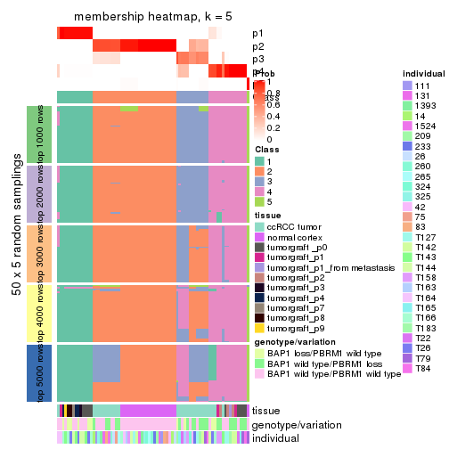</p>

</div>
<div id='tab-ATC-hclust-membership-heatmap-5'>
<pre><code class="r">membership_heatmap(res, k = 6)
</code></pre>

<p></p>

</div>
</div>

As soon as we have had the classes for columns, we can look for signatures
which are significantly different between classes which can be candidate marks
for certain classes. Following are the heatmaps for signatures.


Signature heatmaps where rows are scaled:


<script>
$( function() {
	$( '#tabs-ATC-hclust-get-signatures' ).tabs();
} );
</script>
<div id='tabs-ATC-hclust-get-signatures'>
<ul>
<li><a href='#tab-ATC-hclust-get-signatures-1'>k = 2</a></li>
<li><a href='#tab-ATC-hclust-get-signatures-2'>k = 3</a></li>
<li><a href='#tab-ATC-hclust-get-signatures-3'>k = 4</a></li>
<li><a href='#tab-ATC-hclust-get-signatures-4'>k = 5</a></li>
<li><a href='#tab-ATC-hclust-get-signatures-5'>k = 6</a></li>
</ul>
<div id='tab-ATC-hclust-get-signatures-1'>
<pre><code class="r">get_signatures(res, k = 2)
</code></pre>

<p></p>

</div>
<div id='tab-ATC-hclust-get-signatures-2'>
<pre><code class="r">get_signatures(res, k = 3)
</code></pre>

<p></p>

</div>
<div id='tab-ATC-hclust-get-signatures-3'>
<pre><code class="r">get_signatures(res, k = 4)
</code></pre>

<p></p>

</div>
<div id='tab-ATC-hclust-get-signatures-4'>
<pre><code class="r">get_signatures(res, k = 5)
</code></pre>

<p></p>

</div>
<div id='tab-ATC-hclust-get-signatures-5'>
<pre><code class="r">get_signatures(res, k = 6)
</code></pre>

<p></p>

</div>
</div>


Signature heatmaps where rows are not scaled:


<script>
$( function() {
	$( '#tabs-ATC-hclust-get-signatures-no-scale' ).tabs();
} );
</script>
<div id='tabs-ATC-hclust-get-signatures-no-scale'>
<ul>
<li><a href='#tab-ATC-hclust-get-signatures-no-scale-1'>k = 2</a></li>
<li><a href='#tab-ATC-hclust-get-signatures-no-scale-2'>k = 3</a></li>
<li><a href='#tab-ATC-hclust-get-signatures-no-scale-3'>k = 4</a></li>
<li><a href='#tab-ATC-hclust-get-signatures-no-scale-4'>k = 5</a></li>
<li><a href='#tab-ATC-hclust-get-signatures-no-scale-5'>k = 6</a></li>
</ul>
<div id='tab-ATC-hclust-get-signatures-no-scale-1'>
<pre><code class="r">get_signatures(res, k = 2, scale_rows = FALSE)
</code></pre>

<p></p>

</div>
<div id='tab-ATC-hclust-get-signatures-no-scale-2'>
<pre><code class="r">get_signatures(res, k = 3, scale_rows = FALSE)
</code></pre>

<p></p>

</div>
<div id='tab-ATC-hclust-get-signatures-no-scale-3'>
<pre><code class="r">get_signatures(res, k = 4, scale_rows = FALSE)
</code></pre>

<p></p>

</div>
<div id='tab-ATC-hclust-get-signatures-no-scale-4'>
<pre><code class="r">get_signatures(res, k = 5, scale_rows = FALSE)
</code></pre>

<p></p>

</div>
<div id='tab-ATC-hclust-get-signatures-no-scale-5'>
<pre><code class="r">get_signatures(res, k = 6, scale_rows = FALSE)
</code></pre>

<p></p>

</div>
</div>


Compare the overlap of signatures from different k:

```r
compare_signatures(res)
```

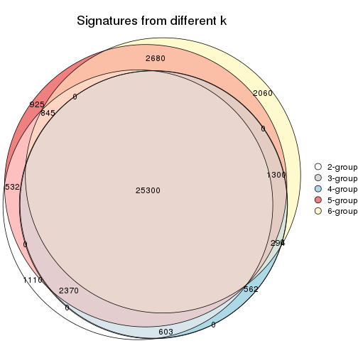

`get_signature()` returns a data frame invisibly. TO get the list of signatures, the function
call should be assigned to a variable explicitly. In following code, if `plot` argument is set
to `FALSE`, no heatmap is plotted while only the differential analysis is performed.

```r
# code only for demonstration
tb = get_signature(res, k = ..., plot = FALSE)
```

An example of the output of `tb` is:

```
#>   which_row         fdr    mean_1    mean_2 scaled_mean_1 scaled_mean_2 km
#> 1        38 0.042760348  8.373488  9.131774    -0.5533452     0.5164555  1
#> 2        40 0.018707592  7.106213  8.469186    -0.6173731     0.5762149  1
#> 3        55 0.019134737 10.221463 11.207825    -0.6159697     0.5749050  1
#> 4        59 0.006059896  5.921854  7.869574    -0.6899429     0.6439467  1
#> 5        60 0.018055526  8.928898 10.211722    -0.6204761     0.5791110  1
#> 6        98 0.009384629 15.714769 14.887706     0.6635654    -0.6193277  2
...
```

The columns in `tb` are:

1. `which_row`: row indices corresponding to the input matrix.
2. `fdr`: FDR for the differential test. 
3. `mean_x`: The mean value in group x.
4. `scaled_mean_x`: The mean value in group x after rows are scaled.
5. `km`: Row groups if k-means clustering is applied to rows.


UMAP plot which shows how samples are separated.


<script>
$( function() {
	$( '#tabs-ATC-hclust-dimension-reduction' ).tabs();
} );
</script>
<div id='tabs-ATC-hclust-dimension-reduction'>
<ul>
<li><a href='#tab-ATC-hclust-dimension-reduction-1'>k = 2</a></li>
<li><a href='#tab-ATC-hclust-dimension-reduction-2'>k = 3</a></li>
<li><a href='#tab-ATC-hclust-dimension-reduction-3'>k = 4</a></li>
<li><a href='#tab-ATC-hclust-dimension-reduction-4'>k = 5</a></li>
<li><a href='#tab-ATC-hclust-dimension-reduction-5'>k = 6</a></li>
</ul>
<div id='tab-ATC-hclust-dimension-reduction-1'>
<pre><code class="r">dimension_reduction(res, k = 2, method = &quot;UMAP&quot;)
</code></pre>

<p>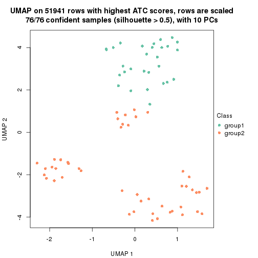</p>

</div>
<div id='tab-ATC-hclust-dimension-reduction-2'>
<pre><code class="r">dimension_reduction(res, k = 3, method = &quot;UMAP&quot;)
</code></pre>

<p></p>

</div>
<div id='tab-ATC-hclust-dimension-reduction-3'>
<pre><code class="r">dimension_reduction(res, k = 4, method = &quot;UMAP&quot;)
</code></pre>

<p>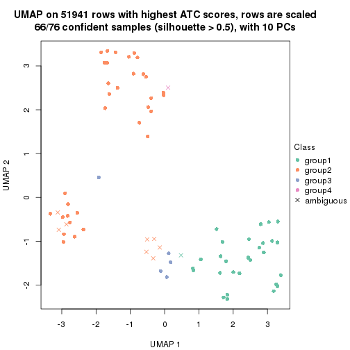</p>

</div>
<div id='tab-ATC-hclust-dimension-reduction-4'>
<pre><code class="r">dimension_reduction(res, k = 5, method = &quot;UMAP&quot;)
</code></pre>

<p></p>

</div>
<div id='tab-ATC-hclust-dimension-reduction-5'>
<pre><code class="r">dimension_reduction(res, k = 6, method = &quot;UMAP&quot;)
</code></pre>

<p></p>

</div>
</div>


Following heatmap shows how subgroups are split when increasing `k`:

```r
collect_classes(res)
```


Test correlation between subgroups and known annotations. If the known
annotation is numeric, one-way ANOVA test is applied, and if the known
annotation is discrete, chi-squared contingency table test is applied.

```r
test_to_known_factors(res)
```

```
#>             n tissue(p) genotype/variation(p) individual(p) k
#> ATC:hclust 76  7.07e-09              1.08e-02        0.0399 2
#> ATC:hclust 66  1.14e-06              1.17e-03        0.0758 3
#> ATC:hclust 66  1.14e-06              1.17e-03        0.0758 4
#> ATC:hclust 67  1.87e-08              1.50e-06        0.1491 5
#> ATC:hclust 51  1.84e-08              3.77e-07        0.3967 6
```


If matrix rows can be associated to genes, consider to use `functional_enrichment(res,
...)` to perform function enrichment for the signature genes. See [this vignette](http://bioconductor.org/packages/devel/bioc/vignettes/cola/inst/doc/functional_enrichment.html) for more detailed explanations.


 

---------------------------------------------------


### ATC:kmeans**


The object with results only for a single top-value method and a single partition method 
can be extracted as:

```r
res = res_list["ATC", "kmeans"]
# you can also extract it by
# res = res_list["ATC:kmeans"]
```

A summary of `res` and all the functions that can be applied to it:

```r
res
```

```
#> A 'ConsensusPartition' object with k = 2, 3, 4, 5, 6.
#>   On a matrix with 51941 rows and 76 columns.
#>   Top rows (1000, 2000, 3000, 4000, 5000) are extracted by 'ATC' method.
#>   Subgroups are detected by 'kmeans' method.
#>   Performed in total 1250 partitions by row resampling.
#>   Best k for subgroups seems to be 2.
#> 
#> Following methods can be applied to this 'ConsensusPartition' object:
#>  [1] "cola_report"             "collect_classes"         "collect_plots"          
#>  [4] "collect_stats"           "colnames"                "compare_signatures"     
#>  [7] "consensus_heatmap"       "dimension_reduction"     "functional_enrichment"  
#> [10] "get_anno_col"            "get_anno"                "get_classes"            
#> [13] "get_consensus"           "get_matrix"              "get_membership"         
#> [16] "get_param"               "get_signatures"          "get_stats"              
#> [19] "is_best_k"               "is_stable_k"             "membership_heatmap"     
#> [22] "ncol"                    "nrow"                    "plot_ecdf"              
#> [25] "rownames"                "select_partition_number" "show"                   
#> [28] "suggest_best_k"          "test_to_known_factors"
```

`collect_plots()` function collects all the plots made from `res` for all `k` (number of partitions)
into one single page to provide an easy and fast comparison between different `k`.

```r
collect_plots(res)
```


The plots are:

- The first row: a plot of the ECDF (empirical cumulative distribution
  function) curves of the consensus matrix for each `k` and the heatmap of
  predicted classes for each `k`.
- The second row: heatmaps of the consensus matrix for each `k`.
- The third row: heatmaps of the membership matrix for each `k`.
- The fouth row: heatmaps of the signatures for each `k`.

All the plots in panels can be made by individual functions and they are
plotted later in this section.

`select_partition_number()` produces several plots showing different
statistics for choosing "optimized" `k`. There are following statistics:

- ECDF curves of the consensus matrix for each `k`;
- 1-PAC. [The PAC
  score](https://en.wikipedia.org/wiki/Consensus_clustering#Over-interpretation_potential_of_consensus_clustering)
  measures the proportion of the ambiguous subgrouping.
- Mean silhouette score.
- Concordance. The mean probability of fiting the consensus class ids in all
  partitions.
- Area increased. Denote $A_k$ as the area under the ECDF curve for current
  `k`, the area increased is defined as $A_k - A_{k-1}$.
- Rand index. The percent of pairs of samples that are both in a same cluster
  or both are not in a same cluster in the partition of k and k-1.
- Jaccard index. The ratio of pairs of samples are both in a same cluster in
  the partition of k and k-1 and the pairs of samples are both in a same
  cluster in the partition k or k-1.

The detailed explanations of these statistics can be found in [the _cola_
vignette](http://bioconductor.org/packages/devel/bioc/vignettes/cola/inst/doc/cola.html#toc_13).

Generally speaking, lower PAC score, higher mean silhouette score or higher
concordance corresponds to better partition. Rand index and Jaccard index
measure how similar the current partition is compared to partition with `k-1`.
If they are too similar, we won't accept `k` is better than `k-1`.

```r
select_partition_number(res)
```


The numeric values for all these statistics can be obtained by `get_stats()`.

```r
get_stats(res)
```

```
#>   k 1-PAC mean_silhouette concordance area_increased  Rand Jaccard
#> 2 2 1.000           0.989       0.995         0.4889 0.511   0.511
#> 3 3 0.660           0.736       0.868         0.3317 0.828   0.670
#> 4 4 0.687           0.411       0.669         0.1184 0.876   0.688
#> 5 5 0.694           0.808       0.798         0.0704 0.818   0.469
#> 6 6 0.755           0.858       0.835         0.0451 0.957   0.788
```

`suggest_best_k()` suggests the best $k$ based on these statistics. The rules are as follows:

- All $k$ with Jaccard index larger than 0.95 are removed because increasing
  $k$ does not provide enough extra information. If all $k$ are removed, it is
  marked as no subgroup is detected.
- For all $k$ with 1-PAC score larger than 0.9, the maximal $k$ is taken as
  the best $k$, and other $k$ are marked as optional $k$.
- If it does not fit the second rule. The $k$ with the maximal vote of the
  highest 1-PAC score, highest mean silhouette, and highest concordance is
  taken as the best $k$.

```r
suggest_best_k(res)
```

```
#> [1] 2
```


Following shows the table of the partitions (You need to click the **show/hide
code output** link to see it). The membership matrix (columns with name `p*`)
is inferred by
[`clue::cl_consensus()`](https://www.rdocumentation.org/link/cl_consensus?package=clue)
function with the `SE` method. Basically the value in the membership matrix
represents the probability to belong to a certain group. The finall class
label for an item is determined with the group with highest probability it
belongs to.

In `get_classes()` function, the entropy is calculated from the membership
matrix and the silhouette score is calculated from the consensus matrix.


<script>
$( function() {
	$( '#tabs-ATC-kmeans-get-classes' ).tabs();
} );
</script>
<div id='tabs-ATC-kmeans-get-classes'>
<ul>
<li><a href='#tab-ATC-kmeans-get-classes-1'>k = 2</a></li>
<li><a href='#tab-ATC-kmeans-get-classes-2'>k = 3</a></li>
<li><a href='#tab-ATC-kmeans-get-classes-3'>k = 4</a></li>
<li><a href='#tab-ATC-kmeans-get-classes-4'>k = 5</a></li>
<li><a href='#tab-ATC-kmeans-get-classes-5'>k = 6</a></li>
</ul>

<div id='tab-ATC-kmeans-get-classes-1'>
<p><a id='tab-ATC-kmeans-get-classes-1-a' style='color:#0366d6' href='#'>show/hide code output</a></p>
<pre><code class="r">cbind(get_classes(res, k = 2), get_membership(res, k = 2))
</code></pre>

<pre><code>#&gt;           class entropy silhouette    p1    p2
#&gt; GSM905004     2  0.0672      0.990 0.008 0.992
#&gt; GSM905024     1  0.0000      0.991 1.000 0.000
#&gt; GSM905038     2  0.0000      0.998 0.000 1.000
#&gt; GSM905043     1  0.0000      0.991 1.000 0.000
#&gt; GSM904986     2  0.0000      0.998 0.000 1.000
#&gt; GSM904991     2  0.0000      0.998 0.000 1.000
#&gt; GSM904994     2  0.0000      0.998 0.000 1.000
#&gt; GSM904996     2  0.0000      0.998 0.000 1.000
#&gt; GSM905007     2  0.0000      0.998 0.000 1.000
#&gt; GSM905012     2  0.0000      0.998 0.000 1.000
#&gt; GSM905022     2  0.0000      0.998 0.000 1.000
#&gt; GSM905026     2  0.0000      0.998 0.000 1.000
#&gt; GSM905027     2  0.0000      0.998 0.000 1.000
#&gt; GSM905031     2  0.0000      0.998 0.000 1.000
#&gt; GSM905036     1  0.8443      0.624 0.728 0.272
#&gt; GSM905041     1  0.0000      0.991 1.000 0.000
#&gt; GSM905044     2  0.0000      0.998 0.000 1.000
#&gt; GSM904989     2  0.0000      0.998 0.000 1.000
#&gt; GSM904999     2  0.0000      0.998 0.000 1.000
#&gt; GSM905002     2  0.0000      0.998 0.000 1.000
#&gt; GSM905009     2  0.0000      0.998 0.000 1.000
#&gt; GSM905014     2  0.0000      0.998 0.000 1.000
#&gt; GSM905017     2  0.0000      0.998 0.000 1.000
#&gt; GSM905020     2  0.0000      0.998 0.000 1.000
#&gt; GSM905023     2  0.4022      0.912 0.080 0.920
#&gt; GSM905029     2  0.0000      0.998 0.000 1.000
#&gt; GSM905032     1  0.0000      0.991 1.000 0.000
#&gt; GSM905034     1  0.0000      0.991 1.000 0.000
#&gt; GSM905040     1  0.0000      0.991 1.000 0.000
#&gt; GSM904985     2  0.0000      0.998 0.000 1.000
#&gt; GSM904988     2  0.0000      0.998 0.000 1.000
#&gt; GSM904990     2  0.0000      0.998 0.000 1.000
#&gt; GSM904992     2  0.0000      0.998 0.000 1.000
#&gt; GSM904995     2  0.0000      0.998 0.000 1.000
#&gt; GSM904998     2  0.0000      0.998 0.000 1.000
#&gt; GSM905000     2  0.0000      0.998 0.000 1.000
#&gt; GSM905003     2  0.0000      0.998 0.000 1.000
#&gt; GSM905006     2  0.0000      0.998 0.000 1.000
#&gt; GSM905008     2  0.0000      0.998 0.000 1.000
#&gt; GSM905011     2  0.0000      0.998 0.000 1.000
#&gt; GSM905013     2  0.0000      0.998 0.000 1.000
#&gt; GSM905016     2  0.0000      0.998 0.000 1.000
#&gt; GSM905018     2  0.0000      0.998 0.000 1.000
#&gt; GSM905021     2  0.0000      0.998 0.000 1.000
#&gt; GSM905025     2  0.0000      0.998 0.000 1.000
#&gt; GSM905028     2  0.0000      0.998 0.000 1.000
#&gt; GSM905030     2  0.0000      0.998 0.000 1.000
#&gt; GSM905033     2  0.0000      0.998 0.000 1.000
#&gt; GSM905035     2  0.0000      0.998 0.000 1.000
#&gt; GSM905037     2  0.0000      0.998 0.000 1.000
#&gt; GSM905039     2  0.0000      0.998 0.000 1.000
#&gt; GSM905042     2  0.0000      0.998 0.000 1.000
#&gt; GSM905046     1  0.0000      0.991 1.000 0.000
#&gt; GSM905065     1  0.0000      0.991 1.000 0.000
#&gt; GSM905049     1  0.0000      0.991 1.000 0.000
#&gt; GSM905050     1  0.0000      0.991 1.000 0.000
#&gt; GSM905064     1  0.0000      0.991 1.000 0.000
#&gt; GSM905045     1  0.0000      0.991 1.000 0.000
#&gt; GSM905051     1  0.0000      0.991 1.000 0.000
#&gt; GSM905055     1  0.0000      0.991 1.000 0.000
#&gt; GSM905058     1  0.0000      0.991 1.000 0.000
#&gt; GSM905053     1  0.0000      0.991 1.000 0.000
#&gt; GSM905061     1  0.0000      0.991 1.000 0.000
#&gt; GSM905063     1  0.0000      0.991 1.000 0.000
#&gt; GSM905054     1  0.0000      0.991 1.000 0.000
#&gt; GSM905062     1  0.0000      0.991 1.000 0.000
#&gt; GSM905052     1  0.0000      0.991 1.000 0.000
#&gt; GSM905059     1  0.0000      0.991 1.000 0.000
#&gt; GSM905047     1  0.0000      0.991 1.000 0.000
#&gt; GSM905066     1  0.0000      0.991 1.000 0.000
#&gt; GSM905056     1  0.0000      0.991 1.000 0.000
#&gt; GSM905060     1  0.0000      0.991 1.000 0.000
#&gt; GSM905048     1  0.0000      0.991 1.000 0.000
#&gt; GSM905067     1  0.0000      0.991 1.000 0.000
#&gt; GSM905057     1  0.0000      0.991 1.000 0.000
#&gt; GSM905068     1  0.0000      0.991 1.000 0.000
</code></pre>

<script>
$('#tab-ATC-kmeans-get-classes-1-a').parent().next().next().hide();
$('#tab-ATC-kmeans-get-classes-1-a').click(function(){
  $('#tab-ATC-kmeans-get-classes-1-a').parent().next().next().toggle();
  return(false);
});
</script>
</div>

<div id='tab-ATC-kmeans-get-classes-2'>
<p><a id='tab-ATC-kmeans-get-classes-2-a' style='color:#0366d6' href='#'>show/hide code output</a></p>
<pre><code class="r">cbind(get_classes(res, k = 3), get_membership(res, k = 3))
</code></pre>

<pre><code>#&gt;           class entropy silhouette    p1    p2    p3
#&gt; GSM905004     3  0.0000      0.800 0.000 0.000 1.000
#&gt; GSM905024     1  0.5650      0.744 0.688 0.000 0.312
#&gt; GSM905038     3  0.0000      0.800 0.000 0.000 1.000
#&gt; GSM905043     1  0.5650      0.744 0.688 0.000 0.312
#&gt; GSM904986     2  0.5882      0.581 0.000 0.652 0.348
#&gt; GSM904991     3  0.2448      0.788 0.000 0.076 0.924
#&gt; GSM904994     2  0.5882      0.581 0.000 0.652 0.348
#&gt; GSM904996     2  0.5882      0.581 0.000 0.652 0.348
#&gt; GSM905007     3  0.4452      0.712 0.000 0.192 0.808
#&gt; GSM905012     2  0.5882      0.581 0.000 0.652 0.348
#&gt; GSM905022     2  0.5882      0.581 0.000 0.652 0.348
#&gt; GSM905026     3  0.4452      0.712 0.000 0.192 0.808
#&gt; GSM905027     3  0.3412      0.767 0.000 0.124 0.876
#&gt; GSM905031     3  0.4452      0.712 0.000 0.192 0.808
#&gt; GSM905036     3  0.0000      0.800 0.000 0.000 1.000
#&gt; GSM905041     3  0.3192      0.664 0.112 0.000 0.888
#&gt; GSM905044     3  0.4452      0.712 0.000 0.192 0.808
#&gt; GSM904989     2  0.5882      0.581 0.000 0.652 0.348
#&gt; GSM904999     2  0.5882      0.581 0.000 0.652 0.348
#&gt; GSM905002     2  0.5882      0.581 0.000 0.652 0.348
#&gt; GSM905009     2  0.5882      0.581 0.000 0.652 0.348
#&gt; GSM905014     3  0.5650      0.429 0.000 0.312 0.688
#&gt; GSM905017     2  0.5882      0.581 0.000 0.652 0.348
#&gt; GSM905020     2  0.5882      0.581 0.000 0.652 0.348
#&gt; GSM905023     3  0.0000      0.800 0.000 0.000 1.000
#&gt; GSM905029     3  0.0000      0.800 0.000 0.000 1.000
#&gt; GSM905032     3  0.6062     -0.122 0.384 0.000 0.616
#&gt; GSM905034     1  0.0000      0.870 1.000 0.000 0.000
#&gt; GSM905040     1  0.0000      0.870 1.000 0.000 0.000
#&gt; GSM904985     2  0.0000      0.812 0.000 1.000 0.000
#&gt; GSM904988     2  0.0000      0.812 0.000 1.000 0.000
#&gt; GSM904990     2  0.0000      0.812 0.000 1.000 0.000
#&gt; GSM904992     2  0.0000      0.812 0.000 1.000 0.000
#&gt; GSM904995     2  0.0000      0.812 0.000 1.000 0.000
#&gt; GSM904998     2  0.0000      0.812 0.000 1.000 0.000
#&gt; GSM905000     2  0.0000      0.812 0.000 1.000 0.000
#&gt; GSM905003     2  0.0000      0.812 0.000 1.000 0.000
#&gt; GSM905006     2  0.0000      0.812 0.000 1.000 0.000
#&gt; GSM905008     2  0.0000      0.812 0.000 1.000 0.000
#&gt; GSM905011     2  0.0000      0.812 0.000 1.000 0.000
#&gt; GSM905013     2  0.0000      0.812 0.000 1.000 0.000
#&gt; GSM905016     2  0.0000      0.812 0.000 1.000 0.000
#&gt; GSM905018     2  0.0000      0.812 0.000 1.000 0.000
#&gt; GSM905021     2  0.0000      0.812 0.000 1.000 0.000
#&gt; GSM905025     2  0.6280     -0.100 0.000 0.540 0.460
#&gt; GSM905028     2  0.0000      0.812 0.000 1.000 0.000
#&gt; GSM905030     2  0.0237      0.810 0.000 0.996 0.004
#&gt; GSM905033     2  0.1753      0.791 0.000 0.952 0.048
#&gt; GSM905035     2  0.0237      0.810 0.000 0.996 0.004
#&gt; GSM905037     2  0.0000      0.812 0.000 1.000 0.000
#&gt; GSM905039     2  0.0237      0.810 0.000 0.996 0.004
#&gt; GSM905042     2  0.6302      0.263 0.000 0.520 0.480
#&gt; GSM905046     1  0.0000      0.870 1.000 0.000 0.000
#&gt; GSM905065     1  0.0000      0.870 1.000 0.000 0.000
#&gt; GSM905049     1  0.5650      0.744 0.688 0.000 0.312
#&gt; GSM905050     1  0.6140      0.607 0.596 0.000 0.404
#&gt; GSM905064     1  0.3816      0.835 0.852 0.000 0.148
#&gt; GSM905045     1  0.5560      0.752 0.700 0.000 0.300
#&gt; GSM905051     1  0.5650      0.744 0.688 0.000 0.312
#&gt; GSM905055     1  0.0000      0.870 1.000 0.000 0.000
#&gt; GSM905058     1  0.0000      0.870 1.000 0.000 0.000
#&gt; GSM905053     1  0.5650      0.744 0.688 0.000 0.312
#&gt; GSM905061     1  0.2448      0.855 0.924 0.000 0.076
#&gt; GSM905063     1  0.0000      0.870 1.000 0.000 0.000
#&gt; GSM905054     1  0.3816      0.835 0.852 0.000 0.148
#&gt; GSM905062     1  0.3686      0.838 0.860 0.000 0.140
#&gt; GSM905052     1  0.5650      0.744 0.688 0.000 0.312
#&gt; GSM905059     1  0.0000      0.870 1.000 0.000 0.000
#&gt; GSM905047     1  0.0000      0.870 1.000 0.000 0.000
#&gt; GSM905066     1  0.0000      0.870 1.000 0.000 0.000
#&gt; GSM905056     1  0.0000      0.870 1.000 0.000 0.000
#&gt; GSM905060     1  0.0000      0.870 1.000 0.000 0.000
#&gt; GSM905048     1  0.0000      0.870 1.000 0.000 0.000
#&gt; GSM905067     1  0.0000      0.870 1.000 0.000 0.000
#&gt; GSM905057     1  0.0000      0.870 1.000 0.000 0.000
#&gt; GSM905068     1  0.5650      0.744 0.688 0.000 0.312
</code></pre>

<script>
$('#tab-ATC-kmeans-get-classes-2-a').parent().next().next().hide();
$('#tab-ATC-kmeans-get-classes-2-a').click(function(){
  $('#tab-ATC-kmeans-get-classes-2-a').parent().next().next().toggle();
  return(false);
});
</script>
</div>

<div id='tab-ATC-kmeans-get-classes-3'>
<p><a id='tab-ATC-kmeans-get-classes-3-a' style='color:#0366d6' href='#'>show/hide code output</a></p>
<pre><code class="r">cbind(get_classes(res, k = 4), get_membership(res, k = 4))
</code></pre>

<pre><code>#&gt;           class entropy silhouette    p1    p2    p3    p4
#&gt; GSM905004     3  0.1042      0.764 0.000 0.020 0.972 0.008
#&gt; GSM905024     1  0.7456      0.630 0.508 0.000 0.256 0.236
#&gt; GSM905038     3  0.3311      0.777 0.000 0.172 0.828 0.000
#&gt; GSM905043     1  0.7456      0.630 0.508 0.000 0.256 0.236
#&gt; GSM904986     2  0.1557      0.381 0.000 0.944 0.056 0.000
#&gt; GSM904991     2  0.4999     -0.434 0.000 0.508 0.492 0.000
#&gt; GSM904994     2  0.1637      0.380 0.000 0.940 0.060 0.000
#&gt; GSM904996     2  0.1557      0.381 0.000 0.944 0.056 0.000
#&gt; GSM905007     2  0.4985     -0.396 0.000 0.532 0.468 0.000
#&gt; GSM905012     2  0.1637      0.380 0.000 0.940 0.060 0.000
#&gt; GSM905022     2  0.1557      0.381 0.000 0.944 0.056 0.000
#&gt; GSM905026     3  0.4630      0.763 0.000 0.196 0.768 0.036
#&gt; GSM905027     3  0.3937      0.770 0.000 0.188 0.800 0.012
#&gt; GSM905031     3  0.4630      0.763 0.000 0.196 0.768 0.036
#&gt; GSM905036     3  0.0937      0.753 0.000 0.012 0.976 0.012
#&gt; GSM905041     3  0.3272      0.665 0.032 0.008 0.884 0.076
#&gt; GSM905044     3  0.4781      0.749 0.000 0.212 0.752 0.036
#&gt; GSM904989     2  0.1637      0.380 0.000 0.940 0.060 0.000
#&gt; GSM904999     2  0.1557      0.381 0.000 0.944 0.056 0.000
#&gt; GSM905002     2  0.1557      0.381 0.000 0.944 0.056 0.000
#&gt; GSM905009     2  0.1637      0.380 0.000 0.940 0.060 0.000
#&gt; GSM905014     2  0.4977     -0.383 0.000 0.540 0.460 0.000
#&gt; GSM905017     2  0.1557      0.381 0.000 0.944 0.056 0.000
#&gt; GSM905020     2  0.1557      0.381 0.000 0.944 0.056 0.000
#&gt; GSM905023     3  0.0469      0.760 0.000 0.012 0.988 0.000
#&gt; GSM905029     3  0.3311      0.777 0.000 0.172 0.828 0.000
#&gt; GSM905032     3  0.6618      0.169 0.124 0.000 0.604 0.272
#&gt; GSM905034     1  0.0817      0.737 0.976 0.000 0.000 0.024
#&gt; GSM905040     1  0.0592      0.738 0.984 0.000 0.000 0.016
#&gt; GSM904985     2  0.4999     -0.338 0.000 0.508 0.000 0.492
#&gt; GSM904988     2  0.5000     -0.349 0.000 0.504 0.000 0.496
#&gt; GSM904990     2  0.5000     -0.349 0.000 0.504 0.000 0.496
#&gt; GSM904992     2  0.5000     -0.349 0.000 0.504 0.000 0.496
#&gt; GSM904995     2  0.4999     -0.338 0.000 0.508 0.000 0.492
#&gt; GSM904998     2  0.4999     -0.338 0.000 0.508 0.000 0.492
#&gt; GSM905000     2  0.4999     -0.338 0.000 0.508 0.000 0.492
#&gt; GSM905003     2  0.4999     -0.338 0.000 0.508 0.000 0.492
#&gt; GSM905006     2  0.5000     -0.349 0.000 0.504 0.000 0.496
#&gt; GSM905008     2  0.4999     -0.338 0.000 0.508 0.000 0.492
#&gt; GSM905011     2  0.5000     -0.349 0.000 0.504 0.000 0.496
#&gt; GSM905013     2  0.4999     -0.338 0.000 0.508 0.000 0.492
#&gt; GSM905016     2  0.4999     -0.338 0.000 0.508 0.000 0.492
#&gt; GSM905018     2  0.4999     -0.338 0.000 0.508 0.000 0.492
#&gt; GSM905021     2  0.4999     -0.338 0.000 0.508 0.000 0.492
#&gt; GSM905025     3  0.5271      0.499 0.000 0.020 0.640 0.340
#&gt; GSM905028     4  0.5322      0.910 0.000 0.312 0.028 0.660
#&gt; GSM905030     4  0.5972      0.943 0.000 0.304 0.064 0.632
#&gt; GSM905033     4  0.6156      0.861 0.000 0.344 0.064 0.592
#&gt; GSM905035     4  0.5972      0.943 0.000 0.304 0.064 0.632
#&gt; GSM905037     4  0.5322      0.910 0.000 0.312 0.028 0.660
#&gt; GSM905039     4  0.5972      0.943 0.000 0.304 0.064 0.632
#&gt; GSM905042     3  0.7476      0.395 0.000 0.236 0.504 0.260
#&gt; GSM905046     1  0.0000      0.742 1.000 0.000 0.000 0.000
#&gt; GSM905065     1  0.0188      0.742 0.996 0.000 0.000 0.004
#&gt; GSM905049     1  0.7540      0.637 0.480 0.000 0.216 0.304
#&gt; GSM905050     1  0.7902      0.480 0.368 0.000 0.328 0.304
#&gt; GSM905064     1  0.7300      0.655 0.516 0.000 0.180 0.304
#&gt; GSM905045     1  0.7540      0.637 0.480 0.000 0.216 0.304
#&gt; GSM905051     1  0.7540      0.637 0.480 0.000 0.216 0.304
#&gt; GSM905055     1  0.0336      0.741 0.992 0.000 0.000 0.008
#&gt; GSM905058     1  0.0188      0.742 0.996 0.000 0.000 0.004
#&gt; GSM905053     1  0.7540      0.637 0.480 0.000 0.216 0.304
#&gt; GSM905061     1  0.7205      0.660 0.528 0.000 0.168 0.304
#&gt; GSM905063     1  0.0817      0.737 0.976 0.000 0.000 0.024
#&gt; GSM905054     1  0.7270      0.657 0.520 0.000 0.176 0.304
#&gt; GSM905062     1  0.7270      0.657 0.520 0.000 0.176 0.304
#&gt; GSM905052     1  0.7540      0.637 0.480 0.000 0.216 0.304
#&gt; GSM905059     1  0.0188      0.742 0.996 0.000 0.000 0.004
#&gt; GSM905047     1  0.0000      0.742 1.000 0.000 0.000 0.000
#&gt; GSM905066     1  0.0817      0.737 0.976 0.000 0.000 0.024
#&gt; GSM905056     1  0.0336      0.741 0.992 0.000 0.000 0.008
#&gt; GSM905060     1  0.0188      0.742 0.996 0.000 0.000 0.004
#&gt; GSM905048     1  0.0000      0.742 1.000 0.000 0.000 0.000
#&gt; GSM905067     1  0.0188      0.742 0.996 0.000 0.000 0.004
#&gt; GSM905057     1  0.0336      0.741 0.992 0.000 0.000 0.008
#&gt; GSM905068     1  0.7563      0.633 0.476 0.000 0.220 0.304
</code></pre>

<script>
$('#tab-ATC-kmeans-get-classes-3-a').parent().next().next().hide();
$('#tab-ATC-kmeans-get-classes-3-a').click(function(){
  $('#tab-ATC-kmeans-get-classes-3-a').parent().next().next().toggle();
  return(false);
});
</script>
</div>

<div id='tab-ATC-kmeans-get-classes-4'>
<p><a id='tab-ATC-kmeans-get-classes-4-a' style='color:#0366d6' href='#'>show/hide code output</a></p>
<pre><code class="r">cbind(get_classes(res, k = 5), get_membership(res, k = 5))
</code></pre>

<pre><code>#&gt;           class entropy silhouette    p1    p2    p3    p4    p5
#&gt; GSM905004     5  0.4114      0.701 0.000 0.000 0.024 0.244 0.732
#&gt; GSM905024     4  0.7365      0.625 0.304 0.000 0.076 0.480 0.140
#&gt; GSM905038     5  0.3759      0.775 0.000 0.000 0.136 0.056 0.808
#&gt; GSM905043     4  0.7365      0.625 0.304 0.000 0.076 0.480 0.140
#&gt; GSM904986     3  0.3750      0.907 0.000 0.232 0.756 0.012 0.000
#&gt; GSM904991     3  0.4295      0.558 0.000 0.004 0.724 0.024 0.248
#&gt; GSM904994     3  0.3366      0.910 0.000 0.232 0.768 0.000 0.000
#&gt; GSM904996     3  0.3366      0.910 0.000 0.232 0.768 0.000 0.000
#&gt; GSM905007     3  0.4096      0.584 0.000 0.004 0.744 0.020 0.232
#&gt; GSM905012     3  0.3366      0.910 0.000 0.232 0.768 0.000 0.000
#&gt; GSM905022     3  0.3750      0.907 0.000 0.232 0.756 0.012 0.000
#&gt; GSM905026     5  0.3044      0.770 0.000 0.004 0.148 0.008 0.840
#&gt; GSM905027     5  0.3170      0.764 0.000 0.004 0.160 0.008 0.828
#&gt; GSM905031     5  0.3044      0.770 0.000 0.004 0.148 0.008 0.840
#&gt; GSM905036     5  0.3663      0.702 0.000 0.000 0.016 0.208 0.776
#&gt; GSM905041     5  0.5218      0.504 0.000 0.000 0.068 0.308 0.624
#&gt; GSM905044     5  0.2970      0.756 0.000 0.004 0.168 0.000 0.828
#&gt; GSM904989     3  0.3366      0.910 0.000 0.232 0.768 0.000 0.000
#&gt; GSM904999     3  0.3750      0.907 0.000 0.232 0.756 0.012 0.000
#&gt; GSM905002     3  0.3366      0.910 0.000 0.232 0.768 0.000 0.000
#&gt; GSM905009     3  0.3366      0.910 0.000 0.232 0.768 0.000 0.000
#&gt; GSM905014     3  0.4158      0.595 0.000 0.008 0.748 0.020 0.224
#&gt; GSM905017     3  0.3750      0.907 0.000 0.232 0.756 0.012 0.000
#&gt; GSM905020     3  0.3366      0.910 0.000 0.232 0.768 0.000 0.000
#&gt; GSM905023     5  0.3596      0.709 0.000 0.000 0.016 0.200 0.784
#&gt; GSM905029     5  0.3649      0.770 0.000 0.000 0.152 0.040 0.808
#&gt; GSM905032     4  0.5115      0.283 0.012 0.000 0.028 0.608 0.352
#&gt; GSM905034     1  0.3516      0.870 0.836 0.000 0.108 0.004 0.052
#&gt; GSM905040     1  0.2103      0.933 0.920 0.000 0.056 0.004 0.020
#&gt; GSM904985     2  0.0324      0.850 0.000 0.992 0.004 0.004 0.000
#&gt; GSM904988     2  0.0000      0.851 0.000 1.000 0.000 0.000 0.000
#&gt; GSM904990     2  0.0000      0.851 0.000 1.000 0.000 0.000 0.000
#&gt; GSM904992     2  0.0000      0.851 0.000 1.000 0.000 0.000 0.000
#&gt; GSM904995     2  0.0324      0.850 0.000 0.992 0.004 0.004 0.000
#&gt; GSM904998     2  0.0162      0.851 0.000 0.996 0.004 0.000 0.000
#&gt; GSM905000     2  0.0162      0.851 0.000 0.996 0.004 0.000 0.000
#&gt; GSM905003     2  0.0162      0.851 0.000 0.996 0.004 0.000 0.000
#&gt; GSM905006     2  0.0000      0.851 0.000 1.000 0.000 0.000 0.000
#&gt; GSM905008     2  0.0162      0.851 0.000 0.996 0.004 0.000 0.000
#&gt; GSM905011     2  0.0000      0.851 0.000 1.000 0.000 0.000 0.000
#&gt; GSM905013     2  0.0162      0.851 0.000 0.996 0.004 0.000 0.000
#&gt; GSM905016     2  0.0324      0.850 0.000 0.992 0.004 0.004 0.000
#&gt; GSM905018     2  0.0162      0.851 0.000 0.996 0.004 0.000 0.000
#&gt; GSM905021     2  0.1300      0.818 0.000 0.956 0.028 0.016 0.000
#&gt; GSM905025     5  0.6566      0.480 0.000 0.104 0.084 0.192 0.620
#&gt; GSM905028     2  0.6849      0.614 0.000 0.592 0.076 0.168 0.164
#&gt; GSM905030     2  0.7081      0.580 0.000 0.560 0.076 0.168 0.196
#&gt; GSM905033     2  0.7344      0.555 0.000 0.540 0.104 0.168 0.188
#&gt; GSM905035     2  0.7081      0.580 0.000 0.560 0.076 0.168 0.196
#&gt; GSM905037     2  0.6912      0.606 0.000 0.584 0.076 0.168 0.172
#&gt; GSM905039     2  0.7081      0.580 0.000 0.560 0.076 0.168 0.196
#&gt; GSM905042     5  0.7138      0.427 0.000 0.140 0.120 0.168 0.572
#&gt; GSM905046     1  0.0807      0.951 0.976 0.000 0.012 0.000 0.012
#&gt; GSM905065     1  0.0671      0.951 0.980 0.000 0.016 0.000 0.004
#&gt; GSM905049     4  0.3424      0.886 0.240 0.000 0.000 0.760 0.000
#&gt; GSM905050     4  0.4134      0.851 0.196 0.000 0.000 0.760 0.044
#&gt; GSM905064     4  0.3766      0.872 0.268 0.000 0.000 0.728 0.004
#&gt; GSM905045     4  0.3424      0.886 0.240 0.000 0.000 0.760 0.000
#&gt; GSM905051     4  0.3579      0.886 0.240 0.000 0.004 0.756 0.000
#&gt; GSM905055     1  0.0880      0.947 0.968 0.000 0.032 0.000 0.000
#&gt; GSM905058     1  0.0912      0.951 0.972 0.000 0.012 0.000 0.016
#&gt; GSM905053     4  0.3424      0.886 0.240 0.000 0.000 0.760 0.000
#&gt; GSM905061     4  0.3814      0.865 0.276 0.000 0.000 0.720 0.004
#&gt; GSM905063     1  0.2464      0.922 0.904 0.000 0.048 0.004 0.044
#&gt; GSM905054     4  0.3661      0.867 0.276 0.000 0.000 0.724 0.000
#&gt; GSM905062     4  0.3814      0.865 0.276 0.000 0.000 0.720 0.004
#&gt; GSM905052     4  0.3579      0.886 0.240 0.000 0.004 0.756 0.000
#&gt; GSM905059     1  0.0912      0.951 0.972 0.000 0.012 0.000 0.016
#&gt; GSM905047     1  0.0807      0.951 0.976 0.000 0.012 0.000 0.012
#&gt; GSM905066     1  0.2464      0.922 0.904 0.000 0.048 0.004 0.044
#&gt; GSM905056     1  0.0880      0.947 0.968 0.000 0.032 0.000 0.000
#&gt; GSM905060     1  0.1403      0.949 0.952 0.000 0.024 0.000 0.024
#&gt; GSM905048     1  0.0579      0.953 0.984 0.000 0.008 0.000 0.008
#&gt; GSM905067     1  0.0671      0.951 0.980 0.000 0.016 0.000 0.004
#&gt; GSM905057     1  0.0880      0.947 0.968 0.000 0.032 0.000 0.000
#&gt; GSM905068     4  0.3424      0.886 0.240 0.000 0.000 0.760 0.000
</code></pre>

<script>
$('#tab-ATC-kmeans-get-classes-4-a').parent().next().next().hide();
$('#tab-ATC-kmeans-get-classes-4-a').click(function(){
  $('#tab-ATC-kmeans-get-classes-4-a').parent().next().next().toggle();
  return(false);
});
</script>
</div>

<div id='tab-ATC-kmeans-get-classes-5'>
<p><a id='tab-ATC-kmeans-get-classes-5-a' style='color:#0366d6' href='#'>show/hide code output</a></p>
<pre><code class="r">cbind(get_classes(res, k = 6), get_membership(res, k = 6))
</code></pre>

<pre><code>#&gt;           class entropy silhouette    p1    p2    p3    p4    p5    p6
#&gt; GSM905004     5  0.4389      0.796 0.048 0.104 0.004 0.052 0.784 0.008
#&gt; GSM905024     4  0.6936      0.448 0.108 0.248 0.000 0.500 0.136 0.008
#&gt; GSM905038     5  0.1398      0.920 0.000 0.000 0.052 0.000 0.940 0.008
#&gt; GSM905043     4  0.6936      0.448 0.108 0.248 0.000 0.500 0.136 0.008
#&gt; GSM904986     3  0.0951      0.901 0.004 0.020 0.968 0.000 0.000 0.008
#&gt; GSM904991     3  0.5233      0.531 0.028 0.076 0.632 0.000 0.264 0.000
#&gt; GSM904994     3  0.0748      0.906 0.000 0.016 0.976 0.000 0.004 0.004
#&gt; GSM904996     3  0.0146      0.907 0.000 0.000 0.996 0.000 0.000 0.004
#&gt; GSM905007     3  0.4710      0.664 0.028 0.076 0.716 0.000 0.180 0.000
#&gt; GSM905012     3  0.0458      0.905 0.000 0.016 0.984 0.000 0.000 0.000
#&gt; GSM905022     3  0.0951      0.901 0.004 0.020 0.968 0.000 0.000 0.008
#&gt; GSM905026     5  0.1765      0.918 0.000 0.000 0.052 0.000 0.924 0.024
#&gt; GSM905027     5  0.1738      0.920 0.000 0.004 0.052 0.000 0.928 0.016
#&gt; GSM905031     5  0.1765      0.918 0.000 0.000 0.052 0.000 0.924 0.024
#&gt; GSM905036     5  0.1471      0.889 0.000 0.000 0.004 0.064 0.932 0.000
#&gt; GSM905041     5  0.4603      0.729 0.004 0.168 0.004 0.096 0.724 0.004
#&gt; GSM905044     5  0.1909      0.918 0.000 0.004 0.052 0.000 0.920 0.024
#&gt; GSM904989     3  0.0603      0.905 0.000 0.016 0.980 0.000 0.004 0.000
#&gt; GSM904999     3  0.1036      0.900 0.004 0.024 0.964 0.000 0.000 0.008
#&gt; GSM905002     3  0.0146      0.907 0.000 0.000 0.996 0.000 0.000 0.004
#&gt; GSM905009     3  0.0603      0.905 0.000 0.016 0.980 0.000 0.004 0.000
#&gt; GSM905014     3  0.4547      0.688 0.028 0.076 0.736 0.000 0.160 0.000
#&gt; GSM905017     3  0.1036      0.900 0.004 0.024 0.964 0.000 0.000 0.008
#&gt; GSM905020     3  0.0146      0.907 0.000 0.000 0.996 0.000 0.000 0.004
#&gt; GSM905023     5  0.1429      0.896 0.000 0.000 0.004 0.052 0.940 0.004
#&gt; GSM905029     5  0.1542      0.920 0.000 0.004 0.052 0.000 0.936 0.008
#&gt; GSM905032     4  0.5067      0.443 0.004 0.080 0.000 0.612 0.300 0.004
#&gt; GSM905034     1  0.5988      0.736 0.564 0.284 0.000 0.116 0.024 0.012
#&gt; GSM905040     1  0.4384      0.895 0.760 0.104 0.000 0.116 0.008 0.012
#&gt; GSM904985     2  0.6719      0.940 0.060 0.464 0.160 0.000 0.004 0.312
#&gt; GSM904988     2  0.5498      0.950 0.000 0.528 0.148 0.000 0.000 0.324
#&gt; GSM904990     2  0.5498      0.950 0.000 0.528 0.148 0.000 0.000 0.324
#&gt; GSM904992     2  0.5498      0.950 0.000 0.528 0.148 0.000 0.000 0.324
#&gt; GSM904995     2  0.6719      0.940 0.060 0.464 0.160 0.000 0.004 0.312
#&gt; GSM904998     2  0.6337      0.949 0.040 0.488 0.160 0.000 0.000 0.312
#&gt; GSM905000     2  0.5547      0.953 0.000 0.528 0.160 0.000 0.000 0.312
#&gt; GSM905003     2  0.6382      0.947 0.044 0.488 0.160 0.000 0.000 0.308
#&gt; GSM905006     2  0.5498      0.950 0.000 0.528 0.148 0.000 0.000 0.324
#&gt; GSM905008     2  0.6392      0.948 0.044 0.484 0.160 0.000 0.000 0.312
#&gt; GSM905011     2  0.5498      0.950 0.000 0.528 0.148 0.000 0.000 0.324
#&gt; GSM905013     2  0.5547      0.953 0.000 0.528 0.160 0.000 0.000 0.312
#&gt; GSM905016     2  0.6719      0.940 0.060 0.464 0.160 0.000 0.004 0.312
#&gt; GSM905018     2  0.5547      0.953 0.000 0.528 0.160 0.000 0.000 0.312
#&gt; GSM905021     2  0.6823      0.816 0.064 0.480 0.224 0.000 0.004 0.228
#&gt; GSM905025     6  0.4452      0.394 0.004 0.040 0.000 0.000 0.312 0.644
#&gt; GSM905028     6  0.1757      0.805 0.000 0.008 0.052 0.000 0.012 0.928
#&gt; GSM905030     6  0.1682      0.814 0.000 0.000 0.052 0.000 0.020 0.928
#&gt; GSM905033     6  0.2237      0.806 0.004 0.004 0.064 0.000 0.024 0.904
#&gt; GSM905035     6  0.1765      0.816 0.000 0.000 0.052 0.000 0.024 0.924
#&gt; GSM905037     6  0.1757      0.805 0.000 0.008 0.052 0.000 0.012 0.928
#&gt; GSM905039     6  0.1765      0.816 0.000 0.000 0.052 0.000 0.024 0.924
#&gt; GSM905042     6  0.4370      0.426 0.004 0.000 0.032 0.000 0.324 0.640
#&gt; GSM905046     1  0.3251      0.927 0.828 0.040 0.000 0.124 0.000 0.008
#&gt; GSM905065     1  0.2600      0.929 0.860 0.008 0.000 0.124 0.000 0.008
#&gt; GSM905049     4  0.0000      0.894 0.000 0.000 0.000 1.000 0.000 0.000
#&gt; GSM905050     4  0.0547      0.879 0.000 0.000 0.000 0.980 0.020 0.000
#&gt; GSM905064     4  0.0000      0.894 0.000 0.000 0.000 1.000 0.000 0.000
#&gt; GSM905045     4  0.0146      0.894 0.000 0.004 0.000 0.996 0.000 0.000
#&gt; GSM905051     4  0.0260      0.893 0.000 0.008 0.000 0.992 0.000 0.000
#&gt; GSM905055     1  0.3487      0.920 0.824 0.024 0.000 0.124 0.008 0.020
#&gt; GSM905058     1  0.3491      0.926 0.820 0.040 0.000 0.124 0.004 0.012
#&gt; GSM905053     4  0.0000      0.894 0.000 0.000 0.000 1.000 0.000 0.000
#&gt; GSM905061     4  0.0146      0.894 0.000 0.004 0.000 0.996 0.000 0.000
#&gt; GSM905063     1  0.4965      0.895 0.740 0.080 0.000 0.120 0.028 0.032
#&gt; GSM905054     4  0.0000      0.894 0.000 0.000 0.000 1.000 0.000 0.000
#&gt; GSM905062     4  0.0146      0.894 0.000 0.004 0.000 0.996 0.000 0.000
#&gt; GSM905052     4  0.0260      0.893 0.000 0.008 0.000 0.992 0.000 0.000
#&gt; GSM905059     1  0.3491      0.926 0.820 0.040 0.000 0.124 0.004 0.012
#&gt; GSM905047     1  0.3251      0.927 0.828 0.040 0.000 0.124 0.000 0.008
#&gt; GSM905066     1  0.4965      0.895 0.740 0.080 0.000 0.120 0.028 0.032
#&gt; GSM905056     1  0.3487      0.920 0.824 0.024 0.000 0.124 0.008 0.020
#&gt; GSM905060     1  0.3924      0.925 0.788 0.076 0.000 0.124 0.004 0.008
#&gt; GSM905048     1  0.3036      0.929 0.840 0.028 0.000 0.124 0.000 0.008
#&gt; GSM905067     1  0.2600      0.929 0.860 0.008 0.000 0.124 0.000 0.008
#&gt; GSM905057     1  0.3487      0.920 0.824 0.024 0.000 0.124 0.008 0.020
#&gt; GSM905068     4  0.0000      0.894 0.000 0.000 0.000 1.000 0.000 0.000
</code></pre>

<script>
$('#tab-ATC-kmeans-get-classes-5-a').parent().next().next().hide();
$('#tab-ATC-kmeans-get-classes-5-a').click(function(){
  $('#tab-ATC-kmeans-get-classes-5-a').parent().next().next().toggle();
  return(false);
});
</script>
</div>
</div>

Heatmaps for the consensus matrix. It visualizes the probability of two
samples to be in a same group.


<script>
$( function() {
	$( '#tabs-ATC-kmeans-consensus-heatmap' ).tabs();
} );
</script>
<div id='tabs-ATC-kmeans-consensus-heatmap'>
<ul>
<li><a href='#tab-ATC-kmeans-consensus-heatmap-1'>k = 2</a></li>
<li><a href='#tab-ATC-kmeans-consensus-heatmap-2'>k = 3</a></li>
<li><a href='#tab-ATC-kmeans-consensus-heatmap-3'>k = 4</a></li>
<li><a href='#tab-ATC-kmeans-consensus-heatmap-4'>k = 5</a></li>
<li><a href='#tab-ATC-kmeans-consensus-heatmap-5'>k = 6</a></li>
</ul>
<div id='tab-ATC-kmeans-consensus-heatmap-1'>
<pre><code class="r">consensus_heatmap(res, k = 2)
</code></pre>

<p></p>

</div>
<div id='tab-ATC-kmeans-consensus-heatmap-2'>
<pre><code class="r">consensus_heatmap(res, k = 3)
</code></pre>

<p></p>

</div>
<div id='tab-ATC-kmeans-consensus-heatmap-3'>
<pre><code class="r">consensus_heatmap(res, k = 4)
</code></pre>

<p></p>

</div>
<div id='tab-ATC-kmeans-consensus-heatmap-4'>
<pre><code class="r">consensus_heatmap(res, k = 5)
</code></pre>

<p></p>

</div>
<div id='tab-ATC-kmeans-consensus-heatmap-5'>
<pre><code class="r">consensus_heatmap(res, k = 6)
</code></pre>

<p></p>

</div>
</div>

Heatmaps for the membership of samples in all partitions to see how consistent they are:


<script>
$( function() {
	$( '#tabs-ATC-kmeans-membership-heatmap' ).tabs();
} );
</script>
<div id='tabs-ATC-kmeans-membership-heatmap'>
<ul>
<li><a href='#tab-ATC-kmeans-membership-heatmap-1'>k = 2</a></li>
<li><a href='#tab-ATC-kmeans-membership-heatmap-2'>k = 3</a></li>
<li><a href='#tab-ATC-kmeans-membership-heatmap-3'>k = 4</a></li>
<li><a href='#tab-ATC-kmeans-membership-heatmap-4'>k = 5</a></li>
<li><a href='#tab-ATC-kmeans-membership-heatmap-5'>k = 6</a></li>
</ul>
<div id='tab-ATC-kmeans-membership-heatmap-1'>
<pre><code class="r">membership_heatmap(res, k = 2)
</code></pre>

<p></p>

</div>
<div id='tab-ATC-kmeans-membership-heatmap-2'>
<pre><code class="r">membership_heatmap(res, k = 3)
</code></pre>

<p>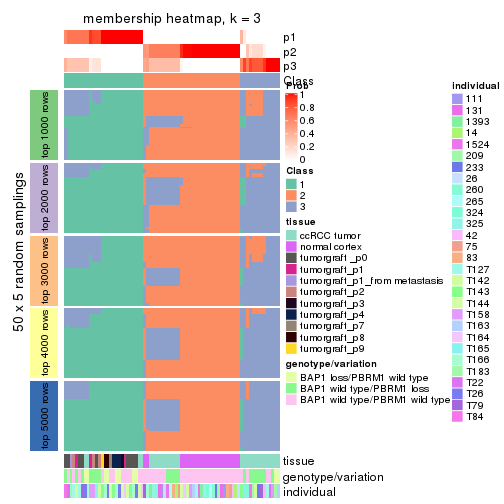</p>

</div>
<div id='tab-ATC-kmeans-membership-heatmap-3'>
<pre><code class="r">membership_heatmap(res, k = 4)
</code></pre>

<p></p>

</div>
<div id='tab-ATC-kmeans-membership-heatmap-4'>
<pre><code class="r">membership_heatmap(res, k = 5)
</code></pre>

<p></p>

</div>
<div id='tab-ATC-kmeans-membership-heatmap-5'>
<pre><code class="r">membership_heatmap(res, k = 6)
</code></pre>

<p></p>

</div>
</div>

As soon as we have had the classes for columns, we can look for signatures
which are significantly different between classes which can be candidate marks
for certain classes. Following are the heatmaps for signatures.


Signature heatmaps where rows are scaled:


<script>
$( function() {
	$( '#tabs-ATC-kmeans-get-signatures' ).tabs();
} );
</script>
<div id='tabs-ATC-kmeans-get-signatures'>
<ul>
<li><a href='#tab-ATC-kmeans-get-signatures-1'>k = 2</a></li>
<li><a href='#tab-ATC-kmeans-get-signatures-2'>k = 3</a></li>
<li><a href='#tab-ATC-kmeans-get-signatures-3'>k = 4</a></li>
<li><a href='#tab-ATC-kmeans-get-signatures-4'>k = 5</a></li>
<li><a href='#tab-ATC-kmeans-get-signatures-5'>k = 6</a></li>
</ul>
<div id='tab-ATC-kmeans-get-signatures-1'>
<pre><code class="r">get_signatures(res, k = 2)
</code></pre>

<p></p>

</div>
<div id='tab-ATC-kmeans-get-signatures-2'>
<pre><code class="r">get_signatures(res, k = 3)
</code></pre>

<p></p>

</div>
<div id='tab-ATC-kmeans-get-signatures-3'>
<pre><code class="r">get_signatures(res, k = 4)
</code></pre>

<p></p>

</div>
<div id='tab-ATC-kmeans-get-signatures-4'>
<pre><code class="r">get_signatures(res, k = 5)
</code></pre>

<p></p>

</div>
<div id='tab-ATC-kmeans-get-signatures-5'>
<pre><code class="r">get_signatures(res, k = 6)
</code></pre>

<p></p>

</div>
</div>


Signature heatmaps where rows are not scaled:


<script>
$( function() {
	$( '#tabs-ATC-kmeans-get-signatures-no-scale' ).tabs();
} );
</script>
<div id='tabs-ATC-kmeans-get-signatures-no-scale'>
<ul>
<li><a href='#tab-ATC-kmeans-get-signatures-no-scale-1'>k = 2</a></li>
<li><a href='#tab-ATC-kmeans-get-signatures-no-scale-2'>k = 3</a></li>
<li><a href='#tab-ATC-kmeans-get-signatures-no-scale-3'>k = 4</a></li>
<li><a href='#tab-ATC-kmeans-get-signatures-no-scale-4'>k = 5</a></li>
<li><a href='#tab-ATC-kmeans-get-signatures-no-scale-5'>k = 6</a></li>
</ul>
<div id='tab-ATC-kmeans-get-signatures-no-scale-1'>
<pre><code class="r">get_signatures(res, k = 2, scale_rows = FALSE)
</code></pre>

<p></p>

</div>
<div id='tab-ATC-kmeans-get-signatures-no-scale-2'>
<pre><code class="r">get_signatures(res, k = 3, scale_rows = FALSE)
</code></pre>

<p></p>

</div>
<div id='tab-ATC-kmeans-get-signatures-no-scale-3'>
<pre><code class="r">get_signatures(res, k = 4, scale_rows = FALSE)
</code></pre>

<p></p>

</div>
<div id='tab-ATC-kmeans-get-signatures-no-scale-4'>
<pre><code class="r">get_signatures(res, k = 5, scale_rows = FALSE)
</code></pre>

<p></p>

</div>
<div id='tab-ATC-kmeans-get-signatures-no-scale-5'>
<pre><code class="r">get_signatures(res, k = 6, scale_rows = FALSE)
</code></pre>

<p></p>

</div>
</div>


Compare the overlap of signatures from different k:

```r
compare_signatures(res)
```


`get_signature()` returns a data frame invisibly. TO get the list of signatures, the function
call should be assigned to a variable explicitly. In following code, if `plot` argument is set
to `FALSE`, no heatmap is plotted while only the differential analysis is performed.

```r
# code only for demonstration
tb = get_signature(res, k = ..., plot = FALSE)
```

An example of the output of `tb` is:

```
#>   which_row         fdr    mean_1    mean_2 scaled_mean_1 scaled_mean_2 km
#> 1        38 0.042760348  8.373488  9.131774    -0.5533452     0.5164555  1
#> 2        40 0.018707592  7.106213  8.469186    -0.6173731     0.5762149  1
#> 3        55 0.019134737 10.221463 11.207825    -0.6159697     0.5749050  1
#> 4        59 0.006059896  5.921854  7.869574    -0.6899429     0.6439467  1
#> 5        60 0.018055526  8.928898 10.211722    -0.6204761     0.5791110  1
#> 6        98 0.009384629 15.714769 14.887706     0.6635654    -0.6193277  2
...
```

The columns in `tb` are:

1. `which_row`: row indices corresponding to the input matrix.
2. `fdr`: FDR for the differential test. 
3. `mean_x`: The mean value in group x.
4. `scaled_mean_x`: The mean value in group x after rows are scaled.
5. `km`: Row groups if k-means clustering is applied to rows.


UMAP plot which shows how samples are separated.


<script>
$( function() {
	$( '#tabs-ATC-kmeans-dimension-reduction' ).tabs();
} );
</script>
<div id='tabs-ATC-kmeans-dimension-reduction'>
<ul>
<li><a href='#tab-ATC-kmeans-dimension-reduction-1'>k = 2</a></li>
<li><a href='#tab-ATC-kmeans-dimension-reduction-2'>k = 3</a></li>
<li><a href='#tab-ATC-kmeans-dimension-reduction-3'>k = 4</a></li>
<li><a href='#tab-ATC-kmeans-dimension-reduction-4'>k = 5</a></li>
<li><a href='#tab-ATC-kmeans-dimension-reduction-5'>k = 6</a></li>
</ul>
<div id='tab-ATC-kmeans-dimension-reduction-1'>
<pre><code class="r">dimension_reduction(res, k = 2, method = &quot;UMAP&quot;)
</code></pre>

<p></p>

</div>
<div id='tab-ATC-kmeans-dimension-reduction-2'>
<pre><code class="r">dimension_reduction(res, k = 3, method = &quot;UMAP&quot;)
</code></pre>

<p></p>

</div>
<div id='tab-ATC-kmeans-dimension-reduction-3'>
<pre><code class="r">dimension_reduction(res, k = 4, method = &quot;UMAP&quot;)
</code></pre>

<p></p>

</div>
<div id='tab-ATC-kmeans-dimension-reduction-4'>
<pre><code class="r">dimension_reduction(res, k = 5, method = &quot;UMAP&quot;)
</code></pre>

<p></p>

</div>
<div id='tab-ATC-kmeans-dimension-reduction-5'>
<pre><code class="r">dimension_reduction(res, k = 6, method = &quot;UMAP&quot;)
</code></pre>

<p></p>

</div>
</div>


Following heatmap shows how subgroups are split when increasing `k`:

```r
collect_classes(res)
```


Test correlation between subgroups and known annotations. If the known
annotation is numeric, one-way ANOVA test is applied, and if the known
annotation is discrete, chi-squared contingency table test is applied.

```r
test_to_known_factors(res)
```

```
#>             n tissue(p) genotype/variation(p) individual(p) k
#> ATC:kmeans 76  4.83e-08              9.05e-03        0.0164 2
#> ATC:kmeans 72  3.14e-09              4.42e-05        0.0659 3
#> ATC:kmeans 43  2.49e-07              1.70e-02        0.6247 4
#> ATC:kmeans 73  4.38e-16              3.16e-07        0.3065 5
#> ATC:kmeans 71  1.95e-14              2.53e-07        0.2511 6
```


If matrix rows can be associated to genes, consider to use `functional_enrichment(res,
...)` to perform function enrichment for the signature genes. See [this vignette](http://bioconductor.org/packages/devel/bioc/vignettes/cola/inst/doc/functional_enrichment.html) for more detailed explanations.


 

---------------------------------------------------


### ATC:skmeans**


The object with results only for a single top-value method and a single partition method 
can be extracted as:

```r
res = res_list["ATC", "skmeans"]
# you can also extract it by
# res = res_list["ATC:skmeans"]
```

A summary of `res` and all the functions that can be applied to it:

```r
res
```

```
#> A 'ConsensusPartition' object with k = 2, 3, 4, 5, 6.
#>   On a matrix with 51941 rows and 76 columns.
#>   Top rows (1000, 2000, 3000, 4000, 5000) are extracted by 'ATC' method.
#>   Subgroups are detected by 'skmeans' method.
#>   Performed in total 1250 partitions by row resampling.
#>   Best k for subgroups seems to be 4.
#> 
#> Following methods can be applied to this 'ConsensusPartition' object:
#>  [1] "cola_report"             "collect_classes"         "collect_plots"          
#>  [4] "collect_stats"           "colnames"                "compare_signatures"     
#>  [7] "consensus_heatmap"       "dimension_reduction"     "functional_enrichment"  
#> [10] "get_anno_col"            "get_anno"                "get_classes"            
#> [13] "get_consensus"           "get_matrix"              "get_membership"         
#> [16] "get_param"               "get_signatures"          "get_stats"              
#> [19] "is_best_k"               "is_stable_k"             "membership_heatmap"     
#> [22] "ncol"                    "nrow"                    "plot_ecdf"              
#> [25] "rownames"                "select_partition_number" "show"                   
#> [28] "suggest_best_k"          "test_to_known_factors"
```

`collect_plots()` function collects all the plots made from `res` for all `k` (number of partitions)
into one single page to provide an easy and fast comparison between different `k`.

```r
collect_plots(res)
```


The plots are:

- The first row: a plot of the ECDF (empirical cumulative distribution
  function) curves of the consensus matrix for each `k` and the heatmap of
  predicted classes for each `k`.
- The second row: heatmaps of the consensus matrix for each `k`.
- The third row: heatmaps of the membership matrix for each `k`.
- The fouth row: heatmaps of the signatures for each `k`.

All the plots in panels can be made by individual functions and they are
plotted later in this section.

`select_partition_number()` produces several plots showing different
statistics for choosing "optimized" `k`. There are following statistics:

- ECDF curves of the consensus matrix for each `k`;
- 1-PAC. [The PAC
  score](https://en.wikipedia.org/wiki/Consensus_clustering#Over-interpretation_potential_of_consensus_clustering)
  measures the proportion of the ambiguous subgrouping.
- Mean silhouette score.
- Concordance. The mean probability of fiting the consensus class ids in all
  partitions.
- Area increased. Denote $A_k$ as the area under the ECDF curve for current
  `k`, the area increased is defined as $A_k - A_{k-1}$.
- Rand index. The percent of pairs of samples that are both in a same cluster
  or both are not in a same cluster in the partition of k and k-1.
- Jaccard index. The ratio of pairs of samples are both in a same cluster in
  the partition of k and k-1 and the pairs of samples are both in a same
  cluster in the partition k or k-1.

The detailed explanations of these statistics can be found in [the _cola_
vignette](http://bioconductor.org/packages/devel/bioc/vignettes/cola/inst/doc/cola.html#toc_13).

Generally speaking, lower PAC score, higher mean silhouette score or higher
concordance corresponds to better partition. Rand index and Jaccard index
measure how similar the current partition is compared to partition with `k-1`.
If they are too similar, we won't accept `k` is better than `k-1`.

```r
select_partition_number(res)
```


The numeric values for all these statistics can be obtained by `get_stats()`.

```r
get_stats(res)
```

```
#>   k 1-PAC mean_silhouette concordance area_increased  Rand Jaccard
#> 2 2 1.000           0.981       0.993         0.5002 0.499   0.499
#> 3 3 0.782           0.917       0.917         0.2962 0.828   0.661
#> 4 4 1.000           0.967       0.978         0.0971 0.933   0.806
#> 5 5 0.878           0.924       0.875         0.0774 0.924   0.735
#> 6 6 0.863           0.901       0.863         0.0422 0.949   0.763
```

`suggest_best_k()` suggests the best $k$ based on these statistics. The rules are as follows:

- All $k$ with Jaccard index larger than 0.95 are removed because increasing
  $k$ does not provide enough extra information. If all $k$ are removed, it is
  marked as no subgroup is detected.
- For all $k$ with 1-PAC score larger than 0.9, the maximal $k$ is taken as
  the best $k$, and other $k$ are marked as optional $k$.
- If it does not fit the second rule. The $k$ with the maximal vote of the
  highest 1-PAC score, highest mean silhouette, and highest concordance is
  taken as the best $k$.

```r
suggest_best_k(res)
```

```
#> [1] 4
#> attr(,"optional")
#> [1] 2
```

There is also optional best $k$ = 2 that is worth to check.

Following shows the table of the partitions (You need to click the **show/hide
code output** link to see it). The membership matrix (columns with name `p*`)
is inferred by
[`clue::cl_consensus()`](https://www.rdocumentation.org/link/cl_consensus?package=clue)
function with the `SE` method. Basically the value in the membership matrix
represents the probability to belong to a certain group. The finall class
label for an item is determined with the group with highest probability it
belongs to.

In `get_classes()` function, the entropy is calculated from the membership
matrix and the silhouette score is calculated from the consensus matrix.


<script>
$( function() {
	$( '#tabs-ATC-skmeans-get-classes' ).tabs();
} );
</script>
<div id='tabs-ATC-skmeans-get-classes'>
<ul>
<li><a href='#tab-ATC-skmeans-get-classes-1'>k = 2</a></li>
<li><a href='#tab-ATC-skmeans-get-classes-2'>k = 3</a></li>
<li><a href='#tab-ATC-skmeans-get-classes-3'>k = 4</a></li>
<li><a href='#tab-ATC-skmeans-get-classes-4'>k = 5</a></li>
<li><a href='#tab-ATC-skmeans-get-classes-5'>k = 6</a></li>
</ul>

<div id='tab-ATC-skmeans-get-classes-1'>
<p><a id='tab-ATC-skmeans-get-classes-1-a' style='color:#0366d6' href='#'>show/hide code output</a></p>
<pre><code class="r">cbind(get_classes(res, k = 2), get_membership(res, k = 2))
</code></pre>

<pre><code>#&gt;           class entropy silhouette    p1    p2
#&gt; GSM905004     1   0.000     0.9855 1.000 0.000
#&gt; GSM905024     1   0.000     0.9855 1.000 0.000
#&gt; GSM905038     1   0.998     0.0919 0.524 0.476
#&gt; GSM905043     1   0.000     0.9855 1.000 0.000
#&gt; GSM904986     2   0.000     0.9991 0.000 1.000
#&gt; GSM904991     2   0.000     0.9991 0.000 1.000
#&gt; GSM904994     2   0.000     0.9991 0.000 1.000
#&gt; GSM904996     2   0.000     0.9991 0.000 1.000
#&gt; GSM905007     2   0.000     0.9991 0.000 1.000
#&gt; GSM905012     2   0.000     0.9991 0.000 1.000
#&gt; GSM905022     2   0.000     0.9991 0.000 1.000
#&gt; GSM905026     2   0.000     0.9991 0.000 1.000
#&gt; GSM905027     2   0.000     0.9991 0.000 1.000
#&gt; GSM905031     2   0.000     0.9991 0.000 1.000
#&gt; GSM905036     1   0.000     0.9855 1.000 0.000
#&gt; GSM905041     1   0.000     0.9855 1.000 0.000
#&gt; GSM905044     2   0.000     0.9991 0.000 1.000
#&gt; GSM904989     2   0.000     0.9991 0.000 1.000
#&gt; GSM904999     2   0.000     0.9991 0.000 1.000
#&gt; GSM905002     2   0.000     0.9991 0.000 1.000
#&gt; GSM905009     2   0.000     0.9991 0.000 1.000
#&gt; GSM905014     2   0.000     0.9991 0.000 1.000
#&gt; GSM905017     2   0.000     0.9991 0.000 1.000
#&gt; GSM905020     2   0.000     0.9991 0.000 1.000
#&gt; GSM905023     1   0.000     0.9855 1.000 0.000
#&gt; GSM905029     2   0.224     0.9619 0.036 0.964
#&gt; GSM905032     1   0.000     0.9855 1.000 0.000
#&gt; GSM905034     1   0.000     0.9855 1.000 0.000
#&gt; GSM905040     1   0.000     0.9855 1.000 0.000
#&gt; GSM904985     2   0.000     0.9991 0.000 1.000
#&gt; GSM904988     2   0.000     0.9991 0.000 1.000
#&gt; GSM904990     2   0.000     0.9991 0.000 1.000
#&gt; GSM904992     2   0.000     0.9991 0.000 1.000
#&gt; GSM904995     2   0.000     0.9991 0.000 1.000
#&gt; GSM904998     2   0.000     0.9991 0.000 1.000
#&gt; GSM905000     2   0.000     0.9991 0.000 1.000
#&gt; GSM905003     2   0.000     0.9991 0.000 1.000
#&gt; GSM905006     2   0.000     0.9991 0.000 1.000
#&gt; GSM905008     2   0.000     0.9991 0.000 1.000
#&gt; GSM905011     2   0.000     0.9991 0.000 1.000
#&gt; GSM905013     2   0.000     0.9991 0.000 1.000
#&gt; GSM905016     2   0.000     0.9991 0.000 1.000
#&gt; GSM905018     2   0.000     0.9991 0.000 1.000
#&gt; GSM905021     2   0.000     0.9991 0.000 1.000
#&gt; GSM905025     2   0.000     0.9991 0.000 1.000
#&gt; GSM905028     2   0.000     0.9991 0.000 1.000
#&gt; GSM905030     2   0.000     0.9991 0.000 1.000
#&gt; GSM905033     2   0.000     0.9991 0.000 1.000
#&gt; GSM905035     2   0.000     0.9991 0.000 1.000
#&gt; GSM905037     2   0.000     0.9991 0.000 1.000
#&gt; GSM905039     2   0.000     0.9991 0.000 1.000
#&gt; GSM905042     2   0.000     0.9991 0.000 1.000
#&gt; GSM905046     1   0.000     0.9855 1.000 0.000
#&gt; GSM905065     1   0.000     0.9855 1.000 0.000
#&gt; GSM905049     1   0.000     0.9855 1.000 0.000
#&gt; GSM905050     1   0.000     0.9855 1.000 0.000
#&gt; GSM905064     1   0.000     0.9855 1.000 0.000
#&gt; GSM905045     1   0.000     0.9855 1.000 0.000
#&gt; GSM905051     1   0.000     0.9855 1.000 0.000
#&gt; GSM905055     1   0.000     0.9855 1.000 0.000
#&gt; GSM905058     1   0.000     0.9855 1.000 0.000
#&gt; GSM905053     1   0.000     0.9855 1.000 0.000
#&gt; GSM905061     1   0.000     0.9855 1.000 0.000
#&gt; GSM905063     1   0.000     0.9855 1.000 0.000
#&gt; GSM905054     1   0.000     0.9855 1.000 0.000
#&gt; GSM905062     1   0.000     0.9855 1.000 0.000
#&gt; GSM905052     1   0.000     0.9855 1.000 0.000
#&gt; GSM905059     1   0.000     0.9855 1.000 0.000
#&gt; GSM905047     1   0.000     0.9855 1.000 0.000
#&gt; GSM905066     1   0.000     0.9855 1.000 0.000
#&gt; GSM905056     1   0.000     0.9855 1.000 0.000
#&gt; GSM905060     1   0.000     0.9855 1.000 0.000
#&gt; GSM905048     1   0.000     0.9855 1.000 0.000
#&gt; GSM905067     1   0.000     0.9855 1.000 0.000
#&gt; GSM905057     1   0.000     0.9855 1.000 0.000
#&gt; GSM905068     1   0.000     0.9855 1.000 0.000
</code></pre>

<script>
$('#tab-ATC-skmeans-get-classes-1-a').parent().next().next().hide();
$('#tab-ATC-skmeans-get-classes-1-a').click(function(){
  $('#tab-ATC-skmeans-get-classes-1-a').parent().next().next().toggle();
  return(false);
});
</script>
</div>

<div id='tab-ATC-skmeans-get-classes-2'>
<p><a id='tab-ATC-skmeans-get-classes-2-a' style='color:#0366d6' href='#'>show/hide code output</a></p>
<pre><code class="r">cbind(get_classes(res, k = 3), get_membership(res, k = 3))
</code></pre>

<pre><code>#&gt;           class entropy silhouette    p1    p2    p3
#&gt; GSM905004     1  0.0592      0.980 0.988 0.000 0.012
#&gt; GSM905024     1  0.0000      0.990 1.000 0.000 0.000
#&gt; GSM905038     3  0.4062      0.746 0.000 0.164 0.836
#&gt; GSM905043     1  0.0000      0.990 1.000 0.000 0.000
#&gt; GSM904986     3  0.3686      0.875 0.000 0.140 0.860
#&gt; GSM904991     3  0.2625      0.848 0.000 0.084 0.916
#&gt; GSM904994     3  0.3686      0.875 0.000 0.140 0.860
#&gt; GSM904996     3  0.3686      0.875 0.000 0.140 0.860
#&gt; GSM905007     3  0.3686      0.875 0.000 0.140 0.860
#&gt; GSM905012     3  0.3686      0.875 0.000 0.140 0.860
#&gt; GSM905022     3  0.3686      0.875 0.000 0.140 0.860
#&gt; GSM905026     3  0.4178      0.743 0.000 0.172 0.828
#&gt; GSM905027     3  0.4062      0.746 0.000 0.164 0.836
#&gt; GSM905031     3  0.4178      0.743 0.000 0.172 0.828
#&gt; GSM905036     1  0.3686      0.869 0.860 0.000 0.140
#&gt; GSM905041     1  0.1964      0.946 0.944 0.000 0.056
#&gt; GSM905044     3  0.4062      0.746 0.000 0.164 0.836
#&gt; GSM904989     3  0.3686      0.875 0.000 0.140 0.860
#&gt; GSM904999     3  0.3686      0.875 0.000 0.140 0.860
#&gt; GSM905002     3  0.3686      0.875 0.000 0.140 0.860
#&gt; GSM905009     3  0.3686      0.875 0.000 0.140 0.860
#&gt; GSM905014     3  0.3686      0.875 0.000 0.140 0.860
#&gt; GSM905017     3  0.3686      0.875 0.000 0.140 0.860
#&gt; GSM905020     3  0.3686      0.875 0.000 0.140 0.860
#&gt; GSM905023     1  0.3686      0.869 0.860 0.000 0.140
#&gt; GSM905029     3  0.4002      0.746 0.000 0.160 0.840
#&gt; GSM905032     1  0.0000      0.990 1.000 0.000 0.000
#&gt; GSM905034     1  0.0000      0.990 1.000 0.000 0.000
#&gt; GSM905040     1  0.0000      0.990 1.000 0.000 0.000
#&gt; GSM904985     2  0.4002      0.920 0.000 0.840 0.160
#&gt; GSM904988     2  0.4002      0.920 0.000 0.840 0.160
#&gt; GSM904990     2  0.4002      0.920 0.000 0.840 0.160
#&gt; GSM904992     2  0.4002      0.920 0.000 0.840 0.160
#&gt; GSM904995     2  0.4002      0.920 0.000 0.840 0.160
#&gt; GSM904998     2  0.4002      0.920 0.000 0.840 0.160
#&gt; GSM905000     2  0.4002      0.920 0.000 0.840 0.160
#&gt; GSM905003     2  0.4002      0.920 0.000 0.840 0.160
#&gt; GSM905006     2  0.4002      0.920 0.000 0.840 0.160
#&gt; GSM905008     2  0.4002      0.920 0.000 0.840 0.160
#&gt; GSM905011     2  0.4002      0.920 0.000 0.840 0.160
#&gt; GSM905013     2  0.4002      0.920 0.000 0.840 0.160
#&gt; GSM905016     2  0.4002      0.920 0.000 0.840 0.160
#&gt; GSM905018     2  0.4002      0.920 0.000 0.840 0.160
#&gt; GSM905021     2  0.4002      0.920 0.000 0.840 0.160
#&gt; GSM905025     2  0.0000      0.851 0.000 1.000 0.000
#&gt; GSM905028     2  0.0000      0.851 0.000 1.000 0.000
#&gt; GSM905030     2  0.0000      0.851 0.000 1.000 0.000
#&gt; GSM905033     2  0.0000      0.851 0.000 1.000 0.000
#&gt; GSM905035     2  0.0000      0.851 0.000 1.000 0.000
#&gt; GSM905037     2  0.0000      0.851 0.000 1.000 0.000
#&gt; GSM905039     2  0.0000      0.851 0.000 1.000 0.000
#&gt; GSM905042     2  0.0000      0.851 0.000 1.000 0.000
#&gt; GSM905046     1  0.0000      0.990 1.000 0.000 0.000
#&gt; GSM905065     1  0.0000      0.990 1.000 0.000 0.000
#&gt; GSM905049     1  0.0000      0.990 1.000 0.000 0.000
#&gt; GSM905050     1  0.0000      0.990 1.000 0.000 0.000
#&gt; GSM905064     1  0.0000      0.990 1.000 0.000 0.000
#&gt; GSM905045     1  0.0000      0.990 1.000 0.000 0.000
#&gt; GSM905051     1  0.0000      0.990 1.000 0.000 0.000
#&gt; GSM905055     1  0.0000      0.990 1.000 0.000 0.000
#&gt; GSM905058     1  0.0000      0.990 1.000 0.000 0.000
#&gt; GSM905053     1  0.0000      0.990 1.000 0.000 0.000
#&gt; GSM905061     1  0.0000      0.990 1.000 0.000 0.000
#&gt; GSM905063     1  0.0000      0.990 1.000 0.000 0.000
#&gt; GSM905054     1  0.0000      0.990 1.000 0.000 0.000
#&gt; GSM905062     1  0.0000      0.990 1.000 0.000 0.000
#&gt; GSM905052     1  0.0000      0.990 1.000 0.000 0.000
#&gt; GSM905059     1  0.0000      0.990 1.000 0.000 0.000
#&gt; GSM905047     1  0.0000      0.990 1.000 0.000 0.000
#&gt; GSM905066     1  0.0000      0.990 1.000 0.000 0.000
#&gt; GSM905056     1  0.0000      0.990 1.000 0.000 0.000
#&gt; GSM905060     1  0.0000      0.990 1.000 0.000 0.000
#&gt; GSM905048     1  0.0000      0.990 1.000 0.000 0.000
#&gt; GSM905067     1  0.0000      0.990 1.000 0.000 0.000
#&gt; GSM905057     1  0.0000      0.990 1.000 0.000 0.000
#&gt; GSM905068     1  0.0000      0.990 1.000 0.000 0.000
</code></pre>

<script>
$('#tab-ATC-skmeans-get-classes-2-a').parent().next().next().hide();
$('#tab-ATC-skmeans-get-classes-2-a').click(function(){
  $('#tab-ATC-skmeans-get-classes-2-a').parent().next().next().toggle();
  return(false);
});
</script>
</div>

<div id='tab-ATC-skmeans-get-classes-3'>
<p><a id='tab-ATC-skmeans-get-classes-3-a' style='color:#0366d6' href='#'>show/hide code output</a></p>
<pre><code class="r">cbind(get_classes(res, k = 4), get_membership(res, k = 4))
</code></pre>

<pre><code>#&gt;           class entropy silhouette    p1    p2    p3    p4
#&gt; GSM905004     1  0.1284      0.972 0.964 0.000 0.024 0.012
#&gt; GSM905024     1  0.0000      0.993 1.000 0.000 0.000 0.000
#&gt; GSM905038     4  0.0469      0.917 0.000 0.000 0.012 0.988
#&gt; GSM905043     1  0.0000      0.993 1.000 0.000 0.000 0.000
#&gt; GSM904986     3  0.0188      0.999 0.000 0.004 0.996 0.000
#&gt; GSM904991     3  0.0469      0.985 0.000 0.000 0.988 0.012
#&gt; GSM904994     3  0.0188      0.999 0.000 0.004 0.996 0.000
#&gt; GSM904996     3  0.0188      0.999 0.000 0.004 0.996 0.000
#&gt; GSM905007     3  0.0188      0.999 0.000 0.004 0.996 0.000
#&gt; GSM905012     3  0.0188      0.999 0.000 0.004 0.996 0.000
#&gt; GSM905022     3  0.0188      0.999 0.000 0.004 0.996 0.000
#&gt; GSM905026     4  0.1584      0.919 0.000 0.036 0.012 0.952
#&gt; GSM905027     4  0.1584      0.919 0.000 0.036 0.012 0.952
#&gt; GSM905031     4  0.1584      0.919 0.000 0.036 0.012 0.952
#&gt; GSM905036     4  0.0469      0.916 0.012 0.000 0.000 0.988
#&gt; GSM905041     4  0.4790      0.392 0.380 0.000 0.000 0.620
#&gt; GSM905044     4  0.1584      0.919 0.000 0.036 0.012 0.952
#&gt; GSM904989     3  0.0188      0.999 0.000 0.004 0.996 0.000
#&gt; GSM904999     3  0.0188      0.999 0.000 0.004 0.996 0.000
#&gt; GSM905002     3  0.0188      0.999 0.000 0.004 0.996 0.000
#&gt; GSM905009     3  0.0188      0.999 0.000 0.004 0.996 0.000
#&gt; GSM905014     3  0.0188      0.999 0.000 0.004 0.996 0.000
#&gt; GSM905017     3  0.0188      0.999 0.000 0.004 0.996 0.000
#&gt; GSM905020     3  0.0188      0.999 0.000 0.004 0.996 0.000
#&gt; GSM905023     4  0.0469      0.916 0.012 0.000 0.000 0.988
#&gt; GSM905029     4  0.0469      0.917 0.000 0.000 0.012 0.988
#&gt; GSM905032     1  0.0000      0.993 1.000 0.000 0.000 0.000
#&gt; GSM905034     1  0.0000      0.993 1.000 0.000 0.000 0.000
#&gt; GSM905040     1  0.0000      0.993 1.000 0.000 0.000 0.000
#&gt; GSM904985     2  0.1118      0.974 0.000 0.964 0.036 0.000
#&gt; GSM904988     2  0.1118      0.974 0.000 0.964 0.036 0.000
#&gt; GSM904990     2  0.1118      0.974 0.000 0.964 0.036 0.000
#&gt; GSM904992     2  0.1118      0.974 0.000 0.964 0.036 0.000
#&gt; GSM904995     2  0.1118      0.974 0.000 0.964 0.036 0.000
#&gt; GSM904998     2  0.1118      0.974 0.000 0.964 0.036 0.000
#&gt; GSM905000     2  0.1118      0.974 0.000 0.964 0.036 0.000
#&gt; GSM905003     2  0.1118      0.974 0.000 0.964 0.036 0.000
#&gt; GSM905006     2  0.1118      0.974 0.000 0.964 0.036 0.000
#&gt; GSM905008     2  0.1118      0.974 0.000 0.964 0.036 0.000
#&gt; GSM905011     2  0.1118      0.974 0.000 0.964 0.036 0.000
#&gt; GSM905013     2  0.1118      0.974 0.000 0.964 0.036 0.000
#&gt; GSM905016     2  0.1118      0.974 0.000 0.964 0.036 0.000
#&gt; GSM905018     2  0.1118      0.974 0.000 0.964 0.036 0.000
#&gt; GSM905021     2  0.4072      0.704 0.000 0.748 0.252 0.000
#&gt; GSM905025     2  0.0000      0.961 0.000 1.000 0.000 0.000
#&gt; GSM905028     2  0.0000      0.961 0.000 1.000 0.000 0.000
#&gt; GSM905030     2  0.0000      0.961 0.000 1.000 0.000 0.000
#&gt; GSM905033     2  0.0000      0.961 0.000 1.000 0.000 0.000
#&gt; GSM905035     2  0.0000      0.961 0.000 1.000 0.000 0.000
#&gt; GSM905037     2  0.0000      0.961 0.000 1.000 0.000 0.000
#&gt; GSM905039     2  0.0000      0.961 0.000 1.000 0.000 0.000
#&gt; GSM905042     2  0.0000      0.961 0.000 1.000 0.000 0.000
#&gt; GSM905046     1  0.0000      0.993 1.000 0.000 0.000 0.000
#&gt; GSM905065     1  0.0000      0.993 1.000 0.000 0.000 0.000
#&gt; GSM905049     1  0.0657      0.990 0.984 0.000 0.004 0.012
#&gt; GSM905050     1  0.0657      0.990 0.984 0.000 0.004 0.012
#&gt; GSM905064     1  0.0657      0.990 0.984 0.000 0.004 0.012
#&gt; GSM905045     1  0.0657      0.990 0.984 0.000 0.004 0.012
#&gt; GSM905051     1  0.0469      0.991 0.988 0.000 0.000 0.012
#&gt; GSM905055     1  0.0000      0.993 1.000 0.000 0.000 0.000
#&gt; GSM905058     1  0.0000      0.993 1.000 0.000 0.000 0.000
#&gt; GSM905053     1  0.0657      0.990 0.984 0.000 0.004 0.012
#&gt; GSM905061     1  0.0657      0.990 0.984 0.000 0.004 0.012
#&gt; GSM905063     1  0.0000      0.993 1.000 0.000 0.000 0.000
#&gt; GSM905054     1  0.0657      0.990 0.984 0.000 0.004 0.012
#&gt; GSM905062     1  0.0657      0.990 0.984 0.000 0.004 0.012
#&gt; GSM905052     1  0.0469      0.991 0.988 0.000 0.000 0.012
#&gt; GSM905059     1  0.0000      0.993 1.000 0.000 0.000 0.000
#&gt; GSM905047     1  0.0000      0.993 1.000 0.000 0.000 0.000
#&gt; GSM905066     1  0.0000      0.993 1.000 0.000 0.000 0.000
#&gt; GSM905056     1  0.0000      0.993 1.000 0.000 0.000 0.000
#&gt; GSM905060     1  0.0000      0.993 1.000 0.000 0.000 0.000
#&gt; GSM905048     1  0.0000      0.993 1.000 0.000 0.000 0.000
#&gt; GSM905067     1  0.0000      0.993 1.000 0.000 0.000 0.000
#&gt; GSM905057     1  0.0000      0.993 1.000 0.000 0.000 0.000
#&gt; GSM905068     1  0.0657      0.990 0.984 0.000 0.004 0.012
</code></pre>

<script>
$('#tab-ATC-skmeans-get-classes-3-a').parent().next().next().hide();
$('#tab-ATC-skmeans-get-classes-3-a').click(function(){
  $('#tab-ATC-skmeans-get-classes-3-a').parent().next().next().toggle();
  return(false);
});
</script>
</div>

<div id='tab-ATC-skmeans-get-classes-4'>
<p><a id='tab-ATC-skmeans-get-classes-4-a' style='color:#0366d6' href='#'>show/hide code output</a></p>
<pre><code class="r">cbind(get_classes(res, k = 5), get_membership(res, k = 5))
</code></pre>

<pre><code>#&gt;           class entropy silhouette    p1    p2    p3    p4    p5
#&gt; GSM905004     4  0.2409      0.821 0.068 0.000 0.032 0.900 0.000
#&gt; GSM905024     1  0.4192      0.945 0.596 0.000 0.000 0.404 0.000
#&gt; GSM905038     5  0.0703      0.882 0.024 0.000 0.000 0.000 0.976
#&gt; GSM905043     1  0.4192      0.945 0.596 0.000 0.000 0.404 0.000
#&gt; GSM904986     3  0.0880      0.989 0.000 0.032 0.968 0.000 0.000
#&gt; GSM904991     3  0.0771      0.950 0.020 0.000 0.976 0.000 0.004
#&gt; GSM904994     3  0.0880      0.989 0.000 0.032 0.968 0.000 0.000
#&gt; GSM904996     3  0.0880      0.989 0.000 0.032 0.968 0.000 0.000
#&gt; GSM905007     3  0.0404      0.959 0.012 0.000 0.988 0.000 0.000
#&gt; GSM905012     3  0.0880      0.989 0.000 0.032 0.968 0.000 0.000
#&gt; GSM905022     3  0.0880      0.989 0.000 0.032 0.968 0.000 0.000
#&gt; GSM905026     5  0.2583      0.883 0.132 0.004 0.000 0.000 0.864
#&gt; GSM905027     5  0.2488      0.884 0.124 0.004 0.000 0.000 0.872
#&gt; GSM905031     5  0.2583      0.883 0.132 0.004 0.000 0.000 0.864
#&gt; GSM905036     5  0.1478      0.875 0.064 0.000 0.000 0.000 0.936
#&gt; GSM905041     5  0.5987      0.355 0.304 0.000 0.000 0.140 0.556
#&gt; GSM905044     5  0.2583      0.883 0.132 0.004 0.000 0.000 0.864
#&gt; GSM904989     3  0.0880      0.989 0.000 0.032 0.968 0.000 0.000
#&gt; GSM904999     3  0.0880      0.989 0.000 0.032 0.968 0.000 0.000
#&gt; GSM905002     3  0.0880      0.989 0.000 0.032 0.968 0.000 0.000
#&gt; GSM905009     3  0.0880      0.989 0.000 0.032 0.968 0.000 0.000
#&gt; GSM905014     3  0.0000      0.965 0.000 0.000 1.000 0.000 0.000
#&gt; GSM905017     3  0.0880      0.989 0.000 0.032 0.968 0.000 0.000
#&gt; GSM905020     3  0.0880      0.989 0.000 0.032 0.968 0.000 0.000
#&gt; GSM905023     5  0.1544      0.874 0.068 0.000 0.000 0.000 0.932
#&gt; GSM905029     5  0.0566      0.883 0.012 0.000 0.004 0.000 0.984
#&gt; GSM905032     1  0.4227      0.966 0.580 0.000 0.000 0.420 0.000
#&gt; GSM905034     1  0.4201      0.951 0.592 0.000 0.000 0.408 0.000
#&gt; GSM905040     1  0.4249      0.979 0.568 0.000 0.000 0.432 0.000
#&gt; GSM904985     2  0.0162      0.909 0.000 0.996 0.004 0.000 0.000
#&gt; GSM904988     2  0.0162      0.909 0.000 0.996 0.004 0.000 0.000
#&gt; GSM904990     2  0.0162      0.909 0.000 0.996 0.004 0.000 0.000
#&gt; GSM904992     2  0.0162      0.909 0.000 0.996 0.004 0.000 0.000
#&gt; GSM904995     2  0.0162      0.909 0.000 0.996 0.004 0.000 0.000
#&gt; GSM904998     2  0.0162      0.909 0.000 0.996 0.004 0.000 0.000
#&gt; GSM905000     2  0.0162      0.909 0.000 0.996 0.004 0.000 0.000
#&gt; GSM905003     2  0.0162      0.909 0.000 0.996 0.004 0.000 0.000
#&gt; GSM905006     2  0.0162      0.909 0.000 0.996 0.004 0.000 0.000
#&gt; GSM905008     2  0.0162      0.909 0.000 0.996 0.004 0.000 0.000
#&gt; GSM905011     2  0.0162      0.909 0.000 0.996 0.004 0.000 0.000
#&gt; GSM905013     2  0.0162      0.909 0.000 0.996 0.004 0.000 0.000
#&gt; GSM905016     2  0.0162      0.909 0.000 0.996 0.004 0.000 0.000
#&gt; GSM905018     2  0.0162      0.909 0.000 0.996 0.004 0.000 0.000
#&gt; GSM905021     2  0.3003      0.722 0.000 0.812 0.188 0.000 0.000
#&gt; GSM905025     2  0.3612      0.804 0.268 0.732 0.000 0.000 0.000
#&gt; GSM905028     2  0.3366      0.830 0.232 0.768 0.000 0.000 0.000
#&gt; GSM905030     2  0.3366      0.830 0.232 0.768 0.000 0.000 0.000
#&gt; GSM905033     2  0.3109      0.842 0.200 0.800 0.000 0.000 0.000
#&gt; GSM905035     2  0.3366      0.830 0.232 0.768 0.000 0.000 0.000
#&gt; GSM905037     2  0.3366      0.830 0.232 0.768 0.000 0.000 0.000
#&gt; GSM905039     2  0.3366      0.830 0.232 0.768 0.000 0.000 0.000
#&gt; GSM905042     2  0.3366      0.830 0.232 0.768 0.000 0.000 0.000
#&gt; GSM905046     1  0.4262      0.986 0.560 0.000 0.000 0.440 0.000
#&gt; GSM905065     1  0.4262      0.986 0.560 0.000 0.000 0.440 0.000
#&gt; GSM905049     4  0.0000      0.970 0.000 0.000 0.000 1.000 0.000
#&gt; GSM905050     4  0.0000      0.970 0.000 0.000 0.000 1.000 0.000
#&gt; GSM905064     4  0.0404      0.958 0.012 0.000 0.000 0.988 0.000
#&gt; GSM905045     4  0.0000      0.970 0.000 0.000 0.000 1.000 0.000
#&gt; GSM905051     4  0.0963      0.926 0.036 0.000 0.000 0.964 0.000
#&gt; GSM905055     1  0.4262      0.986 0.560 0.000 0.000 0.440 0.000
#&gt; GSM905058     1  0.4262      0.986 0.560 0.000 0.000 0.440 0.000
#&gt; GSM905053     4  0.0000      0.970 0.000 0.000 0.000 1.000 0.000
#&gt; GSM905061     4  0.0000      0.970 0.000 0.000 0.000 1.000 0.000
#&gt; GSM905063     1  0.4262      0.986 0.560 0.000 0.000 0.440 0.000
#&gt; GSM905054     4  0.0000      0.970 0.000 0.000 0.000 1.000 0.000
#&gt; GSM905062     4  0.0000      0.970 0.000 0.000 0.000 1.000 0.000
#&gt; GSM905052     4  0.0963      0.926 0.036 0.000 0.000 0.964 0.000
#&gt; GSM905059     1  0.4262      0.986 0.560 0.000 0.000 0.440 0.000
#&gt; GSM905047     1  0.4262      0.986 0.560 0.000 0.000 0.440 0.000
#&gt; GSM905066     1  0.4262      0.986 0.560 0.000 0.000 0.440 0.000
#&gt; GSM905056     1  0.4262      0.986 0.560 0.000 0.000 0.440 0.000
#&gt; GSM905060     1  0.4262      0.986 0.560 0.000 0.000 0.440 0.000
#&gt; GSM905048     1  0.4262      0.986 0.560 0.000 0.000 0.440 0.000
#&gt; GSM905067     1  0.4262      0.986 0.560 0.000 0.000 0.440 0.000
#&gt; GSM905057     1  0.4262      0.986 0.560 0.000 0.000 0.440 0.000
#&gt; GSM905068     4  0.0000      0.970 0.000 0.000 0.000 1.000 0.000
</code></pre>

<script>
$('#tab-ATC-skmeans-get-classes-4-a').parent().next().next().hide();
$('#tab-ATC-skmeans-get-classes-4-a').click(function(){
  $('#tab-ATC-skmeans-get-classes-4-a').parent().next().next().toggle();
  return(false);
});
</script>
</div>

<div id='tab-ATC-skmeans-get-classes-5'>
<p><a id='tab-ATC-skmeans-get-classes-5-a' style='color:#0366d6' href='#'>show/hide code output</a></p>
<pre><code class="r">cbind(get_classes(res, k = 6), get_membership(res, k = 6))
</code></pre>

<pre><code>#&gt;           class entropy silhouette    p1    p2    p3    p4    p5    p6
#&gt; GSM905004     4  0.3469      0.683 0.104 0.088 0.000 0.808 0.000 0.000
#&gt; GSM905024     1  0.1745      0.871 0.924 0.020 0.000 0.056 0.000 0.000
#&gt; GSM905038     6  0.4212      0.811 0.000 0.264 0.000 0.048 0.000 0.688
#&gt; GSM905043     1  0.1745      0.871 0.924 0.020 0.000 0.056 0.000 0.000
#&gt; GSM904986     3  0.0000      0.988 0.000 0.000 1.000 0.000 0.000 0.000
#&gt; GSM904991     3  0.1682      0.940 0.000 0.020 0.928 0.052 0.000 0.000
#&gt; GSM904994     3  0.0000      0.988 0.000 0.000 1.000 0.000 0.000 0.000
#&gt; GSM904996     3  0.0000      0.988 0.000 0.000 1.000 0.000 0.000 0.000
#&gt; GSM905007     3  0.1480      0.948 0.000 0.020 0.940 0.040 0.000 0.000
#&gt; GSM905012     3  0.0000      0.988 0.000 0.000 1.000 0.000 0.000 0.000
#&gt; GSM905022     3  0.0000      0.988 0.000 0.000 1.000 0.000 0.000 0.000
#&gt; GSM905026     6  0.1141      0.846 0.000 0.000 0.000 0.000 0.052 0.948
#&gt; GSM905027     6  0.1075      0.847 0.000 0.000 0.000 0.000 0.048 0.952
#&gt; GSM905031     6  0.1141      0.846 0.000 0.000 0.000 0.000 0.052 0.948
#&gt; GSM905036     6  0.5042      0.773 0.000 0.332 0.000 0.092 0.000 0.576
#&gt; GSM905041     1  0.7253     -0.228 0.380 0.232 0.000 0.104 0.000 0.284
#&gt; GSM905044     6  0.1075      0.847 0.000 0.000 0.000 0.000 0.048 0.952
#&gt; GSM904989     3  0.0000      0.988 0.000 0.000 1.000 0.000 0.000 0.000
#&gt; GSM904999     3  0.0000      0.988 0.000 0.000 1.000 0.000 0.000 0.000
#&gt; GSM905002     3  0.0000      0.988 0.000 0.000 1.000 0.000 0.000 0.000
#&gt; GSM905009     3  0.0000      0.988 0.000 0.000 1.000 0.000 0.000 0.000
#&gt; GSM905014     3  0.0993      0.962 0.000 0.012 0.964 0.024 0.000 0.000
#&gt; GSM905017     3  0.0000      0.988 0.000 0.000 1.000 0.000 0.000 0.000
#&gt; GSM905020     3  0.0000      0.988 0.000 0.000 1.000 0.000 0.000 0.000
#&gt; GSM905023     6  0.5047      0.769 0.000 0.348 0.000 0.088 0.000 0.564
#&gt; GSM905029     6  0.2911      0.838 0.000 0.144 0.000 0.024 0.000 0.832
#&gt; GSM905032     1  0.1633      0.884 0.932 0.024 0.000 0.044 0.000 0.000
#&gt; GSM905034     1  0.1124      0.899 0.956 0.008 0.000 0.036 0.000 0.000
#&gt; GSM905040     1  0.0458      0.917 0.984 0.000 0.000 0.016 0.000 0.000
#&gt; GSM904985     2  0.4439      0.978 0.000 0.540 0.028 0.000 0.432 0.000
#&gt; GSM904988     2  0.4377      0.983 0.000 0.540 0.024 0.000 0.436 0.000
#&gt; GSM904990     2  0.4377      0.983 0.000 0.540 0.024 0.000 0.436 0.000
#&gt; GSM904992     2  0.4377      0.983 0.000 0.540 0.024 0.000 0.436 0.000
#&gt; GSM904995     2  0.4377      0.983 0.000 0.540 0.024 0.000 0.436 0.000
#&gt; GSM904998     2  0.4377      0.983 0.000 0.540 0.024 0.000 0.436 0.000
#&gt; GSM905000     2  0.4377      0.983 0.000 0.540 0.024 0.000 0.436 0.000
#&gt; GSM905003     2  0.4439      0.978 0.000 0.540 0.028 0.000 0.432 0.000
#&gt; GSM905006     2  0.4377      0.983 0.000 0.540 0.024 0.000 0.436 0.000
#&gt; GSM905008     2  0.4439      0.978 0.000 0.540 0.028 0.000 0.432 0.000
#&gt; GSM905011     2  0.4377      0.983 0.000 0.540 0.024 0.000 0.436 0.000
#&gt; GSM905013     2  0.4377      0.983 0.000 0.540 0.024 0.000 0.436 0.000
#&gt; GSM905016     2  0.4377      0.983 0.000 0.540 0.024 0.000 0.436 0.000
#&gt; GSM905018     2  0.4377      0.983 0.000 0.540 0.024 0.000 0.436 0.000
#&gt; GSM905021     2  0.5300      0.787 0.000 0.540 0.116 0.000 0.344 0.000
#&gt; GSM905025     5  0.2527      0.778 0.000 0.064 0.000 0.048 0.884 0.004
#&gt; GSM905028     5  0.0000      0.926 0.000 0.000 0.000 0.000 1.000 0.000
#&gt; GSM905030     5  0.0000      0.926 0.000 0.000 0.000 0.000 1.000 0.000
#&gt; GSM905033     5  0.2219      0.668 0.000 0.136 0.000 0.000 0.864 0.000
#&gt; GSM905035     5  0.0000      0.926 0.000 0.000 0.000 0.000 1.000 0.000
#&gt; GSM905037     5  0.0000      0.926 0.000 0.000 0.000 0.000 1.000 0.000
#&gt; GSM905039     5  0.0000      0.926 0.000 0.000 0.000 0.000 1.000 0.000
#&gt; GSM905042     5  0.0790      0.890 0.000 0.032 0.000 0.000 0.968 0.000
#&gt; GSM905046     1  0.0458      0.926 0.984 0.000 0.000 0.016 0.000 0.000
#&gt; GSM905065     1  0.0260      0.927 0.992 0.000 0.000 0.008 0.000 0.000
#&gt; GSM905049     4  0.3126      0.927 0.248 0.000 0.000 0.752 0.000 0.000
#&gt; GSM905050     4  0.3126      0.927 0.248 0.000 0.000 0.752 0.000 0.000
#&gt; GSM905064     4  0.3515      0.861 0.324 0.000 0.000 0.676 0.000 0.000
#&gt; GSM905045     4  0.3126      0.927 0.248 0.000 0.000 0.752 0.000 0.000
#&gt; GSM905051     4  0.3899      0.750 0.404 0.004 0.000 0.592 0.000 0.000
#&gt; GSM905055     1  0.0000      0.926 1.000 0.000 0.000 0.000 0.000 0.000
#&gt; GSM905058     1  0.0458      0.926 0.984 0.000 0.000 0.016 0.000 0.000
#&gt; GSM905053     4  0.3126      0.927 0.248 0.000 0.000 0.752 0.000 0.000
#&gt; GSM905061     4  0.3126      0.927 0.248 0.000 0.000 0.752 0.000 0.000
#&gt; GSM905063     1  0.0458      0.926 0.984 0.000 0.000 0.016 0.000 0.000
#&gt; GSM905054     4  0.3126      0.927 0.248 0.000 0.000 0.752 0.000 0.000
#&gt; GSM905062     4  0.3126      0.927 0.248 0.000 0.000 0.752 0.000 0.000
#&gt; GSM905052     4  0.3899      0.750 0.404 0.004 0.000 0.592 0.000 0.000
#&gt; GSM905059     1  0.0458      0.926 0.984 0.000 0.000 0.016 0.000 0.000
#&gt; GSM905047     1  0.0458      0.926 0.984 0.000 0.000 0.016 0.000 0.000
#&gt; GSM905066     1  0.0458      0.926 0.984 0.000 0.000 0.016 0.000 0.000
#&gt; GSM905056     1  0.0000      0.926 1.000 0.000 0.000 0.000 0.000 0.000
#&gt; GSM905060     1  0.0458      0.926 0.984 0.000 0.000 0.016 0.000 0.000
#&gt; GSM905048     1  0.0458      0.926 0.984 0.000 0.000 0.016 0.000 0.000
#&gt; GSM905067     1  0.0260      0.927 0.992 0.000 0.000 0.008 0.000 0.000
#&gt; GSM905057     1  0.0000      0.926 1.000 0.000 0.000 0.000 0.000 0.000
#&gt; GSM905068     4  0.3126      0.927 0.248 0.000 0.000 0.752 0.000 0.000
</code></pre>

<script>
$('#tab-ATC-skmeans-get-classes-5-a').parent().next().next().hide();
$('#tab-ATC-skmeans-get-classes-5-a').click(function(){
  $('#tab-ATC-skmeans-get-classes-5-a').parent().next().next().toggle();
  return(false);
});
</script>
</div>
</div>

Heatmaps for the consensus matrix. It visualizes the probability of two
samples to be in a same group.


<script>
$( function() {
	$( '#tabs-ATC-skmeans-consensus-heatmap' ).tabs();
} );
</script>
<div id='tabs-ATC-skmeans-consensus-heatmap'>
<ul>
<li><a href='#tab-ATC-skmeans-consensus-heatmap-1'>k = 2</a></li>
<li><a href='#tab-ATC-skmeans-consensus-heatmap-2'>k = 3</a></li>
<li><a href='#tab-ATC-skmeans-consensus-heatmap-3'>k = 4</a></li>
<li><a href='#tab-ATC-skmeans-consensus-heatmap-4'>k = 5</a></li>
<li><a href='#tab-ATC-skmeans-consensus-heatmap-5'>k = 6</a></li>
</ul>
<div id='tab-ATC-skmeans-consensus-heatmap-1'>
<pre><code class="r">consensus_heatmap(res, k = 2)
</code></pre>

<p></p>

</div>
<div id='tab-ATC-skmeans-consensus-heatmap-2'>
<pre><code class="r">consensus_heatmap(res, k = 3)
</code></pre>

<p></p>

</div>
<div id='tab-ATC-skmeans-consensus-heatmap-3'>
<pre><code class="r">consensus_heatmap(res, k = 4)
</code></pre>

<p></p>

</div>
<div id='tab-ATC-skmeans-consensus-heatmap-4'>
<pre><code class="r">consensus_heatmap(res, k = 5)
</code></pre>

<p></p>

</div>
<div id='tab-ATC-skmeans-consensus-heatmap-5'>
<pre><code class="r">consensus_heatmap(res, k = 6)
</code></pre>

<p></p>

</div>
</div>

Heatmaps for the membership of samples in all partitions to see how consistent they are:


<script>
$( function() {
	$( '#tabs-ATC-skmeans-membership-heatmap' ).tabs();
} );
</script>
<div id='tabs-ATC-skmeans-membership-heatmap'>
<ul>
<li><a href='#tab-ATC-skmeans-membership-heatmap-1'>k = 2</a></li>
<li><a href='#tab-ATC-skmeans-membership-heatmap-2'>k = 3</a></li>
<li><a href='#tab-ATC-skmeans-membership-heatmap-3'>k = 4</a></li>
<li><a href='#tab-ATC-skmeans-membership-heatmap-4'>k = 5</a></li>
<li><a href='#tab-ATC-skmeans-membership-heatmap-5'>k = 6</a></li>
</ul>
<div id='tab-ATC-skmeans-membership-heatmap-1'>
<pre><code class="r">membership_heatmap(res, k = 2)
</code></pre>

<p></p>

</div>
<div id='tab-ATC-skmeans-membership-heatmap-2'>
<pre><code class="r">membership_heatmap(res, k = 3)
</code></pre>

<p></p>

</div>
<div id='tab-ATC-skmeans-membership-heatmap-3'>
<pre><code class="r">membership_heatmap(res, k = 4)
</code></pre>

<p></p>

</div>
<div id='tab-ATC-skmeans-membership-heatmap-4'>
<pre><code class="r">membership_heatmap(res, k = 5)
</code></pre>

<p></p>

</div>
<div id='tab-ATC-skmeans-membership-heatmap-5'>
<pre><code class="r">membership_heatmap(res, k = 6)
</code></pre>

<p></p>

</div>
</div>

As soon as we have had the classes for columns, we can look for signatures
which are significantly different between classes which can be candidate marks
for certain classes. Following are the heatmaps for signatures.


Signature heatmaps where rows are scaled:


<script>
$( function() {
	$( '#tabs-ATC-skmeans-get-signatures' ).tabs();
} );
</script>
<div id='tabs-ATC-skmeans-get-signatures'>
<ul>
<li><a href='#tab-ATC-skmeans-get-signatures-1'>k = 2</a></li>
<li><a href='#tab-ATC-skmeans-get-signatures-2'>k = 3</a></li>
<li><a href='#tab-ATC-skmeans-get-signatures-3'>k = 4</a></li>
<li><a href='#tab-ATC-skmeans-get-signatures-4'>k = 5</a></li>
<li><a href='#tab-ATC-skmeans-get-signatures-5'>k = 6</a></li>
</ul>
<div id='tab-ATC-skmeans-get-signatures-1'>
<pre><code class="r">get_signatures(res, k = 2)
</code></pre>

<p></p>

</div>
<div id='tab-ATC-skmeans-get-signatures-2'>
<pre><code class="r">get_signatures(res, k = 3)
</code></pre>

<p></p>

</div>
<div id='tab-ATC-skmeans-get-signatures-3'>
<pre><code class="r">get_signatures(res, k = 4)
</code></pre>

<p></p>

</div>
<div id='tab-ATC-skmeans-get-signatures-4'>
<pre><code class="r">get_signatures(res, k = 5)
</code></pre>

<p></p>

</div>
<div id='tab-ATC-skmeans-get-signatures-5'>
<pre><code class="r">get_signatures(res, k = 6)
</code></pre>

<p></p>

</div>
</div>


Signature heatmaps where rows are not scaled:


<script>
$( function() {
	$( '#tabs-ATC-skmeans-get-signatures-no-scale' ).tabs();
} );
</script>
<div id='tabs-ATC-skmeans-get-signatures-no-scale'>
<ul>
<li><a href='#tab-ATC-skmeans-get-signatures-no-scale-1'>k = 2</a></li>
<li><a href='#tab-ATC-skmeans-get-signatures-no-scale-2'>k = 3</a></li>
<li><a href='#tab-ATC-skmeans-get-signatures-no-scale-3'>k = 4</a></li>
<li><a href='#tab-ATC-skmeans-get-signatures-no-scale-4'>k = 5</a></li>
<li><a href='#tab-ATC-skmeans-get-signatures-no-scale-5'>k = 6</a></li>
</ul>
<div id='tab-ATC-skmeans-get-signatures-no-scale-1'>
<pre><code class="r">get_signatures(res, k = 2, scale_rows = FALSE)
</code></pre>

<p></p>

</div>
<div id='tab-ATC-skmeans-get-signatures-no-scale-2'>
<pre><code class="r">get_signatures(res, k = 3, scale_rows = FALSE)
</code></pre>

<p></p>

</div>
<div id='tab-ATC-skmeans-get-signatures-no-scale-3'>
<pre><code class="r">get_signatures(res, k = 4, scale_rows = FALSE)
</code></pre>

<p></p>

</div>
<div id='tab-ATC-skmeans-get-signatures-no-scale-4'>
<pre><code class="r">get_signatures(res, k = 5, scale_rows = FALSE)
</code></pre>

<p></p>

</div>
<div id='tab-ATC-skmeans-get-signatures-no-scale-5'>
<pre><code class="r">get_signatures(res, k = 6, scale_rows = FALSE)
</code></pre>

<p></p>

</div>
</div>


Compare the overlap of signatures from different k:

```r
compare_signatures(res)
```


`get_signature()` returns a data frame invisibly. TO get the list of signatures, the function
call should be assigned to a variable explicitly. In following code, if `plot` argument is set
to `FALSE`, no heatmap is plotted while only the differential analysis is performed.

```r
# code only for demonstration
tb = get_signature(res, k = ..., plot = FALSE)
```

An example of the output of `tb` is:

```
#>   which_row         fdr    mean_1    mean_2 scaled_mean_1 scaled_mean_2 km
#> 1        38 0.042760348  8.373488  9.131774    -0.5533452     0.5164555  1
#> 2        40 0.018707592  7.106213  8.469186    -0.6173731     0.5762149  1
#> 3        55 0.019134737 10.221463 11.207825    -0.6159697     0.5749050  1
#> 4        59 0.006059896  5.921854  7.869574    -0.6899429     0.6439467  1
#> 5        60 0.018055526  8.928898 10.211722    -0.6204761     0.5791110  1
#> 6        98 0.009384629 15.714769 14.887706     0.6635654    -0.6193277  2
...
```

The columns in `tb` are:

1. `which_row`: row indices corresponding to the input matrix.
2. `fdr`: FDR for the differential test. 
3. `mean_x`: The mean value in group x.
4. `scaled_mean_x`: The mean value in group x after rows are scaled.
5. `km`: Row groups if k-means clustering is applied to rows.


UMAP plot which shows how samples are separated.


<script>
$( function() {
	$( '#tabs-ATC-skmeans-dimension-reduction' ).tabs();
} );
</script>
<div id='tabs-ATC-skmeans-dimension-reduction'>
<ul>
<li><a href='#tab-ATC-skmeans-dimension-reduction-1'>k = 2</a></li>
<li><a href='#tab-ATC-skmeans-dimension-reduction-2'>k = 3</a></li>
<li><a href='#tab-ATC-skmeans-dimension-reduction-3'>k = 4</a></li>
<li><a href='#tab-ATC-skmeans-dimension-reduction-4'>k = 5</a></li>
<li><a href='#tab-ATC-skmeans-dimension-reduction-5'>k = 6</a></li>
</ul>
<div id='tab-ATC-skmeans-dimension-reduction-1'>
<pre><code class="r">dimension_reduction(res, k = 2, method = &quot;UMAP&quot;)
</code></pre>

<p></p>

</div>
<div id='tab-ATC-skmeans-dimension-reduction-2'>
<pre><code class="r">dimension_reduction(res, k = 3, method = &quot;UMAP&quot;)
</code></pre>

<p></p>

</div>
<div id='tab-ATC-skmeans-dimension-reduction-3'>
<pre><code class="r">dimension_reduction(res, k = 4, method = &quot;UMAP&quot;)
</code></pre>

<p></p>

</div>
<div id='tab-ATC-skmeans-dimension-reduction-4'>
<pre><code class="r">dimension_reduction(res, k = 5, method = &quot;UMAP&quot;)
</code></pre>

<p></p>

</div>
<div id='tab-ATC-skmeans-dimension-reduction-5'>
<pre><code class="r">dimension_reduction(res, k = 6, method = &quot;UMAP&quot;)
</code></pre>

<p></p>

</div>
</div>


Following heatmap shows how subgroups are split when increasing `k`:

```r
collect_classes(res)
```


Test correlation between subgroups and known annotations. If the known
annotation is numeric, one-way ANOVA test is applied, and if the known
annotation is discrete, chi-squared contingency table test is applied.

```r
test_to_known_factors(res)
```

```
#>              n tissue(p) genotype/variation(p) individual(p) k
#> ATC:skmeans 75  2.44e-07              6.76e-04        0.0181 2
#> ATC:skmeans 76  3.46e-15              4.51e-06        0.6508 3
#> ATC:skmeans 75  4.45e-13              8.70e-06        0.6463 4
#> ATC:skmeans 75  1.44e-15              8.32e-09        0.1357 5
#> ATC:skmeans 75  8.81e-13              5.80e-08        0.1715 6
```


If matrix rows can be associated to genes, consider to use `functional_enrichment(res,
...)` to perform function enrichment for the signature genes. See [this vignette](http://bioconductor.org/packages/devel/bioc/vignettes/cola/inst/doc/functional_enrichment.html) for more detailed explanations.


 

---------------------------------------------------


### ATC:pam**


The object with results only for a single top-value method and a single partition method 
can be extracted as:

```r
res = res_list["ATC", "pam"]
# you can also extract it by
# res = res_list["ATC:pam"]
```

A summary of `res` and all the functions that can be applied to it:

```r
res
```

```
#> A 'ConsensusPartition' object with k = 2, 3, 4, 5, 6.
#>   On a matrix with 51941 rows and 76 columns.
#>   Top rows (1000, 2000, 3000, 4000, 5000) are extracted by 'ATC' method.
#>   Subgroups are detected by 'pam' method.
#>   Performed in total 1250 partitions by row resampling.
#>   Best k for subgroups seems to be 6.
#> 
#> Following methods can be applied to this 'ConsensusPartition' object:
#>  [1] "cola_report"             "collect_classes"         "collect_plots"          
#>  [4] "collect_stats"           "colnames"                "compare_signatures"     
#>  [7] "consensus_heatmap"       "dimension_reduction"     "functional_enrichment"  
#> [10] "get_anno_col"            "get_anno"                "get_classes"            
#> [13] "get_consensus"           "get_matrix"              "get_membership"         
#> [16] "get_param"               "get_signatures"          "get_stats"              
#> [19] "is_best_k"               "is_stable_k"             "membership_heatmap"     
#> [22] "ncol"                    "nrow"                    "plot_ecdf"              
#> [25] "rownames"                "select_partition_number" "show"                   
#> [28] "suggest_best_k"          "test_to_known_factors"
```

`collect_plots()` function collects all the plots made from `res` for all `k` (number of partitions)
into one single page to provide an easy and fast comparison between different `k`.

```r
collect_plots(res)
```


The plots are:

- The first row: a plot of the ECDF (empirical cumulative distribution
  function) curves of the consensus matrix for each `k` and the heatmap of
  predicted classes for each `k`.
- The second row: heatmaps of the consensus matrix for each `k`.
- The third row: heatmaps of the membership matrix for each `k`.
- The fouth row: heatmaps of the signatures for each `k`.

All the plots in panels can be made by individual functions and they are
plotted later in this section.

`select_partition_number()` produces several plots showing different
statistics for choosing "optimized" `k`. There are following statistics:

- ECDF curves of the consensus matrix for each `k`;
- 1-PAC. [The PAC
  score](https://en.wikipedia.org/wiki/Consensus_clustering#Over-interpretation_potential_of_consensus_clustering)
  measures the proportion of the ambiguous subgrouping.
- Mean silhouette score.
- Concordance. The mean probability of fiting the consensus class ids in all
  partitions.
- Area increased. Denote $A_k$ as the area under the ECDF curve for current
  `k`, the area increased is defined as $A_k - A_{k-1}$.
- Rand index. The percent of pairs of samples that are both in a same cluster
  or both are not in a same cluster in the partition of k and k-1.
- Jaccard index. The ratio of pairs of samples are both in a same cluster in
  the partition of k and k-1 and the pairs of samples are both in a same
  cluster in the partition k or k-1.

The detailed explanations of these statistics can be found in [the _cola_
vignette](http://bioconductor.org/packages/devel/bioc/vignettes/cola/inst/doc/cola.html#toc_13).

Generally speaking, lower PAC score, higher mean silhouette score or higher
concordance corresponds to better partition. Rand index and Jaccard index
measure how similar the current partition is compared to partition with `k-1`.
If they are too similar, we won't accept `k` is better than `k-1`.

```r
select_partition_number(res)
```


The numeric values for all these statistics can be obtained by `get_stats()`.

```r
get_stats(res)
```

```
#>   k 1-PAC mean_silhouette concordance area_increased  Rand Jaccard
#> 2 2 0.920           0.963       0.984         0.4793 0.522   0.522
#> 3 3 1.000           0.952       0.978         0.3805 0.788   0.606
#> 4 4 0.743           0.733       0.792         0.1289 0.794   0.483
#> 5 5 0.950           0.916       0.961         0.0796 0.850   0.493
#> 6 6 1.000           0.965       0.986         0.0375 0.935   0.693
```

`suggest_best_k()` suggests the best $k$ based on these statistics. The rules are as follows:

- All $k$ with Jaccard index larger than 0.95 are removed because increasing
  $k$ does not provide enough extra information. If all $k$ are removed, it is
  marked as no subgroup is detected.
- For all $k$ with 1-PAC score larger than 0.9, the maximal $k$ is taken as
  the best $k$, and other $k$ are marked as optional $k$.
- If it does not fit the second rule. The $k$ with the maximal vote of the
  highest 1-PAC score, highest mean silhouette, and highest concordance is
  taken as the best $k$.

```r
suggest_best_k(res)
```

```
#> [1] 6
#> attr(,"optional")
#> [1] 2 3 5
```

There is also optional best $k$ = 2 3 5 that is worth to check.

Following shows the table of the partitions (You need to click the **show/hide
code output** link to see it). The membership matrix (columns with name `p*`)
is inferred by
[`clue::cl_consensus()`](https://www.rdocumentation.org/link/cl_consensus?package=clue)
function with the `SE` method. Basically the value in the membership matrix
represents the probability to belong to a certain group. The finall class
label for an item is determined with the group with highest probability it
belongs to.

In `get_classes()` function, the entropy is calculated from the membership
matrix and the silhouette score is calculated from the consensus matrix.


<script>
$( function() {
	$( '#tabs-ATC-pam-get-classes' ).tabs();
} );
</script>
<div id='tabs-ATC-pam-get-classes'>
<ul>
<li><a href='#tab-ATC-pam-get-classes-1'>k = 2</a></li>
<li><a href='#tab-ATC-pam-get-classes-2'>k = 3</a></li>
<li><a href='#tab-ATC-pam-get-classes-3'>k = 4</a></li>
<li><a href='#tab-ATC-pam-get-classes-4'>k = 5</a></li>
<li><a href='#tab-ATC-pam-get-classes-5'>k = 6</a></li>
</ul>

<div id='tab-ATC-pam-get-classes-1'>
<p><a id='tab-ATC-pam-get-classes-1-a' style='color:#0366d6' href='#'>show/hide code output</a></p>
<pre><code class="r">cbind(get_classes(res, k = 2), get_membership(res, k = 2))
</code></pre>

<pre><code>#&gt;           class entropy silhouette    p1    p2
#&gt; GSM905004     2  0.5946      0.844 0.144 0.856
#&gt; GSM905024     1  0.0000      0.984 1.000 0.000
#&gt; GSM905038     2  0.1414      0.968 0.020 0.980
#&gt; GSM905043     1  0.0000      0.984 1.000 0.000
#&gt; GSM904986     2  0.0000      0.983 0.000 1.000
#&gt; GSM904991     2  0.0672      0.977 0.008 0.992
#&gt; GSM904994     2  0.0000      0.983 0.000 1.000
#&gt; GSM904996     2  0.0000      0.983 0.000 1.000
#&gt; GSM905007     2  0.0376      0.980 0.004 0.996
#&gt; GSM905012     2  0.0000      0.983 0.000 1.000
#&gt; GSM905022     2  0.0000      0.983 0.000 1.000
#&gt; GSM905026     2  0.0376      0.980 0.004 0.996
#&gt; GSM905027     2  0.0376      0.980 0.004 0.996
#&gt; GSM905031     2  0.0376      0.980 0.004 0.996
#&gt; GSM905036     2  0.5842      0.849 0.140 0.860
#&gt; GSM905041     2  0.6623      0.808 0.172 0.828
#&gt; GSM905044     2  0.0376      0.980 0.004 0.996
#&gt; GSM904989     2  0.0000      0.983 0.000 1.000
#&gt; GSM904999     2  0.0000      0.983 0.000 1.000
#&gt; GSM905002     2  0.0000      0.983 0.000 1.000
#&gt; GSM905009     2  0.0000      0.983 0.000 1.000
#&gt; GSM905014     2  0.0000      0.983 0.000 1.000
#&gt; GSM905017     2  0.0000      0.983 0.000 1.000
#&gt; GSM905020     2  0.0000      0.983 0.000 1.000
#&gt; GSM905023     2  0.5842      0.849 0.140 0.860
#&gt; GSM905029     2  0.5737      0.854 0.136 0.864
#&gt; GSM905032     1  0.9881      0.183 0.564 0.436
#&gt; GSM905034     1  0.0000      0.984 1.000 0.000
#&gt; GSM905040     1  0.0000      0.984 1.000 0.000
#&gt; GSM904985     2  0.0000      0.983 0.000 1.000
#&gt; GSM904988     2  0.0000      0.983 0.000 1.000
#&gt; GSM904990     2  0.0000      0.983 0.000 1.000
#&gt; GSM904992     2  0.0000      0.983 0.000 1.000
#&gt; GSM904995     2  0.0000      0.983 0.000 1.000
#&gt; GSM904998     2  0.0000      0.983 0.000 1.000
#&gt; GSM905000     2  0.0000      0.983 0.000 1.000
#&gt; GSM905003     2  0.0000      0.983 0.000 1.000
#&gt; GSM905006     2  0.0000      0.983 0.000 1.000
#&gt; GSM905008     2  0.0000      0.983 0.000 1.000
#&gt; GSM905011     2  0.0000      0.983 0.000 1.000
#&gt; GSM905013     2  0.0000      0.983 0.000 1.000
#&gt; GSM905016     2  0.0000      0.983 0.000 1.000
#&gt; GSM905018     2  0.0000      0.983 0.000 1.000
#&gt; GSM905021     2  0.0000      0.983 0.000 1.000
#&gt; GSM905025     2  0.0000      0.983 0.000 1.000
#&gt; GSM905028     2  0.0000      0.983 0.000 1.000
#&gt; GSM905030     2  0.0000      0.983 0.000 1.000
#&gt; GSM905033     2  0.0000      0.983 0.000 1.000
#&gt; GSM905035     2  0.0000      0.983 0.000 1.000
#&gt; GSM905037     2  0.0000      0.983 0.000 1.000
#&gt; GSM905039     2  0.0000      0.983 0.000 1.000
#&gt; GSM905042     2  0.0000      0.983 0.000 1.000
#&gt; GSM905046     1  0.0000      0.984 1.000 0.000
#&gt; GSM905065     1  0.0000      0.984 1.000 0.000
#&gt; GSM905049     1  0.0000      0.984 1.000 0.000
#&gt; GSM905050     1  0.0000      0.984 1.000 0.000
#&gt; GSM905064     1  0.0000      0.984 1.000 0.000
#&gt; GSM905045     1  0.0000      0.984 1.000 0.000
#&gt; GSM905051     1  0.0000      0.984 1.000 0.000
#&gt; GSM905055     1  0.0000      0.984 1.000 0.000
#&gt; GSM905058     1  0.0000      0.984 1.000 0.000
#&gt; GSM905053     1  0.0000      0.984 1.000 0.000
#&gt; GSM905061     1  0.0000      0.984 1.000 0.000
#&gt; GSM905063     1  0.0000      0.984 1.000 0.000
#&gt; GSM905054     1  0.0000      0.984 1.000 0.000
#&gt; GSM905062     1  0.0000      0.984 1.000 0.000
#&gt; GSM905052     1  0.0000      0.984 1.000 0.000
#&gt; GSM905059     1  0.0000      0.984 1.000 0.000
#&gt; GSM905047     1  0.0000      0.984 1.000 0.000
#&gt; GSM905066     1  0.0000      0.984 1.000 0.000
#&gt; GSM905056     1  0.0000      0.984 1.000 0.000
#&gt; GSM905060     1  0.0000      0.984 1.000 0.000
#&gt; GSM905048     1  0.0000      0.984 1.000 0.000
#&gt; GSM905067     1  0.0000      0.984 1.000 0.000
#&gt; GSM905057     1  0.0000      0.984 1.000 0.000
#&gt; GSM905068     1  0.0000      0.984 1.000 0.000
</code></pre>

<script>
$('#tab-ATC-pam-get-classes-1-a').parent().next().next().hide();
$('#tab-ATC-pam-get-classes-1-a').click(function(){
  $('#tab-ATC-pam-get-classes-1-a').parent().next().next().toggle();
  return(false);
});
</script>
</div>

<div id='tab-ATC-pam-get-classes-2'>
<p><a id='tab-ATC-pam-get-classes-2-a' style='color:#0366d6' href='#'>show/hide code output</a></p>
<pre><code class="r">cbind(get_classes(res, k = 3), get_membership(res, k = 3))
</code></pre>

<pre><code>#&gt;           class entropy silhouette    p1    p2    p3
#&gt; GSM905004     3  0.0237      0.973 0.004 0.000 0.996
#&gt; GSM905024     1  0.0000      0.986 1.000 0.000 0.000
#&gt; GSM905038     3  0.0000      0.976 0.000 0.000 1.000
#&gt; GSM905043     1  0.5760      0.494 0.672 0.000 0.328
#&gt; GSM904986     2  0.1860      0.945 0.000 0.948 0.052
#&gt; GSM904991     3  0.0000      0.976 0.000 0.000 1.000
#&gt; GSM904994     2  0.3192      0.889 0.000 0.888 0.112
#&gt; GSM904996     2  0.0000      0.971 0.000 1.000 0.000
#&gt; GSM905007     3  0.0000      0.976 0.000 0.000 1.000
#&gt; GSM905012     2  0.0000      0.971 0.000 1.000 0.000
#&gt; GSM905022     2  0.0000      0.971 0.000 1.000 0.000
#&gt; GSM905026     3  0.0000      0.976 0.000 0.000 1.000
#&gt; GSM905027     3  0.0000      0.976 0.000 0.000 1.000
#&gt; GSM905031     3  0.0000      0.976 0.000 0.000 1.000
#&gt; GSM905036     3  0.0000      0.976 0.000 0.000 1.000
#&gt; GSM905041     3  0.0000      0.976 0.000 0.000 1.000
#&gt; GSM905044     3  0.0000      0.976 0.000 0.000 1.000
#&gt; GSM904989     2  0.6192      0.315 0.000 0.580 0.420
#&gt; GSM904999     2  0.0000      0.971 0.000 1.000 0.000
#&gt; GSM905002     2  0.0000      0.971 0.000 1.000 0.000
#&gt; GSM905009     2  0.1411      0.949 0.000 0.964 0.036
#&gt; GSM905014     3  0.0000      0.976 0.000 0.000 1.000
#&gt; GSM905017     2  0.0000      0.971 0.000 1.000 0.000
#&gt; GSM905020     2  0.0000      0.971 0.000 1.000 0.000
#&gt; GSM905023     3  0.0000      0.976 0.000 0.000 1.000
#&gt; GSM905029     3  0.0000      0.976 0.000 0.000 1.000
#&gt; GSM905032     3  0.0892      0.960 0.020 0.000 0.980
#&gt; GSM905034     1  0.0000      0.986 1.000 0.000 0.000
#&gt; GSM905040     1  0.0000      0.986 1.000 0.000 0.000
#&gt; GSM904985     2  0.0000      0.971 0.000 1.000 0.000
#&gt; GSM904988     2  0.0000      0.971 0.000 1.000 0.000
#&gt; GSM904990     2  0.0000      0.971 0.000 1.000 0.000
#&gt; GSM904992     2  0.0000      0.971 0.000 1.000 0.000
#&gt; GSM904995     2  0.0000      0.971 0.000 1.000 0.000
#&gt; GSM904998     2  0.0000      0.971 0.000 1.000 0.000
#&gt; GSM905000     2  0.0000      0.971 0.000 1.000 0.000
#&gt; GSM905003     2  0.0000      0.971 0.000 1.000 0.000
#&gt; GSM905006     2  0.0000      0.971 0.000 1.000 0.000
#&gt; GSM905008     2  0.0000      0.971 0.000 1.000 0.000
#&gt; GSM905011     2  0.0000      0.971 0.000 1.000 0.000
#&gt; GSM905013     2  0.0000      0.971 0.000 1.000 0.000
#&gt; GSM905016     2  0.0000      0.971 0.000 1.000 0.000
#&gt; GSM905018     2  0.0000      0.971 0.000 1.000 0.000
#&gt; GSM905021     2  0.0000      0.971 0.000 1.000 0.000
#&gt; GSM905025     3  0.0000      0.976 0.000 0.000 1.000
#&gt; GSM905028     2  0.1289      0.956 0.000 0.968 0.032
#&gt; GSM905030     2  0.1860      0.944 0.000 0.948 0.052
#&gt; GSM905033     2  0.1964      0.941 0.000 0.944 0.056
#&gt; GSM905035     2  0.2261      0.932 0.000 0.932 0.068
#&gt; GSM905037     2  0.1289      0.956 0.000 0.968 0.032
#&gt; GSM905039     2  0.2066      0.938 0.000 0.940 0.060
#&gt; GSM905042     3  0.0000      0.976 0.000 0.000 1.000
#&gt; GSM905046     1  0.0000      0.986 1.000 0.000 0.000
#&gt; GSM905065     1  0.0000      0.986 1.000 0.000 0.000
#&gt; GSM905049     1  0.0000      0.986 1.000 0.000 0.000
#&gt; GSM905050     3  0.5560      0.573 0.300 0.000 0.700
#&gt; GSM905064     1  0.0000      0.986 1.000 0.000 0.000
#&gt; GSM905045     1  0.0000      0.986 1.000 0.000 0.000
#&gt; GSM905051     1  0.0000      0.986 1.000 0.000 0.000
#&gt; GSM905055     1  0.0000      0.986 1.000 0.000 0.000
#&gt; GSM905058     1  0.0000      0.986 1.000 0.000 0.000
#&gt; GSM905053     1  0.0000      0.986 1.000 0.000 0.000
#&gt; GSM905061     1  0.0000      0.986 1.000 0.000 0.000
#&gt; GSM905063     1  0.0000      0.986 1.000 0.000 0.000
#&gt; GSM905054     1  0.0000      0.986 1.000 0.000 0.000
#&gt; GSM905062     1  0.0000      0.986 1.000 0.000 0.000
#&gt; GSM905052     1  0.0237      0.982 0.996 0.000 0.004
#&gt; GSM905059     1  0.0000      0.986 1.000 0.000 0.000
#&gt; GSM905047     1  0.0000      0.986 1.000 0.000 0.000
#&gt; GSM905066     1  0.0000      0.986 1.000 0.000 0.000
#&gt; GSM905056     1  0.0000      0.986 1.000 0.000 0.000
#&gt; GSM905060     1  0.0000      0.986 1.000 0.000 0.000
#&gt; GSM905048     1  0.0000      0.986 1.000 0.000 0.000
#&gt; GSM905067     1  0.0000      0.986 1.000 0.000 0.000
#&gt; GSM905057     1  0.0000      0.986 1.000 0.000 0.000
#&gt; GSM905068     3  0.2261      0.912 0.068 0.000 0.932
</code></pre>

<script>
$('#tab-ATC-pam-get-classes-2-a').parent().next().next().hide();
$('#tab-ATC-pam-get-classes-2-a').click(function(){
  $('#tab-ATC-pam-get-classes-2-a').parent().next().next().toggle();
  return(false);
});
</script>
</div>

<div id='tab-ATC-pam-get-classes-3'>
<p><a id='tab-ATC-pam-get-classes-3-a' style='color:#0366d6' href='#'>show/hide code output</a></p>
<pre><code class="r">cbind(get_classes(res, k = 4), get_membership(res, k = 4))
</code></pre>

<pre><code>#&gt;           class entropy silhouette    p1    p2    p3    p4
#&gt; GSM905004     4  0.2469      0.197 0.000 0.000 0.108 0.892
#&gt; GSM905024     1  0.1474      0.893 0.948 0.000 0.000 0.052
#&gt; GSM905038     3  0.4933      0.728 0.000 0.000 0.568 0.432
#&gt; GSM905043     1  0.4477      0.411 0.688 0.000 0.000 0.312
#&gt; GSM904986     3  0.0000      0.603 0.000 0.000 1.000 0.000
#&gt; GSM904991     3  0.1557      0.635 0.000 0.000 0.944 0.056
#&gt; GSM904994     3  0.0000      0.603 0.000 0.000 1.000 0.000
#&gt; GSM904996     2  0.4933      0.642 0.000 0.568 0.432 0.000
#&gt; GSM905007     3  0.0000      0.603 0.000 0.000 1.000 0.000
#&gt; GSM905012     2  0.4933      0.642 0.000 0.568 0.432 0.000
#&gt; GSM905022     2  0.4933      0.642 0.000 0.568 0.432 0.000
#&gt; GSM905026     3  0.4933      0.728 0.000 0.000 0.568 0.432
#&gt; GSM905027     3  0.4933      0.728 0.000 0.000 0.568 0.432
#&gt; GSM905031     3  0.4933      0.728 0.000 0.000 0.568 0.432
#&gt; GSM905036     3  0.4933      0.728 0.000 0.000 0.568 0.432
#&gt; GSM905041     4  0.2216      0.240 0.000 0.000 0.092 0.908
#&gt; GSM905044     3  0.4933      0.728 0.000 0.000 0.568 0.432
#&gt; GSM904989     3  0.0469      0.589 0.000 0.012 0.988 0.000
#&gt; GSM904999     2  0.4941      0.638 0.000 0.564 0.436 0.000
#&gt; GSM905002     2  0.4933      0.642 0.000 0.568 0.432 0.000
#&gt; GSM905009     2  0.4955      0.629 0.000 0.556 0.444 0.000
#&gt; GSM905014     3  0.0000      0.603 0.000 0.000 1.000 0.000
#&gt; GSM905017     2  0.4933      0.642 0.000 0.568 0.432 0.000
#&gt; GSM905020     2  0.4933      0.642 0.000 0.568 0.432 0.000
#&gt; GSM905023     3  0.4933      0.728 0.000 0.000 0.568 0.432
#&gt; GSM905029     3  0.4933      0.728 0.000 0.000 0.568 0.432
#&gt; GSM905032     4  0.0000      0.404 0.000 0.000 0.000 1.000
#&gt; GSM905034     1  0.0000      0.968 1.000 0.000 0.000 0.000
#&gt; GSM905040     1  0.0000      0.968 1.000 0.000 0.000 0.000
#&gt; GSM904985     2  0.0000      0.805 0.000 1.000 0.000 0.000
#&gt; GSM904988     2  0.0000      0.805 0.000 1.000 0.000 0.000
#&gt; GSM904990     2  0.0000      0.805 0.000 1.000 0.000 0.000
#&gt; GSM904992     2  0.0000      0.805 0.000 1.000 0.000 0.000
#&gt; GSM904995     2  0.0000      0.805 0.000 1.000 0.000 0.000
#&gt; GSM904998     2  0.0000      0.805 0.000 1.000 0.000 0.000
#&gt; GSM905000     2  0.0000      0.805 0.000 1.000 0.000 0.000
#&gt; GSM905003     2  0.0000      0.805 0.000 1.000 0.000 0.000
#&gt; GSM905006     2  0.0000      0.805 0.000 1.000 0.000 0.000
#&gt; GSM905008     2  0.0000      0.805 0.000 1.000 0.000 0.000
#&gt; GSM905011     2  0.0000      0.805 0.000 1.000 0.000 0.000
#&gt; GSM905013     2  0.0000      0.805 0.000 1.000 0.000 0.000
#&gt; GSM905016     2  0.0000      0.805 0.000 1.000 0.000 0.000
#&gt; GSM905018     2  0.0000      0.805 0.000 1.000 0.000 0.000
#&gt; GSM905021     2  0.4008      0.717 0.000 0.756 0.244 0.000
#&gt; GSM905025     3  0.4933      0.728 0.000 0.000 0.568 0.432
#&gt; GSM905028     3  0.4941      0.497 0.000 0.436 0.564 0.000
#&gt; GSM905030     3  0.4933      0.504 0.000 0.432 0.568 0.000
#&gt; GSM905033     3  0.6896      0.636 0.000 0.292 0.568 0.140
#&gt; GSM905035     3  0.7039      0.660 0.000 0.256 0.568 0.176
#&gt; GSM905037     3  0.4933      0.504 0.000 0.432 0.568 0.000
#&gt; GSM905039     3  0.4933      0.504 0.000 0.432 0.568 0.000
#&gt; GSM905042     3  0.4933      0.728 0.000 0.000 0.568 0.432
#&gt; GSM905046     1  0.0000      0.968 1.000 0.000 0.000 0.000
#&gt; GSM905065     1  0.0000      0.968 1.000 0.000 0.000 0.000
#&gt; GSM905049     4  0.4933      0.713 0.432 0.000 0.000 0.568
#&gt; GSM905050     4  0.4406      0.663 0.300 0.000 0.000 0.700
#&gt; GSM905064     4  0.4933      0.713 0.432 0.000 0.000 0.568
#&gt; GSM905045     4  0.4933      0.713 0.432 0.000 0.000 0.568
#&gt; GSM905051     4  0.4933      0.713 0.432 0.000 0.000 0.568
#&gt; GSM905055     1  0.0000      0.968 1.000 0.000 0.000 0.000
#&gt; GSM905058     1  0.0000      0.968 1.000 0.000 0.000 0.000
#&gt; GSM905053     4  0.4933      0.713 0.432 0.000 0.000 0.568
#&gt; GSM905061     4  0.4933      0.713 0.432 0.000 0.000 0.568
#&gt; GSM905063     1  0.0000      0.968 1.000 0.000 0.000 0.000
#&gt; GSM905054     4  0.4933      0.713 0.432 0.000 0.000 0.568
#&gt; GSM905062     4  0.4933      0.713 0.432 0.000 0.000 0.568
#&gt; GSM905052     4  0.4925      0.712 0.428 0.000 0.000 0.572
#&gt; GSM905059     1  0.0000      0.968 1.000 0.000 0.000 0.000
#&gt; GSM905047     1  0.0000      0.968 1.000 0.000 0.000 0.000
#&gt; GSM905066     1  0.0000      0.968 1.000 0.000 0.000 0.000
#&gt; GSM905056     1  0.0000      0.968 1.000 0.000 0.000 0.000
#&gt; GSM905060     1  0.0000      0.968 1.000 0.000 0.000 0.000
#&gt; GSM905048     1  0.0000      0.968 1.000 0.000 0.000 0.000
#&gt; GSM905067     1  0.0000      0.968 1.000 0.000 0.000 0.000
#&gt; GSM905057     1  0.0000      0.968 1.000 0.000 0.000 0.000
#&gt; GSM905068     4  0.3356      0.605 0.176 0.000 0.000 0.824
</code></pre>

<script>
$('#tab-ATC-pam-get-classes-3-a').parent().next().next().hide();
$('#tab-ATC-pam-get-classes-3-a').click(function(){
  $('#tab-ATC-pam-get-classes-3-a').parent().next().next().toggle();
  return(false);
});
</script>
</div>

<div id='tab-ATC-pam-get-classes-4'>
<p><a id='tab-ATC-pam-get-classes-4-a' style='color:#0366d6' href='#'>show/hide code output</a></p>
<pre><code class="r">cbind(get_classes(res, k = 5), get_membership(res, k = 5))
</code></pre>

<pre><code>#&gt;           class entropy silhouette    p1    p2    p3    p4    p5
#&gt; GSM905004     5  0.4114      0.404 0.000 0.000 0.000 0.376 0.624
#&gt; GSM905024     1  0.1270      0.941 0.948 0.000 0.000 0.052 0.000
#&gt; GSM905038     5  0.0000      0.926 0.000 0.000 0.000 0.000 1.000
#&gt; GSM905043     1  0.2886      0.824 0.844 0.000 0.000 0.148 0.008
#&gt; GSM904986     3  0.0000      0.956 0.000 0.000 1.000 0.000 0.000
#&gt; GSM904991     3  0.1121      0.921 0.000 0.000 0.956 0.000 0.044
#&gt; GSM904994     3  0.0000      0.956 0.000 0.000 1.000 0.000 0.000
#&gt; GSM904996     3  0.0000      0.956 0.000 0.000 1.000 0.000 0.000
#&gt; GSM905007     3  0.0609      0.940 0.000 0.000 0.980 0.000 0.020
#&gt; GSM905012     3  0.0000      0.956 0.000 0.000 1.000 0.000 0.000
#&gt; GSM905022     3  0.0000      0.956 0.000 0.000 1.000 0.000 0.000
#&gt; GSM905026     5  0.0000      0.926 0.000 0.000 0.000 0.000 1.000
#&gt; GSM905027     5  0.0000      0.926 0.000 0.000 0.000 0.000 1.000
#&gt; GSM905031     5  0.0000      0.926 0.000 0.000 0.000 0.000 1.000
#&gt; GSM905036     5  0.0000      0.926 0.000 0.000 0.000 0.000 1.000
#&gt; GSM905041     5  0.3305      0.679 0.000 0.000 0.000 0.224 0.776
#&gt; GSM905044     5  0.0000      0.926 0.000 0.000 0.000 0.000 1.000
#&gt; GSM904989     3  0.0000      0.956 0.000 0.000 1.000 0.000 0.000
#&gt; GSM904999     3  0.0000      0.956 0.000 0.000 1.000 0.000 0.000
#&gt; GSM905002     3  0.0000      0.956 0.000 0.000 1.000 0.000 0.000
#&gt; GSM905009     3  0.0000      0.956 0.000 0.000 1.000 0.000 0.000
#&gt; GSM905014     3  0.0609      0.940 0.000 0.000 0.980 0.000 0.020
#&gt; GSM905017     3  0.0000      0.956 0.000 0.000 1.000 0.000 0.000
#&gt; GSM905020     3  0.0000      0.956 0.000 0.000 1.000 0.000 0.000
#&gt; GSM905023     5  0.0000      0.926 0.000 0.000 0.000 0.000 1.000
#&gt; GSM905029     5  0.0000      0.926 0.000 0.000 0.000 0.000 1.000
#&gt; GSM905032     4  0.1121      0.952 0.000 0.000 0.000 0.956 0.044
#&gt; GSM905034     1  0.0000      0.987 1.000 0.000 0.000 0.000 0.000
#&gt; GSM905040     1  0.0000      0.987 1.000 0.000 0.000 0.000 0.000
#&gt; GSM904985     2  0.0609      0.933 0.000 0.980 0.020 0.000 0.000
#&gt; GSM904988     2  0.0609      0.933 0.000 0.980 0.020 0.000 0.000
#&gt; GSM904990     2  0.0609      0.933 0.000 0.980 0.020 0.000 0.000
#&gt; GSM904992     2  0.0609      0.933 0.000 0.980 0.020 0.000 0.000
#&gt; GSM904995     2  0.0609      0.933 0.000 0.980 0.020 0.000 0.000
#&gt; GSM904998     2  0.0609      0.933 0.000 0.980 0.020 0.000 0.000
#&gt; GSM905000     2  0.0609      0.933 0.000 0.980 0.020 0.000 0.000
#&gt; GSM905003     2  0.0609      0.933 0.000 0.980 0.020 0.000 0.000
#&gt; GSM905006     2  0.0609      0.933 0.000 0.980 0.020 0.000 0.000
#&gt; GSM905008     2  0.0609      0.933 0.000 0.980 0.020 0.000 0.000
#&gt; GSM905011     2  0.0609      0.933 0.000 0.980 0.020 0.000 0.000
#&gt; GSM905013     2  0.0609      0.933 0.000 0.980 0.020 0.000 0.000
#&gt; GSM905016     2  0.0609      0.933 0.000 0.980 0.020 0.000 0.000
#&gt; GSM905018     2  0.0609      0.933 0.000 0.980 0.020 0.000 0.000
#&gt; GSM905021     3  0.4300      0.093 0.000 0.476 0.524 0.000 0.000
#&gt; GSM905025     5  0.0609      0.918 0.000 0.020 0.000 0.000 0.980
#&gt; GSM905028     2  0.3395      0.710 0.000 0.764 0.000 0.000 0.236
#&gt; GSM905030     2  0.3480      0.696 0.000 0.752 0.000 0.000 0.248
#&gt; GSM905033     5  0.3727      0.672 0.000 0.216 0.016 0.000 0.768
#&gt; GSM905035     5  0.1121      0.903 0.000 0.044 0.000 0.000 0.956
#&gt; GSM905037     2  0.3480      0.696 0.000 0.752 0.000 0.000 0.248
#&gt; GSM905039     2  0.3480      0.696 0.000 0.752 0.000 0.000 0.248
#&gt; GSM905042     5  0.0609      0.918 0.000 0.020 0.000 0.000 0.980
#&gt; GSM905046     1  0.0000      0.987 1.000 0.000 0.000 0.000 0.000
#&gt; GSM905065     1  0.0000      0.987 1.000 0.000 0.000 0.000 0.000
#&gt; GSM905049     4  0.0000      0.996 0.000 0.000 0.000 1.000 0.000
#&gt; GSM905050     4  0.0000      0.996 0.000 0.000 0.000 1.000 0.000
#&gt; GSM905064     4  0.0000      0.996 0.000 0.000 0.000 1.000 0.000
#&gt; GSM905045     4  0.0000      0.996 0.000 0.000 0.000 1.000 0.000
#&gt; GSM905051     4  0.0000      0.996 0.000 0.000 0.000 1.000 0.000
#&gt; GSM905055     1  0.0000      0.987 1.000 0.000 0.000 0.000 0.000
#&gt; GSM905058     1  0.0000      0.987 1.000 0.000 0.000 0.000 0.000
#&gt; GSM905053     4  0.0000      0.996 0.000 0.000 0.000 1.000 0.000
#&gt; GSM905061     4  0.0000      0.996 0.000 0.000 0.000 1.000 0.000
#&gt; GSM905063     1  0.0000      0.987 1.000 0.000 0.000 0.000 0.000
#&gt; GSM905054     4  0.0000      0.996 0.000 0.000 0.000 1.000 0.000
#&gt; GSM905062     4  0.0000      0.996 0.000 0.000 0.000 1.000 0.000
#&gt; GSM905052     4  0.0000      0.996 0.000 0.000 0.000 1.000 0.000
#&gt; GSM905059     1  0.0000      0.987 1.000 0.000 0.000 0.000 0.000
#&gt; GSM905047     1  0.0000      0.987 1.000 0.000 0.000 0.000 0.000
#&gt; GSM905066     1  0.0000      0.987 1.000 0.000 0.000 0.000 0.000
#&gt; GSM905056     1  0.0000      0.987 1.000 0.000 0.000 0.000 0.000
#&gt; GSM905060     1  0.0000      0.987 1.000 0.000 0.000 0.000 0.000
#&gt; GSM905048     1  0.0000      0.987 1.000 0.000 0.000 0.000 0.000
#&gt; GSM905067     1  0.0000      0.987 1.000 0.000 0.000 0.000 0.000
#&gt; GSM905057     1  0.0000      0.987 1.000 0.000 0.000 0.000 0.000
#&gt; GSM905068     4  0.0000      0.996 0.000 0.000 0.000 1.000 0.000
</code></pre>

<script>
$('#tab-ATC-pam-get-classes-4-a').parent().next().next().hide();
$('#tab-ATC-pam-get-classes-4-a').click(function(){
  $('#tab-ATC-pam-get-classes-4-a').parent().next().next().toggle();
  return(false);
});
</script>
</div>

<div id='tab-ATC-pam-get-classes-5'>
<p><a id='tab-ATC-pam-get-classes-5-a' style='color:#0366d6' href='#'>show/hide code output</a></p>
<pre><code class="r">cbind(get_classes(res, k = 6), get_membership(res, k = 6))
</code></pre>

<pre><code>#&gt;           class entropy silhouette    p1    p2    p3    p4    p5 p6
#&gt; GSM905004     5  0.0000      0.960 0.000 0.000 0.000 0.000 1.000  0
#&gt; GSM905024     1  0.1141      0.918 0.948 0.000 0.000 0.052 0.000  0
#&gt; GSM905038     5  0.0000      0.960 0.000 0.000 0.000 0.000 1.000  0
#&gt; GSM905043     1  0.5528      0.248 0.508 0.000 0.000 0.144 0.348  0
#&gt; GSM904986     3  0.0000      1.000 0.000 0.000 1.000 0.000 0.000  0
#&gt; GSM904991     5  0.3717      0.369 0.000 0.000 0.384 0.000 0.616  0
#&gt; GSM904994     3  0.0000      1.000 0.000 0.000 1.000 0.000 0.000  0
#&gt; GSM904996     3  0.0000      1.000 0.000 0.000 1.000 0.000 0.000  0
#&gt; GSM905007     3  0.0000      1.000 0.000 0.000 1.000 0.000 0.000  0
#&gt; GSM905012     3  0.0000      1.000 0.000 0.000 1.000 0.000 0.000  0
#&gt; GSM905022     3  0.0000      1.000 0.000 0.000 1.000 0.000 0.000  0
#&gt; GSM905026     5  0.0000      0.960 0.000 0.000 0.000 0.000 1.000  0
#&gt; GSM905027     5  0.0000      0.960 0.000 0.000 0.000 0.000 1.000  0
#&gt; GSM905031     5  0.0000      0.960 0.000 0.000 0.000 0.000 1.000  0
#&gt; GSM905036     5  0.0000      0.960 0.000 0.000 0.000 0.000 1.000  0
#&gt; GSM905041     5  0.0000      0.960 0.000 0.000 0.000 0.000 1.000  0
#&gt; GSM905044     5  0.0000      0.960 0.000 0.000 0.000 0.000 1.000  0
#&gt; GSM904989     3  0.0000      1.000 0.000 0.000 1.000 0.000 0.000  0
#&gt; GSM904999     3  0.0000      1.000 0.000 0.000 1.000 0.000 0.000  0
#&gt; GSM905002     3  0.0000      1.000 0.000 0.000 1.000 0.000 0.000  0
#&gt; GSM905009     3  0.0000      1.000 0.000 0.000 1.000 0.000 0.000  0
#&gt; GSM905014     3  0.0000      1.000 0.000 0.000 1.000 0.000 0.000  0
#&gt; GSM905017     3  0.0000      1.000 0.000 0.000 1.000 0.000 0.000  0
#&gt; GSM905020     3  0.0000      1.000 0.000 0.000 1.000 0.000 0.000  0
#&gt; GSM905023     5  0.0000      0.960 0.000 0.000 0.000 0.000 1.000  0
#&gt; GSM905029     5  0.0000      0.960 0.000 0.000 0.000 0.000 1.000  0
#&gt; GSM905032     5  0.0146      0.956 0.000 0.000 0.000 0.004 0.996  0
#&gt; GSM905034     1  0.0000      0.966 1.000 0.000 0.000 0.000 0.000  0
#&gt; GSM905040     1  0.0000      0.966 1.000 0.000 0.000 0.000 0.000  0
#&gt; GSM904985     2  0.0000      0.992 0.000 1.000 0.000 0.000 0.000  0
#&gt; GSM904988     2  0.0000      0.992 0.000 1.000 0.000 0.000 0.000  0
#&gt; GSM904990     2  0.0000      0.992 0.000 1.000 0.000 0.000 0.000  0
#&gt; GSM904992     2  0.0000      0.992 0.000 1.000 0.000 0.000 0.000  0
#&gt; GSM904995     2  0.0000      0.992 0.000 1.000 0.000 0.000 0.000  0
#&gt; GSM904998     2  0.0000      0.992 0.000 1.000 0.000 0.000 0.000  0
#&gt; GSM905000     2  0.0000      0.992 0.000 1.000 0.000 0.000 0.000  0
#&gt; GSM905003     2  0.0000      0.992 0.000 1.000 0.000 0.000 0.000  0
#&gt; GSM905006     2  0.0000      0.992 0.000 1.000 0.000 0.000 0.000  0
#&gt; GSM905008     2  0.0000      0.992 0.000 1.000 0.000 0.000 0.000  0
#&gt; GSM905011     2  0.0000      0.992 0.000 1.000 0.000 0.000 0.000  0
#&gt; GSM905013     2  0.0000      0.992 0.000 1.000 0.000 0.000 0.000  0
#&gt; GSM905016     2  0.0000      0.992 0.000 1.000 0.000 0.000 0.000  0
#&gt; GSM905018     2  0.0000      0.992 0.000 1.000 0.000 0.000 0.000  0
#&gt; GSM905021     2  0.1765      0.888 0.000 0.904 0.096 0.000 0.000  0
#&gt; GSM905025     6  0.0000      1.000 0.000 0.000 0.000 0.000 0.000  1
#&gt; GSM905028     6  0.0000      1.000 0.000 0.000 0.000 0.000 0.000  1
#&gt; GSM905030     6  0.0000      1.000 0.000 0.000 0.000 0.000 0.000  1
#&gt; GSM905033     6  0.0000      1.000 0.000 0.000 0.000 0.000 0.000  1
#&gt; GSM905035     6  0.0000      1.000 0.000 0.000 0.000 0.000 0.000  1
#&gt; GSM905037     6  0.0000      1.000 0.000 0.000 0.000 0.000 0.000  1
#&gt; GSM905039     6  0.0000      1.000 0.000 0.000 0.000 0.000 0.000  1
#&gt; GSM905042     6  0.0000      1.000 0.000 0.000 0.000 0.000 0.000  1
#&gt; GSM905046     1  0.0000      0.966 1.000 0.000 0.000 0.000 0.000  0
#&gt; GSM905065     1  0.0000      0.966 1.000 0.000 0.000 0.000 0.000  0
#&gt; GSM905049     4  0.0000      1.000 0.000 0.000 0.000 1.000 0.000  0
#&gt; GSM905050     4  0.0000      1.000 0.000 0.000 0.000 1.000 0.000  0
#&gt; GSM905064     4  0.0000      1.000 0.000 0.000 0.000 1.000 0.000  0
#&gt; GSM905045     4  0.0000      1.000 0.000 0.000 0.000 1.000 0.000  0
#&gt; GSM905051     4  0.0000      1.000 0.000 0.000 0.000 1.000 0.000  0
#&gt; GSM905055     1  0.0000      0.966 1.000 0.000 0.000 0.000 0.000  0
#&gt; GSM905058     1  0.0000      0.966 1.000 0.000 0.000 0.000 0.000  0
#&gt; GSM905053     4  0.0000      1.000 0.000 0.000 0.000 1.000 0.000  0
#&gt; GSM905061     4  0.0000      1.000 0.000 0.000 0.000 1.000 0.000  0
#&gt; GSM905063     1  0.0000      0.966 1.000 0.000 0.000 0.000 0.000  0
#&gt; GSM905054     4  0.0000      1.000 0.000 0.000 0.000 1.000 0.000  0
#&gt; GSM905062     4  0.0000      1.000 0.000 0.000 0.000 1.000 0.000  0
#&gt; GSM905052     4  0.0000      1.000 0.000 0.000 0.000 1.000 0.000  0
#&gt; GSM905059     1  0.0000      0.966 1.000 0.000 0.000 0.000 0.000  0
#&gt; GSM905047     1  0.0000      0.966 1.000 0.000 0.000 0.000 0.000  0
#&gt; GSM905066     1  0.0000      0.966 1.000 0.000 0.000 0.000 0.000  0
#&gt; GSM905056     1  0.0000      0.966 1.000 0.000 0.000 0.000 0.000  0
#&gt; GSM905060     1  0.0000      0.966 1.000 0.000 0.000 0.000 0.000  0
#&gt; GSM905048     1  0.0000      0.966 1.000 0.000 0.000 0.000 0.000  0
#&gt; GSM905067     1  0.0000      0.966 1.000 0.000 0.000 0.000 0.000  0
#&gt; GSM905057     1  0.0000      0.966 1.000 0.000 0.000 0.000 0.000  0
#&gt; GSM905068     4  0.0000      1.000 0.000 0.000 0.000 1.000 0.000  0
</code></pre>

<script>
$('#tab-ATC-pam-get-classes-5-a').parent().next().next().hide();
$('#tab-ATC-pam-get-classes-5-a').click(function(){
  $('#tab-ATC-pam-get-classes-5-a').parent().next().next().toggle();
  return(false);
});
</script>
</div>
</div>

Heatmaps for the consensus matrix. It visualizes the probability of two
samples to be in a same group.


<script>
$( function() {
	$( '#tabs-ATC-pam-consensus-heatmap' ).tabs();
} );
</script>
<div id='tabs-ATC-pam-consensus-heatmap'>
<ul>
<li><a href='#tab-ATC-pam-consensus-heatmap-1'>k = 2</a></li>
<li><a href='#tab-ATC-pam-consensus-heatmap-2'>k = 3</a></li>
<li><a href='#tab-ATC-pam-consensus-heatmap-3'>k = 4</a></li>
<li><a href='#tab-ATC-pam-consensus-heatmap-4'>k = 5</a></li>
<li><a href='#tab-ATC-pam-consensus-heatmap-5'>k = 6</a></li>
</ul>
<div id='tab-ATC-pam-consensus-heatmap-1'>
<pre><code class="r">consensus_heatmap(res, k = 2)
</code></pre>

<p></p>

</div>
<div id='tab-ATC-pam-consensus-heatmap-2'>
<pre><code class="r">consensus_heatmap(res, k = 3)
</code></pre>

<p></p>

</div>
<div id='tab-ATC-pam-consensus-heatmap-3'>
<pre><code class="r">consensus_heatmap(res, k = 4)
</code></pre>

<p></p>

</div>
<div id='tab-ATC-pam-consensus-heatmap-4'>
<pre><code class="r">consensus_heatmap(res, k = 5)
</code></pre>

<p></p>

</div>
<div id='tab-ATC-pam-consensus-heatmap-5'>
<pre><code class="r">consensus_heatmap(res, k = 6)
</code></pre>

<p></p>

</div>
</div>

Heatmaps for the membership of samples in all partitions to see how consistent they are:


<script>
$( function() {
	$( '#tabs-ATC-pam-membership-heatmap' ).tabs();
} );
</script>
<div id='tabs-ATC-pam-membership-heatmap'>
<ul>
<li><a href='#tab-ATC-pam-membership-heatmap-1'>k = 2</a></li>
<li><a href='#tab-ATC-pam-membership-heatmap-2'>k = 3</a></li>
<li><a href='#tab-ATC-pam-membership-heatmap-3'>k = 4</a></li>
<li><a href='#tab-ATC-pam-membership-heatmap-4'>k = 5</a></li>
<li><a href='#tab-ATC-pam-membership-heatmap-5'>k = 6</a></li>
</ul>
<div id='tab-ATC-pam-membership-heatmap-1'>
<pre><code class="r">membership_heatmap(res, k = 2)
</code></pre>

<p></p>

</div>
<div id='tab-ATC-pam-membership-heatmap-2'>
<pre><code class="r">membership_heatmap(res, k = 3)
</code></pre>

<p></p>

</div>
<div id='tab-ATC-pam-membership-heatmap-3'>
<pre><code class="r">membership_heatmap(res, k = 4)
</code></pre>

<p></p>

</div>
<div id='tab-ATC-pam-membership-heatmap-4'>
<pre><code class="r">membership_heatmap(res, k = 5)
</code></pre>

<p></p>

</div>
<div id='tab-ATC-pam-membership-heatmap-5'>
<pre><code class="r">membership_heatmap(res, k = 6)
</code></pre>

<p></p>

</div>
</div>

As soon as we have had the classes for columns, we can look for signatures
which are significantly different between classes which can be candidate marks
for certain classes. Following are the heatmaps for signatures.


Signature heatmaps where rows are scaled:


<script>
$( function() {
	$( '#tabs-ATC-pam-get-signatures' ).tabs();
} );
</script>
<div id='tabs-ATC-pam-get-signatures'>
<ul>
<li><a href='#tab-ATC-pam-get-signatures-1'>k = 2</a></li>
<li><a href='#tab-ATC-pam-get-signatures-2'>k = 3</a></li>
<li><a href='#tab-ATC-pam-get-signatures-3'>k = 4</a></li>
<li><a href='#tab-ATC-pam-get-signatures-4'>k = 5</a></li>
<li><a href='#tab-ATC-pam-get-signatures-5'>k = 6</a></li>
</ul>
<div id='tab-ATC-pam-get-signatures-1'>
<pre><code class="r">get_signatures(res, k = 2)
</code></pre>

<p></p>

</div>
<div id='tab-ATC-pam-get-signatures-2'>
<pre><code class="r">get_signatures(res, k = 3)
</code></pre>

<p></p>

</div>
<div id='tab-ATC-pam-get-signatures-3'>
<pre><code class="r">get_signatures(res, k = 4)
</code></pre>

<p></p>

</div>
<div id='tab-ATC-pam-get-signatures-4'>
<pre><code class="r">get_signatures(res, k = 5)
</code></pre>

<p></p>

</div>
<div id='tab-ATC-pam-get-signatures-5'>
<pre><code class="r">get_signatures(res, k = 6)
</code></pre>

<p></p>

</div>
</div>


Signature heatmaps where rows are not scaled:


<script>
$( function() {
	$( '#tabs-ATC-pam-get-signatures-no-scale' ).tabs();
} );
</script>
<div id='tabs-ATC-pam-get-signatures-no-scale'>
<ul>
<li><a href='#tab-ATC-pam-get-signatures-no-scale-1'>k = 2</a></li>
<li><a href='#tab-ATC-pam-get-signatures-no-scale-2'>k = 3</a></li>
<li><a href='#tab-ATC-pam-get-signatures-no-scale-3'>k = 4</a></li>
<li><a href='#tab-ATC-pam-get-signatures-no-scale-4'>k = 5</a></li>
<li><a href='#tab-ATC-pam-get-signatures-no-scale-5'>k = 6</a></li>
</ul>
<div id='tab-ATC-pam-get-signatures-no-scale-1'>
<pre><code class="r">get_signatures(res, k = 2, scale_rows = FALSE)
</code></pre>

<p></p>

</div>
<div id='tab-ATC-pam-get-signatures-no-scale-2'>
<pre><code class="r">get_signatures(res, k = 3, scale_rows = FALSE)
</code></pre>

<p></p>

</div>
<div id='tab-ATC-pam-get-signatures-no-scale-3'>
<pre><code class="r">get_signatures(res, k = 4, scale_rows = FALSE)
</code></pre>

<p></p>

</div>
<div id='tab-ATC-pam-get-signatures-no-scale-4'>
<pre><code class="r">get_signatures(res, k = 5, scale_rows = FALSE)
</code></pre>

<p></p>

</div>
<div id='tab-ATC-pam-get-signatures-no-scale-5'>
<pre><code class="r">get_signatures(res, k = 6, scale_rows = FALSE)
</code></pre>

<p></p>

</div>
</div>


Compare the overlap of signatures from different k:

```r
compare_signatures(res)
```


`get_signature()` returns a data frame invisibly. TO get the list of signatures, the function
call should be assigned to a variable explicitly. In following code, if `plot` argument is set
to `FALSE`, no heatmap is plotted while only the differential analysis is performed.

```r
# code only for demonstration
tb = get_signature(res, k = ..., plot = FALSE)
```

An example of the output of `tb` is:

```
#>   which_row         fdr    mean_1    mean_2 scaled_mean_1 scaled_mean_2 km
#> 1        38 0.042760348  8.373488  9.131774    -0.5533452     0.5164555  1
#> 2        40 0.018707592  7.106213  8.469186    -0.6173731     0.5762149  1
#> 3        55 0.019134737 10.221463 11.207825    -0.6159697     0.5749050  1
#> 4        59 0.006059896  5.921854  7.869574    -0.6899429     0.6439467  1
#> 5        60 0.018055526  8.928898 10.211722    -0.6204761     0.5791110  1
#> 6        98 0.009384629 15.714769 14.887706     0.6635654    -0.6193277  2
...
```

The columns in `tb` are:

1. `which_row`: row indices corresponding to the input matrix.
2. `fdr`: FDR for the differential test. 
3. `mean_x`: The mean value in group x.
4. `scaled_mean_x`: The mean value in group x after rows are scaled.
5. `km`: Row groups if k-means clustering is applied to rows.


UMAP plot which shows how samples are separated.


<script>
$( function() {
	$( '#tabs-ATC-pam-dimension-reduction' ).tabs();
} );
</script>
<div id='tabs-ATC-pam-dimension-reduction'>
<ul>
<li><a href='#tab-ATC-pam-dimension-reduction-1'>k = 2</a></li>
<li><a href='#tab-ATC-pam-dimension-reduction-2'>k = 3</a></li>
<li><a href='#tab-ATC-pam-dimension-reduction-3'>k = 4</a></li>
<li><a href='#tab-ATC-pam-dimension-reduction-4'>k = 5</a></li>
<li><a href='#tab-ATC-pam-dimension-reduction-5'>k = 6</a></li>
</ul>
<div id='tab-ATC-pam-dimension-reduction-1'>
<pre><code class="r">dimension_reduction(res, k = 2, method = &quot;UMAP&quot;)
</code></pre>

<p></p>

</div>
<div id='tab-ATC-pam-dimension-reduction-2'>
<pre><code class="r">dimension_reduction(res, k = 3, method = &quot;UMAP&quot;)
</code></pre>

<p></p>

</div>
<div id='tab-ATC-pam-dimension-reduction-3'>
<pre><code class="r">dimension_reduction(res, k = 4, method = &quot;UMAP&quot;)
</code></pre>

<p></p>

</div>
<div id='tab-ATC-pam-dimension-reduction-4'>
<pre><code class="r">dimension_reduction(res, k = 5, method = &quot;UMAP&quot;)
</code></pre>

<p></p>

</div>
<div id='tab-ATC-pam-dimension-reduction-5'>
<pre><code class="r">dimension_reduction(res, k = 6, method = &quot;UMAP&quot;)
</code></pre>

<p></p>

</div>
</div>


Following heatmap shows how subgroups are split when increasing `k`:

```r
collect_classes(res)
```


Test correlation between subgroups and known annotations. If the known
annotation is numeric, one-way ANOVA test is applied, and if the known
annotation is discrete, chi-squared contingency table test is applied.

```r
test_to_known_factors(res)
```

```
#>          n tissue(p) genotype/variation(p) individual(p) k
#> ATC:pam 75  3.12e-09              7.87e-03       0.05269 2
#> ATC:pam 74  5.34e-09              2.94e-04       0.02753 3
#> ATC:pam 71  1.14e-09              4.02e-07       0.00123 4
#> ATC:pam 74  3.66e-13              5.00e-08       0.11876 5
#> ATC:pam 74  8.94e-15              7.17e-08       0.27272 6
```


If matrix rows can be associated to genes, consider to use `functional_enrichment(res,
...)` to perform function enrichment for the signature genes. See [this vignette](http://bioconductor.org/packages/devel/bioc/vignettes/cola/inst/doc/functional_enrichment.html) for more detailed explanations.


 

---------------------------------------------------


### ATC:mclust


The object with results only for a single top-value method and a single partition method 
can be extracted as:

```r
res = res_list["ATC", "mclust"]
# you can also extract it by
# res = res_list["ATC:mclust"]
```

A summary of `res` and all the functions that can be applied to it:

```r
res
```

```
#> A 'ConsensusPartition' object with k = 2, 3, 4, 5, 6.
#>   On a matrix with 51941 rows and 76 columns.
#>   Top rows (1000, 2000, 3000, 4000, 5000) are extracted by 'ATC' method.
#>   Subgroups are detected by 'mclust' method.
#>   Performed in total 1250 partitions by row resampling.
#>   Best k for subgroups seems to be 2.
#> 
#> Following methods can be applied to this 'ConsensusPartition' object:
#>  [1] "cola_report"             "collect_classes"         "collect_plots"          
#>  [4] "collect_stats"           "colnames"                "compare_signatures"     
#>  [7] "consensus_heatmap"       "dimension_reduction"     "functional_enrichment"  
#> [10] "get_anno_col"            "get_anno"                "get_classes"            
#> [13] "get_consensus"           "get_matrix"              "get_membership"         
#> [16] "get_param"               "get_signatures"          "get_stats"              
#> [19] "is_best_k"               "is_stable_k"             "membership_heatmap"     
#> [22] "ncol"                    "nrow"                    "plot_ecdf"              
#> [25] "rownames"                "select_partition_number" "show"                   
#> [28] "suggest_best_k"          "test_to_known_factors"
```

`collect_plots()` function collects all the plots made from `res` for all `k` (number of partitions)
into one single page to provide an easy and fast comparison between different `k`.

```r
collect_plots(res)
```


The plots are:

- The first row: a plot of the ECDF (empirical cumulative distribution
  function) curves of the consensus matrix for each `k` and the heatmap of
  predicted classes for each `k`.
- The second row: heatmaps of the consensus matrix for each `k`.
- The third row: heatmaps of the membership matrix for each `k`.
- The fouth row: heatmaps of the signatures for each `k`.

All the plots in panels can be made by individual functions and they are
plotted later in this section.

`select_partition_number()` produces several plots showing different
statistics for choosing "optimized" `k`. There are following statistics:

- ECDF curves of the consensus matrix for each `k`;
- 1-PAC. [The PAC
  score](https://en.wikipedia.org/wiki/Consensus_clustering#Over-interpretation_potential_of_consensus_clustering)
  measures the proportion of the ambiguous subgrouping.
- Mean silhouette score.
- Concordance. The mean probability of fiting the consensus class ids in all
  partitions.
- Area increased. Denote $A_k$ as the area under the ECDF curve for current
  `k`, the area increased is defined as $A_k - A_{k-1}$.
- Rand index. The percent of pairs of samples that are both in a same cluster
  or both are not in a same cluster in the partition of k and k-1.
- Jaccard index. The ratio of pairs of samples are both in a same cluster in
  the partition of k and k-1 and the pairs of samples are both in a same
  cluster in the partition k or k-1.

The detailed explanations of these statistics can be found in [the _cola_
vignette](http://bioconductor.org/packages/devel/bioc/vignettes/cola/inst/doc/cola.html#toc_13).

Generally speaking, lower PAC score, higher mean silhouette score or higher
concordance corresponds to better partition. Rand index and Jaccard index
measure how similar the current partition is compared to partition with `k-1`.
If they are too similar, we won't accept `k` is better than `k-1`.

```r
select_partition_number(res)
```


The numeric values for all these statistics can be obtained by `get_stats()`.

```r
get_stats(res)
```

```
#>   k 1-PAC mean_silhouette concordance area_increased  Rand Jaccard
#> 2 2 0.647           0.838       0.904         0.4697 0.494   0.494
#> 3 3 0.561           0.492       0.755         0.3572 0.720   0.503
#> 4 4 0.723           0.755       0.869         0.1662 0.773   0.451
#> 5 5 0.781           0.735       0.854         0.0519 0.927   0.723
#> 6 6 0.809           0.712       0.874         0.0496 0.910   0.619
```

`suggest_best_k()` suggests the best $k$ based on these statistics. The rules are as follows:

- All $k$ with Jaccard index larger than 0.95 are removed because increasing
  $k$ does not provide enough extra information. If all $k$ are removed, it is
  marked as no subgroup is detected.
- For all $k$ with 1-PAC score larger than 0.9, the maximal $k$ is taken as
  the best $k$, and other $k$ are marked as optional $k$.
- If it does not fit the second rule. The $k$ with the maximal vote of the
  highest 1-PAC score, highest mean silhouette, and highest concordance is
  taken as the best $k$.

```r
suggest_best_k(res)
```

```
#> [1] 2
```


Following shows the table of the partitions (You need to click the **show/hide
code output** link to see it). The membership matrix (columns with name `p*`)
is inferred by
[`clue::cl_consensus()`](https://www.rdocumentation.org/link/cl_consensus?package=clue)
function with the `SE` method. Basically the value in the membership matrix
represents the probability to belong to a certain group. The finall class
label for an item is determined with the group with highest probability it
belongs to.

In `get_classes()` function, the entropy is calculated from the membership
matrix and the silhouette score is calculated from the consensus matrix.


<script>
$( function() {
	$( '#tabs-ATC-mclust-get-classes' ).tabs();
} );
</script>
<div id='tabs-ATC-mclust-get-classes'>
<ul>
<li><a href='#tab-ATC-mclust-get-classes-1'>k = 2</a></li>
<li><a href='#tab-ATC-mclust-get-classes-2'>k = 3</a></li>
<li><a href='#tab-ATC-mclust-get-classes-3'>k = 4</a></li>
<li><a href='#tab-ATC-mclust-get-classes-4'>k = 5</a></li>
<li><a href='#tab-ATC-mclust-get-classes-5'>k = 6</a></li>
</ul>

<div id='tab-ATC-mclust-get-classes-1'>
<p><a id='tab-ATC-mclust-get-classes-1-a' style='color:#0366d6' href='#'>show/hide code output</a></p>
<pre><code class="r">cbind(get_classes(res, k = 2), get_membership(res, k = 2))
</code></pre>

<pre><code>#&gt;           class entropy silhouette    p1    p2
#&gt; GSM905004     1  0.0376      0.830 0.996 0.004
#&gt; GSM905024     1  0.9129      0.642 0.672 0.328
#&gt; GSM905038     1  0.9286      0.618 0.656 0.344
#&gt; GSM905043     1  0.9129      0.642 0.672 0.328
#&gt; GSM904986     2  0.1843      0.939 0.028 0.972
#&gt; GSM904991     2  0.7950      0.687 0.240 0.760
#&gt; GSM904994     2  0.3584      0.945 0.068 0.932
#&gt; GSM904996     2  0.1843      0.939 0.028 0.972
#&gt; GSM905007     2  0.6531      0.767 0.168 0.832
#&gt; GSM905012     2  0.1843      0.939 0.028 0.972
#&gt; GSM905022     2  0.1843      0.939 0.028 0.972
#&gt; GSM905026     1  0.9686      0.525 0.604 0.396
#&gt; GSM905027     1  0.9635      0.543 0.612 0.388
#&gt; GSM905031     1  0.9775      0.487 0.588 0.412
#&gt; GSM905036     1  0.9170      0.637 0.668 0.332
#&gt; GSM905041     1  0.9170      0.637 0.668 0.332
#&gt; GSM905044     1  0.9686      0.525 0.604 0.396
#&gt; GSM904989     2  0.1843      0.939 0.028 0.972
#&gt; GSM904999     2  0.1843      0.939 0.028 0.972
#&gt; GSM905002     2  0.1843      0.939 0.028 0.972
#&gt; GSM905009     2  0.1843      0.939 0.028 0.972
#&gt; GSM905014     2  0.5519      0.833 0.128 0.872
#&gt; GSM905017     2  0.1843      0.939 0.028 0.972
#&gt; GSM905020     2  0.1843      0.939 0.028 0.972
#&gt; GSM905023     1  0.9170      0.637 0.668 0.332
#&gt; GSM905029     1  0.9580      0.555 0.620 0.380
#&gt; GSM905032     1  0.9129      0.642 0.672 0.328
#&gt; GSM905034     1  0.9129      0.642 0.672 0.328
#&gt; GSM905040     1  0.9129      0.642 0.672 0.328
#&gt; GSM904985     2  0.2603      0.963 0.044 0.956
#&gt; GSM904988     2  0.2603      0.963 0.044 0.956
#&gt; GSM904990     2  0.2603      0.963 0.044 0.956
#&gt; GSM904992     2  0.2603      0.963 0.044 0.956
#&gt; GSM904995     2  0.2603      0.963 0.044 0.956
#&gt; GSM904998     2  0.2603      0.963 0.044 0.956
#&gt; GSM905000     2  0.2603      0.963 0.044 0.956
#&gt; GSM905003     2  0.2603      0.963 0.044 0.956
#&gt; GSM905006     2  0.2603      0.963 0.044 0.956
#&gt; GSM905008     2  0.2603      0.963 0.044 0.956
#&gt; GSM905011     2  0.2603      0.963 0.044 0.956
#&gt; GSM905013     2  0.2603      0.963 0.044 0.956
#&gt; GSM905016     2  0.2603      0.963 0.044 0.956
#&gt; GSM905018     2  0.2603      0.963 0.044 0.956
#&gt; GSM905021     2  0.2603      0.963 0.044 0.956
#&gt; GSM905025     2  0.2603      0.963 0.044 0.956
#&gt; GSM905028     2  0.2603      0.963 0.044 0.956
#&gt; GSM905030     2  0.2603      0.963 0.044 0.956
#&gt; GSM905033     2  0.2603      0.963 0.044 0.956
#&gt; GSM905035     2  0.2603      0.963 0.044 0.956
#&gt; GSM905037     2  0.2603      0.963 0.044 0.956
#&gt; GSM905039     2  0.2603      0.963 0.044 0.956
#&gt; GSM905042     2  0.2603      0.963 0.044 0.956
#&gt; GSM905046     1  0.0000      0.832 1.000 0.000
#&gt; GSM905065     1  0.0000      0.832 1.000 0.000
#&gt; GSM905049     1  0.0000      0.832 1.000 0.000
#&gt; GSM905050     1  0.9087      0.645 0.676 0.324
#&gt; GSM905064     1  0.0000      0.832 1.000 0.000
#&gt; GSM905045     1  0.0000      0.832 1.000 0.000
#&gt; GSM905051     1  0.0000      0.832 1.000 0.000
#&gt; GSM905055     1  0.0000      0.832 1.000 0.000
#&gt; GSM905058     1  0.0000      0.832 1.000 0.000
#&gt; GSM905053     1  0.0000      0.832 1.000 0.000
#&gt; GSM905061     1  0.0000      0.832 1.000 0.000
#&gt; GSM905063     1  0.5737      0.772 0.864 0.136
#&gt; GSM905054     1  0.0000      0.832 1.000 0.000
#&gt; GSM905062     1  0.0000      0.832 1.000 0.000
#&gt; GSM905052     1  0.0000      0.832 1.000 0.000
#&gt; GSM905059     1  0.0000      0.832 1.000 0.000
#&gt; GSM905047     1  0.0000      0.832 1.000 0.000
#&gt; GSM905066     1  0.0000      0.832 1.000 0.000
#&gt; GSM905056     1  0.0000      0.832 1.000 0.000
#&gt; GSM905060     1  0.0000      0.832 1.000 0.000
#&gt; GSM905048     1  0.0000      0.832 1.000 0.000
#&gt; GSM905067     1  0.0000      0.832 1.000 0.000
#&gt; GSM905057     1  0.0000      0.832 1.000 0.000
#&gt; GSM905068     1  0.0000      0.832 1.000 0.000
</code></pre>

<script>
$('#tab-ATC-mclust-get-classes-1-a').parent().next().next().hide();
$('#tab-ATC-mclust-get-classes-1-a').click(function(){
  $('#tab-ATC-mclust-get-classes-1-a').parent().next().next().toggle();
  return(false);
});
</script>
</div>

<div id='tab-ATC-mclust-get-classes-2'>
<p><a id='tab-ATC-mclust-get-classes-2-a' style='color:#0366d6' href='#'>show/hide code output</a></p>
<pre><code class="r">cbind(get_classes(res, k = 3), get_membership(res, k = 3))
</code></pre>

<pre><code>#&gt;           class entropy silhouette    p1    p2    p3
#&gt; GSM905004     1  0.6587    0.53454 0.752 0.092 0.156
#&gt; GSM905024     1  0.6302    0.28620 0.520 0.000 0.480
#&gt; GSM905038     3  0.6180   -0.07614 0.416 0.000 0.584
#&gt; GSM905043     1  0.6302    0.28620 0.520 0.000 0.480
#&gt; GSM904986     3  0.6235    0.00236 0.000 0.436 0.564
#&gt; GSM904991     3  0.6235    0.00236 0.000 0.436 0.564
#&gt; GSM904994     3  0.6451    0.00132 0.004 0.436 0.560
#&gt; GSM904996     3  0.6235    0.00236 0.000 0.436 0.564
#&gt; GSM905007     3  0.6451    0.00132 0.004 0.436 0.560
#&gt; GSM905012     3  0.6235    0.00236 0.000 0.436 0.564
#&gt; GSM905022     3  0.6235    0.00236 0.000 0.436 0.564
#&gt; GSM905026     3  0.6180   -0.07614 0.416 0.000 0.584
#&gt; GSM905027     3  0.6180   -0.07614 0.416 0.000 0.584
#&gt; GSM905031     3  0.6180   -0.07614 0.416 0.000 0.584
#&gt; GSM905036     3  0.6180   -0.07614 0.416 0.000 0.584
#&gt; GSM905041     3  0.6180   -0.07614 0.416 0.000 0.584
#&gt; GSM905044     3  0.6180   -0.07614 0.416 0.000 0.584
#&gt; GSM904989     3  0.6235    0.00236 0.000 0.436 0.564
#&gt; GSM904999     3  0.6235    0.00236 0.000 0.436 0.564
#&gt; GSM905002     3  0.6235    0.00236 0.000 0.436 0.564
#&gt; GSM905009     3  0.6235    0.00236 0.000 0.436 0.564
#&gt; GSM905014     3  0.6235    0.00236 0.000 0.436 0.564
#&gt; GSM905017     3  0.6235    0.00236 0.000 0.436 0.564
#&gt; GSM905020     3  0.6235    0.00236 0.000 0.436 0.564
#&gt; GSM905023     3  0.6180   -0.07614 0.416 0.000 0.584
#&gt; GSM905029     3  0.6180   -0.07614 0.416 0.000 0.584
#&gt; GSM905032     1  0.6235    0.37047 0.564 0.000 0.436
#&gt; GSM905034     1  0.6235    0.37047 0.564 0.000 0.436
#&gt; GSM905040     1  0.6235    0.37047 0.564 0.000 0.436
#&gt; GSM904985     2  0.0000    0.97923 0.000 1.000 0.000
#&gt; GSM904988     2  0.0000    0.97923 0.000 1.000 0.000
#&gt; GSM904990     2  0.0000    0.97923 0.000 1.000 0.000
#&gt; GSM904992     2  0.0000    0.97923 0.000 1.000 0.000
#&gt; GSM904995     2  0.0000    0.97923 0.000 1.000 0.000
#&gt; GSM904998     2  0.0000    0.97923 0.000 1.000 0.000
#&gt; GSM905000     2  0.0000    0.97923 0.000 1.000 0.000
#&gt; GSM905003     2  0.0000    0.97923 0.000 1.000 0.000
#&gt; GSM905006     2  0.0000    0.97923 0.000 1.000 0.000
#&gt; GSM905008     2  0.0000    0.97923 0.000 1.000 0.000
#&gt; GSM905011     2  0.0000    0.97923 0.000 1.000 0.000
#&gt; GSM905013     2  0.0000    0.97923 0.000 1.000 0.000
#&gt; GSM905016     2  0.0000    0.97923 0.000 1.000 0.000
#&gt; GSM905018     2  0.0000    0.97923 0.000 1.000 0.000
#&gt; GSM905021     2  0.4887    0.66662 0.000 0.772 0.228
#&gt; GSM905025     3  0.9850    0.18132 0.252 0.356 0.392
#&gt; GSM905028     3  0.9614    0.22828 0.208 0.356 0.436
#&gt; GSM905030     3  0.9614    0.22828 0.208 0.356 0.436
#&gt; GSM905033     3  0.9614    0.22828 0.208 0.356 0.436
#&gt; GSM905035     3  0.9614    0.22828 0.208 0.356 0.436
#&gt; GSM905037     3  0.9614    0.22828 0.208 0.356 0.436
#&gt; GSM905039     3  0.9614    0.22828 0.208 0.356 0.436
#&gt; GSM905042     3  0.9614    0.22828 0.208 0.356 0.436
#&gt; GSM905046     1  0.0000    0.85306 1.000 0.000 0.000
#&gt; GSM905065     1  0.0000    0.85306 1.000 0.000 0.000
#&gt; GSM905049     1  0.0000    0.85306 1.000 0.000 0.000
#&gt; GSM905050     1  0.6079    0.43901 0.612 0.000 0.388
#&gt; GSM905064     1  0.0000    0.85306 1.000 0.000 0.000
#&gt; GSM905045     1  0.0424    0.84737 0.992 0.000 0.008
#&gt; GSM905051     1  0.0000    0.85306 1.000 0.000 0.000
#&gt; GSM905055     1  0.0000    0.85306 1.000 0.000 0.000
#&gt; GSM905058     1  0.0000    0.85306 1.000 0.000 0.000
#&gt; GSM905053     1  0.0000    0.85306 1.000 0.000 0.000
#&gt; GSM905061     1  0.0000    0.85306 1.000 0.000 0.000
#&gt; GSM905063     1  0.6062    0.44447 0.616 0.000 0.384
#&gt; GSM905054     1  0.0000    0.85306 1.000 0.000 0.000
#&gt; GSM905062     1  0.0000    0.85306 1.000 0.000 0.000
#&gt; GSM905052     1  0.0000    0.85306 1.000 0.000 0.000
#&gt; GSM905059     1  0.0000    0.85306 1.000 0.000 0.000
#&gt; GSM905047     1  0.0000    0.85306 1.000 0.000 0.000
#&gt; GSM905066     1  0.0000    0.85306 1.000 0.000 0.000
#&gt; GSM905056     1  0.0000    0.85306 1.000 0.000 0.000
#&gt; GSM905060     1  0.0000    0.85306 1.000 0.000 0.000
#&gt; GSM905048     1  0.0000    0.85306 1.000 0.000 0.000
#&gt; GSM905067     1  0.0000    0.85306 1.000 0.000 0.000
#&gt; GSM905057     1  0.0000    0.85306 1.000 0.000 0.000
#&gt; GSM905068     1  0.0000    0.85306 1.000 0.000 0.000
</code></pre>

<script>
$('#tab-ATC-mclust-get-classes-2-a').parent().next().next().hide();
$('#tab-ATC-mclust-get-classes-2-a').click(function(){
  $('#tab-ATC-mclust-get-classes-2-a').parent().next().next().toggle();
  return(false);
});
</script>
</div>

<div id='tab-ATC-mclust-get-classes-3'>
<p><a id='tab-ATC-mclust-get-classes-3-a' style='color:#0366d6' href='#'>show/hide code output</a></p>
<pre><code class="r">cbind(get_classes(res, k = 4), get_membership(res, k = 4))
</code></pre>

<pre><code>#&gt;           class entropy silhouette    p1    p2    p3    p4
#&gt; GSM905004     4  0.6468     0.5978 0.088 0.008 0.272 0.632
#&gt; GSM905024     1  0.2589     0.8191 0.884 0.000 0.000 0.116
#&gt; GSM905038     1  0.2222     0.8577 0.924 0.000 0.060 0.016
#&gt; GSM905043     1  0.2469     0.8235 0.892 0.000 0.000 0.108
#&gt; GSM904986     3  0.0336     0.9328 0.000 0.008 0.992 0.000
#&gt; GSM904991     3  0.0937     0.9187 0.012 0.012 0.976 0.000
#&gt; GSM904994     3  0.0188     0.9314 0.000 0.004 0.996 0.000
#&gt; GSM904996     3  0.0469     0.9322 0.000 0.012 0.988 0.000
#&gt; GSM905007     3  0.0937     0.9187 0.012 0.012 0.976 0.000
#&gt; GSM905012     3  0.0336     0.9324 0.000 0.008 0.992 0.000
#&gt; GSM905022     3  0.0336     0.9328 0.000 0.008 0.992 0.000
#&gt; GSM905026     1  0.1978     0.8538 0.928 0.000 0.068 0.004
#&gt; GSM905027     1  0.1978     0.8538 0.928 0.000 0.068 0.004
#&gt; GSM905031     1  0.1978     0.8538 0.928 0.000 0.068 0.004
#&gt; GSM905036     1  0.2222     0.8577 0.924 0.000 0.060 0.016
#&gt; GSM905041     1  0.2521     0.8571 0.912 0.000 0.064 0.024
#&gt; GSM905044     1  0.1978     0.8538 0.928 0.000 0.068 0.004
#&gt; GSM904989     3  0.0469     0.9322 0.000 0.012 0.988 0.000
#&gt; GSM904999     3  0.0336     0.9328 0.000 0.008 0.992 0.000
#&gt; GSM905002     3  0.0469     0.9322 0.000 0.012 0.988 0.000
#&gt; GSM905009     3  0.0336     0.9324 0.000 0.008 0.992 0.000
#&gt; GSM905014     3  0.0469     0.9256 0.000 0.012 0.988 0.000
#&gt; GSM905017     3  0.0336     0.9328 0.000 0.008 0.992 0.000
#&gt; GSM905020     3  0.0469     0.9322 0.000 0.012 0.988 0.000
#&gt; GSM905023     1  0.2222     0.8577 0.924 0.000 0.060 0.016
#&gt; GSM905029     1  0.2255     0.8563 0.920 0.000 0.068 0.012
#&gt; GSM905032     1  0.0921     0.8231 0.972 0.000 0.000 0.028
#&gt; GSM905034     1  0.2647     0.8180 0.880 0.000 0.000 0.120
#&gt; GSM905040     1  0.2814     0.8128 0.868 0.000 0.000 0.132
#&gt; GSM904985     2  0.3942     0.6067 0.000 0.764 0.236 0.000
#&gt; GSM904988     2  0.0336     0.7887 0.000 0.992 0.008 0.000
#&gt; GSM904990     2  0.0336     0.7887 0.000 0.992 0.008 0.000
#&gt; GSM904992     2  0.0336     0.7887 0.000 0.992 0.008 0.000
#&gt; GSM904995     2  0.3528     0.6668 0.000 0.808 0.192 0.000
#&gt; GSM904998     2  0.0336     0.7887 0.000 0.992 0.008 0.000
#&gt; GSM905000     2  0.0336     0.7887 0.000 0.992 0.008 0.000
#&gt; GSM905003     3  0.4948     0.1541 0.000 0.440 0.560 0.000
#&gt; GSM905006     2  0.0336     0.7887 0.000 0.992 0.008 0.000
#&gt; GSM905008     2  0.1474     0.7688 0.000 0.948 0.052 0.000
#&gt; GSM905011     2  0.0336     0.7887 0.000 0.992 0.008 0.000
#&gt; GSM905013     2  0.0336     0.7887 0.000 0.992 0.008 0.000
#&gt; GSM905016     2  0.3528     0.6668 0.000 0.808 0.192 0.000
#&gt; GSM905018     2  0.0336     0.7887 0.000 0.992 0.008 0.000
#&gt; GSM905021     3  0.4605     0.4314 0.000 0.336 0.664 0.000
#&gt; GSM905025     2  0.5392     0.4116 0.424 0.564 0.008 0.004
#&gt; GSM905028     2  0.5337     0.4140 0.424 0.564 0.012 0.000
#&gt; GSM905030     2  0.5337     0.4140 0.424 0.564 0.012 0.000
#&gt; GSM905033     1  0.5911     0.0834 0.584 0.372 0.044 0.000
#&gt; GSM905035     2  0.5337     0.4140 0.424 0.564 0.012 0.000
#&gt; GSM905037     2  0.5337     0.4140 0.424 0.564 0.012 0.000
#&gt; GSM905039     2  0.5337     0.4140 0.424 0.564 0.012 0.000
#&gt; GSM905042     1  0.6794     0.2555 0.584 0.280 0.136 0.000
#&gt; GSM905046     4  0.0817     0.8504 0.024 0.000 0.000 0.976
#&gt; GSM905065     4  0.0000     0.8506 0.000 0.000 0.000 1.000
#&gt; GSM905049     4  0.3907     0.8306 0.232 0.000 0.000 0.768
#&gt; GSM905050     1  0.4746     0.1817 0.632 0.000 0.000 0.368
#&gt; GSM905064     4  0.3837     0.8324 0.224 0.000 0.000 0.776
#&gt; GSM905045     4  0.3907     0.8306 0.232 0.000 0.000 0.768
#&gt; GSM905051     4  0.3837     0.8324 0.224 0.000 0.000 0.776
#&gt; GSM905055     4  0.0000     0.8506 0.000 0.000 0.000 1.000
#&gt; GSM905058     4  0.0000     0.8506 0.000 0.000 0.000 1.000
#&gt; GSM905053     4  0.3907     0.8306 0.232 0.000 0.000 0.768
#&gt; GSM905061     4  0.3907     0.8306 0.232 0.000 0.000 0.768
#&gt; GSM905063     4  0.4817     0.0584 0.388 0.000 0.000 0.612
#&gt; GSM905054     4  0.3907     0.8306 0.232 0.000 0.000 0.768
#&gt; GSM905062     4  0.3907     0.8306 0.232 0.000 0.000 0.768
#&gt; GSM905052     4  0.3837     0.8324 0.224 0.000 0.000 0.776
#&gt; GSM905059     4  0.0000     0.8506 0.000 0.000 0.000 1.000
#&gt; GSM905047     4  0.2868     0.8347 0.136 0.000 0.000 0.864
#&gt; GSM905066     4  0.0000     0.8506 0.000 0.000 0.000 1.000
#&gt; GSM905056     4  0.0000     0.8506 0.000 0.000 0.000 1.000
#&gt; GSM905060     4  0.0000     0.8506 0.000 0.000 0.000 1.000
#&gt; GSM905048     4  0.0000     0.8506 0.000 0.000 0.000 1.000
#&gt; GSM905067     4  0.0000     0.8506 0.000 0.000 0.000 1.000
#&gt; GSM905057     4  0.0000     0.8506 0.000 0.000 0.000 1.000
#&gt; GSM905068     4  0.3907     0.8306 0.232 0.000 0.000 0.768
</code></pre>

<script>
$('#tab-ATC-mclust-get-classes-3-a').parent().next().next().hide();
$('#tab-ATC-mclust-get-classes-3-a').click(function(){
  $('#tab-ATC-mclust-get-classes-3-a').parent().next().next().toggle();
  return(false);
});
</script>
</div>

<div id='tab-ATC-mclust-get-classes-4'>
<p><a id='tab-ATC-mclust-get-classes-4-a' style='color:#0366d6' href='#'>show/hide code output</a></p>
<pre><code class="r">cbind(get_classes(res, k = 5), get_membership(res, k = 5))
</code></pre>

<pre><code>#&gt;           class entropy silhouette    p1    p2    p3    p4    p5
#&gt; GSM905004     1  0.6218     0.4610 0.516 0.028 0.052 0.008 0.396
#&gt; GSM905024     4  0.6234     0.1067 0.160 0.000 0.000 0.508 0.332
#&gt; GSM905038     4  0.2286     0.8202 0.000 0.000 0.004 0.888 0.108
#&gt; GSM905043     4  0.5489     0.3944 0.136 0.000 0.000 0.648 0.216
#&gt; GSM904986     3  0.0290     0.9753 0.000 0.008 0.992 0.000 0.000
#&gt; GSM904991     3  0.0290     0.9700 0.000 0.000 0.992 0.008 0.000
#&gt; GSM904994     3  0.0290     0.9753 0.000 0.008 0.992 0.000 0.000
#&gt; GSM904996     3  0.0290     0.9753 0.000 0.008 0.992 0.000 0.000
#&gt; GSM905007     3  0.0290     0.9700 0.000 0.000 0.992 0.008 0.000
#&gt; GSM905012     3  0.0000     0.9729 0.000 0.000 1.000 0.000 0.000
#&gt; GSM905022     3  0.0290     0.9753 0.000 0.008 0.992 0.000 0.000
#&gt; GSM905026     4  0.0162     0.8254 0.000 0.000 0.004 0.996 0.000
#&gt; GSM905027     4  0.0162     0.8254 0.000 0.000 0.004 0.996 0.000
#&gt; GSM905031     4  0.0162     0.8254 0.000 0.000 0.004 0.996 0.000
#&gt; GSM905036     4  0.2389     0.8139 0.000 0.000 0.004 0.880 0.116
#&gt; GSM905041     4  0.1894     0.8352 0.000 0.000 0.008 0.920 0.072
#&gt; GSM905044     4  0.0162     0.8254 0.000 0.000 0.004 0.996 0.000
#&gt; GSM904989     3  0.0000     0.9729 0.000 0.000 1.000 0.000 0.000
#&gt; GSM904999     3  0.0290     0.9753 0.000 0.008 0.992 0.000 0.000
#&gt; GSM905002     3  0.0290     0.9753 0.000 0.008 0.992 0.000 0.000
#&gt; GSM905009     3  0.0000     0.9729 0.000 0.000 1.000 0.000 0.000
#&gt; GSM905014     3  0.0162     0.9718 0.000 0.000 0.996 0.004 0.000
#&gt; GSM905017     3  0.0290     0.9753 0.000 0.008 0.992 0.000 0.000
#&gt; GSM905020     3  0.0290     0.9753 0.000 0.008 0.992 0.000 0.000
#&gt; GSM905023     4  0.1831     0.8353 0.000 0.000 0.004 0.920 0.076
#&gt; GSM905029     4  0.2011     0.8314 0.000 0.000 0.004 0.908 0.088
#&gt; GSM905032     5  0.5828     0.2485 0.100 0.000 0.000 0.380 0.520
#&gt; GSM905034     5  0.6527     0.2194 0.196 0.000 0.000 0.376 0.428
#&gt; GSM905040     5  0.6465     0.3023 0.208 0.000 0.000 0.308 0.484
#&gt; GSM904985     2  0.3452     0.7380 0.000 0.756 0.244 0.000 0.000
#&gt; GSM904988     2  0.0000     0.8929 0.000 1.000 0.000 0.000 0.000
#&gt; GSM904990     2  0.0000     0.8929 0.000 1.000 0.000 0.000 0.000
#&gt; GSM904992     2  0.0000     0.8929 0.000 1.000 0.000 0.000 0.000
#&gt; GSM904995     2  0.3671     0.7430 0.000 0.756 0.236 0.000 0.008
#&gt; GSM904998     2  0.0290     0.8949 0.000 0.992 0.008 0.000 0.000
#&gt; GSM905000     2  0.0290     0.8949 0.000 0.992 0.008 0.000 0.000
#&gt; GSM905003     2  0.4030     0.5536 0.000 0.648 0.352 0.000 0.000
#&gt; GSM905006     2  0.0000     0.8929 0.000 1.000 0.000 0.000 0.000
#&gt; GSM905008     2  0.1197     0.8784 0.000 0.952 0.048 0.000 0.000
#&gt; GSM905011     2  0.0000     0.8929 0.000 1.000 0.000 0.000 0.000
#&gt; GSM905013     2  0.0290     0.8949 0.000 0.992 0.008 0.000 0.000
#&gt; GSM905016     2  0.3452     0.7380 0.000 0.756 0.244 0.000 0.000
#&gt; GSM905018     2  0.0290     0.8949 0.000 0.992 0.008 0.000 0.000
#&gt; GSM905021     3  0.3424     0.6332 0.000 0.240 0.760 0.000 0.000
#&gt; GSM905025     5  0.1410     0.6604 0.000 0.060 0.000 0.000 0.940
#&gt; GSM905028     5  0.1983     0.6630 0.000 0.060 0.008 0.008 0.924
#&gt; GSM905030     5  0.2199     0.6613 0.000 0.060 0.008 0.016 0.916
#&gt; GSM905033     5  0.6643     0.3936 0.000 0.060 0.084 0.308 0.548
#&gt; GSM905035     5  0.4642     0.5647 0.000 0.060 0.008 0.192 0.740
#&gt; GSM905037     5  0.1983     0.6630 0.000 0.060 0.008 0.008 0.924
#&gt; GSM905039     5  0.1983     0.6630 0.000 0.060 0.008 0.008 0.924
#&gt; GSM905042     5  0.6541     0.2672 0.000 0.036 0.088 0.396 0.480
#&gt; GSM905046     1  0.1357     0.7513 0.948 0.000 0.000 0.004 0.048
#&gt; GSM905065     1  0.0000     0.7461 1.000 0.000 0.000 0.000 0.000
#&gt; GSM905049     1  0.4967     0.7136 0.660 0.000 0.000 0.060 0.280
#&gt; GSM905050     5  0.5316     0.2036 0.284 0.000 0.000 0.084 0.632
#&gt; GSM905064     1  0.5083     0.7080 0.652 0.000 0.000 0.068 0.280
#&gt; GSM905045     1  0.5009     0.7067 0.652 0.000 0.000 0.060 0.288
#&gt; GSM905051     1  0.5026     0.7116 0.656 0.000 0.000 0.064 0.280
#&gt; GSM905055     1  0.0000     0.7461 1.000 0.000 0.000 0.000 0.000
#&gt; GSM905058     1  0.0000     0.7461 1.000 0.000 0.000 0.000 0.000
#&gt; GSM905053     1  0.5026     0.7116 0.656 0.000 0.000 0.064 0.280
#&gt; GSM905061     1  0.4967     0.7136 0.660 0.000 0.000 0.060 0.280
#&gt; GSM905063     1  0.4906    -0.0721 0.496 0.000 0.000 0.024 0.480
#&gt; GSM905054     1  0.4967     0.7136 0.660 0.000 0.000 0.060 0.280
#&gt; GSM905062     1  0.4967     0.7136 0.660 0.000 0.000 0.060 0.280
#&gt; GSM905052     1  0.5026     0.7116 0.656 0.000 0.000 0.064 0.280
#&gt; GSM905059     1  0.0000     0.7461 1.000 0.000 0.000 0.000 0.000
#&gt; GSM905047     1  0.3602     0.7339 0.796 0.000 0.000 0.024 0.180
#&gt; GSM905066     1  0.0000     0.7461 1.000 0.000 0.000 0.000 0.000
#&gt; GSM905056     1  0.0000     0.7461 1.000 0.000 0.000 0.000 0.000
#&gt; GSM905060     1  0.1121     0.7509 0.956 0.000 0.000 0.000 0.044
#&gt; GSM905048     1  0.0404     0.7480 0.988 0.000 0.000 0.000 0.012
#&gt; GSM905067     1  0.0000     0.7461 1.000 0.000 0.000 0.000 0.000
#&gt; GSM905057     1  0.0000     0.7461 1.000 0.000 0.000 0.000 0.000
#&gt; GSM905068     1  0.5083     0.7080 0.652 0.000 0.000 0.068 0.280
</code></pre>

<script>
$('#tab-ATC-mclust-get-classes-4-a').parent().next().next().hide();
$('#tab-ATC-mclust-get-classes-4-a').click(function(){
  $('#tab-ATC-mclust-get-classes-4-a').parent().next().next().toggle();
  return(false);
});
</script>
</div>

<div id='tab-ATC-mclust-get-classes-5'>
<p><a id='tab-ATC-mclust-get-classes-5-a' style='color:#0366d6' href='#'>show/hide code output</a></p>
<pre><code class="r">cbind(get_classes(res, k = 6), get_membership(res, k = 6))
</code></pre>

<pre><code>#&gt;           class entropy silhouette    p1    p2    p3    p4    p5    p6
#&gt; GSM905004     4  0.4580     0.4978 0.008 0.000 0.048 0.744 0.036 0.164
#&gt; GSM905024     4  0.5562     0.0937 0.016 0.000 0.000 0.484 0.412 0.088
#&gt; GSM905038     5  0.1556     0.8707 0.000 0.000 0.000 0.000 0.920 0.080
#&gt; GSM905043     5  0.5292    -0.0815 0.016 0.000 0.000 0.452 0.472 0.060
#&gt; GSM904986     3  0.0000     0.9733 0.000 0.000 1.000 0.000 0.000 0.000
#&gt; GSM904991     3  0.0937     0.9476 0.000 0.000 0.960 0.000 0.040 0.000
#&gt; GSM904994     3  0.0000     0.9733 0.000 0.000 1.000 0.000 0.000 0.000
#&gt; GSM904996     3  0.0000     0.9733 0.000 0.000 1.000 0.000 0.000 0.000
#&gt; GSM905007     3  0.0937     0.9476 0.000 0.000 0.960 0.000 0.040 0.000
#&gt; GSM905012     3  0.0000     0.9733 0.000 0.000 1.000 0.000 0.000 0.000
#&gt; GSM905022     3  0.0000     0.9733 0.000 0.000 1.000 0.000 0.000 0.000
#&gt; GSM905026     5  0.0000     0.8705 0.000 0.000 0.000 0.000 1.000 0.000
#&gt; GSM905027     5  0.0000     0.8705 0.000 0.000 0.000 0.000 1.000 0.000
#&gt; GSM905031     5  0.0363     0.8749 0.000 0.000 0.000 0.000 0.988 0.012
#&gt; GSM905036     5  0.1444     0.8758 0.000 0.000 0.000 0.000 0.928 0.072
#&gt; GSM905041     5  0.1462     0.8786 0.000 0.000 0.000 0.008 0.936 0.056
#&gt; GSM905044     5  0.0000     0.8705 0.000 0.000 0.000 0.000 1.000 0.000
#&gt; GSM904989     3  0.0000     0.9733 0.000 0.000 1.000 0.000 0.000 0.000
#&gt; GSM904999     3  0.0000     0.9733 0.000 0.000 1.000 0.000 0.000 0.000
#&gt; GSM905002     3  0.0000     0.9733 0.000 0.000 1.000 0.000 0.000 0.000
#&gt; GSM905009     3  0.0000     0.9733 0.000 0.000 1.000 0.000 0.000 0.000
#&gt; GSM905014     3  0.0865     0.9504 0.000 0.000 0.964 0.000 0.036 0.000
#&gt; GSM905017     3  0.0000     0.9733 0.000 0.000 1.000 0.000 0.000 0.000
#&gt; GSM905020     3  0.0000     0.9733 0.000 0.000 1.000 0.000 0.000 0.000
#&gt; GSM905023     5  0.1204     0.8796 0.000 0.000 0.000 0.000 0.944 0.056
#&gt; GSM905029     5  0.1556     0.8707 0.000 0.000 0.000 0.000 0.920 0.080
#&gt; GSM905032     4  0.5285     0.0323 0.000 0.000 0.000 0.480 0.420 0.100
#&gt; GSM905034     4  0.5622     0.2500 0.028 0.000 0.000 0.528 0.364 0.080
#&gt; GSM905040     4  0.6125     0.2846 0.060 0.000 0.000 0.512 0.336 0.092
#&gt; GSM904985     2  0.3050     0.7661 0.000 0.764 0.236 0.000 0.000 0.000
#&gt; GSM904988     2  0.0000     0.8925 0.000 1.000 0.000 0.000 0.000 0.000
#&gt; GSM904990     2  0.0000     0.8925 0.000 1.000 0.000 0.000 0.000 0.000
#&gt; GSM904992     2  0.0000     0.8925 0.000 1.000 0.000 0.000 0.000 0.000
#&gt; GSM904995     2  0.3245     0.7709 0.000 0.764 0.228 0.000 0.000 0.008
#&gt; GSM904998     2  0.0000     0.8925 0.000 1.000 0.000 0.000 0.000 0.000
#&gt; GSM905000     2  0.0000     0.8925 0.000 1.000 0.000 0.000 0.000 0.000
#&gt; GSM905003     2  0.3911     0.7172 0.000 0.712 0.256 0.000 0.000 0.032
#&gt; GSM905006     2  0.0000     0.8925 0.000 1.000 0.000 0.000 0.000 0.000
#&gt; GSM905008     2  0.2378     0.8250 0.000 0.848 0.152 0.000 0.000 0.000
#&gt; GSM905011     2  0.0000     0.8925 0.000 1.000 0.000 0.000 0.000 0.000
#&gt; GSM905013     2  0.0000     0.8925 0.000 1.000 0.000 0.000 0.000 0.000
#&gt; GSM905016     2  0.3050     0.7661 0.000 0.764 0.236 0.000 0.000 0.000
#&gt; GSM905018     2  0.0000     0.8925 0.000 1.000 0.000 0.000 0.000 0.000
#&gt; GSM905021     3  0.3523     0.7081 0.000 0.180 0.780 0.000 0.000 0.040
#&gt; GSM905025     6  0.0000     0.8649 0.000 0.000 0.000 0.000 0.000 1.000
#&gt; GSM905028     6  0.0000     0.8649 0.000 0.000 0.000 0.000 0.000 1.000
#&gt; GSM905030     6  0.0000     0.8649 0.000 0.000 0.000 0.000 0.000 1.000
#&gt; GSM905033     6  0.5113     0.5469 0.000 0.000 0.204 0.000 0.168 0.628
#&gt; GSM905035     6  0.1267     0.8250 0.000 0.000 0.000 0.000 0.060 0.940
#&gt; GSM905037     6  0.0000     0.8649 0.000 0.000 0.000 0.000 0.000 1.000
#&gt; GSM905039     6  0.0000     0.8649 0.000 0.000 0.000 0.000 0.000 1.000
#&gt; GSM905042     6  0.5254     0.2175 0.000 0.000 0.100 0.000 0.392 0.508
#&gt; GSM905046     4  0.3817    -0.2531 0.432 0.000 0.000 0.568 0.000 0.000
#&gt; GSM905065     1  0.3409     0.6628 0.700 0.000 0.000 0.300 0.000 0.000
#&gt; GSM905049     4  0.0000     0.6816 0.000 0.000 0.000 1.000 0.000 0.000
#&gt; GSM905050     4  0.5100     0.4634 0.000 0.000 0.000 0.612 0.128 0.260
#&gt; GSM905064     4  0.0603     0.6777 0.016 0.000 0.000 0.980 0.004 0.000
#&gt; GSM905045     4  0.0000     0.6816 0.000 0.000 0.000 1.000 0.000 0.000
#&gt; GSM905051     4  0.0405     0.6808 0.008 0.000 0.000 0.988 0.004 0.000
#&gt; GSM905055     1  0.0000     0.6829 1.000 0.000 0.000 0.000 0.000 0.000
#&gt; GSM905058     1  0.3823     0.5527 0.564 0.000 0.000 0.436 0.000 0.000
#&gt; GSM905053     4  0.0260     0.6806 0.008 0.000 0.000 0.992 0.000 0.000
#&gt; GSM905061     4  0.0146     0.6808 0.004 0.000 0.000 0.996 0.000 0.000
#&gt; GSM905063     4  0.6792     0.3911 0.124 0.000 0.000 0.492 0.124 0.260
#&gt; GSM905054     4  0.0000     0.6816 0.000 0.000 0.000 1.000 0.000 0.000
#&gt; GSM905062     4  0.0000     0.6816 0.000 0.000 0.000 1.000 0.000 0.000
#&gt; GSM905052     4  0.0508     0.6796 0.012 0.000 0.000 0.984 0.004 0.000
#&gt; GSM905059     1  0.3797     0.5732 0.580 0.000 0.000 0.420 0.000 0.000
#&gt; GSM905047     4  0.2883     0.4508 0.212 0.000 0.000 0.788 0.000 0.000
#&gt; GSM905066     4  0.3864    -0.4164 0.480 0.000 0.000 0.520 0.000 0.000
#&gt; GSM905056     1  0.0000     0.6829 1.000 0.000 0.000 0.000 0.000 0.000
#&gt; GSM905060     1  0.3838     0.5227 0.552 0.000 0.000 0.448 0.000 0.000
#&gt; GSM905048     1  0.3563     0.6450 0.664 0.000 0.000 0.336 0.000 0.000
#&gt; GSM905067     1  0.0000     0.6829 1.000 0.000 0.000 0.000 0.000 0.000
#&gt; GSM905057     1  0.0000     0.6829 1.000 0.000 0.000 0.000 0.000 0.000
#&gt; GSM905068     4  0.0260     0.6806 0.008 0.000 0.000 0.992 0.000 0.000
</code></pre>

<script>
$('#tab-ATC-mclust-get-classes-5-a').parent().next().next().hide();
$('#tab-ATC-mclust-get-classes-5-a').click(function(){
  $('#tab-ATC-mclust-get-classes-5-a').parent().next().next().toggle();
  return(false);
});
</script>
</div>
</div>

Heatmaps for the consensus matrix. It visualizes the probability of two
samples to be in a same group.


<script>
$( function() {
	$( '#tabs-ATC-mclust-consensus-heatmap' ).tabs();
} );
</script>
<div id='tabs-ATC-mclust-consensus-heatmap'>
<ul>
<li><a href='#tab-ATC-mclust-consensus-heatmap-1'>k = 2</a></li>
<li><a href='#tab-ATC-mclust-consensus-heatmap-2'>k = 3</a></li>
<li><a href='#tab-ATC-mclust-consensus-heatmap-3'>k = 4</a></li>
<li><a href='#tab-ATC-mclust-consensus-heatmap-4'>k = 5</a></li>
<li><a href='#tab-ATC-mclust-consensus-heatmap-5'>k = 6</a></li>
</ul>
<div id='tab-ATC-mclust-consensus-heatmap-1'>
<pre><code class="r">consensus_heatmap(res, k = 2)
</code></pre>

<p></p>

</div>
<div id='tab-ATC-mclust-consensus-heatmap-2'>
<pre><code class="r">consensus_heatmap(res, k = 3)
</code></pre>

<p></p>

</div>
<div id='tab-ATC-mclust-consensus-heatmap-3'>
<pre><code class="r">consensus_heatmap(res, k = 4)
</code></pre>

<p></p>

</div>
<div id='tab-ATC-mclust-consensus-heatmap-4'>
<pre><code class="r">consensus_heatmap(res, k = 5)
</code></pre>

<p></p>

</div>
<div id='tab-ATC-mclust-consensus-heatmap-5'>
<pre><code class="r">consensus_heatmap(res, k = 6)
</code></pre>

<p></p>

</div>
</div>

Heatmaps for the membership of samples in all partitions to see how consistent they are:


<script>
$( function() {
	$( '#tabs-ATC-mclust-membership-heatmap' ).tabs();
} );
</script>
<div id='tabs-ATC-mclust-membership-heatmap'>
<ul>
<li><a href='#tab-ATC-mclust-membership-heatmap-1'>k = 2</a></li>
<li><a href='#tab-ATC-mclust-membership-heatmap-2'>k = 3</a></li>
<li><a href='#tab-ATC-mclust-membership-heatmap-3'>k = 4</a></li>
<li><a href='#tab-ATC-mclust-membership-heatmap-4'>k = 5</a></li>
<li><a href='#tab-ATC-mclust-membership-heatmap-5'>k = 6</a></li>
</ul>
<div id='tab-ATC-mclust-membership-heatmap-1'>
<pre><code class="r">membership_heatmap(res, k = 2)
</code></pre>

<p></p>

</div>
<div id='tab-ATC-mclust-membership-heatmap-2'>
<pre><code class="r">membership_heatmap(res, k = 3)
</code></pre>

<p></p>

</div>
<div id='tab-ATC-mclust-membership-heatmap-3'>
<pre><code class="r">membership_heatmap(res, k = 4)
</code></pre>

<p></p>

</div>
<div id='tab-ATC-mclust-membership-heatmap-4'>
<pre><code class="r">membership_heatmap(res, k = 5)
</code></pre>

<p></p>

</div>
<div id='tab-ATC-mclust-membership-heatmap-5'>
<pre><code class="r">membership_heatmap(res, k = 6)
</code></pre>

<p></p>

</div>
</div>

As soon as we have had the classes for columns, we can look for signatures
which are significantly different between classes which can be candidate marks
for certain classes. Following are the heatmaps for signatures.


Signature heatmaps where rows are scaled:


<script>
$( function() {
	$( '#tabs-ATC-mclust-get-signatures' ).tabs();
} );
</script>
<div id='tabs-ATC-mclust-get-signatures'>
<ul>
<li><a href='#tab-ATC-mclust-get-signatures-1'>k = 2</a></li>
<li><a href='#tab-ATC-mclust-get-signatures-2'>k = 3</a></li>
<li><a href='#tab-ATC-mclust-get-signatures-3'>k = 4</a></li>
<li><a href='#tab-ATC-mclust-get-signatures-4'>k = 5</a></li>
<li><a href='#tab-ATC-mclust-get-signatures-5'>k = 6</a></li>
</ul>
<div id='tab-ATC-mclust-get-signatures-1'>
<pre><code class="r">get_signatures(res, k = 2)
</code></pre>

<p></p>

</div>
<div id='tab-ATC-mclust-get-signatures-2'>
<pre><code class="r">get_signatures(res, k = 3)
</code></pre>

<p></p>

</div>
<div id='tab-ATC-mclust-get-signatures-3'>
<pre><code class="r">get_signatures(res, k = 4)
</code></pre>

<p></p>

</div>
<div id='tab-ATC-mclust-get-signatures-4'>
<pre><code class="r">get_signatures(res, k = 5)
</code></pre>

<p>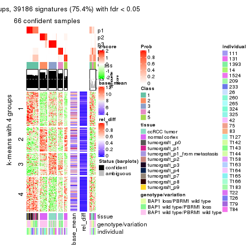</p>

</div>
<div id='tab-ATC-mclust-get-signatures-5'>
<pre><code class="r">get_signatures(res, k = 6)
</code></pre>

<p></p>

</div>
</div>


Signature heatmaps where rows are not scaled:


<script>
$( function() {
	$( '#tabs-ATC-mclust-get-signatures-no-scale' ).tabs();
} );
</script>
<div id='tabs-ATC-mclust-get-signatures-no-scale'>
<ul>
<li><a href='#tab-ATC-mclust-get-signatures-no-scale-1'>k = 2</a></li>
<li><a href='#tab-ATC-mclust-get-signatures-no-scale-2'>k = 3</a></li>
<li><a href='#tab-ATC-mclust-get-signatures-no-scale-3'>k = 4</a></li>
<li><a href='#tab-ATC-mclust-get-signatures-no-scale-4'>k = 5</a></li>
<li><a href='#tab-ATC-mclust-get-signatures-no-scale-5'>k = 6</a></li>
</ul>
<div id='tab-ATC-mclust-get-signatures-no-scale-1'>
<pre><code class="r">get_signatures(res, k = 2, scale_rows = FALSE)
</code></pre>

<p></p>

</div>
<div id='tab-ATC-mclust-get-signatures-no-scale-2'>
<pre><code class="r">get_signatures(res, k = 3, scale_rows = FALSE)
</code></pre>

<p></p>

</div>
<div id='tab-ATC-mclust-get-signatures-no-scale-3'>
<pre><code class="r">get_signatures(res, k = 4, scale_rows = FALSE)
</code></pre>

<p></p>

</div>
<div id='tab-ATC-mclust-get-signatures-no-scale-4'>
<pre><code class="r">get_signatures(res, k = 5, scale_rows = FALSE)
</code></pre>

<p>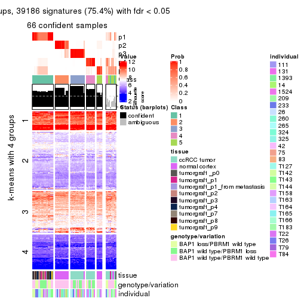</p>

</div>
<div id='tab-ATC-mclust-get-signatures-no-scale-5'>
<pre><code class="r">get_signatures(res, k = 6, scale_rows = FALSE)
</code></pre>

<p></p>

</div>
</div>


Compare the overlap of signatures from different k:

```r
compare_signatures(res)
```


`get_signature()` returns a data frame invisibly. TO get the list of signatures, the function
call should be assigned to a variable explicitly. In following code, if `plot` argument is set
to `FALSE`, no heatmap is plotted while only the differential analysis is performed.

```r
# code only for demonstration
tb = get_signature(res, k = ..., plot = FALSE)
```

An example of the output of `tb` is:

```
#>   which_row         fdr    mean_1    mean_2 scaled_mean_1 scaled_mean_2 km
#> 1        38 0.042760348  8.373488  9.131774    -0.5533452     0.5164555  1
#> 2        40 0.018707592  7.106213  8.469186    -0.6173731     0.5762149  1
#> 3        55 0.019134737 10.221463 11.207825    -0.6159697     0.5749050  1
#> 4        59 0.006059896  5.921854  7.869574    -0.6899429     0.6439467  1
#> 5        60 0.018055526  8.928898 10.211722    -0.6204761     0.5791110  1
#> 6        98 0.009384629 15.714769 14.887706     0.6635654    -0.6193277  2
...
```

The columns in `tb` are:

1. `which_row`: row indices corresponding to the input matrix.
2. `fdr`: FDR for the differential test. 
3. `mean_x`: The mean value in group x.
4. `scaled_mean_x`: The mean value in group x after rows are scaled.
5. `km`: Row groups if k-means clustering is applied to rows.


UMAP plot which shows how samples are separated.


<script>
$( function() {
	$( '#tabs-ATC-mclust-dimension-reduction' ).tabs();
} );
</script>
<div id='tabs-ATC-mclust-dimension-reduction'>
<ul>
<li><a href='#tab-ATC-mclust-dimension-reduction-1'>k = 2</a></li>
<li><a href='#tab-ATC-mclust-dimension-reduction-2'>k = 3</a></li>
<li><a href='#tab-ATC-mclust-dimension-reduction-3'>k = 4</a></li>
<li><a href='#tab-ATC-mclust-dimension-reduction-4'>k = 5</a></li>
<li><a href='#tab-ATC-mclust-dimension-reduction-5'>k = 6</a></li>
</ul>
<div id='tab-ATC-mclust-dimension-reduction-1'>
<pre><code class="r">dimension_reduction(res, k = 2, method = &quot;UMAP&quot;)
</code></pre>

<p></p>

</div>
<div id='tab-ATC-mclust-dimension-reduction-2'>
<pre><code class="r">dimension_reduction(res, k = 3, method = &quot;UMAP&quot;)
</code></pre>

<p></p>

</div>
<div id='tab-ATC-mclust-dimension-reduction-3'>
<pre><code class="r">dimension_reduction(res, k = 4, method = &quot;UMAP&quot;)
</code></pre>

<p></p>

</div>
<div id='tab-ATC-mclust-dimension-reduction-4'>
<pre><code class="r">dimension_reduction(res, k = 5, method = &quot;UMAP&quot;)
</code></pre>

<p></p>

</div>
<div id='tab-ATC-mclust-dimension-reduction-5'>
<pre><code class="r">dimension_reduction(res, k = 6, method = &quot;UMAP&quot;)
</code></pre>

<p></p>

</div>
</div>


Following heatmap shows how subgroups are split when increasing `k`:

```r
collect_classes(res)
```


Test correlation between subgroups and known annotations. If the known
annotation is numeric, one-way ANOVA test is applied, and if the known
annotation is discrete, chi-squared contingency table test is applied.

```r
test_to_known_factors(res)
```

```
#>             n tissue(p) genotype/variation(p) individual(p) k
#> ATC:mclust 75  9.46e-07              2.26e-04       0.00555 2
#> ATC:mclust 38  3.80e-05              7.26e-04       0.07302 3
#> ATC:mclust 64  3.06e-13              1.80e-03       0.63962 4
#> ATC:mclust 66  6.83e-11              2.24e-04       0.38834 5
#> ATC:mclust 64  5.59e-14              8.52e-06       0.24640 6
```


If matrix rows can be associated to genes, consider to use `functional_enrichment(res,
...)` to perform function enrichment for the signature genes. See [this vignette](http://bioconductor.org/packages/devel/bioc/vignettes/cola/inst/doc/functional_enrichment.html) for more detailed explanations.


 

---------------------------------------------------


### ATC:NMF**


The object with results only for a single top-value method and a single partition method 
can be extracted as:

```r
res = res_list["ATC", "NMF"]
# you can also extract it by
# res = res_list["ATC:NMF"]
```

A summary of `res` and all the functions that can be applied to it:

```r
res
```

```
#> A 'ConsensusPartition' object with k = 2, 3, 4, 5, 6.
#>   On a matrix with 51941 rows and 76 columns.
#>   Top rows (1000, 2000, 3000, 4000, 5000) are extracted by 'ATC' method.
#>   Subgroups are detected by 'NMF' method.
#>   Performed in total 1250 partitions by row resampling.
#>   Best k for subgroups seems to be 2.
#> 
#> Following methods can be applied to this 'ConsensusPartition' object:
#>  [1] "cola_report"             "collect_classes"         "collect_plots"          
#>  [4] "collect_stats"           "colnames"                "compare_signatures"     
#>  [7] "consensus_heatmap"       "dimension_reduction"     "functional_enrichment"  
#> [10] "get_anno_col"            "get_anno"                "get_classes"            
#> [13] "get_consensus"           "get_matrix"              "get_membership"         
#> [16] "get_param"               "get_signatures"          "get_stats"              
#> [19] "is_best_k"               "is_stable_k"             "membership_heatmap"     
#> [22] "ncol"                    "nrow"                    "plot_ecdf"              
#> [25] "rownames"                "select_partition_number" "show"                   
#> [28] "suggest_best_k"          "test_to_known_factors"
```

`collect_plots()` function collects all the plots made from `res` for all `k` (number of partitions)
into one single page to provide an easy and fast comparison between different `k`.

```r
collect_plots(res)
```


The plots are:

- The first row: a plot of the ECDF (empirical cumulative distribution
  function) curves of the consensus matrix for each `k` and the heatmap of
  predicted classes for each `k`.
- The second row: heatmaps of the consensus matrix for each `k`.
- The third row: heatmaps of the membership matrix for each `k`.
- The fouth row: heatmaps of the signatures for each `k`.

All the plots in panels can be made by individual functions and they are
plotted later in this section.

`select_partition_number()` produces several plots showing different
statistics for choosing "optimized" `k`. There are following statistics:

- ECDF curves of the consensus matrix for each `k`;
- 1-PAC. [The PAC
  score](https://en.wikipedia.org/wiki/Consensus_clustering#Over-interpretation_potential_of_consensus_clustering)
  measures the proportion of the ambiguous subgrouping.
- Mean silhouette score.
- Concordance. The mean probability of fiting the consensus class ids in all
  partitions.
- Area increased. Denote $A_k$ as the area under the ECDF curve for current
  `k`, the area increased is defined as $A_k - A_{k-1}$.
- Rand index. The percent of pairs of samples that are both in a same cluster
  or both are not in a same cluster in the partition of k and k-1.
- Jaccard index. The ratio of pairs of samples are both in a same cluster in
  the partition of k and k-1 and the pairs of samples are both in a same
  cluster in the partition k or k-1.

The detailed explanations of these statistics can be found in [the _cola_
vignette](http://bioconductor.org/packages/devel/bioc/vignettes/cola/inst/doc/cola.html#toc_13).

Generally speaking, lower PAC score, higher mean silhouette score or higher
concordance corresponds to better partition. Rand index and Jaccard index
measure how similar the current partition is compared to partition with `k-1`.
If they are too similar, we won't accept `k` is better than `k-1`.

```r
select_partition_number(res)
```


The numeric values for all these statistics can be obtained by `get_stats()`.

```r
get_stats(res)
```

```
#>   k 1-PAC mean_silhouette concordance area_increased  Rand Jaccard
#> 2 2 1.000           0.986       0.994         0.5056 0.495   0.495
#> 3 3 0.762           0.789       0.893         0.2712 0.821   0.649
#> 4 4 0.794           0.787       0.888         0.1504 0.807   0.510
#> 5 5 0.796           0.686       0.828         0.0508 0.954   0.824
#> 6 6 0.784           0.717       0.824         0.0261 0.967   0.863
```

`suggest_best_k()` suggests the best $k$ based on these statistics. The rules are as follows:

- All $k$ with Jaccard index larger than 0.95 are removed because increasing
  $k$ does not provide enough extra information. If all $k$ are removed, it is
  marked as no subgroup is detected.
- For all $k$ with 1-PAC score larger than 0.9, the maximal $k$ is taken as
  the best $k$, and other $k$ are marked as optional $k$.
- If it does not fit the second rule. The $k$ with the maximal vote of the
  highest 1-PAC score, highest mean silhouette, and highest concordance is
  taken as the best $k$.

```r
suggest_best_k(res)
```

```
#> [1] 2
```


Following shows the table of the partitions (You need to click the **show/hide
code output** link to see it). The membership matrix (columns with name `p*`)
is inferred by
[`clue::cl_consensus()`](https://www.rdocumentation.org/link/cl_consensus?package=clue)
function with the `SE` method. Basically the value in the membership matrix
represents the probability to belong to a certain group. The finall class
label for an item is determined with the group with highest probability it
belongs to.

In `get_classes()` function, the entropy is calculated from the membership
matrix and the silhouette score is calculated from the consensus matrix.


<script>
$( function() {
	$( '#tabs-ATC-NMF-get-classes' ).tabs();
} );
</script>
<div id='tabs-ATC-NMF-get-classes'>
<ul>
<li><a href='#tab-ATC-NMF-get-classes-1'>k = 2</a></li>
<li><a href='#tab-ATC-NMF-get-classes-2'>k = 3</a></li>
<li><a href='#tab-ATC-NMF-get-classes-3'>k = 4</a></li>
<li><a href='#tab-ATC-NMF-get-classes-4'>k = 5</a></li>
<li><a href='#tab-ATC-NMF-get-classes-5'>k = 6</a></li>
</ul>

<div id='tab-ATC-NMF-get-classes-1'>
<p><a id='tab-ATC-NMF-get-classes-1-a' style='color:#0366d6' href='#'>show/hide code output</a></p>
<pre><code class="r">cbind(get_classes(res, k = 2), get_membership(res, k = 2))
</code></pre>

<pre><code>#&gt;           class entropy silhouette    p1    p2
#&gt; GSM905004     1  0.0000      0.994 1.000 0.000
#&gt; GSM905024     1  0.0000      0.994 1.000 0.000
#&gt; GSM905038     1  0.1184      0.979 0.984 0.016
#&gt; GSM905043     1  0.0000      0.994 1.000 0.000
#&gt; GSM904986     2  0.0000      0.993 0.000 1.000
#&gt; GSM904991     1  0.4815      0.887 0.896 0.104
#&gt; GSM904994     2  0.0000      0.993 0.000 1.000
#&gt; GSM904996     2  0.0000      0.993 0.000 1.000
#&gt; GSM905007     2  0.0672      0.986 0.008 0.992
#&gt; GSM905012     2  0.0000      0.993 0.000 1.000
#&gt; GSM905022     2  0.0000      0.993 0.000 1.000
#&gt; GSM905026     2  0.0376      0.990 0.004 0.996
#&gt; GSM905027     2  0.8016      0.674 0.244 0.756
#&gt; GSM905031     2  0.0376      0.990 0.004 0.996
#&gt; GSM905036     1  0.0000      0.994 1.000 0.000
#&gt; GSM905041     1  0.0000      0.994 1.000 0.000
#&gt; GSM905044     2  0.0000      0.993 0.000 1.000
#&gt; GSM904989     2  0.0000      0.993 0.000 1.000
#&gt; GSM904999     2  0.0000      0.993 0.000 1.000
#&gt; GSM905002     2  0.0000      0.993 0.000 1.000
#&gt; GSM905009     2  0.0000      0.993 0.000 1.000
#&gt; GSM905014     2  0.0000      0.993 0.000 1.000
#&gt; GSM905017     2  0.0000      0.993 0.000 1.000
#&gt; GSM905020     2  0.0000      0.993 0.000 1.000
#&gt; GSM905023     1  0.0000      0.994 1.000 0.000
#&gt; GSM905029     1  0.4690      0.892 0.900 0.100
#&gt; GSM905032     1  0.0000      0.994 1.000 0.000
#&gt; GSM905034     1  0.0000      0.994 1.000 0.000
#&gt; GSM905040     1  0.0000      0.994 1.000 0.000
#&gt; GSM904985     2  0.0000      0.993 0.000 1.000
#&gt; GSM904988     2  0.0000      0.993 0.000 1.000
#&gt; GSM904990     2  0.0000      0.993 0.000 1.000
#&gt; GSM904992     2  0.0000      0.993 0.000 1.000
#&gt; GSM904995     2  0.0000      0.993 0.000 1.000
#&gt; GSM904998     2  0.0000      0.993 0.000 1.000
#&gt; GSM905000     2  0.0000      0.993 0.000 1.000
#&gt; GSM905003     2  0.0000      0.993 0.000 1.000
#&gt; GSM905006     2  0.0000      0.993 0.000 1.000
#&gt; GSM905008     2  0.0000      0.993 0.000 1.000
#&gt; GSM905011     2  0.0000      0.993 0.000 1.000
#&gt; GSM905013     2  0.0000      0.993 0.000 1.000
#&gt; GSM905016     2  0.0000      0.993 0.000 1.000
#&gt; GSM905018     2  0.0000      0.993 0.000 1.000
#&gt; GSM905021     2  0.0000      0.993 0.000 1.000
#&gt; GSM905025     2  0.0000      0.993 0.000 1.000
#&gt; GSM905028     2  0.0000      0.993 0.000 1.000
#&gt; GSM905030     2  0.0000      0.993 0.000 1.000
#&gt; GSM905033     2  0.0000      0.993 0.000 1.000
#&gt; GSM905035     2  0.0000      0.993 0.000 1.000
#&gt; GSM905037     2  0.0000      0.993 0.000 1.000
#&gt; GSM905039     2  0.0000      0.993 0.000 1.000
#&gt; GSM905042     2  0.0000      0.993 0.000 1.000
#&gt; GSM905046     1  0.0000      0.994 1.000 0.000
#&gt; GSM905065     1  0.0000      0.994 1.000 0.000
#&gt; GSM905049     1  0.0000      0.994 1.000 0.000
#&gt; GSM905050     1  0.0000      0.994 1.000 0.000
#&gt; GSM905064     1  0.0000      0.994 1.000 0.000
#&gt; GSM905045     1  0.0000      0.994 1.000 0.000
#&gt; GSM905051     1  0.0000      0.994 1.000 0.000
#&gt; GSM905055     1  0.0000      0.994 1.000 0.000
#&gt; GSM905058     1  0.0000      0.994 1.000 0.000
#&gt; GSM905053     1  0.0000      0.994 1.000 0.000
#&gt; GSM905061     1  0.0000      0.994 1.000 0.000
#&gt; GSM905063     1  0.0000      0.994 1.000 0.000
#&gt; GSM905054     1  0.0000      0.994 1.000 0.000
#&gt; GSM905062     1  0.0000      0.994 1.000 0.000
#&gt; GSM905052     1  0.0000      0.994 1.000 0.000
#&gt; GSM905059     1  0.0000      0.994 1.000 0.000
#&gt; GSM905047     1  0.0000      0.994 1.000 0.000
#&gt; GSM905066     1  0.0000      0.994 1.000 0.000
#&gt; GSM905056     1  0.0000      0.994 1.000 0.000
#&gt; GSM905060     1  0.0000      0.994 1.000 0.000
#&gt; GSM905048     1  0.0000      0.994 1.000 0.000
#&gt; GSM905067     1  0.0000      0.994 1.000 0.000
#&gt; GSM905057     1  0.0000      0.994 1.000 0.000
#&gt; GSM905068     1  0.0000      0.994 1.000 0.000
</code></pre>

<script>
$('#tab-ATC-NMF-get-classes-1-a').parent().next().next().hide();
$('#tab-ATC-NMF-get-classes-1-a').click(function(){
  $('#tab-ATC-NMF-get-classes-1-a').parent().next().next().toggle();
  return(false);
});
</script>
</div>

<div id='tab-ATC-NMF-get-classes-2'>
<p><a id='tab-ATC-NMF-get-classes-2-a' style='color:#0366d6' href='#'>show/hide code output</a></p>
<pre><code class="r">cbind(get_classes(res, k = 3), get_membership(res, k = 3))
</code></pre>

<pre><code>#&gt;           class entropy silhouette    p1    p2    p3
#&gt; GSM905004     1  0.1529      0.955 0.960 0.040 0.000
#&gt; GSM905024     1  0.0000      0.978 1.000 0.000 0.000
#&gt; GSM905038     1  0.4702      0.716 0.788 0.000 0.212
#&gt; GSM905043     1  0.0000      0.978 1.000 0.000 0.000
#&gt; GSM904986     3  0.0000      0.784 0.000 0.000 1.000
#&gt; GSM904991     3  0.5733      0.478 0.324 0.000 0.676
#&gt; GSM904994     3  0.0000      0.784 0.000 0.000 1.000
#&gt; GSM904996     3  0.0000      0.784 0.000 0.000 1.000
#&gt; GSM905007     3  0.3551      0.676 0.132 0.000 0.868
#&gt; GSM905012     3  0.0000      0.784 0.000 0.000 1.000
#&gt; GSM905022     3  0.0000      0.784 0.000 0.000 1.000
#&gt; GSM905026     3  0.5988      0.464 0.000 0.368 0.632
#&gt; GSM905027     3  0.6567      0.613 0.088 0.160 0.752
#&gt; GSM905031     3  0.6215      0.369 0.000 0.428 0.572
#&gt; GSM905036     1  0.0747      0.971 0.984 0.016 0.000
#&gt; GSM905041     1  0.1753      0.937 0.952 0.000 0.048
#&gt; GSM905044     3  0.0000      0.784 0.000 0.000 1.000
#&gt; GSM904989     3  0.0000      0.784 0.000 0.000 1.000
#&gt; GSM904999     3  0.0000      0.784 0.000 0.000 1.000
#&gt; GSM905002     3  0.0000      0.784 0.000 0.000 1.000
#&gt; GSM905009     3  0.0000      0.784 0.000 0.000 1.000
#&gt; GSM905014     3  0.1163      0.765 0.028 0.000 0.972
#&gt; GSM905017     3  0.0000      0.784 0.000 0.000 1.000
#&gt; GSM905020     3  0.0000      0.784 0.000 0.000 1.000
#&gt; GSM905023     1  0.0000      0.978 1.000 0.000 0.000
#&gt; GSM905029     3  0.5988      0.384 0.368 0.000 0.632
#&gt; GSM905032     1  0.0592      0.973 0.988 0.012 0.000
#&gt; GSM905034     1  0.0000      0.978 1.000 0.000 0.000
#&gt; GSM905040     1  0.0000      0.978 1.000 0.000 0.000
#&gt; GSM904985     3  0.6309     -0.484 0.000 0.496 0.504
#&gt; GSM904988     2  0.4974      0.816 0.000 0.764 0.236
#&gt; GSM904990     2  0.4931      0.816 0.000 0.768 0.232
#&gt; GSM904992     2  0.5529      0.801 0.000 0.704 0.296
#&gt; GSM904995     2  0.5760      0.781 0.000 0.672 0.328
#&gt; GSM904998     2  0.6111      0.697 0.000 0.604 0.396
#&gt; GSM905000     2  0.5835      0.770 0.000 0.660 0.340
#&gt; GSM905003     3  0.6140     -0.203 0.000 0.404 0.596
#&gt; GSM905006     2  0.4702      0.813 0.000 0.788 0.212
#&gt; GSM905008     3  0.6274     -0.370 0.000 0.456 0.544
#&gt; GSM905011     2  0.4842      0.815 0.000 0.776 0.224
#&gt; GSM905013     2  0.5988      0.741 0.000 0.632 0.368
#&gt; GSM905016     2  0.6026      0.730 0.000 0.624 0.376
#&gt; GSM905018     2  0.6008      0.735 0.000 0.628 0.372
#&gt; GSM905021     3  0.0000      0.784 0.000 0.000 1.000
#&gt; GSM905025     2  0.0000      0.712 0.000 1.000 0.000
#&gt; GSM905028     2  0.1529      0.744 0.000 0.960 0.040
#&gt; GSM905030     2  0.1411      0.742 0.000 0.964 0.036
#&gt; GSM905033     2  0.5529      0.801 0.000 0.704 0.296
#&gt; GSM905035     2  0.0892      0.731 0.000 0.980 0.020
#&gt; GSM905037     2  0.1289      0.739 0.000 0.968 0.032
#&gt; GSM905039     2  0.0892      0.731 0.000 0.980 0.020
#&gt; GSM905042     2  0.5291      0.811 0.000 0.732 0.268
#&gt; GSM905046     1  0.0000      0.978 1.000 0.000 0.000
#&gt; GSM905065     1  0.0000      0.978 1.000 0.000 0.000
#&gt; GSM905049     1  0.2356      0.931 0.928 0.072 0.000
#&gt; GSM905050     1  0.5098      0.737 0.752 0.248 0.000
#&gt; GSM905064     1  0.0000      0.978 1.000 0.000 0.000
#&gt; GSM905045     1  0.1529      0.957 0.960 0.040 0.000
#&gt; GSM905051     1  0.0000      0.978 1.000 0.000 0.000
#&gt; GSM905055     1  0.0000      0.978 1.000 0.000 0.000
#&gt; GSM905058     1  0.0000      0.978 1.000 0.000 0.000
#&gt; GSM905053     1  0.0000      0.978 1.000 0.000 0.000
#&gt; GSM905061     1  0.1163      0.964 0.972 0.028 0.000
#&gt; GSM905063     1  0.0592      0.973 0.988 0.012 0.000
#&gt; GSM905054     1  0.0237      0.976 0.996 0.004 0.000
#&gt; GSM905062     1  0.1289      0.962 0.968 0.032 0.000
#&gt; GSM905052     1  0.0000      0.978 1.000 0.000 0.000
#&gt; GSM905059     1  0.0000      0.978 1.000 0.000 0.000
#&gt; GSM905047     1  0.0000      0.978 1.000 0.000 0.000
#&gt; GSM905066     1  0.0000      0.978 1.000 0.000 0.000
#&gt; GSM905056     1  0.0000      0.978 1.000 0.000 0.000
#&gt; GSM905060     1  0.0000      0.978 1.000 0.000 0.000
#&gt; GSM905048     1  0.0000      0.978 1.000 0.000 0.000
#&gt; GSM905067     1  0.0000      0.978 1.000 0.000 0.000
#&gt; GSM905057     1  0.0000      0.978 1.000 0.000 0.000
#&gt; GSM905068     1  0.0000      0.978 1.000 0.000 0.000
</code></pre>

<script>
$('#tab-ATC-NMF-get-classes-2-a').parent().next().next().hide();
$('#tab-ATC-NMF-get-classes-2-a').click(function(){
  $('#tab-ATC-NMF-get-classes-2-a').parent().next().next().toggle();
  return(false);
});
</script>
</div>

<div id='tab-ATC-NMF-get-classes-3'>
<p><a id='tab-ATC-NMF-get-classes-3-a' style='color:#0366d6' href='#'>show/hide code output</a></p>
<pre><code class="r">cbind(get_classes(res, k = 4), get_membership(res, k = 4))
</code></pre>

<pre><code>#&gt;           class entropy silhouette    p1    p2    p3    p4
#&gt; GSM905004     4  0.5633     0.5318 0.380 0.008 0.016 0.596
#&gt; GSM905024     1  0.0336     0.9235 0.992 0.000 0.000 0.008
#&gt; GSM905038     3  0.4963     0.5378 0.020 0.000 0.696 0.284
#&gt; GSM905043     1  0.2021     0.8533 0.936 0.000 0.040 0.024
#&gt; GSM904986     3  0.1398     0.8869 0.000 0.040 0.956 0.004
#&gt; GSM904991     3  0.1302     0.8588 0.044 0.000 0.956 0.000
#&gt; GSM904994     3  0.1576     0.8840 0.000 0.048 0.948 0.004
#&gt; GSM904996     3  0.1902     0.8796 0.000 0.064 0.932 0.004
#&gt; GSM905007     3  0.1339     0.8841 0.008 0.024 0.964 0.004
#&gt; GSM905012     3  0.4387     0.7512 0.000 0.200 0.776 0.024
#&gt; GSM905022     3  0.1305     0.8871 0.000 0.036 0.960 0.004
#&gt; GSM905026     4  0.3355     0.6000 0.000 0.004 0.160 0.836
#&gt; GSM905027     3  0.2048     0.8466 0.000 0.008 0.928 0.064
#&gt; GSM905031     4  0.2924     0.6360 0.000 0.016 0.100 0.884
#&gt; GSM905036     4  0.3176     0.6607 0.036 0.000 0.084 0.880
#&gt; GSM905041     3  0.5933     0.1206 0.464 0.000 0.500 0.036
#&gt; GSM905044     3  0.1706     0.8658 0.000 0.016 0.948 0.036
#&gt; GSM904989     3  0.2610     0.8593 0.000 0.088 0.900 0.012
#&gt; GSM904999     3  0.1305     0.8871 0.000 0.036 0.960 0.004
#&gt; GSM905002     3  0.1211     0.8867 0.000 0.040 0.960 0.000
#&gt; GSM905009     3  0.4406     0.7579 0.000 0.192 0.780 0.028
#&gt; GSM905014     3  0.1256     0.8861 0.008 0.028 0.964 0.000
#&gt; GSM905017     3  0.1305     0.8871 0.000 0.036 0.960 0.004
#&gt; GSM905020     3  0.3324     0.8275 0.000 0.136 0.852 0.012
#&gt; GSM905023     4  0.6087     0.1870 0.048 0.000 0.412 0.540
#&gt; GSM905029     3  0.2261     0.8600 0.024 0.008 0.932 0.036
#&gt; GSM905032     4  0.5404     0.0801 0.476 0.000 0.012 0.512
#&gt; GSM905034     1  0.0376     0.9272 0.992 0.000 0.004 0.004
#&gt; GSM905040     1  0.0188     0.9276 0.996 0.000 0.000 0.004
#&gt; GSM904985     2  0.1118     0.9239 0.000 0.964 0.036 0.000
#&gt; GSM904988     2  0.0188     0.9311 0.000 0.996 0.004 0.000
#&gt; GSM904990     2  0.0000     0.9302 0.000 1.000 0.000 0.000
#&gt; GSM904992     2  0.0188     0.9311 0.000 0.996 0.004 0.000
#&gt; GSM904995     2  0.0592     0.9318 0.000 0.984 0.016 0.000
#&gt; GSM904998     2  0.0592     0.9318 0.000 0.984 0.016 0.000
#&gt; GSM905000     2  0.0469     0.9318 0.000 0.988 0.012 0.000
#&gt; GSM905003     2  0.1398     0.9201 0.000 0.956 0.040 0.004
#&gt; GSM905006     2  0.0524     0.9255 0.000 0.988 0.004 0.008
#&gt; GSM905008     2  0.1305     0.9225 0.000 0.960 0.036 0.004
#&gt; GSM905011     2  0.0000     0.9302 0.000 1.000 0.000 0.000
#&gt; GSM905013     2  0.0592     0.9318 0.000 0.984 0.016 0.000
#&gt; GSM905016     2  0.0592     0.9318 0.000 0.984 0.016 0.000
#&gt; GSM905018     2  0.0592     0.9318 0.000 0.984 0.016 0.000
#&gt; GSM905021     2  0.3791     0.7616 0.000 0.796 0.200 0.004
#&gt; GSM905025     4  0.2593     0.6305 0.000 0.104 0.004 0.892
#&gt; GSM905028     2  0.1489     0.9109 0.000 0.952 0.004 0.044
#&gt; GSM905030     2  0.1867     0.8988 0.000 0.928 0.000 0.072
#&gt; GSM905033     2  0.3523     0.8521 0.000 0.856 0.112 0.032
#&gt; GSM905035     2  0.4690     0.7025 0.000 0.712 0.012 0.276
#&gt; GSM905037     2  0.2125     0.8992 0.000 0.920 0.004 0.076
#&gt; GSM905039     2  0.3402     0.8269 0.000 0.832 0.004 0.164
#&gt; GSM905042     2  0.5834     0.6998 0.000 0.704 0.172 0.124
#&gt; GSM905046     1  0.0000     0.9289 1.000 0.000 0.000 0.000
#&gt; GSM905065     1  0.0188     0.9289 0.996 0.000 0.004 0.000
#&gt; GSM905049     4  0.4631     0.6489 0.260 0.004 0.008 0.728
#&gt; GSM905050     4  0.1743     0.6835 0.056 0.000 0.004 0.940
#&gt; GSM905064     1  0.0336     0.9254 0.992 0.000 0.000 0.008
#&gt; GSM905045     4  0.4401     0.6459 0.272 0.004 0.000 0.724
#&gt; GSM905051     1  0.0927     0.9121 0.976 0.000 0.008 0.016
#&gt; GSM905055     1  0.0000     0.9289 1.000 0.000 0.000 0.000
#&gt; GSM905058     1  0.0188     0.9289 0.996 0.000 0.004 0.000
#&gt; GSM905053     4  0.5365     0.4966 0.412 0.004 0.008 0.576
#&gt; GSM905061     1  0.5168    -0.3299 0.504 0.000 0.004 0.492
#&gt; GSM905063     1  0.1635     0.8858 0.948 0.000 0.008 0.044
#&gt; GSM905054     1  0.5055     0.0985 0.624 0.000 0.008 0.368
#&gt; GSM905062     4  0.5203     0.4930 0.416 0.000 0.008 0.576
#&gt; GSM905052     1  0.0804     0.9159 0.980 0.000 0.008 0.012
#&gt; GSM905059     1  0.0188     0.9289 0.996 0.000 0.004 0.000
#&gt; GSM905047     1  0.0188     0.9277 0.996 0.000 0.000 0.004
#&gt; GSM905066     1  0.0188     0.9289 0.996 0.000 0.004 0.000
#&gt; GSM905056     1  0.0000     0.9289 1.000 0.000 0.000 0.000
#&gt; GSM905060     1  0.0188     0.9289 0.996 0.000 0.004 0.000
#&gt; GSM905048     1  0.0000     0.9289 1.000 0.000 0.000 0.000
#&gt; GSM905067     1  0.0188     0.9289 0.996 0.000 0.004 0.000
#&gt; GSM905057     1  0.0000     0.9289 1.000 0.000 0.000 0.000
#&gt; GSM905068     4  0.5172     0.5135 0.404 0.000 0.008 0.588
</code></pre>

<script>
$('#tab-ATC-NMF-get-classes-3-a').parent().next().next().hide();
$('#tab-ATC-NMF-get-classes-3-a').click(function(){
  $('#tab-ATC-NMF-get-classes-3-a').parent().next().next().toggle();
  return(false);
});
</script>
</div>

<div id='tab-ATC-NMF-get-classes-4'>
<p><a id='tab-ATC-NMF-get-classes-4-a' style='color:#0366d6' href='#'>show/hide code output</a></p>
<pre><code class="r">cbind(get_classes(res, k = 5), get_membership(res, k = 5))
</code></pre>

<pre><code>#&gt;           class entropy silhouette    p1    p2    p3    p4    p5
#&gt; GSM905004     4  0.2674     0.3075 0.004 0.000 0.140 0.856 0.000
#&gt; GSM905024     1  0.0955     0.8848 0.968 0.000 0.004 0.000 0.028
#&gt; GSM905038     5  0.4287     0.5722 0.000 0.000 0.460 0.000 0.540
#&gt; GSM905043     1  0.2719     0.7790 0.852 0.000 0.004 0.000 0.144
#&gt; GSM904986     3  0.2130     0.5774 0.000 0.012 0.908 0.000 0.080
#&gt; GSM904991     3  0.1410     0.6926 0.000 0.000 0.940 0.060 0.000
#&gt; GSM904994     3  0.3282     0.7055 0.000 0.008 0.804 0.188 0.000
#&gt; GSM904996     3  0.3339     0.7101 0.000 0.040 0.836 0.124 0.000
#&gt; GSM905007     3  0.3774     0.6676 0.000 0.000 0.704 0.296 0.000
#&gt; GSM905012     3  0.5320     0.6012 0.000 0.060 0.572 0.368 0.000
#&gt; GSM905022     3  0.1743     0.6386 0.000 0.028 0.940 0.004 0.028
#&gt; GSM905026     5  0.4030     0.6494 0.000 0.000 0.352 0.000 0.648
#&gt; GSM905027     5  0.4305     0.5352 0.000 0.000 0.488 0.000 0.512
#&gt; GSM905031     5  0.3055     0.4284 0.000 0.000 0.072 0.064 0.864
#&gt; GSM905036     5  0.1914     0.4846 0.000 0.000 0.060 0.016 0.924
#&gt; GSM905041     5  0.5778     0.5025 0.088 0.000 0.452 0.000 0.460
#&gt; GSM905044     3  0.4448    -0.5590 0.000 0.004 0.516 0.000 0.480
#&gt; GSM904989     3  0.4201     0.6507 0.000 0.008 0.664 0.328 0.000
#&gt; GSM904999     3  0.1300     0.6461 0.000 0.028 0.956 0.000 0.016
#&gt; GSM905002     3  0.2674     0.7124 0.000 0.012 0.868 0.120 0.000
#&gt; GSM905009     3  0.4599     0.5948 0.000 0.016 0.600 0.384 0.000
#&gt; GSM905014     3  0.2230     0.7093 0.000 0.000 0.884 0.116 0.000
#&gt; GSM905017     3  0.1818     0.6304 0.000 0.044 0.932 0.000 0.024
#&gt; GSM905020     3  0.5087     0.6482 0.000 0.064 0.644 0.292 0.000
#&gt; GSM905023     5  0.4088     0.6471 0.000 0.000 0.368 0.000 0.632
#&gt; GSM905029     3  0.4151    -0.1953 0.000 0.004 0.652 0.000 0.344
#&gt; GSM905032     5  0.2903     0.2896 0.080 0.000 0.000 0.048 0.872
#&gt; GSM905034     1  0.1502     0.8701 0.940 0.000 0.004 0.000 0.056
#&gt; GSM905040     1  0.1282     0.8765 0.952 0.000 0.004 0.000 0.044
#&gt; GSM904985     2  0.0290     0.9285 0.000 0.992 0.008 0.000 0.000
#&gt; GSM904988     2  0.0000     0.9315 0.000 1.000 0.000 0.000 0.000
#&gt; GSM904990     2  0.0162     0.9303 0.000 0.996 0.000 0.004 0.000
#&gt; GSM904992     2  0.0000     0.9315 0.000 1.000 0.000 0.000 0.000
#&gt; GSM904995     2  0.0000     0.9315 0.000 1.000 0.000 0.000 0.000
#&gt; GSM904998     2  0.0000     0.9315 0.000 1.000 0.000 0.000 0.000
#&gt; GSM905000     2  0.0000     0.9315 0.000 1.000 0.000 0.000 0.000
#&gt; GSM905003     2  0.0290     0.9285 0.000 0.992 0.008 0.000 0.000
#&gt; GSM905006     2  0.0162     0.9303 0.000 0.996 0.000 0.004 0.000
#&gt; GSM905008     2  0.0290     0.9285 0.000 0.992 0.008 0.000 0.000
#&gt; GSM905011     2  0.0162     0.9303 0.000 0.996 0.000 0.004 0.000
#&gt; GSM905013     2  0.0000     0.9315 0.000 1.000 0.000 0.000 0.000
#&gt; GSM905016     2  0.0000     0.9315 0.000 1.000 0.000 0.000 0.000
#&gt; GSM905018     2  0.0000     0.9315 0.000 1.000 0.000 0.000 0.000
#&gt; GSM905021     2  0.2561     0.8032 0.000 0.856 0.144 0.000 0.000
#&gt; GSM905025     4  0.5044     0.4448 0.000 0.032 0.000 0.504 0.464
#&gt; GSM905028     2  0.0162     0.9305 0.000 0.996 0.000 0.004 0.000
#&gt; GSM905030     2  0.1522     0.9029 0.000 0.944 0.000 0.044 0.012
#&gt; GSM905033     2  0.3317     0.8063 0.000 0.840 0.044 0.000 0.116
#&gt; GSM905035     2  0.4639     0.6612 0.000 0.708 0.000 0.056 0.236
#&gt; GSM905037     2  0.1408     0.9054 0.000 0.948 0.000 0.044 0.008
#&gt; GSM905039     2  0.2592     0.8668 0.000 0.892 0.000 0.052 0.056
#&gt; GSM905042     2  0.5778    -0.0502 0.000 0.460 0.088 0.000 0.452
#&gt; GSM905046     1  0.0162     0.8934 0.996 0.000 0.004 0.000 0.000
#&gt; GSM905065     1  0.0162     0.8934 0.996 0.000 0.004 0.000 0.000
#&gt; GSM905049     4  0.4562     0.5553 0.032 0.000 0.000 0.676 0.292
#&gt; GSM905050     4  0.4283     0.4807 0.000 0.000 0.000 0.544 0.456
#&gt; GSM905064     1  0.1106     0.8774 0.964 0.000 0.000 0.024 0.012
#&gt; GSM905045     4  0.6738     0.5027 0.256 0.000 0.000 0.376 0.368
#&gt; GSM905051     1  0.2629     0.7860 0.860 0.000 0.004 0.136 0.000
#&gt; GSM905055     1  0.0000     0.8936 1.000 0.000 0.000 0.000 0.000
#&gt; GSM905058     1  0.0162     0.8934 0.996 0.000 0.004 0.000 0.000
#&gt; GSM905053     4  0.5236     0.3275 0.380 0.000 0.000 0.568 0.052
#&gt; GSM905061     1  0.6407    -0.0813 0.512 0.000 0.000 0.244 0.244
#&gt; GSM905063     1  0.1798     0.8664 0.928 0.000 0.004 0.004 0.064
#&gt; GSM905054     1  0.3593     0.7337 0.824 0.000 0.000 0.116 0.060
#&gt; GSM905062     1  0.6817    -0.4918 0.348 0.000 0.000 0.344 0.308
#&gt; GSM905052     1  0.2488     0.7996 0.872 0.000 0.004 0.124 0.000
#&gt; GSM905059     1  0.0324     0.8934 0.992 0.000 0.004 0.004 0.000
#&gt; GSM905047     1  0.0324     0.8934 0.992 0.000 0.004 0.004 0.000
#&gt; GSM905066     1  0.0162     0.8934 0.996 0.000 0.004 0.000 0.000
#&gt; GSM905056     1  0.0000     0.8936 1.000 0.000 0.000 0.000 0.000
#&gt; GSM905060     1  0.0324     0.8934 0.992 0.000 0.004 0.004 0.000
#&gt; GSM905048     1  0.0000     0.8936 1.000 0.000 0.000 0.000 0.000
#&gt; GSM905067     1  0.0000     0.8936 1.000 0.000 0.000 0.000 0.000
#&gt; GSM905057     1  0.0000     0.8936 1.000 0.000 0.000 0.000 0.000
#&gt; GSM905068     4  0.5853     0.5297 0.252 0.000 0.036 0.640 0.072
</code></pre>

<script>
$('#tab-ATC-NMF-get-classes-4-a').parent().next().next().hide();
$('#tab-ATC-NMF-get-classes-4-a').click(function(){
  $('#tab-ATC-NMF-get-classes-4-a').parent().next().next().toggle();
  return(false);
});
</script>
</div>

<div id='tab-ATC-NMF-get-classes-5'>
<p><a id='tab-ATC-NMF-get-classes-5-a' style='color:#0366d6' href='#'>show/hide code output</a></p>
<pre><code class="r">cbind(get_classes(res, k = 6), get_membership(res, k = 6))
</code></pre>

<pre><code>#&gt;           class entropy silhouette    p1    p2    p3    p4    p5 p6
#&gt; GSM905004     3  0.6784    -0.0225 0.052 0.000 0.400 0.336 0.000 NA
#&gt; GSM905024     1  0.1480     0.8163 0.940 0.000 0.000 0.000 0.040 NA
#&gt; GSM905038     5  0.4042     0.6271 0.000 0.000 0.020 0.180 0.760 NA
#&gt; GSM905043     1  0.1471     0.8008 0.932 0.000 0.000 0.000 0.064 NA
#&gt; GSM904986     3  0.4039     0.6801 0.000 0.000 0.732 0.000 0.208 NA
#&gt; GSM904991     3  0.2510     0.7841 0.000 0.000 0.872 0.000 0.100 NA
#&gt; GSM904994     3  0.1078     0.8144 0.000 0.000 0.964 0.008 0.016 NA
#&gt; GSM904996     3  0.2653     0.8076 0.000 0.024 0.896 0.036 0.024 NA
#&gt; GSM905007     3  0.1542     0.8157 0.000 0.000 0.944 0.016 0.024 NA
#&gt; GSM905012     3  0.3830     0.7280 0.000 0.020 0.788 0.148 0.000 NA
#&gt; GSM905022     3  0.3359     0.7579 0.000 0.008 0.820 0.000 0.128 NA
#&gt; GSM905026     5  0.3412     0.6681 0.000 0.000 0.064 0.128 0.808 NA
#&gt; GSM905027     5  0.2418     0.6495 0.000 0.000 0.092 0.008 0.884 NA
#&gt; GSM905031     5  0.4468     0.4995 0.000 0.000 0.028 0.316 0.644 NA
#&gt; GSM905036     5  0.3641     0.6213 0.000 0.000 0.028 0.224 0.748 NA
#&gt; GSM905041     5  0.5127     0.4683 0.156 0.000 0.112 0.000 0.692 NA
#&gt; GSM905044     5  0.3098     0.6056 0.000 0.000 0.164 0.000 0.812 NA
#&gt; GSM904989     3  0.3000     0.7637 0.000 0.000 0.840 0.124 0.004 NA
#&gt; GSM904999     3  0.3874     0.7318 0.000 0.008 0.776 0.000 0.156 NA
#&gt; GSM905002     3  0.1837     0.8128 0.000 0.004 0.932 0.032 0.020 NA
#&gt; GSM905009     3  0.3511     0.7360 0.000 0.004 0.800 0.148 0.000 NA
#&gt; GSM905014     3  0.1268     0.8136 0.000 0.000 0.952 0.008 0.036 NA
#&gt; GSM905017     3  0.4100     0.7081 0.000 0.008 0.752 0.000 0.176 NA
#&gt; GSM905020     3  0.3707     0.7493 0.000 0.044 0.808 0.120 0.000 NA
#&gt; GSM905023     5  0.3764     0.6635 0.012 0.000 0.056 0.140 0.792 NA
#&gt; GSM905029     5  0.4524     0.3585 0.000 0.000 0.320 0.000 0.628 NA
#&gt; GSM905032     5  0.5200     0.4819 0.044 0.000 0.000 0.076 0.668 NA
#&gt; GSM905034     1  0.0891     0.8188 0.968 0.000 0.000 0.000 0.008 NA
#&gt; GSM905040     1  0.0806     0.8237 0.972 0.000 0.000 0.000 0.008 NA
#&gt; GSM904985     2  0.0363     0.9351 0.000 0.988 0.012 0.000 0.000 NA
#&gt; GSM904988     2  0.0000     0.9361 0.000 1.000 0.000 0.000 0.000 NA
#&gt; GSM904990     2  0.0000     0.9361 0.000 1.000 0.000 0.000 0.000 NA
#&gt; GSM904992     2  0.0146     0.9370 0.000 0.996 0.004 0.000 0.000 NA
#&gt; GSM904995     2  0.0260     0.9364 0.000 0.992 0.008 0.000 0.000 NA
#&gt; GSM904998     2  0.0260     0.9364 0.000 0.992 0.008 0.000 0.000 NA
#&gt; GSM905000     2  0.0146     0.9370 0.000 0.996 0.004 0.000 0.000 NA
#&gt; GSM905003     2  0.0622     0.9315 0.000 0.980 0.012 0.000 0.000 NA
#&gt; GSM905006     2  0.0000     0.9361 0.000 1.000 0.000 0.000 0.000 NA
#&gt; GSM905008     2  0.0622     0.9313 0.000 0.980 0.012 0.000 0.000 NA
#&gt; GSM905011     2  0.0146     0.9370 0.000 0.996 0.004 0.000 0.000 NA
#&gt; GSM905013     2  0.0146     0.9370 0.000 0.996 0.004 0.000 0.000 NA
#&gt; GSM905016     2  0.0260     0.9364 0.000 0.992 0.008 0.000 0.000 NA
#&gt; GSM905018     2  0.0146     0.9370 0.000 0.996 0.004 0.000 0.000 NA
#&gt; GSM905021     2  0.4305     0.4959 0.000 0.656 0.312 0.000 0.012 NA
#&gt; GSM905025     4  0.5427     0.4229 0.000 0.036 0.000 0.520 0.048 NA
#&gt; GSM905028     2  0.0837     0.9249 0.000 0.972 0.000 0.004 0.020 NA
#&gt; GSM905030     2  0.1938     0.8956 0.000 0.920 0.000 0.036 0.040 NA
#&gt; GSM905033     2  0.3352     0.7692 0.000 0.800 0.000 0.012 0.172 NA
#&gt; GSM905035     2  0.4176     0.6778 0.000 0.732 0.000 0.064 0.200 NA
#&gt; GSM905037     2  0.1909     0.8947 0.000 0.920 0.000 0.024 0.052 NA
#&gt; GSM905039     2  0.2649     0.8620 0.000 0.876 0.000 0.068 0.052 NA
#&gt; GSM905042     5  0.5072     0.3560 0.000 0.308 0.000 0.044 0.616 NA
#&gt; GSM905046     1  0.0692     0.8244 0.976 0.000 0.000 0.004 0.000 NA
#&gt; GSM905065     1  0.0547     0.8245 0.980 0.000 0.000 0.000 0.000 NA
#&gt; GSM905049     4  0.3372     0.6123 0.076 0.000 0.032 0.848 0.036 NA
#&gt; GSM905050     4  0.5160     0.4459 0.008 0.000 0.000 0.648 0.184 NA
#&gt; GSM905064     1  0.3168     0.7559 0.804 0.000 0.000 0.024 0.000 NA
#&gt; GSM905045     4  0.5846     0.4835 0.288 0.000 0.000 0.568 0.100 NA
#&gt; GSM905051     1  0.4529     0.6958 0.740 0.000 0.032 0.052 0.004 NA
#&gt; GSM905055     1  0.3782     0.5947 0.636 0.000 0.000 0.004 0.000 NA
#&gt; GSM905058     1  0.0146     0.8224 0.996 0.000 0.000 0.000 0.000 NA
#&gt; GSM905053     4  0.6448     0.5411 0.224 0.000 0.036 0.568 0.028 NA
#&gt; GSM905061     1  0.5364     0.4199 0.624 0.000 0.000 0.216 0.012 NA
#&gt; GSM905063     1  0.2851     0.7396 0.844 0.000 0.000 0.020 0.004 NA
#&gt; GSM905054     1  0.4520     0.5680 0.688 0.000 0.000 0.248 0.012 NA
#&gt; GSM905062     1  0.5928    -0.1369 0.456 0.000 0.000 0.416 0.036 NA
#&gt; GSM905052     1  0.4610     0.6931 0.732 0.000 0.032 0.044 0.008 NA
#&gt; GSM905059     1  0.0146     0.8224 0.996 0.000 0.000 0.000 0.000 NA
#&gt; GSM905047     1  0.0935     0.8239 0.964 0.000 0.000 0.004 0.000 NA
#&gt; GSM905066     1  0.1010     0.8159 0.960 0.000 0.000 0.004 0.000 NA
#&gt; GSM905056     1  0.3954     0.5764 0.620 0.000 0.000 0.004 0.004 NA
#&gt; GSM905060     1  0.0291     0.8226 0.992 0.000 0.000 0.004 0.000 NA
#&gt; GSM905048     1  0.1082     0.8229 0.956 0.000 0.000 0.004 0.000 NA
#&gt; GSM905067     1  0.1141     0.8210 0.948 0.000 0.000 0.000 0.000 NA
#&gt; GSM905057     1  0.3769     0.5999 0.640 0.000 0.000 0.004 0.000 NA
#&gt; GSM905068     4  0.6158     0.5444 0.044 0.000 0.064 0.628 0.064 NA
</code></pre>

<script>
$('#tab-ATC-NMF-get-classes-5-a').parent().next().next().hide();
$('#tab-ATC-NMF-get-classes-5-a').click(function(){
  $('#tab-ATC-NMF-get-classes-5-a').parent().next().next().toggle();
  return(false);
});
</script>
</div>
</div>

Heatmaps for the consensus matrix. It visualizes the probability of two
samples to be in a same group.


<script>
$( function() {
	$( '#tabs-ATC-NMF-consensus-heatmap' ).tabs();
} );
</script>
<div id='tabs-ATC-NMF-consensus-heatmap'>
<ul>
<li><a href='#tab-ATC-NMF-consensus-heatmap-1'>k = 2</a></li>
<li><a href='#tab-ATC-NMF-consensus-heatmap-2'>k = 3</a></li>
<li><a href='#tab-ATC-NMF-consensus-heatmap-3'>k = 4</a></li>
<li><a href='#tab-ATC-NMF-consensus-heatmap-4'>k = 5</a></li>
<li><a href='#tab-ATC-NMF-consensus-heatmap-5'>k = 6</a></li>
</ul>
<div id='tab-ATC-NMF-consensus-heatmap-1'>
<pre><code class="r">consensus_heatmap(res, k = 2)
</code></pre>

<p></p>

</div>
<div id='tab-ATC-NMF-consensus-heatmap-2'>
<pre><code class="r">consensus_heatmap(res, k = 3)
</code></pre>

<p></p>

</div>
<div id='tab-ATC-NMF-consensus-heatmap-3'>
<pre><code class="r">consensus_heatmap(res, k = 4)
</code></pre>

<p></p>

</div>
<div id='tab-ATC-NMF-consensus-heatmap-4'>
<pre><code class="r">consensus_heatmap(res, k = 5)
</code></pre>

<p></p>

</div>
<div id='tab-ATC-NMF-consensus-heatmap-5'>
<pre><code class="r">consensus_heatmap(res, k = 6)
</code></pre>

<p></p>

</div>
</div>

Heatmaps for the membership of samples in all partitions to see how consistent they are:


<script>
$( function() {
	$( '#tabs-ATC-NMF-membership-heatmap' ).tabs();
} );
</script>
<div id='tabs-ATC-NMF-membership-heatmap'>
<ul>
<li><a href='#tab-ATC-NMF-membership-heatmap-1'>k = 2</a></li>
<li><a href='#tab-ATC-NMF-membership-heatmap-2'>k = 3</a></li>
<li><a href='#tab-ATC-NMF-membership-heatmap-3'>k = 4</a></li>
<li><a href='#tab-ATC-NMF-membership-heatmap-4'>k = 5</a></li>
<li><a href='#tab-ATC-NMF-membership-heatmap-5'>k = 6</a></li>
</ul>
<div id='tab-ATC-NMF-membership-heatmap-1'>
<pre><code class="r">membership_heatmap(res, k = 2)
</code></pre>

<p></p>

</div>
<div id='tab-ATC-NMF-membership-heatmap-2'>
<pre><code class="r">membership_heatmap(res, k = 3)
</code></pre>

<p>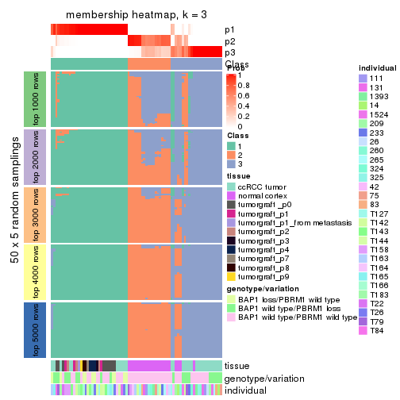</p>

</div>
<div id='tab-ATC-NMF-membership-heatmap-3'>
<pre><code class="r">membership_heatmap(res, k = 4)
</code></pre>

<p></p>

</div>
<div id='tab-ATC-NMF-membership-heatmap-4'>
<pre><code class="r">membership_heatmap(res, k = 5)
</code></pre>

<p></p>

</div>
<div id='tab-ATC-NMF-membership-heatmap-5'>
<pre><code class="r">membership_heatmap(res, k = 6)
</code></pre>

<p></p>

</div>
</div>

As soon as we have had the classes for columns, we can look for signatures
which are significantly different between classes which can be candidate marks
for certain classes. Following are the heatmaps for signatures.


Signature heatmaps where rows are scaled:


<script>
$( function() {
	$( '#tabs-ATC-NMF-get-signatures' ).tabs();
} );
</script>
<div id='tabs-ATC-NMF-get-signatures'>
<ul>
<li><a href='#tab-ATC-NMF-get-signatures-1'>k = 2</a></li>
<li><a href='#tab-ATC-NMF-get-signatures-2'>k = 3</a></li>
<li><a href='#tab-ATC-NMF-get-signatures-3'>k = 4</a></li>
<li><a href='#tab-ATC-NMF-get-signatures-4'>k = 5</a></li>
<li><a href='#tab-ATC-NMF-get-signatures-5'>k = 6</a></li>
</ul>
<div id='tab-ATC-NMF-get-signatures-1'>
<pre><code class="r">get_signatures(res, k = 2)
</code></pre>

<p></p>

</div>
<div id='tab-ATC-NMF-get-signatures-2'>
<pre><code class="r">get_signatures(res, k = 3)
</code></pre>

<p></p>

</div>
<div id='tab-ATC-NMF-get-signatures-3'>
<pre><code class="r">get_signatures(res, k = 4)
</code></pre>

<p></p>

</div>
<div id='tab-ATC-NMF-get-signatures-4'>
<pre><code class="r">get_signatures(res, k = 5)
</code></pre>

<p></p>

</div>
<div id='tab-ATC-NMF-get-signatures-5'>
<pre><code class="r">get_signatures(res, k = 6)
</code></pre>

<p></p>

</div>
</div>


Signature heatmaps where rows are not scaled:


<script>
$( function() {
	$( '#tabs-ATC-NMF-get-signatures-no-scale' ).tabs();
} );
</script>
<div id='tabs-ATC-NMF-get-signatures-no-scale'>
<ul>
<li><a href='#tab-ATC-NMF-get-signatures-no-scale-1'>k = 2</a></li>
<li><a href='#tab-ATC-NMF-get-signatures-no-scale-2'>k = 3</a></li>
<li><a href='#tab-ATC-NMF-get-signatures-no-scale-3'>k = 4</a></li>
<li><a href='#tab-ATC-NMF-get-signatures-no-scale-4'>k = 5</a></li>
<li><a href='#tab-ATC-NMF-get-signatures-no-scale-5'>k = 6</a></li>
</ul>
<div id='tab-ATC-NMF-get-signatures-no-scale-1'>
<pre><code class="r">get_signatures(res, k = 2, scale_rows = FALSE)
</code></pre>

<p></p>

</div>
<div id='tab-ATC-NMF-get-signatures-no-scale-2'>
<pre><code class="r">get_signatures(res, k = 3, scale_rows = FALSE)
</code></pre>

<p></p>

</div>
<div id='tab-ATC-NMF-get-signatures-no-scale-3'>
<pre><code class="r">get_signatures(res, k = 4, scale_rows = FALSE)
</code></pre>

<p></p>

</div>
<div id='tab-ATC-NMF-get-signatures-no-scale-4'>
<pre><code class="r">get_signatures(res, k = 5, scale_rows = FALSE)
</code></pre>

<p></p>

</div>
<div id='tab-ATC-NMF-get-signatures-no-scale-5'>
<pre><code class="r">get_signatures(res, k = 6, scale_rows = FALSE)
</code></pre>

<p></p>

</div>
</div>


Compare the overlap of signatures from different k:

```r
compare_signatures(res)
```


`get_signature()` returns a data frame invisibly. TO get the list of signatures, the function
call should be assigned to a variable explicitly. In following code, if `plot` argument is set
to `FALSE`, no heatmap is plotted while only the differential analysis is performed.

```r
# code only for demonstration
tb = get_signature(res, k = ..., plot = FALSE)
```

An example of the output of `tb` is:

```
#>   which_row         fdr    mean_1    mean_2 scaled_mean_1 scaled_mean_2 km
#> 1        38 0.042760348  8.373488  9.131774    -0.5533452     0.5164555  1
#> 2        40 0.018707592  7.106213  8.469186    -0.6173731     0.5762149  1
#> 3        55 0.019134737 10.221463 11.207825    -0.6159697     0.5749050  1
#> 4        59 0.006059896  5.921854  7.869574    -0.6899429     0.6439467  1
#> 5        60 0.018055526  8.928898 10.211722    -0.6204761     0.5791110  1
#> 6        98 0.009384629 15.714769 14.887706     0.6635654    -0.6193277  2
...
```

The columns in `tb` are:

1. `which_row`: row indices corresponding to the input matrix.
2. `fdr`: FDR for the differential test. 
3. `mean_x`: The mean value in group x.
4. `scaled_mean_x`: The mean value in group x after rows are scaled.
5. `km`: Row groups if k-means clustering is applied to rows.


UMAP plot which shows how samples are separated.


<script>
$( function() {
	$( '#tabs-ATC-NMF-dimension-reduction' ).tabs();
} );
</script>
<div id='tabs-ATC-NMF-dimension-reduction'>
<ul>
<li><a href='#tab-ATC-NMF-dimension-reduction-1'>k = 2</a></li>
<li><a href='#tab-ATC-NMF-dimension-reduction-2'>k = 3</a></li>
<li><a href='#tab-ATC-NMF-dimension-reduction-3'>k = 4</a></li>
<li><a href='#tab-ATC-NMF-dimension-reduction-4'>k = 5</a></li>
<li><a href='#tab-ATC-NMF-dimension-reduction-5'>k = 6</a></li>
</ul>
<div id='tab-ATC-NMF-dimension-reduction-1'>
<pre><code class="r">dimension_reduction(res, k = 2, method = &quot;UMAP&quot;)
</code></pre>

<p></p>

</div>
<div id='tab-ATC-NMF-dimension-reduction-2'>
<pre><code class="r">dimension_reduction(res, k = 3, method = &quot;UMAP&quot;)
</code></pre>

<p></p>

</div>
<div id='tab-ATC-NMF-dimension-reduction-3'>
<pre><code class="r">dimension_reduction(res, k = 4, method = &quot;UMAP&quot;)
</code></pre>

<p></p>

</div>
<div id='tab-ATC-NMF-dimension-reduction-4'>
<pre><code class="r">dimension_reduction(res, k = 5, method = &quot;UMAP&quot;)
</code></pre>

<p></p>

</div>
<div id='tab-ATC-NMF-dimension-reduction-5'>
<pre><code class="r">dimension_reduction(res, k = 6, method = &quot;UMAP&quot;)
</code></pre>

<p></p>

</div>
</div>


Following heatmap shows how subgroups are split when increasing `k`:

```r
collect_classes(res)
```


Test correlation between subgroups and known annotations. If the known
annotation is numeric, one-way ANOVA test is applied, and if the known
annotation is discrete, chi-squared contingency table test is applied.

```r
test_to_known_factors(res)
```

```
#>          n tissue(p) genotype/variation(p) individual(p) k
#> ATC:NMF 76  6.80e-07              5.88e-04        0.0267 2
#> ATC:NMF 69  2.81e-11              2.74e-05        0.2811 3
#> ATC:NMF 69  5.57e-12              1.44e-07        0.0740 4
#> ATC:NMF 64  4.15e-12              6.46e-06        0.0568 5
#> ATC:NMF 64  1.02e-12              4.42e-07        0.1445 6
```


If matrix rows can be associated to genes, consider to use `functional_enrichment(res,
...)` to perform function enrichment for the signature genes. See [this vignette](http://bioconductor.org/packages/devel/bioc/vignettes/cola/inst/doc/functional_enrichment.html) for more detailed explanations.


 

## Session info


```r
sessionInfo()
```

```
#> R version 3.6.0 (2019-04-26)
#> Platform: x86_64-pc-linux-gnu (64-bit)
#> Running under: CentOS Linux 7 (Core)
#> 
#> Matrix products: default
#> BLAS:   /usr/lib64/libblas.so.3.4.2
#> LAPACK: /usr/lib64/liblapack.so.3.4.2
#> 
#> locale:
#>  [1] LC_CTYPE=en_GB.UTF-8       LC_NUMERIC=C               LC_TIME=en_GB.UTF-8       
#>  [4] LC_COLLATE=en_GB.UTF-8     LC_MONETARY=en_GB.UTF-8    LC_MESSAGES=en_GB.UTF-8   
#>  [7] LC_PAPER=en_GB.UTF-8       LC_NAME=C                  LC_ADDRESS=C              
#> [10] LC_TELEPHONE=C             LC_MEASUREMENT=en_GB.UTF-8 LC_IDENTIFICATION=C       
#> 
#> attached base packages:
#> [1] grid      stats     graphics  grDevices utils     datasets  methods   base     
#> 
#> other attached packages:
#> [1] genefilter_1.66.0    ComplexHeatmap_2.3.1 markdown_1.1         knitr_1.26          
#> [5] GetoptLong_0.1.7     cola_1.3.2          
#> 
#> loaded via a namespace (and not attached):
#>  [1] circlize_0.4.8       shape_1.4.4          xfun_0.11            slam_0.1-46         
#>  [5] lattice_0.20-38      splines_3.6.0        colorspace_1.4-1     vctrs_0.2.0         
#>  [9] stats4_3.6.0         blob_1.2.0           XML_3.98-1.20        survival_2.44-1.1   
#> [13] rlang_0.4.2          pillar_1.4.2         DBI_1.0.0            BiocGenerics_0.30.0 
#> [17] bit64_0.9-7          RColorBrewer_1.1-2   matrixStats_0.55.0   stringr_1.4.0       
#> [21] GlobalOptions_0.1.1  evaluate_0.14        memoise_1.1.0        Biobase_2.44.0      
#> [25] IRanges_2.18.3       parallel_3.6.0       AnnotationDbi_1.46.1 highr_0.8           
#> [29] Rcpp_1.0.3           xtable_1.8-4         backports_1.1.5      S4Vectors_0.22.1    
#> [33] annotate_1.62.0      skmeans_0.2-11       bit_1.1-14           microbenchmark_1.4-7
#> [37] brew_1.0-6           impute_1.58.0        rjson_0.2.20         png_0.1-7           
#> [41] digest_0.6.23        stringi_1.4.3        polyclip_1.10-0      clue_0.3-57         
#> [45] tools_3.6.0          bitops_1.0-6         magrittr_1.5         eulerr_6.0.0        
#> [49] RCurl_1.95-4.12      RSQLite_2.1.4        tibble_2.1.3         cluster_2.1.0       
#> [53] crayon_1.3.4         pkgconfig_2.0.3      zeallot_0.1.0        Matrix_1.2-17       
#> [57] xml2_1.2.2           httr_1.4.1           R6_2.4.1             mclust_5.4.5        
#> [61] compiler_3.6.0
```


